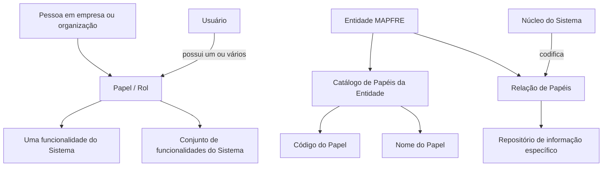
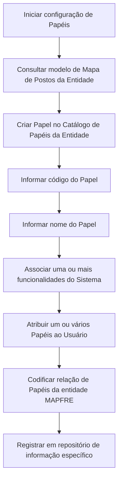

# Definição de Papéis por Entidade no REEF.core

## 1. Metadados do Documento
- **Arquivo de Origem:** Não identificado
- **Tipo de Documento:** Especificação Funcional
- **Domínio / Sistema:** REEF.core / Entidades MAPFRE
- **Público-Alvo:** Negócio, analistas funcionais, administradores do sistema e desenvolvedores
- **Data/Versão Identificada:** Não identificada

---

## 2. Resumo Executivo & Contexto de Negócio

O documento define o conceito de **Papel (Rol)** no âmbito tecnológico do sistema **REEF.core**. Um Papel está associado à função desempenhada por uma Pessoa em uma empresa ou organização e, no sistema, representa as ações que um Usuário pode realizar e executar.

Os Papéis conectam Usuários às funcionalidades disponíveis no sistema. Um Papel pode agrupar um conjunto de funcionalidades ou atender exclusivamente a uma funcionalidade específica. Um Usuário pode receber um ou mais Papéis.

O núcleo do sistema possui capacidade funcional para codificar a relação de Papéis de cada entidade MAPFRE em um repositório de informação específico. O catálogo de Papéis da Entidade contém, para cada Papel, um código identificador e um nome de reconhecimento.

O documento também referencia a necessidade de consultar a diretriz funcional de atribuição de Papéis a Usuários para evitar interpretações isoladas ou incorretas. Como recomendação de configuração, sugere-se iniciar o catálogo de Papéis de acordo com o modelo de **Mapa de Postos** da Entidade.

---

## 3. Arquitetura, Componentes & Tecnologias Envolvidas

Os componentes e conceitos explicitamente citados são:

| Componente / Conceito | Descrição fundamentada no documento |
| :--- | :--- |
| REEF.core | Âmbito tecnológico no qual Papéis representam as funções que um Usuário pode realizar e executar no Sistema. |
| Usuário | Entidade que pode possuir um ou vários Papéis atribuídos. |
| Papel / Rol | Representação da função que uma Pessoa desempenha em uma organização e das funcionalidades que um Usuário pode executar no Sistema. |
| Funcionalidade do Sistema | Capacidade do Sistema vinculada a um Papel; um Papel pode agrupar várias funcionalidades ou corresponder a somente uma. |
| Entidade MAPFRE | Entidade cuja relação de Papéis pode ser codificada pelo núcleo do Sistema. |
| Catálogo de Papéis da Entidade | Catálogo que contém atributos identificativos do Papel, incluindo código e nome. |
| Repositório de informação específico | Repositório no qual o núcleo do Sistema pode codificar a relação de Papéis de cada entidade MAPFRE. |
| Mapa de Postos da Entidade | Modelo recomendado como referência para iniciar a configuração de Papéis no catálogo. |



**Nota de Análise:** o documento não detalha tecnologias de implementação, APIs, métodos HTTP, estruturas JSON, bancos de dados, URLs, ambientes ou mecanismos concretos de persistência do repositório de informação específico.

---

## 4. Regras de Negócio, Especificações Funcionais & Processos

1. O conceito de Papel está vinculado à função que uma Pessoa desempenha em uma empresa ou organização.
2. No âmbito tecnológico do REEF.core, um Papel refere-se às funções que um Usuário pode realizar e executar no Sistema.
3. Os Papéis conectam os Usuários às funcionalidades do Sistema.
4. Um Papel pode agrupar um conjunto de funcionalidades do Sistema.
5. Um Papel pode ser associado a uma única funcionalidade do Sistema.
6. Um Usuário pode possuir um ou vários Papéis atribuídos.
7. O núcleo do Sistema possui a possibilidade de codificar a relação de Papéis de cada entidade MAPFRE.
8. A relação de Papéis de cada entidade MAPFRE é mantida em um repositório de informação específico.
9. O atributo **Rol** do catálogo de Papéis da Entidade contém o código do Papel.
10. O atributo **Nombre del Rol** do catálogo de Papéis da Entidade contém o nome utilizado para reconhecer e denominar o Papel criado.
11. A leitura do documento funcional **“Asignación de Roles a los Usuarios del Sistema”** é recomendada para evitar erros causados pela interpretação isolada deste documento.
12. Como boa prática, a configuração inicial dos Papéis no catálogo pode seguir o modelo de Mapa de Postos da Entidade.



---

## 5. Tabelas de Parâmetros, Ambientes e Estruturas de Dados

| Item / Parâmetro | Descrição / Função | Tipo / Valores / Formato | Ambiente / Observações |
| :--- | :--- | :--- | :--- |
| Rol | Atributo do catálogo de Papéis da Entidade que contém o código do Papel. | Código do Papel; formato não detalhado. | Catálogo de Papéis da Entidade. |
| Nombre del Rol | Atributo que contém o nome pelo qual o Papel criado será reconhecido e denominado. | Nome do Papel; formato não detalhado. | Catálogo de Papéis da Entidade. |
| Papel / Rol | Função associada a uma Pessoa e às ações que um Usuário pode realizar no Sistema. | Pode agrupar várias funcionalidades ou uma funcionalidade única. | REEF.core. |
| Usuário | Sujeito que recebe atribuições de Papéis. | Um Usuário pode possuir um ou vários Papéis. | Sistema. |
| Relação de Papéis | Relação de Papéis aplicável a cada entidade MAPFRE. | Não detalhada. | Codificada pelo núcleo do Sistema em repositório específico. |
| Repositório de informação específico | Local de informação utilizado para codificar a relação de Papéis de cada entidade MAPFRE. | Tecnologia, localização e estrutura não detalhadas. | Núcleo do Sistema. |
| Mapa de Postos da Entidade | Modelo recomendado para orientar o início da configuração dos Papéis. | Modelo organizacional; detalhamento não fornecido. | Boa prática de configuração. |
| Documento relacionado | “Asignación de Roles a los Usuarios del Sistema”. | Diretriz ou documento funcional relacionado. | Leitura recomendada para evitar interpretação isolada. |

---

## 6. Bateria de Perguntas & Respostas para RAG (FAQ Sintético)

### P1: O que representa um Papel no REEF.core?
**R:** No âmbito tecnológico do REEF.core, um Papel representa as funções que um Usuário pode realizar e executar no Sistema. O conceito também está vinculado à função que uma Pessoa desempenha em uma empresa ou organização.

### P2: Como os Papéis se relacionam com as funcionalidades do Sistema?
**R:** Os Papéis permitem conectar Usuários às funcionalidades do Sistema. Um Papel pode agrupar um conjunto de funcionalidades ou servir a uma única funcionalidade do Sistema.

### P3: Um Usuário pode ter mais de um Papel atribuído?
**R:** Sim. O documento informa expressamente que um Usuário pode ter atribuídos um ou vários Papéis.

### P4: Qual é a finalidade do catálogo de Papéis da Entidade?
**R:** O catálogo de Papéis da Entidade armazena os dados identificativos dos Papéis. O atributo Rol contém o código do Papel, e o atributo Nombre del Rol contém o nome utilizado para reconhecer e denominar o Papel criado.

### P5: O que o atributo Rol contém no catálogo de Papéis da Entidade?
**R:** O atributo Rol contém o código do Papel.

### P6: Para que serve o atributo Nombre del Rol?
**R:** O atributo Nombre del Rol contém o nome pelo qual o Papel criado será reconhecido e denominado.

### P7: Onde é codificada a relação de Papéis de cada entidade MAPFRE?
**R:** O núcleo do Sistema possui a possibilidade de codificar a relação de Papéis de cada entidade MAPFRE em um repositório de informação específico.

### P8: O documento informa qual tecnologia é usada pelo repositório de informação específico?
**R:** Não. O documento apenas informa que existe um repositório de informação específico para a relação de Papéis de cada entidade MAPFRE; não detalha tecnologia, localização, banco de dados ou estrutura de dados.

### P9: Qual é a recomendação para iniciar a configuração do catálogo de Papéis?
**R:** A recomendação apresentada como boa prática é iniciar a configuração dos Papéis no catálogo conforme o modelo de Mapa de Postos da Entidade.

### P10: Que documentação relacionada deve ser consultada para evitar interpretação isolada?
**R:** Deve ser consultada a diretriz ou documento funcional denominado “Asignación de Roles a los Usuarios del Sistema”, cuja leitura é recomendada para evitar que a interpretação isolada do documento conduza a erro.

---

## 7. Glossário de Termos, Siglas & Conceitos-Chave

- **REEF.core:** Sistema ou âmbito tecnológico citado no documento, no qual Papéis definem funções que Usuários podem realizar e executar.
- **Papel / Rol:** Função desempenhada por uma Pessoa em uma organização e mecanismo de associação entre Usuários e funcionalidades do Sistema.
- **Usuário:** Entidade que pode receber um ou mais Papéis no Sistema.
- **Funcionalidade do Sistema:** Capacidade do Sistema que pode ser associada individualmente a um Papel ou agrupada com outras funcionalidades.
- **Entidade MAPFRE:** Entidade para a qual a relação de Papéis pode ser codificada pelo núcleo do Sistema.
- **Catálogo de Papéis da Entidade:** Estrutura que contém os atributos identificativos dos Papéis da Entidade.
- **Rol:** Atributo que contém o código do Papel.
- **Nombre del Rol:** Atributo que contém o nome de reconhecimento e denominação do Papel criado.
- **Mapa de Postos da Entidade:** Modelo recomendado como referência inicial para configurar Papéis.
- **Repositório de informação específico:** Repositório mencionado como destino da codificação da relação de Papéis de cada entidade MAPFRE.

---

## 8. Notas Críticas, Riscos & Limitações

- O documento não define o formato, tamanho, unicidade ou regras de validação do código do Papel.
- O documento não especifica regras de criação, atualização, exclusão, expiração ou desativação de Papéis.
- Não há matriz de permissões que relacione Papéis e funcionalidades específicas.
- O mecanismo de atribuição de Papéis aos Usuários não é detalhado; o documento relacionado “Asignación de Roles a los Usuarios del Sistema” deve ser consultado.
- Não são descritos contratos de integração, APIs, métodos HTTP, formatos de mensagens, autenticação ou autorização.
- O repositório de informação específico é citado sem tecnologia, localização, esquema ou estratégia de persistência.
- A recomendação de utilizar o Mapa de Postos da Entidade é apresentada como boa prática, mas o documento não impõe essa prática como regra obrigatória.

---

## 9. Conteúdo Bruto Estruturado (Referência Fiel)

```text
--- [PÁGINA 1 DE 2] ---

DEFINICIÓN de los Roles por Entidad
Contexto
El concepto del Rol está vinculado a la función que una Persona desempeña en una empresa u
organización y en el ámbito tecnológico de Reef.core se refiere a las funciones que un Usuario puede
realizar y ejecutar en el Sistema.
Los Roles permiten conectar a los Usuarios con las funcionalidades del Sistema:
Un Rol puede agrupar un conjunto de funcionalidades o servir a una única funcionalidad del
Sistema, y
Un Usuario puede tener asignados uno o varios Roles.
Funcionalmente, el núcleo del Sistema cuenta con la posibilidad de codificar la relación de Roles de
cada entidad MAPFRE en un repositorio de información específico.
Datos Identificativos
Rol
Este Atributo del catálogo de Roles de la Entidad contiene el código del Rol.
Nombre del Rol
Este Atributo del catálogo de Roles de la Entidad contiene el nombre por el que vamos a reconocer y
denominar al Rol creado.
 /
 CF
Home Solutions APIs Documentation Zeus
EN


--- [PÁGINA 2 DE 2] ---

Vínculos
Relación de Directrices y Documentos funcionales cuya lectura recomendada para evitar que la
interpretación aislada del presente documento pueda conducir a error.
Asignación de Roles a los Usuarios del Sistema
Preguntas frecuentes
(1) ¿Existe alguna recomendación que pueda ser tomada en consideración en el uso y definición del
Catálogo de Roles de la Entidad?
Puede ser una buena práctica iniciar la configuración de los Roles en este catálogo de acuerdo con
el modelo de Mapa de Puestos de la Entidad.
```
