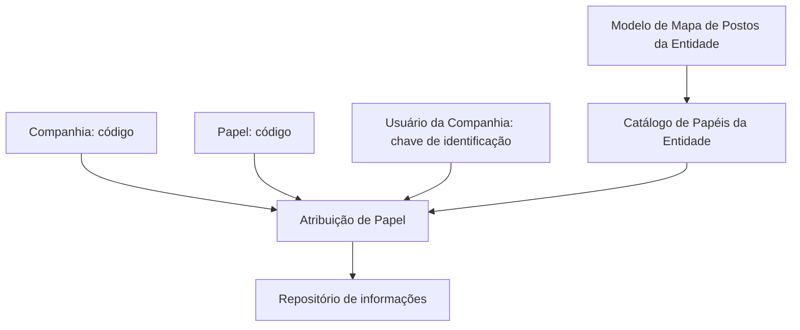
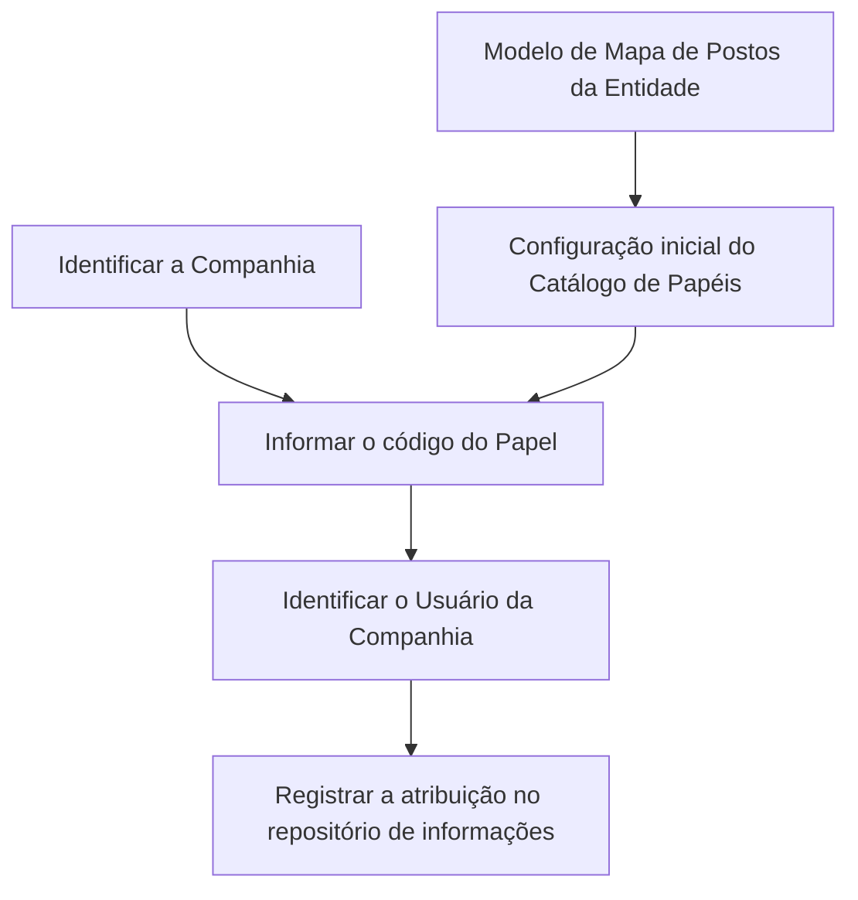

# Atribuição de Papéis a Usuários do Sistema — Catálogo de Papéis por Entidade

## 1. Metadados do Documento
- **Arquivo de Origem:** `Não identificado no conteúdo fornecido`
- **Tipo de Documento:** Especificação Funcional
- **Domínio / Sistema:** Sistema — Catálogo de Papéis da Entidade
- **Público-Alvo:** Negócio, Analistas Funcionais, Administradores do Sistema
- **Data/Versão Identificada:** Não identificada

---

## 2. Resumo Executivo & Contexto de Negócio

O documento descreve a funcionalidade de atribuição de um ou mais papéis (*roles*) a usuários de uma companhia dentro do núcleo do Sistema. As atribuições são mantidas em um repositório de informações criado para essa finalidade.

A identificação de cada atribuição utiliza três atributos: a companhia sobre a qual a atribuição é realizada, o papel atribuído e a chave de identificação do usuário da companhia que recebe o papel. O documento não detalha operações de criação, alteração, remoção ou consulta dessas atribuições.

Como diretriz de configuração, o documento recomenda iniciar a definição dos papéis no Catálogo de Papéis da Entidade conforme o modelo de Mapa de Postos da Entidade. Essa recomendação busca alinhar a estrutura de papéis à organização funcional da entidade.

O documento também referencia “Roles por Entidad” como material cuja leitura é recomendada para evitar interpretações isoladas e incorretas. Não são apresentados detalhes adicionais sobre regras de autorização, permissões associadas aos papéis, contratos técnicos ou interfaces do Sistema.

---

## 3. Arquitetura, Componentes & Tecnologias Envolvidas

### Componentes e entidades identificados

| Componente / Entidade | Descrição sustentada pelo documento |
| :--- | :--- |
| Sistema | Núcleo que permite atribuir um ou mais papéis a usuários da companhia. |
| Repositório de informações | Repositório criado para registrar a atribuição de papéis aos usuários. |
| Catálogo de Papéis da Entidade | Catálogo que contém atributos referentes à companhia, ao papel e ao usuário da companhia. |
| Companhia | Entidade cujo código identifica a companhia para a qual o papel está sendo atribuído. |
| Papel / Rol | Código do papel atribuído ao usuário. |
| Usuário da Companhia | Usuário identificado por uma chave de identificação e destinatário da atribuição do papel. |
| Mapa de Postos da Entidade | Modelo recomendado como referência para iniciar a configuração dos papéis. |
| Roles por Entidad | Documento funcional recomendado para leitura complementar. |



**Nota de Análise:** o documento não especifica tecnologias, bancos de dados, APIs, métodos HTTP, contratos JSON, ambientes, servidores ou mecanismos de autenticação/autorização.

---

## 4. Regras de Negócio, Especificações Funcionais & Processos

### Regras funcionais identificadas

1. O núcleo do Sistema possui a capacidade de atribuir um ou mais papéis a usuários da companhia.
2. A atribuição de papéis é registrada em um repositório de informações criado para essa finalidade.
3. O atributo **Companhia** contém o código da companhia sobre a qual está sendo realizada a atribuição do papel.
4. O atributo **Papel** contém o código do papel que está sendo atribuído ao usuário.
5. O atributo **Usuário da Companhia** contém a chave de identificação do usuário que recebe o papel.
6. A configuração dos papéis no Catálogo de Papéis da Entidade deve, como boa prática, ser iniciada conforme o modelo de Mapa de Postos da Entidade.
7. A leitura do documento “Roles por Entidad” é recomendada para reduzir o risco de interpretações incorretas decorrentes da análise isolada deste documento.

### Fluxo funcional extraído



**Nota de Análise:** o conteúdo não informa critérios para validar códigos, quantidade máxima de papéis, segregação de funções, aprovação da atribuição, vigência, revogação de papéis ou efeitos de autorização decorrentes da associação.

---

## 5. Tabelas de Parâmetros, Ambientes e Estruturas de Dados

| Item / Parâmetro | Descrição / Função | Tipo / Valores / Formato | Ambiente / Observações |
| :--- | :--- | :--- | :--- |
| Companhia | Código da companhia sobre a qual a atribuição do papel é realizada. | Código da companhia; formato não especificado. | Atributo do catálogo. |
| Papel / Rol | Código do papel atribuído ao usuário. | Código do papel; formato não especificado. | Atributo do catálogo. |
| Usuário da Companhia | Chave de identificação do usuário que recebe o papel. | Chave de identificação; formato não especificado. | Atributo do Catálogo de Papéis da Entidade. |
| Atribuição de papel | Associação de um ou mais papéis a um usuário da companhia. | Relação entre companhia, papel e usuário. | Persistida em repositório de informações. |
| Catálogo de Papéis da Entidade | Catálogo utilizado para configurar e organizar os papéis da entidade. | Não especificado. | Deve ser configurado, como boa prática, segundo o Mapa de Postos da Entidade. |
| Mapa de Postos da Entidade | Modelo recomendado para iniciar a configuração dos papéis. | Não especificado. | Referência organizacional recomendada. |
| Roles por Entidad | Documento funcional de leitura recomendada. | Documento relacionado. | Deve ser consultado para evitar interpretação isolada do presente documento. |

**Nota de Análise:** o documento não apresenta URLs de ambiente, rotas de log, nomes de servidores, parâmetros técnicos de implantação ou estruturas de dados adicionais.

---

## 6. Bateria de Perguntas & Respostas para RAG (FAQ Sintético)

### P1: Qual é a funcionalidade principal descrita para o núcleo do Sistema?
**R:** O núcleo do Sistema permite atribuir um ou mais papéis a usuários de uma companhia. Essas atribuições são registradas em um repositório de informações criado para essa finalidade.

### P2: Quais atributos identificam uma atribuição de papel a um usuário?
**R:** A atribuição utiliza os atributos Companhia, Papel e Usuário da Companhia. Companhia contém o código da companhia; Papel contém o código do papel atribuído; e Usuário da Companhia contém a chave de identificação do usuário que recebe o papel.

### P3: O que representa o atributo Companhia no Catálogo de Papéis?
**R:** O atributo Companhia contém o código da companhia sobre a qual está sendo realizada a atribuição do papel ao usuário.

### P4: O que representa o atributo Papel ou Rol?
**R:** O atributo Papel ou Rol contém o código do papel que está sendo atribuído ao usuário da companhia.

### P5: Como o usuário destinatário do papel é identificado?
**R:** O usuário destinatário é identificado pelo atributo Usuário da Companhia, que contém a chave de identificação do usuário ao qual o papel está sendo atribuído.

### P6: Um usuário pode receber mais de um papel?
**R:** Sim. O documento afirma que o núcleo do Sistema permite atribuir um ou mais papéis aos usuários da companhia.

### P7: Onde são mantidas as atribuições de papéis?
**R:** As atribuições são mantidas em um repositório de informações criado para essa finalidade. O documento não especifica a tecnologia, localização ou estrutura desse repositório.

### P8: Qual é a boa prática recomendada para configurar os papéis?
**R:** A boa prática recomendada é iniciar a configuração dos papéis no Catálogo de Papéis da Entidade de acordo com o modelo de Mapa de Postos da Entidade.

### P9: Qual documento complementar deve ser consultado?
**R:** O documento recomenda a leitura de “Roles por Entidad”, pois a interpretação isolada do presente documento pode conduzir a erro.

### P10: O documento detalha permissões ou autorizações concedidas por cada papel?
**R:** Não. O documento informa a atribuição de códigos de papéis a usuários, mas não detalha permissões, matrizes de acesso, regras de autorização ou capacidades associadas a cada papel.

---

## 7. Glossário de Termos, Siglas & Conceitos-Chave

- **Catálogo de Papéis da Entidade:** catálogo que contém dados usados na atribuição de papéis, incluindo companhia, papel e usuário da companhia.
- **Companhia:** entidade identificada por um código e sobre a qual uma atribuição de papel é realizada.
- **Mapa de Postos da Entidade:** modelo recomendado como referência para a configuração inicial dos papéis.
- **Papel / Rol:** código atribuído a um usuário no contexto de uma companhia.
- **Repositório de informações:** repositório criado para armazenar as atribuições de papéis aos usuários.
- **Roles por Entidad:** documento funcional complementar recomendado para leitura.

---

## 8. Notas Críticas, Riscos & Limitações

- A interpretação isolada do documento pode conduzir a erro; a leitura de “Roles por Entidad” é expressamente recomendada.
- O documento não define permissões, capacidades ou restrições associadas a cada papel.
- Não há especificação de procedimentos para inclusão, alteração, exclusão, revogação ou auditoria de atribuições.
- Não são apresentados critérios de validação para códigos de companhia, códigos de papel ou chaves de identificação de usuários.
- Não há detalhamento de integração, API, interface de usuário, segurança, autenticação, ambientes ou infraestrutura.
- O documento recomenda o alinhamento do Catálogo de Papéis ao Mapa de Postos da Entidade, mas não descreve o modelo nem seu processo de aplicação.

---

## 9. Conteúdo Bruto Estruturado (Referência Fiel)

```text
--- [PÁGINA 1 DE 2] ---

ASIGNACIÓN de Roles a los Usuarios del
Sistema
Contexto
Funcionalmente, el núcleo del Sistema cuenta con la posibilidad de asignar uno o n roles a los
usuarios de la compañía en un repositorio de información creado al efecto.
Datos Identificativos
Compañía
Este Atributo del catálogo contiene el código de la compañía sobre la cual se está realizando la
asignación del Rol.
Rol
Este Atributo del catálogo contiene el código del Rol que se está asignando al Usuario.
Usuario de la Compañía
Este Atributo del catálogo de Roles de la Entidad contiene la clave de identificación del Usuario al
que se le está asignando el Rol.
Vínculos
 /
 CF
Home Solutions APIs Documentation Zeus
EN


--- [PÁGINA 2 DE 2] ---

Relación de Directrices y Documentos funcionales cuya lectura recomendada para evitar que la
interpretación aislada del presente documento pueda conducir a error.
Roles por Entidad
Preguntas frecuentes
(1) ¿Existe alguna recomendación que pueda ser tomada en consideración en el uso y definición del
Catálogo de Roles de la Entidad?
Es una buena práctica iniciar la configuración de los Roles en este catálogo de acuerdo con el
modelo de Mapa de Puestos de la Entidad.
```
