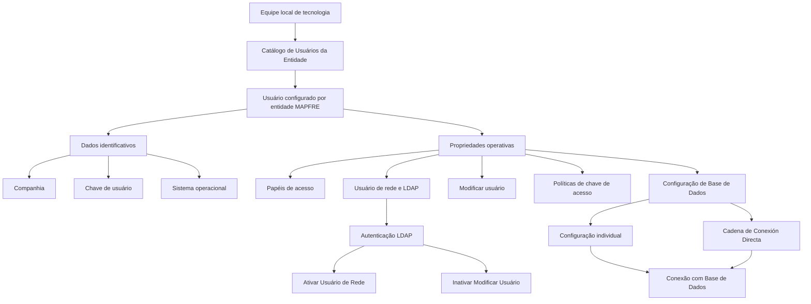

# Definição de Usuários no Servidor de Aplicações Reef.core por Entidade MAPFRE

## 1. Metadados do Documento
- **Arquivo de Origem:** `Não identificado — conteúdo bruto fornecido pelo usuário`
- **Tipo de Documento:** Manual Operacional / Especificação Funcional
- **Domínio / Sistema:** Reef.core; Servidor de Aplicações; entidades MAPFRE; acesso a Base de Dados
- **Público-Alvo:** Equipe local de tecnologia, administradores de aplicação, operação e segurança
- **Data/Versão Identificada:** Não identificada

---

## 2. Resumo Executivo & Contexto de Negócio

O documento descreve a definição e a configuração de usuários no Servidor de Aplicações do sistema Reef.core. Para cada usuário configurado e para cada entidade MAPFRE em que esse usuário possa operar, devem ser mantidos dados de acesso em um repositório de informação específico.

A configuração contempla dados identificativos — companhia, código do usuário e sistema operacional — e propriedades operativas relacionadas a papéis de acesso, autenticação, permissões de alteração, acesso à aplicação e conectividade com a Base de Dados.

A gestão dos usuários possui implicações diretas de segurança. O documento define controles para LDAP, coincidência entre usuário de rede e usuário do Servidor de Aplicações, alteração de usuários, expiração de senha, composição alfanumérica e comprimento mínimo e máximo da chave de acesso.

Também são descritas duas abordagens para conexão: configuração individual dos atributos de aplicação e Base de Dados, ou uso de uma cadeia de conexão direta. Quando a cadeia de conexão direta possui valor, ela substitui internamente as definições individuais de conexão.

As tarefas de configuração são responsabilidade exclusiva da equipe local de tecnologia. Como boa prática, a configuração do Catálogo de Usuários da Entidade deve considerar as recomendações emitidas pela Dirección de Seguridad Corporativa (DISMA).

---

## 3. Arquitetura, Componentes & Tecnologias Envolvidas

Os componentes e conceitos identificados são:

- **Reef.core:** sistema no qual usuários e dados de acesso devem ser configurados.
- **Servidor de Aplicações:** ambiente que possui usuário, chave de acesso e regras de conexão.
- **Catálogo de Usuários da Entidade:** catálogo utilizado para definir usuários e suas propriedades de acesso.
- **Entidade MAPFRE / Companhia:** contexto organizacional para o qual a definição de usuário é realizada.
- **Usuário de Rede:** usuário que pode precisar coincidir com o usuário do Servidor de Aplicações.
- **LDAP:** mecanismo de autenticação que, quando ativado, exige a ativação da propriedade de Usuário de Rede e a inativação da propriedade Modificar Usuário.
- **Base de Dados (BB.DD):** destino da conexão configurada com usuário, chave e cadeia de conexão.
- **SAPTRON:** usuário citado na propriedade “Conexão a BB.DD com Usuário SAPTRON”.
- **JSPOOL:** domínio funcional identificado em papéis administrativos, de superusuário, usuário e operador.
- **Web Reef.core:** domínio funcional identificado nos papéis de operador e administrador web.
- **DISMA:** fonte de recomendações de segurança para a configuração de usuários.



**Nota de Análise:** o documento não informa versões do Reef.core, protocolo LDAP, fornecedor da Base de Dados, métodos de autenticação adicionais, formato exato da cadeia de conexão ou contratos técnicos de integração.

---

## 4. Regras de Negócio, Especificações Funcionais & Processos

### 4.1 Responsabilidade de configuração

- A configuração de usuários e respectivos dados de acesso no Reef.core é responsabilidade exclusiva da equipe local de tecnologia.
- A configuração deve ser realizada para todos os usuários configurados e para cada entidade MAPFRE na qual cada usuário possa operar.
- Os dados de acesso devem ser mantidos em um repositório de informação específico.

### 4.2 Dados identificativos

Para cada definição de usuário, devem ser considerados:

1. **Companhia:** código da companhia sobre a qual a definição de usuário e seus dados de acesso está sendo realizada.
2. **Chave de Usuário:** código do usuário para o qual os dados de acesso estão sendo definidos.
3. **Sistema Operacional:** tipo de sistema operacional do equipamento do usuário usado para conexão ao sistema.

### 4.3 Papéis de acesso

- Um usuário pode possuir uma relação de papéis de acesso.
- Por padrão, usuários são criados com os papéis **PRG** e **OJP**.
- Para atribuir mais de um papel ao usuário, os códigos dos papéis devem ser separados por um espaço em branco.

### 4.4 Usuário de rede, LDAP e alteração de usuário

- A propriedade **Usuário de Rede** define se o usuário do Servidor de Aplicações deve coincidir com o usuário de rede.
- Quando LDAP for ativado como mecanismo de autenticação de usuários na aplicação:
  - a propriedade **Usuário de Rede** deve ser ativada;
  - a propriedade **Modificar Usuário** deve permanecer inativa.
- A propriedade **Modificar Usuário** indica se o usuário pode ser modificado após a configuração.

### 4.5 Conexão com Base de Dados

- A propriedade **Conexão a BB.DD com Usuário SAPTRON** define se a conexão à Base de Dados deve ou não ser realizada com o usuário do Servidor de Aplicações.
- A propriedade **Usuário de Acesso a BB.DD** define o usuário de acesso à Base de Dados.
- A propriedade **Chave de Acesso a BB.DD** define a chave de acesso à Base de Dados do usuário.
- A propriedade **Cadena de Conexión a la BB.DD** contém a cadeia de conexão com a Base de Dados, incluindo host, porta, protocolo e outros elementos não detalhados.

### 4.6 Acesso à aplicação e política de chaves

- **Acesso sem Chave:** define se o usuário pode acessar diretamente a aplicação usando o código de usuário.
- **Chave do Servidor de Aplicações:** define a chave de acesso ao Servidor de Aplicações.
- **Dias de Validade da Chave:** define o número de dias para que a chave de acesso seja considerada expirada.
  - Valor `0`: não é validada nenhuma expiração.
- **Data da Última Modificação da Chave de Acesso:** registra a data da última alteração da chave de acesso.
- **Obrigatoriedade de Alterar a Chave de Acesso:** indica se é obrigatório alterar a chave conforme os parâmetros de dias de validade e data da última modificação.
- **Números e Letras na Chave de Acesso:** define se a chave deve ser composta por uma combinação de letras e números.
- **Comprimento Mínimo:** define o tamanho mínimo da chave.
  - Valor `0`: nenhum comprimento mínimo é validado.
- **Comprimento Máximo:** define o tamanho máximo da chave.
  - Valor `0`: nenhum comprimento máximo é validado.

### 4.7 Cadeia de conexão direta

- Quando a propriedade **Cadena de Conexión Directa** possui valor, o sistema altera internamente a forma de realizar a conexão com a aplicação.
- Nessa condição, o sistema deixa de considerar as definições individuais das propriedades de conexão.
- A cadeia deve conter:
  1. Usuário do Servidor de Aplicações;
  2. Chave do usuário do Servidor de Aplicações;
  3. Usuário de acesso à Base de Dados;
  4. Chave de acesso à Base de Dados;
  5. Cadeia de conexão à Base de Dados.

---

## 5. Tabelas de Parâmetros, Ambientes e Estruturas de Dados

| Item / Parâmetro | Descrição / Função | Tipo / Valores / Formato | Ambiente / Observações |
| :--- | :--- | :--- | :--- |
| Companhia | Código da companhia sobre a qual a definição de usuários e acessos é realizada. | Código de companhia; formato não detalhado. | Entidade MAPFRE. |
| Chave de Usuário | Código do usuário para o qual os dados de acesso são definidos. | Código de usuário; formato não detalhado. | Catálogo de Usuários da Entidade. |
| Sistema Operacional | Tipo de sistema operacional do equipamento do usuário que se conecta ao sistema. | Tipo de sistema operacional; valores não detalhados. | Equipamento do usuário. |
| Papéis de Acesso | Relação de papéis atribuídos ao usuário. | Um ou mais códigos de papel separados por espaço em branco. | Padrão de criação: `PRG` e `OJP`. |
| Usuário de Rede | Define se o usuário do Servidor de Aplicações e o usuário de rede devem coincidir. | Propriedade booleana; valores literais não detalhados. | Deve ser ativada quando LDAP for utilizado. |
| Modificar Usuário | Define se o usuário pode ser alterado após sua configuração. | Propriedade booleana; valores literais não detalhados. | Deve ficar inativa quando LDAP estiver ativo. |
| Conexão a BB.DD com Usuário SAPTRON | Define se a conexão à Base de Dados deve ser realizada com o usuário do Servidor de Aplicações. | Propriedade booleana; valores literais não detalhados. | Relacionada à Base de Dados. |
| Acesso sem Chave | Define se o usuário pode acessar diretamente a aplicação utilizando o código de usuário. | Propriedade booleana; valores literais não detalhados. | Acesso à aplicação. |
| Chave do Servidor de Aplicações | Define a chave de acesso ao Servidor de Aplicações. | Chave; formato não detalhado. | Servidor de Aplicações. |
| Usuário de Acesso a BB.DD | Define o usuário utilizado no acesso à Base de Dados. | Usuário; formato não detalhado. | Base de Dados. |
| Chave de Acesso a BB.DD | Define a chave de acesso à Base de Dados do usuário. | Chave; formato não detalhado. | Base de Dados. |
| Cadena de Conexión a la BB.DD | Contém a cadeia de conexão à Base de Dados. | Deve incluir host, porta, protocolo e possivelmente outros elementos. | Base de Dados. |
| Dias de Validade da Chave | Define os dias necessários para considerar uma chave expirada. | Número inteiro; `0` desativa a validação de expiração. | Política de chave de acesso. |
| Data da Última Modificação da Chave de Acesso | Registra a data da última modificação da chave. | Data; formato não detalhado. | Política de chave de acesso. |
| Obrigatoriedade de Alterar a Chave de Acesso | Define se a alteração da chave é obrigatória conforme validade e última modificação. | Propriedade booleana; valores literais não detalhados. | Política de chave de acesso. |
| Números e Letras na Chave de Acesso | Define se a chave deve combinar letras e números. | Propriedade booleana; valores literais não detalhados. | Política de chave de acesso. |
| Comprimento Mínimo | Define o tamanho mínimo exigido para a chave. | Número inteiro; `0` desativa a validação de tamanho mínimo. | Política de chave de acesso. |
| Comprimento Máximo | Define o tamanho máximo permitido para a chave. | Número inteiro; `0` desativa a validação de tamanho máximo. | Política de chave de acesso. |
| Cadena de Conexión Directa | Substitui a consideração das propriedades individuais de conexão quando possui valor. | Cadeia contendo dados de usuário, chaves e conexão à Base de Dados. | Conexão interna à aplicação. |

| Papel | Descrição |
| :--- | :--- |
| `SUA/ADM` | Super Usuário / Administrador |
| `PRG` | Usuário / Operador |
| `AJP/EJP` | Administrador / Super Usuário JSPOOL |
| `UJP` | Usuário JSPOOL |
| `OJP` | Operador JSPOOL |
| `WTWPRG` | Operador Web Reef.core |
| `WTWADM` | Administrador Web Reef.core |

---

## 6. Bateria de Perguntas & Respostas para RAG (FAQ Sintético)

### P1: Qual equipe é responsável por configurar usuários no Servidor de Aplicações do Reef.core?
**R:** As tarefas de configuração de usuários e respectivos dados de acesso no Reef.core são responsabilidade exclusiva da equipe local de tecnologia.

### P2: Para quais contextos organizacionais um usuário deve ser configurado no Reef.core?
**R:** O usuário deve ser configurado para cada entidade MAPFRE em que possa operar. A propriedade Companhia identifica o código da companhia sobre a qual a definição do usuário e seus dados de acesso está sendo realizada.

### P3: Quais papéis são atribuídos por padrão a um novo usuário?
**R:** Por padrão, os usuários são criados com os papéis `PRG` e `OJP`. O papel `PRG` corresponde a Usuário / Operador e o papel `OJP` corresponde a Operador JSPOOL.

### P4: Como atribuir mais de um papel de acesso a um usuário?
**R:** Para atribuir mais de um papel ao usuário, os códigos dos papéis devem ser separados por um espaço em branco na relação de Papéis de Acesso.

### P5: O que deve ser configurado quando LDAP é usado para autenticação?
**R:** Quando LDAP é ativado como autenticação de usuários na aplicação, a propriedade Usuário de Rede deve ser ativada e a propriedade Modificar Usuário deve permanecer inativa.

### P6: Qual é a função da propriedade Usuário de Rede?
**R:** A propriedade Usuário de Rede estabelece se o usuário do Servidor de Aplicações e o usuário de rede devem coincidir.

### P7: O que acontece se Dias de Validade da Chave for igual a zero?
**R:** Quando Dias de Validade da Chave possui valor `0`, não é realizada validação de expiração da chave de acesso.

### P8: O que acontece se Comprimento Mínimo ou Comprimento Máximo for igual a zero?
**R:** Se Comprimento Mínimo possuir valor `0`, nenhuma validação de comprimento mínimo é aplicada. Se Comprimento Máximo possuir valor `0`, nenhuma validação de comprimento máximo é aplicada.

### P9: Quais informações a Cadena de Conexión a la BB.DD contém?
**R:** A Cadena de Conexión a la BB.DD contém a cadeia de conexão com a Base de Dados, incluindo host, porta, protocolo e outros elementos não especificados no documento.

### P10: Quando a Cadena de Conexión Directa deve ser considerada na conexão?
**R:** Quando a Cadena de Conexión Directa possui valor atribuído, ela muda a forma interna pela qual o sistema realiza a conexão com a aplicação. Nesse caso, o sistema considera o valor da cadeia em vez das definições individuais das propriedades de conexão.

### P11: Quais elementos devem estar presentes na Cadena de Conexión Directa?
**R:** A Cadena de Conexión Directa deve conter o usuário do Servidor de Aplicações, a chave do usuário do Servidor de Aplicações, o usuário de acesso à Base de Dados, a chave de acesso à Base de Dados e a cadeia de conexão à Base de Dados.

### P12: O que define a propriedade Conexão a BB.DD com Usuário SAPTRON?
**R:** Essa propriedade estabelece se a conexão à Base de Dados deve ou não ser realizada usando o usuário do Servidor de Aplicações.

### P13: Qual recomendação de segurança é indicada para o Catálogo de Usuários da Entidade?
**R:** O documento recomenda como boa prática configurar os usuários no catálogo considerando as recomendações emitidas pela Dirección de Seguridad Corporativa (DISMA).

---

## 7. Glossário de Termos, Siglas & Conceitos-Chave

- **BB.DD:** Base de Dados.
- **Cadena de Conexión Directa:** cadeia que, quando possui valor, substitui as definições individuais usadas internamente para conexão à aplicação.
- **Cadena de Conexión a la BB.DD:** cadeia de conexão da Base de Dados, contendo host, porta, protocolo e outros elementos.
- **DISMA:** Dirección de Seguridad Corporativa, fonte das recomendações de segurança citadas.
- **JSPOOL:** termo associado aos papéis AJP/EJP, UJP e OJP; o documento não detalha o significado da sigla.
- **LDAP:** mecanismo de autenticação de usuários citado no documento; a sigla não é expandida no conteúdo de origem.
- **MAPFRE:** entidade ou companhia em cujo contexto o usuário pode operar.
- **OJP:** Operador JSPOOL.
- **PRG:** Usuário / Operador.
- **Reef.core:** sistema no qual os usuários e dados de acesso são configurados.
- **SAPTRON:** termo associado à propriedade de conexão à Base de Dados; o documento não detalha o significado.
- **SUA/ADM:** Super Usuário / Administrador.
- **UJP:** Usuário JSPOOL.
- **WTWADM:** Administrador Web Reef.core.
- **WTWPRG:** Operador Web Reef.core.

---

## 8. Notas Críticas, Riscos & Limitações

- **Nota de Análise:** o documento não especifica valores permitidos, formato, algoritmo de proteção ou mecanismo de armazenamento das chaves de acesso.
- **Nota de Análise:** o documento não detalha o formato sintático da Cadena de Conexión Directa nem da Cadena de Conexión a la BB.DD.
- A utilização de uma **Cadena de Conexión Directa** substitui as definições individuais de conexão. Configurações divergentes entre a cadeia direta e propriedades individuais podem dificultar diagnóstico operacional, pois as propriedades individuais deixam de ser consideradas.
- A ativação de **LDAP** impõe uma dependência de configuração: Usuário de Rede deve ser ativado e Modificar Usuário deve ser inativado.
- Valores `0` em Dias de Validade da Chave, Comprimento Mínimo e Comprimento Máximo desativam validações específicas; essa configuração pode reduzir controles de segurança, conforme a política corporativa aplicável.
- O documento recomenda seguir as diretrizes da **DISMA**, mas não reproduz essas diretrizes. A leitura isolada do documento pode conduzir a interpretações incorretas, conforme advertência da seção de vínculos.
- Os documentos relacionados recomendados são **Usuários da Entidade**, **Parâmetros Java por Usuário da Entidade** e **Perguntas frequentes**. O conteúdo desses documentos não foi fornecido.

---

## 9. Conteúdo Bruto Estruturado (Referência Fiel)

```text
--- [PÁGINA 1 DE 4] ---

DEFINICIÓN de Usuarios en el Servidor de
Aplicaciones
Objetivo
Desde el punto de vista tecnológico es necesario configurar en Reef.core, para todos los Usuarios
configurados y por cada entidad MAPFRE en las que puedan operar en el Sistema, sus datos de
acceso en un repositorio de información específico.
Datos Identificativos
Propiedades Operativas
Estas tareas son responsabilidad exclusiva del equipo de tecnología local.
Datos Identificativos
Compañía
Este Atributo del catálogo contiene el código de la compañía sobre la cual se está realizando la
definición de los Usuarios y sus datos de acceso.
Clave de Usuario
Este Atributo del catálogo contiene el código del Usuario para el que se están definiendo sus datos
de acceso.
Sistema Operativo
 / 
 CF
Home Solutions APIs Documentation Zeus
EN


--- [PÁGINA 2 DE 4] ---

Este atributo contendrá el Tipo de Sistema Operativo del Equipo del Usuario con el que se conecta al
Sistema.
Propiedades Operativas
Roles de Acceso
Este atributo contendrá la relación de Roles asignados al Usuario. Sus posibles valores son:
ROL DESCRIPCIÓN
SUA/ADM Super Usuario / Administrador
PRG Usuario / Operador
AJP/EJP Administrador / Super Usuario JSPOOL
UJP Usuario JSPOOL
OJP Operador JSPOOL
WTWPRG Operador Web Reef.core
WTWADM Administrador Web Reef.core
NOTA: Por defecto los usuarios se crean con los Roles PRG y OJP. Para asignar más de un rol al
Usuario se tiene que dejar un espacio en blanco entre ellos.
Usuario de Red
Esta Propiedad establece si el Usuario del Servidor de Aplicaciones y el Usuario de Red han de
coincidir o no.
Si se activa LDAP como autenticación de los Usuarios en la aplicación habrá que activar la propiedad
y dejar inactiva la Propiedad que permite Modificar el Usuario.
Modificar Usuario
Esta Propiedad indica si el Usuario puede o no modificarse una vez haya sido configurado.
Conexión a BB.DD con Usuario SAPTRON


--- [PÁGINA 3 DE 4] ---

Esta Propiedad establece si la conexión a la Base de Datos tiene o no que realizarse con el Usuario
del Servidor de Aplicaciones.
Acceso sin Clave
Esta Propiedad indica si el Usuario puede acceder o no directamente a la aplicación con el Código de
Usuario.
Clave del Servidor de Aplicaciones
Esta Propiedad define la Clave de acceso al Servidor de Aplicaciones.
Usuario de Acceso a la BB.DD
Este atributo establece el Usuario de Acceso a la Base de Datos.
Clave de Acceso a la BB.DD
Este atributo establece la Clave de Acceso a la Base de Datos del Usuario.
Cadena de Conexión a la BB.DD
Esta Propiedad contiene la cadena de conexión a la Base de Datos (Host, Puerto, Protocolo, ...)
Días de Validez de la Clave
Esta Propiedad establece los días de deben transcurrir para considerar a la Clave de Acceso como
una Clave caducada. Si su valor es 0 implica que no se valida caducidad alguna.
Fecha última Modificación Clave de Acceso
Este atributo establece la fecha en la que se ha modificado por última vez la Clave de Acceso.
Obligatoriedad de cambiar la Clave de Acceso
Esta Propiedad indica si existe o no la obligatoriedad de modificar la clave de acceso de acuerdo con
los parámetros que establecen los días de validez y la fecha de la última modificación realizada.
Números y Letras en Clave de Acceso
Esta Propiedad indica si la Clave de acceso tiene o no que estar conformada por una combinación de
Letras y Números.
Longitud Mínima


--- [PÁGINA 4 DE 4] ---

Esta Propiedad indica la longitud mínima que tiene que tener la Clave de Acceso. Si su valor es 0 no
se valida longitud mínima alguna.
Longitud Máxima
Esta Propiedad indica la longitud máxima que tiene que tener la Clave de Acceso. Si su valor es 0 no
se valida longitud máxima alguna.
Cadena de Conexión Directa
Si tiene un valor asignado esta Propiedad hace que se cambie la manera en la que el Sistema realiza
internamente la conexión a la aplicación puesto que en vez de tener en cuenta las definiciones
individuales de las propiedades toma en consideración el valor de la cadena.
La cadena debe contener el Usuario del Servidor de Aplicaciones, la Clave de Usuario del Servidor
de Aplicaciones, el Usuario y la Clave de Acceso a la Base de Datos y la Cadena de Conexión a la
Base de Datos.
Vínculos
Relación de Directrices y Documentos funcionales cuya lectura recomendada para evitar que la
interpretación aislada del presente documento pueda conducir a error.
Usuarios de la Entidad
Parámetros Java por Usuario de la Entidad
Preguntas frecuentes
(1) ¿Existe alguna recomendación que pueda ser tomada en consideración en la configuración del
Catálogo de Usuarios de la Entidad en el Servidor de Aplicaciones?
Es una buena práctica configurar a los usuarios en este catálogo contemplando las recomendaciones
emitidas por la Dirección de Seguridad Corporativa (DISMA).
```
