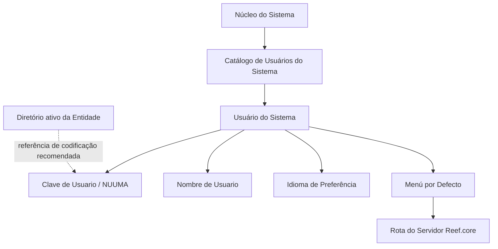

# Catálogo de Usuários do Sistema — Definição Funcional e Diretrizes de Codificação

## 1. Metadados do Documento
- **Arquivo de Origem:** Não identificado; conteúdo bruto fornecido no enunciado.
- **Tipo de Documento:** Especificação Técnica / Definição Funcional.
- **Domínio / Sistema:** Catálogo de Usuários do Sistema; MAPFRE; Reef.core.
- **Público-Alvo:** Desenvolvedores, Arquitetos, Operação e Negócio.
- **Data/Versão Identificada:** Não identificada.

---

## 2. Resumo Executivo & Contexto de Negócio

O documento define o catálogo de Usuários do Sistema, um repositório de informação específico destinado a identificar e codificar a relação de usuários no núcleo funcional do sistema. O catálogo concentra atributos identificativos que tornam cada usuário reconhecível e configurável no contexto da plataforma.

A identificação principal do usuário é realizada pela **Clave de Usuario**, denominada **NUUMA** na MAPFRE. Além da chave, o catálogo mantém o nome e os sobrenomes do usuário, o idioma de preferência e, quando aplicável, um menu por padrão particularizado.

O atributo de idioma permite que o usuário visualize palavras, expressões ou textos em sua língua preferencial. O menu por padrão, por sua vez, armazena a rota do servidor Reef.core quando essa configuração tiver sido particularizada para o usuário.

Como diretriz de governança, o documento recomenda que os usuários sejam codificados no catálogo da mesma forma como são identificados no diretório ativo da entidade. Essa prática favorece consistência entre os identificadores corporativos e os registros internos do sistema.

---

## 3. Arquitetura, Componentes & Tecnologias Envolvidas

### Componentes identificados

| Componente | Papel identificado no documento | Observações |
| :--- | :--- | :--- |
| Catálogo de Usuários do Sistema | Repositório específico para identificação e codificação da relação de usuários. | É apresentado como parte do núcleo funcional do sistema. |
| Usuário do Sistema | Entidade cadastrada no catálogo. | Possui chave, nome, idioma e possível menu por padrão. |
| NUUMA | Denominação MAPFRE da chave de identificação do usuário. | O documento não expande a sigla. |
| Reef.core | Servidor cuja rota pode ser particularizada no atributo Menu por Defecto. | Não há detalhes de arquitetura, protocolo ou URL. |
| Diretório ativo da Entidade | Referência recomendada para a codificação de usuários. | Não são especificados produto, integração ou sincronização. |



**Nota de Análise:** O documento apresenta os componentes funcionais e seus atributos, mas não descreve interfaces, métodos HTTP, contratos JSON, mecanismos de persistência, autenticação ou sincronização entre o catálogo e o diretório ativo.

---

## 4. Regras de Negócio, Especificações Funcionais & Processos

### 4.1 Objetivo funcional do catálogo

1. O núcleo do Sistema possui a capacidade de identificar e codificar a relação de Usuários do Sistema.
2. Essa relação é registrada em um repositório de informação específico, denominado Catálogo de Usuários do Sistema.
3. Cada Usuário do Sistema pode possuir dados identificativos e preferências de visualização ou navegação.

### 4.2 Dados identificativos e preferências

1. A **Clave de Usuario** contém a chave de identificação do Usuário do Sistema.
2. No contexto da MAPFRE, a chave de identificação do usuário é denominada **NUUMA**.
3. O **Nombre de Usuario** contém o nome e os sobrenomes do Usuário do Sistema.
4. O atributo **Idioma** contém o código do idioma de preferência atribuído ao Usuário do Sistema.
5. O código de idioma permite que o usuário visualize palavras, expressões ou textos nessa língua.
6. O atributo **Menú por Defecto** contém a rota do servidor Reef.core quando essa rota for particularizada para o Usuário do Sistema.

### 4.3 Diretriz de codificação

1. É considerada boa prática codificar os usuários no Catálogo de Usuários do Sistema utilizando a mesma identificação adotada no diretório ativo da Entidade.
2. A recomendação busca evitar divergências entre a identificação corporativa do diretório ativo e o identificador utilizado no catálogo.

### 4.4 Documentação relacionada

O documento indica a existência de diretrizes e documentos funcionais relacionados cuja leitura é recomendada, pois a interpretação isolada do presente conteúdo pode conduzir a erro. Os nomes desses documentos relacionados não são apresentados no conteúdo extraído.

---

## 5. Tabelas de Parâmetros, Ambientes e Estruturas de Dados

| Item / Parâmetro | Descrição / Função | Tipo / Valores / Formato | Ambiente / Observações |
| :--- | :--- | :--- | :--- |
| Catálogo de Usuários do Sistema | Repositório específico para identificar e codificar a relação de usuários. | Repositório de informação. | Integrado ao núcleo funcional do Sistema. |
| Usuário do Sistema | Entidade identificada e codificada no catálogo. | Registro de usuário. | Não há estrutura física detalhada. |
| Clave de Usuario | Chave de identificação do Usuário do Sistema. | Chave de usuário. | Denominada NUUMA na MAPFRE. |
| NUUMA | Nome atribuído à chave de identificação do usuário no contexto MAPFRE. | Identificador. | O significado da sigla não é informado. |
| Nombre de Usuario | Nome e sobrenomes do Usuário do Sistema. | Texto. | Não há regra de tamanho ou formato. |
| Idioma | Código do idioma de preferência do Usuário do Sistema. | Código de idioma. | Permite visualização de palavras, expressões ou textos na língua escolhida. |
| Menú por Defecto | Rota do servidor Reef.core quando particularizada para o usuário. | Rota de servidor. | Não há sintaxe, protocolo, ambiente ou exemplo de rota. |
| Reef.core | Servidor referenciado pelo atributo Menú por Defecto. | Servidor / componente. | Não há detalhamento técnico adicional. |
| Diretório ativo da Entidade | Fonte de referência para codificação consistente de usuários. | Diretório corporativo. | Integração técnica não especificada. |

---

## 6. Bateria de Perguntas & Respostas para RAG (FAQ Sintético)

### P1: Qual é a finalidade do Catálogo de Usuários do Sistema?
**R:** O Catálogo de Usuários do Sistema é um repositório de informação específico que permite ao núcleo do Sistema identificar e codificar a relação de Usuários do Sistema.

### P2: Qual atributo identifica unicamente um Usuário do Sistema?
**R:** O atributo **Clave de Usuario** contém a chave de identificação do Usuário do Sistema. No contexto da MAPFRE, essa chave é denominada **NUUMA**.

### P3: O que significa NUUMA no documento?
**R:** NUUMA é a denominação utilizada na MAPFRE para a chave de identificação do Usuário do Sistema. O documento não informa a expansão ou o significado da sigla.

### P4: Quais informações são armazenadas no atributo Nombre de Usuario?
**R:** O atributo **Nombre de Usuario** contém o nome e os sobrenomes do Usuário do Sistema.

### P5: Como o idioma do usuário é utilizado pelo sistema?
**R:** O atributo **Idioma** armazena o código do idioma de preferência atribuído ao Usuário do Sistema. Esse código permite visualizar palavras, expressões ou textos na língua correspondente.

### P6: O que é configurado no atributo Menú por Defecto?
**R:** O atributo **Menú por Defecto** contém a rota do servidor Reef.core quando essa rota tiver sido particularizada para o Usuário do Sistema.

### P7: O documento informa exemplos de rotas do servidor Reef.core?
**R:** Não. O documento informa somente que o atributo Menú por Defecto pode conter uma rota do servidor Reef.core particularizada para o usuário; não apresenta URLs, protocolos, ambientes ou exemplos de valores.

### P8: Como os usuários devem ser codificados no Catálogo de Usuários do Sistema?
**R:** O documento recomenda, como boa prática, codificar os usuários no catálogo da mesma maneira como eles são identificados no diretório ativo da Entidade.

### P9: O Catálogo de Usuários do Sistema integra-se tecnicamente ao diretório ativo?
**R:** O conteúdo extraído recomenda alinhar a codificação dos usuários à identificação do diretório ativo da Entidade, mas não descreve integração técnica, sincronização, protocolo ou mecanismo de autenticação.

### P10: Existem documentos relacionados que devem ser consultados?
**R:** Sim. O documento menciona diretrizes e documentos funcionais cuja leitura é recomendada para evitar erros decorrentes da interpretação isolada do conteúdo. Entretanto, os nomes desses documentos não são informados.

---

## 7. Glossário de Termos, Siglas & Conceitos-Chave

- **Catálogo de Usuários do Sistema:** Repositório de informação específico usado para identificar e codificar a relação de usuários do sistema.
- **Clave de Usuario:** Chave de identificação do Usuário do Sistema.
- **NUUMA:** Denominação MAPFRE da chave de identificação do Usuário do Sistema; o significado expandido não é informado.
- **Nombre de Usuario:** Atributo que contém nome e sobrenomes do Usuário do Sistema.
- **Idioma:** Código de idioma de preferência que permite a visualização de palavras, expressões ou textos em determinada língua.
- **Menú por Defecto:** Atributo que contém a rota do servidor Reef.core caso essa rota esteja particularizada para o usuário.
- **Reef.core:** Servidor referido pela rota armazenada no atributo Menú por Defecto.
- **Diretório ativo da Entidade:** Referência corporativa usada como padrão recomendado para codificação de usuários.

---

## 8. Notas Críticas, Riscos & Limitações

- O documento não especifica o modelo de dados físico, tecnologia de persistência, obrigatoriedade dos atributos ou regras de unicidade da Clave de Usuario.
- O documento não detalha a sintaxe, protocolo, ambiente ou regras de validação da rota Reef.core armazenada em Menú por Defecto.
- A recomendação de alinhamento com o diretório ativo não define se existe integração automática, sincronização periódica ou cadastro manual.
- O documento alerta que sua interpretação isolada pode conduzir a erro e recomenda a consulta a diretrizes e documentos funcionais relacionados, não identificados no conteúdo extraído.
- **Nota de Análise:** Não há detalhamento adicional sobre permissões, autenticação, perfis, ciclo de vida de usuários, exclusão, auditoria ou tratamento de erros.

---

## 9. Conteúdo Bruto Estruturado (Referência Fiel)

```text
--- [PÁGINA 1 DE 2] ---

DEFINICIÓN de Usuarios del Sistema
Contexto
Funcionalmente, el núcleo del Sistema cuenta con la posibilidad de identificar y codificar la relación
de Usuarios del Sistema en un repositorio de información específico.
Datos Identificativos
Clave de Usuario
Este Atributo del catálogo de Usuarios del Sistema contiene la clave de identificación del Usuario,
denominado 'NUUMA' en MAPFRE.
Nombre de Usuario
Este Atributo del catálogo de Usuarios del Sistema contiene el nombre y los apellidos del Usuario.
Idioma
Este Atributo del catálogo de Usuarios del Sistema contiene el código del idioma de preferencia
asignado al Usuario, código que le permitirá visualizar palabras, expresiones o textos en esta lengua.
Menú por Defecto
Este Atributo del catálogo de Usuarios del Sistema contiene la ruta del Servidor de Reef.core caso
de estar particularizado para el Usuario.
 /
 CF
Home Solutions APIs Documentation Zeus
EN

--- [PÁGINA 2 DE 2] ---

Vínculos
Relación de Directrices y Documentos funcionales cuya lectura recomendada para evitar que la
interpretación aislada del presente documento pueda conducir a error.
Idiomas
Preguntas frecuentes
(1) ¿Existe alguna recomendación que pueda ser tomada en consideración en el uso y definición del
Catálogo de Usuarios del Sistema?
Es una buena práctica codificar a los usuarios en este catálogo de la misma manera con la que se
identifica a los usuarios en el directorio activo de la Entidad.
```
