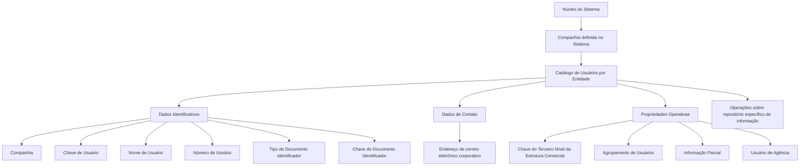

# Catálogo de Usuários por Entidade — Atributos, Propriedades Operacionais e Boas Práticas

## 1. Metadados do Documento
- **Arquivo de Origem:** Não identificado
- **Tipo de Documento:** Especificação Técnica / Manual Funcional
- **Domínio / Sistema:** Catálogo de Usuários por Entidade
- **Público-Alvo:** Negócio, Analistas Funcionais, Desenvolvedores e Operação
- **Data/Versão Identificada:** Não identificada

---

## 2. Resumo Executivo & Contexto de Negócio

O documento descreve o catálogo de **Usuários por Entidade**, utilizado pelo núcleo do sistema para associar usuários às companhias definidas. Essa associação determina quais usuários podem realizar ou executar operações sobre um repositório específico de informações.

A definição de cada usuário é organizada em três grupos de informações: **Dados Identificativos**, **Dados de Contato** e **Propriedades Operativas**. Os dados identificativos permitem vincular o usuário a uma companhia e identificá-lo por código, nome, número e documento identificador.

O modelo também prevê atributos operacionais relacionados à estrutura comercial, ao agrupamento interno de usuários, à possibilidade de visualizar informação detalhada ou agregada e à condição de o usuário ser um empregado de agência ou de agente.

Como recomendação funcional, o documento orienta que os códigos dos usuários no catálogo sejam definidos da mesma forma que os identificadores utilizados no diretório ativo da entidade. O documento também aponta relações com os temas funcionais **Grupos de Usuários** e **Estrutura Comercial - Tercer Nivel**.

---

## 3. Arquitetura, Componentes & Tecnologias Envolvidas

O documento não descreve uma arquitetura tecnológica, protocolos, APIs, bancos de dados, métodos HTTP, contratos JSON, ambientes ou ferramentas de implantação. O conteúdo apresenta uma estrutura funcional de catálogo de usuários vinculada às companhias do sistema e a um repositório específico de informações.

Componentes e conceitos identificados:

| Componente / Conceito | Descrição fundamentada no documento |
| :--- | :--- |
| Núcleo do Sistema | Possui a capacidade de associar usuários às companhias definidas no sistema. |
| Companhia | Entidade cujo código é utilizado durante a definição dos usuários. |
| Catálogo de Usuários por Entidade | Catálogo que concentra os atributos de identificação, contato e propriedades operativas dos usuários. |
| Repositório de Informação | Repositório específico sobre o qual usuários associados podem realizar ou executar operações. |
| Modelo de Informação de Terceiros | Modelo no qual usuários são identificados por tipo de documento identificador e chave associada. |
| Estrutura Comercial — Terceiro Nível | Estrutura à qual o usuário pode estar adscrito por meio da respectiva chave. |
| Agrupamento de Usuários | Classificação interna do coletivo de usuários da entidade. |
| Diretório Ativo da Entidade | Referência para a boa prática de codificação de usuários. |



> **Nota de Análise:** O documento não detalha a tecnologia do diretório ativo, os mecanismos de autenticação, os métodos de operação permitidos, os controles de autorização, os contratos de integração ou a persistência dos dados.

---

## 4. Regras de Negócio, Especificações Funcionais & Processos

1. O núcleo do sistema permite associar usuários a cada uma das companhias definidas no sistema.
2. A associação de usuários por companhia estabelece a relação de usuários que podem realizar ou executar operações sobre um repositório específico de informações.
3. O atributo **Companhia** contém o código da companhia para a qual está sendo definida a relação de usuários.
4. A **Chave de Usuário** contém o código do usuário.
5. O **Nome de Usuário** contém o nome e os sobrenomes do usuário.
6. O **Número de Usuário** contém o código numérico único do usuário.
7. No Modelo de Informação de Terceiros, e em coerência com as informações das demais pessoas físicas ou jurídicas, os usuários devem ser identificados no sistema com:
   - Um tipo de documento identificador; e
   - Uma chave associada.
8. O atributo **Tipo de Documento Identificador** deve conter um dos valores possíveis dos tipos de documentos identificadores, conforme a configuração realizada pela companhia.
9. A **Chave do Documento Identificador** deve conter a chave única do tipo de documento identificador.
10. O atributo **Direção Correio Eletrônico** contém o endereço corporativo de e-mail do usuário.
11. A **Chave do Terceiro Nível** contém o código do Terceiro Nível da Estrutura Comercial ao qual o usuário está adscrito.
12. O **Agrupamento de Usuários** contém o código do agrupamento ao qual o usuário pertence e permite à entidade classificar internamente o coletivo de usuários.
13. O atributo **Informação Parcial** determina se o usuário pode:
    - Visualizar informação com maior nível de detalhe; ou
    - Consultar informações de modo agregado.
14. A aplicação da regra de **Informação Parcial** depende de duas condições adicionais:
    - Os programas de consulta à informação do sistema devem contemplar funcionalmente essa possibilidade.
    - O parâmetro de configuração específico da entidade deve permitir essa possibilidade.
15. A propriedade **Usuário de Agência** identifica se o usuário da entidade será identificado como empregado de agência ou empregado de agente.
16. É considerada boa prática codificar os usuários no catálogo da mesma maneira como os usuários são identificados no diretório ativo da entidade.

---

## 5. Tabelas de Parâmetros, Ambientes e Estruturas de Dados

| Item / Parâmetro | Descrição / Função | Tipo / Valores / Formato | Ambiente / Observações |
| :--- | :--- | :--- | :--- |
| Companhia | Contém o código da companhia sobre a qual a definição de usuários está sendo realizada. | Código da companhia | Companhia definida no sistema. |
| Chave de Usuário | Contém o código do usuário. | Código do usuário | A recomendação é alinhá-lo à identificação no diretório ativo da entidade. |
| Nome de Usuário | Contém o nome e os sobrenomes do usuário. | Nome e sobrenomes | Pertence aos dados identificativos. |
| Número de Usuário | Contém o código numérico único do usuário. | Código numérico único | Pertence aos dados identificativos. |
| Tipo de Documento Identificador | Identifica o tipo de documento utilizado para identificar o usuário no sistema. | Um dos valores possíveis configurados pela companhia | Deve estar de acordo com a configuração realizada pela companhia. |
| Chave do Documento Identificador | Contém a chave única do tipo de documento identificador. | Chave única | Associada ao tipo de documento identificador. |
| Direção Correio Eletrônico | Contém o endereço de e-mail corporativo do usuário. | Endereço de correio eletrônico corporativo | Pertence aos dados de contato. |
| Chave do Terceiro Nível | Contém o código do Terceiro Nível da Estrutura Comercial ao qual o usuário está adscrito. | Código do Terceiro Nível | Pertence às propriedades operativas. |
| Agrupamento de Usuários | Contém o código do agrupamento ao qual o usuário pertence. | Código de agrupamento | Permite classificação interna do coletivo de usuários pela entidade. |
| Informação Parcial | Determina o nível de detalhamento da informação que o usuário pode consultar. | Informação detalhada ou dados agregados | Depende da funcionalidade dos programas de consulta e da configuração específica da entidade. |
| Usuário de Agência | Identifica se o usuário é empregado de agência ou empregado de agente. | Condição de identificação | Pertence às propriedades operativas. |
| Diretório Ativo da Entidade | Referência para a codificação dos usuários no catálogo. | Não especificado | O documento recomenda utilizar a mesma codificação do diretório ativo. |

---

## 6. Bateria de Perguntas & Respostas para RAG (FAQ Sintético)

### P1: Qual é a finalidade do Catálogo de Usuários por Entidade?
**R:** O Catálogo de Usuários por Entidade permite ao núcleo do sistema associar usuários a cada companhia definida no sistema. Essa associação identifica quais usuários podem realizar ou executar operações sobre um repositório específico de informações.

### P2: Quais são os grupos de dados definidos para um usuário no catálogo?
**R:** O catálogo organiza as informações do usuário em três grupos: Dados Identificativos, Dados de Contato e Propriedades Operativas.

### P3: Qual informação deve ser registrada no atributo Companhia?
**R:** O atributo Companhia deve conter o código da companhia sobre a qual está sendo realizada a definição dos usuários.

### P4: Como o usuário deve ser identificado no Modelo de Informação de Terceiros?
**R:** O usuário deve ser identificado com um tipo de documento identificador e uma chave associada. Essa regra mantém coerência com as informações das demais pessoas físicas ou jurídicas presentes no Modelo de Informação de Terceiros.

### P5: Como deve ser preenchido o Tipo de Documento Identificador?
**R:** O atributo Tipo de Documento Identificador deve conter um dos possíveis valores de tipos de documentos identificadores, conforme a configuração efetuada pela companhia.

### P6: O que representa a Chave do Documento Identificador?
**R:** A Chave do Documento Identificador contém a chave única do tipo de documento identificador associado ao usuário.

### P7: Qual é a função do atributo Informação Parcial?
**R:** Informação Parcial estabelece se o usuário pode visualizar informação em maior nível de detalhe ou se pode consultar somente dados agregados nos programas que realizam consultas sobre a informação do sistema.

### P8: Quais condições precisam existir para que a Informação Parcial seja aplicada?
**R:** Os programas de consulta devem contemplar funcionalmente a visualização detalhada ou agregada, e o parâmetro de configuração específico da entidade também deve permitir essa possibilidade.

### P9: O que é a Chave do Terceiro Nível?
**R:** A Chave do Terceiro Nível contém o código do Terceiro Nível da Estrutura Comercial ao qual o usuário está adscrito.

### P10: Para que serve o Agrupamento de Usuários?
**R:** O Agrupamento de Usuários contém o código do agrupamento ao qual o usuário pertence. Esse código permite que a entidade classifique internamente o coletivo de usuários.

### P11: O que identifica a propriedade Usuário de Agência?
**R:** A propriedade Usuário de Agência identifica se o usuário da entidade será identificado como empregado de agência ou como empregado de agente.

### P12: Qual recomendação existe para a codificação dos usuários?
**R:** O documento recomenda como boa prática codificar os usuários no catálogo da mesma forma como os usuários são identificados no diretório ativo da entidade.

---

## 7. Glossário de Termos, Siglas & Conceitos-Chave

- **Catálogo de Usuários por Entidade:** Estrutura que reúne as informações de usuários associadas a uma companhia.
- **Companhia:** Entidade definida no sistema para a qual são definidos usuários.
- **Chave de Usuário:** Código que identifica o usuário no catálogo.
- **Modelo de Informação de Terceiros:** Modelo que exige identificação de usuários por tipo de documento identificador e chave associada.
- **Tipo de Documento Identificador:** Tipo de documento usado para identificar o usuário, conforme configuração da companhia.
- **Chave do Documento Identificador:** Chave única associada ao tipo de documento identificador.
- **Estrutura Comercial — Terceiro Nível:** Nível da estrutura comercial ao qual um usuário pode estar adscrito.
- **Agrupamento de Usuários:** Código utilizado pela entidade para classificar internamente usuários.
- **Informação Parcial:** Propriedade que define a possibilidade de consulta detalhada ou agregada de informações.
- **Usuário de Agência:** Usuário identificado como empregado de agência ou empregado de agente.
- **Diretório Ativo da Entidade:** Diretório utilizado como referência para a codificação recomendada dos usuários.

---

## 8. Notas Críticas, Riscos & Limitações

- O documento não especifica quais operações os usuários podem executar sobre o repositório de informações.
- O documento não detalha mecanismos de autenticação, autorização, integração ou sincronização com o diretório ativo da entidade.
- A recomendação de alinhamento com o diretório ativo é uma boa prática, mas o documento não define regras de validação, sincronização ou tratamento de divergências.
- A visualização detalhada ou agregada definida por **Informação Parcial** não depende somente do atributo do usuário; depende também da funcionalidade dos programas de consulta e da configuração específica da entidade.
- O documento cita **Grupos de Usuários** e **Estrutura Comercial - Tercer Nivel** como documentos funcionais relacionados, porém não detalha seus conteúdos.
- Não foram identificadas versões, datas, ambientes, URLs, rotas de log, tecnologias, serviços, APIs, contratos ou estruturas físicas de armazenamento.

---

## 9. Conteúdo Bruto Estruturado (Referência Fiel)

```text
--- [PÁGINA 1 DE 3] ---

ASIGNACIÓN de Usuarios por Entidad
Contexto
Funcionalmente el núcleo del Sistema cuenta con la posibilidad de asociar, por cada una de las
compañías definidas en el Sistema, la relación de Usuarios que van a poder realizar o ejecutar
operaciones sobre un repositorio de información específico.
Datos Identificativos
Datos de Contacto
Propiedades Operativas
Datos Identificativos
Compañía
Este Atributo del catálogo de Usuarios por Entidad contiene el código de la compañía sobre la cual se
está realizando la definición de los Usuarios.
Clave de Usuario
Este Atributo del catálogo de Usuarios de la Entidad contiene el código del Usuario.
Nombre de Usuario
Esta Propiedad del catálogo de Usuarios de la entidad contiene el nombre y los apellidos del Usuario.
 / 
 CF
Home Solutions APIs Documentation Zeus
EN


--- [PÁGINA 2 DE 3] ---

Número de Usuario
Este Atributo del catálogo de Usuarios de la Entidad contiene el código numérico único del Usuario.
Tipo Documento Identificador
En el Modelo de Información de Terceros y por coherencia con la información del del resto de
Personas Físicas o Jurídicas los Usuarios se deben identificar en el sistema con un tipo de
documento identificativo y una clave asociada.
Este atributo contendrá uno de los posibles valores de los Tipos de documentos Identificadores de
acuerdo con la configuración realizada por la compañía.
Clave del Documento Identificador
En el Modelo de Información de Terceros y por coherencia con la información del del resto de
Personas Físicas o Jurídicas los Usuarios se deben identificar en el sistema con un tipo de
documento identificativo y una clave asociada.
Este atributo contendrá la clave única del Tipo de documento Identificador.
Datos de Contacto
Dirección Correo Electrónico
Este atributo contiene la dirección de correo electrónico corporativo del Usuario.
Propiedades Operativas
Clave del Tercer Nivel
Este atributo contiene el código del Tercer Nivel de la Estructura Comercial al que está adscrito el
Usuario.
Agrupamiento de Usuarios
Este atributo contiene el código del Agrupamiento de Usuarios al que pertenece el Usuario, código
que permite a la entidad clasificar internamente al colectivo de Usuarios.
Información Parcial
Este atributo establece si el Usuario puede o no visualizar la información con mayor nivel de detalle
o solamente puede consultar los datos de manera agregada en aquellos programas que realizan
Consultas sobre la información del sistema (siempre y cuando estos programas lo contemplen
funcionalmente además que el parámetro de configuración específico de la entidad así lo permita).


--- [PÁGINA 3 DE 3] ---

Usuario de Agencia
Esta Propiedad identifica si el Usuario de la Entidad va a estar identificado o no como un Empleado
de Agencia o Empleado de Agente.
Vínculos
Relación de Directrices y Documentos funcionales cuya lectura recomendada para evitar que la
interpretación aislada del presente documento pueda conducir a error.
Grupos de Usuarios
Estructura Comercial - Tercer Nivel
Preguntas frecuentes
(1) ¿Existe alguna recomendación que pueda ser tomada en consideración en el uso y definición del
Catálogo de Usuarios de la Entidad?
Es una buena práctica codificar a los usuarios en este catálogo de la misma manera con la que se
identifica a los usuarios en el directorio activo de la Entidad.
```
