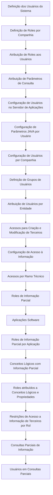

# Sistema de Segurança do Reef.core: Configuração de Usuários, Roles e Restrições de Informação

## 1. Metadados do Documento
- **Arquivo de Origem:** Não identificado no conteúdo fornecido
- **Tipo de Documento:** Manual Operacional
- **Domínio / Sistema:** Reef.core; entidade MAPFRE
- **Público-Alvo:** Administradores de sistema, operação, desenvolvedores e gestores de segurança
- **Data/Versão Identificada:** Não identificada

---

## 2. Resumo Executivo & Contexto de Negócio

O documento descreve o **Sistema de Segurança do Reef.core**, conjunto de catálogos utilizado para criar e configurar contas de usuários que utilizarão o sistema. O objetivo declarado é conhecer os catálogos e a ordem de configuração necessária para disponibilizar um usuário totalmente operacional em uma companhia definida na aplicação.

No contexto apresentado, uma conta de usuário permite autenticação no sistema e pode receber autorização para acessar recursos fornecidos ou conectados ao sistema. O documento diferencia autenticação de autorização: a autenticação não implica autorização, pois a autorização é realizada por meio do uso específico de **Roles**.

O acesso a uma conta de usuário exige autenticação por senha para fins de contabilidade, segurança, registro e administração de recursos. O Reef.core permite criar contas, configurar Roles e definir atributos operativos de autenticação dentro dos catálogos genericamente denominados Sistema de Segurança.

Após as tarefas de configuração prévias, a entidade MAPFRE pode concluir a configuração dos usuários criados em cada companhia na qual esses usuários poderão trabalhar. O documento também contempla configurações de grupos, entidades, acessos a operações sobre terceiros, ramos técnicos e restrições de visualização de informação.

---

## 3. Arquitetura, Componentes & Tecnologias Envolvidas

O conteúdo identifica os seguintes componentes funcionais do Sistema de Segurança do Reef.core:

- Contas de usuários do sistema.
- Autenticação de usuários por senha.
- Roles definidos por companhia.
- Atribuição de Roles a usuários.
- Parâmetros de consulta por usuário.
- Configuração de usuários no servidor de aplicações.
- Configuração de parâmetros JAVA por usuário.
- Grupos de usuários.
- Associação de usuários por entidade.
- Acessos às operações de criação e modificação de terceiros.
- Acesso à informação.
- Acessos por ramo técnico.
- Informação parcial e restrições de visualização.
- Consultas parciais de informação.



> **Nota de Análise:** O documento lista a configuração de usuários no servidor de aplicações e parâmetros JAVA por usuário, mas não especifica servidores, valores de parâmetros, arquivos de configuração, versões Java ou procedimentos técnicos de implantação.

---

## 4. Regras de Negócio, Especificações Funcionais & Processos

1. Uma conta de usuário permite que um usuário se autentique no sistema.
2. Uma conta de usuário pode, potencialmente, receber autorização para acessar recursos fornecidos ou conectados ao sistema.
3. Autenticação e autorização são conceitos distintos no Reef.core:
   - A autenticação não implica autorização.
   - A autorização é realizada mediante o uso específico de Roles.
4. O início de sessão em uma conta de usuário requer autenticação com senha.
5. O uso de senha atende a finalidades de:
   - Contabilidade.
   - Segurança.
   - Registro.
   - Administração de recursos.
6. O Sistema de Segurança do Reef.core permite:
   - Criar contas dos usuários que utilizarão o sistema.
   - Configurar Roles.
   - Definir atributos operativos de autenticação.
7. Para criar um usuário totalmente operacional em uma companhia, o documento estabelece a necessidade de configurar os catálogos em determinada ordem.
8. As tarefas prévias de configuração incluem:
   - Definição de usuários do sistema.
   - Definição de Roles por companhia.
   - Atribuição de Roles aos usuários do sistema.
   - Atribuição de parâmetros de consulta aos usuários do sistema.
   - Configuração de usuários no servidor de aplicações.
   - Configuração de parâmetros JAVA por usuário.
9. Após as tarefas prévias, a entidade MAPFRE pode completar a configuração dos usuários em cada companhia na qual esses usuários poderão trabalhar.
10. A configuração complementar contempla:
    - Definição de grupos de usuários.
    - Atribuição de usuários por entidade.
    - Atribuição de acessos às operações de criação e modificação de terceiros.
    - Configuração de acesso à informação.
    - Atribuição de acessos por ramo técnico.
11. O Reef.core permite estabelecer, por usuário, restrições de visualização de informação nas telas.
12. A funcionalidade de informação parcial e restrições depende das configurações prévias afetadas permitirem essa funcionalidade.
13. Os catálogos de informação parcial abrangem:
    - Definição de Roles de informação parcial.
    - Definição de aplicações software.
    - Definição de Roles de informação parcial por aplicação.
    - Definição de conceitos lógicos com informação parcial.
    - Atribuição de Roles de informação parcial a conceitos lógicos e respectivas propriedades.
    - Restrições de acesso à informação de terceiros por Rol.
    - Configuração de consultas parciais de informação.
    - Configuração de usuários em consultas parciais de informação.

---

## 5. Tabelas de Parâmetros, Ambientes e Estruturas de Dados

| Item / Parâmetro | Descrição / Função | Tipo / Valores / Formato | Ambiente / Observações |
| :--- | :--- | :--- | :--- |
| Conta de usuário | Permite ao usuário autenticar-se no sistema. | Conta de sistema | Pode potencialmente receber autorização de acesso a recursos. |
| Senha | Necessária para iniciar sessão em uma conta de usuário. | Credencial de autenticação | Utilizada para contabilidade, segurança, registro e administração de recursos. |
| Role | Mecanismo específico utilizado para autorização. | Role de segurança | A autenticação não implica autorização; a autorização ocorre por Roles. |
| Role por companhia | Role definido no contexto de uma companhia. | Configuração de segurança | Deve ser definido antes da atribuição aos usuários. |
| Usuário do sistema | Conta criada para utilização do Reef.core. | Entidade de usuário | Deve passar pelas tarefas prévias de configuração para tornar-se operacional. |
| Parâmetros de consulta | Parâmetros atribuídos aos usuários do sistema. | Parâmetros de consulta | Valores e formatos não detalhados. |
| Usuário no servidor de aplicações | Configuração de usuário no servidor de aplicações. | Configuração operacional | Servidor, método e atributos não detalhados. |
| Parâmetros JAVA por usuário | Parâmetros JAVA configurados por usuário. | Parâmetros JAVA | Nomes, valores e versões não detalhados. |
| Grupo de usuários | Agrupamento de usuários. | Catálogo de configuração | Critérios de agrupamento não detalhados. |
| Usuário por entidade | Associação de usuários a uma entidade. | Atribuição de entidade | O documento cita a entidade MAPFRE. |
| Acesso a terceiros | Acesso a operações de criação e modificação de terceiros. | Permissão operacional | Regras específicas de autorização não detalhadas. |
| Acesso à informação | Configuração de acesso à informação. | Permissão de informação | Pode ser complementada por informação parcial e restrições. |
| Acesso por ramo técnico | Atribuição de acessos por ramo técnico. | Permissão por ramo | Ramos técnicos disponíveis não detalhados. |
| Role de informação parcial | Role destinado a configurações de visualização parcial de informação. | Role de segurança | Depende de configurações prévias permitirem a funcionalidade. |
| Aplicação software | Aplicação relacionada à informação parcial. | Catálogo de aplicações | Aplicações não identificadas no documento. |
| Conceito lógico | Conceito associado a informação parcial. | Catálogo lógico | Pode possuir propriedades associadas a Roles de informação parcial. |
| Restrição de terceiros por Rol | Restrição de acesso à informação de terceiros conforme Role. | Restrição de acesso | Critérios e dados restritos não detalhados. |
| Consulta parcial de informação | Configuração para acesso parcial à informação. | Configuração de consulta | Requer também configuração de usuários em consultas parciais. |

---

## 6. Bateria de Perguntas & Respostas para RAG (FAQ Sintético)

### P1: Qual é o objetivo do Sistema de Segurança do Reef.core?
**R:** O Sistema de Segurança do Reef.core permite criar contas de usuários, configurar Roles e definir atributos operativos de autenticação. O objetivo do documento é apresentar os catálogos e a ordem de configuração necessária para criar um usuário totalmente operacional em uma companhia definida na aplicação.

### P2: A autenticação de um usuário no Reef.core concede automaticamente autorização de acesso?
**R:** Não. O documento estabelece que autenticação não implica autorização. A autenticação permite que o usuário inicie sessão mediante senha, enquanto a autorização para acessar recursos é efetuada pelo uso específico de Roles.

### P3: Por que uma senha é exigida para iniciar sessão em uma conta de usuário?
**R:** A senha é exigida para que o usuário se autentique ao iniciar sessão. Segundo o documento, essa autenticação por senha atende a fins de contabilidade, segurança, registro e administração de recursos.

### P4: Quais são as tarefas prévias para tornar um usuário operacional no Reef.core?
**R:** As tarefas prévias são: definição dos usuários do sistema, definição de Roles por companhia, atribuição de Roles aos usuários, atribuição de parâmetros de consulta, configuração de usuários no servidor de aplicações e configuração de parâmetros JAVA por usuário.

### P5: Em que momento a entidade MAPFRE pode completar a configuração dos usuários?
**R:** A entidade MAPFRE pode completar a configuração dos usuários criados nas companhias em que esses usuários poderão trabalhar depois que as tarefas prévias de configuração tiverem sido realizadas.

### P6: Quais configurações adicionais de acesso são mencionadas para os usuários?
**R:** O documento menciona definição de grupos de usuários, atribuição de usuários por entidade, atribuição de acessos às operações de criação e modificação de terceiros, configuração de acesso à informação e atribuição de acessos por ramo técnico.

### P7: O Reef.core permite restringir a informação visualizada por usuário?
**R:** Sim. O documento informa que o Reef.core permite estabelecer por usuário restrições sobre a visualização de informação nas telas, por meio de catálogos de informação parcial e restrições.

### P8: Quais catálogos compõem a configuração de informação parcial?
**R:** Os catálogos incluem Roles de informação parcial, aplicações software, Roles de informação parcial por aplicação, conceitos lógicos com informação parcial, atribuição de Roles a conceitos lógicos e propriedades, restrições de acesso à informação de terceiros por Rol, consultas parciais de informação e usuários em consultas parciais.

### P9: A funcionalidade de consultas parciais pode ser configurada independentemente?
**R:** Não necessariamente. O documento condiciona a funcionalidade às configurações prévias afetadas que tenham sido realizadas e que permitam essa funcionalidade. Ele não detalha quais configurações específicas habilitam ou bloqueiam as consultas parciais.

### P10: O documento define quais parâmetros JAVA devem ser configurados para cada usuário?
**R:** Não. O documento apenas inclui a configuração de parâmetros JAVA por usuário entre as tarefas prévias. Não são informados nomes de parâmetros, valores, versões Java, arquivos ou procedimentos técnicos.

---

## 7. Glossário de Termos, Siglas & Conceitos-Chave

- **Reef.core:** Sistema citado como responsável pela criação de contas de usuários, configuração de Roles e atributos operativos de autenticação.
- **Sistema de Segurança:** Denominação genérica, no Reef.core, para o grupo de catálogos voltados à gestão de usuários, Roles e autenticação.
- **Autenticação:** Processo requerido para iniciar sessão em uma conta de usuário, realizado com senha.
- **Autorização:** Permissão para acessar recursos fornecidos ou conectados ao sistema; é realizada mediante o uso específico de Roles.
- **Role:** Elemento utilizado para efetuar autorização no sistema.
- **Informação parcial:** Configuração que permite estabelecer restrições de visualização de informação nas telas.
- **Conceito lógico:** Elemento configurável relacionado à informação parcial e às suas propriedades.
- **Terceiros:** Entidades sobre as quais existem operações de criação, modificação e restrições de acesso à informação.
- **Ramo técnico:** Critério mencionado para atribuição de acessos; o documento não fornece definição adicional.
- **MAPFRE:** Entidade mencionada como apta a completar a configuração de usuários após as tarefas prévias.
- **JAVA:** Tecnologia citada na configuração de parâmetros por usuário; detalhes técnicos não são fornecidos.
- **CF:** Sigla exibida na navegação do conteúdo, sem expansão ou definição no documento.

---

## 8. Notas Críticas, Riscos & Limitações

- O documento não identifica nome de arquivo, data, versão, autoria ou classificação formal.
- Não há detalhamento de valores, formatos, campos, URLs, servidores, ambientes, credenciais, portas ou arquivos de configuração.
- Não são especificados os critérios de criação de usuários, políticas de senha, ciclo de vida de contas, bloqueio, expiração ou recuperação de credenciais.
- O documento não apresenta matriz de permissões entre Roles, usuários, companhias, entidades, ramos técnicos e operações.
- Não são definidos os métodos de configuração de usuários no servidor de aplicações nem os parâmetros JAVA por usuário.
- A funcionalidade de informação parcial depende de configurações prévias, mas o documento não identifica de forma detalhada essas dependências.
- Não há contratos técnicos, métodos HTTP, integrações, APIs, modelos de dados ou procedimentos de auditoria detalhados.
- **Nota de Análise:** O conteúdo apresenta principalmente um inventário ordenado de catálogos de segurança. As regras operacionais detalhadas de cada catálogo não foram fornecidas.

---

## 9. Conteúdo Bruto Estruturado (Referência Fiel)

```text
--- [PÁGINA 1 DE 3] ---

DEFINICIÓN del SISTEMA de SEGURIDAD
Contexto
La cuenta de un usuario le permite a este autenticarse en el sistema y, potencialmente, recibir
autorización para acceder a los recursos proporcionados o conectados a ese sistema.
La autenticación no implica autorización puesto que esta se efectúa mediante el uso específico de los
Roles.
Por otra parte para iniciar sesión en una cuenta de Usuario se requiere que los usuarios se
autentifiquen con una contraseña para fines de contabilidad, seguridad, registro y administración de
recursos.
Funcionalmente Reef.core cuenta con la posibilidad de crear las cuentas de los Usuarios que van a
utilizar el Sistema, configurar sus Roles y definir los atributos operativos de autentificación en un
grupo de catálogos que conforman lo que en Reef.core se denomina genéricamente como 'Sistema
de Seguridad'.
Objetivo
Conocer los catálogos y el orden de configuración de los mismos para crear un Usuario totalmente
operativo para una compañía definida en la aplicación.
Catálogos de Configuración
 / 
 CF
Home Solutions APIs Documentation Zeus
EN


--- [PÁGINA 2 DE 3] ---

Definición de los Usuarios del Sistema
Definición de Roles por Compañía
Asignación de Roles a los Usuarios del Sistema
Asignación de Parámetros de Consulta a los Usuarios del Sistema
Configuración de Usuarios en el Servidor de Aplicaciones
Configuración de Parámetros JAVA por Usuario
Una vez realizados las tareas previas, la entidad MAPFRE estará en disposición de completar la
configuración de los Usuarios creados en cada una de las compañías en las que estos van a poder
trabajar.
Definición de Grupos de Usuarios
Asignación de Usuarios por Entidad
Asignación de Accesos a las Operaciones de Creación y Modificación de
Terceros
Configuración Acceso Información
Asignación Accesos por Ramo Técnico
Información Parcial/Restricciones
Por último y puesto que por Usuario en Reef.core se pueden establecer restricciones sobre la
visualización de información en las pantallas, se puede contemplar la configuración de los siguientes
catálogos ...:
Definición de Roles de Información Parcial
Definición de Aplicaciones Software
Definición de Roles de Información Parcial por Aplicación


--- [PÁGINA 3 DE 3] ---

Definición de Conceptos Lógicos con Información Parcial
Asignación de Roles de Información Parcial a Conceptos Lógicos y sus
Propiedades
Restricciones Acceso Información de Terceros por Rol
... Siempre y cuando las configuraciones afectas que se hayan realizado previamente permitan esta
funcionalidad:
Configuración Consultas Parciales de Información
Configuración Usuarios en Consultas Parciales de Información
```
