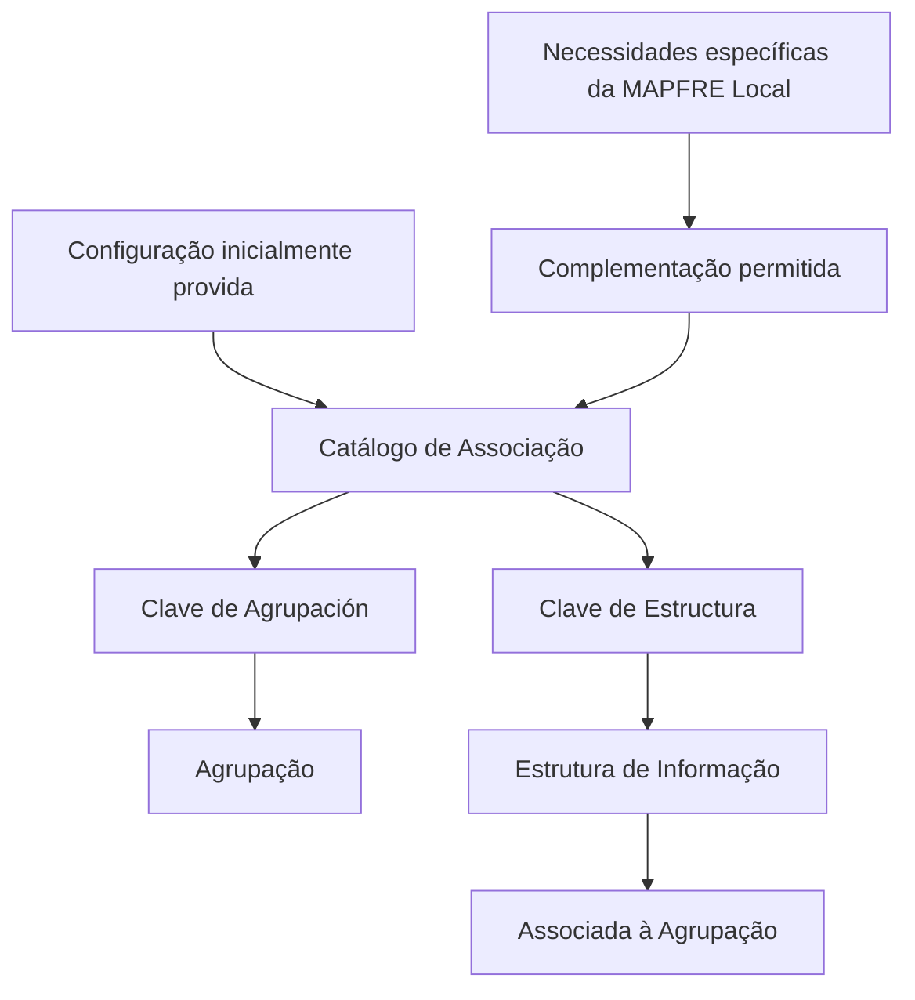

# Catálogo de Associação de Estruturas de Informação às Agrupações

## 1. Metadados do Documento
- **Arquivo de Origem:** Não identificado
- **Tipo de Documento:** Especificação Técnica
- **Domínio / Sistema:** Catálogo de Agrupações e Estruturas de Informação; referências a MAPFRE Local, CF Home Solutions APIs Documentation e Zeus
- **Público-Alvo:** Desenvolvedores, Arquitetos, Operação e Negócio
- **Data/Versão Identificada:** Não identificada

---

## 2. Resumo Executivo & Contexto de Negócio

O documento descreve um catálogo destinado a definir as estruturas de informação associadas a diferentes agrupações. A associação é identificada por uma chave de agrupação e uma chave de estrutura de informação.

A propriedade **Clave de Agrupación** identifica a agrupação que receberá a associação de estruturas de informação. O texto referencia explicitamente “Agrupaciones de Estructuras” como contexto para essa propriedade.

A propriedade **Clave de Estructura** identifica a estrutura de informação que está sendo associada à agrupação. O documento não detalha o formato técnico das chaves, os mecanismos de persistência, APIs, contratos JSON ou métodos HTTP.

O material também estabelece uma restrição operacional: a configuração inicialmente fornecida deve ser respeitada, embora possa ser complementada conforme necessidades específicas da entidade MAPFRE Local.

---

## 3. Arquitetura, Componentes & Tecnologias Envolvidas

Componentes e referências identificados:

| Componente / Referência | Papel identificado no documento |
| :--- | :--- |
| Catálogo de associação | Define estruturas de informação associadas a agrupações. |
| Agrupação | Entidade identificada pela propriedade `Clave de Agrupación`. |
| Estrutura de Informação | Entidade identificada pela propriedade `Clave de Estructura` e associada a uma agrupação. |
| MAPFRE Local | Entidade cujas necessidades específicas podem justificar complementos à configuração inicial. |
| CF Home Solutions APIs Documentation | Referência textual presente no conteúdo bruto, sem detalhamento de função. |
| Zeus | Referência textual presente no conteúdo bruto, sem detalhamento de função. |



> **Nota de Análise:** O documento não descreve arquitetura de implantação, tecnologias de implementação, integrações, protocolos, ambientes, rotas de log ou contratos de interface.

---

## 4. Regras de Negócio, Especificações Funcionais & Processos

1. O catálogo define diferentes estruturas de informação que serão associadas às distintas agrupações.
2. Cada associação deve identificar a agrupação por meio da propriedade **Clave de Agrupación**.
3. Cada associação deve identificar a estrutura de informação por meio da propriedade **Clave de Estructura**.
4. A propriedade **Clave de Agrupación** representa a chave da agrupação à qual as estruturas de informação serão associadas.
5. A propriedade **Clave de Estructura** representa a chave da estrutura de informação que está sendo associada à agrupação.
6. A configuração inicialmente provida deve ser respeitada.
7. A configuração inicialmente provida pode ser complementada conforme necessidades específicas da entidade MAPFRE Local.

> **Nota de Análise:** O documento não detalha critérios de validação das chaves, cardinalidade entre agrupações e estruturas, fluxo de aprovação para complementos, responsáveis pela manutenção ou regras de conflito entre configuração original e complementos locais.

---

## 5. Tabelas de Parâmetros, Ambientes e Estruturas de Dados

| Item / Parâmetro | Descrição / Função | Tipo / Valores / Formato | Ambiente / Observações |
| :--- | :--- | :--- | :--- |
| Clave de Agrupación | Indica a chave da agrupação à qual serão associadas estruturas de informação. | Chave; formato não informado. | Referência: Agrupaciones de Estructuras. |
| Clave de Estructura | Indica a chave da estrutura de informação associada à agrupação. | Chave; formato não informado. | Relacionada a Estructuras de Información. |
| Configuração inicialmente provida | Configuração que deve ser respeitada. | Não informado. | Pode ser complementada para necessidades específicas da MAPFRE Local. |
| Complementação de configuração | Alteração complementar permitida sobre a configuração inicial. | Não informado. | Condicionada às necessidades específicas da MAPFRE Local. |
| CF Home Solutions APIs Documentation | Referência textual no documento. | Não informado. | Sem função ou integração detalhada. |
| Zeus | Referência textual no documento. | Não informado. | Sem função ou integração detalhada. |

---

## 6. Bateria de Perguntas & Respostas para RAG (FAQ Sintético)

### P1: Qual é o objetivo do catálogo de associação de estruturas de informação?
**R:** O catálogo define as diferentes estruturas de informação que serão associadas às distintas agrupações.

### P2: O que representa a propriedade `Clave de Agrupación`?
**R:** A propriedade `Clave de Agrupación` indica a chave da agrupação à qual as estruturas de informação serão associadas.

### P3: O que representa a propriedade `Clave de Estructura`?
**R:** A propriedade `Clave de Estructura` indica a chave da estrutura de informação que está sendo associada à agrupação.

### P4: Quais elementos são necessários para identificar uma associação no catálogo?
**R:** O documento identifica duas propriedades: `Clave de Agrupación`, para identificar a agrupação, e `Clave de Estructura`, para identificar a estrutura de informação associada.

### P5: A configuração inicialmente fornecida pode ser alterada?
**R:** O documento determina que a configuração inicialmente provida deve ser respeitada. Contudo, essa configuração pode ser complementada de acordo com necessidades específicas da entidade MAPFRE Local.

### P6: O documento permite substituir a configuração inicialmente provida?
**R:** Não há descrição de substituição da configuração inicial. O texto afirma que a configuração deve ser respeitada e que ela pode ser complementada para necessidades específicas da MAPFRE Local.

### P7: Qual é o formato técnico das chaves de agrupação e estrutura?
**R:** O documento não informa o formato, o tipo de dado, o tamanho, o padrão de nomenclatura ou as regras de validação das chaves `Clave de Agrupación` e `Clave de Estructura`.

### P8: Existem métodos HTTP ou contratos JSON definidos para o catálogo?
**R:** Não. O documento não detalha métodos HTTP, APIs, contratos JSON, endpoints ou protocolos de integração.

### P9: O que são “Agrupaciones de Estructuras” no contexto do documento?
**R:** “Agrupaciones de Estructuras” é a referência associada à propriedade `Clave de Agrupación`, que identifica a agrupação à qual estruturas de informação serão vinculadas.

### P10: Qual é o papel da MAPFRE Local na configuração do catálogo?
**R:** A MAPFRE Local pode ter necessidades específicas que justifiquem complementar a configuração inicialmente provida, sem deixar de respeitar essa configuração original.

---

## 7. Glossário de Termos, Siglas & Conceitos-Chave

- **Agrupação / Agrupación:** Entidade à qual estruturas de informação são associadas.
- **Agrupaciones de Estructuras:** Referência textual relacionada à chave de agrupação.
- **Clave de Agrupación:** Chave que identifica a agrupação que receberá a associação.
- **Clave de Estructura:** Chave que identifica a estrutura de informação associada à agrupação.
- **Estructura de Información:** Estrutura de informação vinculada a uma agrupação.
- **MAPFRE Local:** Entidade cujas necessidades específicas podem motivar complementos na configuração inicial.
- **CF Home Solutions APIs Documentation:** Referência textual apresentada sem definição adicional.
- **Zeus:** Referência textual apresentada sem definição adicional.

---

## 8. Notas Críticas, Riscos & Limitações

- O documento não identifica nome de arquivo, data, versão ou autor.
- Não há detalhamento do formato, origem, unicidade ou validação das chaves de agrupação e estrutura.
- Não há descrição de APIs, métodos HTTP, contratos JSON, banco de dados, tecnologia, ambientes ou logs.
- Não há definição de cardinalidade entre agrupações e estruturas de informação.
- Não são detalhados o processo de solicitação, aprovação, implantação ou auditoria de complementos locais.
- A expressão “complementar” é usada, mas o documento não define limites técnicos ou funcionais para essa complementação.
- As referências “CF Home Solutions APIs Documentation” e “Zeus” não possuem explicação adicional no conteúdo fornecido.

---

## 9. Conteúdo Bruto Estruturado (Referência Fiel)

```text
--- [PÁGINA 1 DE 2] ---

Asociación de Estructuras de Información a las
Agrupaciones
Este catálogo se define las diferentes estructuras de información que se le va a asociar a las distintas
agrupaciones.
Propiedades Generales
Clave de Agrupación
Esta propiedad indica la clave de la Agrupación a la que se le va a asociar las estructuras de
Información. - Agrupaciones de Estructuras
Clave de Estructura
Esta propiedad indica la clave de la Estructura de Información que se está asociando a la
Agrupación.
Estructuras de Información
Preguntas frecuentes
(1) ¿Existe alguna circunstancia operativa que deba ser tomada en consideración sobre este
catálogo?
Ejemplo:
 /
 CF
Home Solutions APIs Documentation Zeus
EN


--- [PÁGINA 2 DE 2] ---

Se debe respetar la configuración inicialmente provista, si bien es posible complementarla de
acuerdo con las necesidades específicas de la entidad MAPFRE Local.
```
