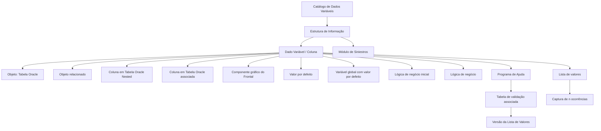

# Definição dos Dados Variáveis das Estruturas de Informação no Reef.core

## 1. Metadados do Documento
- **Arquivo de Origem:** Não identificado no conteúdo fornecido
- **Tipo de Documento:** Especificação Técnica
- **Domínio / Sistema:** Reef.core — Estruturas de Informação e Dados Variáveis
- **Público-Alvo:** Desenvolvedores, Arquitetos, Analistas Funcionais e Equipes Operacionais
- **Data/Versão Identificada:** Não identificada

---

## 2. Resumo Executivo & Contexto de Negócio

O documento especifica o catálogo de configuração de **Dados Variáveis**, também denominados atributos ou colunas, associados às **Estruturas de Informação** do núcleo do sistema Reef.core. Cada registro do catálogo representa a definição de um atributo que deve ser solicitado ou exibido em uma determinada estrutura de informação.

A configuração abrange propriedades gerais, operativas e outras propriedades. As propriedades gerais identificam a estrutura, ordenam a apresentação do dado variável e associam o dado a objetos, incluindo tabelas Oracle e objetos relacionados. As propriedades operativas controlam persistência, chave primária, visibilidade, modificação, obrigatoriedade, validação, valores padrão, lógica de negócio e programas de ajuda.

O documento estabelece que dados variáveis não modificáveis possuem um comportamento específico: a lógica de negócio do dado variável não é executada. Quando for necessário obter descrição ou validar conteúdo de um dado variável não modificável, a funcionalidade deve ser implementada por meio da lógica de negócio inicial.

Também são definidos mecanismos para listas de valores, programas de ajuda e validações baseadas em tabelas Oracle. O documento recomenda o uso do programa de ajuda `AL000020`, disponibilizado de forma *out-of-the-box* pelo Reef.core, quando a relação de valores possíveis for reduzida.

Há uma restrição operacional relevante: a interpretação e configuração desse catálogo devem respeitar as indicações do **Módulo de Siniestros**, pois esse módulo é apontado como o principal consumidor das estruturas de informação e dos dados variáveis associados.

---

## 3. Arquitetura, Componentes & Tecnologias Envolvidas

O conteúdo descreve uma arquitetura funcional de metadados, na qual um catálogo configura os atributos que compõem estruturas de informação. As configurações podem determinar como cada dado variável é apresentado no frontal, persistido em tabelas Oracle, validado, preenchido por valor padrão ou por lógica de negócio, e selecionado por programas de ajuda.

### Componentes e conceitos identificados

| Componente / Conceito | Papel descrito no documento |
| :--- | :--- |
| Reef.core | Núcleo do sistema que disponibiliza a configuração de Dados Variáveis associados às Estruturas de Informação. |
| Catálogo de Dados Variáveis | Catálogo próprio que contém a definição dos atributos ou colunas das Estruturas de Informação. |
| Estrutura de Informação | Estrutura identificada por uma chave e composta por Dados Variáveis configurados no catálogo. |
| Dado Variável / Coluna | Atributo configurável da Estrutura de Informação; deve existir no catálogo de dados variáveis em nível de companhia. |
| Tabela Oracle | Objeto ao qual uma coluna ou dado variável pode pertencer; também pode ser utilizada para consulta de ajuda e validação. |
| Tabela Oracle Nested | Tabela Oracle associada na qual um dado variável pode ser configurado como coluna. |
| Frontal | Componente gráfico que apresenta campos de uma Estrutura de Informação e permite, conforme configuração, captura ou modificação. |
| Lógica de Negócio Inicial | Lógica utilizada para obter valor e descrição de um dado variável, podendo impedir sua modificação pelo usuário. |
| Lógica de Negócio do Dado Variável | Lógica utilizada para validar valor e obter descrição do dado variável. |
| Programa de Ajuda | Programa do sistema usado para selecionar o valor de um dado variável. |
| `AL000020` | Código do programa de ajuda *out-of-the-box* do Reef.core recomendado para conjuntos reduzidos de valores possíveis. |
| Lista de Valores | Relação de valores que pode ser desencadeada por um dado variável para permitir a captura de múltiplas ocorrências. |
| Módulo de Siniestros | Módulo que utiliza majoritariamente Estruturas de Informação e os Dados Variáveis associados. |



> **Nota de Análise:** O documento descreve relações funcionais e de configuração entre componentes, mas não detalha interfaces técnicas, métodos HTTP, contratos JSON, versões de banco de dados, endpoints, ambientes ou fluxos de implantação.

---

## 4. Regras de Negócio, Especificações Funcionais & Processos

### 4.1 Definição de atributos nas Estruturas de Informação

1. O núcleo do sistema permite configurar, em catálogo próprio, quais Dados Variáveis ou colunas estarão associados às Estruturas de Informação.
2. Cada registro do catálogo corresponde à definição de um atributo de uma Estrutura de Informação.
3. Deve existir um registro para cada dado ou atributo que se pretende solicitar na Estrutura de Informação.
4. A chave da Estrutura de Informação deve ser indicada na propriedade **Estrutura**.
5. A ordem de apresentação e solicitação de um Dado Variável dentro da estrutura deve ser configurada na propriedade **Orden**.
6. O Dado Variável ou Coluna deve estar previamente definido no catálogo de dados variáveis, em nível de companhia.
7. A propriedade **Objeto** informa a tabela Oracle à qual a coluna ou dado variável pertence.
8. A propriedade **Objeto relacionado** identifica o objeto relacionado ao qual a coluna ou dado variável pertence.

### 4.2 Persistência, chave e visibilidade

1. A propriedade **El dato variable es columna de una Tabla Nested** define se o dado variável será uma coluna na tabela Oracle Nested associada.
2. A propriedade **El dato variable es columna de la tabla** define se o dado variável será uma coluna na tabela Oracle associada.
3. A propriedade **El dato variable es clave primaria** define se o dado variável integrará a chave primária.
4. A propriedade **El dato variable es visible** controla se o dado variável será visualizado no componente gráfico do frontal.
5. A propriedade **Inhabilitación** impede o uso do dado variável na captura e/ou modificação da Estrutura de Informação.

### 4.3 Modificação, valores e lógica de negócio

1. A propriedade **Dato variable modificable** define se o valor de um dado variável pode ser modificado.
2. Quando o dado variável não puder ser modificado, o campo deve ser apresentado inabilitado no componente gráfico que exibe os campos da Estrutura de Informação.
3. É possível atribuir valor a um dado variável por meio de:
   - Valor por defeito do dado variável.
   - Lógica de negócio inicial do dado variável.
4. Dados variáveis não modificáveis não executam a lógica de negócio do dado variável.
5. Quando for necessário obter descrição ou validar o conteúdo de um dado variável não modificável, essa necessidade deve ser atendida pela execução da lógica de negócio inicial.
6. A propriedade **Valor por defecto del dato variable** aplica um valor padrão quando o dado variável não possui valor.
7. A propriedade **Variable global con valor por defecto** permite fornecer dinamicamente um valor padrão quando o dado variável não possui valor.
8. A propriedade **Lógica de negocio inicial del dato variable** pode:
   - Obter o valor do dado variável.
   - Obter a descrição do dado variável.
   - Impedir que o usuário modifique o valor.
9. A propriedade **Lógica de negocio del dato variable** pode:
   - Validar o valor do dado variável.
   - Obter a descrição do dado variável.

### 4.4 Obrigatoriedade e validação

1. A propriedade **Dato variable obligatorio** define se o valor do dado variável deve obrigatoriamente ser capturado na Estrutura de Informação ou se pode permanecer vazio.
2. A propriedade **Validación si no tiene Valor** permite validar o dado variável mesmo quando ele não possui valor.
3. A validação de dados sem valor permite controlar se o preenchimento é obrigatório conforme as características da Estrutura de Informação.
4. A propriedade **Validación on-line del dato variable** define se a validação do dado variável deve ser realizada de forma *on-line*.

### 4.5 Ajuda, tabelas de validação e listas de valores

1. A propriedade **Programa de Ayuda** aponta para o programa de ajuda do sistema que permite selecionar o valor do dado variável.
2. Quando a relação de valores possíveis do dado variável for reduzida, o atributo de programa de ajuda deve conter `AL000020`.
3. O código `AL000020` corresponde ao programa de ajuda *out-of-the-box* disponibilizado pelo Reef.core.
4. A propriedade **Tabla de validación asociada** informa a tabela Oracle sobre a qual será feita uma consulta quando o usuário pressionar o ícone de ajuda no frontal.
5. O valor da tabela de validação associada está relacionado ao atributo que indica o Programa de Ajuda.
6. A propriedade **Versión de la Lista de Valores** contém a versão da relação de valores da tabela de validação associada que deve ser utilizada para obter o valor do dado variável.
7. A propriedade **Variable Global de Ayuda** está descontinuada e obsoleta no núcleo do sistema.
8. A propriedade **Variable Global de Ayuda** não pode ser utilizada ou reutilizada para qualquer propósito de âmbito local.
9. Originalmente, a Variável Global de Ajuda indicava a variável global na qual era armazenado o valor selecionado após a chamada ao Programa de Ajuda.
10. A propriedade **Lista de valores del dato variable** contém o nome da lista de valores que o dado variável desencadeia para permitir a captura de `n` ocorrências.
11. O valor da lista de valores deve ser replicado nos dados variáveis da Estrutura de Informação que compõem essa lista.
12. A coluna **Nivel del Dato Variable** deve ter valor constante `5` exclusivamente nos dados variáveis que devem ser solicitados repetidamente pela execução de uma lista de valores à qual estejam associados.

### 4.6 Apresentação e sensibilidade de valores

1. A propriedade **Sensible a mayúsculas y minúsculas** define se caracteres maiúsculos e minúsculos têm relevância no valor do dado variável.
2. O documento apresenta como exemplo a diferenciação entre `pH` e `PH`.
3. A propriedade **Panel de Visualización** identifica o painel em que o dado variável é visualizado.
4. Os painéis permitem estruturar e apresentar os dados variáveis de forma agrupada.

### 4.7 Dependência operacional

1. As indicações definidas pelo Módulo de Siniestros devem ser respeitadas.
2. O Módulo de Siniestros é o módulo que majoritariamente utiliza as Estruturas de Informação e os Dados Variáveis associados.
3. A leitura isolada do documento pode levar a interpretações incorretas; devem ser consultadas as diretrizes e documentos vinculados.

---

## 5. Tabelas de Parâmetros, Ambientes e Estruturas de Dados

### 5.1 Propriedades gerais

| Item / Parâmetro | Descrição / Função | Tipo / Valores / Formato | Ambiente / Observações |
| :--- | :--- | :--- | :--- |
| Estrutura | Indica a chave que identifica a Estrutura de Informação. | Chave da estrutura. | Propriedade geral. |
| Orden | Indica a ordem ou sequência de apresentação e solicitação do Dado Variável dentro da estrutura. | Ordem / sequência. | Propriedade geral. |
| Dato Variable / columna | Indica a chave do Dado Variável ou Coluna definido na Estrutura de Informação. | Chave de dado variável ou coluna. | Deve estar definido no catálogo de dados variáveis em nível de companhia. |
| Objeto | Indica o objeto, identificado como tabela Oracle, ao qual a coluna ou dado variável pertence dentro da Estrutura de Informação. | Objeto / tabela Oracle. | Propriedade geral. |
| Objeto relacionado | Indica o objeto relacionado ao qual a coluna ou dado variável pertence. | Objeto relacionado. | Propriedade geral. |

### 5.2 Propriedades operativas

| Item / Parâmetro | Descrição / Função | Tipo / Valores / Formato | Ambiente / Observações |
| :--- | :--- | :--- | :--- |
| El dato variable es columna de una Tabla Nested | Define se o dado variável ou coluna será coluna na tabela Oracle Nested associada. | Sim / Não, conforme configuração. | Propriedade operativa. |
| El dato variable es columna de la tabla | Define se o dado variável será coluna na tabela Oracle associada. | Sim / Não, conforme configuração. | Propriedade operativa. |
| El dato variable es clave primaria | Define se o dado variável faz parte da chave primária. | Sim / Não, conforme configuração. | Propriedade operativa. |
| El dato variable es visible | Define se o dado variável é visualizado no componente gráfico do frontal. | Sim / Não, conforme configuração. | Propriedade operativa. |
| Dato variable modificable | Define se o valor do dado variável pode ser modificado. | Sim / Não, conforme configuração. | Quando não modificável, o campo aparece inabilitado no componente gráfico. |
| Dato variable obligatorio | Define se o valor deve ser obrigatoriamente capturado. | Obrigatório / pode permanecer vazio. | Aplicável à captura na Estrutura de Informação. |
| Validación si no tiene Valor | Permite validar o dado variável mesmo sem valor. | Sim / Não, conforme configuração. | Permite controlar obrigatoriedade conforme características da estrutura. |
| Valor por defecto del dato variable | Fornece valor padrão quando o dado variável não possui valor. | Valor padrão. | Aplicado somente quando não houver valor. |
| Variable global con valor por defecto | Fornece dinamicamente valor padrão quando o dado variável não possui valor. | Variável global. | Aplicado somente quando não houver valor. |
| Lógica de negocio inicial del dato variable | Contém lógica para obter valor e descrição; pode impedir modificação pelo usuário. | Lógica de Negócio. | Deve ser usada para descrição ou validação de dados não modificáveis. |
| Lógica de negocio del dato variable | Contém lógica para validar valor e obter descrição. | Lógica de Negócio. | Não é executada para dados variáveis não modificáveis. |
| Programa de Ayuda | Aponta para programa de ajuda usado para selecionar o valor do dado variável. | Código de programa. | Recomenda-se `AL000020` para relação reduzida de valores. |
| Tabla de validación asociada | Informa a tabela Oracle consultada quando o usuário aciona o ícone de ajuda no frontal. | Nome de tabela Oracle. | Relacionada ao atributo Programa de Ayuda. |
| Versión de la Lista de Valores | Informa a versão da relação de valores da tabela de validação associada. | Versão de lista de valores. | Usada para obter o valor do dado variável. |
| Variable Global de Ayuda | Originalmente indicava a variável global de armazenamento do valor selecionado pela ajuda. | Funcionalidade descontinuada. | Obsoleta; não pode ser usada ou reutilizada localmente. |
| Lista de valores del dato variable | Contém o nome da lista de valores disparada pelo dado variável. | Nome de lista de valores. | Permite captura de `n` ocorrências; deve ser replicada nos dados que compõem a lista. |
| Nivel del Dato Variable | Identifica dados variáveis solicitados repetidamente por uma lista de valores. | Valor constante `5`. | Usar somente para dados associados a uma lista de valores que exige repetição. |
| Sensible a mayúsculas y minúsculas | Define se maiúsculas e minúsculas são relevantes no valor. | Sensível / não sensível a caixa. | Exemplo documentado: `pH` e `PH`. |
| Panel de Visualización | Indica o painel de exibição do dado variável. | Painel. | Permite agrupamento e estruturação da apresentação. |
| Validación on-line del dato variable | Define se a validação deve ser realizada *on-line*. | On-line / não on-line. | Propriedade operativa. |

### 5.3 Outras propriedades e referências

| Item / Parâmetro | Descrição / Função | Tipo / Valores / Formato | Ambiente / Observações |
| :--- | :--- | :--- | :--- |
| Inhabilitación | Indica que o Dado Variável da Estrutura de Informação está inabilitado para uso. | Inabilitado / não inabilitado. | Afeta captura e/ou modificação da Estrutura de Informação. |
| Datos Variables | Documento ou referência vinculada. | Referência documental. | Recomendado consultar para evitar interpretação isolada. |
| Estructuras de Información | Documento ou referência vinculada. | Referência documental. | Recomendado consultar para evitar interpretação isolada. |
| Paneles de Información | Documento ou referência vinculada. | Referência documental. | Recomendado consultar para evitar interpretação isolada. |
| Preguntas frecuentes | Documento ou referência vinculada. | Referência documental. | Recomendado consultar para evitar interpretação isolada. |
| Módulo de Siniestros | Módulo que utiliza majoritariamente estruturas e dados variáveis associados. | Dependência funcional. | Suas indicações devem ser respeitadas. |

---

## 6. Bateria de Perguntas & Respostas para RAG (FAQ Sintético)

### P1: O que representa cada registro do catálogo de Dados Variáveis no Reef.core?
**R:** Cada registro do catálogo representa a definição de um atributo de uma Estrutura de Informação. Deve existir um registro para cada dado ou atributo que se deseja solicitar dentro da estrutura.

### P2: Como um Dado Variável é associado a uma Estrutura de Informação?
**R:** A propriedade **Estrutura** identifica a chave da Estrutura de Informação, enquanto a propriedade **Dato Variable / columna** indica a chave do atributo ou coluna. O dado variável deve estar previamente definido no catálogo de dados variáveis em nível de companhia.

### P3: Como configurar a ordem em que um Dado Variável aparece na Estrutura de Informação?
**R:** A ordem ou sequência em que o Dado Variável é mostrado e solicitado deve ser definida pela propriedade **Orden**.

### P4: O que acontece quando um Dado Variável não é modificável?
**R:** Quando a propriedade **Dato variable modificable** não permite modificação, o campo aparece inabilitado no componente gráfico que exibe os campos da Estrutura de Informação. Além disso, dados variáveis não modificáveis não executam a lógica de negócio do dado variável.

### P5: Como obter descrição ou validar o conteúdo de um Dado Variável não modificável?
**R:** Para um Dado Variável não modificável, a lógica de negócio do dado variável não é executada. Caso seja necessário obter descrição ou validar conteúdo, isso deve ser realizado por meio da **Lógica de negocio inicial del dato variable**.

### P6: Quando o valor padrão de um Dado Variável é aplicado?
**R:** A propriedade **Valor por defecto del dato variable** fornece um valor padrão somente quando o dado variável não possui valor. A propriedade **Variable global con valor por defecto** também pode fornecer dinamicamente um valor padrão sob essa mesma condição.

### P7: Como funciona a obrigatoriedade de preenchimento de um Dado Variável?
**R:** A propriedade **Dato variable obligatorio** define se o valor precisa ser obrigatoriamente capturado ou pode permanecer vazio. A propriedade **Validación si no tiene Valor** permite validar o dado mesmo sem valor, possibilitando controlar a obrigatoriedade conforme as características da Estrutura de Informação.

### P8: Qual Programa de Ajuda deve ser utilizado quando há poucos valores possíveis?
**R:** Quando a relação de valores possíveis do Dado Variável for reduzida, o documento recomenda configurar o atributo **Programa de Ayuda** com o valor `AL000020`, código do programa de ajuda *out-of-the-box* fornecido pelo Reef.core.

### P9: Para que serve a Tabela de Validação Associada?
**R:** A propriedade **Tabla de validación asociada** informa o nome da tabela Oracle sobre a qual será efetuada a consulta quando o usuário pressionar o ícone de ajuda no frontal. Essa propriedade está relacionada ao atributo que define o Programa de Ajuda.

### P10: A Variável Global de Ajuda pode ser reutilizada para uma nova necessidade local?
**R:** Não. A propriedade **Variable Global de Ayuda** está descontinuada e obsoleta no núcleo do sistema. O documento determina que ela não pode ser usada ou reutilizada para qualquer propósito de âmbito local.

### P11: Como deve ser configurado o nível de um Dado Variável associado a uma Lista de Valores?
**R:** A coluna **Nivel del Dato Variable** deve possuir o valor constante `5` somente para dados variáveis que precisam ser solicitados repetidamente por meio da execução de uma lista de valores à qual estejam associados.

### P12: O que significa a propriedade de sensibilidade a maiúsculas e minúsculas?
**R:** A propriedade **Sensible a mayúsculas y minúsculas** informa se há relevância em utilizar caracteres maiúsculos ou minúsculos no valor do Dado Variável. O documento exemplifica essa diferença com os valores `pH` e `PH`.

### P13: Qual é a finalidade do Painel de Visualização?
**R:** A propriedade **Panel de Visualización** indica o painel em que o Dado Variável será visualizado. Essa configuração permite estruturar e apresentar os dados variáveis de maneira agrupada.

### P14: Que dependência operacional deve ser considerada ao configurar esse catálogo?
**R:** Devem ser respeitadas as indicações definidas pelo **Módulo de Siniestros**, pois esse módulo é apontado como o principal usuário das Estruturas de Informação e dos Dados Variáveis associados.

---

## 7. Glossário de Termos, Siglas & Conceitos-Chave

- **Reef.core:** Núcleo do sistema que inclui a funcionalidade de configuração de Dados Variáveis associados às Estruturas de Informação.
- **Estrutura de Informação:** Estrutura identificada por uma chave e composta por Dados Variáveis configurados em catálogo.
- **Dado Variável:** Atributo ou coluna associado a uma Estrutura de Informação.
- **Catálogo de Dados Variáveis:** Catálogo que contém as definições de atributos ou colunas das Estruturas de Informação.
- **Objeto:** Tabela Oracle à qual uma coluna ou Dado Variável pertence.
- **Objeto relacionado:** Objeto relacionado ao qual uma coluna ou Dado Variável pertence.
- **Tabela Oracle Nested:** Tabela Oracle associada em que um Dado Variável pode ser configurado como coluna.
- **Frontal:** Componente gráfico no qual os Dados Variáveis podem ser exibidos, capturados ou modificados, conforme configuração.
- **Lógica de Negócio Inicial:** Lógica que pode obter valor e descrição de um Dado Variável e impedir alteração pelo usuário.
- **Lógica de Negócio do Dado Variável:** Lógica que pode validar valor e obter descrição de um Dado Variável.
- **Programa de Ajuda:** Programa do sistema usado para selecionar o valor de um Dado Variável.
- **`AL000020`:** Código de Programa de Ajuda *out-of-the-box* do Reef.core, recomendado para relações reduzidas de valores possíveis.
- **Tabela de Validação Associada:** Tabela Oracle consultada ao acionar o ícone de ajuda no frontal.
- **Lista de Valores:** Relação de valores acionada por um Dado Variável para permitir a captura de múltiplas ocorrências.
- **Módulo de Siniestros:** Módulo que utiliza majoritariamente Estruturas de Informação e Dados Variáveis associados.
- **Inhabilitación:** Propriedade que desabilita o uso do Dado Variável para captura e/ou modificação na Estrutura de Informação.

---

## 8. Notas Críticas, Riscos & Limitações

- **Dependência do Módulo de Siniestros:** As indicações desse módulo devem ser respeitadas, pois ele é o principal consumidor das Estruturas de Informação e dos Dados Variáveis associados.
- **Risco de interpretação isolada:** O próprio documento recomenda consultar diretrizes e documentos vinculados — Dados Variáveis, Estruturas de Informação, Painéis de Informação e Perguntas Frequentes — para evitar conclusões incorretas.
- **Propriedade obsoleta:** A **Variable Global de Ayuda** está descontinuada e não pode ser reutilizada para finalidade local.
- **Restrição de lógica de negócio:** Dados variáveis não modificáveis não executam a lógica de negócio do dado variável; descrição e validação necessárias devem ser tratadas pela lógica de negócio inicial.
- **Restrição de nível:** O valor constante `5` em **Nivel del Dato Variable** somente deve ser utilizado para dados solicitados repetidamente por uma lista de valores associada.
- **Ausência de detalhes técnicos adicionais:** O conteúdo não informa contratos de integração, URLs, ambientes, credenciais, versões do Reef.core, versões Oracle, modelos físicos de tabelas, schemas, nomes de APIs ou critérios detalhados de implementação da lógica de negócio.

---

## 9. Conteúdo Bruto Estruturado (Referência Fiel)

```text
--- [PÁGINA 1 DE 5] ---

DEFINICIÓN de los Datos Variables de las
Estructuras de Información
Funcionalmente, el núcleo del Sistema cuenta con la posibilidad de configurar (en un catálogo propio)
qué Datos Variables o columnas van a estar asociados a las estructuras de información.
Cada registro de este catálogo es la definición de un atributo de la estructura, es decir se definirá un
registro por cada dato, atributo que se quiera solicitar.
Propiedades generales
Propiedades Operativas
Otras Propiedades
Propiedades generales
Estructura
Esta propiedad indica la clave con la que se identifica a la Estructura de Información.
Orden
Este atributo indica el orden o secuencia en el que se muestra y solicita el Dato Variable dentro de la
estructura.
Dato Variable/columna
 / 
 CF
Home Solutions APIs Documentation Zeus
EN


--- [PÁGINA 2 DE 5] ---

Este Campo indica la clave del Dato Variable/Columna que se define en la estructura de información.
Tiene que estar definido en el catálogo de datos variables (atributos) a nivel de compañía.
Objeto
Este atributo indica el objeto (Tabla Oracle) al que pertenece la columna o dato variable dentro de la
estructura de información.
Objeto relacionado
Esta propiedad indica el objeto relacionado al que pertenece la columna o dato variable dentro de la
estructura de información.
Propiedades Operativas
El dato variable es columna de una Tabla Nested
Este atributo indica si el dato variable/columna de la estructura de información va a ser o no una
columna en la tabla Oracle Nested asociada.
El dato variable es columna de la tabla
Esta propiedad le indica al sistema que el dato variable de la estructura de información va a ser o no,
una columna en la tabla Oracle asociada.
El dato variable es clave primaria
Esta propiedad le indica al sistema que el dato variable de la estructura de información va a formar
parte o no, de la clave primaria.
El dato variable es visible
Esta propiedad le indica al sistema que el dato variable de la estructura de información va a ser o no
visualizado en el componente gráfico del frontal.
Dato variable modificable
Este atributo permite establecer en la definición si se permite o no modificar el valor del dato variable.
Si no se permitiera modificar el valor del dato variable, el campo aparecerá inhabilitado en el
componente gráfico que muestra los campos de la estructura de información.


--- [PÁGINA 3 DE 5] ---

Es posible asignar un valor al dato variable mediante el uso de los atributos valor por defecto o
lógica de negocio inicial del dato variable.
Los datos variables no modificables no ejecutan la lógica de negocio del dato variable por lo que si
se requiere obtener su descripción o validar su contenido esto se ha de realizar mediante la
ejecución de la lógica de negocio inicial.
Dato variable obligatorio
Este atributo señala si el valor del Dato Variable debe ser obligatoriamente capturado en la estructura
de información o por el contrario puede dejarse vacío.
Validación si no tiene Valor
Este atributo permite que el sistema valide el Dato Variable en la Estructura aún cuando este no
tenga valor alguno, pudiendo de esta forma controlar el que sea o no obligatorio de acuerdo con las
características de la Estructura de información.
Valor por defecto del dato variable
Este atributo se utiliza para dar un valor por defecto al dato variable siempre y cuando el dato
variable no tenga valor alguno.
Variable global con valor por defecto
Este atributo permite dar dinámicamente un valor por defecto al dato variable siempre y cuando el
dato variable no tenga valor alguno.
Lógica de negocio inicial del dato variable
Esta propiedad contiene una Lógica de Negocio que permite obtener el valor del dato variable
además de su descripción e impedir que el Usuario pueda modificar su valor.
Lógica de negocio del dato variable
Este atributo contiene una Lógica de Negocio que permite validar el valor del dato variable además
de obtener la descripción del mismo.
Programa de Ayuda
Esta propiedad apunta al Programa de Ayuda del Sistema desde el cual se permita seleccionar el
valor del dato variable.
Consejo:


--- [PÁGINA 4 DE 5] ---

En el caso que la relación de los valores posibles del dato variable sea un número reducido de
valores este atributo debería contener el valor 'AL000020' (código del programa de ayuda out-of-
the-box que trae Reef.core)
Tabla de validación asociada
En este atributo se indica el nombre de la Tabla Oracle sobre la cual se efectuará la operación de
consulta si el usuario pulsa el icono de ayuda en el Frontal.
El valor de esta propiedad está relacionado con el atributo que indica el Programa de Ayuda
Versión de la Lista de Valores
Este atributo contiene la versión de la relación de valores de la Tabla de validación asociada que se
ha de emplear para obtener el valor del dato variable de la estructura de información.
Variable Global de Ayuda
La funcionalidad de esta propiedad está descontinuada y obsoleta en el núcleo del sistema por lo que
no se puede usar o reutilizar para ningún propósito de ámbito local.
Originalmente esta propiedad le indicaba al sistema la variable global en la que se depositaba el
valor seleccionado tras realizar la llamada al Programa de Ayuda.
Lista de valores del dato variable
Esta propiedad contiene el nombre de la lista de valores que el dato variable va a desencadenar para
permitir la captura de n ocurrencias.
El valor de este atributo se replica en aquellos datos variables de la estructura de información
que componen la lista de valores.
Nivel del Dato Variable
Esta columna ha de tener el valor constante 5 únicamente en aquellos datos variables que se han de
solicitar repetidamente mediante la ejecución de una determinada lista de valores (a la que están
asociados)
Sensible a mayúsculas y minúsculas


--- [PÁGINA 5 DE 5] ---

Esta propiedad le indica al sistema si en el valor del dato variable tiene o no relevancia escribir un
carácter en mayúsculas o minúsculas (ejemplo: pH y PH).
Panel de Visualización
Este atributo indica el panel en el que se visualiza el dato variable pudiendo así estructurarlos y
presentarlos de manera agrupada.
Validación on-line del dato variable
Este atributo permite distinguir si la validación del dato variable se ha de realizar de forma on-line o
no.
Otras Propiedades
Inhabilitación
Esta propiedad indica en el Sistema que el Dato Variable dentro de la Estructura de Información está
inhabilitado para ser utilizado en la captura y/o modificación de la Estructura de Información.
Vínculos
Relación de Directrices y Documentos cuya lectura está recomendada para evitar que la
interpretación aislada del presente documento pueda conducir a error.
Datos Variables
Estructuras de Información
Paneles de Información
Preguntas frecuentes
(1) ¿Existe alguna circunstancia operativa que deba ser tomada en consideración sobre este
catálogo?
Se deben respetar las indicaciones definidas por el Módulo de Siniestros puesto que este módulo es
es que mayormente utiliza las estructuras de información así como los datos variables asociados a
ellas.
```
