# Definição das Estruturas de Informação no Reef.core

## 1. Metadados do Documento
- **Arquivo de Origem:** Não identificado no conteúdo fornecido
- **Tipo de Documento:** Especificação Técnica
- **Domínio / Sistema:** Reef.core; Módulo de Siniestros; MAPFRE Local
- **Público-Alvo:** Desenvolvedores, Arquitetos, Operação e Negócio
- **Data/Versão Identificada:** Não identificada

---

## 2. Resumo Executivo & Contexto de Negócio

O documento descreve a definição e a configuração de **Estruturas de Informação** no núcleo do sistema **Reef.core**. O núcleo disponibiliza um repositório de informação específico, entregue às instalações com conteúdo inicial conforme uma classificação de agrupamentos considerada necessária pelo próprio núcleo.

Uma Estrutura de Informação é identificada por uma chave e possui uma denominação ou descrição. A configuração da estrutura define se o sistema deve manter histórico das alterações feitas em suas definições, além de estabelecer associações com entidades de banco de dados, programas, lógicas de negócio, procedimentos Oracle e recursos web.

O documento especifica mecanismos para executar fluxos principais e complementares. Uma estrutura pode possuir estrutura anexa, tabela anexa, programa anexo e procedimento Oracle anexo associados. Esses elementos complementares são executados após o fluxo, programa ou procedimento original, permitindo implementar uma árvore de estruturas.

Também são descritas operações dinâmicas para carga, eliminação, transferência, exibição e validação de registros. O atributo **Tipo de Operação Funcional** identifica operações funcionais do sistema para o **Módulo de Siniestros**.

A orientação operacional explícita é preservar a configuração inicial fornecida. A configuração pode ser complementada conforme necessidades específicas da entidade **MAPFRE Local**.

---

## 3. Arquitetura, Componentes & Tecnologias Envolvidas

### Componentes e conceitos identificados

| Componente / Conceito | Papel descrito no documento |
| :--- | :--- |
| Reef.core | Núcleo do sistema que permite codificar e identificar Estruturas de Informação e executar sua carga. |
| Repositório de informação | Repositório específico no qual as Estruturas de Informação são codificadas e identificadas. |
| Estrutura de Informação | Unidade configurável identificada por chave, com propriedades, dados, programas, lógicas e procedimentos associados. |
| Entidade de Base de Dados | Entidade que armazena os dados de uma Estrutura de Informação. |
| Tabela | Nome da entidade de banco de dados que armazena os dados da estrutura. |
| Programa | Programa executado quando a Estrutura de Informação é chamada. |
| Lógica de Negócio | Lógica utilizada para realizar validações. |
| Lógica de Negócio para a Carga | Lógica que permite executar a carga da Estrutura de Informação no Reef.core. |
| Procedimento Oracle | Procedimento utilizado para carga, transferência, exibição ou validações sobre informações da estrutura. |
| Estrutura Anexa Associada | Estrutura complementar executada após o fluxo da estrutura inicial. |
| Tabela Anexa Associada | Tabela de banco de dados com dados complementares aos da tabela original. |
| Programa Anexo Associado | Programa complementar executado após o programa original. |
| Procedimento Anexo Associado | Procedimento Oracle complementar executado após o procedimento Oracle original. |
| URL-TRATAR | Endereço web de recurso utilizado para executar a Operação Reef.core que atende as informações da tabela. |
| Módulo de Siniestros | Módulo para o qual o Tipo de Operação Funcional identifica operações funcionais. |
| MAPFRE Local | Entidade local cujas necessidades específicas podem justificar complementação da configuração inicial. |

### Fluxo lógico extraído

```mermaid
graph TD
    A[Estrutura de Informação] --> B[Chave da Estrutura]
    A --> C[Nome da Estrutura]
    A --> D[Histórico]
    A --> E[Tabela / Entidade de Base de Dados]
    A --> F[Programa]
    A --> G[Lógica de Negócio]
    A --> H[Lógica de Negócio para a Carga]
    A --> I[Procedimento Dinâmico para Carga]
    A --> J[URL-TRATAR]

    E --> K[Dados da Estrutura de Informação]
    F --> L[Execução ao chamar a Estrutura]
    G --> M[Validações]
    H --> N[Carga no Reef.core]
    I --> N
    J --> O[Operação Reef.core que atende a informação da Tabela]

    A --> P[Estrutura Anexa Associada]
    A --> Q[Tabela Anexa Associada]
    A --> R[Programa Anexo Associado]
    A --> S[Procedimento Anexo Associado]

    P --> T[Execução após o fluxo inicial]
    Q --> U[Dados complementares]
    R --> V[Execução após o Programa original]
    S --> W[Execução após o Procedimento Oracle original]

    A --> X[Operações Dinâmicas]
    X --> Y[ELIMINAR]
    X --> Z[TRASPASAR]
    X --> AA[MOSTRAR]
    X --> AB[Validação sobre informações]
```



> **Nota de Análise:** O documento nomeia programas, lógicas de negócio, procedimentos Oracle e uma URL de tratamento como propriedades configuráveis, mas não informa nomes concretos, contratos, métodos HTTP, formatos de mensagem, esquemas de banco de dados ou critérios de execução.

---

## 4. Regras de Negócio, Especificações Funcionais & Processos

### 4.1 Definição e identificação de Estruturas de Informação

1. O núcleo do sistema possui capacidade de codificar e identificar Estruturas de Informação.
2. As Estruturas de Informação são mantidas em um repositório de informação específico.
3. O repositório é entregue às instalações com determinado conteúdo inicial.
4. O conteúdo inicial é disponibilizado de acordo com a classificação de agrupamentos que o núcleo considera necessária.
5. A chave da propriedade **Estrutura** identifica a Estrutura de Informação no sistema.
6. O atributo **Nome da Estrutura** representa a denominação ou descrição da Estrutura de Informação.
7. A propriedade **Histórico** define se a Estrutura de Informação permite ou não manter histórico das mudanças em suas definições.

### 4.2 Persistência, execução e validação

1. A propriedade **Tabela** define o nome da entidade de banco de dados que armazena os dados da Estrutura de Informação.
2. A propriedade **Programa** define o nome do programa a executar quando a Estrutura de Informação é chamada.
3. A propriedade **Lógica de Negócio** define o nome da lógica de negócio usada para realizar validações.
4. A propriedade **Lógica de Negócio para a Carga de la Estructura** define a lógica de negócio que permite executar a carga da Estrutura de Informação no Reef.core.
5. A propriedade **Procedimento Dinâmico para Efectuar la Carga de la Estructura** define o procedimento que permite executar a carga da Estrutura de Informação no Reef.core.
6. A propriedade **Procedimento Dinâmico** define o procedimento Oracle que permite realizar validações necessárias sobre as informações da Estrutura de Informação.

### 4.3 Estruturas, tabelas, programas e procedimentos anexos

1. A propriedade **Estrutura Anexa Associada** define uma Estrutura de Informação complementar.
2. A Estrutura de Informação complementar é executada após o término do fluxo de execução da Estrutura de Informação inicial.
3. A associação de estruturas permite implementar uma árvore de estruturas.
4. A propriedade **Tabela Anexa Associada** define uma tabela anexa de banco de dados.
5. A tabela anexa contém dados complementares aos dados da tabela original definida na Estrutura de Informação.
6. A propriedade **Programa Anexo Associado** define um programa complementar.
7. O programa complementar é executado após o término do programa original definido na Estrutura de Informação.
8. A propriedade **Procedimento Anexo Associado** define um procedimento Oracle complementar.
9. O procedimento Oracle complementar é executado após o término da execução do procedimento Oracle original definido na Estrutura de Informação.

### 4.4 Operações dinâmicas e operação funcional

1. O atributo **Tipo de Conceito Lógico** contém o valor da classificação do tipo de conceito lógico associado à Estrutura de Informação.
2. O atributo **URL-TRATAR** contém a direção web de um recurso web.
3. O recurso web identificado por **URL-TRATAR** especifica uma localização em rede informática e um mecanismo para recuperação do recurso.
4. A URL é utilizada para executar a **Operação Reef.core** responsável por atender as informações da tabela.
5. A propriedade **Procedimento Dinâmico - ELIMINAR** define a lógica de negócio executada na ação de eliminar um registro da tabela.
6. A propriedade **Procedimento Dinâmico - TRASPASAR** define o procedimento Oracle executado na ação de transferir um registro da tabela.
7. A propriedade **Procedimento Dinâmico - MOSTRAR** define o procedimento Oracle executado na ação de mostrar um registro da tabela.
8. O atributo **Tipo de Operação Funcional** identifica expressamente as operações funcionais do sistema para o Módulo de Siniestros.

### 4.5 Regra de configuração inicial

1. A configuração inicialmente fornecida deve ser respeitada.
2. A configuração pode ser complementada de acordo com necessidades específicas da entidade MAPFRE Local.

---

## 5. Tabelas de Parâmetros, Ambientes e Estruturas de Dados

| Item / Parâmetro | Descrição / Função | Tipo / Valores / Formato | Ambiente / Observações |
| :--- | :--- | :--- | :--- |
| Estrutura | Chave pela qual a Estrutura de Informação é identificada no sistema. | Chave de identificação; formato não informado. | Aplicável à definição da Estrutura de Informação. |
| Nome da Estrutura | Denominação ou descrição da Estrutura de Informação. | Atributo textual; formato não informado. | Aplicável à definição da Estrutura de Informação. |
| Histórico | Indica se a Estrutura de Informação permite manter histórico das alterações em suas definições. | Indicador de permissão; valores específicos não informados. | Aplicável à definição da Estrutura de Informação. |
| Tabela | Nome da entidade de banco de dados que armazena os dados da estrutura. | Nome de entidade de Base de Dados. | Associada à Estrutura de Informação. |
| Programa | Nome do programa a executar quando a estrutura é chamada. | Nome de programa. | Executado na chamada da Estrutura de Informação. |
| Lógica de Negócio | Nome da lógica de negócio usada para validações. | Nome de lógica de negócio. | Aplicável à validação. |
| Lógica de Negócio para a Carga de la Estructura | Nome da lógica de negócio que permite executar a carga da Estrutura de Informação. | Nome de lógica de negócio. | Carga no Reef.core. |
| Estrutura Anexa Associada | Nome da Estrutura de Informação complementar. | Nome de Estrutura de Informação. | Executada após o fluxo da estrutura inicial; permite árvore de estruturas. |
| Tabela Anexa Associada | Nome da tabela anexa que contém dados complementares. | Nome de tabela de Base de Dados. | Complementa a tabela original definida na estrutura. |
| Programa Anexo Associado | Nome do programa complementar. | Nome de programa. | Executado após o programa original. |
| Procedimento Anexo Associado | Nome do procedimento Oracle complementar. | Nome de procedimento Oracle. | Executado após o procedimento Oracle original. |
| Tipo de Conceito Lógico | Classificação do tipo de conceito lógico associado à estrutura. | Valor de classificação; valores permitidos não informados. | Associado à Estrutura de Informação. |
| Procedimento Dinâmico para Efectuar la Carga de la Estructura | Nome do procedimento que executa a carga da estrutura. | Nome de procedimento; tecnologia específica não informada neste campo. | Carga no Reef.core. |
| URL-TRATAR | Direção web de recurso para executar a Operação Reef.core que atende a informação da tabela. | URL; formato e protocolo não informados. | Recurso localizado em rede informática. |
| Procedimento Dinâmico - ELIMINAR | Lógica de negócio executada ao eliminar registro da tabela. | Nome de lógica de negócio. | Ação de eliminação de registro. |
| Procedimento Dinâmico - TRASPASAR | Procedimento Oracle executado ao transferir registro da tabela. | Nome de procedimento Oracle. | Ação de transferência de registro. |
| Procedimento Dinâmico - MOSTRAR | Procedimento Oracle executado ao mostrar registro da tabela. | Nome de procedimento Oracle. | Ação de exibição de registro. |
| Procedimento Dinâmico | Procedimento Oracle que permite realizar validações necessárias sobre informações da estrutura. | Nome de procedimento Oracle. | Aplicável às validações. |
| Tipo de Operação Funcional | Identifica operações funcionais do sistema. | Atributo de identificação; valores não informados. | Específico do Módulo de Siniestros. |
| Vínculos | Relação de diretrizes e documentos cuja leitura é recomendada. | Relação documental; itens não informados. | Visa evitar interpretação isolada incorreta. |
| Configuração inicialmente provida | Configuração base que deve ser respeitada. | Configuração inicial; conteúdo não detalhado. | Pode ser complementada para necessidades da MAPFRE Local. |

---

## 6. Bateria de Perguntas & Respostas para RAG (FAQ Sintético)

### P1: Qual é a função das Estruturas de Informação no Reef.core?
**R:** As Estruturas de Informação são elementos que o núcleo do Reef.core pode codificar e identificar em um repositório de informação específico. Cada estrutura pode ser configurada com identificação, nome, histórico, entidade de banco de dados, programas, lógicas de negócio, procedimentos e associações complementares.

### P2: Como uma Estrutura de Informação é identificada no sistema?
**R:** A Estrutura de Informação é identificada no sistema pela propriedade **Estrutura**, que contém a chave pela qual a estrutura é reconhecida. O atributo **Nome da Estrutura** contém a denominação ou descrição da mesma estrutura.

### P3: Para que serve a propriedade Histórico da Estrutura de Informação?
**R:** A propriedade **Histórico** informa ao sistema se a Estrutura de Informação permite ou não manter histórico das alterações efetuadas em suas definições. O documento não informa os valores técnicos usados para representar essa permissão.

### P4: Qual propriedade define onde os dados de uma Estrutura de Informação são armazenados?
**R:** A propriedade **Tabela** indica o nome da entidade de Base de Dados que armazena os dados da Estrutura de Informação. O documento não detalha o banco de dados, os nomes das entidades ou o esquema das tabelas.

### P5: O que ocorre quando uma Estrutura de Informação é chamada?
**R:** Quando uma Estrutura de Informação é chamada, o sistema executa o programa cujo nome está configurado na propriedade **Programa**. O documento não descreve o comportamento interno desse programa nem seus parâmetros de entrada e saída.

### P6: Como são realizadas as validações de uma Estrutura de Informação?
**R:** As validações podem ser associadas por meio da propriedade **Lógica de Negócio**, que indica o nome da lógica de negócio para validações, e por meio da propriedade **Procedimento Dinâmico**, que indica o nome do procedimento Oracle capaz de executar validações necessárias sobre as informações da estrutura.

### P7: Como funciona a carga de uma Estrutura de Informação no Reef.core?
**R:** A carga da Estrutura de Informação no Reef.core pode ser configurada por dois elementos: a **Lógica de Negócio para a Carga de la Estructura**, que identifica a lógica de negócio para carga, e o **Procedimento Dinâmico para Efectuar la Carga de la Estructura**, que identifica o procedimento que executa a carga.

### P8: O que é uma Estrutura Anexa Associada?
**R:** A **Estrutura Anexa Associada** é uma Estrutura de Informação complementar executada depois da finalização do fluxo de execução da Estrutura de Informação inicial. Essa associação permite implementar uma árvore de estruturas.

### P9: Para que servem a Tabela Anexa, o Programa Anexo e o Procedimento Anexo?
**R:** A **Tabela Anexa Associada** contém dados complementares aos dados da tabela original. O **Programa Anexo Associado** é executado após o programa original. O **Procedimento Anexo Associado** é um procedimento Oracle complementar executado após o procedimento Oracle original.

### P10: Qual é o papel do atributo URL-TRATAR?
**R:** O atributo **URL-TRATAR** contém uma direção web referente a um recurso em rede. Esse recurso define sua localização e um mecanismo de recuperação, sendo usado para executar a Operação Reef.core encarregada de atender as informações da tabela.

### P11: Quais ações são configuradas pelos procedimentos dinâmicos ELIMINAR, TRASPASAR e MOSTRAR?
**R:** **Procedimento Dinâmico - ELIMINAR** indica a lógica de negócio executada para eliminar um registro da tabela. **Procedimento Dinâmico - TRASPASAR** indica o procedimento Oracle executado para transferir um registro. **Procedimento Dinâmico - MOSTRAR** indica o procedimento Oracle executado para mostrar um registro.

### P12: Em qual contexto é utilizado o Tipo de Operação Funcional?
**R:** O atributo **Tipo de Operação Funcional** identifica expressamente as operações funcionais do sistema para o **Módulo de Siniestros**. O documento não apresenta a lista de tipos de operação funcional disponíveis.

### P13: A configuração inicial das Estruturas de Informação pode ser alterada?
**R:** O documento determina que a configuração inicialmente fornecida deve ser respeitada. Contudo, essa configuração pode ser complementada de acordo com necessidades específicas da entidade MAPFRE Local.

---

## 7. Glossário de Termos, Siglas & Conceitos-Chave

- **Reef.core:** Núcleo do sistema mencionado no documento, responsável por suportar codificação, identificação e carga de Estruturas de Informação.
- **Estrutura de Informação:** Estrutura configurável do sistema, identificada por chave e associada a dados, programas, lógicas de negócio e procedimentos.
- **Histórico:** Propriedade que define se alterações nas definições de uma Estrutura de Informação podem possuir histórico.
- **Lógica de Negócio:** Lógica identificada para executar validações ou permitir a carga de uma Estrutura de Informação.
- **Procedimento Oracle:** Procedimento associado a carga, validação, transferência, exibição ou execução complementar.
- **Estrutura Anexa Associada:** Estrutura complementar executada após o fluxo da estrutura inicial.
- **Tabela Anexa Associada:** Tabela com dados complementares à tabela original da Estrutura de Informação.
- **Programa Anexo Associado:** Programa complementar executado após o programa original.
- **Procedimento Anexo Associado:** Procedimento Oracle complementar executado após o procedimento Oracle original.
- **URL-TRATAR:** Atributo que contém a direção web de recurso usado para executar uma Operação Reef.core sobre informação da tabela.
- **Tipo de Conceito Lógico:** Atributo que contém a classificação do tipo de conceito lógico associado à estrutura.
- **Tipo de Operação Funcional:** Atributo que identifica operações funcionais do sistema no Módulo de Siniestros.
- **Siniestros:** Nome do módulo funcional citado no documento; significado expandido não informado.
- **MAPFRE Local:** Entidade local cujas necessidades específicas podem motivar complementação da configuração inicial.
- **Vínculos:** Relação de diretrizes e documentos recomendados para evitar interpretação isolada incorreta.

---

## 8. Notas Críticas, Riscos & Limitações

- A configuração inicialmente fornecida deve ser respeitada; complementações devem estar relacionadas às necessidades específicas da MAPFRE Local.
- O documento recomenda a leitura dos vínculos, diretrizes e documentos relacionados, pois a interpretação isolada pode conduzir a erro.
- Não são informados valores concretos para chaves, nomes de tabelas, programas, lógicas de negócio, procedimentos Oracle, URLs ou classificações.
- Não são descritos contratos técnicos, métodos HTTP, formatos de requisição ou resposta, mecanismos de autenticação, protocolos, portas ou ambientes.
- Não são fornecidos esquemas de banco de dados, tipos de campo, relacionamentos de tabelas ou regras de integridade.
- Não são detalhadas condições de erro, transações, ordem de execução entre todas as operações dinâmicas ou critérios de falha.
- O documento menciona o Módulo de Siniestros, mas não descreve as operações funcionais específicas identificadas pelo atributo correspondente.

---

## 9. Conteúdo Bruto Estruturado (Referência Fiel)

```text
--- [PÁGINA 1 DE 4] ---

DEFINICIÓN de las Estructuras de Información
Funcionalmente, el núcleo del Sistema cuenta con la posibilidad de codificar e identificar las
estructuras de información en un repositorio de información específico que se entrega a las
instalaciones con determinado contenido inicial de acuerdo con la clasificación de agrupaciones que
el núcleo ha considerado son necesarias.
En la definición de una Estructura de Información, las Propiedades y funcionalidades existentes se
agrupan en:
Propiedades Reef.core
Propiedades Generales
Estructura
Esta propiedad indica la clave por la que se identifica en el Sistema a la Estructura de Información.
Nombre de la Estructura
Este Atributo indica cual es la denominación o descripción de la Estructura de Información.
Histórico
Esta propiedad le indica al Sistema si la Estructura de Información permite o no tener un histórico de
los cambios efectuados en sus definiciones.
Tabla
 /
 CF
Home Solutions APIs Documentation Zeus
EN


--- [PÁGINA 2 DE 4] ---

Esta propiedad le indica al Sistema el nombre de la entidad de la Base de Datos que almacena los
Datos para la Estructura de Información.
Programa
Esta propiedad le indica al Sistema el nombre del Programa que se va a ejecutar cuando se llame a
esa Estructura de información.
Lógica de Negocio
Esta propiedad le indica al Sistema el nombre de la lógica de Negocio para realizar validaciones.
Lógica de Negocio para la Carga de la Estructura
Esta propiedad le indica al Sistema el nombre de la Lógica de Negocio que que permite ejecutar la
carga de la Estructura de Información en Reef.core.
Estructura Anexa Asociada
Esta propiedad le indicaría al Sistema el nombre de la Estructura de Información complementaria que
se ejecutaría una vez finalizado el flujo de ejecución de la Estructura de Información inicial pudiendo
de esta manera por tanto implementar un árbol de estructuras.
Tabla Anexa Asociada
Esta propiedad le indicaría al Sistema el nombre de la Tabla Anexa de la Base de Datos que
contendría datos complementarios a los de la Tabla original definida en la Estructura de Información.
Programa Anexo Asociado
Esta propiedad le indicaría al Sistema el nombre del Programa Complementario que se ejecutaría
una vez finalizado el flujo de ejecución del Programa original definido en la Estructura de Información.
Procedimiento Anexo Asociado
Esta propiedad le indicaría al Sistema el nombre del Procedimiento Oracle Complementario que se
ejecutaría una vez finalizada la ejecución del Procedimiento Oracle Original definido en la Estructura
de Información.
Tipo de Concepto Lógico
Este atributo contiene el valor de la clasificación del Tipo de Concepto Lógico asociado a la
Estructura de Información.
Procedimiento Dinámico para Efectuar la Carga de la Estructura


--- [PÁGINA 3 DE 4] ---

Esta propiedad le indica al Sistema el nombre del Procedimiento que permite ejecutar la carga de la
Estructura de Información en Reef.core.
URL- TRATAR
Este atributo contiene la dirección web, en referencia a un recurso web que especifica su ubicación
en una red informática y un mecanismo para la recuperación de esta misma, para ejecutar la
"Operación Reef.core" que se ocupa de atender la información de la Tabla.
Procedimiento Dinámico - ELIMINAR
Esta propiedad le indicaría al Sistema el nombre de la lógica de Negocio que se ejecutaría al realizar
la acción de eliminar el registro de la Tabla.
Procedimiento Dinámico - TRASPASAR
Esta propiedad le indicaría al Sistema el nombre del Procedimiento Oracle que se ejecutaría al
realizar la acción de traspasar el registro de la Tabla.
Procedimiento Dinámico - MOSTRAR
Esta propiedad le indicaría al Sistema el nombre del Procedimiento Oracle que se ejecutaría al
realizar la acción de mostrar el registro de la Tabla.
Procedimiento Dinámico
Esta propiedad le indica al Sistema el nombre del Procedimiento Oracle que permite efectuar
cualquier validación que fuera necesaria efectuar sobre la información de la Estructura.
Tipo de Operación Funcional
Expresamente con este atributo se identifican las operaciones funcionales del Sistema para el
Módulo de Siniestros.
Vínculos
Relación de Directrices y Documentos cuya lectura está recomendada para evitar que la
interpretación aislada del presente documento pueda conducir a error.
Estructuras de Información
Preguntas frecuentes
(1) ¿Existe alguna circunstancia operativa que deba ser tomada en consideración sobre este
catálogo?


--- [PÁGINA 4 DE 4] ---

Se debe respetar la configuración inicialmente provista, si bien es posible complementarla de
acuerdo con las necesidades específicas de la entidad MAPFRE Local.
```
