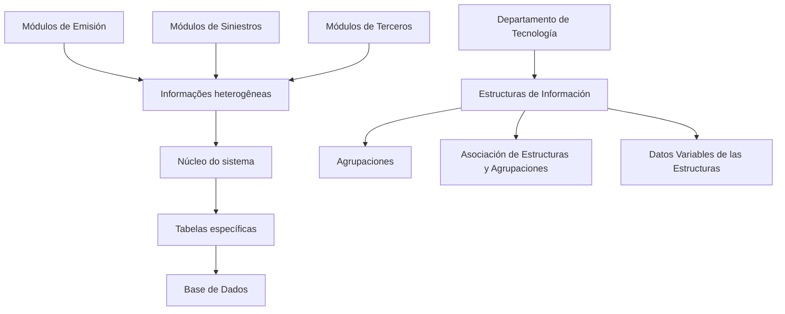

# Definición de Estructuras de Información para Módulos de Emisión, Siniestros y Terceros

## 1. Metadados do Documento
- **Arquivo de Origem:** Não identificado
- **Tipo de Documento:** Especificação Técnica
- **Domínio / Sistema:** Módulos de Emisión, Siniestros e Terceros
- **Público-Alvo:** Departamento de Tecnología
- **Data/Versão Identificada:** Não identificada

---

## 2. Resumo Executivo & Contexto de Negócio

O documento descreve o conceito de **Estructuras de Información** utilizado nos módulos de **Emisión**, **Siniestros** e **Terceros**. Esses módulos precisam tratar informações heterogêneas para suportar adequadamente suas funcionalidades.

Como mecanismo para acomodar essa heterogeneidade, o núcleo do sistema permite a criação de tabelas específicas na Base de Dados. O documento não detalha o modelo físico dessas tabelas, os campos disponíveis, relacionamentos, chaves ou regras de persistência.

O registro, a identificação e a classificação dessas informações são realizados por meio das Estructuras de Información. O documento também apresenta os conceitos de **Agrupaciones**, **associação entre estruturas e agrupamentos** e **dados variáveis das estruturas**.

A configuração correta e adequada das Estructuras de Información é responsabilidade do **Departamento de Tecnología**. Não são descritos fluxos operacionais, telas, APIs, permissões, validações ou procedimentos de alteração dessas configurações.

---

## 3. Arquitetura, Componentes & Tecnologias Envolvidas

Os componentes e conceitos explicitamente citados são:

- **Módulos de Emisión:** módulo mencionado como consumidor ou contexto das Estructuras de Información.
- **Módulos de Siniestros:** módulo mencionado como consumidor ou contexto das Estructuras de Información.
- **Módulos de Terceros:** módulo mencionado como consumidor ou contexto das Estructuras de Información.
- **Núcleo do sistema:** componente que resolve a necessidade de tratar informações heterogêneas permitindo a criação de tabelas específicas na Base de Dados.
- **Base de Dados:** repositório no qual podem ser criadas tabelas específicas.
- **Estructuras de Información:** mecanismo de registro, identificação e classificação da informação.
- **Agrupaciones:** conceito associado às Estructuras de Información.
- **Dados Variables de las Estructuras:** dados variáveis associados às estruturas.
- **Departamento de Tecnología:** área responsável pela configuração adequada e correta das Estructuras de Información.



> **Nota de Análise:** O documento apresenta uma relação conceitual entre módulos, núcleo do sistema, Base de Dados, Estructuras de Información e Agrupaciones. Não detalha interfaces técnicas, protocolos, métodos HTTP, contratos de API, modelo de dados ou mecanismos de integração.

---

## 4. Regras de Negócio, Especificações Funcionais & Processos

1. Os módulos de **Emisión**, **Siniestros** e **Terceros** devem considerar uma variedade heterogênea de informações para o tratamento adequado de suas funcionalidades.
2. O núcleo do sistema resolve a necessidade de tratamento da heterogeneidade permitindo a criação de tabelas específicas na Base de Dados.
3. O registro, a identificação e a classificação das informações são realizados no conceito denominado **Estructuras de Información**.
4. A configuração adequada e correta das Estructuras de Información é responsabilidade do **Departamento de Tecnología**.
5. O documento relaciona os seguintes elementos funcionais:
   - Agrupaciones.
   - Estructuras de Información.
   - Asociación de Estructuras y Agrupaciones.
   - Datos Variables de las Estructuras.

> **Nota de Análise:** Não há detalhamento adicional sobre critérios de criação de tabelas específicas, regras de nomenclatura, ciclo de vida de Estructuras de Información, regras de associação, valores permitidos, validações ou responsabilidades de aprovação.

---

## 5. Tabelas de Parâmetros, Ambientes e Estruturas de Dados

| Item / Parâmetro | Descrição / Função | Tipo / Valores / Formato | Ambiente / Observações |
| :--- | :--- | :--- | :--- |
| Módulos de Emisión | Módulo citado como contexto para tratamento de informações heterogêneas. | Módulo funcional | Não há ambiente identificado. |
| Módulos de Siniestros | Módulo citado como contexto para tratamento de informações heterogêneas. | Módulo funcional | Não há ambiente identificado. |
| Módulos de Terceros | Módulo citado como contexto para tratamento de informações heterogêneas. | Módulo funcional | Não há ambiente identificado. |
| Núcleo do sistema | Permite criar tabelas específicas para tratar informações heterogêneas. | Componente do sistema | Não há tecnologia, versão ou interface especificada. |
| Base de Dados | Repositório no qual o núcleo do sistema permite a criação de tabelas específicas. | Base de Dados | SGBD, esquema, tabelas e campos não identificados. |
| Estructuras de Información | Mecanismo no qual ocorre o registro, a identificação e a classificação das informações. | Estrutura conceitual / funcional | Configuração sob responsabilidade do Departamento de Tecnología. |
| Agrupaciones | Elemento relacionado às Estructuras de Información. | Agrupamento conceitual | Sem definição funcional adicional. |
| Asociación de Estructuras y Agrupaciones | Associação citada entre Estructuras de Información e Agrupaciones. | Relação conceitual | Cardinalidade e regras de associação não informadas. |
| Datos Variables de las Estructuras | Dados variáveis relacionados às estruturas. | Dados variáveis | Campos, tipos e regras não informados. |
| Departamento de Tecnología | Área responsável pela configuração adequada e correta das Estructuras de Información. | Responsável organizacional | Processo de configuração não detalhado. |
| CF | Termo exibido no conteúdo bruto. | Não identificado | O documento não define o significado de “CF”. |
| Home Solutions APIs Documentation Zeus | Texto exibido no conteúdo bruto. | Não identificado | Não há descrição da relação com as Estructuras de Información. |
| EN | Texto exibido no conteúdo bruto. | Não identificado | Possível indicador de idioma, mas não definido pelo documento. |

---

## 6. Bateria de Perguntas & Respostas para RAG (FAQ Sintético)

### P1: Qual problema as Estructuras de Información resolvem nos módulos de Emisión, Siniestros e Terceros?
**R:** As Estructuras de Información são apresentadas como o mecanismo usado para registrar, identificar e classificar informações heterogêneas necessárias ao tratamento adequado das funcionalidades dos módulos de Emisión, Siniestros e Terceros.

### P2: Como o núcleo do sistema lida com a heterogeneidade das informações?
**R:** O núcleo do sistema permite a criação de tabelas específicas na Base de Dados para acomodar a variedade de informações requerida pelos módulos de Emisión, Siniestros e Terceros.

### P3: Quem é responsável pela configuração das Estructuras de Información?
**R:** O Departamento de Tecnología é responsável pela configuração adequada e correta das Estructuras de Información.

### P4: O documento descreve quais tabelas específicas devem ser criadas na Base de Dados?
**R:** Não. O documento afirma que o núcleo do sistema permite a criação de tabelas específicas na Base de Dados, mas não informa nomes de tabelas, campos, tipos de dados, chaves, relacionamentos ou critérios de criação.

### P5: Quais elementos relacionados às Estructuras de Información são citados?
**R:** O documento cita Agrupaciones, Estructuras de Información, Asociación de Estructuras y Agrupaciones e Datos Variables de las Estructuras.

### P6: O que são Agrupaciones no contexto apresentado?
**R:** Agrupaciones são citadas como um conceito relacionado às Estructuras de Información. O documento não fornece definição operacional, estrutura de dados, regras de associação ou exemplos de agrupamentos.

### P7: Quais são as regras para associar Estructuras de Información e Agrupaciones?
**R:** O documento apenas menciona a “Asociación de Estructuras y Agrupaciones”. Não apresenta cardinalidade, critérios de associação, validações, responsáveis ou fluxo de manutenção dessa associação.

### P8: O documento especifica os campos dos Datos Variables de las Estructuras?
**R:** Não. O documento cita Datos Variables de las Estructuras, mas não detalha seus campos, tipos, formatos, obrigatoriedade, origem ou regras de validação.

### P9: Existem APIs, serviços ou métodos HTTP documentados para Estructuras de Información?
**R:** Não. Apesar de o conteúdo bruto conter a expressão “Home Solutions APIs Documentation Zeus”, o documento não descreve APIs, endpoints, métodos HTTP, contratos JSON, autenticação ou integrações relacionadas às Estructuras de Información.

### P10: Quais módulos corporativos dependem do tratamento de informações heterogêneas segundo o documento?
**R:** O documento identifica os módulos de Emisión, Siniestros e Terceros como contextos nos quais a variedade de informação deve ser considerada para o tratamento adequado das funcionalidades.

---

## 7. Glossário de Termos, Siglas & Conceitos-Chave

- **Agrupaciones:** Agrupamentos citados em associação com as Estructuras de Información; não possuem definição adicional no documento.
- **Asociación de Estructuras y Agrupaciones:** Relação mencionada entre Estructuras de Información e Agrupaciones; regras e cardinalidade não são detalhadas.
- **Base de Dados:** Repositório no qual o núcleo do sistema permite a criação de tabelas específicas.
- **CF:** Termo presente no conteúdo bruto, sem definição no documento.
- **Datos Variables de las Estructuras:** Dados variáveis associados às estruturas; sem detalhamento de campos, tipos ou regras.
- **Departamento de Tecnología:** Área responsável pela configuração adequada e correta das Estructuras de Información.
- **Emisión:** Módulo citado como contexto de uso das Estructuras de Información.
- **Estructuras de Información:** Conceito usado para registrar, identificar e classificar informações heterogêneas.
- **Siniestros:** Módulo citado como contexto de uso das Estructuras de Información.
- **Terceros:** Módulo citado como contexto de uso das Estructuras de Información.

---

## 8. Notas Críticas, Riscos & Limitações

- O documento não informa o nome do arquivo de origem, data, versão, autor ou sistema corporativo específico.
- Não há descrição do modelo físico da Base de Dados, incluindo SGBD, esquemas, tabelas, campos, índices, chaves ou relacionamentos.
- Não há procedimento para criação, alteração, remoção, aprovação ou auditoria de Estructuras de Información.
- O documento atribui a configuração ao Departamento de Tecnología, mas não define papéis, permissões, níveis de acesso ou mecanismo operacional.
- Não são informadas regras de consistência, validações, tratamento de erros, dependências externas ou impactos entre os módulos de Emisión, Siniestros e Terceros.
- O texto “Home Solutions APIs Documentation Zeus” aparece no conteúdo bruto sem contexto técnico suficiente para estabelecer uma relação confiável com o restante do documento.

---

## 9. Conteúdo Bruto Estruturado (Referência Fiel)

```text
--- [PÁGINA 1 DE 1] ---

DEFINICIÓN de ESTRUCTURAS de
INFORMACIÓN
Contexto
En los Módulos de Emisión, Siniestros o Terceros la variedad de información que se ha de considerar
para el adecuado tratamiento de sus funcionalidades es tan heterogénea que el núcleo del sistema lo
ha solventado permitiendo la creación de tablas específicas en la Base de Datos.
Su registro, identificación y clasificación se realiza en lo que denominamos 'Estructuras de
Información' siendo responsabilidad del Departamento de Tecnología de su adecuada y correcta
configuración.
Agrupaciones y Estructuras de Información
Agrupaciones
Estructuras de Información
Asociación de Estructuras y Agrupaciones
Datos Variables de las de Estructuras
 /
 CF
Home Solutions APIs Documentation Zeus
EN
```
