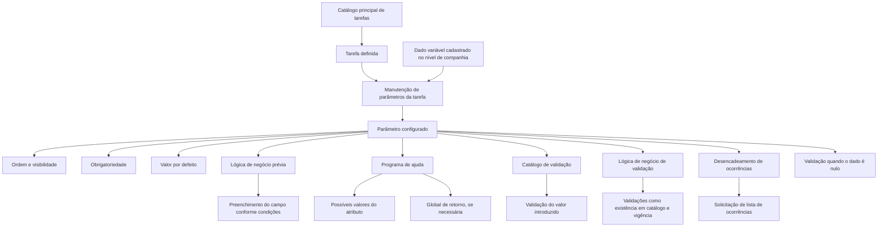

# Definição de Parâmetros de uma Tarefa

## 1. Metadados do Documento
- **Arquivo de Origem:** Não identificado no conteúdo fornecido
- **Tipo de Documento:** Manual Operacional
- **Domínio / Sistema:** Catálogo principal de tarefas; manutenção de parâmetros de tarefas
- **Público-Alvo:** Desenvolvedores, Analistas Funcionais, Operação
- **Data/Versão Identificada:** Não identificada

---

## 2. Resumo Executivo & Contexto de Negócio

O documento descreve como definir os parâmetros necessários para a execução de uma tarefa. As tarefas devem estar previamente definidas no catálogo principal de tarefas antes que os respectivos parâmetros sejam configurados.

Os parâmetros permitem que tarefas, como cartas, processos ou listados, recebam informações que não podem ser obtidas de outra forma além da entrada realizada pelo usuário. Cada parâmetro é associado a uma tarefa específica e deve estar previamente cadastrado como dado variável no nível de companhia.

A manutenção de parâmetros controla características de apresentação, obrigatoriedade, ordem, valor padrão, programas de ajuda, regras de validação e comportamentos condicionais. Também permite definir lógica de negócio antes da entrada do dado e lógica de negócio para validar o valor informado.

O documento apresenta exemplos de uso operacional: processos de fechamento necessitam da data do mês a ser fechado; cartas podem requerer informações adicionais do usuário; e listados podem exigir companhia, estrutura comercial ou ramo como parâmetros de execução.

---

## 3. Arquitetura, Componentes & Tecnologias Envolvidas

Os componentes explicitamente citados são:

- **Catálogo principal de tarefas:** repositório no qual uma tarefa precisa estar definida.
- **Tarefa:** entidade à qual são atribuídos parâmetros.
- **Manutenção de Parâmetros de uma Tarefa:** funcionalidade para definir e configurar os parâmetros da tarefa.
- **Dado variável:** pré-requisito para um parâmetro; deve estar cadastrado no nível de companhia.
- **Lógica de negócio prévia ao campo:** lógica que pode preencher um campo conforme condições.
- **Programa de ajuda:** programa utilizado para auxiliar na seleção de possíveis valores do atributo.
- **Catálogo de validação:** catálogo contra o qual é validado o valor introduzido para o dado variável.
- **Versão:** versão das condições usadas para extrair a validação do atributo.
- **Global de retorno:** global na qual é devolvido o valor do programa de ajuda, quando necessário.
- **Lista de ocorrências:** lista disparada por um dado variável quando configurado para desencadear ocorrências.



> **Nota de Análise:** O conteúdo não detalha tecnologias, protocolos, métodos HTTP, banco de dados, contratos de integração, URLs ou ambientes técnicos.

---

## 4. Regras de Negócio, Especificações Funcionais & Processos

### Pré-requisito para definição de parâmetros

1. A tarefa deve estar definida no catálogo principal de tarefas.
2. O parâmetro da tarefa deve estar cadastrado como dado variável no nível de companhia.
3. A manutenção de parâmetros associa os dados variáveis à tarefa que será executada.

### Propriedades da manutenção de parâmetros

1. **Tarefa**
   - Contém a chave da tarefa para a qual serão definidos parâmetros.

2. **Nome do parâmetro**
   - Contém o parâmetro da tarefa.
   - O parâmetro deve estar cadastrado como dado variável no nível de companhia.

3. **Ordem do parâmetro**
   - Define a ordem em que o parâmetro será apresentado.
   - A ordem é relevante quando existirem vários parâmetros para a mesma tarefa.

4. **Visibilidade**
   - Define se o parâmetro será visível ao usuário.
   - Um dado variável pode não ser visível caso seja preenchido apenas ao atribuir valor a outros dados variáveis.

5. **Obrigatoriedade**
   - Define se o usuário deve obrigatoriamente informar valor para o dado variável.

6. **Lógica de negócio antes de ir ao dado variável**
   - Contém lógica de negócio anterior ao campo.
   - A lógica pode preencher o campo conforme determinadas condições.

7. **Valor por defeito**
   - Define o valor assumido pelo atributo por padrão.

8. **Programa de ajuda**
   - Define o programa que auxiliará na escolha dos possíveis valores do atributo.

9. **Catálogo de validação**
   - Contém o nome do catálogo utilizado para validar o valor introduzido para o dado variável.

10. **Versão**
    - Define a versão das condições para as quais será extraída a validação do atributo.

11. **Nome da global que devolve o programa de ajuda**
    - Contém o nome da global na qual o valor do programa de ajuda é devolvido, caso seja necessário.

12. **Lógica de negócio de validação**
    - Define lógica de negócio para validar o valor do atributo.
    - Os exemplos apresentados incluem:
      - Verificar se o valor existe em um catálogo.
      - Verificar se o dado está vigente.

13. **Desencadeamento de ocorrências**
    - Define se o dado variável dispara uma lista de ocorrências.
    - Exemplo: um dado variável que pergunta se existem joias pode desencadear uma solicitação de ocorrências se a resposta for afirmativa.

14. **Validação de dado variável nulo**
    - Define se a validação do campo deve ser executada mesmo quando o campo não possui valor ou está nulo.

### Casos de uso apresentados

- **Processos de fechamento:** requerem a data do mês que será fechado.
- **Cartas:** podem obter informações da base de dados ou demandar informações adicionais inseridas pelo usuário.
- **Listados:** podem requerer companhia, estrutura comercial e ramo para a geração do resultado.

---

## 5. Tabelas de Parâmetros, Ambientes e Estruturas de Dados

| Item / Parâmetro | Descrição / Função | Tipo / Valores / Formato | Ambiente / Observações |
| :--- | :--- | :--- | :--- |
| Tarefa | Contém a chave da tarefa à qual serão definidos parâmetros. | Chave da tarefa | A tarefa deve existir no catálogo principal de tarefas. |
| Nome do parâmetro | Contém o parâmetro da tarefa. | Dado variável | O dado variável deve estar cadastrado no nível de companhia. |
| Ordem do parâmetro | Define a ordem de apresentação do parâmetro. | Ordem de exibição | Aplicável quando existirem vários parâmetros. |
| É visível? | Indica se o parâmetro é visível para o usuário. | Indicador de visibilidade | Dados variáveis podem ser preenchidos somente ao atribuir valor a outros dados variáveis. |
| É obrigatório? | Indica se o dado variável deve receber valor obrigatoriamente. | Indicador de obrigatoriedade | Não há valores específicos detalhados no documento. |
| Lógica de negócio antes de ir ao dado variável | Define lógica de negócio anterior ao campo. | Lógica de negócio | Pode preencher o campo conforme condições. |
| Valor por defeito | Define o valor padrão do atributo. | Valor padrão | Não há formato detalhado no documento. |
| Programa de ajuda | Define o programa de apoio aos possíveis valores do atributo. | Programa de ajuda | Pode devolver valor em uma global, se necessário. |
| Catálogo de validação | Define o catálogo contra o qual o valor introduzido será validado. | Nome do catálogo | Aplicado à validação do dado variável. |
| Versão | Define a versão das condições usadas para extrair a validação. | Versão | Relacionada ao catálogo de validação. |
| Nome da global que devolve o programa de ajuda | Define a global em que é devolvido o valor do programa de ajuda. | Nome da global | Utilizado quando necessário. |
| Lógica de negócio de validação | Define as regras de validação do valor do atributo. | Lógica de negócio | Exemplos: existência em catálogo e vigência do dado. |
| Desencadeia ocorrências? | Indica se o dado variável dispara uma lista de ocorrências. | Indicador | Exemplo relacionado à pergunta sobre joias. |
| Valida o dado variável se é nulo? | Define se a validação deve ser executada quando o campo estiver sem valor ou nulo. | Indicador | O documento não especifica o comportamento padrão. |
| Data do mês a fechar | Informação necessária para executar processos de fechamento. | Data | Exemplo de parâmetro de tarefa. |
| Informação adicional para cartas | Informação que pode ser fornecida pelo usuário caso não esteja disponível na base de dados. | Informação adicional | Exemplo de parâmetro de tarefa. |
| Companhia | Informação que pode ser exigida para a emissão de listados. | Companhia | Exemplo de parâmetro de tarefa. |
| Estrutura comercial | Informação que pode ser exigida para a emissão de listados. | Estrutura comercial | Exemplo de parâmetro de tarefa. |
| Ramo | Informação que pode ser exigida para a emissão de listados. | Ramo | Exemplo de parâmetro de tarefa. |

> **Nota de Análise:** O documento não informa servidores, URLs, caminhos de logs, portas, ambientes de implantação ou tipos técnicos dos campos.

---

## 6. Bateria de Perguntas & Respostas para RAG (FAQ Sintético)

### P1: Qual é o pré-requisito para definir parâmetros de uma tarefa?
**R:** A tarefa precisa estar definida no catálogo principal de tarefas. Além disso, o parâmetro deve estar previamente cadastrado como dado variável no nível de companhia.

### P2: Para que servem os parâmetros de tarefas?
**R:** Os parâmetros permitem fornecer informações necessárias para executar tarefas, como cartas, processos e listados, quando essas informações não podem ser obtidas de outra forma além da entrada realizada pelo usuário.

### P3: O que representa o atributo “Tarefa” na manutenção de parâmetros?
**R:** O atributo “Tarefa” contém a chave da tarefa à qual serão definidos os parâmetros.

### P4: Como o nome do parâmetro deve ser configurado?
**R:** O nome do parâmetro contém o parâmetro da tarefa e esse parâmetro deve estar cadastrado como dado variável no nível de companhia.

### P5: Como funciona a ordem do parâmetro?
**R:** A ordem do parâmetro define a sequência em que o parâmetro será mostrado ao usuário quando houver vários parâmetros associados à mesma tarefa.

### P6: Um parâmetro pode não ser visível ao usuário?
**R:** Sim. O atributo de visibilidade indica se o parâmetro será apresentado ao usuário. Existem dados variáveis que podem ser preenchidos apenas ao atribuir valor a outros dados variáveis e, por isso, não precisam ser visíveis.

### P7: Qual é a finalidade da lógica de negócio antes de ir ao dado variável?
**R:** A lógica de negócio prévia ao campo pode preencher o campo dependendo de determinadas condições, antes que o dado variável seja tratado como campo de entrada.

### P8: Como o valor de um dado variável pode ser validado?
**R:** O valor pode ser validado por meio de um catálogo de validação e de uma lógica de negócio de validação. Os exemplos fornecidos são verificar se o valor existe em um catálogo e verificar se o dado está vigente.

### P9: O que é a versão associada à validação do atributo?
**R:** A versão corresponde à versão das condições a partir das quais será extraída a validação do atributo.

### P10: Para que serve o programa de ajuda?
**R:** O programa de ajuda auxilia na disponibilização dos possíveis valores do atributo. Quando necessário, o valor devolvido pelo programa de ajuda pode ser retornado em uma global cujo nome é configurado no parâmetro correspondente.

### P11: O que significa desencadear ocorrências?
**R:** Significa que um dado variável pode disparar uma lista de ocorrências. O exemplo apresentado é uma pergunta sobre a existência de joias: se a resposta for afirmativa, a solicitação de ocorrências é desencadeada.

### P12: É possível validar um dado variável nulo?
**R:** Sim. Existe um atributo específico que determina se a validação do campo deve ser lançada mesmo quando o campo não possui valor ou está nulo.

### P13: Quais informações podem ser necessárias para executar um processo de fechamento?
**R:** Um processo de fechamento pode requerer a data do mês que se deseja fechar.

### P14: Quais parâmetros podem ser necessários para gerar listados?
**R:** Um listado pode requerer a companhia, a estrutura comercial e o ramo para o qual o listado deve ser gerado.

---

## 7. Glossário de Termos, Siglas & Conceitos-Chave

- **Catálogo principal de tarefas:** Catálogo no qual as tarefas devem estar definidas antes da configuração de parâmetros.
- **Tarefa:** Elemento executável, como uma carta, processo ou listado, ao qual podem ser associados parâmetros.
- **Dado variável:** Dado utilizado como parâmetro de uma tarefa e que deve estar cadastrado no nível de companhia.
- **Global:** Estrutura identificada por nome usada para devolver o valor do programa de ajuda quando necessário.
- **Programa de ajuda:** Programa que auxilia na obtenção dos possíveis valores de um atributo.
- **Catálogo de validação:** Catálogo utilizado para validar o valor introduzido para um dado variável.
- **Lógica de negócio:** Lógica aplicada antes do preenchimento do campo ou durante a validação do valor do atributo.
- **Ocorrências:** Lista que pode ser disparada por um dado variável conforme sua configuração.
- **Valor por defeito:** Valor padrão atribuído a um atributo.
- **Vigência:** Condição usada como exemplo de validação para determinar se um dado permanece válido.

---

## 8. Notas Críticas, Riscos & Limitações

- O documento não identifica o nome do arquivo, autor, data, versão ou sistema corporativo específico.
- Não há detalhamento sobre tecnologias de implementação, banco de dados, APIs, integrações, autenticação, ambientes, servidores ou mecanismos de auditoria.
- Não são especificados os formatos técnicos dos parâmetros, como tipos de dados, tamanhos, obrigatoriedade padrão ou valores permitidos.
- O documento menciona a existência de lógica de negócio prévia e lógica de validação, mas não apresenta sintaxe, motor de regras, condições concretas ou exemplos completos de implementação.
- O comportamento detalhado para campos nulos não é definido; somente é informada a existência de uma configuração para decidir se a validação será executada.
- O documento lista o uso de uma global para retorno do programa de ajuda, mas não detalha a estrutura, ciclo de vida ou mecanismo técnico dessa global.

---

## 9. Conteúdo Bruto Estruturado (Referência Fiel)

```text
--- [PÁGINA 1 DE 4] ---

DEFINICIÓN de Parámetros de una Tarea
Objetivo
La finalidad de este documento es explicar, cómo definir los parámetros que necesitar una tarea para
ser ejecutada. Las tareas tienen que estar definidas en el catálogo principal de tareas
Imagen del Mantenimiento Parámetros de una Tarea:
En esta imagen podemos ver la definición para los parámetros de una tarea.
 / 
 CF
Home Solutions APIs Documentation Zeus
EN


--- [PÁGINA 2 DE 4] ---

Propiedades
Tarea
Este atributo contiene la clave de la tarea a la que se le va a definir parámetros. Esta tarea
Nombre del parámetro
Este atributo contendrá el parámetro de la tarea. Este parámetro tiene que estar dado de alta como
dato variable a nivel de compañía.
Orden del parámetro
Este atributo contendrá el orden en el que se va a mostrar el parámetro, en el caso de ser varios.
¿Es visible?
Este atributo indica si el parámetro es visible para el usuario, pueden ser datos variables que se
rellenen solo al dar valor a otros datos variables
¿Es obligatorio
Este atributo indica si hay que dar valor al dato variable obligatoriamente o no.


--- [PÁGINA 3 DE 4] ---

Lógica de negocio ante de ir al dato variable
Este atributo contendrá una lógica de negocio previa al campo. Es decir esta lógica podrá rellenar el
campo dependiendo de algunas condiciones
Valor por defecto
Este atributo contendrá el valor que adquiere el atributo por defecto.
Programa de ayuda
Aquí se tendrá el programa que servirá de ayuda para los posibles valores del atributo.
Catálogo de Validación
Este atributo contendrá el nombre del catálogo contra la que se va a validar el valor del dato variable
introducido
Versión
La versión de las condiciones para las que se va a extraer la validación del atributo.
Nombre de la global que devuelve el programa de ayuda
Este campo tiene el nombre de la global donde se devuelve el valor, si se necesita.
Lógica de Negocio de validación
Lógica de negocio de validación del valor del atributo.
Ejemplos:
Que exista el valor en un catálogo
Que el dato esté vigente
Etc
¿Desencadena Ocurrencias?
Este atributo indica si este dato variable dispara una lista de ocurrencias.
Ejemplo:
Datos variable que pregunta si hay joyas, si contesta que sí desencadenará la petición de
ocurrencias.
¿Valida el dato variable si es nulo?
¿Se lanza la validación del campo aunque este no tenga valor, sea nulo?


--- [PÁGINA 4 DE 4] ---

Preguntas frecuentes
¿ Para qué se necesitan los parámetros de las tareas?
Porque a veces la tarea (carta, proceso, etc) necesitan información que no puede obtenerse de
otra manera sino es introducida por el usuario.
Ejemplos:
- Si se lanzan procesos de cierre, se necesita la fecha del mes que se quiere cerrar.
- Si lanzan cartas, se puede tener toda la información en la base de datos y obtenerla o se
puede necesitar de información adicional que tenga que ser introducida por el usuario.
- Si se lanzan Listados se puede necesitar para que compañía, para que estructura comercial,
para que ramo se necesita el listado.
```
