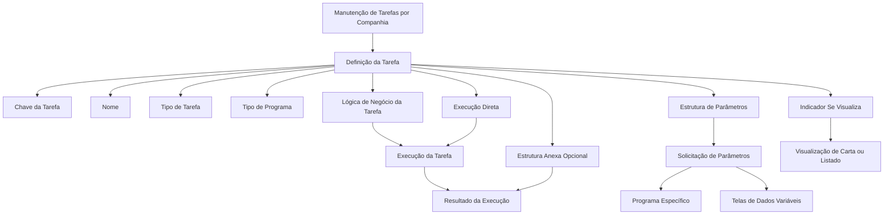

# Definição e Configuração de Tarefas no REEF Core

## 1. Metadados do Documento
- **Arquivo de Origem:** Não identificado
- **Tipo de Documento:** Manual Operacional
- **Domínio / Sistema:** REEF Core / TRON
- **Público-Alvo:** Desenvolvedores, Arquitetos, Operação e Negócio
- **Data/Versão Identificada:** Não identificada

---

## 2. Resumo Executivo & Contexto de Negócio

O documento explica como definir uma tarefa no contexto do REEF Core. Uma tarefa é um mecanismo configurável que pode representar um processo completo, parte de um processo, uma carta ou um listado operacional. Exemplos citados incluem o processo de fechamento contábil, cálculo de reservas, solicitação de documentos ao segurado e listagem de carteira de apólices.

As tarefas permitem executar programas sem a necessidade de criar telas específicas. A execução pode exigir parâmetros ou não; quando parâmetros são necessários, a tarefa pode possuir uma tela específica para solicitá-los ou utilizar telas de dados variáveis.

O modelo de tarefa contempla execução direta ou em diferido. Também contempla a apresentação de resultados por meio de uma estrutura anexa opcional e o controle sobre a visualização de cartas ou listados pelo executor de tarefas.

O documento apresenta tarefas de núcleo identificadas pelo prefixo `TRN`. Essas tarefas são classificadas como tarefas do REEF Core e abrangem processos de fechamento contábil, listados operacionais e de gestão de sinistros, listados de caixa e listados de ordens de pagamento.

---

## 3. Arquitetura, Componentes & Tecnologias Envolvidas

Os elementos funcionais identificados são:

- **REEF Core:** sistema ao qual pertencem as tarefas cujo identificador começa por `TRN`.
- **TRON:** prefixo utilizado nos exemplos de chaves de tarefas, como `TRN00001`.
- **Mantenimiento Tareas a nivel de Compañía:** manutenção de tarefas no nível de companhia.
- **Executor de tarefas:** componente ou papel que utiliza o atributo **Se visualiza** para determinar se uma carta ou listado deve ser exibido.
- **Programa PL/SQL:** tipo de programa citado para uma tarefa de carta.
- **Estrutura de parâmetros:** programa ou mecanismo utilizado para solicitar parâmetros de execução.
- **Estrutura anexa:** estrutura opcional destinada à apresentação de resultados.



**Nota de Análise:** o documento cita o tipo de programa PL/SQL em um exemplo de tarefa do tipo carta, mas não detalha contratos, procedimentos, métodos de invocação ou estruturas técnicas do programa.

---

## 4. Regras de Negócio, Especificações Funcionais & Processos

### Conceito de tarefa

Uma tarefa pode representar:

1. Um processo completo, como o processo de fechamento contábil.
2. Uma parte de um processo, como:
   - cálculo de IBNR;
   - cálculo mensal de reservas de sinistros;
   - geração de informação para listados dentro do processo de fechamento contábil.
3. Uma carta, como:
   - solicitação ao segurado para entrega de informação adicional;
   - comunicação ao segurado sobre o cancelamento da apólice por falta de pagamento.
4. Um listado, como:
   - listado da carteira de apólices;
   - listado de sinistros pendentes.

### Regras de parametrização e execução

- Uma tarefa pode necessitar de parâmetros para execução ou não necessitar de parâmetros.
- Quando uma tarefa necessita de parâmetros, a tarefa pode ter uma tela específica para solicitar os parâmetros ou não ter uma tela específica.
- Quando não existe programa específico para solicitação de parâmetros, os parâmetros são solicitados como nas telas de dados variáveis.
- Uma tarefa pode ser executada diretamente no momento da execução.
- Uma tarefa pode ser executada em diferido.
- Uma tarefa pode possuir uma tela ou estrutura para visualização de resultados após a execução.
- A estrutura anexa, destinada a mostrar resultados, é opcional.
- O parâmetro **Se visualiza** informa ao executor de tarefas se uma carta ou listado deve ser visualizado.

### Atributos de definição da tarefa

- **Tarefa:** contém a chave de identificação de um processo, parte de processo, listado, carta ou outro tipo de tarefa.
- **Nome:** contém o nome atribuído à tarefa.
- **Tipo de Tarefa:** informa o tipo da tarefa registrada.
- **Tipo de Programa:** informa o tipo de programa associado à tarefa registrada.
- **Lógica de Negócio da Tarefa:** contém a lógica de negócio que deve ser lançada para executar a tarefa.
- **Se lanza directamente:** indica se a tarefa será executada diretamente no momento da execução.
- **Estructura de parámetros:** contém o programa que solicitará os parâmetros.
- **Estructura anexa:** contém a estrutura que apresentará os resultados, quando aplicável.
- **Se visualiza:** indica se o executor de tarefas deve visualizar a carta ou o listado.

### Tarefas de núcleo

As tarefas cuja chave começa por `TRN` são tarefas de REEF Core. O documento cita como exemplos tarefas relacionadas a:

- processo de fechamento contábil;
- listados operacionais de sinistros;
- listados de gestão de sinistros;
- listados de caixa;
- listados de ordens de pagamento.

---

## 5. Tabelas de Parâmetros, Ambientes e Estruturas de Dados

| Item / Parâmetro | Descrição / Função | Tipo / Valores / Formato | Ambiente / Observações |
| :--- | :--- | :--- | :--- |
| Tarefa | Chave de um processo, parte de processo, listado, carta ou outro elemento executável. | Identificador, como `TRN00001`. | Manutenção de tarefas por companhia. |
| Nome | Nome atribuído à tarefa. | Texto. | Não são definidos limites ou formato adicional. |
| Tipo de Tarefa | Identifica o tipo da tarefa que está sendo registrada. | Tipo não detalhado. | Não são listados valores possíveis. |
| Tipo de Programa | Identifica o tipo de programa da tarefa registrada. | Tipo não detalhado; o documento cita PL/SQL como exemplo. | Não são detalhados outros tipos de programa. |
| Lógica de Negócio da Tarefa | Lógica de negócio lançada para executar a tarefa. | Lógica ou programa não detalhado. | Não são especificadas interfaces técnicas. |
| Se lanza directamente | Define se a execução ocorrerá diretamente no momento da solicitação. | Indicador booleano implícito. | A execução em diferido também é mencionada. |
| Estructura de parámetros | Programa responsável por solicitar parâmetros de execução. | Programa específico ou telas de dados variáveis. | Aplicável quando a tarefa requer parâmetros. |
| Estructura anexa | Estrutura usada para mostrar os resultados da execução. | Opcional. | Não são detalhados formato ou campos. |
| Se visualiza | Informa se carta ou listado deve ser visualizado pelo executor de tarefas. | Indicador booleano implícito. | Específico para visualização de carta ou listado. |
| `TRN00001` | Processo de fechamento contábil. | Chave de tarefa. | Exemplo de tarefa de REEF Core. |
| `TRN00002` | Cálculo de reservas de fim de mês. | Chave de tarefa. | Exemplo de tarefa de REEF Core. |
| `TRN00003` | Carta de solicitação de documentos. | Chave de tarefa. | Exemplo de tarefa de REEF Core. |
| `TRN00004` | Listado da carteira. | Chave de tarefa. | Exemplo de tarefa de REEF Core. |

---

## 6. Bateria de Perguntas & Respostas para RAG (FAQ Sintético)

### P1: O que uma tarefa pode representar no REEF Core?
**R:** Uma tarefa pode representar um processo completo, uma parte de processo, uma carta ou um listado. O documento cita como exemplos o fechamento contábil, cálculo de IBNR, cálculo mensal de reservas de sinistros, solicitação de documentos ao segurado, comunicação de cancelamento de apólice e listados de carteira ou sinistros pendentes.

### P2: Uma tarefa sempre exige parâmetros para ser executada?
**R:** Não. Uma tarefa pode necessitar de parâmetros ou pode ser executada sem parâmetros. Quando há parâmetros, a tarefa pode ter um programa ou tela específica para solicitá-los; caso não exista programa específico, a solicitação ocorre como nas telas de dados variáveis.

### P3: Uma tarefa pode ser programada para execução posterior?
**R:** Sim. O documento estabelece que as tarefas podem ser executadas diretamente ou em diferido. O atributo **Se lanza directamente** indica se a tarefa será lançada diretamente no momento da execução.

### P4: Qual atributo contém a lógica executada por uma tarefa?
**R:** O atributo **Lógica de Negócio da Tarefa** contém a lógica de negócio que deve ser lançada para que a tarefa seja executada. O documento não detalha o formato técnico dessa lógica, nem contratos ou interfaces de invocação.

### P5: Para que serve a estrutura de parâmetros?
**R:** A **Estructura de parámetros** contém o programa que solicita os parâmetros de execução da tarefa. Se a tarefa não possuir programa específico para solicitação de parâmetros, os parâmetros devem ser solicitados como nas telas de dados variáveis.

### P6: A estrutura anexa é obrigatória na configuração de uma tarefa?
**R:** Não. A **Estructura anexa** é opcional e contém uma estrutura destinada a mostrar os resultados da execução da tarefa.

### P7: Como o sistema determina se uma carta ou listado deve ser mostrado?
**R:** O parâmetro **Se visualiza** informa ao executor de tarefas se uma carta ou listado deve ser visualizado.

### P8: O que identifica uma tarefa de núcleo do REEF Core?
**R:** Segundo o documento, todas as tarefas que começam por `TRN` são tarefas de REEF Core. Entre os exemplos estão tarefas do processo de fechamento contábil, listados operacionais e de gestão de sinistros, listados de caixa e listados de ordens de pagamento.

### P9: O que representa a tarefa `TRN00002`?
**R:** A tarefa `TRN00002` representa o cálculo de reservas de fim de mês.

### P10: Qual é o propósito de definir tarefas sem criar telas específicas?
**R:** As tarefas são úteis para criar programas simples sem a necessidade de criar telas. Quando há necessidade de parâmetros, a configuração pode utilizar uma tela ou programa específico, ou o mecanismo de telas de dados variáveis.

---

## 7. Glossário de Termos, Siglas & Conceitos-Chave

- **IBNR:** termo citado como um cálculo que pode compor parte de um processo; o documento não apresenta a expansão da sigla.
- **PL/SQL:** tipo de programa citado para uma tarefa do tipo carta.
- **REEF Core:** sistema ao qual pertencem as tarefas iniciadas por `TRN`.
- **TRN:** prefixo que identifica tarefas de REEF Core no documento.
- **Tarefa:** elemento configurável que pode executar processo, parte de processo, carta ou listado.
- **Carta:** tipo de tarefa usado para comunicações ao segurado, como solicitação de documentos ou aviso de cancelamento de apólice.
- **Listado:** tipo de tarefa usado para geração de listas operacionais, como carteira de apólices ou sinistros pendentes.
- **Execução em diferido:** execução não realizada diretamente no momento da solicitação; o documento não detalha mecanismo de agendamento.
- **Telas de dados variáveis:** mecanismo utilizado para solicitar parâmetros quando não existe programa específico associado à estrutura de parâmetros.

---

## 8. Notas Críticas, Riscos & Limitações

- O documento não identifica arquivo de origem, autor, data, versão ou responsável pela manutenção.
- O documento não detalha os valores permitidos para **Tipo de Tarefa** e **Tipo de Programa**.
- Embora cite um programa PL/SQL como exemplo, o documento não define procedimentos, pacotes, interfaces, entradas, saídas ou tratamento de erros.
- Não há detalhamento técnico sobre como ocorre a execução em diferido, incluindo agendamento, filas, monitoramento ou reprocessamento.
- Não são fornecidos contratos de dados, modelos de estrutura de parâmetros ou modelos de estrutura anexa.
- O significado expandido de **IBNR** não é informado no conteúdo original.
- Não são descritas permissões, matrizes de acesso, ambientes, URLs, rotas de log ou mecanismos de auditoria.

---

## 9. Conteúdo Bruto Estruturado (Referência Fiel)

```text
--- [PÁGINA 1 DE 3] ---

DEFINICIÓN de una Tarea
Objetivo
La finalidad de este documento es explicar, cómo definir una tarea.
Una tarea puede ser:
Un proceso, como por ejemplo el proceso de cierre contable.
Una parte de un proceso, como por ejemplo el cálculo del IBNR, el cálculo de las Reservas de
siniestros mensual o la generación de información para listados dentro del proceso de cierre
contable.
Una carta, como por ejemplo realizar una Solicitud al asegurado para la entrega de información
adicional, Informar al Asegurado de la Cancelación de su póliza por falta de pago, ...
Un listado, como por ejemplo la obtención de un Listado de la Cartera de Pólizas, Listado de
siniestros pendientes, ...
Las tareas:
Pueden o no necesitar parámetros para poder ejecutarse (en cuyo caso pueden contar a su vez
o no con una pantalla específica que los solicite)
Pueden ejecutarse directamente o en diferido.
Pueden tener o no pantallas para visualizar resultados tras su ejecución.
Imagen del Mantenimiento Tareas a nivel de Compañía:
 / 
 RS
Inicio Soluciones APIs Documentación Zeus
ES


--- [PÁGINA 2 DE 3] ---

En esta imagen podemos ver la definición de un tipo de tarea, carta, tipo de programa PLSQL, sin
una pantalla específica para pedir parámetros y sin una pantalla específica para mostrar el resultado
Propiedades
Tarea
Este atributo contendrá la clave de un proceso, parte de un proceso, un listado, una carta, etc.
Ejemplos:
TRN00001 Proceso de Cierre Contable.
TRN00002 Cálculo de Reservas Fin de Mes.
TRN00003 Carta de Solicitud de documentos.
TRN00004 Listado de la Cartera.
Nombre
Este atributo contendrá el nombre que se le va a dar a la tarea.
Tipo de Tarea


--- [PÁGINA 3 DE 3] ---

Este atributo contendrá de qué Tipo es la tarea que se está registrando.
Tipo de Programa
Este atributo contendrá el Tipo de Programa que es la tarea que se está registrando.
Lógica de Negocio de la Tarea
Este atributo contendrá la lógica de Negocio que hay que lanzar para que se ejecute la tarea.
Se lanza directamente
Este atributo indicará si la tarea se va a lanzar directamente en el momento de la ejecución.
Estructura de parámetros
Este parámetro tendrá el programa que pedirá los parámetros, si no tiene un programa específico se
pedirá como las pantallas de datos variables.
Estructura anexa
Este atributo contendrá una estructura donde mostrar los resultados. Es opcional.
Se visualiza
Este parámetro le indica al ejecutor de tareas si se visualiza la carta, o el listado.
Preguntas frecuentes
1 ¿ Para qué son útiles las tareas?
Para crear programas sencillos, sin necesidad de crear pantallas.
2 ¿Hay tareas de Núcleo?
Sí, todas las tareas que empiezan por TRN son Tareas de Reef.core como por ejemplo: Tareas para
el proceso de Cierre Contable, Listados Operativos de Siniestros, Listados de Gestión de Siniestros,
Listados de Cajero o de órdenes de pago, ... etcétera.
```
