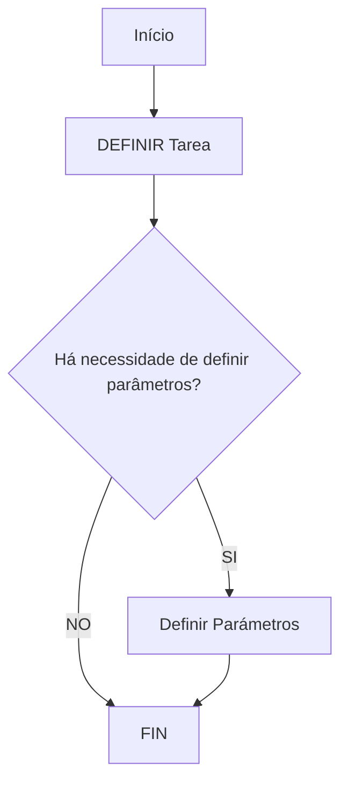

# Definição de Tarefas e Parâmetros de Tarefa

## 1. Metadados do Documento
- **Arquivo de Origem:** `Não identificado`
- **Tipo de Documento:** `Procedimento`
- **Domínio / Sistema:** `Definición de Tareas / Home Solutions APIs Documentation Zeus`
- **Público-Alvo:** `Não identificado`
- **Data/Versão Identificada:** `Não identificada`

---

## 2. Resumo Executivo & Contexto de Negócio

O documento descreve, de forma resumida, o processo de **definição de uma Tarefa** e dos respetivos parâmetros. O conceito central apresentado é que uma Tarefa é definida juntamente com seus parâmetros, quando houver necessidade de defini-los.

O fluxo inicia pela etapa **DEFINIR Tarea**. Em seguida, existe uma decisão: verificar se é necessário definir parâmetros para a Tarefa. Caso seja necessário, o processo segue para a atividade **Definir Parámetros**; caso contrário, o processo é encerrado.

O conteúdo apresenta duas referências de procedimento: **1. DEFINIR Tarea** e **1. DEFINIR Parámetros Tarea**. Não há detalhamento sobre campos, regras de validação, responsáveis, sistemas envolvidos, contratos de API, métodos HTTP ou critérios para decidir quando parâmetros devem ser definidos.

A expressão **Home Solutions APIs Documentation Zeus** aparece no conteúdo bruto, mas o documento não explica sua relação operacional ou arquitetural com o processo de definição de Tarefas.

---

## 3. Arquitetura, Componentes & Tecnologias Envolvidas

O documento não apresenta uma arquitetura de software detalhada, integrações, módulos técnicos, tecnologias, ambientes ou contratos de interface.

Os elementos explicitamente citados são:

- **Tarea:** entidade que deve ser definida.
- **Parámetros Tarea:** parâmetros associados à Tarefa, definidos somente quando necessário.
- **Home Solutions APIs Documentation Zeus:** expressão presente no rodapé/conteúdo extraído, sem explicação adicional.
- **CF:** sigla ou marcador presente no conteúdo, sem definição.



**Nota de Análise:** O documento não detalha a implementação técnica da definição de Tarefas, os componentes responsáveis pelo fluxo, nem a persistência ou consumo dos parâmetros definidos.

---

## 4. Regras de Negócio, Especificações Funcionais & Processos

### Processo de definição de uma Tarefa

1. Iniciar a definição de uma **Tarea**.
2. Avaliar se a Tarefa exige definição de parâmetros.
3. Se a resposta for **SI**, executar a atividade **Definir Parámetros**.
4. Se a resposta for **NO**, finalizar o processo.
5. Após a definição dos parâmetros, finalizar o processo.

### Regras explicitamente identificadas

- A definição de uma Tarefa é descrita como a definição de uma **Tarea e seus parâmetros**.
- A definição de parâmetros é condicional.
- A condição apresentada no fluxo é: **“¿Hay que Definir Parámetros?”**
- A resposta **SI** direciona para **Definir Parámetros**.
- A resposta **NO** direciona para **FIN**.

### Referências de atividades

- **1. DEFINIR Tarea**
- **1. DEFINIR Parámetros Tarea**

**Nota de Análise:** O documento não informa quais parâmetros podem ser definidos, seus tipos, valores permitidos, obrigatoriedade, origem dos dados, critérios de aprovação ou regras de validação.

---

## 5. Tabelas de Parâmetros, Ambientes e Estruturas de Dados

| Item / Parâmetro | Descrição / Função | Tipo / Valores / Formato | Ambiente / Observações |
| :--- | :--- | :--- | :--- |
| Tarea | Entidade que deve ser definida no processo. | Não especificado. | Referida na atividade `DEFINIR Tarea`. |
| Parámetros Tarea | Parâmetros associados à Tarefa. | Não especificado. | Devem ser definidos apenas se a decisão do fluxo for `SI`. |
| Decisão de parâmetros | Verificação sobre a necessidade de definir parâmetros para a Tarefa. | Valores apresentados: `SI` ou `NO`. | `SI` segue para definição de parâmetros; `NO` encerra o processo. |
| DEFINIR Tarea | Atividade inicial de definição da Tarefa. | Processo / atividade. | Identificada como referência `1. DEFINIR Tarea`. |
| DEFINIR Parámetros Tarea | Referência para a definição dos parâmetros da Tarefa. | Processo / atividade. | O documento também apresenta `1. DEFINIR Parámetros Tarea`. |
| CF | Sigla ou marcador presente no texto. | Não especificado. | Sem definição no documento. |
| Home Solutions APIs Documentation Zeus | Texto presente no conteúdo extraído. | Não especificado. | Não há relação funcional ou técnica explicitada. |

---

## 6. Bateria de Perguntas & Respostas para RAG (FAQ Sintético)

### P1: Em que consiste a definição de uma Tarefa?
**R:** A definição de uma Tarefa consiste na definição de uma **Tarea** e de seus parâmetros, conforme apresentado no documento.

### P2: Qual é a primeira atividade do processo descrito?
**R:** A primeira atividade é **DEFINIR Tarea**.

### P3: O que acontece após definir uma Tarefa?
**R:** Após definir a Tarefa, o processo avalia a pergunta **“¿Hay que Definir Parámetros?”**, isto é, se há necessidade de definir parâmetros para a Tarefa.

### P4: O que acontece quando a resposta à necessidade de parâmetros é “SI”?
**R:** Quando a resposta é **SI**, o fluxo segue para a atividade **Definir Parámetros**.

### P5: O que acontece quando a resposta à necessidade de parâmetros é “NO”?
**R:** Quando a resposta é **NO**, o processo segue diretamente para **FIN**.

### P6: A definição de parâmetros é obrigatória para todas as Tarefas?
**R:** Não. O documento representa a definição de parâmetros como uma etapa condicional, executada somente quando a decisão sobre a necessidade de parâmetros for **SI**.

### P7: Quais parâmetros de Tarefa são previstos pelo documento?
**R:** O documento menciona **Parámetros Tarea**, mas não especifica nomes de parâmetros, tipos de dados, valores permitidos ou regras de preenchimento.

### P8: O documento informa como uma Tarefa é implementada em APIs ou sistemas?
**R:** Não. Embora o texto contenha a expressão **Home Solutions APIs Documentation Zeus**, não há detalhamento sobre APIs, endpoints, métodos HTTP, contratos JSON ou integrações.

### P9: O que significa a sigla “CF” no processo de definição de Tarefas?
**R:** O documento contém a sigla **CF**, mas não fornece significado, contexto ou definição para ela.

### P10: Quais são as referências de procedimento citadas no documento?
**R:** As referências apresentadas são **1. DEFINIR Tarea** e **1. DEFINIR Parámetros Tarea**.

---

## 7. Glossário de Termos, Siglas & Conceitos-Chave

- **Tarea:** Tarefa que deve ser definida no processo descrito.
- **Parámetros Tarea:** Parâmetros associados a uma Tarefa.
- **SI:** Resposta positiva à pergunta sobre a necessidade de definir parâmetros.
- **NO:** Resposta negativa à pergunta sobre a necessidade de definir parâmetros.
- **FIN:** Encerramento do processo.
- **CF:** Sigla ou marcador citado sem definição no documento.
- **Home Solutions APIs Documentation Zeus:** Texto citado sem explicação de função, sistema ou integração.

---

## 8. Notas Críticas, Riscos & Limitações

- O documento apresenta apenas um fluxo resumido e não detalha requisitos funcionais completos.
- Não são definidos os critérios que determinam quando uma Tarefa requer parâmetros.
- Não há catálogo de parâmetros, tipos de dados, regras de obrigatoriedade ou validações.
- Não há indicação de responsáveis pelo processo, papéis de acesso ou matriz de permissões.
- Não há informação sobre persistência, integração, APIs, ambientes, URLs, logs ou mecanismos de erro.
- A referência a **Home Solutions APIs Documentation Zeus** não possui detalhamento adicional.
- A sigla **CF** não é explicada.

---

## 9. Conteúdo Bruto Estruturado (Referência Fiel)

```text
--- [PÁGINA 1 DE 1] ---

DEFINICIÓN de Tareas
¿En que consiste?
Es la definición de una Tarea y sus parámetros
Proceso a seguir para Definición de una Tarea
SI
NO
DEFINIR
Tarea
(1)
¿Hay que
Definir Parámetros?
Definir Parámetros
(2)
FIN
1. DEFINIR Tarea
1. DEFINIR Parámetros Tarea
 / 
 CF
Home Solutions APIs Documentation Zeus
EN
```
