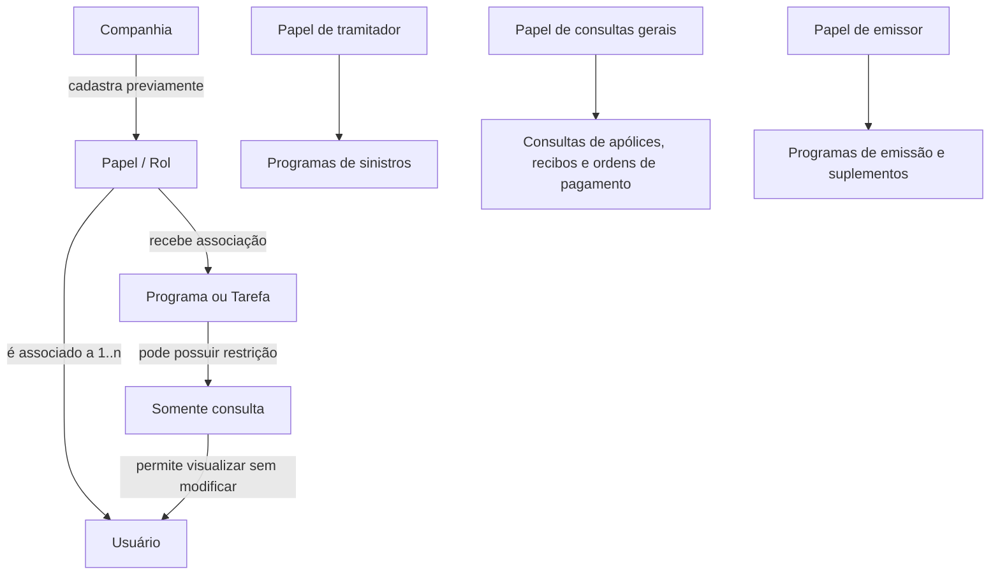
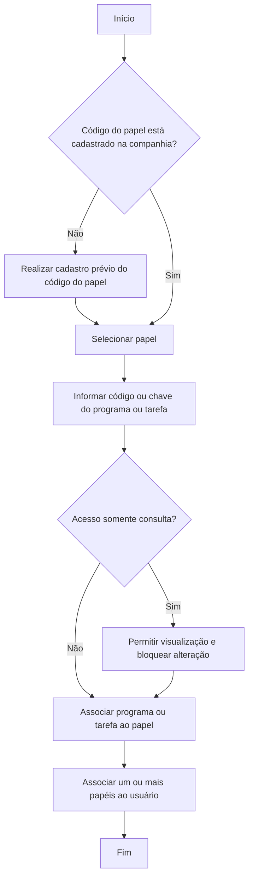

# Associação de Papéis a Programas no Sistema

## 1. Metadados do Documento
- **Arquivo de Origem:** Não informado
- **Tipo de Documento:** Procedimento
- **Domínio / Sistema:** Gestão de acesso por papéis, programas e tarefas
- **Público-Alvo:** Operação, administradores funcionais e desenvolvedores
- **Data/Versão Identificada:** Não identificada

---

## 2. Resumo Executivo & Contexto de Negócio

O documento descreve o processo de associação entre papéis de acesso e programas ou tarefas existentes no sistema. O objetivo é definir quais funcionalidades cada papel corporativo pode executar ou consultar.

Após configurar os papéis e os respectivos programas acessíveis, os papéis são associados aos usuários. Um usuário pode possuir de um a múltiplos papéis, permitindo a composição de permissões conforme as responsabilidades operacionais.

Os exemplos apresentados se referem a papéis voltados para tramitação de sinistros, consultas gerais e emissão. A combinação de papéis permite que um mesmo usuário acumule permissões de operação e de consulta.

O procedimento de manutenção utiliza os atributos **Rol**, **Programa** e **¿Acceso sólo Consulta?**. O documento estabelece que o código do papel precisa estar previamente cadastrado no nível da companhia.

---

## 3. Arquitetura, Componentes & Tecnologias Envolvidas

Os elementos funcionais identificados são:

- **Companhia:** contexto no qual o código do papel deve estar previamente cadastrado.
- **Papel (Rol):** chave de perfil à qual um programa ou tarefa será associado.
- **Programa:** código ou chave de um programa do sistema.
- **Tarefa:** funcionalidade que também pode ser associada a um papel.
- **Usuário:** entidade que recebe de um a múltiplos papéis.
- **Modo somente consulta:** restrição que impede alterações nas informações visualizadas.
- **Programas de sinistros:** programas atribuídos ao papel de tramitador.
- **Consultas de apólices, recibos e ordens de pagamento:** consultas atribuídas ao papel de consultas gerais.
- **Programas de emissão e suplementos:** programas atribuídos ao papel de emissor.
- **Home Solutions APIs Documentation Zeus EN:** texto apresentado no conteúdo bruto; o documento não detalha sua função, arquitetura ou relação operacional com a manutenção de papéis.



> **Nota de Análise:** o documento descreve associações funcionais de autorização, mas não especifica banco de dados, APIs, métodos HTTP, contratos JSON, autenticação, auditoria ou mecanismos técnicos de persistência.

---

## 4. Regras de Negócio, Especificações Funcionais & Processos

1. O sistema permite definir, para cada papel da companhia, quais programas ou tarefas podem ser executados ou consultados.
2. A associação entre papéis e programas deve ser definida antes de associar os papéis a usuários.
3. O código do papel deve estar previamente cadastrado no nível da companhia.
4. Um papel pode receber a associação de um programa ou de uma tarefa.
5. Um usuário pode possuir entre um e múltiplos papéis.
6. O atributo **¿Acceso sólo Consulta?**, quando afirmativo, determina acesso ao programa exclusivamente em modo consulta.
7. Um usuário com acesso somente consulta pode visualizar informações, mas não pode modificar as informações visualizadas.
8. O papel de tramitador possui como exemplo a atribuição de todos os programas de sinistros.
9. O papel de consultas gerais possui como exemplo a atribuição das consultas de apólices, recibos e ordens de pagamento.
10. O papel de emissor possui como exemplo a atribuição de todos os programas de emissão e suplementos.
11. Um usuário que atuará como tramitador pode acumular o papel de tramitador e o papel de consultas gerais.

### Fluxo funcional de manutenção



---

## 5. Tabelas de Parâmetros, Ambientes e Estruturas de Dados

| Item / Parâmetro | Descrição / Função | Tipo / Valores / Formato | Ambiente / Observações |
| :--- | :--- | :--- | :--- |
| Rol | Contém a chave do papel ao qual será atribuído um programa ou tarefa. | Código ou chave de papel. | Deve estar previamente cadastrado no nível da companhia. |
| Programa | Contém o código ou chave do programa ou da tarefa associada ao papel. | Código ou chave de programa ou tarefa. | Associado a um papel. |
| ¿Acceso sólo Consulta? | Define se o acesso ao programa será limitado à consulta. | Afirmativo ou não afirmativo. | Quando afirmativo, impede a modificação das informações visualizadas. |
| Usuário | Recebe os papéis configurados previamente. | Associação de 1 a n papéis. | Pode acumular múltiplos papéis. |
| Papel de tramitador | Papel exemplificado para atuação em sinistros. | Papel de acesso. | Possui todos os programas de sinistros, conforme exemplo. |
| Papel de consultas gerais | Papel exemplificado para atividades de consulta. | Papel de acesso. | Possui consultas de apólices, recibos e ordens de pagamento, conforme exemplo. |
| Papel de emissor | Papel exemplificado para atividades de emissão. | Papel de acesso. | Possui programas de emissão e suplementos, conforme exemplo. |

---

## 6. Bateria de Perguntas & Respostas para RAG (FAQ Sintético)

### P1: Qual é o objetivo da associação de papéis a programas?
**R:** O objetivo é explicar como os papéis de acesso são associados aos programas existentes no sistema, permitindo definir quais programas ou tarefas cada papel da companhia pode executar ou consultar.

### P2: Um usuário pode possuir mais de um papel?
**R:** Sim. O documento informa que um usuário pode ter associado de um a múltiplos papéis. Como exemplo, um usuário tramitador pode possuir simultaneamente o papel de tramitador e o papel de consultas gerais.

### P3: O que deve ocorrer antes de associar um papel a um programa?
**R:** O código do papel deve estar previamente cadastrado no nível da companhia antes que o papel seja utilizado para receber a associação de um programa ou tarefa.

### P4: Qual informação é registrada no atributo Rol?
**R:** O atributo **Rol** contém a chave do papel ao qual será atribuído um programa ou tarefa.

### P5: O que pode ser informado no atributo Programa?
**R:** O atributo **Programa** pode conter o código ou a chave de um programa ou de uma tarefa que será associada ao papel.

### P6: O que acontece quando o atributo ¿Acceso sólo Consulta? é afirmativo?
**R:** Quando o atributo **¿Acceso sólo Consulta?** é afirmativo, o acesso ao programa ocorre apenas em modo consulta. O usuário pode visualizar as informações, mas não pode modificá-las.

### P7: Quais permissões são exemplificadas para o papel de tramitador?
**R:** O papel de tramitador tem atribuídos todos os programas de sinistros, conforme o exemplo apresentado no documento.

### P8: Quais consultas são exemplificadas para o papel de consultas gerais?
**R:** O papel de consultas gerais possui consultas de apólices, consultas de recibos e consultas de ordens de pagamento.

### P9: Quais programas são exemplificados para o papel de emissor?
**R:** O papel de emissor possui todos os programas de emissão e suplementos.

### P10: A associação entre papel e programa é definida antes ou depois da associação do papel ao usuário?
**R:** A associação entre papel e programa é definida antes. Posteriormente à definição dos papéis e dos programas acessíveis por cada papel, esses papéis são associados aos usuários.

---

## 7. Glossário de Termos, Siglas & Conceitos-Chave

- **Rol:** atributo que contém a chave do papel ao qual será associado um programa ou tarefa.
- **Papel:** perfil de acesso da companhia que determina programas ou tarefas executáveis ou consultáveis.
- **Programa:** funcionalidade identificada por código ou chave que pode ser associada a um papel.
- **Tarefa:** atividade que pode ser associada a um papel, de modo equivalente a um programa no contexto apresentado.
- **Somente consulta / Acceso sólo Consulta:** modalidade de acesso que permite visualizar informações sem modificá-las.
- **Tramitador:** papel exemplificado com acesso aos programas de sinistros.
- **Consultas gerais:** papel exemplificado com acesso a consultas de apólices, recibos e ordens de pagamento.
- **Emissor:** papel exemplificado com acesso a programas de emissão e suplementos.

---

## 8. Notas Críticas, Riscos & Limitações

- O documento não detalha como os papéis, programas, tarefas e usuários são persistidos ou administrados tecnicamente.
- O documento não especifica critérios para conflitos entre permissões de múltiplos papéis atribuídos ao mesmo usuário.
- O documento não esclarece se o acesso somente consulta se sobrepõe a permissões de modificação provenientes de outro papel.
- O documento não apresenta URLs completas, ambientes, servidores, credenciais, APIs, contratos de integração ou trilhas de auditoria.
- O texto menciona “Home Solutions APIs Documentation Zeus EN”, mas não fornece detalhamento adicional sobre esse elemento.

---

## 9. Conteúdo Bruto Estruturado (Referência Fiel)

```text
--- [PÁGINA 1 DE 2] ---

ASIGNACIÓN de Roles a Programas
Objetivo
El objetivo es explicar como se asocian a los diferentes programas existentes en el Sistema sus roles
de acceso. El sistema permite definir para cada rol de la compañía qué programas o tareas puede
ejecutar o consultar.
Posteriormente a la definición de los roles y de los programas a los que pueden acceder cada rol,
esos roles se asociarán a un usuario. Un usuario puede tener asociado de 1 a n roles.
Ejemplos:
Rol de tramitador tendrá asignado todos los programas de siniestros.
Rol de consultas generales tendrá asignado todos las consultas de pólizas, consulta de
recibos, consulta de órdenes de pago.
Rol de emisor tendrá asignado todos los programas de emisión, suplementos....
Posteriormente un usuario que va a ser tramitador podría tener asociado el Rol de tramitador + el Rol
de consultas Generales.
Mantenimiento Asociación de roles a un programa:
 /
 CF
Home Solutions APIs Documentation Zeus
EN


--- [PÁGINA 2 DE 2] ---

Propiedades
Rol
Este atributo contiene la clave del rol al cual se le va a asignar un programa o tarea.
Previamente, el código tiene que estar dado de alta a nivel de compañía.
Programa
Este atributo contendrá el código o clave del programa o de una tarea a la cual se está asignando al
rol.
¿Acceso sólo Consulta?
Este atributo, si es afirmativo, determina que únicamente se se va a tener acceso al programa en
modo consulta no pudiendo por tanto modificar la información visualizada.
```
