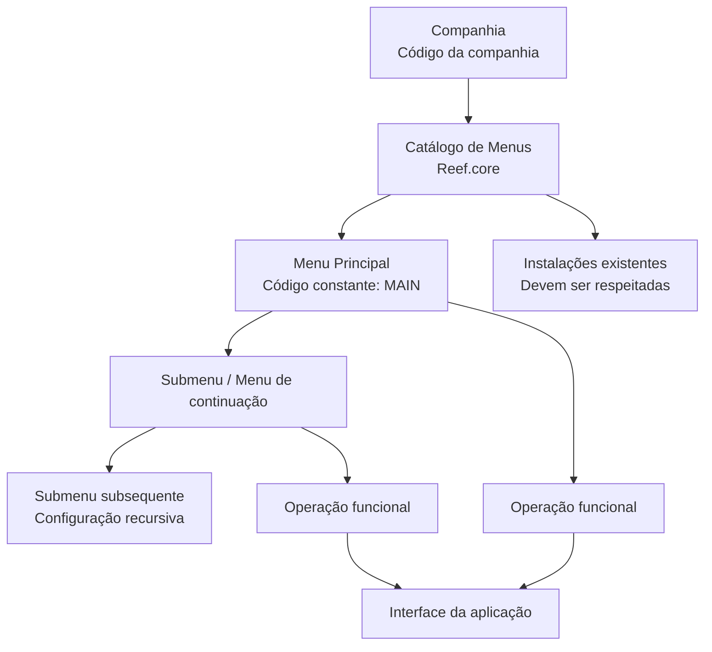

# Definição da Estrutura de Menus do Reef.core

## 1. Metadados do Documento
- **Arquivo de Origem:** `Não identificado — conteúdo bruto fornecido na solicitação`
- **Tipo de Documento:** Especificação Técnica / Documento Funcional
- **Domínio / Sistema:** Reef.core
- **Público-Alvo:** Desenvolvedores, Arquitetos, Operação e Analistas Funcionais
- **Data/Versão Identificada:** Não identificada

---

## 2. Resumo Executivo & Contexto de Negócio

O documento define a estrutura do catálogo de menus no âmbito do sistema **Reef.core**. A finalidade declarada para esse catálogo é agrupar e organizar os programas da aplicação que podem ser executados pelos usuários da companhia, desde que esses usuários tenham as permissões necessárias.

A estrutura de menus busca agilizar e facilitar a experiência do usuário por meio da organização dos programas e das operações funcionais disponíveis na aplicação. O catálogo centraliza a relação entre menus e operações em um mesmo repositório de informação.

O repositório contendo a configuração de menus é entregue às instalações com o conteúdo necessário para o funcionamento correto do sistema Reef.core. O documento caracteriza o catálogo como parte do núcleo do Reef.core e determina que as instalações existentes devem ser obrigatoriamente respeitadas.

Funcionalmente, a configuração admite um menu principal identificado pelo valor constante `MAIN`. A partir desse menu principal, podem ser configurados submenus ou menus de continuação, de forma recursiva, para expor funções mais específicas das operações que os usuários precisam executar.

O documento também estabelece atributos operacionais para identificar companhia, relacionamento hierárquico entre agrupadores de menu, operações funcionais, ordenação de exibição e inabilitação. Não são detalhados contratos técnicos, interfaces, métodos HTTP, estruturas físicas de banco de dados ou mecanismos específicos de validação de permissões.

---

## 3. Arquitetura, Componentes & Tecnologias Envolvidas

O documento cita os seguintes elementos funcionais e estruturais:

- **Reef.core:** sistema no qual a estrutura de menus é configurada.
- **Catálogo de menus:** repositório de informação que concentra menus e operações funcionais.
- **Companhia:** código da companhia sobre a qual a configuração de menus está sendo realizada.
- **Menu principal:** menu raiz da aplicação, com valor constante `MAIN`.
- **Submenu ou menu de continuação:** agrupador subordinado a um menu pai; pode conter menus subsequentes ou operações funcionais.
- **Operação funcional:** função específica associada a um agrupador pai e apresentada ao usuário na interface.
- **Instalações existentes:** configurações que devem ser preservadas por o catálogo integrar o núcleo do Reef.core.
- **Definição Programas:** documento funcional relacionado mencionado na seção de vínculos.
- **Perguntas frequentes:** material relacionado mencionado na seção de vínculos.



**Nota de Análise:** o documento descreve a hierarquia funcional de menus, mas não especifica tecnologias de implementação, banco de dados, APIs, formato de persistência, serviços, métodos HTTP ou contratos JSON.

---

## 4. Regras de Negócio, Especificações Funcionais & Processos

### 4.1 Finalidade do catálogo de menus

1. O catálogo de menus do Reef.core deve agrupar e organizar os programas da aplicação.
2. Os programas somente podem ser executados por usuários que possuam permissões para isso.
3. A organização do catálogo deve contribuir para agilizar e facilitar a experiência do usuário.
4. O catálogo reúne, em um mesmo repositório de informação:
   - A relação de menus.
   - As operações contidas pelos menus.
5. O conteúdo necessário para o funcionamento correto do sistema deve ser entregue às instalações.

### 4.2 Estrutura hierárquica de menus

1. O atributo de código agrupador determina o código do menu.
2. O menu principal da aplicação possui obrigatoriamente o valor constante `MAIN`.
3. A partir do menu principal, podem ser configurados:
   - Submenus.
   - Menus de continuação.
4. Submenus e menus de continuação procedem do menu principal.
5. Submenus e menus de continuação exibem funções mais específicas relacionadas às operações a realizar.
6. A configuração da estrutura hierárquica é recursiva.
7. Um código agrupador filho ou uma operação funcional deve estar associado ao código agrupador pai.

### 4.3 Código agrupador filho e operação funcional

1. O atributo **Código Agrupador Hijo u Operación Funcional** pode representar:
   - O código agrupador de um submenu.
   - O código agrupador de um menu de continuação.
   - Uma operação funcional.
2. Quando o atributo representar submenu ou menu de continuação, ele deve estar associado ao código agrupador pai.
3. Quando o atributo representar uma operação funcional, a operação integra a estrutura de navegação definida pelo agrupador pai.

### 4.4 Ordenação de exibição

1. O atributo **Orden** define a ordem em que o código agrupador filho ou a operação funcional será mostrado na interface.
2. A inclusão de um novo registro antes de uma agrupação ou operação existente requer alteração da ordem dos registros existentes.
3. O documento destaca a necessidade de cuidado especial ao modificar a ordenação de itens já existentes.

### 4.5 Inabilitação

1. O atributo **Inhabilitación** estabelece que um menu ou uma operação funcional está inabilitado.
2. Um menu ou operação funcional inabilitado não pode ser empregado na configuração dos catálogos do sistema.

### 4.6 Restrição sobre instalações existentes

1. As instalações existentes devem ser obrigatoriamente respeitadas.
2. A justificativa apresentada é que o catálogo faz parte do núcleo do Reef.core.

---

## 5. Tabelas de Parâmetros, Ambientes e Estruturas de Dados

| Item / Parâmetro | Descrição / Função | Tipo / Valores / Formato | Ambiente / Observações |
| :--- | :--- | :--- | :--- |
| Companhia | Contém o código da companhia sobre a qual a configuração da estrutura de menus do Reef.core está sendo realizada. | Código de companhia; formato não detalhado. | Aplicável à configuração do catálogo de menus. |
| Código Agrupador Pai | Determina o código do menu pai na estrutura hierárquica. | Código de menu; formato não detalhado. | O menu principal possui valor constante `MAIN`. |
| Menu Principal | Menu raiz da aplicação. | Valor constante: `MAIN`. | Ponto de partida para submenus, menus de continuação e operações funcionais. |
| Código Agrupador Filho ou Operação Funcional | Determina o código do submenu, do menu de continuação associado ao agrupador pai ou, alternativamente, a operação funcional. | Código de agrupador ou operação funcional; formato não detalhado. | Suporta estrutura recursiva. |
| Submenu | Menu derivado do menu principal ou de outro agrupador na estrutura recursiva. | Código agrupador; formato não detalhado. | Exibe funções mais específicas das operações a realizar. |
| Menu de continuação | Menu derivado do menu principal ou de outro agrupador na estrutura recursiva. | Código agrupador; formato não detalhado. | O documento trata menus de continuação juntamente com submenus. |
| Operação funcional | Função específica disponibilizada na estrutura de menus. | Não detalhado. | Pode ser associada ao código agrupador pai. |
| Orden | Define a ordem de apresentação de um código agrupador filho ou de uma operação funcional na interface. | Ordem numérica presumida pelo uso funcional; formato não explicitado. | Inserções anteriores a itens existentes exigem alteração da ordenação dos demais registros. |
| Inhabilitación | Indica que um menu ou operação funcional está inabilitado para uso na configuração de catálogos. | Estado de inabilitação; valores não detalhados. | Aplicável a menus e operações funcionais. |
| Repositório de informação | Repositório que contém relação de menus e operações. | Estrutura ou tecnologia não detalhada. | Entregue às instalações com o conteúdo necessário ao funcionamento do sistema. |
| Instalações existentes | Instalações cujo conteúdo deve ser respeitado. | Não aplicável. | Restrição obrigatória por o catálogo fazer parte do núcleo do Reef.core. |
| Definição Programas | Documento funcional relacionado. | Referência documental. | Leitura recomendada para evitar interpretação isolada incorreta. |
| Perguntas frequentes | Documento ou seção relacionada. | Referência documental. | Citado na seção de vínculos. |

---

## 6. Bateria de Perguntas & Respostas para RAG (FAQ Sintético)

### P1: Qual é a finalidade do catálogo de menus no Reef.core?
**R:** O catálogo de menus do Reef.core tem a finalidade de agrupar e organizar os programas da aplicação que podem ser executados pelos usuários da companhia, desde que os usuários possuam as permissões necessárias. A organização busca agilizar e facilitar a experiência do usuário.

### P2: Qual é o código do menu principal da aplicação Reef.core?
**R:** O menu principal da aplicação Reef.core possui o valor constante `MAIN`. Esse menu principal constitui o ponto de partida para a configuração de submenus, menus de continuação e operações funcionais.

### P3: O que pode ser configurado a partir do menu principal `MAIN`?
**R:** A partir do menu principal `MAIN`, podem ser configurados submenus ou menus de continuação. Esses elementos derivam do menu principal e exibem funções mais específicas relacionadas às operações a realizar. O documento estabelece que essa configuração pode ocorrer de forma recursiva.

### P4: O que representa o campo Código Agrupador Filho ou Operação Funcional?
**R:** O campo Código Agrupador Filho ou Operação Funcional pode determinar o código agrupador de um submenu, o código agrupador de um menu de continuação associado a um código agrupador pai ou, por fim, uma operação funcional.

### P5: Como a ordem dos menus e operações é controlada na interface?
**R:** O atributo `Orden` determina a ordem de apresentação do código agrupador filho ou da operação funcional na interface. Caso um novo registro precise ser exibido antes de uma agrupação ou operação existente, é necessário modificar a ordem dos registros existentes.

### P6: Qual é o efeito da propriedade Inhabilitación?
**R:** A propriedade `Inhabilitación` estabelece que um menu ou uma operação funcional fica inabilitado para ser empregado na configuração dos catálogos do sistema.

### P7: O catálogo de menus deve respeitar as instalações existentes?
**R:** Sim. O documento determina que as instalações existentes devem ser obrigatoriamente respeitadas, pois o catálogo de menus integra o núcleo do Reef.core.

### P8: Onde a relação entre menus e operações funcionais é mantida?
**R:** A relação entre menus e as operações que esses menus contêm é configurada em um mesmo repositório de informação. Esse repositório é entregue às instalações com o conteúdo necessário ao funcionamento correto do sistema.

### P9: O documento define como as permissões dos usuários são implementadas?
**R:** Não. O documento informa que os usuários podem executar programas da aplicação desde que tenham permissões para isso, mas não descreve o modelo de permissões, regras de autorização, papéis, perfis ou mecanismos técnicos de controle de acesso.

### P10: O documento especifica o tipo de dado do atributo Orden?
**R:** Não. O documento explica apenas que o atributo `Orden` determina a ordem de exibição de agrupadores filhos ou operações funcionais na interface. O tipo técnico, intervalo de valores e mecanismo de persistência não são detalhados.

### P11: A configuração de menus permite múltiplos níveis hierárquicos?
**R:** Sim. O documento informa que, a partir do menu principal, podem ser criados submenus ou menus de continuação e que essa forma de atuação é recursiva. Isso sustenta uma estrutura com níveis hierárquicos sucessivos.

### P12: Quais documentos relacionados são recomendados para leitura?
**R:** A seção de vínculos menciona `Definición Programas` e `Preguntas frecuentes` como diretrizes e documentos funcionais cuja leitura é recomendada para evitar que a interpretação isolada do documento gere erro.

---

## 7. Glossário de Termos, Siglas & Conceitos-Chave

- **Reef.core:** sistema no qual a estrutura de catálogo de menus é configurada.
- **Catálogo de menus:** estrutura que agrupa e organiza programas, menus e operações funcionais da aplicação.
- **Companhia:** entidade identificada por código sobre a qual a configuração da estrutura de menus é realizada.
- **Código Agrupador Pai:** código que identifica o menu pai na hierarquia do catálogo.
- **Código Agrupador Filho:** código que identifica um submenu ou menu de continuação associado a um agrupador pai.
- **Menu Principal:** menu raiz da aplicação, identificado pelo valor constante `MAIN`.
- **MAIN:** valor constante atribuído ao nome ou código do menu principal da aplicação.
- **Submenu:** menu subordinado que deriva de um menu principal ou de outro menu na estrutura recursiva.
- **Menu de continuação:** menu derivado utilizado para expor funções mais específicas das operações a realizar.
- **Operação funcional:** função disponibilizada por meio da estrutura de menus.
- **Orden:** atributo que determina a sequência de exibição de agrupadores filhos ou operações funcionais na interface.
- **Inhabilitación:** propriedade que impede o uso de um menu ou operação funcional na configuração dos catálogos do sistema.
- **Instalações:** destinatários do repositório de informação que contém o conteúdo necessário para funcionamento do Reef.core.

---

## 8. Notas Críticas, Riscos & Limitações

- O documento exige que as instalações existentes sejam obrigatoriamente respeitadas porque o catálogo é parte do núcleo do Reef.core. Alterações sem consideração das instalações existentes representam risco operacional.
- Alterações na propriedade `Orden` podem exigir reordenação de registros existentes, especialmente quando um novo item precisa aparecer antes de uma agrupação ou operação já configurada.
- Menus e operações funcionais marcados por `Inhabilitación` não podem ser empregados na configuração dos catálogos do sistema.
- A configuração da estrutura de menus é recursiva; alterações hierárquicas devem considerar relações entre código agrupador pai e código agrupador filho ou operação funcional.
- O documento recomenda a leitura de `Definición Programas` e `Preguntas frecuentes` para evitar interpretação isolada incorreta.
- **Nota de Análise:** o documento não detalha o modelo de permissões dos usuários, embora condicione a execução de programas à existência de permissões.
- **Nota de Análise:** o documento não especifica modelo de dados, banco de dados, APIs, formato dos códigos, tipos dos atributos, limites de profundidade da recursão ou processos de implantação.
- **Nota de Análise:** não são apresentados detalhes adicionais para a pergunta frequente sobre restrições do Catálogo de instalações além da orientação de respeitar obrigatoriamente as instalações existentes.

---

## 9. Conteúdo Bruto Estruturado (Referência Fiel)

```text
--- [PÁGINA 1 DE 3] ---

DEFINICIÓN de la ESTRUCTURA de MENUS de
Reef.core
Contexto
La finalidad básica de tener un catálogo de menús en el ámbito de Reef.core permite agrupar y
organizar los programas de la aplicación que pueden ejecutar los usuarios de la compañía (siempre y
cuando tengan permisos para ello) agilizando y facilitando la experiencia del usuario.
Objetivo
Funcionalmente, Reef.core cuenta con la posibilidad de configurar tanto la relación de menús
como las operaciones que estos contienen en un mismo repositorio de información que se
entrega a las instalaciones con el contenido necesario para el correcto funcionamiento del Sistema.
Propiedades Operativas
Otras Propiedades
Propiedades Operativas
Compañía
Este atributo del catálogo contiene el código de la compañía sobre la que se está realizando la
configuración de la estructura de Menús de Reef.core.
Código Agrupador Padre
 /
 CF
Home Solutions APIs Documentation Zeus
EN


--- [PÁGINA 2 DE 3] ---

Esta propiedad del catálogo determina el código del Menú.
El nombre del Menú Principal de la aplicación tiene el valor constante: 'MAIN'. A partir del Menú
Principal y de ser necesario, podrán configurarse Sub menús o menús de continuación, siendo
estos los que proceden del menú principal y en los que se exhiben funciones más específicas de
la operaciones a realizar siendo esta forma de actuación recursiva.
Código Agrupador Hijo u Operación Funcional
Esta propiedad del catálogo determina o bien el código agrupador del Sub menú o menú de
continuación asociado al código agrupador padre o finalmente la operación funcional.
Orden
Este atributo del catálogo determina el orden en el que se mostrará el código agrupador hijo o la
operación funcional en la interfaz.
Hay que tener especial cuidado cuando se quiera incluir un nuevo registro que se quiera visualizar
antes de alguna agrupación u operación existente ya que habrá que modificar el orden del resto
de registros existentes.
Otras Propiedades
Inhabilitación
Esta propiedad establece que el Menú u Operación Funcional está inhabilitado para poder ser
empleado en la configuración de los catálogos del Sistema.
Vínculos
Relación de Directrices y Documentos funcionales cuya lectura recomendada para evitar que la
interpretación aislada del presente documento pueda conducir a error.
Definición Programas
Preguntas frecuentes
(1) ¿Existe alguna restricción que tenga que ser tomada en cuenta en el uso y definición del Catálogo
de instalaciones de Reef.core?
Consejo:


--- [PÁGINA 3 DE 3] ---

Se han de respetar obligatoriamente las instalaciones existentes por ser el catálogo parte del
núcleo de Reef.core.
```
