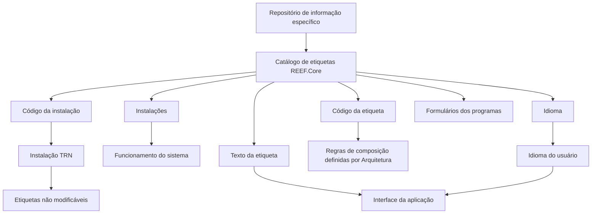

# Definição do Catálogo de Etiquetas do REEF.Core

## 1. Metadados do Documento
- **Arquivo de Origem:** Não identificado
- **Tipo de Documento:** Especificação Técnica
- **Domínio / Sistema:** REEF.Core
- **Público-Alvo:** Não identificado
- **Data/Versão Identificada:** Não identificada

---

## 2. Resumo Executivo & Contexto de Negócio

O documento descreve a definição das etiquetas do REEF.Core. Funcionalmente, o sistema disponibiliza um mecanismo para codificar a relação de etiquetas dos campos em um repositório de informação específico, distribuído às instalações com o conteúdo necessário para o funcionamento correto do sistema.

A finalidade básica do catálogo de etiquetas no REEF.Core é registrar e identificar, de forma padronizada, as etiquetas utilizadas nos formulários dos programas. Essa padronização busca facilitar tanto a representação gráfica quanto a compreensão funcional das etiquetas apresentadas na interface da aplicação.

A especificação define quatro propriedades operativas da etiqueta: código da etiqueta, código da instalação, idioma e texto da etiqueta. O código da etiqueta segue regras de composição definidas por Arquitetura e permite estabelecer implicitamente o uso do item, por exemplo como etiqueta ou texto de ajuda.

O documento também estabelece uma restrição operacional explícita: etiquetas cuja instalação corresponda ao núcleo da aplicação, identificado pela instalação `TRN`, não podem ser modificadas. A leitura da documentação relacionada, especialmente “Definición Programas”, é recomendada para evitar interpretações isoladas incorretas.

---

## 3. Arquitetura, Componentes & Tecnologias Envolvidas

O documento menciona os seguintes elementos do domínio REEF.Core:

- **REEF.Core / Reef.core:** sistema no qual o catálogo de etiquetas é utilizado.
- **Catálogo de etiquetas:** repositório lógico para registrar, identificar e disponibilizar etiquetas de campos.
- **Repositório de informação específico:** fonte que contém a relação codificada de etiquetas e é entregue às instalações.
- **Instalações:** destinatárias do conteúdo necessário ao funcionamento do sistema.
- **Programas e formulários:** consumidores das etiquetas para representação gráfica e compreensão funcional.
- **Arquitetura:** área responsável pelas regras de composição do código da etiqueta.
- **Instalação `TRN`:** instalação correspondente ao núcleo da aplicação; suas etiquetas não podem ser modificadas.



**Nota de Análise:** o documento não detalha tecnologias de implementação, banco de dados, APIs, contratos JSON, métodos HTTP, ambientes de infraestrutura ou mecanismos técnicos de distribuição do repositório de informação.

---

## 4. Regras de Negócio, Especificações Funcionais & Processos

### 4.1 Finalidade do catálogo de etiquetas

1. O REEF.Core possui a facilidade de codificar a relação de etiquetas dos campos.
2. A relação de etiquetas é armazenada em um repositório de informação específico.
3. O repositório é entregue às instalações com o conteúdo necessário ao funcionamento correto do sistema.
4. O catálogo registra e identifica de maneira padronizada as etiquetas empregadas nos formulários dos programas.
5. A padronização das etiquetas facilita:
   - A representação gráfica das etiquetas.
   - A compreensão funcional das etiquetas.

### 4.2 Código da etiqueta

1. O código da etiqueta é o identificador da etiqueta no catálogo.
2. A composição do código segue um conjunto de regras definido por Arquitetura.
3. As regras de composição permitem estabelecer implicitamente como a etiqueta será utilizada.
4. Os usos exemplificados no documento são:
   - Etiquetas.
   - Textos de ajuda.
5. O documento não apresenta a estrutura, máscara, tamanho, convenção de caracteres ou exemplos de códigos de etiqueta.

### 4.3 Código da instalação

1. O código da instalação identifica a instalação associada à definição da etiqueta.
2. A instalação é um atributo da definição da etiqueta.
3. O documento não descreve uma lista completa de instalações nem o formato do código da instalação.

### 4.4 Idioma

1. O idioma identifica a língua na qual o texto da etiqueta foi definido.
2. O documento cita como exemplos de idiomas:
   - Espanhol.
   - Inglês.
   - Turco.
3. O documento menciona a existência de códigos para identificar idiomas, mas não informa quais códigos devem ser utilizados.

### 4.5 Texto da etiqueta

1. O texto da etiqueta determina o conteúdo exibido na interface da aplicação.
2. A exibição do texto considera:
   - O idioma do usuário que utiliza o sistema.
   - O idioma definido para a etiqueta.
3. O documento não detalha regras de fallback quando não houver texto definido para o idioma do usuário.

### 4.6 Restrição de alteração para o núcleo da aplicação

1. Etiquetas cuja instalação corresponda ao núcleo da aplicação não podem ser modificadas.
2. O código da instalação que representa o núcleo da aplicação é `TRN`.
3. A restrição aplica-se à configuração das etiquetas associadas à instalação `TRN`.
4. O documento não descreve o mecanismo técnico utilizado para impedir modificações em etiquetas da instalação `TRN`.

### 4.7 Documentação relacionada

A leitura da documentação relacionada é recomendada para evitar que a interpretação isolada desta especificação leve a erros:

- **Definición Programas**
- **Preguntas frecuentes**

---

## 5. Tabelas de Parâmetros, Ambientes e Estruturas de Dados

### 5.1 Propriedades operativas da etiqueta

| Item / Parâmetro | Descrição / Função | Tipo / Valores / Formato | Ambiente / Observações |
| :--- | :--- | :--- | :--- |
| Código da etiqueta | Identificador da etiqueta no catálogo. | Não detalhado. A composição segue regras definidas por Arquitetura. | Permite estabelecer implicitamente o uso da etiqueta, como etiqueta ou texto de ajuda. |
| Código da instalação | Identifica o código da instalação da etiqueta. | Não detalhado. | A instalação é um atributo da definição da etiqueta. |
| Idioma | Identifica a língua em que o texto da etiqueta foi definido. | São citados códigos para espanhol, inglês e turco, sem especificação dos códigos concretos. | Influencia o texto exibido na interface. |
| Texto da etiqueta | Define o texto apresentado na interface da aplicação. | Texto; formato não detalhado. | Depende do idioma do usuário e do idioma da definição da etiqueta. |

### 5.2 Uso e restrição por instalação

| Item / Parâmetro | Descrição / Função | Tipo / Valores / Formato | Ambiente / Observações |
| :--- | :--- | :--- | :--- |
| Instalação `TRN` | Identifica a instalação correspondente ao núcleo da aplicação. | Código de instalação: `TRN`. | A configuração das etiquetas dessa instalação não pode ser modificada. |
| Repositório de informação específico | Armazena a relação codificada de etiquetas dos campos. | Não detalhado. | É entregue às instalações com o conteúdo necessário ao funcionamento do sistema. |
| Formulários dos programas | Utilizam as etiquetas do catálogo. | Não detalhado. | O catálogo facilita a representação gráfica e a compreensão funcional. |

### 5.3 Itens explicitamente não detalhados

| Item / Parâmetro | Descrição / Função | Tipo / Valores / Formato | Ambiente / Observações |
| :--- | :--- | :--- | :--- |
| Regras de composição do código | Regras estabelecidas por Arquitetura para formar o código da etiqueta. | Não informado. | O documento confirma a existência das regras, mas não as apresenta. |
| Códigos de idioma | Códigos usados para identificar idiomas. | Não informado. | Apenas espanhol, inglês e turco são citados como exemplos. |
| Mecanismo de bloqueio da instalação `TRN` | Forma pela qual a alteração das etiquetas do núcleo é impedida. | Não informado. | A restrição é funcionalmente explícita. |
| Detalhes de integração ou API | Métodos, endpoints, contratos e formatos de troca de dados. | Não informado. | Não há detalhes técnicos desse tipo no documento. |

---

## 6. Bateria de Perguntas & Respostas para RAG (FAQ Sintético)

### P1: Qual é a finalidade do catálogo de etiquetas do REEF.Core?
**R:** O catálogo de etiquetas do REEF.Core registra e identifica de maneira padronizada as etiquetas utilizadas nos formulários dos programas. Essa padronização facilita a representação gráfica e a compreensão funcional das etiquetas.

### P2: Onde a relação de etiquetas dos campos é armazenada no REEF.Core?
**R:** A relação de etiquetas dos campos é codificada em um repositório de informação específico. Esse repositório é entregue às instalações com o conteúdo necessário para o correto funcionamento do sistema.

### P3: Quais são as propriedades operativas definidas para uma etiqueta?
**R:** As propriedades operativas definidas são: código da etiqueta, código da instalação, idioma e texto da etiqueta.

### P4: Para que serve o código da etiqueta?
**R:** O código da etiqueta é o identificador da etiqueta no catálogo. Ele é composto segundo regras definidas por Arquitetura e permite estabelecer implicitamente o modo de uso da etiqueta, por exemplo como uma etiqueta de interface ou como um texto de ajuda.

### P5: O documento informa a estrutura ou o formato do código da etiqueta?
**R:** Não. O documento afirma que o código da etiqueta é composto de acordo com regras definidas por Arquitetura, mas não apresenta máscara, tamanho, exemplos, convenção de caracteres ou regras concretas de formação.

### P6: Qual é a função do código da instalação na definição da etiqueta?
**R:** O código da instalação identifica a instalação associada à definição da etiqueta. O documento não detalha o formato desse código nem apresenta uma lista completa de instalações.

### P7: Como o idioma influencia o texto exibido pela aplicação?
**R:** O idioma identifica a língua em que o texto da etiqueta foi definido. O texto exibido na interface da aplicação é determinado considerando o idioma do usuário que utiliza o sistema e o idioma da definição da etiqueta.

### P8: Quais idiomas são citados no documento como exemplos?
**R:** O documento cita espanhol, inglês e turco como exemplos de idiomas que podem ser identificados por códigos na definição de uma etiqueta. Os códigos concretos desses idiomas não são informados.

### P9: As etiquetas da instalação `TRN` podem ser alteradas?
**R:** Não. A configuração das etiquetas cuja instalação corresponde ao núcleo da aplicação, identificado pelo código `TRN`, não pode ser modificada.

### P10: O que representa a instalação `TRN` no contexto do REEF.Core?
**R:** A instalação `TRN` corresponde ao núcleo da aplicação. Por essa razão, as etiquetas associadas a essa instalação possuem restrição de alteração.

### P11: O documento explica como o REEF.Core bloqueia alterações nas etiquetas da instalação `TRN`?
**R:** Não. O documento define a regra de que etiquetas da instalação `TRN` não podem ser modificadas, mas não descreve o mecanismo técnico, controle de permissão ou validação responsável por aplicar esse bloqueio.

### P12: Qual documentação relacionada deve ser consultada para evitar interpretações incorretas?
**R:** O documento recomenda consultar “Definición Programas” e “Preguntas frecuentes”, pois a interpretação isolada do conteúdo atual pode conduzir a erros.

---

## 7. Glossário de Termos, Siglas & Conceitos-Chave

- **REEF.Core / Reef.core:** Sistema no qual existe o catálogo de etiquetas para codificar, registrar e identificar etiquetas de campos utilizadas nos formulários dos programas.
- **Catálogo de etiquetas:** Estrutura de informação destinada a registrar e identificar de forma padronizada as etiquetas utilizadas pelos programas.
- **Etiqueta:** Elemento cujo texto pode ser apresentado na interface da aplicação; o código da etiqueta também pode indicar uso como texto de ajuda.
- **Código da etiqueta:** Identificador da etiqueta, composto segundo regras definidas por Arquitetura.
- **Código da instalação:** Atributo da definição da etiqueta que identifica a instalação à qual a etiqueta está associada.
- **Idioma:** Propriedade que identifica a língua em que o texto da etiqueta foi definido.
- **Texto da etiqueta:** Conteúdo exibido na interface da aplicação segundo o idioma do usuário e o idioma definido para a etiqueta.
- **TRN:** Código da instalação correspondente ao núcleo da aplicação; suas etiquetas não podem ser modificadas.
- **Arquitetura:** Área mencionada como responsável pelas regras de composição do código da etiqueta.
- **RS:** Termo exibido no conteúdo bruto, sem definição no documento.

---

## 8. Notas Críticas, Riscos & Limitações

- O documento não identifica o arquivo de origem, versão, data, autor ou público-alvo.
- As regras de composição do código da etiqueta são atribuídas à Arquitetura, mas não são detalhadas.
- Não são fornecidos os códigos concretos de idioma, apesar de serem citados exemplos de idiomas.
- Não há especificação de estrutura de dados, persistência, APIs, contratos, integrações, tecnologias ou ambientes técnicos.
- Não são definidos critérios de fallback para casos em que não exista texto de etiqueta no idioma do usuário.
- A restrição sobre a instalação `TRN` é explícita, mas o mecanismo técnico ou operacional de enforcement não é apresentado.
- O termo `RS` aparece no conteúdo bruto sem contexto ou definição.
- **Nota de Análise:** o documento apresenta a finalidade e as propriedades do catálogo de etiquetas do REEF.Core, mas não detalha implementação, métodos de manutenção, permissões, fluxos de aprovação ou contratos de integração.

---

## 9. Conteúdo Bruto Estruturado (Referência Fiel)

```text
--- [PÁGINA 1 DE 1] ---

DEFINICIÓN de las ETIQUETAS de REEF.Core
Objetivo
Funcionalmente, Reef.core cuenta con la facilidad de codificar la relación de etiquetas de los campos en un repositorio de información específico que se
entrega a las instalaciones con el contenido necesario para el correcto funcionamiento del Sistema.
La finalidad básica del catálogo de etiquetas en el ámbito de Reef.core es registrar e identificar de manera estandarizada las etiquetas empleadas en los
formularios de los programas facilitando de esta manera su representación gráfica y comprensión funcional.
Propiedades Operativas
Propiedades Operativas
Código de la etiqueta
Esta propiedad del catálogo determina el identificador de la etiqueta, identificador que se conforma de acuerdo con un conjunto de reglas dictadas por
Arquitectura para su composición y que permiten establecer implícitamente cómo van a ser empleadas: como etiquetas, como textos de ayuda, ...
Código de la Instalación
Este atributo de la definición identifica el código de la instalación de la etiqueta.
Idioma
Esta propiedad identifica el idioma en el que está definido el texto de la etiqueta, como por ejemplo con los códigos que identifiquen a los idiomas español,
inglés, turco,...
Texto de la etiqueta
Esta propiedad determina el texto que se mostrará en la interfaz de la aplicación de acuerdo con el idioma que tenga al usuario que utiliza el sistema y el
idioma de la definición de la etiqueta.
Vínculos
Relación de Directrices y Documentos funcionales cuya lectura recomendada para evitar que la interpretación aislada del presente documento pueda
conducir a error.
Definición Programas
Preguntas frecuentes
(1) ¿Existe alguna restricción que tenga que ser tomada en cuenta en el uso y definición del Catálogo de etiquetas de Reef.core?
La configuración de la etiquetas cuya instalación corresponda al núcleo de la aplicación, instalación (TRN) no podrá modificarse.
 / 
 RS
Buscar Inicio Soluciones Arquitecturas APIs Eventos Componentes Cloud Documentación Zeus Reef Ayuda Nov
ES
```
