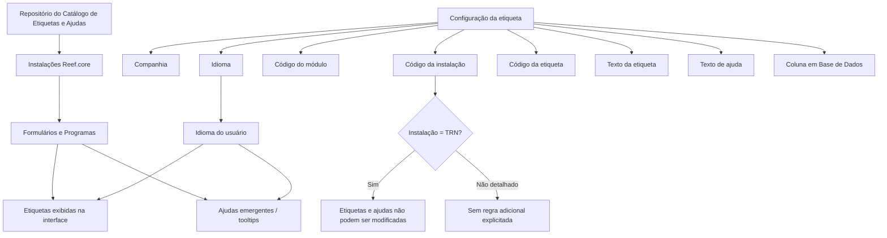

# Catálogo de Etiquetas e Ajudas da Aplicação Reef.core

## 1. Metadados do Documento
- **Arquivo de Origem:** Não identificado no conteúdo fornecido
- **Tipo de Documento:** Especificação Funcional
- **Domínio / Sistema:** Reef.core
- **Público-Alvo:** Desenvolvedores, Arquitetos, Operação, Negócio e equipes de tecnologia da entidade seguradora
- **Data/Versão Identificada:** Não identificada

---

## 2. Resumo Executivo & Contexto de Negócio

O documento define o catálogo de etiquetas e ajudas da aplicação Reef.core. Uma etiqueta é apresentada como um código usado para marcar texto em um programa ou página web, instruindo o navegador sobre a forma de exibição e estruturando o conteúdo de formulários ou programas.

O catálogo também contempla ajudas, descritas como *tooltips*, descrições emergentes ou textos alternativos. Essas ajudas são exibidas quando o usuário posiciona o cursor sobre um elemento gráfico e têm a finalidade de informar a função do elemento apresentado na interface.

No contexto do Reef.core, o catálogo centraliza, organiza e identifica etiquetas e ajudas associadas aos campos dos formulários. Essa centralização busca facilitar tanto a recuperação das informações para representação gráfica quanto a compreensão funcional dos campos e elementos da aplicação.

Funcionalmente, Reef.core permite codificar a relação entre etiquetas, ajudas e campos em um repositório específico. Esse repositório é entregue às instalações com o conteúdo necessário ao funcionamento correto do sistema. Etiquetas configuradas para a instalação do núcleo, identificada como `TRN`, possuem restrição de alteração e devem ser respeitadas.

O documento também estabelece propriedades operativas para identificar contexto organizacional, instalação, módulo, idioma, código, textos apresentados e eventual coluna de banco de dados relacionada. A propriedade denominada marca de controle é obsoleta, está descontinuada e não deve ser utilizada ou reutilizada localmente.

---

## 3. Arquitetura, Componentes & Tecnologias Envolvidas

Os elementos identificados no documento são:

- **Reef.core:** Sistema no qual o catálogo de etiquetas e ajudas é utilizado.
- **Catálogo de etiquetas e ajudas:** Repositório de informação que codifica a relação entre campos de formulários, etiquetas e textos de ajuda.
- **Instalação do núcleo (`TRN`):** Instalação cuja configuração de etiquetas e ajudas não pode ser modificada.
- **Módulos Reef.core:** Contexto modular ao qual uma etiqueta ou ajuda pertence.
- **Formulários e programas:** Consumidores das etiquetas e ajudas para representação da interface.
- **Base de dados:** Pode possuir uma coluna associada à etiqueta como facilitador para a equipe de tecnologia da entidade seguradora.
- **Usuário do sistema:** Recebe o texto da etiqueta e da ajuda conforme o idioma utilizado.



**Nota de Análise:** O documento não detalha tecnologias de persistência, contratos de integração, métodos HTTP, interfaces de administração do catálogo, processos de publicação ou mecanismos técnicos que impeçam a alteração das configurações `TRN`.

---

## 4. Regras de Negócio, Especificações Funcionais & Processos

### 4.1 Definição de etiqueta

1. Uma etiqueta é um código utilizado para marcar texto em um programa ou página web.
2. A etiqueta fornece instruções ao navegador sobre como o texto deve ser apresentado.
3. Etiquetas são usadas para estruturar e definir o conteúdo em formulários ou programas.

### 4.2 Definição de ajuda

1. Uma ajuda pode ser denominada *tooltip*, ajuda, descrição emergente ou texto alternativo.
2. A ajuda funciona quando o cursor é posicionado sobre um elemento gráfico.
3. A ajuda exibida informa ao usuário a finalidade do elemento sobre o qual o cursor está posicionado.

### 4.3 Finalidade do catálogo de etiquetas e ajudas

1. O catálogo agrupa etiquetas e ajudas dos campos dos formulários dos programas Reef.core.
2. O catálogo organiza e identifica as informações de interface.
3. O catálogo facilita a recuperação de etiquetas e ajudas para representação gráfica.
4. O catálogo facilita a compreensão funcional das etiquetas e ajudas cadastradas.
5. O conteúdo do repositório é entregue às instalações para permitir o funcionamento correto do sistema.

### 4.4 Regra de imutabilidade para instalação do núcleo

1. A instalação do núcleo é identificada pelo código `TRN`.
2. Quando o valor da instalação na configuração de uma etiqueta corresponde à instalação do núcleo `TRN`, as etiquetas não podem ser modificadas.
3. A configuração realizada para etiquetas e ajudas correspondentes à instalação `TRN` deve ser obrigatoriamente respeitada.
4. O documento não descreve o processo técnico de validação, autorização ou bloqueio da modificação das etiquetas `TRN`.

### 4.5 Regra de identificação interna

1. O código do módulo identifica o módulo Reef.core no qual a etiqueta ou ajuda está registrada.
2. O código da etiqueta identifica a etiqueta no catálogo.
3. A combinação **Código do Módulo + Código da Etiqueta** forma a chave interna das etiquetas.

### 4.6 Regra de idioma e apresentação

1. O atributo idioma identifica o idioma em que o texto de etiqueta ou ajuda está definido.
2. O documento apresenta espanhol, inglês e turco como exemplos de idiomas.
3. O texto da etiqueta exibido na interface depende do idioma do usuário e do idioma configurado para a etiqueta ou ajuda.
4. O texto de ajuda emergente também depende do idioma do usuário e do idioma configurado para a ajuda.

### 4.7 Coluna em base de dados

1. A propriedade coluna em base de dados identifica o código da coluna de banco à qual a etiqueta se refere.
2. O preenchimento dessa propriedade é apresentado como facilitador para a equipe de tecnologia da entidade seguradora.
3. Dada a grande quantidade de tabelas, programas, formulários e atributos existentes no Reef.core, o preenchimento não é obrigatório.
4. Apesar de não obrigatório, o documento recomenda a captura desse valor na configuração do catálogo de etiquetas.

### 4.8 Marca de controle obsoleta

1. A marca de controle é uma propriedade obsoleta.
2. A funcionalidade da marca de controle está descontinuada na definição de etiquetas.
3. A marca de controle não deve ser utilizada nem reutilizada para propósitos locais.
4. Originalmente, a ativação dessa propriedade indicava se modificações na definição de etiquetas deveriam ser controladas em envios de software.

### 4.9 Documentação relacionada

O documento recomenda a leitura dos seguintes materiais para evitar interpretações incorretas causadas por análise isolada:

- Definición Programas
- Definición Usuarios del Sistema

---

## 5. Tabelas de Parâmetros, Ambientes e Estruturas de Dados

| Item / Parâmetro | Descrição / Função | Tipo / Valores / Formato | Ambiente / Observações |
| :--- | :--- | :--- | :--- |
| Companhia | Código da companhia sobre a qual a definição da etiqueta é realizada. | Código de companhia; formato não detalhado. | Propriedade operativa do catálogo. |
| Código da Instalação | Identifica o código da instalação da etiqueta. | Código de instalação; formato não detalhado. | Se corresponder a `TRN`, a etiqueta não pode ser modificada. |
| `TRN` | Código da instalação do núcleo. | Código literal citado no documento. | Configurações de etiquetas e ajudas devem ser obrigatoriamente respeitadas. |
| Código do módulo | Identifica o módulo Reef.core no qual a etiqueta ou ajuda está registrada. | Código de módulo; formato não detalhado. | Compõe a chave interna em conjunto com o código da etiqueta. |
| Idioma | Identifica o idioma do texto da etiqueta ou ajuda. | Códigos de idioma; exemplos: espanhol, inglês e turco. | Determina, junto ao idioma do usuário, o texto exibido. |
| Código da etiqueta | Determina o identificador da etiqueta. | Código de etiqueta; formato não detalhado. | Compõe a chave interna em conjunto com o código do módulo. |
| Chave interna da etiqueta | Identificação interna da etiqueta. | `Código do Módulo + Código da Etiqueta`. | Regra explicitamente definida pelo documento. |
| Texto da etiqueta | Texto exibido na interface da aplicação. | Texto; formato não detalhado. | Exibido de acordo com o idioma do usuário e da definição. |
| Texto de ajuda | Texto emergente exibido ao posicionar o cursor sobre a etiqueta. | Texto; formato não detalhado. | Exibido de acordo com o idioma do usuário e da configuração da ajuda. |
| Coluna em Base de Dados | Código da coluna de banco associada à etiqueta. | Código de coluna; formato não detalhado. | Não obrigatório; recomendado como facilitador para a equipe de tecnologia da entidade seguradora. |
| Marca de controle | Propriedade historicamente usada para controlar alterações em envios de software. | Propriedade obsoleta. | Descontinuada; não deve ser usada ou reutilizada localmente. |
| Repositório de informação específico | Armazena a codificação da relação entre etiquetas, ajudas e campos. | Repositório; tecnologia não detalhada. | Entregue às instalações com o conteúdo necessário ao funcionamento do sistema. |

---

## 6. Bateria de Perguntas & Respostas para RAG (FAQ Sintético)

### P1: Qual é a finalidade do catálogo de etiquetas e ajudas no Reef.core?
**R:** O catálogo de etiquetas e ajudas do Reef.core agrupa, organiza e identifica as etiquetas e os textos de ajuda associados aos campos de formulários e programas. A finalidade é facilitar a recuperação dessas informações para representação gráfica e apoiar a compreensão funcional dos elementos da aplicação.

### P2: O que representa uma etiqueta no contexto da aplicação?
**R:** Uma etiqueta é um código utilizado para marcar texto em um programa ou página web. Esse código fornece instruções sobre como o navegador deve mostrar o texto e é utilizado para estruturar e definir conteúdo em formulários ou programas.

### P3: O que é o texto de ajuda ou tooltip no Reef.core?
**R:** O texto de ajuda, também chamado de *tooltip*, ajuda, descrição emergente ou texto alternativo, é uma ferramenta de apoio visual. Ele é exibido quando o usuário posiciona o cursor sobre um elemento gráfico e informa a finalidade daquele elemento.

### P4: Qual é a restrição para etiquetas associadas à instalação `TRN`?
**R:** Etiquetas e ajudas cuja configuração possui o código de instalação do núcleo `TRN` não podem ser modificadas. A configuração existente para a instalação `TRN` deve ser obrigatoriamente respeitada.

### P5: Como é formada a chave interna de uma etiqueta?
**R:** A chave interna da etiqueta é formada pela combinação do **Código do Módulo** com o **Código da Etiqueta**. O documento expressa essa composição como `Código do Módulo + Código da Etiqueta`.

### P6: Como o idioma influencia a exibição de etiquetas e ajudas?
**R:** O atributo idioma identifica o idioma no qual a etiqueta ou ajuda foi definida. O texto apresentado na interface depende do idioma do usuário do sistema e do idioma associado à definição da etiqueta ou da ajuda. O documento cita espanhol, inglês e turco como exemplos de idiomas.

### P7: A propriedade coluna em base de dados é obrigatória?
**R:** Não. O documento informa que, devido ao grande número de tabelas, programas, formulários e atributos do Reef.core, a captura da coluna em base de dados não é obrigatória. Entretanto, seu preenchimento é recomendado por facilitar o trabalho da equipe de tecnologia da entidade seguradora.

### P8: Qual é o propósito da propriedade coluna em base de dados?
**R:** A propriedade coluna em base de dados identifica o código da coluna do banco de dados à qual a etiqueta se refere. Ela atua como facilitador para a equipe de tecnologia da entidade seguradora.

### P9: A marca de controle pode ser usada em novas configurações locais?
**R:** Não. A marca de controle é uma propriedade obsoleta e sua funcionalidade foi descontinuada na definição de etiquetas. O documento determina que ela não deve ser usada nem reutilizada para qualquer propósito local.

### P10: Para que a marca de controle era usada originalmente?
**R:** Originalmente, a ativação da marca de controle indicava se as modificações feitas na definição das etiquetas deveriam ou não ser controladas durante os envios de software.

### P11: Onde é armazenada a relação entre etiquetas, ajudas e campos no Reef.core?
**R:** A relação entre etiquetas, ajudas e campos é codificada em um repositório de informação específico. Esse repositório é entregue às instalações com o conteúdo necessário para o funcionamento correto do sistema.

### P12: Quais documentos relacionados devem ser consultados para evitar interpretação isolada do catálogo?
**R:** O documento recomenda a leitura de **Definición Programas** e **Definición Usuarios del Sistema**, pois a interpretação isolada do documento de catálogo de etiquetas e ajudas pode conduzir a erros.

---

## 7. Glossário de Termos, Siglas & Conceitos-Chave

- **Reef.core:** Sistema no qual o catálogo de etiquetas e ajudas é aplicado.
- **TRN:** Código da instalação do núcleo. Etiquetas e ajudas configuradas para essa instalação não podem ser modificadas.
- **Etiqueta:** Código usado para marcar texto e estruturar ou definir conteúdo em formulários e programas.
- **Tooltip:** Ferramenta de ajuda visual exibida ao posicionar o cursor sobre um elemento gráfico.
- **Texto de ajuda:** Conteúdo emergente que informa a finalidade de um elemento da interface.
- **Catálogo de etiquetas e ajudas:** Repositório de informações para agrupar, organizar, identificar e recuperar etiquetas e ajudas de campos dos formulários.
- **Código do módulo:** Identificador do módulo Reef.core ao qual a etiqueta ou ajuda pertence.
- **Código da etiqueta:** Identificador da etiqueta no catálogo.
- **Chave interna:** Combinação do código do módulo e do código da etiqueta.
- **Marca de controle:** Propriedade obsoleta, anteriormente associada ao controle de mudanças de etiquetas em envios de software.
- **Coluna em Base de Dados:** Código da coluna de banco à qual uma etiqueta se refere.

---

## 8. Notas Críticas, Riscos & Limitações

- A configuração de etiquetas e ajudas da instalação do núcleo `TRN` é imutável segundo o documento; alterações nessa configuração violariam a regra explicitada.
- O documento não descreve o mecanismo técnico que bloqueia modificações em etiquetas e ajudas `TRN`.
- Não são informados formatos, tamanhos, convenções de nomenclatura ou domínios de valores para códigos de companhia, instalação, módulo, etiqueta, idioma ou coluna de banco.
- Não são especificadas tecnologias do repositório de informações, banco de dados, APIs, mecanismos de sincronização ou processos de entrega às instalações.
- A coluna em base de dados é recomendada, mas não obrigatória. A ausência desse valor pode reduzir a facilidade de identificação técnica da origem da etiqueta.
- A marca de controle é descontinuada e não deve ser reutilizada localmente.
- O conteúdo fornecido termina após o rótulo `Consejo:`; não há texto adicional disponível para transcrição ou análise desse conselho.

---

## 9. Conteúdo Bruto Estruturado (Referência Fiel)

```text
--- [PÁGINA 1 DE 3] ---

DEFINICIÓN de las ETIQUETAS y AYUDAS la
Aplicación
Contexto
Una etiqueta es un código utilizado para "marcar" el texto en un programa o página web con el fin
de dar instrucciones al navegador sobre cómo mostrarlo (es decir, las etiquetas se utilizan para
estructurar y definir el contenido en un formulario o programa determinado).
Un "tooltip", ayuda, descripción emergente o texto alternativo es una herramienta de ayuda visual
que funciona al situar el cursor sobre algún elemento gráfico, mostrando de esta manera una ayuda
adicional que informa al usuario de la finalidad del elemento sobre el que se encuentra.
La finalidad básica del catálogo de etiquetas y ayudas en el ámbito de Reef.core es agrupar,
organizar e identificar las etiquetas y ayudas de los campos de los formularios en los programas
facilitando de esta manera tanto su recuperación (para su representación gráfica) como su
comprensión funcional.
Objetivo
Funcionalmente, Reef.core cuenta con la posibilidad de codificar la relación de etiquetas y ayudas de
los campos en un repositorio de información específico que se entrega a las instalaciones con el
contenido necesario para el correcto funcionamiento del Sistema.
Si el valor de la instalación en la configuración de la etiqueta es la correspondiente a la instalación
del núcleo, instalación (TRN) las etiquetas no podrán modificarse.
 /
 CF
Home Solutions APIs Documentation Zeus
EN

--- [PÁGINA 2 DE 3] ---

Propiedades Operativas
Propiedades Operativas
Compañía
Este atributo del catálogo contiene el código de la compañía sobre la que se está realizando la
definición de la etiqueta.
Código de la Instalación
Esta propiedad de la definición identifica el código de la instalación de la etiqueta.
Código del módulo
Esta propiedad de la definición identifica el código del módulo de Reef.core en el que se inscribe la
etiqueta o ayuda.
Idioma
Esta propiedad identifica el idioma en el que está definido el texto de la etiqueta o de la ayuda, como
por ejemplo con los códigos que identifiquen a los idiomas español, inglés, turco,...
Código de la etiqueta
Esta propiedad del catálogo determina el identificador de la etiqueta.
La dupla Código del Módulo + Código de la Etiqueta conforma la clave interna de las etiquetas.
Texto de la etiqueta
Esta propiedad determina el texto que se mostrará en la interfaz de la aplicación de acuerdo con el
idioma que tenga al usuario que utiliza el sistema y el idioma de la definición de la etiqueta o ayuda.
Texto de ayuda
Este atributo determina el texto de ayuda emergente que se mostrará en la interfaz de la aplicación al
posicionar el cursor sobre la etiqueta y de acuerdo con el idioma que tenga al usuario que utiliza el
sistema y el idioma empleado en la configuración de la ayuda.
Columna en Base de Datos
Esta propiedad identifica, como facilitador para el equipo de tecnología de la entidad aseguradora, el
código de la columna en la base de datos a la que se refiere la etiqueta.

--- [PÁGINA 3 DE 3] ---

Por el ingente número de tablas, programas, formularios y atributos existentes en Reef.core, no
siendo una tarea que se haya de realizar obligatoriamente, sí se recomienda la captura de este
valor en la configuración del catálogo de etiquetas.
Marca de control
Por ser una propiedad obsoleta, la funcionalidad de este atributo está descontinuada en la definición
de la etiqueta por lo que no debe usarse o reutilizarse para ningún propósito de ámbito local.
Originalmente la activación de esta propiedad en la etiqueta indicaba si se tenía o no que
controlar en los envíos de software las modificaciones efectuadas en su definición de las
etiquetas.
Vínculos
Relación de Directrices y Documentos funcionales cuya lectura recomendada para evitar que la
interpretación aislada del presente documento pueda conducir a error.
Definición Programas
Definición Usuarios del Sistema
Preguntas frecuentes
(1) ¿Existe alguna restricción que tenga que ser tomada en cuenta en el uso y definición del Catálogo
de etiquetas por compañía, instalación e idioma de Reef.core?
Se han de respetar obligatoriamente la configuración realizada en las etiquetas y ayudas que se
corresponden con la instalación del núcleo (TRN).
Consejo:
```
