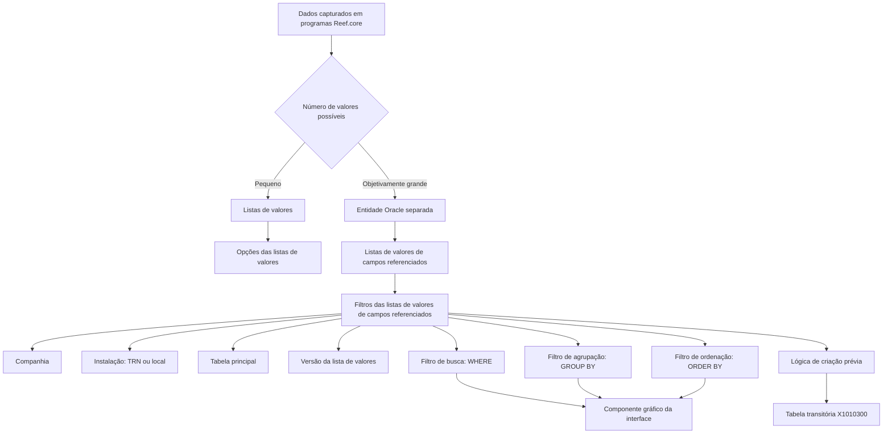

# Definição dos Filtros das Listas de Valores de Campos Referenciados no Reef.core

## 1. Metadados do Documento
- **Arquivo de Origem:** Não identificado
- **Tipo de Documento:** Especificação Técnica
- **Domínio / Sistema:** Reef.core
- **Público-Alvo:** Desenvolvedores, Arquitetos, Operação e equipes responsáveis por configuração
- **Data/Versão Identificada:** Não identificada

---

## 2. Resumo Executivo & Contexto de Negócio

O documento especifica a configuração de filtros para listas de valores de campos referenciados no sistema Reef.core. Listas de valores são usadas para registrar dados codificados quando a quantidade possível de valores é pequena; esses valores podem ser armazenados de forma compartilhada nos repositórios de “listas de valores” e “opções de listas de valores”.

Quando os valores estão armazenados em uma entidade separada da base de dados — situação associada a conjuntos objetivamente grandes de valores — pode ser necessário restringir os registros apresentados conforme critérios variáveis. Para esse cenário, Reef.core possui os repositórios “listas de valores de campos referenciados” e “filtros das listas de valores de campos referenciados”.

A finalidade da configuração é permitir que o componente gráfico da interface consulte, componha e apresente adequadamente os resultados da busca. Cada filtro é associado a uma companhia, instalação, tabela principal e versão da lista de valores de campos referenciados.

Os filtros abrangem critérios SQL de busca (`WHERE`), agrupamento (`GROUP BY`) e ordenação (`ORDER BY`). O documento também prevê lógica de negócio de criação prévia para gerar temporariamente, na tabela transitória `X1010300`, as informações necessárias à configuração da lista de valores.

A configuração deve respeitar obrigatoriamente as listas de valores da instalação `TRN`, por integrarem o núcleo do Reef.core. Nos catálogos que podem ser personalizados por países, podem coexistir somente registros da instalação `TRN` e da instalação local da companhia.

---

## 3. Arquitetura, Componentes & Tecnologias Envolvidas

| Componente / Tecnologia | Papel descrito no documento |
| :--- | :--- |
| Reef.core | Sistema que mantém catálogos e repositórios para listas de valores e filtros de campos referenciados. |
| Listas de valores | Repositório compartilhado para dados codificados com número pequeno de valores possíveis. |
| Opções das listas de valores | Repositório complementar das listas de valores para armazenamento de opções codificadas. |
| Listas de valores de campos referenciados | Repositório destinado à configuração de listas vinculadas a entidades separadas. |
| Filtros das listas de valores de campos referenciados | Repositório que registra critérios aplicáveis às listas de valores de campos referenciados. |
| Entidade Oracle / tabela principal | Entidade da base de dados para a qual o filtro é configurado. |
| SQL `WHERE` | Cláusula usada para definir critérios de busca de registros. |
| SQL `GROUP BY` | Cláusula usada para agrupar linhas segundo uma ou mais colunas. |
| SQL `HAVING` | Cláusula mencionada como recurso para filtrar grupos conforme o resultado de função de agregação. |
| SQL `ORDER BY` | Cláusula usada para ordenar linhas conforme uma ou mais colunas. |
| Tabela transitória `X1010300` | Tabela temporária e interna usada pela lógica de negócio de criação prévia. |
| Componente gráfico da interface | Componente que conforma e visualiza o resultado da busca configurada. |
| Instalação `TRN` | Instalação do núcleo do Reef.core; sua configuração não pode ser alterada. |
| Instalação local | Instalação que distingue configurações locais das configurações padrão do núcleo. |



> **Nota de Análise:** O documento identifica a entidade Oracle como tabela principal, mas não informa nomes concretos de tabelas Oracle, colunas, contratos de consulta, métodos de acesso ou sintaxe completa dos filtros SQL.

---

## 4. Regras de Negócio, Especificações Funcionais & Processos

1. Programas Reef.core capturam dados de livre formato e dados codificados.
2. Quando um dado codificado possui um número objetivamente grande de valores possíveis, as equipes de tecnologia normalmente criam entidades separadas na base de dados para registrar e armazenar esses valores.
3. Quando um dado possui número pequeno de valores possíveis, os valores podem ser incorporados e armazenados de forma compartilhada nos repositórios de listas de valores e opções das listas de valores.
4. Quando a informação de uma entidade separada precisa ser filtrada por critérios variáveis ou mutáveis, os critérios devem ser configurados nos repositórios de listas de valores de campos referenciados e filtros das listas de valores de campos referenciados.
5. A configuração dos filtros deve permitir que o componente gráfico da interface forme e visualize corretamente o resultado de busca.
6. O atributo **Companhia** contém o código da companhia para a qual está sendo definida a configuração do filtro.
7. O atributo **Código da instalação** identifica a instalação associada ao filtro configurado.
8. Quando a instalação configurada é `TRN`, correspondente à instalação do núcleo, a informação não pode ser alterada sob nenhuma circunstância.
9. A **Tabela principal** define o nome da entidade Oracle para a qual o filtro da lista de valores é configurado.
10. A **Versão da lista de valores** identifica a versão da lista de valores de campos referenciados e, consequentemente, a versão do filtro associado.
11. Uma mesma tabela pode possuir listas de valores ou critérios de busca distintos.
12. O valor da versão deve ser consecutivo e iniciar em `1`.
13. O **Filtro de busca** contém o texto da cláusula usada para buscar registros na tabela principal e na versão configurada da lista de valores de campos referenciados.
14. A cláusula SQL `WHERE` define critérios que os valores dos campos devem satisfazer para que os registros sejam incluídos no resultado da consulta.
15. O **Filtro de agrupação** contém o texto da cláusula usada para agrupar informações dos registros da tabela principal e da versão configurada.
16. A cláusula SQL `GROUP BY` agrupa linhas segundo valores de uma ou mais colunas.
17. A cláusula SQL `HAVING`, em conjunto com `GROUP BY`, pode filtrar grupos de linhas conforme o resultado de uma função de agregação.
18. O **Filtro de ordenação** contém o texto da cláusula usada para ordenar informações dos registros da tabela principal e da versão configurada.
19. A cláusula SQL `ORDER BY` ordena linhas de uma tabela segundo valores de uma ou mais colunas.
20. A **Lógica de negócio de criação prévia** contém a lógica que cria, temporária e internamente, na tabela transitória `X1010300`, as informações necessárias para configurar a lista de valores.
21. É obrigatório respeitar a relação de listas de valores `TRN`, pois ela integra o núcleo do Reef.core.
22. Nos catálogos configuráveis por países, incluindo o catálogo de filtros de listas de valores de campos referenciados, somente podem coexistir registros com código de instalação `TRN` e código da instalação local.
23. A coexistência de registros `TRN` e locais permite distinguir se uma configuração é padrão ou local.

---

## 5. Tabelas de Parâmetros, Ambientes e Estruturas de Dados

| Item / Parâmetro | Descrição / Função | Tipo / Valores / Formato | Ambiente / Observações |
| :--- | :--- | :--- | :--- |
| Companhia | Código da companhia sobre a qual é definida a configuração do filtro. | Código de companhia | Associado ao catálogo de filtros. |
| Código da instalação | Identifica a instalação associada ao filtro da lista de valores de campos referenciados. | `TRN` ou código de instalação local | Configurações `TRN` não podem ser alteradas. |
| Tabela principal | Determina o nome da entidade Oracle para a qual o filtro é configurado. | Nome de entidade Oracle | O documento não informa nomes concretos de tabelas. |
| Versão da lista de valores | Identifica a versão da lista de valores de campos referenciados e do filtro correspondente. | Consecutivo iniciado em `1` | Uma tabela pode ter múltiplas listas de valores ou critérios de busca. |
| Filtro de busca | Define o texto da cláusula para buscar registros. | Texto de cláusula SQL; referência a `WHERE` | Aplicado à tabela principal e à versão configurada. |
| Filtro de agrupação | Define o texto da cláusula para agrupar informações. | Texto de cláusula SQL; referência a `GROUP BY` e `HAVING` | Aplicado à tabela principal e à versão configurada. |
| Filtro de ordenação | Define o texto da cláusula para ordenar informações. | Texto de cláusula SQL; referência a `ORDER BY` | Aplicado à tabela principal e à versão configurada. |
| Lógica de negócio de criação prévia | Cria temporária e internamente as informações necessárias à configuração da lista de valores. | Lógica de negócio | Utiliza a tabela transitória `X1010300`. |
| Tabela transitória | Armazena temporariamente a informação necessária para configurar a lista de valores. | `X1010300` | Uso interno e temporário. |
| Instalação do núcleo | Representa a configuração padrão do núcleo Reef.core. | `TRN` | Deve ser obrigatoriamente respeitada; não pode ser alterada. |
| Instalação local | Representa a configuração personalizada localmente. | Código local não especificado | Pode coexistir apenas com registros `TRN` no catálogo configurável. |

---

## 6. Bateria de Perguntas & Respostas para RAG (FAQ Sintético)

### P1: O que é uma lista de valores no Reef.core?
**R:** Uma lista de valores no Reef.core é um repositório de informação usado para registrar e armazenar, de modo compartilhado, valores de dados codificados quando o número de valores possíveis é pequeno. O documento também cita o repositório complementar denominado opções das listas de valores.

### P2: Quando deve ser usada uma lista de valores de campos referenciados?
**R:** Uma lista de valores de campos referenciados deve ser usada quando a informação está armazenada em uma entidade separada na base de dados e existe necessidade de filtrar os registros dessa entidade conforme critérios variáveis ou mutáveis.

### P3: Qual é a finalidade dos filtros das listas de valores de campos referenciados?
**R:** Os filtros configuram critérios aplicáveis aos registros de uma entidade Oracle separada. Esses critérios permitem que o componente gráfico da interface conforme e visualize adequadamente o resultado da busca.

### P4: Quais propriedades operativas compõem a definição de um filtro?
**R:** A definição apresenta as propriedades Companhia, Código da instalação, Tabela principal, Versão da lista de valores, Filtro de busca, Filtro de agrupação, Filtro de ordenação e Lógica de negócio de criação prévia.

### P5: O que acontece se a instalação configurada for TRN?
**R:** Se o valor da instalação na configuração do filtro corresponder à instalação do núcleo, identificada como `TRN`, a informação não poderá ser alterada sob nenhum conceito.

### P6: Como deve ser definido o número de versão da lista de valores de campos referenciados?
**R:** O número da versão deve ser um valor consecutivo iniciado em `1`. Essa regra existe porque uma mesma tabela pode ter diferentes listas de valores ou diferentes critérios de busca associados.

### P7: Qual é a função do filtro de busca?
**R:** O filtro de busca determina o texto da cláusula usada para procurar registros na tabela principal e na versão configurada da lista de valores de campos referenciados. O documento relaciona essa função à cláusula SQL `WHERE`, que define critérios para inclusão de registros no resultado da consulta.

### P8: Para que serve o filtro de agrupação?
**R:** O filtro de agrupação determina o texto da cláusula usada para agrupar informações dos registros da tabela principal e da versão configurada. O documento relaciona essa função ao SQL `GROUP BY`, que agrupa linhas por valores de uma ou mais colunas; `HAVING` pode filtrar grupos segundo o resultado de uma função de agregação.

### P9: Para que serve o filtro de ordenação?
**R:** O filtro de ordenação determina o texto da cláusula usada para ordenar as informações dos registros da tabela principal e da versão da lista de valores de campos referenciados. O documento associa essa função ao SQL `ORDER BY`.

### P10: Qual é o papel da tabela X1010300?
**R:** A tabela `X1010300` é uma tabela transitória usada temporária e internamente pela lógica de negócio de criação prévia. Essa lógica gera nela as informações necessárias para configurar a lista de valores.

### P11: Quantas instalações podem coexistir para uma companhia nos catálogos personalizáveis?
**R:** Nos catálogos de configuração do Reef.core que podem ser personalizados pelos países, somente podem coexistir registros com o código da instalação `TRN` e com o código da instalação local. Essa coexistência diferencia a configuração padrão da configuração local.

### P12: Há alguma restrição obrigatória ao definir filtros de listas de valores de campos referenciados?
**R:** Sim. É obrigatório respeitar a relação de listas de valores `TRN`, porque ela faz parte do núcleo do Reef.core. Além disso, as informações associadas à instalação `TRN` não podem ser alteradas.

---

## 7. Glossário de Termos, Siglas & Conceitos-Chave

- **Reef.core:** Sistema citado como responsável por programas, catálogos e repositórios de informação relacionados a listas de valores e filtros.
- **Lista de Valores:** Repositório compartilhado para dados codificados com número pequeno de valores possíveis.
- **Opções das Listas de Valores:** Repositório complementar mencionado para armazenamento de valores codificados.
- **Lista de Valores de Campos Referenciados:** Repositório destinado à configuração de listas vinculadas a informações em entidades separadas.
- **Filtro das Listas de Valores de Campos Referenciados:** Configuração de critérios aplicáveis aos registros de uma entidade associada a uma lista de valores de campos referenciados.
- **TRN:** Código da instalação do núcleo do Reef.core.
- **Instalação local:** Código da instalação usado para distinguir configurações locais das configurações padrão.
- **Entidade Oracle:** Entidade Oracle indicada como tabela principal para a qual o filtro é configurado.
- **SQL:** Linguagem referenciada pelas cláusulas `WHERE`, `GROUP BY`, `HAVING` e `ORDER BY`.
- **WHERE:** Cláusula SQL que especifica critérios para inclusão de registros em resultados de consulta.
- **GROUP BY:** Cláusula SQL que agrupa linhas conforme valores de uma ou mais colunas.
- **HAVING:** Cláusula SQL que pode filtrar grupos de linhas conforme o resultado de uma função de agregação.
- **ORDER BY:** Cláusula SQL que ordena linhas conforme valores de uma ou mais colunas.
- **X1010300:** Tabela transitória usada pela lógica de negócio de criação prévia.

---

## 8. Notas Críticas, Riscos & Limitações

- A configuração associada à instalação `TRN` não pode ser modificada, pois `TRN` corresponde à instalação do núcleo do Reef.core.
- É obrigatório respeitar a relação de listas de valores `TRN`; alterações incompatíveis podem violar uma restrição declarada do núcleo do sistema.
- Para catálogos personalizáveis por países, a coexistência é limitada a registros `TRN` e registros da instalação local.
- O documento não fornece exemplos concretos de cláusulas SQL, nomes de tabelas principais, nomes de colunas, regras de validação sintática ou mecanismos de execução dos filtros.
- O documento não detalha o conteúdo, estrutura física ou ciclo de limpeza da tabela transitória `X1010300`.
- O documento referencia “Definição Listas de Valores” como diretriz ou documento funcional de leitura recomendada. A interpretação isolada do presente documento pode conduzir a erro.
- **Nota de Análise:** O conteúdo não detalha permissões de alteração, mecanismos de auditoria, APIs, contratos de integração ou comportamento do componente gráfico diante de filtros inválidos.

---

## 9. Conteúdo Bruto Estruturado (Referência Fiel)

```text
--- [PÁGINA 1 DE 4] ---

DEFINICIÓN de los FILTROS de las LISTAS de
VALORES de Campos Referenciados
Contexto
¿Qué es una Lista de Valores?
En los programas de Reef.core se han de capturar datos: datos de libre formato y datos codificados.
Si el número de posibles valores de un dato codificado es objetivamente 'grande', los equipos de
tecnología normalmente suelen crear entidades separadas en la base de datos para su registro y
almacenamiento mientras que si el número de posibles valores de un dato es pequeño se pueden
juntar, incorporar y almacenar de manera compartida en dos repositorios de información de
Reef.core creados al efecto para ello: "listas de valores" y "opciones de las listas de valores".
¿Qué es una Lista de Valores de campos referenciados?
En el caso que la información esté almacenada en la base de datos en una entidad separada en
ocasiones es necesario filtrar los registros que contenga de acuerdo con criterios cambiantes /
criterios variables, en cuyo caso se tendrán que configurar dichos criterios en dos repositorios de
información de Reef.core creados al efecto para ello: "listas de valores de campos referenciados" y
"filtros de las listas de valores de campos referenciados" para que el componente gráfico de la
interfaz conforme y visualice adecuadamente el resultado de la búsqueda.
En este documento haremos referencia a la configuración de los filtros de las listas de valores de
campos referenciados de una lista determinada.
Objetivo
 / 
 CF
Home Solutions APIs Documentation Zeus
EN


--- [PÁGINA 2 DE 4] ---

Funcionalmente, Reef.core cuenta con la posibilidad de registrar los posibles filtros de las listas de
valores de campos referenciados del sistema en un repositorio de información propio que se
distribuye a las entidades con información pre-configurada.
Propiedades Operativas
Propiedades Operativas
Compañía
Este atributo del catálogo contiene el código de la compañía sobre la que se está realizando la
definición del filtro en la lista de valores de campos referenciados.
Código de la instalación
Esta propiedad de la definición identifica el código de la instalación asociada al filtro de la lista de
valores de campos referenciados.
Si el valor de la instalación en la configuración del filtro es la correspondiente a la instalación del
núcleo, instalación (TRN) la información no podrá alterarse bajo ningún concepto.
Tabla principal
Determina el nombre de la entidad Oracle para la que se configura el filtro en la lista de valores de
campos referenciados.
Versión de la lista de valores
Este atributo identifica la versión de la lista de valores de campos referenciados y por tanto para el
filtro de la misma.
Puesto que una misma tabla puede tener diferentes listas de valores o criterios de búsqueda
sobre ella, el valor de esta propiedad debe ser un consecutivo que inicie con el valor 1.
Filtro de búsqueda
Determina el texto de la cláusula para buscar registros en la tabla principal y la versión de la lista de
valores de campos referenciados que se esté configurando.
Consejo:


--- [PÁGINA 3 DE 4] ---

En una instrucción SQL, la cláusula WHERE especifica criterios que tienen que cumplir los valores
de los campos para que los registros que los contienen se incluyan en los resultados de la
consulta.
Filtro de agrupación
Determina el texto de la cláusula para agrupar información de los registros de la tabla principal y la
versión de la lista de valores de campos referenciados que se esté configurando.
En una instrucción SQL, la cláusula GROUP BY nos permite agrupar filas en una tabla según los
valores en una o más columnas (Conjuntamente con la cláusula HAVING se pueden filtrar grupos
de filas según el resultado de una función de agregación).
Filtro de ordenación
Determina el texto de la cláusula para ordenar la información de los registros de la tabla principal y
la versión de la lista de valores de campos referenciados que se esté configurando.
En una instrucción SQL, la cláusula ORDER BY permite ordenar las filas de una tabla según los
valores en una o más columnas.
Lógica de negocio de creación previa
Esta propiedad contiene la lógica de negocio que permite crear temporal e internamente en una tabla
transitoria (X1010300) la información necesaria para configurar la lista de valores.
Vínculos
Relación de Directrices y Documentos funcionales cuya lectura recomendada para evitar que la
interpretación aislada del presente documento pueda conducir a error.
Definición Listas de Valores
Preguntas frecuentes
(1) ¿Existe alguna restricción que tenga que ser tomada en cuenta en el uso y definición del catálogo
de filtros para las listas de valores de campos referenciados de Reef.core?
Se han de respetar obligatoriamente la relación de listas de valores TRN por ser parte del núcleo de
Reef.core.
(2) ¿Cuantas instalaciones pueden coexistir para una compañía en particular?


--- [PÁGINA 4 DE 4] ---

En general, en los catálogos de configuración de Reef.core que los países pueden personalizar
(entre los que se encuentra este), únicamente podrán coexistir registros con el código de instalación
TRN y el código de la instalación local, distinguiendo así si la configuración realizada es la estándar
o local.
```
