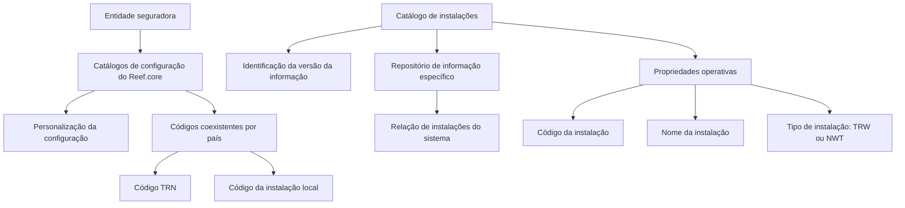

# Definição do Catálogo de Instalações do Reef.core

## 1. Metadados do Documento
- **Arquivo de Origem:** Nome do arquivo não identificado no conteúdo fornecido
- **Tipo de Documento:** Especificação Técnica / Documento Funcional
- **Domínio / Sistema:** Reef.core
- **Público-Alvo:** Equipes funcionais, desenvolvedores, arquitetos e responsáveis pela configuração do sistema
- **Data/Versão Identificada:** Não identificada

---

## 2. Resumo Executivo & Contexto de Negócio

O documento define o catálogo de instalações no âmbito do sistema Reef.core. A finalidade principal desse catálogo é identificar a versão das informações presentes nos catálogos de configuração do sistema que podem ser personalizados por uma entidade seguradora.

Funcionalmente, Reef.core permite codificar a relação de instalações do sistema em um repositório de informação específico. O catálogo de instalações atua, portanto, como uma referência para distinguir configurações padrão das configurações locais realizadas por países ou entidades seguradoras.

A definição de uma instalação inclui três propriedades operativas: código da instalação, nome da instalação e tipo de instalação. O código possui uma restrição explícita de coexistência: nos catálogos de configuração de Reef.core de cada país, somente podem coexistir registros com o código `TRN` e com o código da instalação local.

O documento também determina que as instalações existentes devem ser obrigatoriamente respeitadas, pois o catálogo de instalações integra o núcleo de Reef.core. Não há detalhamento adicional sobre contratos técnicos, interfaces, persistência, métodos HTTP, integrações ou exemplos completos de configuração.

---

## 3. Arquitetura, Componentes & Tecnologias Envolvidas

O conteúdo identifica os seguintes elementos funcionais:

- **Reef.core:** sistema no qual o catálogo de instalações é utilizado.
- **Catálogo de instalações:** catálogo utilizado para identificar versões de informação em catálogos configuráveis.
- **Repositório de informação específico:** local funcional onde Reef.core codifica a relação de instalações do sistema.
- **Catálogos de configuração de Reef.core por país:** catálogos nos quais a coexistência de códigos de instalação é restringida.
- **Entidade seguradora:** entidade que pode personalizar os catálogos de configuração.
- **Código `TRN`:** código que pode coexistir com o código da instalação local.
- **Tipos de instalação `TRW` e `NWT`:** valores possíveis para a propriedade de tipo de instalação, conforme a evolução da instalação.



**Nota de Análise:** o documento não descreve tecnologias de implementação, banco de dados, APIs, contratos JSON, protocolos de integração, URLs, ambientes ou mecanismos de versionamento técnico.

---

## 4. Regras de Negócio, Especificações Funcionais & Processos

### Finalidade do catálogo de instalações

1. O catálogo de instalações existe para permitir a identificação da versão da informação.
2. Essa identificação aplica-se aos catálogos de configuração do sistema Reef.core.
3. Os catálogos de configuração podem ser personalizados pela entidade seguradora.
4. Reef.core permite codificar a relação de instalações do sistema em um repositório de informação específico.

### Propriedades operativas da instalação

1. **Código da instalação**
   - Identifica o código da instalação.
   - Nos catálogos de configuração de Reef.core de cada país, somente podem coexistir registros com o código de instalação `TRN` e o código da instalação local.
   - A coexistência dos códigos permite distinguir se uma configuração realizada é padrão ou local.
   - O documento não determina explicitamente se `TRN` representa a configuração padrão ou se representa a configuração local; informa apenas que a combinação de `TRN` com o código local permite essa distinção.

2. **Nome da instalação**
   - Determina a descrição da instalação.

3. **Tipo de instalação**
   - Determina o tipo de instalação associado ao código.
   - No catálogo, essa propriedade possui o valor `TRW` ou `NWT`, dependendo da evolução que a instalação tenha tido.
   - O documento não define o significado expandido das siglas `TRW` e `NWT`, nem descreve os critérios de evolução que levam à atribuição de cada valor.

### Restrição de preservação do núcleo

1. As instalações existentes devem ser obrigatoriamente respeitadas.
2. A obrigatoriedade decorre do fato de o catálogo de instalações fazer parte do núcleo de Reef.core.
3. O documento não descreve procedimentos de criação, alteração, exclusão, aprovação ou migração de instalações.

---

## 5. Tabelas de Parâmetros, Ambientes e Estruturas de Dados

| Item / Parâmetro | Descrição / Função | Tipo / Valores / Formato | Ambiente / Observações |
| :--- | :--- | :--- | :--- |
| Catálogo de instalações | Permite identificar a versão da informação nos catálogos de configuração personalizáveis. | Catálogo funcional | Parte do núcleo de Reef.core. |
| Repositório de informação específico | Repositório no qual Reef.core codifica a relação de instalações do sistema. | Repositório de informação | Estrutura técnica não detalhada. |
| Código da instalação | Identifica o código de uma instalação. | Código | Nos catálogos de configuração por país, pode coexistir com `TRN` e com o código da instalação local. |
| Código `TRN` | Código de instalação explicitamente permitido na coexistência de registros. | Valor literal: `TRN` | Utilizado junto ao código da instalação local para distinguir configuração padrão de configuração local; o mapeamento individual de cada código não é definido. |
| Código da instalação local | Código associado à instalação local. | Código | Pode coexistir com o código `TRN` nos catálogos de configuração de Reef.core de cada país. |
| Nome da instalação | Determina a descrição da instalação. | Texto descritivo | Não há regra de formato, tamanho ou obrigatoriedade informada. |
| Tipo de instalação | Determina o tipo associado ao código da instalação. | `TRW` ou `NWT` | O valor depende da evolução da instalação. |
| `TRW` | Valor possível do tipo de instalação. | Valor literal: `TRW` | Significado não detalhado no documento. |
| `NWT` | Valor possível do tipo de instalação. | Valor literal: `NWT` | Significado não detalhado no documento. |
| Catálogos de configuração por país | Catálogos de Reef.core sujeitos à regra de coexistência de códigos. | Catálogo de configuração | Podem ser personalizados pela entidade seguradora. |
| Instalações existentes | Registros de instalação já presentes no catálogo. | Registros do catálogo | Devem ser obrigatoriamente respeitados por integrarem o núcleo de Reef.core. |

---

## 6. Bateria de Perguntas & Respostas para RAG (FAQ Sintético)

### P1: Qual é a finalidade do catálogo de instalações no Reef.core?
**R:** O catálogo de instalações permite identificar a versão da informação nos catálogos de configuração de Reef.core que podem ser personalizados por uma entidade seguradora.

### P2: Onde o Reef.core codifica a relação de instalações do sistema?
**R:** O Reef.core possui a possibilidade funcional de codificar a relação de instalações do sistema em um repositório de informação específico. O documento não detalha a tecnologia, localização ou estrutura desse repositório.

### P3: Quais propriedades compõem a definição de uma instalação no catálogo?
**R:** A definição de uma instalação possui três propriedades operativas: código da instalação, nome da instalação e tipo de instalação.

### P4: Qual é a função do código da instalação?
**R:** O código da instalação identifica o código de uma instalação dentro do catálogo de instalações de Reef.core.

### P5: Quais códigos de instalação podem coexistir nos catálogos de configuração de Reef.core de um país?
**R:** Nos catálogos de configuração de Reef.core de cada país, somente podem coexistir registros com o código de instalação `TRN` e o código da instalação local.

### P6: Por que o código `TRN` e o código da instalação local podem coexistir?
**R:** A coexistência do código `TRN` com o código da instalação local permite distinguir se a configuração realizada nos catálogos de configuração de Reef.core é padrão ou local. O documento não define qual dos dois códigos corresponde individualmente a cada classificação.

### P7: O que representa o nome da instalação?
**R:** O nome da instalação determina a descrição da instalação. O documento não informa regras de preenchimento, formato, tamanho máximo ou idioma da descrição.

### P8: Quais valores são permitidos para o tipo de instalação?
**R:** No catálogo de instalações, o tipo de instalação possui o valor `TRW` ou `NWT`, dependendo da evolução que a instalação tenha tido.

### P9: O documento explica o significado das siglas TRW e NWT?
**R:** Não. O documento informa que `TRW` e `NWT` são valores possíveis para o tipo de instalação, mas não expande as siglas nem define os critérios de evolução associados a cada valor.

### P10: As instalações existentes no catálogo podem ser alteradas ou removidas livremente?
**R:** Não há autorização para alteração ou remoção livre no conteúdo fornecido. O documento estabelece que as instalações existentes devem ser obrigatoriamente respeitadas porque o catálogo de instalações faz parte do núcleo de Reef.core.

### P11: O catálogo de instalações é um elemento periférico ou central do Reef.core?
**R:** O catálogo de instalações é parte do núcleo de Reef.core. Essa condição fundamenta a obrigatoriedade de respeitar as instalações existentes.

### P12: O documento descreve APIs ou contratos técnicos para consultar o catálogo de instalações?
**R:** Não. O conteúdo não detalha métodos HTTP, endpoints, contratos JSON, modelos de persistência, integrações ou mecanismos técnicos de consulta ao catálogo.

---

## 7. Glossário de Termos, Siglas & Conceitos-Chave

- **Reef.core:** Sistema no qual o catálogo de instalações é utilizado.
- **Catálogo de instalações:** Catálogo de Reef.core utilizado para identificar versões de informação em catálogos de configuração personalizáveis.
- **Catálogo de configuração:** Catálogo de configuração do sistema Reef.core que pode ser personalizado por uma entidade seguradora.
- **Entidade seguradora:** Entidade que pode personalizar os catálogos de configuração do sistema.
- **Instalação:** Elemento codificado no catálogo de instalações por meio de código, nome e tipo.
- **Código da instalação:** Propriedade que identifica uma instalação.
- **Instalação local:** Instalação identificada por um código local que pode coexistir com o código `TRN`.
- **TRN:** Código de instalação citado como coexistente com o código da instalação local nos catálogos de configuração por país.
- **TRW:** Valor possível para o atributo tipo de instalação; significado não definido no documento.
- **NWT:** Valor possível para o atributo tipo de instalação; significado não definido no documento.
- **Tipo de instalação:** Atributo que determina o tipo associado ao código da instalação, com valores `TRW` ou `NWT`.
- **Repositório de informação específico:** Repositório mencionado como local de codificação da relação de instalações do sistema.

---

## 8. Notas Críticas, Riscos & Limitações

- O catálogo de instalações integra o núcleo de Reef.core; portanto, as instalações existentes devem ser obrigatoriamente respeitadas.
- A alteração indevida de instalações existentes pode afetar uma estrutura considerada central para Reef.core, embora o documento não detalhe impactos técnicos ou operacionais específicos.
- O documento não define o significado das siglas `TRN`, `TRW` e `NWT` além dos papéis explicitamente descritos.
- O documento não informa critérios objetivos para determinar quando uma instalação deve receber o tipo `TRW` ou `NWT`.
- O documento não descreve o modelo de dados, a estrutura do repositório, chaves, validações, permissões, APIs, integrações, ambientes ou procedimentos operacionais.
- O exemplo citado ao final do documento não possui conteúdo disponível na extração fornecida.
- A referência a “Definición Programas” aparece como vínculo recomendado, mas o conteúdo desse documento vinculado não foi fornecido.

---

## 9. Conteúdo Bruto Estruturado (Referência Fiel)

```text
--- [PÁGINA 1 DE 2] ---

DEFINICIÓN de las INSTALACIONES de
Reef.core
Contexto
La finalidad básica de la existencia y uso del catálogo de instalaciones en el ámbito de Reef.core es
poder identificar la versión de la información en aquellos catálogos de configuración del sistema que
permiten su personalización por parte de la entidad aseguradora.
Objetivo
Funcionalmente, Reef.core cuenta con la posibilidad de codificar la relación de instalaciones del
Sistema en un repositorio de información específico.
Propiedades Operativas
Propiedades Operativas
Código de la Instalación
Esta propiedad de la definición identifica el código de la instalación.
En los catálogos de configuración de Reef.core de los países únicamente podrán coexistir
registros con el código de instalación TRN y el código de la instalación local, distinguiendo así si
la configuración realizada es la estándar o local.
 /
 CF
Home Solutions APIs Documentation Zeus
EN


--- [PÁGINA 2 DE 2] ---

Nombre de la Instalación
Esta propiedad determina la descripción de la instalación.
Tipo de instalación
Este último atributo determina el tipo de Instalación asociado al código.
En este catálogo, el valor de esta propiedad tendrá el valor TRW o NWT dependiendo de la
evolución que haya tenido la instalación.
Vínculos
Relación de Directrices y Documentos funcionales cuya lectura recomendada para evitar que la
interpretación aislada del presente documento pueda conducir a error.
Definición Programas
Preguntas frecuentes
(1) ¿Existe alguna restricción que tenga que ser tomada en cuenta en el uso y definición del Catálogo
de instalaciones de Reef.core?
Se han de respetar obligatoriamente las instalaciones existentes por ser el catálogo parte del
núcleo de Reef.core.
Ejemplo:
```
