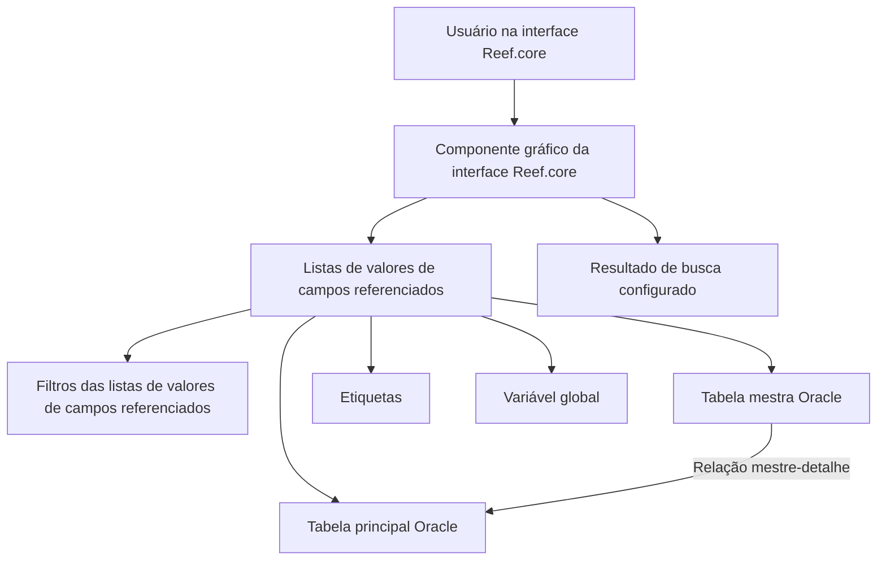

# Definição das Listas de Valores de Campos Referenciados no Reef.core

## 1. Metadados do Documento
- **Arquivo de Origem:** `Não identificado`
- **Tipo de Documento:** `Especificação Técnica`
- **Domínio / Sistema:** `Reef.core`
- **Público-Alvo:** `Equipes de tecnologia e usuários responsáveis pela configuração de catálogos do Reef.core`
- **Data/Versão Identificada:** `Não identificada`

---

## 2. Resumo Executivo & Contexto de Negócio

O documento define o catálogo de **listas de valores de campos referenciados** do Reef.core. O catálogo atende cenários em que dados codificados são armazenados em entidades Oracle separadas e precisam ser apresentados pela interface gráfica como listas de valores.

No Reef.core, dados capturados podem ser de formato livre ou codificados. Quando o número de valores possíveis de um dado codificado é objetivamente grande, as equipes de tecnologia criam entidades separadas na base de dados para registro e armazenamento. Quando a quantidade de valores é pequena, os valores podem ser compartilhados nos repositórios de informação “listas de valores” e “opções das listas de valores”.

As listas de valores de campos referenciados são necessárias quando registros de uma entidade separada precisam ser filtrados segundo critérios variáveis. Para isso, o Reef.core possui os repositórios “listas de valores de campos referenciados” e “filtros das listas de valores de campos referenciados”, permitindo que o componente gráfico da interface conforme e apresente adequadamente o resultado da busca.

A especificação descreve as propriedades operacionais usadas para identificar a companhia, a instalação, a tabela Oracle principal, tabelas mestras, colunas, tipos de dados, visibilidade, filtros, ordenação e operadores relacionais. Também estabelece restrições sobre registros associados à instalação de núcleo `TRN`.

---

## 3. Arquitetura, Componentes & Tecnologias Envolvidas

| Componente / Conceito | Função descrita |
| :--- | :--- |
| Reef.core | Sistema que mantém catálogos de configuração e apresenta listas de valores na interface. |
| Listas de valores | Repositório para valores codificados quando a quantidade de valores possíveis é pequena. |
| Opções das listas de valores | Repositório complementar das listas de valores. |
| Listas de valores de campos referenciados | Repositório próprio que registra a relação de possíveis listas de valores baseadas em entidades separadas. |
| Filtros das listas de valores de campos referenciados | Repositório para configurar critérios variáveis usados na filtragem de registros. |
| Entidade Oracle / tabela principal | Entidade que contém as informações da lista de valores. |
| Tabela mestra | Tabela que compõe, com a tabela principal, uma sentença mestre-detalhe (`master-detail`). |
| Componente gráfico da interface Reef.core | Componente que conforma, visualiza, filtra e pode ordenar os resultados da lista de valores. |
| Instalação `TRN` | Instalação do núcleo do Reef.core; suas listas de valores não podem ser alteradas. |
| Etiquetas | Identificadas internamente pela dupla Código do Módulo + Código da Etiqueta. |
| Variável global | Variável associada ao valor da coluna da tabela na lista de valores. |



**Nota de Análise:** O documento menciona entidades e tabelas Oracle, mas não especifica nomes de tabelas, esquemas, sentenças SQL, métodos HTTP, contratos JSON, versões de Oracle ou ambientes de execução.

---

## 4. Regras de Negócio, Especificações Funcionais & Processos

### 4.1 Contexto de dados codificados

1. Os programas Reef.core capturam dados de livre formato e dados codificados.
2. Quando o número de valores possíveis de um dado codificado é objetivamente grande, as equipes de tecnologia normalmente criam entidades separadas na base de dados para registro e armazenamento.
3. Quando o número de valores possíveis é pequeno, os valores podem ser incorporados e armazenados de forma compartilhada nos repositórios “listas de valores” e “opções das listas de valores”.
4. Quando uma informação está armazenada em uma entidade separada, pode ser necessário filtrar seus registros por critérios mutáveis ou variáveis.
5. Os critérios variáveis devem ser configurados nos repositórios “listas de valores de campos referenciados” e “filtros das listas de valores de campos referenciados”.
6. A configuração permite que o componente gráfico da interface Reef.core conforme e visualize corretamente o resultado da busca.

### 4.2 Regras de instalação e imutabilidade

1. O atributo **Compañía** contém o código da companhia sobre a qual está sendo realizada a definição da lista de valores de campos referenciados.
2. O **Código de la instalación** identifica a instalação associada à lista de valores de campos referenciados.
3. Quando o valor da instalação na configuração da lista corresponde à instalação do núcleo, `TRN`, as listas de valores não podem ser alteradas sob nenhuma circunstância.
4. Nos catálogos de configuração do Reef.core que podem ser personalizados pelos países, incluindo este catálogo, somente podem coexistir registros com:
   - código de instalação `TRN`; e
   - código da instalação local.
5. A coexistência entre registros `TRN` e registros locais distingue a configuração padrão da configuração local.
6. A relação de listas de valores `TRN` deve ser obrigatoriamente respeitada por fazer parte do núcleo do Reef.core.

### 4.3 Regras de versão e ordenação

1. A **Versão de la lista de valores** identifica a versão da lista de valores de campos referenciados para uma determinada tabela.
2. Uma mesma tabela pode ter diferentes listas de valores ou diferentes critérios de busca.
3. O valor da versão deve ser um consecutivo iniciado em `1`.
4. O **Orden tabla** determina a ordem da tabela ou das tabelas consideradas para compor a sentença de obtenção da informação.
5. O valor de **Orden tabla** deve ser um número inteiro consecutivo iniciado em `1`.
6. O **Orden columna** determina a ordem da coluna considerada na lista de valores de campos referenciados.
7. O valor de **Orden columna** deve ser um número inteiro consecutivo iniciado em `1`.

### 4.4 Regras de tabelas, atributos e apresentação

1. A **Tabla principal** determina o nome da entidade Oracle que contém a informação da lista de valores.
2. A **Tabla Maestra** identifica o código da tabela mestra que compõe uma sentença mestre-detalhe com a tabela principal.
3. O **Atributo de la tabla** identifica o atributo, ou coluna Oracle, que deve aparecer na lista de valores de campos referenciados.
4. A **Tipología del Atributo de la tabla** determina o tipo de dado da coluna apresentada na lista, incluindo:
   - `C` para caracteres;
   - `F` para datas;
   - `N` para valores numéricos.
5. A **Longitud visualizada** determina o comprimento do atributo que o componente gráfico deve tomar e apresentar na lista.
6. A propriedade **Función Oracle?** determina se o atributo da tabela é uma função de grupo Oracle.
7. Se o atributo for uma função de grupo Oracle, o nome do atributo deve referenciar o tipo da função, incluindo exemplos como:
   - `SUM` para operações de adição;
   - `MIN` para determinar o valor mínimo;
   - `MAX` para determinar o valor máximo.

### 4.5 Regras de etiquetas, visibilidade, filtro e ordenação

1. O **Código del Módulo** identifica o código do módulo Reef.core conforme os valores possíveis existentes na tabela mestra do núcleo Reef.core.
2. O **Código de la etiqueta** determina o identificador da etiqueta.
3. A dupla **Código del Módulo + Código de la Etiqueta** constitui a chave interna das etiquetas.
4. A **Variable Global** identifica a variável global associada ao valor da coluna da tabela na lista de valores.
5. A propriedade **Visible?** determina se o atributo de uma tabela será visível na lista de valores de campos referenciados e no componente gráfico da interface Reef.core.
6. A propriedade **Filtro?** indica se a coluna exibida na lista pode ser filtrada no componente gráfico da interface Reef.core.
7. A propriedade **Ordenación?** determina se o conjunto de registros da lista deve ser apresentado ordenado pelo atributo da tabela.

### 4.6 Operadores relacionais disponíveis

A propriedade **Operador Relacional** aplica-se quando o atributo da tabela é visível e pode ser usado como filtro na lista de valores de campos relacionados. Essa propriedade define o operador considerado na interação do usuário com a interface Reef.core ao capturar um valor.

| Operador | Significado |
| :--- | :--- |
| `=` | Igual |
| `!=` | Diferente |
| `<` | Menor |
| `<=` | Menor ou igual |
| `>` | Maior |
| `>=` | Maior ou igual |
| `L` | Como |
| `B` | Entre |

---

## 5. Tabelas de Parâmetros, Ambientes e Estruturas de Dados

| Item / Parâmetro | Descrição / Função | Tipo / Valores / Formato | Ambiente / Observações |
| :--- | :--- | :--- | :--- |
| Compañía | Código da companhia para a qual a lista é definida. | Código de companhia. | Aplicável à definição da lista de valores de campos referenciados. |
| Código de la instalación | Identifica a instalação associada à lista. | Código de instalação. | Se for `TRN`, a lista não pode ser alterada. |
| Tabla principal | Nome da entidade Oracle que contém a informação da lista. | Nome de entidade Oracle. | Nenhum nome concreto de entidade foi informado. |
| Versión de la lista de valores | Identifica a versão da lista para uma tabela. | Consecutivo iniciado em `1`. | Uma tabela pode ter listas ou critérios de busca distintos. |
| Orden tabla | Ordem da tabela ou tabelas usadas para compor a sentença de obtenção da informação. | Número inteiro consecutivo iniciado em `1`. | Aplicável à composição da sentença de obtenção. |
| Tabla Maestra | Código da tabela mestra associada à tabela principal. | Código de tabela mestra. | Forma uma sentença mestre-detalhe com a tabela principal. |
| Orden columna | Ordem da coluna considerada na lista. | Número inteiro consecutivo iniciado em `1`. | Aplicável às colunas da lista de valores. |
| Atributo de la tabla | Coluna Oracle que deve aparecer na lista. | Atributo / coluna Oracle. | Pode ser função de grupo Oracle. |
| Tipología del Atributo de la tabla | Tipo de dado da coluna exibida. | `C` = caracteres; `F` = datas; `N` = valores numéricos. | O documento usa reticências após os exemplos, sem detalhar outros códigos. |
| Longitud visualizada | Comprimento do atributo que a interface deve apresentar. | Comprimento visual. | Usado pelo componente gráfico da interface. |
| Función Oracle? | Indica se o atributo é função de grupo Oracle. | Sim ou não; exemplos: `SUM`, `MIN`, `MAX`. | Caso afirmativo, o nome do atributo deve referenciar a função. |
| Código del Módulo | Código do módulo Reef.core. | Código existente na tabela mestra do núcleo Reef.core. | Compõe a chave interna das etiquetas. |
| Código de la etiqueta | Identificador da etiqueta. | Código de etiqueta. | Compõe a chave interna das etiquetas. |
| Código del Módulo + Código de la Etiqueta | Chave interna das etiquetas. | Dupla de códigos. | Regra explícita do documento. |
| Variable Global | Variável global associada ao valor da coluna. | Variável global. | Associada ao valor da coluna presente na lista. |
| Visible? | Indica se o atributo é mostrado na lista e na interface. | Indicador de visibilidade. | Afeta a exibição pelo componente gráfico do Reef.core. |
| Filtro? | Indica se a coluna pode ser filtrada na interface. | Indicador de filtragem. | Relaciona-se à filtragem pelo componente gráfico. |
| Ordenación? | Indica se os registros devem ser exibidos ordenados pelo atributo. | Indicador de ordenação. | Aplica-se ao conjunto de registros da lista. |
| Operador Relacional | Operador considerado na captura de valor pelo usuário. | `=`, `!=`, `<`, `<=`, `>`, `>=`, `L`, `B`. | Aplicável quando o atributo é visível e filtrável. |
| Instalação `TRN` | Instalação do núcleo Reef.core. | Código `TRN`. | Configurações `TRN` devem ser respeitadas e não podem ser alteradas. |
| Instalação local | Código local da instalação. | Código da instalação local. | Pode coexistir com `TRN` em catálogos personalizáveis pelos países. |

---

## 6. Bateria de Perguntas & Respostas para RAG (FAQ Sintético)

### P1: O que são listas de valores de campos referenciados no Reef.core?
**R:** São listas configuradas em um repositório próprio do Reef.core para apresentar valores armazenados em entidades separadas da base de dados. Elas são usadas especialmente quando os registros dessas entidades precisam ser filtrados segundo critérios mutáveis ou variáveis.

### P2: Quando o Reef.core utiliza entidades separadas para dados codificados?
**R:** Quando o número de valores possíveis de um dado codificado é objetivamente grande, as equipes de tecnologia normalmente criam entidades separadas na base de dados para registrar e armazenar esses valores.

### P3: Quando devem ser usadas as listas de valores e opções das listas de valores comuns?
**R:** Quando o número de valores possíveis de um dado codificado é pequeno, os valores podem ser incorporados, compartilhados e armazenados nos repositórios “listas de valores” e “opções das listas de valores”.

### P4: O que acontece se a lista de valores de campos referenciados estiver associada à instalação TRN?
**R:** Se a instalação configurada for `TRN`, correspondente à instalação do núcleo Reef.core, as listas de valores não podem ser alteradas sob nenhuma circunstância.

### P5: Como deve ser definida a versão de uma lista de valores para uma tabela?
**R:** A versão identifica a lista de valores de campos referenciados para a tabela em questão. Como a mesma tabela pode ter listas de valores ou critérios de busca diferentes, a versão deve ser um consecutivo iniciado em `1`.

### P6: Qual é a função da tabela principal e da tabela mestra?
**R:** A tabela principal determina a entidade Oracle que contém a informação da lista de valores. A tabela mestra identifica o código da tabela que compõe, com a tabela principal, uma sentença mestre-detalhe (`master-detail`).

### P7: Quais tipos de dados são explicitamente citados na tipologia do atributo de tabela?
**R:** O documento cita `C` para caracteres, `F` para datas e `N` para valores numéricos. O texto usa reticências após esses exemplos e não descreve outros códigos de tipologia.

### P8: Como o Reef.core trata atributos que representam funções de grupo Oracle?
**R:** A propriedade “Función Oracle?” determina se o atributo é uma função de grupo Oracle. Quando for, o nome do atributo deve referenciar o tipo de função, como `SUM` para adição, `MIN` para valor mínimo e `MAX` para valor máximo.

### P9: Como é formada a chave interna das etiquetas no Reef.core?
**R:** A chave interna das etiquetas é formada pela dupla **Código del Módulo + Código de la Etiqueta**.

### P10: Quando o operador relacional é aplicável a uma coluna?
**R:** O operador relacional é aplicável quando o atributo da tabela é visível e suscetível de ser usado como filtro na lista de valores de campos relacionados. O operador define a interação do usuário ao capturar um valor na interface Reef.core.

### P11: Quais operadores relacionais podem ser configurados?
**R:** Os operadores disponíveis são: `=` para igual, `!=` para diferente, `<` para menor, `<=` para menor ou igual, `>` para maior, `>=` para maior ou igual, `L` para como e `B` para entre.

### P12: Quantas instalações podem coexistir para uma companhia nos catálogos personalizáveis do Reef.core?
**R:** Nos catálogos de configuração do Reef.core que os países podem personalizar, incluindo este catálogo, somente podem coexistir registros com o código da instalação `TRN` e o código da instalação local. Essa distinção separa a configuração padrão da configuração local.

---

## 7. Glossário de Termos, Siglas & Conceitos-Chave

- **Reef.core:** Sistema que mantém os catálogos e configurações descritos no documento.
- **Lista de Valores:** Repositório para dados codificados quando há uma quantidade pequena de valores possíveis.
- **Opções das Listas de Valores:** Repositório relacionado às listas de valores.
- **Lista de Valores de Campos Referenciados:** Configuração para listas construídas a partir de dados de entidades separadas e sujeitas a critérios de busca.
- **Filtros das Listas de Valores de Campos Referenciados:** Repositório de critérios variáveis usados para filtrar registros.
- **TRN:** Código da instalação do núcleo Reef.core.
- **Tabela Principal:** Entidade Oracle que contém a informação da lista de valores.
- **Tabela Mestra:** Tabela que compõe uma sentença mestre-detalhe com a tabela principal.
- **Master-detail:** Relação mestre-detalhe entre a tabela mestra e a tabela principal.
- **Atributo da Tabela:** Coluna Oracle que pode aparecer na lista de valores.
- **`C`:** Tipologia de atributo correspondente a caracteres.
- **`F`:** Tipologia de atributo correspondente a datas.
- **`N`:** Tipologia de atributo correspondente a valores numéricos.
- **Função de Grupo Oracle:** Função aplicada a atributos, com exemplos `SUM`, `MIN` e `MAX`.
- **`SUM`:** Função Oracle para operações de adição.
- **`MIN`:** Função Oracle para determinar o valor mínimo.
- **`MAX`:** Função Oracle para determinar o valor máximo.
- **Código do Módulo:** Código do módulo Reef.core segundo valores existentes na tabela mestra do núcleo.
- **Código da Etiqueta:** Identificador de uma etiqueta.
- **Variável Global:** Variável associada ao valor de uma coluna da tabela presente na lista de valores.
- **Operador Relacional:** Operador usado na interação de filtro da interface Reef.core.

---

## 8. Notas Críticas, Riscos & Limitações

- As listas associadas à instalação `TRN` não podem ser alteradas sob nenhuma circunstância.
- A relação de listas de valores `TRN` deve ser obrigatoriamente respeitada por integrar o núcleo Reef.core.
- Para catálogos personalizáveis pelos países, somente podem coexistir registros `TRN` e registros da instalação local.
- Os valores de versão, ordem de tabela e ordem de coluna devem iniciar em `1` e seguir uma sequência consecutiva.
- O documento não fornece nomes concretos de tabelas Oracle, tabelas mestras, colunas, companhias, instalações locais, módulos, etiquetas ou variáveis globais.
- O documento não detalha a estrutura dos repositórios, as sentenças Oracle produzidas, mecanismos de persistência, controles de acesso, APIs, métodos HTTP ou contratos de integração.
- **Nota de Análise:** O documento cita filtros de listas de valores de campos referenciados, mas não descreve a estrutura, os atributos ou a lógica de configuração desses filtros.
- **Nota de Análise:** O documento apresenta exemplos de tipologias `C`, `F` e `N`, mas não fornece o catálogo completo de tipologias disponíveis.

---

## 9. Conteúdo Bruto Estruturado (Referência Fiel)

```text
--- [PÁGINA 1 DE 5] ---

DEFINICIÓN de las LISTAS de VALORES de
Campos Referenciados
Contexto
¿Qué es una Lista de Valores?
En los programas de Reef.core se han de capturar datos: datos de libre formato y datos codificados.
Si el número de posibles valores de un dato codificado es objetivamente 'grande', los equipos de
tecnología normalmente suelen crear entidades separadas en la base de datos para su registro y
almacenamiento mientras que si el número de posibles valores de un dato es pequeño se pueden
juntar, incorporar y almacenar de manera compartida en dos repositorios de información de
Reef.core creados al efecto para ello: "listas de valores" y "opciones de las listas de valores".
¿Qué es una Lista de Valores de campos referenciados?
En el caso que la información esté almacenada en la base de datos en una entidad separada en
ocasiones es necesario filtrar los registros que contenga de acuerdo con criterios cambiantes /
criterios variables, en cuyo caso se tendrán que configurar dichos criterios en dos repositorios de
información de Reef.core creados al efecto para ello: "listas de valores de campos referenciados" y
"filtros de las listas de valores de campos referenciados" para que el componente gráfico de la
interfaz conforme y visualice adecuadamente el resultado de la búsqueda.
En este documento haremos referencia a la identificación de los datos que van a conformar las listas
de valores de campos referenciados.
Objetivo
 / 
 CF
Home Solutions APIs Documentation Zeus
EN


--- [PÁGINA 2 DE 5] ---

Funcionalmente, Reef.core cuenta con la posibilidad de registrar la relación de posibles listas de
valores de campos referenciados en un repositorio de información propio.
Propiedades Operativas
Propiedades Operativas
Compañía
Este atributo del catálogo contiene el código de la compañía sobre la que se está realizando la
definición de la lista de valores de campos referenciados.
Código de la instalación
Esta propiedad de la definición identifica el código de la instalación asociada a la lista de valores de
campos referenciados.
Si el valor de la instalación en la configuración de la lista es la correspondiente a la instalación del
núcleo, instalación (TRN) las listas de valores no podrán alterarse bajo ningún concepto.
Tabla principal
Determina el nombre de la entidad Oracle que contiene la información de la lista de valores.
Versión de la lista de valores
Este atributo identifica la versión de la lista de valores de campos referenciados para la tabla en
cuestión.
Puesto que una misma tabla puede tener diferentes listas de valores o criterios de búsqueda
sobre ella, el valor de esta propiedad debe ser un consecutivo que inicie con el valor 1.
Orden tabla
Determina el orden de la tabla o tablas que se deben considerar para conformar la sentencia de
obtención de la información.
Esta propiedad debe contener un número entero consecutivo que inicia con el valor 1.
Consejo:
Consejo:


--- [PÁGINA 3 DE 5] ---

Tabla Maestra
Identifica el código de tabla maestra que conforma la sentencia entre ella y la tabla principal de la
lista de valores en forma maestro-detalle ó 'master-detail'.
Orden columna
Determina el orden de la columna que se ha de considerar en la lista de valores de campos
referenciados.
Esta propiedad debe contener un número entero consecutivo que inicia con el valor 1.
Atributo de la tabla
Identifica el atributo (columna Oracle) de la tabla que debe aparecer en la lista de valores de campos
referenciados.
Tipología del Atributo de la tabla
Determina si el tipo de dato de la columna de la tabla que aparece en la lista de valores de campos
referenciados contiene C caracteres, F fechas, N valores numéricos...
Longitud visualizada
Esta propiedad determina la longitud del atributo de la tabla que el componente gráfico de la interfaz
debe tomar y visualizar en la lista de valores de campos referenciados.
Función Oracle?
Esta propiedad determina si el atributo de la tabla es o no una función de grupo Oracle en cuyo caso,
de ser afirmativo, en el nombre del atributo de la tabla se ha de referenciar el tipo de función: (SUM
para operaciones de adición, MIN para determinar el valor mínimo, MAX para determinar el valor
máximo, ...).
Código del Módulo
Esta propiedad de la definición identifica el código del módulo de Reef.core de acuerdo con los
posibles valores existentes en la tabla maestra existente en el núcleo de Reef.core.
Código de la etiqueta
Esta propiedad del catálogo determina el identificador de la etiqueta.
Consejo:


--- [PÁGINA 4 DE 5] ---

La dupla Código del Módulo + Código de la Etiqueta conforma la clave interna de las etiquetas.
Variable Global
Identifica la variable global asociada al valor de la columna de la tabla en la lista de valores.
Visible?
Determina si el atributo de la tabla va a ser visible o no en la lista de valores de campos
referenciados y en el componente gráfico de la interfaz de Reef.core.
Filtro?
Indica si la columna de la tabla que aparece en la lista de valores es susceptible de ser filtrada o no
en el componente gráfico de la interfaz de Reef.core.
Ordenación?
Determina si el conjunto de registros de la lista de valores de campos referenciados se debe o no
visualizar de manera ordenada por el atributo de la tabla.
Operador Relacional
Caso que el Atributo de la tabla sea visible y susceptible de utilizarse como filtro en la lista de valores
de campos relacionados, esta propiedad del catálogo de configuración identifica el tipo de operador
relacional que se va a contemplar en la interacción del Usuario con la interfaz de Reef.core al
capturar un valor determinado.
Sus posibles valores son
(=) Igual
(!=) Distinto
(<) Menor
(<=) Menor o igual
(>) Mayor
(>=) Mayor o igual
(L) Como
(B) Entre
Vínculos


--- [PÁGINA 5 DE 5] ---

Relación de Directrices y Documentos funcionales cuya lectura recomendada para evitar que la
interpretación aislada del presente documento pueda conducir a error.
Opciones de las Listas de Valores
Preguntas frecuentes
(1) ¿Existe alguna restricción que tenga que ser tomada en cuenta en el uso y definición del catálogo
de listas de valores de campos referenciados de Reef.core?
Se han de respetar obligatoriamente la relación de listas de valores TRN por ser parte del núcleo de
Reef.core.
(2) ¿Cuantas instalaciones pueden coexistir para una compañía en particular?
En general, en los catálogos de configuración de Reef.core que los países pueden personalizar
(entre los que se encuentra este), únicamente podrán coexistir registros con el código de instalación
TRN y el código de la instalación local, distinguiendo así si la configuración realizada es la estándar
o local.
```
