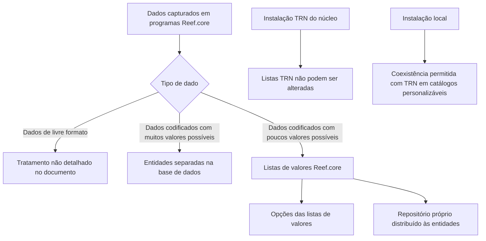

# Definição das Listas de Valores do Reef.core

## 1. Metadados do Documento
- **Arquivo de Origem:** Não identificado — conteúdo bruto fornecido no prompt
- **Tipo de Documento:** Especificação Técnica / Procedimento Funcional
- **Domínio / Sistema:** Reef.core
- **Público-Alvo:** Desenvolvedores, Arquitetos, Analistas Funcionais e equipes de configuração
- **Data/Versão Identificada:** Não identificada

---

## 2. Resumo Executivo & Contexto de Negócio

O documento define o conceito e as propriedades de configuração das **listas de valores** do sistema Reef.core. Listas de valores são repositórios compartilhados para registrar valores codificados quando a quantidade de valores possíveis para determinado dado é pequena.

Para dados de livre formato, o documento não descreve regras específicas. Para dados codificados cujo número de possibilidades seja objetivamente grande, as equipes de tecnologia normalmente criam entidades separadas na base de dados para registro e armazenamento. Para conjuntos pequenos de valores codificados, Reef.core utiliza dois repositórios: **listas de valores** e **opções das listas de valores**.

Funcionalmente, Reef.core permite registrar a relação das possíveis listas de valores do sistema em um repositório próprio distribuído às entidades. A definição de cada lista envolve, entre outros atributos, companhia, código da instalação, idioma, código interno e denominação ou descrição.

O documento estabelece uma restrição crítica para listas associadas à instalação do núcleo, identificada pelo código **TRN**: essas listas não podem ser alteradas sob nenhuma circunstância. Também determina que, para catálogos de configuração personalizáveis pelos países, podem coexistir somente registros da instalação TRN e da instalação local de uma companhia.

---

## 3. Arquitetura, Componentes & Tecnologias Envolvidas

O documento não descreve arquitetura de infraestrutura, microsserviços, protocolos, banco de dados específico, APIs, URLs, tecnologias de implementação ou ambientes operacionais. O conteúdo descreve apenas uma estrutura funcional de configuração do Reef.core.

Os componentes funcionais explicitamente citados são:

| Componente | Função descrita |
| :--- | :--- |
| Reef.core | Sistema que mantém repositórios próprios de configuração e distribui listas de valores às entidades. |
| Listas de valores | Repositório compartilhado para conjuntos pequenos de dados codificados. |
| Opções das listas de valores | Repositório associado às listas de valores; citado como conteúdo relacionado, sem detalhamento estrutural. |
| Catálogo de configuração | Estrutura que contém propriedades como companhia, instalação, idioma, código e denominação da lista. |
| Instalação TRN | Instalação do núcleo do Reef.core; protege listas de valores contra alterações. |
| Instalação local | Instalação específica local que pode coexistir com TRN em catálogos personalizáveis por país. |



> **Nota de Análise:** O documento não detalha o mecanismo técnico de distribuição das listas de valores às entidades, nem o modelo físico de dados, contratos de API, métodos HTTP, autenticação ou operações de persistência.

---

## 4. Regras de Negócio, Especificações Funcionais & Processos

### 4.1 Classificação de dados capturados em programas Reef.core

Os programas de Reef.core capturam dois tipos de dados:

1. **Dados de livre formato**.
2. **Dados codificados**.

Para dados codificados com quantidade objetivamente grande de valores possíveis, as equipes de tecnologia normalmente criam entidades separadas na base de dados para registro e armazenamento.

Para dados codificados com pequeno número de valores possíveis, os valores podem ser reunidos, incorporados e armazenados de forma compartilhada em dois repositórios de Reef.core:

1. Listas de valores.
2. Opções das listas de valores.

### 4.2 Objetivo funcional das listas de valores

Reef.core possui a capacidade de registrar a relação das possíveis listas de valores do sistema em um repositório próprio. Esse repositório é distribuído às entidades.

### 4.3 Regras de definição da lista de valores

- Cada definição de lista de valores contém o código da companhia à qual a definição se aplica.
- Cada definição identifica o código da instalação associada à lista de valores.
- A propriedade de idioma identifica o idioma da denominação ou descrição da lista de valores.
- O código interno da lista de valores deve iniciar obrigatoriamente com a constante `TIP_`.
- A denominação da lista de valores representa sua designação ou descrição.
- A relação de listas de valores da instalação TRN deve ser obrigatoriamente respeitada, por fazer parte do núcleo de Reef.core.
- Quando uma lista estiver configurada para a instalação do núcleo, isto é, a instalação `TRN`, a lista de valores não poderá ser alterada sob nenhuma circunstância.
- Nos catálogos de configuração Reef.core que os países podem personalizar, incluindo o catálogo de listas de valores, somente podem coexistir registros com:
  - Código de instalação `TRN`; e
  - Código da instalação local.
- A coexistência entre registros `TRN` e registros de instalação local permite distinguir a configuração padrão da configuração local.

### 4.4 Processo funcional inferido a partir do conteúdo

1. Identificar se o dado a ser capturado é de livre formato ou codificado.
2. Para dados codificados, avaliar se a quantidade de valores possíveis é grande ou pequena.
3. Quando a quantidade for grande, utilizar entidades separadas na base de dados.
4. Quando a quantidade for pequena, definir a informação em listas de valores e opções das listas de valores de Reef.core.
5. Associar a definição à companhia e à instalação correspondente.
6. Informar o idioma da denominação ou descrição.
7. Criar um código de lista iniciado por `TIP_`.
8. Verificar se a lista pertence à instalação `TRN`.
9. Não alterar listas de valores associadas à instalação `TRN`.
10. Para configurações personalizáveis por país, manter apenas registros `TRN` e da instalação local.

---

## 5. Tabelas de Parâmetros, Ambientes e Estruturas de Dados

| Item / Parâmetro | Descrição / Função | Tipo / Valores / Formato | Ambiente / Observações |
| :--- | :--- | :--- | :--- |
| Companhia | Código da companhia sobre a qual é realizada a definição da lista de valores. | Código de companhia; formato não detalhado. | Atributo do catálogo. |
| Código da Instalação | Identifica a instalação associada à lista de valores. | Inclui `TRN` e código de instalação local. | Se for `TRN`, a lista não pode ser alterada. |
| Instalação TRN | Instalação correspondente ao núcleo do Reef.core. | Valor fixo citado: `TRN`. | A relação de listas TRN deve ser respeitada obrigatoriamente. |
| Instalação local | Código da instalação específica local. | Código não detalhado. | Pode coexistir com `TRN` em catálogos personalizáveis por país. |
| Idioma | Identifica o idioma da denominação ou descrição da lista de valores. | Exemplos: espanhol, inglês, turco. | Formato/códigos de idioma não detalhados. |
| Código da Lista de Valores | Identificador interno da lista de valores no catálogo de configuração. | Deve iniciar com `TIP_`. | Regra de programação existente do sistema. |
| Denominação da Lista de Valores | Nome ou descrição da lista de valores. | Texto; formato não detalhado. | Pode ser definido conforme o idioma informado. |
| Listas de valores | Repositório compartilhado para dados codificados com poucos valores possíveis. | Repositório funcional. | Distribuído às entidades pelo repositório próprio de Reef.core. |
| Opções das listas de valores | Repositório associado às listas de valores. | Estrutura não detalhada. | Citado como tema relacionado; seus atributos não são apresentados. |
| Dados codificados com muitos valores | Dados para os quais há quantidade objetivamente grande de valores possíveis. | Não especificado. | Normalmente armazenados em entidades separadas na base de dados. |
| Dados codificados com poucos valores | Dados para os quais há pequena quantidade de valores possíveis. | Não especificado. | Armazenados compartilhadamente em listas e opções de listas de valores. |

---

## 6. Bateria de Perguntas & Respostas para RAG (FAQ Sintético)

### P1: O que são listas de valores no Reef.core?
**R:** Listas de valores são repositórios de informação do Reef.core utilizados para reunir, incorporar e armazenar de forma compartilhada valores de dados codificados quando a quantidade de valores possíveis é pequena. O documento também cita as opções das listas de valores como o segundo repositório associado.

### P2: Quando um dado codificado deve utilizar uma entidade separada na base de dados em vez de uma lista de valores?
**R:** Quando o número de valores possíveis de um dado codificado for objetivamente grande, as equipes de tecnologia normalmente criam entidades separadas na base de dados para seu registro e armazenamento. O documento não estabelece um limite numérico para definir o que é considerado uma quantidade grande.

### P3: Qual é o objetivo funcional do catálogo de listas de valores do Reef.core?
**R:** O objetivo funcional é registrar a relação das possíveis listas de valores do sistema em um repositório próprio do Reef.core, que é distribuído às entidades.

### P4: Quais propriedades são identificadas na definição de uma lista de valores?
**R:** O documento identifica as propriedades Companhia, Código da Instalação, Idioma, Código da Lista de Valores e Denominação da Lista de Valores. Não são apresentados tipos técnicos, tamanhos de campo ou obrigatoriedade individual desses atributos.

### P5: Qual regra deve ser seguida para o código de uma lista de valores?
**R:** O código da lista de valores identifica internamente a lista no catálogo de configuração e deve iniciar com a constante `TIP_`, conforme as regras de programação existentes para o sistema.

### P6: O que acontece se a lista de valores estiver associada à instalação TRN?
**R:** Se o valor da instalação configurado para a lista for o da instalação do núcleo, identificada como `TRN`, a lista de valores não poderá ser alterada sob nenhuma circunstância.

### P7: Por que as listas de valores TRN devem ser respeitadas?
**R:** A relação de listas de valores `TRN` deve ser respeitada obrigatoriamente porque faz parte do núcleo do Reef.core.

### P8: Quantas instalações podem coexistir para uma companhia em catálogos Reef.core personalizáveis por país?
**R:** Podem coexistir somente registros com o código de instalação `TRN` e o código da instalação local. Essa regra é apresentada para os catálogos de configuração que os países podem personalizar, incluindo o catálogo de listas de valores.

### P9: Qual é a finalidade de coexistirem registros TRN e registros de instalação local?
**R:** A coexistência permite distinguir se a configuração realizada corresponde à configuração padrão, representada pela instalação `TRN`, ou à configuração local, representada pelo código da instalação local.

### P10: Quais idiomas são mencionados para a denominação ou descrição de uma lista de valores?
**R:** O atributo Idioma identifica o idioma no qual a denominação ou descrição da lista de valores foi definida. O documento apresenta como exemplos os idiomas espanhol, inglês e turco.

### P11: O documento define a estrutura dos registros de opções das listas de valores?
**R:** Não. O documento cita “Opções das Listas de Valores” como conteúdo relacionado e como um dos repositórios utilizados para dados codificados com poucos valores possíveis, mas não detalha seus campos, regras de validação ou relacionamento físico com as listas.

### P12: O documento informa APIs, banco de dados, URLs ou tecnologias para administrar listas de valores?
**R:** Não. O conteúdo não fornece métodos HTTP, contratos JSON, URLs, nomes de tabelas físicas, tecnologias de banco de dados, versões, portas ou mecanismos técnicos de administração e distribuição das listas de valores.

---

## 7. Glossário de Termos, Siglas & Conceitos-Chave

- **Reef.core:** Sistema mencionado no documento que dispõe de repositórios próprios para registrar e distribuir listas de valores às entidades.
- **Lista de valores:** Repositório compartilhado de Reef.core para valores de dados codificados com pequeno número de possibilidades.
- **Opções das listas de valores:** Repositório associado às listas de valores; não detalhado além de sua citação no documento.
- **Dado de livre formato:** Categoria de dado capturado pelos programas Reef.core; o documento não fornece regras adicionais para essa categoria.
- **Dado codificado:** Categoria de dado cujos valores são controlados por possibilidades predefinidas.
- **Catálogo de configuração:** Estrutura de configuração que contém atributos da definição de listas de valores.
- **TRN:** Código da instalação do núcleo do Reef.core. Listas vinculadas a essa instalação não podem ser alteradas.
- **Instalação local:** Instalação específica local que pode coexistir com a instalação `TRN` em catálogos personalizáveis por país.
- **`TIP_`:** Constante obrigatória que deve iniciar o código interno de uma lista de valores.

---

## 8. Notas Críticas, Riscos & Limitações

- **Imutabilidade de TRN:** Alterar listas associadas à instalação `TRN` viola uma regra explícita do documento, pois essas listas não podem ser alteradas sob nenhuma circunstância.
- **Risco de sobreposição de configuração:** A coexistência de registros é limitada a `TRN` e à instalação local. O documento não autoriza coexistência de códigos de instalações adicionais para uma mesma companhia em catálogos personalizáveis.
- **Restrição de nomenclatura:** Códigos que não começarem com `TIP_` não atendem à regra de programação declarada para o sistema.
- **Ausência de critério quantitativo:** O documento não estabelece um número objetivo de valores para decidir entre entidade separada em banco de dados e lista de valores.
- **Ausência de modelo técnico:** Não há detalhamento de modelo de dados, chaves, tipos de campo, integrações, APIs, controles de acesso, trilha de auditoria ou procedimento de publicação.
- **Ausência de detalhamento das opções:** O documento não especifica como as opções das listas de valores são identificadas, cadastradas, alteradas, relacionadas ou distribuídas.
- **Dependência documental:** O documento recomenda consultar diretrizes e documentos funcionais relacionados para evitar interpretações isoladas incorretas, mas não fornece a relação desses documentos.

---

## 9. Conteúdo Bruto Estruturado (Referência Fiel)

```text
--- [PÁGINA 1 DE 3] ---

DEFINICIÓN de las LISTAS de VALORES de
Reef.core
Contexto
¿Qué es una Lista de Valores?
En los programas de Reef.core se han de capturar datos: datos de libre formato y datos codificados.
Si el número de posibles valores de un dato codificado es objetivamente 'grande', los equipos de
tecnología normalmente suelen crear entidades separadas en la base de datos para su registro y
almacenamiento.
Ahora bien, si el número de posibles valores de un dato es pequeño se pueden juntar, incorporar y
almacenar de manera compartida en dos repositorios de información de Reef.core creados al efecto
para ello: "listas de valores" y "opciones de las listas de valores".
En este documento haremos referencia a la identificación de los datos que van a conformar las listas
de valores.
Objetivo
Funcionalmente, Reef.core cuenta con la posibilidad de registrar la relación de posibles listas de
valores del sistema en un repositorio de información propio que se distribuye a las entidades.
Propiedades Operativas
Propiedades Operativas
 /
 CF
Home Solutions APIs Documentation Zeus
EN


--- [PÁGINA 2 DE 3] ---

Compañía
Este atributo del catálogo contiene el código de la compañía sobre la que se está realizando la
definición de la lista de valores.
Código de la Instalación
Esta propiedad de la definición identifica el código de la instalación asociada a la lista de valores.
Si el valor de la instalación en la configuración de la lista es la correspondiente a la instalación del
núcleo, instalación (TRN) las listas de valores no podrán alterarse bajo ningún concepto.
Idioma
Esta propiedad identifica el idioma en el que está definida la denominación o descripción de la lista
de valores, como por ejemplo los idiomas español, inglés, turco,...
Código de la Lista de Valores
Esta propiedad del catálogo de configuración identifica internamente el código de la lista de valores
El código debe iniciar con la constante TIP_ de acuerdo con las reglas de programación existentes
para el sistema.
Denominación de la Lista de Valores
Esta propiedad contempla la denominación o descripción que tiene la lista de valores.
Vínculos
Relación de Directrices y Documentos funcionales cuya lectura recomendada para evitar que la
interpretación aislada del presente documento pueda conducir a error.
Opciones de las Listas de Valores
Preguntas frecuentes
(1) ¿Existe alguna restricción que tenga que ser tomada en cuenta en el uso y definición del catálogo
de listas de valores de Reef.core?
Ejemplo:


--- [PÁGINA 3 DE 3] ---

Se han de respetar obligatoriamente la relación de listas de valores TRN por ser parte del núcleo de
Reef.core.
(2) ¿Cuantas instalaciones pueden coexistir para una compañía en particular?
En general, en los catálogos de configuración de Reef.core que los países pueden personalizar
(entre los que se encuentra este), únicamente podrán coexistir registros con el código de instalación
TRN y el código de la instalación local, distinguiendo así si la configuración realizada es la estándar
o local.
```
