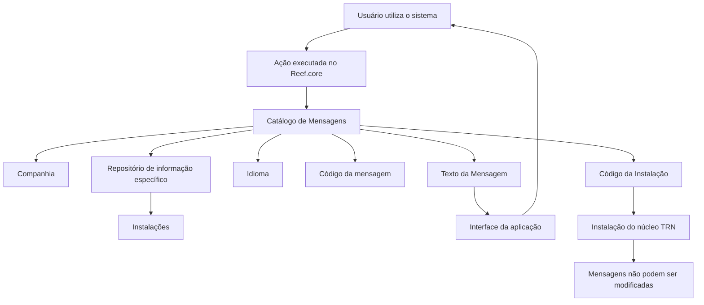

# Definição do Catálogo de Mensagens da Aplicação Reef.core

## 1. Metadados do Documento
- **Arquivo de Origem:** Não identificado no conteúdo fornecido
- **Tipo de Documento:** Especificação Técnica / Manual Funcional
- **Domínio / Sistema:** Reef.core; instalação do núcleo TRN
- **Público-Alvo:** Analistas funcionais, desenvolvedores, administradores do sistema e equipes responsáveis por configurações de instalações
- **Data/Versão Identificada:** Não identificada

---

## 2. Resumo Executivo & Contexto de Negócio

O documento define o contexto funcional do catálogo de mensagens da aplicação **Reef.core**. No âmbito descrito, uma mensagem representa o conteúdo que o sistema, como emissor ou comunicador, transmite ao usuário que utiliza a aplicação, identificado como receptor.

A finalidade do catálogo de mensagens é identificar, agrupar e organizar as mensagens que podem ser apresentadas como resultado das ações executadas pelos usuários. Dessa forma, o catálogo centraliza a definição dos textos apresentados pela interface da aplicação.

Funcionalmente, o Reef.core permite codificar a relação de mensagens em um repositório de informação específico. Esse repositório é entregue às instalações com o conteúdo necessário para o funcionamento correto do sistema.

A definição de cada mensagem considera companhia, código de instalação, idioma, código da mensagem e texto da mensagem. O texto exibido pela interface deve ser compatível com o idioma associado ao usuário que utiliza o sistema.

Existe uma restrição explícita para a instalação do núcleo, identificada como **TRN**: mensagens correspondentes a essa instalação não podem ser modificadas. O documento também determina que a propriedade **Marca de controle** está obsoleta, teve a funcionalidade descontinuada e não deve ser utilizada ou reutilizada para propósitos locais.

---

## 3. Arquitetura, Componentes & Tecnologias Envolvidas

| Componente / Conceito | Papel descrito no documento |
| :--- | :--- |
| Reef.core | Sistema no qual o catálogo de mensagens é utilizado. |
| Catálogo de Mensagens | Estrutura destinada a identificar, agrupar e organizar mensagens resultantes de ações do usuário. |
| Repositório de informação específico | Repositório no qual a relação de mensagens é codificada e entregue às instalações. |
| Instalação | Contexto identificado por código e associado às definições de mensagens. |
| Instalação do núcleo TRN | Instalação cujas mensagens possuem restrição de alteração. |
| Usuário | Receptor da mensagem exibida pela aplicação. |
| Sistema | Emissor ou comunicador da mensagem para o usuário. |
| Interface da aplicação | Camada que mostra o texto da mensagem no idioma associado ao usuário. |
| Companhia | Atributo que informa a companhia sobre a qual a definição da mensagem está sendo realizada. |
| Idioma | Atributo que identifica o idioma do texto da mensagem. |
| Marca de controle | Atributo obsoleto e descontinuado, que não deve ser usado. |



**Nota de Análise:** O documento não detalha tecnologias de implementação, bancos de dados, protocolos de integração, métodos HTTP, contratos JSON, servidores, URLs, versões de software ou fluxos de implantação.

---

## 4. Regras de Negócio, Especificações Funcionais & Processos

### 4.1 Finalidade do catálogo de mensagens

1. O catálogo de mensagens deve identificar os possíveis mensagens geradas como resultado de ações realizadas ou executadas pelo usuário.
2. O catálogo de mensagens deve agrupar os possíveis mensagens geradas no contexto do Reef.core.
3. O catálogo de mensagens deve organizar os possíveis mensagens geradas no contexto do Reef.core.
4. No modelo de comunicação apresentado, o sistema é o emissor ou comunicador.
5. O usuário que utiliza o sistema é o receptor da mensagem.
6. A relação de mensagens pode ser codificada em um repositório de informação específico.
7. O conteúdo do repositório de mensagens é entregue às instalações para suportar o correto funcionamento do sistema.

### 4.2 Regras para apresentação de mensagens

1. Cada definição de mensagem deve possuir um código de companhia.
2. Cada definição de mensagem deve possuir um código de instalação associado.
3. Cada definição de mensagem deve identificar o idioma no qual o texto foi definido.
4. O catálogo deve determinar um código para cada mensagem de texto.
5. O texto apresentado na interface deve corresponder ao idioma associado ao usuário que utiliza o sistema.
6. O documento cita como exemplos de idiomas espanhol, inglês e turco, sem estabelecer uma lista completa de idiomas permitidos.

### 4.3 Restrição da instalação do núcleo TRN

1. Quando o valor da instalação corresponder à instalação do núcleo, identificada como **TRN**, as mensagens não poderão ser modificadas.
2. A configuração dos mensagens correspondentes à instalação do núcleo TRN deve ser respeitada obrigatoriamente.
3. A restrição é apresentada como resposta à pergunta sobre limitações no uso e na definição do catálogo de mensagens por companhia, instalação e idioma.

### 4.4 Regra de descontinuação da Marca de controle

1. A propriedade **Marca de control** é classificada como obsoleta.
2. A funcionalidade da propriedade **Marca de control** está descontinuada na definição de mensagens.
3. A propriedade **Marca de control** não deve ser utilizada.
4. A propriedade **Marca de control** não deve ser reutilizada para qualquer propósito de âmbito local.
5. Historicamente, a ativação da propriedade indicava se as alterações realizadas na definição das mensagens deveriam ser controladas nos envios de software.
6. A função histórica não representa autorização para reutilização do atributo.

### 4.5 Documentos e diretrizes relacionados

O documento recomenda a leitura dos seguintes materiais para evitar interpretações isoladas e potencialmente incorretas:

- Definición Programas
- Definición Usuarios del Sistema

**Nota de Análise:** O conteúdo fornecido cita os documentos relacionados, mas não inclui seus conteúdos, localizações, versões ou relações detalhadas com o catálogo de mensagens.

---

## 5. Tabelas de Parâmetros, Ambientes e Estruturas de Dados

| Item / Parâmetro | Descrição / Função | Tipo / Valores / Formato | Ambiente / Observações |
| :--- | :--- | :--- | :--- |
| Companhia | Contém o código da companhia sobre a qual a definição da mensagem está sendo realizada. | Código de companhia; formato não detalhado. | Associado à definição de mensagem. |
| Código da Instalação | Identifica o código da instalação associado à mensagem. | Código de instalação; formato não detalhado. | A instalação do núcleo é identificada como TRN. |
| TRN | Identificador da instalação do núcleo. | Código de instalação. | Mensagens da instalação TRN não podem ser modificadas. |
| Idioma | Identifica o idioma no qual o texto da mensagem foi definido. | Códigos de idioma; exemplos: espanhol, inglês e turco. | O texto exibido deve corresponder ao idioma associado ao usuário. |
| Código do mensagem | Determina o código da mensagem de texto. | Código de mensagem; formato não detalhado. | Associado à definição de mensagem. |
| Texto do Mensagem | Define o texto apresentado na interface da aplicação. | Texto. | Exibido de acordo com o idioma associado ao usuário. |
| Marca de controle | Propriedade anteriormente relacionada ao controle de alterações em envios de software. | Propriedade obsoleta; valores e formato não detalhados. | Funcionalidade descontinuada; não usar nem reutilizar localmente. |
| Repositório de informação específico | Repositório utilizado para codificar a relação de mensagens. | Estrutura ou tecnologia não detalhada. | Entregue às instalações com conteúdo necessário ao funcionamento do sistema. |
| Definición Programas | Documento funcional relacionado e recomendado. | Referência documental. | Deve ser consultado para evitar interpretação isolada. |
| Definición Usuarios del Sistema | Documento funcional relacionado e recomendado. | Referência documental. | Deve ser consultado para evitar interpretação isolada. |

---

## 6. Bateria de Perguntas & Respostas para RAG (FAQ Sintético)

### P1: Qual é a finalidade do catálogo de mensagens no Reef.core?
**R:** O catálogo de mensagens do Reef.core tem a finalidade de identificar, agrupar e organizar os possíveis mensagens que podem ocorrer como resultado das ações realizadas ou executadas pelo usuário. No modelo descrito, o sistema atua como emissor da mensagem e o usuário que utiliza o sistema atua como receptor.

### P2: Onde a relação de mensagens é codificada no Reef.core?
**R:** A relação de mensagens pode ser codificada em um repositório de informação específico. O documento informa que esse repositório é entregue às instalações com o conteúdo necessário para o correto funcionamento do sistema, mas não detalha a tecnologia, a localização ou o modelo de dados utilizado.

### P3: Quais atributos compõem a definição de uma mensagem no catálogo Reef.core?
**R:** O documento descreve os atributos Companhia, Código da Instalação, Idioma, Código do mensagem, Texto do Mensagem e Marca de controle. A Marca de controle é uma propriedade obsoleta, com funcionalidade descontinuada, e não deve ser utilizada ou reutilizada.

### P4: O que representa o atributo Companhia na definição de mensagens?
**R:** O atributo Companhia contém o código da companhia sobre a qual a definição da mensagem está sendo realizada. O documento não informa o formato técnico, a lista de companhias ou regras adicionais de validação para esse código.

### P5: Qual é a finalidade do Código da Instalação em uma mensagem?
**R:** O Código da Instalação identifica o código da instalação associado à mensagem. Esse atributo é relevante porque existe uma regra específica para a instalação do núcleo TRN: mensagens associadas a TRN não podem ser modificadas.

### P6: As mensagens da instalação TRN podem ser modificadas?
**R:** Não. Quando o valor da instalação corresponde à instalação do núcleo TRN, as mensagens não podem ser modificadas. O documento reforça que a configuração das mensagens correspondentes à instalação do núcleo TRN deve ser respeitada obrigatoriamente.

### P7: Como o idioma influencia o texto apresentado ao usuário?
**R:** O atributo Idioma identifica a língua na qual o texto da mensagem foi definido. O Texto do Mensagem é apresentado na interface da aplicação conforme o idioma associado ao usuário que utiliza o sistema. O documento cita espanhol, inglês e turco como exemplos de idiomas.

### P8: Para que serve o Código do mensagem?
**R:** O Código do mensagem determina o código da mensagem de texto dentro do catálogo. O documento não especifica a estrutura, o tamanho, o padrão de nomenclatura ou regras de unicidade desse código.

### P9: O que é a Marca de controle e ela deve ser usada?
**R:** A Marca de controle é uma propriedade obsoleta cuja funcionalidade foi descontinuada na definição de mensagens. Ela não deve ser usada ou reutilizada para qualquer propósito local. Originalmente, a ativação da propriedade indicava se modificações realizadas na definição de mensagens deveriam ser controladas durante os envios de software.

### P10: Que documentação complementar deve ser consultada para interpretar o catálogo de mensagens?
**R:** O documento recomenda a leitura de **Definición Programas** e **Definición Usuarios del Sistema**. A recomendação existe para evitar que uma interpretação isolada do documento leve a conclusões incorretas.

### P11: O documento especifica APIs, métodos HTTP ou contratos de integração para o catálogo de mensagens?
**R:** Não. O conteúdo fornecido não descreve APIs, métodos HTTP, contratos JSON, tecnologias de integração, banco de dados, URLs, endpoints ou mecanismos de implantação associados ao catálogo de mensagens.

### P12: Qual é a relação entre o sistema e o usuário na definição de mensagem do Reef.core?
**R:** O documento estabelece que, no contexto do Reef.core, o sistema é o emissor ou comunicador da mensagem, enquanto o usuário que utiliza o sistema é o receptor. A mensagem é o conteúdo que o emissor deseja transmitir ao receptor.

---

## 7. Glossário de Termos, Siglas & Conceitos-Chave

- **Reef.core:** Sistema no qual é definido e utilizado o catálogo de mensagens.
- **TRN:** Código que identifica a instalação do núcleo. As mensagens dessa instalação não podem ser modificadas.
- **Catálogo de Mensagens:** Estrutura destinada a identificar, agrupar e organizar mensagens resultantes das ações dos usuários.
- **Companhia:** Código da companhia sobre a qual uma definição de mensagem é realizada.
- **Código da Instalação:** Código que identifica a instalação associada a uma mensagem.
- **Idioma:** Propriedade que identifica a língua na qual o texto da mensagem foi definido.
- **Código do mensagem:** Propriedade que determina o código de uma mensagem de texto.
- **Texto do Mensagem:** Texto exibido na interface da aplicação conforme o idioma associado ao usuário.
- **Marca de controle:** Propriedade obsoleta e descontinuada; não deve ser usada ou reutilizada.
- **Repositório de informação específico:** Repositório no qual a relação de mensagens é codificada para entrega às instalações.
- **Envios de software:** Contexto histórico no qual a Marca de controle indicava se alterações nas mensagens deveriam ser controladas.

---

## 8. Notas Críticas, Riscos & Limitações

- **Restrição operacional crítica:** As mensagens associadas à instalação do núcleo **TRN** não podem ser modificadas.
- **Atributo descontinuado:** A propriedade **Marca de controle** está obsoleta e não deve ser usada ou reutilizada para finalidades locais.
- **Dependência documental:** A interpretação do documento deve ser complementada pela leitura de **Definición Programas** e **Definición Usuarios del Sistema**.
- **Risco de interpretação isolada:** O próprio documento alerta que a leitura isolada pode conduzir a erros de interpretação.
- **Limitação de especificação:** Não há detalhamento sobre modelo físico do repositório, tecnologia de persistência, interfaces administrativas, regras de validação de campos, formatos de códigos, APIs, URLs, ambientes ou mecanismos de distribuição.
- **Nota de Análise:** O documento não descreve o processo autorizado para manutenção de mensagens que não pertencem à instalação TRN, nem descreve perfis ou permissões necessários para realizar alterações.

---

## 9. Conteúdo Bruto Estruturado (Referência Fiel)

```text
--- [PÁGINA 1 DE 3] ---

DEFINICIÓN de los MENSAJES de la Aplicación
Contexto
En ciencias de la comunicación, el mensaje es aquello que se desea comunicar, es decir, el
contenido que el emisor desea transmitirle al receptor (en el ámbito de Reef.core el 'emisor o
comunicador' es el sistema y el receptor es el Usuario que utiliza el Sistema).
La finalidad básica del catálogo de mensajes en el ámbito de Reef.core es identificar, agrupar y
organizar los posibles mensajes que pueden darse como resultado de las acciones que realiza o
ejecuta el Usuario.
Objetivo
Funcionalmente, Reef.core cuenta con la posibilidad de codificar la relación de mensajes en un
repositorio de información específico que se entrega a las instalaciones con el contenido necesario
para el correcto funcionamiento del Sistema.
Si el valor de la instalación es la correspondiente a la instalación del núcleo, instalación (TRN) los
mensajes no podrán modificarse.
Propiedades Operativas
Propiedades Operativas
Compañía
 /
 CF
Home Solutions APIs Documentation Zeus
EN


--- [PÁGINA 2 DE 3] ---

Este atributo del catálogo contiene el código de la compañía sobre la que se está realizando la
definición del mensaje.
Código de la Instalación
Esta propiedad de la definición identifica el código de la instalación asociado al mensaje.
Idioma
Esta propiedad identifica el idioma en el que está definido el texto del mensaje, como por ejemplo
con los códigos que identifiquen a los idiomas español, inglés, turco,...
Código del mensaje
Esta propiedad del catálogo determina el código del mensaje de texto.
Texto del Mensaje
Esta propiedad determina el texto que se mostrará en la interfaz de la aplicación de acuerdo con el
idioma asociado al usuario que utiliza el sistema.
Marca de control
Por ser una propiedad obsoleta, la funcionalidad de este atributo está descontinuada en la definición
del mensaje por lo que no debe usarse o reutilizarse para ningún propósito de ámbito local.
Originalmente la activación de esta propiedad en la etiqueta indicaba si se tenía o no que
controlar en los envíos de software las modificaciones efectuadas en la definición de los
mensajes.
Vínculos
Relación de Directrices y Documentos funcionales cuya lectura recomendada para evitar que la
interpretación aislada del presente documento pueda conducir a error.
Definición Programas
Definición Usuarios del Sistema
Preguntas frecuentes
Ejemplo:


--- [PÁGINA 3 DE 3] ---

(1) ¿Existe alguna restricción que tenga que ser tomada en cuenta en el uso y definición del Catálogo
de Mensajes por compañía, instalación e idioma de Reef.core?
Se han de respetar obligatoriamente la configuración realizada de los mensajes que se
corresponden con la instalación del núcleo (TRN).
```
