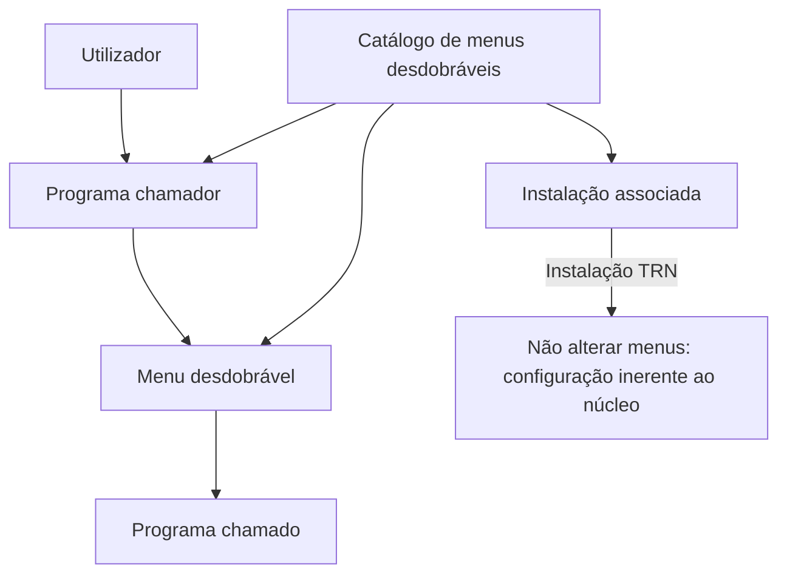

# Definição dos Menus Desdobráveis de Programas no Reef.core

## 1. Metadados do Documento
- **Arquivo de Origem:** Não identificado
- **Tipo de Documento:** Especificação Funcional
- **Domínio / Sistema:** Reef.core
- **Público-Alvo:** Analistas funcionais, configuradores e utilizadores de programas Reef.core
- **Data/Versão Identificada:** Não identificada

---

## 2. Resumo Executivo & Contexto de Negócio

O documento descreve a definição do catálogo de menus desdobráveis de programas no sistema Reef.core. A funcionalidade permite aceder a determinados programas sem sair da operação funcional em curso nem abandonar o programa que o utilizador está a executar.

No Reef.core, é possível configurar os programas que disponibilizam menus desdobráveis e identificar quais programas podem ser chamados a partir desses menus. O documento concentra-se no catálogo usado para identificar os programas que permitem esse comportamento.

A configuração é definida por atributos operacionais, incluindo companhia, código da instalação, idioma, código do programa chamador, identificador do menu desdobrável e título do menu desdobrável. Um mesmo programa pode disponibilizar um ou mais locais de chamada para outros programas.

Existe uma restrição explícita para configurações associadas à instalação do núcleo, identificada como instalação TRN. Menus desdobráveis vinculados à instalação TRN não devem ser alterados, pois fazem parte inerente do núcleo da aplicação.

---

## 3. Arquitetura, Componentes & Tecnologias Envolvidas

### Componentes e conceitos identificados

| Componente / Conceito | Papel no documento | Observações |
| :--- | :--- | :--- |
| Reef.core | Sistema que permite configurar menus desdobráveis de programas | O documento não detalha a arquitetura técnica interna do Reef.core. |
| Catálogo de menus desdobráveis | Catálogo utilizado para identificar programas que permitem chamar outros programas | A definição é realizada por companhia. |
| Programa chamador | Programa em que é permitida a funcionalidade de chamada a outros programas | Identificado pelo atributo “Código do programa”. |
| Programa chamado | Programa acessível a partir de um menu desdobrável | O documento não especifica métodos de chamada, contratos ou tipos de programas chamados. |
| Menu desdobrável | Local predeterminado no programa chamador para aceder a outros programas | Um programa pode ter um ou vários locais desse tipo. |
| Instalação TRN | Instalação do núcleo da aplicação | Menus associados a essa instalação não devem ser alterados. |



**Nota de Análise:** O documento identifica o Reef.core, o catálogo de menus desdobráveis, programas chamadores e instalações, mas não detalha tecnologias, APIs, métodos HTTP, contratos JSON, persistência de dados ou ambientes técnicos.

---

## 4. Regras de Negócio, Especificações Funcionais & Processos

### Objetivo funcional

1. O utilizador pode aceder a determinados programas sem sair da operação funcional.
2. O utilizador pode aceder a determinados programas sem abandonar o programa em execução.
3. O Reef.core permite configurar quais programas disponibilizam a funcionalidade.
4. O Reef.core permite configurar quais programas podem ser chamados a partir dos programas que disponibilizam a funcionalidade.

### Definição operacional do menu desdobrável

1. Definir a companhia sobre a qual será realizada a definição do menu desdobrável.
2. Associar a definição a um código de instalação.
3. Definir o idioma da denominação do menu desdobrável.
4. Identificar o programa chamador que permite chamadas a outros programas.
5. Identificar o local predeterminado de chamada através do ID do menu desdobrável.
6. Definir o título ou denominação do menu desdobrável.
7. Preservar obrigatoriamente a configuração de programas e menus pertencentes ao núcleo, quando associados à instalação TRN.

### Restrições obrigatórias

- A configuração dos programas e menus desdobráveis correspondentes ao núcleo deve ser respeitada obrigatoriamente.
- Menus desdobráveis cuja instalação configurada corresponda à instalação do núcleo, denominada instalação TRN, não devem ser alterados.
- A razão apresentada pelo documento é que tais menus são parte inerente do núcleo da aplicação.

---

## 5. Tabelas de Parâmetros, Ambientes e Estruturas de Dados

| Item / Parâmetro | Descrição / Função | Tipo / Valores / Formato | Ambiente / Observações |
| :--- | :--- | :--- | :--- |
| Companhia | Contém o código da companhia sobre a qual é realizada a definição do menu desdobrável | Código de companhia | A definição do catálogo é realizada por companhia. |
| Código da Instalação | Identifica o código da instalação associada ao programa que contém o menu desdobrável | Código de instalação | Se corresponder à instalação TRN, o menu não deve ser alterado. |
| Instalação TRN | Instalação do núcleo da aplicação | Valor identificado no documento como `TRN` | Os menus associados são inerentes ao núcleo. |
| Idioma | Determina o idioma usado na denominação do menu desdobrável | Idioma | O documento não informa códigos de idioma suportados. |
| Código do programa | Identifica o programa chamador que permite chamadas a outros programas | Código de programa | Representa o programa no qual a funcionalidade está habilitada. |
| ID do Menu Desdobrável | Identifica o local predeterminado no programa chamador para realizar a chamada a outros programas | Identificador de menu | Um programa pode ter um ou vários locais de chamada. |
| Título do Menu Desdobrável | Identifica a denominação do menu desdobrável | Título / texto | A denominação é condicionada pelo atributo Idioma. |
| Definição Programas | Documento funcional relacionado | Referência documental | Indicado na seção de vínculos. |

---

## 6. Bateria de Perguntas & Respostas para RAG (FAQ Sintético)

### P1: Qual é a finalidade dos menus desdobráveis de programas no Reef.core?
**R:** Os menus desdobráveis permitem ao utilizador aceder a determinados programas sem sair da operação funcional e sem abandonar o programa que está a executar.

### P2: O que pode ser configurado no Reef.core em relação aos menus desdobráveis?
**R:** O Reef.core permite configurar os programas que disponibilizam a funcionalidade de menu desdobrável e os programas que podem ser chamados a partir desses programas.

### P3: O que identifica o atributo Companhia no catálogo de menus desdobráveis?
**R:** O atributo Companhia contém o código da companhia sobre a qual está a ser realizada a definição do menu desdobrável de programas.

### P4: Qual é a função do Código da Instalação?
**R:** O Código da Instalação identifica a instalação associada ao programa que contém o menu desdobrável.

### P5: O que acontece quando a instalação configurada para um menu desdobrável é a instalação TRN?
**R:** Quando a instalação é a instalação TRN, correspondente ao núcleo, os menus desdobráveis não devem ser alterados porque fazem parte inerente do núcleo da aplicação.

### P6: O que identifica o Código do programa?
**R:** O Código do programa identifica o programa chamador no qual é permitida a funcionalidade de realizar chamadas a outros programas.

### P7: Qual é o propósito do ID do Menu Desdobrável?
**R:** O ID do Menu Desdobrável identifica especificamente o local predeterminado dentro do programa chamador a partir do qual é possível chamar outros programas.

### P8: Um programa pode ter mais de um local para chamar outros programas?
**R:** Sim. O documento estabelece que um programa pode ter um ou vários locais a partir dos quais pode realizar a chamada a outros programas.

### P9: Qual propriedade define o idioma do nome do menu desdobrável?
**R:** A propriedade Idioma determina o idioma no qual o menu desdobrável de programas é denominado.

### P10: Qual propriedade identifica o nome apresentado para o menu desdobrável?
**R:** O Título do Menu Desdobrável identifica a denominação do menu desdobrável.

### P11: Existe uma restrição obrigatória para menus do núcleo do Reef.core?
**R:** Sim. É obrigatório respeitar a configuração realizada para programas e menus desdobráveis do núcleo, isto é, aqueles associados à instalação TRN.

---

## 7. Glossário de Termos, Siglas & Conceitos-Chave

- **Reef.core:** Sistema mencionado como responsável por permitir a configuração de programas e menus desdobráveis.
- **TRN:** Identificador da instalação do núcleo da aplicação, conforme descrito no documento.
- **Catálogo de menus desdobráveis:** Catálogo utilizado para identificar programas que permitem chamar outros programas.
- **Programa chamador:** Programa no qual é permitida a funcionalidade de chamar outros programas.
- **Programa chamado:** Programa acessível a partir de um menu desdobrável; o documento não apresenta detalhes técnicos adicionais sobre esse programa.
- **ID do Menu Desdobrável:** Identificador do local predeterminado de um programa chamador a partir do qual pode ser realizada uma chamada para outros programas.
- **Instalação:** Código associado ao programa que contém o menu desdobrável.

---

## 8. Notas Críticas, Riscos & Limitações

- A alteração de menus desdobráveis associados à instalação TRN é explicitamente proibida pelo documento.
- O documento recomenda a leitura das diretrizes e documentos funcionais relacionados para evitar interpretações isoladas incorretas.
- A referência documental indicada é **Definição Programas**.
- O documento não detalha quais programas podem ser chamados, regras de autorização, perfis de utilizador, persistência, APIs, mensagens de erro, fluxos de manutenção ou contratos de integração.
- **Nota de Análise:** O documento lista a funcionalidade de menus desdobráveis no Reef.core, porém não detalha os métodos técnicos usados para chamar programas nem os critérios que determinam quais programas chamados são permitidos.

---

## 9. Conteúdo Bruto Estruturado (Referência Fiel)

```text
--- [PÁGINA 1 DE 3] ---

DEFINICIÓN de los MENUS DESPLEGABLES
de Programas

Contexto

En ocasiones es necesario o deseable contar con la posibilidad de acceder a determinados
programas, sin tener que salir de la operación funcional o abandonar el Programa que el Usuario
estuviera ejecutando en un momento determinado.

Objetivo

Funcionalmente, Reef.core cuenta con la posibilidad de configurar los programas que permiten dicha
funcionalidad y cuales serán los programas que podrán ser llamados desde ellos.

En este documento haremos referencia al primero de estos catálogos para identificar qué
programas permiten este comportamiento.

Propiedades Operativas

Propiedades Operativas

Compañía

Este atributo del catálogo contiene el código de la compañía sobre la que se está realizando la
definición del menú desplegable de programas.

Código de la Instalación

 / 
 CF
Home Solutions APIs Documentation Zeus
EN


--- [PÁGINA 2 DE 3] ---

Esta propiedad de la definición identifica el código de la instalación asociada al programa que
contiene el menú desplegable.

Si el valor de la instalación en la configuración del menú desplegable es la correspondiente a la
instalación del núcleo (instalación TRN), los menus desplegables no deben ser alterados por ser
parte inherente al núcleo de la aplicación.

Idioma

Determina el idioma en el que se esté denominando el menú desplegable de programas.

Código del programa

Identifica el código del programa llamador en el que se permite la funcionalidad de realizar llamadas
a otros programas.

ID del Menú Desplegable

Identifica específicamente el lugar predeterminado del programa llamador desde el que se puede
realizar la llamada a los programas.

Un programa puede tener uno o varios lugares desde los que se puede realizar la llamada a otros
programas.

Título del Menú Desplegable

Esta propiedad de la definición identifica la denominación del menú desplegable.

Vínculos

Relación de Directrices y Documentos funcionales cuya lectura recomendada para evitar que la
interpretación aislada del presente documento pueda conducir a error.

Definición Programas

Preguntas frecuentes

(1) ¿Existe alguna restricción que tenga que ser tomada en cuenta en el uso y definición del catálogo
de menús desplegables por compañía de Reef.core?

Se han de respetar obligatoriamente la configuración realizada de los programas y menús
desplegables correspondientes al núcleo (aquellos con instalación TRN).


--- [PÁGINA 3 DE 3] ---

[Página em branco ou apenas elementos visuais/imagem]
```
