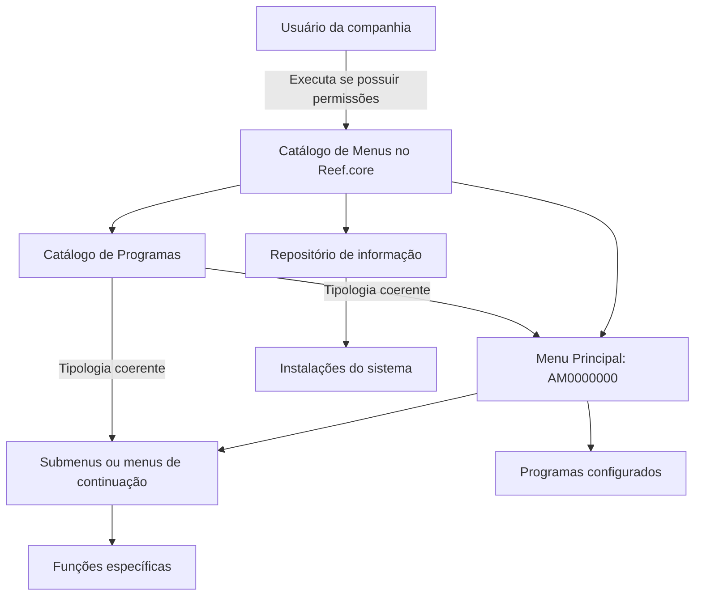

# Catálogo de Menús de Programas da Aplicação no Reef.core

## 1. Metadados do Documento
- **Arquivo de Origem:** Não identificado no conteúdo fornecido
- **Tipo de Documento:** Especificação Técnica / Funcional
- **Domínio / Sistema:** Reef.core
- **Público-Alvo:** Desenvolvedores, Arquitetos, Operação e Negócio
- **Data/Versão Identificada:** Não identificada

---

## 2. Resumo Executivo & Contexto de Negócio

O documento descreve a definição do catálogo de menus de programas da aplicação no âmbito do Reef.core. A finalidade declarada do catálogo é agrupar e organizar os programas que os usuários da companhia podem executar, desde que possuam permissões para isso.

O catálogo de menus centraliza, em um mesmo repositório de informação, tanto a relação de menus quanto os programas contidos nesses menus. Esse conteúdo é entregue às instalações com as informações necessárias para o funcionamento correto do sistema.

A estrutura parte de um Menu Principal de nome constante `AM0000000`. A partir desse Menu Principal, podem ser configurados submenus ou menus de continuação para apresentar funções mais específicas das operações.

O documento também estabelece atributos operacionais para a definição do menu, incluindo companhia, código do menu, ordem e código do programa. Cada menu é tratado como outro programa cuja tipologia determina que se trata de um menu; portanto, a propriedade correspondente deve estar alinhada à definição do menu como programa no catálogo de programas.

---

## 3. Arquitetura, Componentes & Tecnologias Envolvidas

### Componentes identificados

| Componente | Papel descrito no documento | Observações |
| :--- | :--- | :--- |
| Reef.core | Sistema no qual o catálogo de menus é definido e utilizado. | Não há detalhamento tecnológico adicional. |
| Catálogo de Menus | Estrutura que agrupa e organiza os programas executáveis pelos usuários da companhia. | Deve respeitar permissões de usuário. |
| Repositório de informação | Repositório que concentra a relação de menus e os programas associados. | É entregue às instalações com o conteúdo necessário ao funcionamento do sistema. |
| Menu Principal | Ponto inicial da estrutura de menus da aplicação. | Possui valor constante `AM0000000`. |
| Submenus / menus de continuação | Menus derivados do Menu Principal para expor funções mais específicas. | Podem ser configurados quando necessário. |
| Catálogo de Programas | Catálogo no qual o menu também deve estar definido como programa. | A propriedade de tipologia deve ser coerente entre as definições. |
| Programas | Funções ou programas associados aos menus e executáveis por usuários autorizados. | Cada programa possui código e posição de exibição no menu. |



> **Nota de Análise:** O documento não detalha tecnologias de implementação, métodos HTTP, bancos de dados, contratos de integração, URLs, ambientes, versões ou mecanismos técnicos de autorização.

---

## 4. Regras de Negócio, Especificações Funcionais & Processos

### Finalidade do catálogo de menus

1. O catálogo de menus no Reef.core deve agrupar e organizar os programas da aplicação.
2. Os usuários da companhia podem executar programas apenas quando possuírem permissões para isso.
3. A organização dos menus tem como objetivo agilizar e facilitar a experiência do usuário.

### Configuração e distribuição

1. A relação de menus e os programas contidos nos menus devem ser configurados em um mesmo repositório de informação.
2. O repositório de informação deve ser entregue às instalações com o conteúdo necessário para o correto funcionamento do sistema.

### Estrutura hierárquica de menus

1. O nome do Menu Principal da aplicação possui valor constante `AM0000000`.
2. Submenus ou menus de continuação podem ser configurados a partir do Menu Principal quando necessário.
3. Submenus e menus de continuação devem proceder do Menu Principal.
4. Submenus e menus de continuação exibem funções mais específicas das operações a realizar.

### Relação entre menus e programas

1. Um menu é tratado como outro programa cuja tipologia determina que se trata de um menu.
2. A propriedade de tipologia do menu deve estar em consonância com a definição do mesmo menu, como programa, no catálogo de programas.
3. O código do programa identifica o programa associado ao menu.
4. O atributo de ordem determina a sequência de apresentação do programa dentro da relação de programas configurados no menu.

### Convenção de nomenclatura

1. Normalmente, o nome de um menu é composto conforme o padrão:

   ```text
   AM + módulo associado + consecutivo
   ```

2. O documento informa que essa é uma convenção normal de nomenclatura; não declara explicitamente que o padrão é obrigatório para todos os menus.
3. O Menu Principal constitui uma exceção explicitamente definida com o valor constante `AM0000000`.

### Restrição obrigatória

1. A configuração dos menus e programas correspondentes ao núcleo deve ser obrigatoriamente respeitada.
2. Essa restrição aplica-se ao uso e à definição do Catálogo de Menus por companhia no Reef.core.

---

## 5. Tabelas de Parâmetros, Ambientes e Estruturas de Dados

| Item / Parâmetro | Descrição / Função | Tipo / Valores / Formato | Ambiente / Observações |
| :--- | :--- | :--- | :--- |
| Companhia | Contém o código da companhia para a qual está sendo realizada a definição do menu de programas. | Código de companhia; formato não detalhado. | Aplicável ao catálogo de menus no Reef.core. |
| Código Menu | Identifica o código do menu. | Código; formato não detalhado. | Propriedade da definição do menu. |
| Menu Principal | Representa o menu inicial da aplicação. | Valor constante: `AM0000000`. | É a origem para configuração de submenus ou menus de continuação. |
| Submenu / menu de continuação | Apresenta funções mais específicas das operações a realizar. | Não detalhado. | Deriva do Menu Principal quando necessário. |
| Tipologia do menu | Determina que um programa é um menu. | Valor não detalhado. | Deve ser coerente com a definição do menu como programa no catálogo de programas. |
| Nome do menu | Nome atribuído a um menu. | Normalmente: `AM + módulo associado + consecutivo`. | O documento não especifica o formato, tamanho ou valores permitidos para módulo e consecutivo. |
| Ordem | Define a ordem ou sequência de apresentação de um programa no menu. | Ordem/sequência; formato não detalhado. | Aplicável à relação de programas configurados no menu. |
| Código do programa | Identifica o programa associado ao menu. | Código; formato não detalhado. | Propriedade da definição de programa no menu. |
| Repositório de informação | Centraliza menus e programas associados. | Não detalhado. | Entregue às instalações para o funcionamento correto do sistema. |
| Configuração do núcleo | Configuração de menus e programas correspondentes ao núcleo. | Obrigatória; valores não detalhados. | Deve ser respeitada na definição por companhia. |

> **Nota de Análise:** O conteúdo fornecido não apresenta tabelas de servidores, URLs de ambientes, caminhos de logs, variáveis de configuração, tipos de dados técnicos, formatos de campos ou valores de exemplo além de `AM0000000`.

---

## 6. Bateria de Perguntas & Respostas para RAG (FAQ Sintético)

### P1: Qual é a finalidade do catálogo de menus no Reef.core?
**R:** O catálogo de menus no Reef.core tem a finalidade de agrupar e organizar os programas da aplicação que os usuários da companhia podem executar, desde que possuam as permissões necessárias. O documento afirma que essa organização busca agilizar e facilitar a experiência do usuário.

### P2: Qual é o valor do Menu Principal da aplicação?
**R:** O Menu Principal da aplicação possui o valor constante `AM0000000`. O documento o define como o ponto a partir do qual podem ser configurados submenus ou menus de continuação.

### P3: Quando devem ser configurados submenus ou menus de continuação?
**R:** Submenus ou menus de continuação podem ser configurados a partir do Menu Principal quando necessário. O objetivo desses menus derivados é exibir funções mais específicas das operações a realizar.

### P4: Um menu é tratado como um programa no Reef.core?
**R:** Sim. O documento estabelece que um menu é outro programa cuja tipologia assim o determina. Por esse motivo, a propriedade de tipologia deve estar em consonância com a definição do menu como programa no catálogo de programas.

### P5: Como normalmente é formado o nome de um menu?
**R:** Normalmente, o nome de um menu é formado por `AM + módulo associado + consecutivo`. O documento não detalha os formatos, tamanhos ou valores permitidos para o módulo associado e o consecutivo.

### P6: Qual atributo controla a posição de um programa dentro de um menu?
**R:** O atributo `Ordem` indica a ordem ou sequência na qual o programa é mostrado dentro da relação de programas configurados no menu.

### P7: Qual é a finalidade do atributo Código do programa?
**R:** O atributo `Código do programa` identifica o código do programa associado ou adscrito ao menu.

### P8: O que representa o atributo Companhia na definição do catálogo de menus?
**R:** O atributo `Companhia` contém o código da companhia sobre a qual está sendo realizada a definição do menu de programas.

### P9: Onde são configurados os menus e os programas que eles contêm?
**R:** O documento informa que a relação de menus e os programas contidos nos menus podem ser configurados em um mesmo repositório de informação. Esse conteúdo é entregue às instalações com as informações necessárias para o funcionamento correto do sistema.

### P10: Existe alguma restrição para definir o Catálogo de Menus por companhia?
**R:** Sim. Devem ser obrigatoriamente respeitadas as configurações já realizadas para os menus e programas correspondentes ao núcleo.

### P11: O documento define quais permissões um usuário precisa possuir para executar um programa?
**R:** Não. O documento informa apenas que os usuários podem executar programas caso tenham permissões para isso. Os perfis, regras de autorização, matrizes de permissão e mecanismos técnicos não são detalhados.

### P12: O documento especifica contratos técnicos, métodos HTTP ou integrações do catálogo de menus?
**R:** Não. O conteúdo fornecido descreve conceitos funcionais do catálogo de menus, seus atributos e regras de configuração, mas não detalha métodos HTTP, contratos JSON, APIs, bancos de dados ou integrações técnicas.

---

## 7. Glossário de Termos, Siglas & Conceitos-Chave

- **Reef.core:** Sistema ou âmbito no qual o catálogo de menus de programas é definido.
- **Catálogo de Menus:** Estrutura que agrupa e organiza os programas da aplicação disponíveis para usuários autorizados.
- **Catálogo de Programas:** Catálogo em que o menu também deve estar definido como programa, de forma coerente com sua tipologia.
- **Menu Principal:** Menu inicial da aplicação, cujo nome possui valor constante `AM0000000`.
- **Submenu:** Menu derivado do Menu Principal para apresentar funções mais específicas.
- **Menu de continuação:** Menu que procede do Menu Principal e exibe funções mais específicas das operações.
- **Companhia:** Entidade identificada pelo código informado no atributo Companhia da definição de menu.
- **Código Menu:** Propriedade que identifica o código de um menu.
- **Código do programa:** Propriedade que identifica o programa associado a um menu.
- **Ordem:** Atributo que determina a sequência de apresentação de um programa na relação de programas de um menu.
- **Tipologia:** Propriedade que determina que um programa corresponde a um menu.
- **Núcleo:** Conjunto de menus e programas cuja configuração deve ser obrigatoriamente respeitada.

---

## 8. Notas Críticas, Riscos & Limitações

- A definição do catálogo de menus por companhia deve respeitar obrigatoriamente a configuração existente dos menus e programas correspondentes ao núcleo.
- A interpretação isolada do documento pode conduzir a erro; o próprio documento recomenda a leitura da diretriz ou documento funcional relacionado denominado `Definición Programas`.
- O conteúdo fornecido não detalha permissões, papéis, mecanismos de autenticação ou regras de autorização para execução dos programas.
- O conteúdo fornecido não especifica formatos técnicos para código de companhia, código de menu, código de programa, módulo associado ou consecutivo.
- O conteúdo fornecido não apresenta APIs, métodos HTTP, contratos JSON, persistência, banco de dados, ambientes, URLs, logs, versões ou procedimentos de implantação.
- A convenção `AM + módulo asociado + consecutivo` é apresentada como normal, e não como uma validação explicitamente obrigatória.
- Não foi fornecido conteúdo após o marcador `Consejo:`; portanto, não há orientação adicional recuperável desse trecho.

---

## 9. Conteúdo Bruto Estruturado (Referência Fiel)

```text
--- [PÁGINA 1 DE 2] ---

DEFINICIÓN de los MENUS de Programas de la
Aplicación
Contexto
La finalidad básica de tener un catálogo de menús en el ámbito de Reef.core permite agrupar y
organizar los programas de la aplicación que pueden ejecutar los usuarios de la compañía (siempre y
cuando tengan permisos para ello) agilizando y facilitando la experiencia del usuario.
Objetivo
Funcionalmente, Reef.core cuenta con la posibilidad de configurar tanto la relación de menús
como los programas que estos contienen en un mismo repositorio de información que se entrega
a las instalaciones con el contenido necesario para el correcto funcionamiento del Sistema.
Propiedades Operativas
Propiedades Operativas
Compañía
Este atributo del catálogo contiene el código de la compañía sobre la que se está realizando la
definición del menú de programas.
Código Menú
Esta propiedad de la definición identifica el código del Menú.
 /
 CF
Home Solutions APIs Documentation Zeus
EN


--- [PÁGINA 2 DE 2] ---

El nombre del Menú Principal de la aplicación tiene el valor constante: 'AM0000000'. A partir del
Menú Principal y de ser necesario podrán configurarse Sub menús o menús de continuación,
siendo estos los que proceden del menú principal y en los que se exhiben funciones más
específicas de la operaciones a realizar.
Puesto que un Menú no es más que otro programa cuya tipología así lo determina, el valor de
dicha propiedad debe estar en consonancia en la definición del menú (como programa) en el
catálogo de programas.
Normalmente el nombre de un menú se conforma de la forma: AM + módulo asociado +
Consecutivo.
Orden
Este atributo indica el orden o secuencia en el que se muestra el Programa dentro de la relación de
Programas configurados en el Menú.
Código del programa
Esta propiedad de la definición identifica el código del programa adscrito al Menú.
Vínculos
Relación de Directrices y Documentos funcionales cuya lectura recomendada para evitar que la
interpretación aislada del presente documento pueda conducir a error.
Definición Programas
Preguntas frecuentes
(1) ¿Existe alguna restricción que tenga que ser tomada en cuenta en el uso y definición del Catálogo
de Menús por compañía de Reef.core?
Se han de respetar obligatoriamente la configuración realizada de los menús y programas
correspondientes al núcleo.
Consejo:
```
