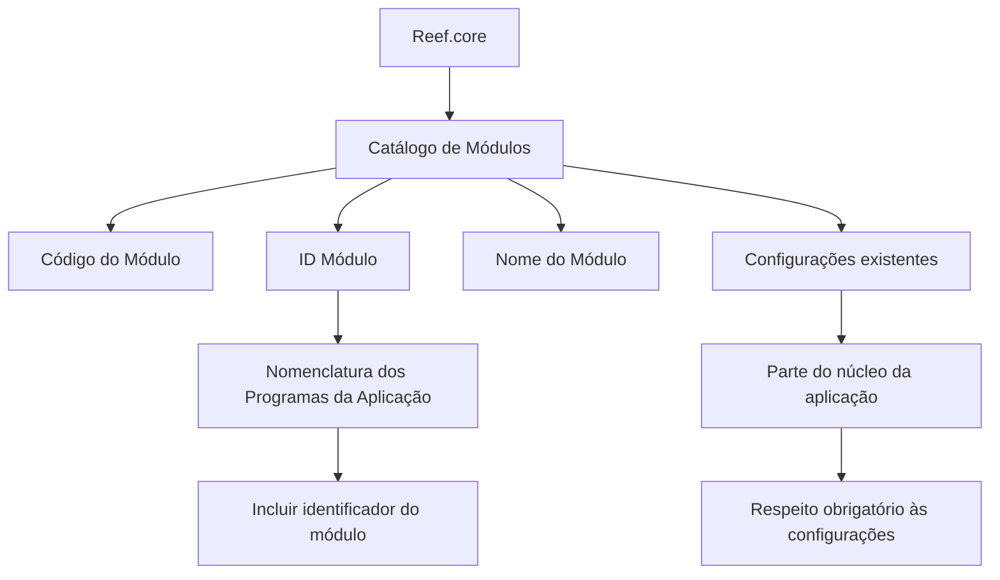

# Definição dos Módulos do Reef.core

## 1. Metadados do Documento
- **Arquivo de Origem:** Não identificado
- **Tipo de Documento:** Especificação Técnica
- **Domínio / Sistema:** Reef.core
- **Público-Alvo:** Desenvolvedores, Arquitetos e Analistas Funcionais
- **Data/Versão Identificada:** Não identificada

---

## 2. Resumo Executivo & Contexto de Negócio

O documento define o catálogo de módulos do sistema Reef.core. O catálogo possui a finalidade de codificar e configurar a relação entre os módulos do sistema em um repositório de informação específico.

Cada módulo do Reef.core possui propriedades operativas para identificação: Código do Módulo, ID Módulo e Nome do Módulo. O Código do Módulo identifica o código funcional do módulo; o ID Módulo identifica o número atribuído ao módulo; e o Nome do Módulo determina a descrição do módulo.

A especificação estabelece uma regra para nomenclatura dos programas da aplicação: o número identificador do módulo ao qual o programa pertence deve ser considerado como parte da codificação do nome de cada programa.

O catálogo de módulos faz parte do núcleo da aplicação. Portanto, as configurações já existentes devem ser respeitadas obrigatoriamente. O documento também recomenda a leitura da documentação relacionada, especialmente a “Definición de Programas”, para evitar interpretações isoladas ou incorretas.

---

## 3. Arquitetura, Componentes & Tecnologias Envolvidas

O documento não descreve infraestrutura, tecnologias de implementação, protocolos, APIs, métodos HTTP, bancos de dados ou ambientes de execução. A arquitetura apresentada é funcional e baseada na organização do Reef.core por módulos registrados em um catálogo.

Componentes e conceitos identificados:

| Componente / Conceito | Descrição sustentada pelo documento |
| :--- | :--- |
| Reef.core | Sistema cujo catálogo define e configura a relação de módulos. |
| Catálogo de Módulos | Repositório de informação específico utilizado para codificar e configurar a relação entre módulos do Reef.core. |
| Código do Módulo | Propriedade que identifica o código do módulo Reef.core. |
| ID Módulo | Atributo que identifica o número atribuído ao módulo. |
| Nome do Módulo | Propriedade que determina a descrição do módulo. |
| Programas da aplicação | A nomenclatura de cada programa deve contemplar o identificador do módulo ao qual pertence. |
| Definición de Programas | Documento relacionado cuja leitura é recomendada. |



> *Nota de Análise: O documento não detalha a implementação técnica do catálogo, a estrutura física do repositório de informação, nem os critérios de geração da nomenclatura dos programas.*

---

## 4. Regras de Negócio, Especificações Funcionais & Processos

1. O Reef.core possui a capacidade de codificar e configurar a relação entre módulos do sistema em um repositório de informação específico.
2. Cada definição de módulo deve possuir um Código do Módulo.
3. O Código do Módulo identifica o código associado ao módulo Reef.core.
4. Cada definição de módulo deve possuir um ID Módulo.
5. O ID Módulo identifica o número atribuído ao módulo.
6. Na codificação da nomenclatura de todos os programas da aplicação, deve ser considerado o número identificador do módulo ao qual o programa pertence.
7. Cada definição de módulo deve possuir um Nome do Módulo.
8. O Nome do Módulo determina a descrição do módulo.
9. As configurações existentes no Catálogo de Módulos devem ser respeitadas obrigatoriamente.
10. A obrigatoriedade de preservação das configurações decorre do fato de o catálogo ser parte do núcleo da aplicação.
11. A leitura da documentação funcional relacionada, incluindo “Definición de Programas”, é recomendada para evitar erros causados por interpretação isolada do documento.

### Catálogo de módulos identificado

| Código do Módulo | Descrição |
| :--- | :--- |
| TRN | Reef.core |
| SS | Sistema de Seguridad |
| DC | Datos Comunes |
| EM | Emisión |
| TS | Siniestros |
| GC | Gestión de Cobros / Tesorería |
| RE | Reaseguro |
| CA | Coaseguro |
| CO | Contabilidad |

---

## 5. Tabelas de Parâmetros, Ambientes e Estruturas de Dados

| Item / Parâmetro | Descrição / Função | Tipo / Valores / Formato | Ambiente / Observações |
| :--- | :--- | :--- | :--- |
| Código do Módulo | Identifica o código do módulo Reef.core. | Códigos identificados: TRN, SS, DC, EM, TS, GC, RE, CA, CO. | Não há ambiente informado. |
| ID Módulo | Identifica o número atribuído ao módulo. | Número identificador; formato não detalhado. | Deve ser contemplado na nomenclatura dos programas da aplicação. |
| Nome do Módulo | Determina a descrição do módulo. | Texto descritivo. | Não há regras de tamanho ou formato informadas. |
| Catálogo de Módulos | Codifica e configura a relação entre módulos do sistema. | Repositório de informação específico. | Parte do núcleo da aplicação; configurações existentes são obrigatórias. |
| Nomenclatura de Programas | Codificação dos nomes dos programas da aplicação. | Deve incluir ou contemplar o identificador numérico do módulo correspondente. | O formato exato da nomenclatura não é detalhado. |
| Documento relacionado | “Definición de Programas”. | Documento funcional recomendado. | Deve ser consultado para evitar interpretação isolada. |

---

## 6. Bateria de Perguntas & Respostas para RAG (FAQ Sintético)

### P1: Qual é o objetivo do Catálogo de Módulos do Reef.core?
**R:** O Catálogo de Módulos do Reef.core tem a finalidade de codificar e configurar a relação entre os módulos do sistema em um repositório de informação específico.

### P2: Quais propriedades operativas identificam um módulo no Reef.core?
**R:** Um módulo possui as propriedades Código do Módulo, ID Módulo e Nome do Módulo. O Código identifica o módulo, o ID identifica o número atribuído ao módulo e o Nome determina a descrição do módulo.

### P3: O que representa o Código do Módulo no Reef.core?
**R:** O Código do Módulo é a propriedade da definição que identifica o código do módulo Reef.core. Os códigos listados no documento incluem TRN, SS, DC, EM, TS, GC, RE, CA e CO.

### P4: Qual é a função do ID Módulo?
**R:** O ID Módulo identifica o número atribuído ao módulo. Esse número deve ser contemplado na codificação da nomenclatura de todos os programas da aplicação pertencentes ao respectivo módulo.

### P5: Qual regra deve ser seguida na nomenclatura dos programas da aplicação?
**R:** A nomenclatura de todos os programas da aplicação deve contemplar, como parte de sua codificação, o número identificador do módulo ao qual cada programa pertence.

### P6: O que descreve a propriedade Nome do Módulo?
**R:** A propriedade Nome do Módulo determina a descrição do módulo. O documento não define formato, tamanho máximo ou convenção de preenchimento para essa descrição.

### P7: Quais restrições existem para o uso e a definição do Catálogo de Módulos do Reef.core?
**R:** As configurações existentes no catálogo devem ser respeitadas obrigatoriamente, pois o catálogo é parte do núcleo da aplicação.

### P8: Qual módulo é identificado pelo código TRN?
**R:** O código TRN corresponde ao módulo Reef.core.

### P9: Qual módulo é identificado pelo código GC?
**R:** O código GC corresponde ao módulo “Gestión de Cobros / Tesorería”.

### P10: Quais documentos relacionados devem ser considerados ao interpretar esta especificação?
**R:** O documento recomenda a leitura das diretrizes e dos documentos funcionais relacionados, com destaque para “Definición de Programas”, para evitar erros decorrentes de interpretação isolada.

### P11: O documento informa como o Catálogo de Módulos é implementado tecnicamente?
**R:** Não. O documento informa que a relação entre módulos é codificada e configurada em um repositório de informação específico, mas não descreve tecnologia, banco de dados, serviços, interfaces ou estrutura técnica desse repositório.

---

## 7. Glossário de Termos, Siglas & Conceitos-Chave

- **Reef.core:** Sistema ao qual pertence o catálogo de módulos descrito no documento.
- **Catálogo de Módulos:** Repositório de informação específico usado para codificar e configurar a relação de módulos do Reef.core.
- **Código do Módulo:** Propriedade que identifica o código de um módulo.
- **ID Módulo:** Atributo que identifica o número atribuído a um módulo.
- **Nome do Módulo:** Propriedade que determina a descrição de um módulo.
- **TRN:** Código do módulo Reef.core.
- **SS:** Código do módulo Sistema de Seguridad.
- **DC:** Código do módulo Datos Comunes.
- **EM:** Código do módulo Emisión.
- **TS:** Código do módulo Siniestros.
- **GC:** Código do módulo Gestión de Cobros / Tesorería.
- **RE:** Código do módulo Reaseguro.
- **CA:** Código do módulo Coaseguro.
- **CO:** Código do módulo Contabilidad.

---

## 8. Notas Críticas, Riscos & Limitações

- O Catálogo de Módulos é parte do núcleo da aplicação; alterações ou desrespeito às configurações existentes podem afetar componentes centrais do Reef.core.
- O documento exige o respeito obrigatório às configurações já existentes no catálogo.
- A nomenclatura dos programas depende do número identificador do módulo, mas o documento não fornece exemplos completos da convenção de nomes.
- Não há detalhamento sobre persistência, interfaces, APIs, integrações, permissões, responsáveis pela manutenção ou processo de alteração do catálogo.
- A interpretação do documento isoladamente pode conduzir a erro; a leitura de diretrizes e documentos funcionais relacionados é recomendada.
- *Nota de Análise: O trecho “Consejo: / CF Home Solutions APIs Documentation Zeus EN” aparece na extração bruta, porém não possui contexto suficiente para interpretação confiável.*

---

## 9. Conteúdo Bruto Estruturado (Referência Fiel)

```text
--- [PÁGINA 1 DE 2] ---

DEFINICIÓN de los MÓDULOS de Reef.core
Objetivo
Funcionalmente, Reef.core cuenta con la facultad de codificar y configurar la relación de módulos del
sistema en un repositorio de información específico.
Propiedades Operativas
Propiedades Operativas
Código del Módulo
Esta propiedad de la definición identifica el código del módulo de Reef.core.
ID Módulo
Este atributo identifica el número asignado al módulo.
En la codificación de la nomenclatura de todos y cada uno de los programas de la aplicación y
como parte de la misma se debería contemplar el número identificador del módulo al que
pertenece el Programa.
Nombre del Módulo
Consejo:
 /
 CF
Home Solutions APIs Documentation Zeus
EN


--- [PÁGINA 2 DE 2] ---

Esta propiedad determina la descripción del módulo.
CÓDIGO DEL MÓDULO DESCRIPCIÓN
TRN Reef.core
SS Sistema de Seguridad
DC Datos Comunes
EM Emisión
TS Siniestros
GC Gestión de Cobros / Tesorería
RE Reaseguro
CA Coaseguro
CO Contabilidad
Vínculos
Relación de Directrices y Documentos funcionales cuya lectura recomendada para evitar que la
interpretación aislada del presente documento pueda conducir a error.
Definición de Programas
Preguntas frecuentes
(1) ¿Existe alguna restricción que tenga que ser tomada en cuenta en el uso y definición del Catálogo
de Módulos de Reef.core?
Se han de respetar obligatoriamente las configuraciones existentes en este catálogo por ser parte
del núcleo de la aplicación.
```
