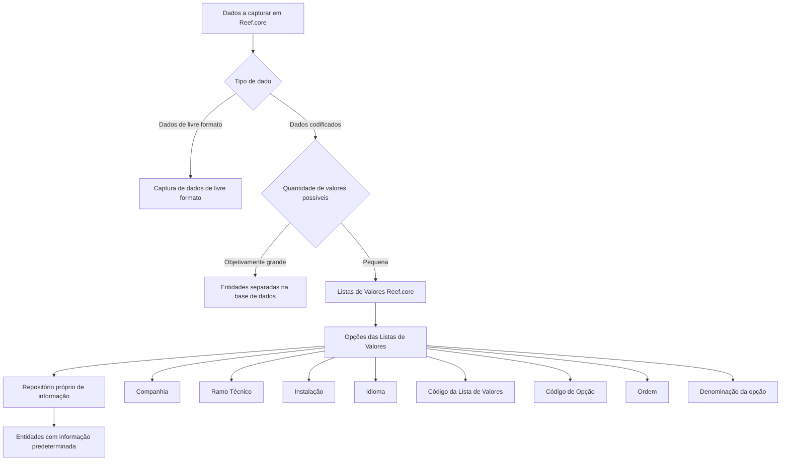

# Definição das Opções das Listas de Valores do Reef.core

## 1. Metadados do Documento
- **Arquivo de Origem:** Não identificado no conteúdo extraído
- **Tipo de Documento:** Especificação Técnica / Funcional
- **Domínio / Sistema:** Reef.core
- **Público-Alvo:** Equipes de tecnologia e responsáveis pela configuração de catálogos Reef.core
- **Data/Versão Identificada:** Não identificada

---

## 2. Resumo Executivo & Contexto de Negócio

O documento descreve a definição e identificação das opções que compõem listas de valores no sistema Reef.core. Listas de valores são repositórios compartilhados para armazenar dados codificados cujo conjunto de valores possíveis é pequeno.

Quando um dado codificado possui um número objetivamente grande de valores possíveis, as equipes de tecnologia normalmente criam entidades separadas na base de dados para registro e armazenamento. Para conjuntos reduzidos de valores, Reef.core utiliza os repositórios de “listas de valores” e “opções das listas de valores”.

Funcionalmente, Reef.core permite registrar as opções possíveis de cada lista de valores em um repositório próprio. Essas informações são distribuídas às entidades que possuem dados predeterminados.

A definição de uma opção é contextualizada por companhia, ramo técnico, instalação, idioma, código da lista, código da opção, ordem e denominação. O documento destaca uma restrição crítica: listas associadas à instalação do núcleo, identificada pelo código `TRN`, não podem ser alteradas.

---

## 3. Arquitetura, Componentes & Tecnologias Envolvidas

Os componentes e conceitos citados são:

- **Reef.core:** Sistema no qual os catálogos, listas de valores e opções são configurados.
- **Listas de Valores:** Repositório de informações compartilhado para dados codificados com poucas possibilidades de valor.
- **Opções das Listas de Valores:** Valores individuais configurados para uma lista de valores específica.
- **Catálogo de configuração de opções:** Catálogo que identifica a lista de valores e configura suas opções.
- **Companhia:** Contexto empresarial da definição.
- **Ramo Técnico:** Critério para especializar valores por ramo técnico ou para todos os ramos mediante o código genérico `999`.
- **Instalação:** Contexto de instalação associado à lista; a instalação `TRN` corresponde ao núcleo da aplicação.
- **Idioma:** Idioma da denominação ou descrição da opção.
- **Entidades com informação predeterminada:** Destinatárias da distribuição das informações registradas no repositório de listas de valores.



> **Nota de Análise:** O documento não detalha tecnologias de implementação, modelo físico de base de dados, interfaces, métodos HTTP, contratos JSON, processos de distribuição ou mecanismos de persistência.

---

## 4. Regras de Negócio, Especificações Funcionais & Processos

### 4.1 Uso de listas de valores

1. Reef.core captura dados de livre formato e dados codificados.
2. Dados codificados com um número objetivamente grande de valores possíveis normalmente são armazenados em entidades separadas na base de dados.
3. Dados codificados com um número pequeno de valores possíveis podem ser armazenados de forma compartilhada nos repositórios de:
   - Listas de valores.
   - Opções das listas de valores.
4. O catálogo de opções identifica os valores que irão compor as opções de uma lista de valores determinada.
5. Reef.core registra a relação de opções possíveis das listas de valores em um repositório próprio.
6. As informações registradas são distribuídas às entidades que possuem informação predeterminada.

### 4.2 Especialização por ramo técnico

1. O atributo **Ramo Técnico** determina a chave do ramo técnico utilizada para especializar valores de uma lista.
2. O código genérico `999` permite especializar as opções da lista de valores para todos os ramos técnicos configurados no sistema.
3. O uso do código de um ramo técnico específico especializa os valores exclusivamente para esse ramo técnico.

### 4.3 Restrição relacionada à instalação TRN

1. O atributo **Código da Instalação** identifica a instalação associada à lista de valores.
2. Quando a configuração da lista utiliza a instalação do núcleo, identificada como `TRN`, as listas de valores não podem ser alteradas sob nenhuma circunstância.
3. A restrição existe porque as listas de valores da instalação `TRN` são parte inerente do núcleo da aplicação Reef.core.
4. A relação de listas de valores `TRN` deve ser respeitada obrigatoriamente.

### 4.4 Coexistência de instalações por companhia

1. Em geral, nos catálogos de configuração Reef.core que podem ser personalizados pelos países, incluindo o catálogo descrito, podem coexistir somente:
   - Registros com código de instalação `TRN`.
   - Registros com o código da instalação local.
2. A coexistência entre `TRN` e a instalação local permite distinguir se uma configuração é:
   - Padrão.
   - Local.

### 4.5 Ordem de exibição

1. O atributo **Ordem** identifica a sequência na qual a opção será mostrada no componente gráfico da interface que apresenta as opções da lista.
2. O documento não especifica formato, intervalo permitido, regra de unicidade ou critério de ordenação para o atributo **Ordem**.

---

## 5. Tabelas de Parâmetros, Ambientes e Estruturas de Dados

| Item / Parâmetro | Descrição / Função | Tipo / Valores / Formato | Ambiente / Observações |
| :--- | :--- | :--- | :--- |
| Companhia | Contém o código da companhia para a qual está sendo realizada a definição da lista de valores. | Código de companhia; formato não detalhado. | Contexto empresarial da configuração. |
| Ramo Técnico | Determina a chave do ramo técnico usada para especializar os valores da lista. | Código de ramo técnico; `999` representa valor genérico. | `999` aplica opções a todos os ramos técnicos configurados; um código específico aplica opções exclusivamente ao ramo correspondente. |
| Código da Instalação | Identifica o código da instalação associado à lista de valores. | Código de instalação; `TRN` citado explicitamente. | Listas configuradas para `TRN` não podem ser alteradas, pois pertencem ao núcleo de Reef.core. |
| Idioma | Identifica o idioma da denominação ou descrição da opção da lista. | Exemplos: espanhol, inglês, turco. | O documento não apresenta códigos de idioma nem lista completa de idiomas suportados. |
| Código da Lista de Valores | Identifica a lista de valores para a qual suas opções são configuradas. | Código; formato não detalhado. | Pertence ao catálogo de configuração de opções. |
| Código de Opção | Determina o código da opção ou valor de uma lista de valores. | Código; formato não detalhado. | Identifica um valor configurado para a lista. |
| Ordem | Identifica a ordem de apresentação da opção na interface gráfica. | Valor de ordenação; formato não detalhado. | Controla a sequência visual no componente gráfico. |
| Denominação da Lista de Valores | Contém a denominação ou descrição da opção da lista de valores. | Texto em um idioma identificado pelo atributo Idioma. | Apesar do nome apresentado, a descrição informa que o campo contém a denominação ou descrição da opção. |
| Instalação `TRN` | Instalação do núcleo da aplicação. | Código `TRN`. | As listas de valores associadas não podem sofrer alterações. |
| Instalação local | Código de instalação local de uma companhia. | Código não detalhado. | Pode coexistir com `TRN` em catálogos personalizáveis pelos países. |
| Código genérico de ramo técnico | Permite especializar opções para todos os ramos técnicos do sistema. | Código `999`. | Aplicável ao atributo Ramo Técnico. |

---

## 6. Bateria de Perguntas & Respostas para RAG (FAQ Sintético)

### P1: O que são listas de valores no Reef.core?
**R:** Listas de valores são repositórios de informação Reef.core utilizados para armazenar de forma compartilhada dados codificados com um número pequeno de valores possíveis. As opções das listas de valores representam os valores individuais disponíveis para cada lista.

### P2: Quando Reef.core utiliza entidades separadas na base de dados em vez de listas de valores?
**R:** Quando um dado codificado possui um número objetivamente grande de valores possíveis, as equipes de tecnologia normalmente criam entidades separadas na base de dados para o seu registro e armazenamento. Para conjuntos pequenos de valores, o documento indica o uso de listas de valores e opções das listas de valores.

### P3: Qual é a finalidade do catálogo de configuração de opções de listas de valores?
**R:** O catálogo de configuração de opções identifica o código da lista de valores para a qual os valores são configurados e determina os códigos das opções ou valores pertencentes àquela lista.

### P4: Como o atributo Ramo Técnico influencia as opções de uma lista de valores?
**R:** O atributo Ramo Técnico permite especializar os valores de uma lista para um ramo técnico específico. Quando é utilizado o código genérico `999`, as opções são especializadas para todos os ramos técnicos configurados no sistema. Quando é utilizado o código de um ramo existente, os valores ficam especializados exclusivamente para esse ramo.

### P5: O que significa o código de instalação TRN na configuração de listas de valores?
**R:** `TRN` identifica a instalação do núcleo da aplicação Reef.core. Quando uma lista de valores está configurada para a instalação `TRN`, ela não pode ser alterada sob nenhuma circunstância, por ser parte inerente ao núcleo da aplicação.

### P6: Quais instalações podem coexistir para uma companhia em catálogos Reef.core personalizáveis?
**R:** Em geral, podem coexistir apenas registros com o código de instalação `TRN` e registros com o código da instalação local. Essa distinção permite identificar se a configuração é padrão ou local.

### P7: Para que serve o atributo Idioma na definição de uma opção?
**R:** O atributo Idioma identifica o idioma em que está definida a denominação ou descrição da opção da lista de valores. O documento cita como exemplos espanhol, inglês e turco.

### P8: Qual é a função do atributo Ordem?
**R:** O atributo Ordem identifica a sequência em que uma opção da lista será exibida no componente gráfico da interface que visualiza as opções. O documento não especifica o formato do campo, intervalo de valores ou regras de unicidade.

### P9: Qual informação é representada pelo atributo Companhia?
**R:** O atributo Companhia contém o código da companhia sobre a qual está sendo realizada a definição da lista de valores.

### P10: As listas de valores configuradas para TRN podem ser modificadas?
**R:** Não. O documento estabelece que listas de valores associadas à instalação do núcleo `TRN` não podem ser alteradas sob nenhum conceito. Também afirma que a relação de listas de valores `TRN` deve ser obrigatoriamente respeitada.

### P11: Como Reef.core disponibiliza opções de listas de valores para outras entidades?
**R:** Reef.core registra a relação de possíveis opções das listas de valores em um repositório de informação próprio e distribui essa informação às entidades com informação predeterminada. O documento não detalha o mecanismo técnico dessa distribuição.

### P12: O documento define o formato dos códigos de lista, opção, companhia ou instalação?
**R:** Não. O documento identifica a finalidade dos códigos de companhia, ramo técnico, instalação, lista de valores e opção, mas não informa estruturas, tamanhos, tipos de dados, padrões de nomenclatura ou mecanismos de validação desses códigos.

---

## 7. Glossário de Termos, Siglas & Conceitos-Chave

- **Reef.core:** Sistema referido pelo documento, responsável por utilizar catálogos, listas de valores e opções de listas de valores.
- **Lista de Valores:** Repositório compartilhado para dados codificados que possuem um conjunto pequeno de valores possíveis.
- **Opção de Lista de Valores:** Valor individual configurado para uma lista de valores.
- **Dado Codificado:** Dado cujo valor pertence a um conjunto de possibilidades.
- **Ramo Técnico:** Chave utilizada para especializar valores de listas de valores por ramo técnico.
- **TRN:** Código da instalação do núcleo da aplicação; listas de valores associadas a essa instalação não podem ser alteradas.
- **Instalação Local:** Instalação cujo código representa a configuração local e pode coexistir com `TRN` nos catálogos personalizáveis pelos países.
- **Código Genérico `999`:** Valor do atributo Ramo Técnico que permite especializar opções de listas de valores para todos os ramos técnicos configurados.
- **Catálogo de Configuração de Opções:** Catálogo que identifica uma lista de valores e configura seus valores ou opções.
- **Entidades com Informação Predeterminada:** Entidades para as quais Reef.core distribui a informação registrada no repositório próprio de opções.

---

## 8. Notas Críticas, Riscos & Limitações

- A alteração de listas de valores associadas à instalação `TRN` é proibida sob qualquer circunstância.
- A relação de listas de valores `TRN` deve ser respeitada obrigatoriamente por ser parte do núcleo de Reef.core.
- Nos catálogos personalizáveis pelos países, somente podem coexistir registros da instalação `TRN` e da instalação local.
- O documento não especifica formatos de códigos, tipos de dados, chaves de unicidade, validações, permissões de alteração, processo de aprovação ou auditoria.
- O documento não detalha o modelo de persistência, tecnologias, APIs, interfaces, contratos de integração ou mecanismo de distribuição para entidades com informação predeterminada.
- O texto apresenta uma seção “Exemplo:” sem conteúdo subsequente disponível na extração.

---

## 9. Conteúdo Bruto Estruturado (Referência Fiel)

```text
--- [PÁGINA 1 DE 3] ---

DEFINICIÓN de las OPCIONES de las LISTAS
de VALORES de Reef.core
Contexto
¿Qué es una Lista de Valores?
En los programas de Reef.core se han de capturar datos: datos de libre formato y datos codificados.
Si el número de posibles valores de un dato codificado es objetivamente 'grande', los equipos de
tecnología normalmente suelen crear entidades separadas en la base de datos para su registro y
almacenamiento.
Ahora bien, si el número de posibles valores de un dato es pequeño se pueden juntar, incorporar y
almacenar de manera compartida en dos repositorios de información de Reef.core creados al efecto
para ello: "listas de valores" y "opciones de las listas de valores".
En este documento haremos referencia a la identificación de los valores que van a conformar las
opciones de las listas de valores de una lista determinada.
Objetivo
Funcionalmente, Reef.core cuenta con la posibilidad de registrar la relación de posibles opciones de
las listas de valores del sistema en un repositorio de información propio que se distribuye a las
entidades con información pre-determinada.
Propiedades Operativas
 / 
 CF
Home Solutions APIs Documentation Zeus
EN


--- [PÁGINA 2 DE 3] ---

Propiedades Operativas
Compañía
Este atributo del catálogo contiene el código de la compañía sobre la que se está realizando la
definición de la lista de valores.
Ramo Técnico
Determina la clave del Ramo Técnico que permite 'especializar' los valores de la lista para un Ramo
Técnico en particular.
Utilizando el valor genérico en este atributo (código 999) el sistema permite especializar las
opciones de la lista de valores para todos los ramos técnicos configurados en el sistema o bien, al
utilizar el código de un ramo en particular de los existentes, especializar los valores de la lista
exclusivamente para este.
Código de la Instalación
Esta propiedad de la definición identifica el código de la instalación asociada a la lista de valores.
Si el valor de la instalación en la configuración de la lista es la correspondiente a la instalación del
núcleo, instalación (TRN) las listas de valores no podrán alterarse bajo ningún concepto por ser
parte inherente al núcleo de la aplicación.
Idioma
Esta propiedad identifica el idioma en el que está definida la denominación o descripción de la opción
de la lista de valores, como por ejemplo los idiomas español, inglés, turco,...
Código de la Lista de Valores
Esta propiedad del catálogo de configuración de opciones identifica el código de la lista de valores
para la que se configuran sus valores.
Código de Opción
Determina el código de la opción/valor de la lista de valores.
Orden
Consejo:


--- [PÁGINA 3 DE 3] ---

Identifica el orden en el que se mostrará la opción de la lista en el componente gráfico de la interfaz
que las visualiza.
Denominación de la Lista de Valores
Contiene la denominación o descripción que tiene la opción de la lista de valores.
Vínculos
Relación de Directrices y Documentos funcionales cuya lectura recomendada para evitar que la
interpretación aislada del presente documento pueda conducir a error.
Definición Listas de Valores
Preguntas frecuentes
(1) ¿Existe alguna restricción que tenga que ser tomada en cuenta en el uso y definición del catálogo
de listas de valores de Reef.core?
Se han de respetar obligatoriamente la relación de listas de valores TRN por ser parte del núcleo de
Reef.core.
(2) ¿Cuantas instalaciones pueden coexistir para una compañía en particular?
En general, en los catálogos de configuración de Reef.core que los países pueden personalizar
(entre los que se encuentra este), únicamente podrán coexistir registros con el código de instalación
TRN y el código de la instalación local, distinguiendo así si la configuración realizada es la estándar
o local.
Ejemplo:
```
