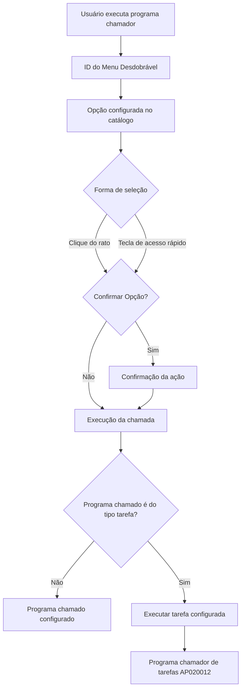

# Configuração de Programas Chamados por Menus Desdobráveis no Reef.core

## 1. Metadados do Documento
- **Arquivo de Origem:** Não identificado
- **Tipo de Documento:** Especificação Funcional
- **Domínio / Sistema:** Reef.core; catálogo de opções/programas chamados por menus desdobráveis
- **Público-Alvo:** Usuários responsáveis pela configuração funcional de programas e menus no Reef.core
- **Data/Versão Identificada:** Não identificada

---

## 2. Resumo Executivo & Contexto de Negócio

O documento descreve a definição dos programas que podem ser chamados a partir de menus desdobráveis de programas no Reef.core. A finalidade é permitir acesso a determinados programas sem que o usuário precise abandonar a operação funcional atual ou sair do programa em execução.

O Reef.core disponibiliza catálogos de configuração para viabilizar essa funcionalidade. O texto concentra-se no catálogo responsável por configurar os programas acessíveis a partir de um programa chamador e pelos respectivos pontos de chamada, identificados por um ID de menu desdobrável.

A configuração determina elementos de apresentação e execução, como ordem da opção, descrição, tecla de acesso rápido, código do programa chamado, necessidade de confirmação e, para programas do tipo tarefa, a tarefa a executar diretamente.

A principal restrição operacional é a preservação da configuração pertencente ao núcleo da aplicação. Quando a instalação configurada for a instalação do núcleo, identificada como `TRN`, as opções dos menus desdobráveis não devem ser alteradas. Para uma companhia, podem coexistir registros de instalação `TRN` e de instalação local.

---

## 3. Arquitetura, Componentes & Tecnologias Envolvidas

### Componentes identificados

| Componente | Papel descrito no documento |
| :--- | :--- |
| Reef.core | Sistema que permite configurar programas acessíveis por menus desdobráveis. |
| Catálogo de programas chamados | Catálogo tratado pelo documento; define programas que podem ser acessados a partir de menus desdobráveis. |
| Programa chamador | Programa em execução a partir do qual o usuário acessa uma opção de menu desdobrável. |
| Menu desdobrável | Mecanismo de interface que apresenta opções para chamar outros programas. |
| Programa chamado | Programa acessado pelo usuário ao selecionar uma opção ou utilizar uma tecla de acesso rápido. |
| Instalação TRN | Instalação do núcleo; sua configuração de programas e menus não deve ser alterada. |
| Instalação local | Instalação específica local que pode coexistir com a instalação `TRN` em catálogos personalizáveis. |
| Programa chamador de tarefas `AP020012` | Código que deve ser usado no campo de programa chamado quando a tipologia do programa chamado for do tipo tarefa. |



> **Nota de Análise:** O documento não descreve tecnologias de implementação, métodos HTTP, contratos de integração, banco de dados, URLs, servidores ou mecanismos técnicos internos do Reef.core.

---

## 4. Regras de Negócio, Especificações Funcionais & Processos

### Objetivo funcional

1. O Reef.core permite configurar programas que tornam possível chamar outros programas sem sair da operação funcional ou abandonar o programa atualmente executado.
2. O catálogo descrito define os programas que podem ser acessados a partir de um programa chamador por meio de menus desdobráveis.
3. Um programa chamador pode possuir vários locais a partir dos quais um menu desdobrável pode ser acionado.
4. O atributo **ID do Menu Desdobrável** identifica especificamente o local do programa chamador para o qual o registro está sendo configurado.

### Regras para instalações

1. O atributo **Código da Instalação** identifica o código de instalação do registro de configuração.
2. Se a instalação configurada no menu desdobrável for a instalação do núcleo, isto é, a instalação `TRN`, as opções dos menus desdobráveis não devem ser alteradas.
3. A preservação da configuração da instalação `TRN` é obrigatória porque essas opções fazem parte inerente do núcleo da aplicação.
4. Nos catálogos de configuração do Reef.core que os países podem personalizar, incluindo este catálogo, para uma companhia podem coexistir apenas:
   - Registros com código de instalação `TRN`.
   - Registros com código da instalação local.
5. A coexistência de registros `TRN` e locais permite distinguir a configuração padrão da configuração realizada localmente.

### Regras de apresentação e seleção de opções

1. O atributo **Idioma** determina o idioma em que a denominação da opção associada ao programa chamado é transcrita.
2. O atributo **Opção** determina a ordem ou sequência de exibição da opção no menu desdobrável.
3. O atributo **Descrição da Opção** determina a descrição ou denominação da opção ou do programa chamado.
4. O atributo **Tecla de Acesso Rápido** pode definir a letra associada à opção ou ao programa chamado.
5. A letra da tecla de acesso rápido pode ser utilizada independentemente de estar em maiúscula ou minúscula.
6. A seleção de uma opção pode ocorrer por:
   - Pressionamento da tecla de acesso rápido.
   - Clique do rato sobre a opção do menu desdobrável.
7. O atributo **Confirmar Opção** determina se a ação deve ser confirmada antes de a chamada ao programa chamado ser executada.

### Regras para programas do tipo tarefa

1. Quando a tipologia do programa chamado corresponder a um programa do tipo tarefa, o atributo **Tarefa** determina qual tarefa deve ser executada diretamente na chamada.
2. Quando houver programa chamado do tipo tarefa, o campo **Código do programa chamado** deve possuir o valor do código associado ao programa chamador de tarefas: `AP020012`.

### Processo funcional de configuração

1. Informar a companhia para a qual a definição está sendo criada.
2. Informar o código da instalação do registro.
3. Preservar a configuração caso o código de instalação seja `TRN`.
4. Definir o idioma da denominação da opção.
5. Informar o código do programa chamador.
6. Informar o ID do menu desdobrável correspondente ao ponto de chamada dentro do programa chamador.
7. Definir a ordem de apresentação da opção.
8. Informar a descrição da opção.
9. Associar, quando aplicável, uma tecla de acesso rápido.
10. Informar o código do programa chamado.
11. Definir se a seleção da opção exige confirmação.
12. Se o programa chamado for do tipo tarefa, informar a tarefa a executar e utilizar `AP020012` como código do programa chamado.

---

## 5. Tabelas de Parâmetros, Ambientes e Estruturas de Dados

| Item / Parâmetro | Descrição / Função | Tipo / Valores / Formato | Ambiente / Observações |
| :--- | :--- | :--- | :--- |
| Companhia | Código da companhia sobre a qual é realizada a definição dos programas associados ao menu desdobrável. | Código de companhia | Aplicável ao registro de catálogo. |
| Código da Instalação | Identifica o código da instalação do registro. | `TRN` ou código de instalação local | A instalação `TRN` representa o núcleo e não deve ter suas opções alteradas. |
| Idioma | Define o idioma da transcrição da denominação da opção associada ao programa chamado. | Idioma | Aplicável à descrição/denominação da opção. |
| Código do programa chamador | Identifica o programa a partir do qual será feita a chamada. | Código de programa | Um programa chamador pode possuir múltiplos locais de menu. |
| ID do Menu Desdobrável | Identifica o local específico do programa chamador para o qual o registro é configurado. | Identificador de menu | Distingue os vários pontos de chamada de um mesmo programa chamador. |
| Opção | Determina a ordem ou sequência de exibição e visualização da opção. | Ordem ou sequência | Aplicável ao menu desdobrável. |
| Descrição da Opção | Define a descrição ou denominação da opção ou programa chamado. | Texto | Deve ser transcrita no idioma definido. |
| Tecla de Acesso Rápido | Define a letra associada à opção ou ao programa chamado. | Letra; maiúscula ou minúscula | Permite alternativa ao clique com rato ou dispositivo apontador. |
| Código do programa chamado | Identifica o programa acessado pela seleção de opção ou tecla de acesso rápido. | Código de programa | Para programas do tipo tarefa, deve assumir o valor `AP020012`. |
| Confirmar Opção | Define se a seleção exige confirmação antes da execução da chamada. | Sim/Não, conforme semântica descrita | Aplica-se à seleção por tecla de acesso rápido ou clique. |
| Tarefa | Define a tarefa executada diretamente quando o programa chamado é do tipo tarefa. | Tarefa não especificada | Requer código de programa chamado `AP020012`. |
| Instalação TRN | Código da instalação do núcleo. | `TRN` | Configuração obrigatoriamente preservada. |
| Instalação local | Código da instalação específica local. | Não especificado | Pode coexistir com `TRN` para uma mesma companhia. |
| Programa chamador de tarefas | Programa associado à execução de tarefas. | `AP020012` | Utilizado no campo Código do programa chamado para programas do tipo tarefa. |

---

## 6. Bateria de Perguntas & Respostas para RAG (FAQ Sintético)

### P1: Qual é o objetivo do catálogo de programas chamados por menus desdobráveis no Reef.core?
**R:** O catálogo define quais programas podem ser acessados a partir de menus desdobráveis de um programa chamador. A funcionalidade permite que o usuário acesse determinados programas sem sair da operação funcional ou abandonar o programa que está executando.

### P2: O que ocorre se a instalação configurada for a instalação `TRN`?
**R:** Se o valor da instalação na configuração do menu desdobrável corresponder à instalação do núcleo, identificada como `TRN`, as opções dos menus desdobráveis não devem ser alteradas. Essas opções são consideradas parte inerente do núcleo da aplicação.

### P3: Quais instalações podem coexistir para uma companhia nesse catálogo do Reef.core?
**R:** Em geral, para catálogos personalizáveis do Reef.core, incluindo este catálogo, podem coexistir para uma companhia registros com código de instalação `TRN` e registros com o código da instalação local. Essa coexistência diferencia a configuração padrão da configuração local.

### P4: Para que serve o ID do Menu Desdobrável?
**R:** O ID do Menu Desdobrável identifica o local específico do programa chamador para o qual o registro está sendo configurado. Esse atributo é necessário porque um mesmo programa chamador pode possuir vários lugares a partir dos quais é possível chamar um menu desdobrável.

### P5: Como é definida a ordem de apresentação de uma opção no menu desdobrável?
**R:** A ordem ou sequência em que uma opção é mostrada e visualizada no menu desdobrável é definida pelo atributo **Opção**.

### P6: Como uma tecla de acesso rápido é associada a uma opção de menu?
**R:** O atributo **Tecla de Acesso Rápido** determina qual letra será associada à opção ou ao programa chamado. A associação independe de a letra estar em maiúscula ou minúscula, e fornece uma alternativa ao uso do rato ou de outro dispositivo apontador.

### P7: O que determina o campo Confirmar Opção?
**R:** O campo **Confirmar Opção** determina se, ao pressionar a tecla de acesso rápido ou clicar com o rato sobre uma opção do menu desdobrável, o usuário deve confirmar a ação antes que a chamada ao programa chamado seja executada.

### P8: Qual código deve ser informado para um programa chamado do tipo tarefa?
**R:** Quando a tipologia do programa chamado corresponder a um programa do tipo tarefa, o campo **Código do programa chamado** deve possuir o valor `AP020012`, que corresponde ao código associado ao programa chamador de tarefas.

### P9: Qual é a função do atributo Tarefa?
**R:** Quando o programa chamado é do tipo tarefa, o atributo **Tarefa** determina qual tarefa deve ser executada diretamente ao realizar a chamada.

### P10: Qual atributo identifica o programa de origem da chamada?
**R:** O atributo **Código do programa chamador** identifica o código do programa a partir do qual o menu desdobrável e a chamada ao programa configurado serão utilizados.

### P11: Qual atributo identifica o programa que será aberto pela opção de menu?
**R:** O atributo **Código do programa chamado** identifica o código do programa acessado quando o usuário pressiona a tecla de acesso rápido ou clica com o rato sobre a opção do menu desdobrável.

### P12: Como o idioma influencia a configuração de uma opção?
**R:** O atributo **Idioma** determina o idioma no qual a denominação da opção associada ao programa chamado é transcrita.

---

## 7. Glossário de Termos, Siglas & Conceitos-Chave

- **Reef.core:** Sistema citado como responsável por permitir a configuração de programas acessíveis por menus desdobráveis.
- **TRN:** Código da instalação do núcleo da aplicação. A configuração de programas e menus correspondente a essa instalação não deve ser alterada.
- **AP020012:** Código associado ao programa chamador de tarefas; deve ser utilizado como código do programa chamado quando a tipologia for programa do tipo tarefa.
- **Programa chamador:** Programa em execução a partir do qual o usuário chama um programa por meio de uma opção de menu desdobrável.
- **Programa chamado:** Programa que será acessado quando o usuário selecionar uma opção de menu ou usar a tecla de acesso rápido.
- **Menu desdobrável:** Menu que oferece opções de programas acessíveis a partir de um programa chamador.
- **Tecla de acesso rápido:** Tecla que fornece uma alternativa ao clique com rato ou dispositivo apontador para chamar uma opção ou programa.
- **Tarefa:** Execução direta configurada quando a tipologia do programa chamado é do tipo tarefa.
- **Instalação local:** Código de instalação específico que pode coexistir com o código `TRN` em um catálogo personalizável.

---

## 8. Notas Críticas, Riscos & Limitações

- A configuração associada à instalação `TRN` deve ser obrigatoriamente respeitada e não deve ser alterada.
- O documento não especifica os valores permitidos para companhia, idioma, IDs de menu, ordem de opção, tarefas ou códigos de instalação local.
- O documento não detalha a tipologia completa de programas, apenas estabelece uma regra específica para programas do tipo tarefa.
- O documento não informa telas, APIs, persistência de dados, permissões de acesso, mecanismos de auditoria ou validações adicionais.
- A referência a vínculos recomenda a leitura de “Definición Programas”, mas o conteúdo desse documento relacionado não foi fornecido.
- Não há detalhamento adicional sobre a estrutura técnica interna do programa `AP020012`.

---

## 9. Conteúdo Bruto Estruturado (Referência Fiel)

```text
--- [PÁGINA 1 DE 3] ---

DEFINICIÓN de los PROGRAMAS llamados
desde los MENUS DESPLEGABLES de
Programas
Contexto
En ocasiones es necesario o deseable contar con la posibilidad de acceder a determinados
programas, sin tener que salir de la operación funcional o abandonar el programa que un usuario
estuviera ejecutando en un momento determinado.
Objetivo
Funcionalmente, Reef.core cuenta con la posibilidad de configurar los programas que permiten dicha
funcionalidad y cuales serán los programas que podrán ser llamados desde ellos.
En este documento haremos referencia al segundo de estos catálogos para conocer qué se ha de
configurar en los programas a los que se podrá acceder desde el programa llamador.
Propiedades Operativas
Propiedades Operativas
Compañía
Este atributo del catálogo contiene el código de la compañía sobre la que se está realizando la
definición de los programas asociados al menú desplegable de programas.
 / 
 CF
Home Solutions APIs Documentation Zeus
EN


--- [PÁGINA 2 DE 3] ---

Código de la Instalación
Esta propiedad de la definición identifica el código de la instalación del registro.
Si el valor de la instalación en la configuración del menú desplegable es la correspondiente a la
instalación del núcleo (instalación TRN), las opciones de los menus desplegables no deben ser
alteradas por ser parte inherente al núcleo de la aplicación.
Idioma
Determina el idioma en el que se está transcribiendo la denominación de la opción asociada al
programa llamado.
Código del programa Llamador
Identifica el código del programa llamador.
ID del Menú Desplegable
Puesto que un programa llamador puede tener varios lugares desde los que se puede realizar la
llamada a un menú desplegable, este atributo determina específicamente el identificador
correspondiente al lugar del programa llamador para el que se está configurando el registro.
Opción
Este atributo indica el orden o secuencia en el que se muestra y visualiza la opción del menú
desplegable.
Descripción de la Opción
Determina la descripción o denominación de la opción o programa llamado.
Tecla de Acceso Rápido
Puesto que las teclas de acceso rápido son teclas que proporcionan una forma alternativa de hacer
algo que normalmente se haría con un ratón o dispositivo apuntador, este atributo puede determinar
qué letra (independientemente que esté en mayúsculas o minúsculas) estará asociada a la opción o
programa que va a ser llamado.
Código del programa llamado
Identifica el código del programa al que se accederá al pulsar la tecla de acceso rápido o al pulsar
con el ratón sobre la opción del menú desplegable.
Confirmar Opción


--- [PÁGINA 3 DE 3] ---

Determina si al pulsar la tecla de acceso rápido o al pulsar con el ratón sobre la opción del menú
desplegable se tiene o no que confirmar la acción para que la llamada al programa llamado sea
ejecutada.
Tarea
En el supuesto que la tipología del programa llamado se corresponda con un programa de tipo tarea
esta propiedad del catálogo determina cual es la tarea que se ha de ejecutar directamente al realizar
la llamada (en cuyo caso el código del programa llamado tiene que tener el valor del código
asociado al programa llamador de tareas: "AP020012").
Vínculos
Relación de Directrices y Documentos funcionales cuya lectura recomendada para evitar que la
interpretación aislada del presente documento pueda conducir a error.
Definición Programas
Preguntas frecuentes
(1) ¿Existe alguna restricción que tenga que ser tomada en cuenta en la configuración del catálogo
de opciones o programas llamados por los menús desplegables en Reef.core?
Se han de respetar obligatoriamente la configuración realizada para los programas y menús
desplegables correspondientes al núcleo (aquellos con instalación TRN).
(2) ¿Cuantas instalaciones pueden coexistir en este catálogo para una compañía en particular?
En general, en los catálogos de configuración de Reef.core que los países pueden personalizar
(entre los que se encuentra este), únicamente podrán coexistir registros con el código de instalación
TRN y el código de la instalación local, distinguiendo así si la configuración realizada es la estándar
o la realizada localmente.
```
