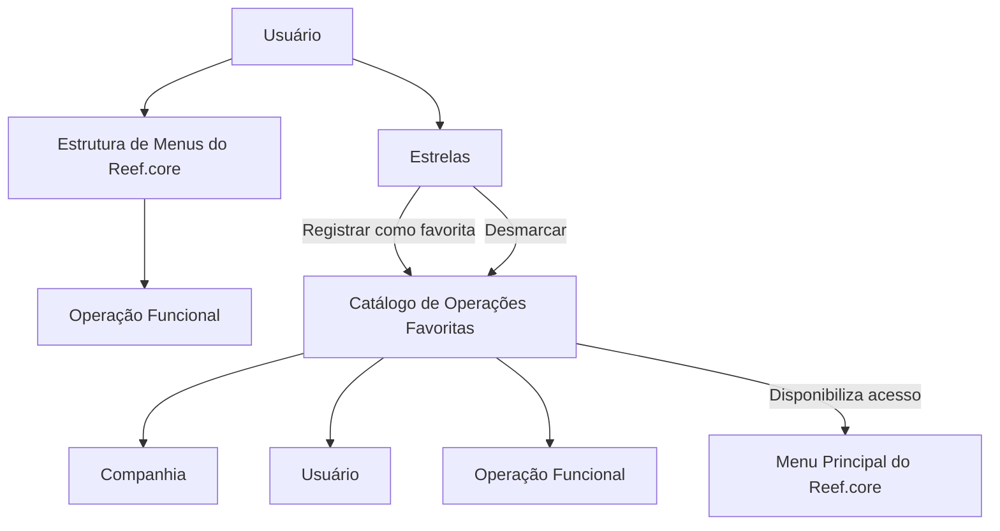

# Definição das Operações Favoritas do Reef.core

## 1. Metadados do Documento
- **Arquivo de Origem:** Não identificado no conteúdo fornecido
- **Tipo de Documento:** Especificação Funcional
- **Domínio / Sistema:** Reef.core
- **Público-Alvo:** Usuários funcionais, analistas funcionais e equipes responsáveis pela configuração do Reef.core
- **Data/Versão Identificada:** Não identificada

---

## 2. Resumo Executivo & Contexto de Negócio

O documento define o conceito de **Operações Favoritas** no sistema **Reef.core**. A funcionalidade existe para reduzir o esforço de navegação pela estrutura de menus até uma Operação Funcional específica, especialmente quando essa operação é utilizada de forma recorrente por um usuário.

O objetivo funcional é permitir que o Reef.core registre quais são as Operações Funcionais mais habituais de cada Usuário. Após o registro, a Operação Funcional passa a estar disponível como uma opção de acesso no menu principal do Reef.core.

O catálogo de Operações Favoritas associa três informações fundamentais: a Companhia sobre a qual o registro é realizado, o Usuário que seleciona a operação e a Operação Funcional marcada como favorita. O acionamento operacional ocorre por meio de estrelas, que permitem registrar ou desmarcar Operações Funcionais.

O documento também aponta vínculos com as diretrizes funcionais **Definição Programas** e **Definição Usuários**. A leitura desses documentos é recomendada para evitar interpretações incorretas decorrentes da análise isolada desta especificação.

---

## 3. Arquitetura, Componentes & Tecnologias Envolvidas

O conteúdo fornecido não descreve arquitetura técnica, protocolos, integrações, APIs, bancos de dados, microsserviços, métodos HTTP, contratos JSON, URLs, ambientes ou tecnologias de infraestrutura.

Os elementos funcionais identificados são:

- **Reef.core:** sistema no qual o catálogo de Operações Favoritas é registrado e utilizado.
- **Estrutura de Menus do Reef.core:** mecanismo de navegação usado para localizar Operações Funcionais.
- **Menu Principal do Reef.core:** local em que uma Operação Funcional registrada como favorita passa a ser disponibilizada como acesso.
- **Catálogo de Operações Favoritas:** catálogo que registra a associação entre Companhia, Usuário e Operação Funcional.
- **Usuário:** entidade que seleciona e registra uma Operação Funcional como favorita.
- **Companhia:** atributo que identifica a companhia sobre a qual o registro das operações preferidas é realizado.
- **Operação Funcional:** operação identificada e registrada como favorita.
- **Estrelas:** elemento de interação utilizado para registrar ou desmarcar Operações Funcionais.
- **Definição Programas / Definição Usuários:** documentos funcionais vinculados e recomendados para consulta.



**Nota de Análise:** o diagrama representa exclusivamente o fluxo funcional explicitamente descrito. O documento não detalha persistência de dados, regras de autorização, comportamento de interface além do uso de estrelas, nem componentes técnicos internos do Reef.core.

---

## 4. Regras de Negócio, Especificações Funcionais & Processos

### 4.1. Objetivo funcional

O Reef.core possui a capacidade de registrar quais Operações Funcionais são mais habituais para seus Usuários. A finalidade desse registro é fornecer um acesso rápido aos Programas ou Operações mais utilizados.

### 4.2. Problema endereçado

A navegação através da estrutura de Menus do Reef.core até a localização de uma Operação Funcional pode ser tediosa ou representar uma pequena perda de tempo. O catálogo de Operações Favoritas busca minimizar esse esforço para Operações Funcionais utilizadas habitualmente.

### 4.3. Registro de uma Operação Favorita

Para registrar uma Operação Funcional como favorita no Reef.core:

1. O Usuário identifica uma Operação Funcional no sistema.
2. O Usuário utiliza a estrela correspondente à Operação Funcional.
3. A Operação Funcional é registrada no catálogo de Operações Favoritas.
4. O registro é realizado no contexto de uma Companhia.
5. A Operação Funcional registrada passa a aparecer como uma opção de acesso no menu principal do Reef.core.

### 4.4. Desmarcação de uma Operação Favorita

Para remover a condição de favorita de uma Operação Funcional:

1. O Usuário utiliza a estrela da Operação Funcional previamente registrada.
2. A ação desmarca a Operação Funcional.
3. O documento não detalha o comportamento posterior da Operação Funcional no menu principal após a desmarcação.

### 4.5. Atributos funcionais do catálogo

O catálogo de Operações Favoritas contém os seguintes atributos identificados:

- **Companhia:** contém o código da companhia sobre a qual é realizado o registro das operações preferidas do Usuário.
- **Usuário:** identifica o Usuário que seleciona e registra a operação no Reef.core.
- **Operação Funcional:** identifica a Operação Funcional registrada como favorita.

### 4.6. Documentação relacionada

O documento recomenda a leitura das seguintes diretrizes e documentos funcionais para evitar interpretações incorretas:

- Definição Programas.
- Definição Usuários.

### 4.7. Restrições declaradas

A seção de perguntas frequentes informa que não há restrições identificadas para o uso e a definição do Catálogo de Operações Favoritas do Reef.core, apresentando a resposta **“N/A”**.

---

## 5. Tabelas de Parâmetros, Ambientes e Estruturas de Dados

| Item / Parâmetro | Descrição / Função | Tipo / Valores / Formato | Ambiente / Observações |
| :--- | :--- | :--- | :--- |
| Reef.core | Sistema que permite registrar Operações Funcionais habituais dos Usuários. | Sistema corporativo | O documento não informa versão, URL ou ambiente. |
| Catálogo de Operações Favoritas | Catálogo que registra as operações preferidas de um Usuário. | Catálogo funcional | Associado a Companhia, Usuário e Operação Funcional. |
| Companhia | Código da companhia sobre a qual é realizado o registro de operações preferidas. | Código de companhia | O formato do código não é especificado. |
| Usuário | Identifica quem seleciona e registra uma Operação Funcional como favorita. | Identificador de Usuário | O formato do identificador não é especificado. |
| Operação Funcional | Operação registrada como favorita pelo Usuário. | Identificação de operação funcional | O formato, código e catálogo de valores não são especificados. |
| Estrelas | Mecanismo de interação para registrar ou desmarcar Operações Funcionais. | Elemento visual de interface | O documento não detalha estado visual, permissões ou confirmação de ação. |
| Menu Principal do Reef.core | Menu no qual a Operação Funcional registrada aparece como opção de acesso. | Componente de navegação | O documento não define posição, ordenação ou quantidade máxima de favoritos. |
| Estrutura de Menus do Reef.core | Caminho de navegação padrão para localizar uma Operação Funcional. | Estrutura de navegação | A funcionalidade de favoritos reduz a necessidade de percorrer essa estrutura. |
| Definição Programas | Documento funcional relacionado. | Diretriz / documento funcional | Leitura recomendada. Conteúdo não fornecido. |
| Definição Usuários | Documento funcional relacionado. | Diretriz / documento funcional | Leitura recomendada. Conteúdo não fornecido. |

---

## 6. Bateria de Perguntas & Respostas para RAG (FAQ Sintético)

### P1: Qual é o objetivo das Operações Favoritas no Reef.core?
**R:** O objetivo é permitir que o Reef.core registre as Operações Funcionais mais habituais de cada Usuário, disponibilizando essas operações como opções de acesso no menu principal e reduzindo a necessidade de navegar repetidamente pela estrutura de menus.

### P2: Qual problema operacional o Catálogo de Operações Favoritas resolve?
**R:** O Catálogo de Operações Favoritas reduz o esforço de navegação pela estrutura de Menus do Reef.core quando um Usuário precisa acessar Operações Funcionais utilizadas com frequência.

### P3: Quais atributos compõem o registro de uma Operação Favorita no Reef.core?
**R:** O documento identifica três atributos: Companhia, Usuário e Operação Funcional. A Companhia informa o código da companhia do registro; o Usuário identifica quem selecionou a operação; e a Operação Funcional identifica a operação registrada como favorita.

### P4: Como uma Operação Funcional é marcada como favorita?
**R:** A marcação é realizada ao pulsar sobre as estrelas associadas à Operação Funcional. Essa ação registra a Operação Funcional como favorita no Reef.core.

### P5: Como uma Operação Funcional deixa de ser favorita?
**R:** A desmarcação também é realizada pulsando sobre as estrelas. O documento informa que as estrelas permitem registrar ou desmarcar as Operações Funcionais, mas não detalha os efeitos de interface ou de persistência após a desmarcação.

### P6: Onde uma Operação Funcional favorita aparece após seu registro?
**R:** Após o registro, a Operação Funcional passa a aparecer como uma opção de acesso no menu principal do Reef.core.

### P7: O registro de Operações Favoritas considera a Companhia?
**R:** Sim. O atributo Companhia contém o código da companhia sobre a qual está sendo realizado o registro das operações preferidas do Usuário.

### P8: O documento estabelece restrições para a utilização do Catálogo de Operações Favoritas?
**R:** Não. Na pergunta frequente sobre restrições para uso e definição do Catálogo de Operações Favoritas do Reef.core, o documento responde “N/A”.

### P9: Quais documentos devem ser consultados junto com a definição de Operações Favoritas?
**R:** O documento recomenda consultar as diretrizes e documentos funcionais “Definição Programas” e “Definição Usuários”, pois a leitura isolada da definição de Operações Favoritas pode conduzir a interpretações incorretas.

### P10: O documento descreve APIs, métodos HTTP ou contratos JSON para Operações Favoritas?
**R:** Não. O conteúdo fornecido descreve apenas o comportamento funcional da marcação e desmarcação de Operações Funcionais. Não há detalhamento de APIs, métodos HTTP, contratos JSON, bancos de dados ou integrações técnicas.

---

## 7. Glossário de Termos, Siglas & Conceitos-Chave

- **Reef.core:** sistema no qual é definido e utilizado o recurso de Operações Favoritas.
- **Operações Favoritas:** Operações Funcionais habituais de um Usuário registradas para acesso rápido.
- **Operação Funcional:** operação identificada no Reef.core e passível de ser registrada como favorita.
- **Catálogo de Operações Favoritas:** catálogo que armazena o registro de Operações Funcionais favoritas no contexto de Companhia e Usuário.
- **Companhia:** atributo que contém o código da companhia relacionada ao registro de operações preferidas.
- **Usuário:** entidade que seleciona, registra ou desmarca uma Operação Funcional como favorita.
- **Menu Principal:** menu do Reef.core no qual as Operações Funcionais registradas são disponibilizadas como opção de acesso.
- **Estrutura de Menus:** organização de menus do Reef.core utilizada para navegação até Operações Funcionais.
- **Estrelas:** elementos de interface usados para registrar ou desmarcar Operações Funcionais.
- **Definição Programas:** documento funcional vinculado, cuja leitura é recomendada.
- **Definição Usuários:** documento funcional vinculado, cuja leitura é recomendada.
- **N/A:** resposta apresentada pelo documento para a existência de restrições no uso e definição do Catálogo de Operações Favoritas.

---

## 8. Notas Críticas, Riscos & Limitações

- O documento não identifica o nome do arquivo de origem, data, versão, autor ou responsável funcional.
- O documento não informa regras de autorização: não está definido se todos os Usuários podem marcar qualquer Operação Funcional como favorita.
- O documento não estabelece limite máximo de Operações Favoritas por Usuário ou por Companhia.
- O documento não especifica o comportamento após a desmarcação de uma Operação Funcional, além de informar que a ação é realizada pelas estrelas.
- O documento não detalha persistência, modelo físico de dados, chaves, relacionamentos, APIs, integrações, logs, auditoria ou tratamento de erros.
- O documento não define se as Operações Favoritas são exclusivas por Usuário, por Companhia, por sessão ou por outro escopo adicional.
- O documento referencia “Definição Programas” e “Definição Usuários”, mas o conteúdo desses documentos não foi fornecido. Portanto, suas regras não podem ser inferidas.
- A terceira página não contém conteúdo textual funcional adicional; foi classificada como página em branco ou contendo somente elementos visuais/imagem.

---

## 9. Conteúdo Bruto Estruturado (Referência Fiel)

```text
--- [PÁGINA 1 DE 3] ---

DEFINICIÓN de las OPERACIONES FAVORITAS
de Reef.core
Contexto
En ocasiones la navegación a lo largo de la estructura de Menús de Reef.core hasta llegar al lugar
concreto en el que se encuentre una Operación Funcional puede ser algo tedioso o una pequeña
pérdida de tiempo por lo que es deseable contar con un 'acceso rápido' a los Programas u
Operaciones usualmente más utilizados.
Objetivo
Funcionalmente, Reef.core cuenta con la posibilidad de registrar en Reef.core cuales son las
operaciones funcionales más habituales de los Usuarios.
Propiedades Operativas
Propiedades Operativas
Compañía
Este atributo del catálogo contiene el código de la compañía sobre la que se está realizando el
registro de las operaciones preferidas del Usuario.
Usuario
 /
 CF
Home Solutions APIs Documentation Zeus
EN

--- [PÁGINA 2 DE 3] ---

Esta Propiedad identifica al Usuario que selecciona y registra en Reef.core la operación para que de
aquí en adelante aparezca como opción de acceso en el menú principal de Reef.core.
Operación Funcional
Esta propiedad del catálogo identifica la operación funcional registrada como favorita.
Pulsando sobre las estrellas se registran o desmarcan las Operaciones Funcionales.
Vínculos
Relación de Directrices y Documentos funcionales cuya lectura recomendada para evitar que la
interpretación aislada del presente documento pueda conducir a error.
Definición Programas
Definición Usuarios
Preguntas frecuentes
(1) ¿Existe alguna restricción que tenga que ser tomada en cuenta en el uso y definición del Catálogo
de Operaciones Favoritas de Reef.core?
N/A
Consejo:

--- [PÁGINA 3 DE 3] ---

[Página em branco ou apenas elementos visuais/imagem]
```
