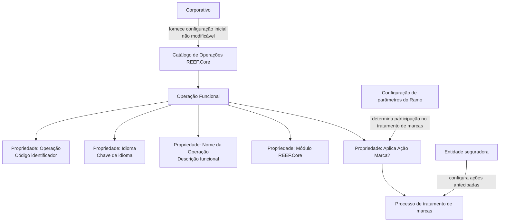

# Definição das Operações do Módulo REEF.Core

## 1. Metadados do Documento
- **Arquivo de Origem:** Não identificado no conteúdo fornecido
- **Tipo de Documento:** Especificação Funcional
- **Domínio / Sistema:** REEF.Core
- **Público-Alvo:** Desenvolvedores, Arquitetos, Analistas Funcionais, Operação e Negócio
- **Data/Versão Identificada:** Não identificada

---

## 2. Resumo Executivo & Contexto de Negócio

O documento define propriedades do catálogo de Operações do sistema REEF.Core. Nesse catálogo, as Operações são identificadas como fluxos operativos habilitados no sistema. A definição centraliza atributos que permitem identificar, descrever, classificar e configurar cada Operação Funcional.

Cada Operação possui um código identificador, um idioma de configuração, uma descrição funcional e uma associação a um módulo do REEF.Core. A nomenclatura da descrição funcional deve seguir uma regra explícita: iniciar com um verbo em letra maiúscula e manter o restante do nome em letras minúsculas.

O catálogo também contém o atributo **“¿Aplica Acción Marca?”**, utilizado para determinar se uma Operação deve ser considerada no processo de marcas configurado por uma entidade seguradora. Esse atributo somente faz sentido quando os parâmetros do Ramo determinam a participação do Ramo no processo de tratamento de marcas.

A configuração inicial do catálogo é fornecida pelo Corporativo e não pode ser modificada. Portanto, o catálogo possui uma limitação operacional relevante: equipes locais ou usuárias do sistema não podem alterar as informações inicialmente configuradas pelo Corporativo.

---

## 3. Arquitetura, Componentes & Tecnologias Envolvidas

O conteúdo fornecido menciona o sistema **REEF.Core**, seu catálogo de definição de Operações, módulos funcionais, configuração de parâmetros de Ramo, entidades seguradoras e o processo de tratamento de marcas.

Não há tecnologias de implementação, protocolos, URLs, ambientes, contratos de API, banco de dados ou detalhes de microsserviços explicitados no conteúdo. O texto também apresenta referências a “Home Solutions APIs Documentation Zeus”, mas não explica a relação desse item com o catálogo de Operações do REEF.Core.



**Nota de Análise:** O documento não detalha a estrutura técnica de persistência do catálogo, interfaces de administração, perfis de acesso, serviços de integração ou contratos JSON/API.

---

## 4. Regras de Negócio, Especificações Funcionais & Processos

### 4.1. Catálogo de Operações

1. O REEF.Core possui um catálogo de definição.
2. O catálogo identifica as Operações habilitadas no sistema.
3. As Operações são tratadas funcionalmente como fluxos operativos.
4. Cada Operação deve possuir propriedades operativas descritas pelo documento.

### 4.2. Identificação da Operação

1. A propriedade **Operação** contém o código identificador da Operação Funcional.
2. O documento não define a estrutura, o tamanho, a máscara ou exemplos de valores para o código identificador.
3. O código identifica a Operação Funcional no catálogo.

### 4.3. Configuração de Idioma

1. A propriedade **Idioma** contém a chave do idioma usado na configuração da Operação.
2. O documento apresenta como exemplos de idiomas: espanhol, inglês e turco.
3. O documento não especifica se a chave do idioma utiliza códigos padronizados, como ISO 639, nem informa formatos obrigatórios.

### 4.4. Nome da Operação

1. A propriedade **Nome de la Operación** representa a descrição funcional da Operação.
2. O nome deve respeitar a nomenclatura do REEF.Core.
3. A nomenclatura exige que a descrição funcional comece com um verbo em letra maiúscula.
4. Os demais caracteres da descrição funcional devem estar em letras minúsculas.
5. O documento não fornece um exemplo textual completo de Nome da Operação, apesar de indicar a existência de uma seção “Ejemplo”.

### 4.5. Módulo REEF.Core

1. A propriedade **Módulo Reef.core** determina o módulo do REEF.Core ao qual a Operação pertence.
2. A propriedade também representa o módulo no qual a Operação está inscrita funcionalmente.
3. O documento não lista módulos existentes do REEF.Core.

### 4.6. Aplicação de Ação Marca

1. O atributo **¿Aplica Acción Marca?** determina se uma Operação é contemplada no processo de marcas.
2. O processo de marcas é configurado pela entidade seguradora.
3. A Operação pode ser considerada como uma das possíveis **ações antecipadas** do processo de marcas.
4. A definição do atributo para a Operação somente tem sentido quando a configuração dos parâmetros do Ramo determina que o Ramo participará do processo de tratamento de marcas.
5. O documento não descreve valores possíveis para o atributo, regras de precedência, responsáveis pela configuração ou efeitos operacionais concretos de cada valor.

### 4.7. Governança e Imutabilidade da Configuração Inicial

1. A configuração inicial do catálogo é fornecida pelo Corporativo.
2. A informação da configuração inicial não pode ser modificada.
3. Essa condição deve ser considerada em qualquer procedimento operacional relacionado à manutenção do catálogo.

### 4.8. Documentos Relacionados

O documento recomenda a leitura de diretrizes e documentos funcionais relacionados para evitar interpretações isoladas que possam conduzir a erro:

- Definição de Programas.
- Definição de Marcas.
- Perguntas frequentes.

---

## 5. Tabelas de Parâmetros, Ambientes e Estruturas de Dados

| Item / Parâmetro | Descrição / Função | Tipo / Valores / Formato | Ambiente / Observações |
| :--- | :--- | :--- | :--- |
| Catálogo de Operações | Catálogo do REEF.Core que identifica Operações habilitadas no sistema como fluxos operativos. | Catálogo funcional. | Configuração inicial fornecida pelo Corporativo. |
| Operação | Contém o código identificador da Operação Funcional. | Código identificador; formato não informado. | Não há exemplos de códigos no documento. |
| Idioma | Contém a chave do idioma empregada na configuração da Operação. | Chave de idioma; exemplos: espanhol, inglês e turco. | Não é informado padrão de codificação do idioma. |
| Nome da Operação | Indica a descrição funcional da Operação. | Deve iniciar com verbo em maiúscula; demais caracteres em minúsculas. | Deve respeitar a nomenclatura do REEF.Core. |
| Módulo REEF.Core | Determina o módulo do REEF.Core ao qual a Operação pertence funcionalmente. | Nome ou identificação de módulo; formato não informado. | O documento não lista os módulos disponíveis. |
| ¿Aplica Acción Marca? | Determina se a Operação é considerada no processo de marcas. | Valores não especificados. | Só é relevante se os parâmetros do Ramo determinarem participação no tratamento de marcas. |
| Configuração dos parâmetros do Ramo | Determina se o Ramo entra no processo de tratamento de marcas. | Configuração de parâmetros; valores não informados. | Condição necessária para atribuir sentido ao atributo “¿Aplica Acción Marca?”. |
| Processo de tratamento de marcas | Processo configurado pela entidade seguradora, com possíveis ações antecipadas. | Processo funcional; detalhes não informados. | Referenciado pela propriedade “¿Aplica Acción Marca?”. |
| Configuração inicial | Informação inicial do catálogo. | Não modificável. | Fornecida pelo Corporativo. |
| Definição de Programas | Documento funcional relacionado recomendado. | Referência documental. | Sem conteúdo adicional no material fornecido. |
| Definição de Marcas | Documento funcional relacionado recomendado. | Referência documental. | Sem conteúdo adicional no material fornecido. |
| Perguntas frequentes | Material complementar recomendado. | Referência documental. | O documento inclui uma pergunta frequente sobre circunstâncias operativas do catálogo. |

---

## 6. Bateria de Perguntas & Respostas para RAG (FAQ Sintético)

### P1: Qual é a finalidade do catálogo de Operações do REEF.Core?
**R:** O catálogo de Operações do REEF.Core identifica as Operações habilitadas no sistema. Funcionalmente, essas Operações são consideradas fluxos operativos e são definidas por propriedades como código identificador, idioma, nome, módulo e aplicação de Ação Marca.

### P2: O que representa a propriedade “Operação” no catálogo do REEF.Core?
**R:** A propriedade “Operação” contém o código identificador da Operação Funcional. O documento não informa a estrutura, o padrão, a máscara ou exemplos desse código.

### P3: Como o idioma de uma Operação é configurado no REEF.Core?
**R:** O atributo “Idioma” contém a chave do idioma utilizada na configuração da Operação. O documento cita espanhol, inglês e turco como exemplos, mas não define um padrão técnico ou formato obrigatório para a chave de idioma.

### P4: Qual regra de nomenclatura deve ser aplicada ao Nome da Operação?
**R:** O Nome da Operação deve representar a descrição funcional da Operação e seguir a nomenclatura do REEF.Core: deve começar com um verbo em letra maiúscula e ter o restante do nome em letras minúsculas.

### P5: Para que serve a propriedade “Módulo REEF.Core”?
**R:** A propriedade “Módulo REEF.Core” define o módulo do REEF.Core ao qual a Operação pertence. Em termos funcionais, identifica o módulo em que a Operação está inscrita.

### P6: O que determina o atributo “¿Aplica Acción Marca?”?
**R:** O atributo “¿Aplica Acción Marca?” determina se a Operação será contemplada no processo de marcas configurado pela entidade seguradora como uma possível ação antecipada. O documento não informa os valores permitidos pelo atributo.

### P7: Em que condição o atributo “¿Aplica Acción Marca?” é relevante?
**R:** O atributo somente assume significado quando os parâmetros do Ramo estão configurados para que o Ramo entre no processo de tratamento de marcas. Sem essa configuração de participação do Ramo, o documento indica que a definição do atributo para a Operação não faz sentido.

### P8: A configuração inicial do catálogo de Operações pode ser alterada?
**R:** Não. A pergunta frequente do documento afirma que a configuração inicial é fornecida pelo Corporativo e que suas informações não podem ser modificadas.

### P9: Quais documentos devem ser consultados para evitar interpretações isoladas do catálogo?
**R:** O documento recomenda a leitura de “Definición Programas”, “Definición de Marcas” e “Preguntas frecuentes”. Essas referências são indicadas para reduzir o risco de uma interpretação isolada e incorreta do conteúdo.

### P10: O documento detalha APIs, métodos HTTP ou contratos de integração do REEF.Core?
**R:** Não. O material menciona “Home Solutions APIs Documentation Zeus”, mas não descreve APIs, métodos HTTP, endpoints, contratos JSON, mecanismos de integração, tecnologias de implementação ou ambientes.

---

## 7. Glossário de Termos, Siglas & Conceitos-Chave

- **REEF.Core:** Sistema citado como detentor do catálogo de definição de Operações e de módulos funcionais.
- **Operação Funcional:** Operação identificada pelo catálogo do REEF.Core e entendida como um fluxo operativo habilitado no sistema.
- **Catálogo de Operações:** Estrutura funcional que reúne as definições de Operações habilitadas no REEF.Core.
- **Fluxo Operativo:** Forma como o documento caracteriza funcionalmente uma Operação.
- **Idioma:** Chave usada na configuração da Operação; o documento cita espanhol, inglês e turco como exemplos.
- **Módulo REEF.Core:** Módulo funcional do REEF.Core ao qual uma Operação pertence.
- **Ação Marca / Acción Marca:** Possível ação antecipada dentro do processo de marcas configurado pela entidade seguradora.
- **Processo de Marcas:** Processo configurado por uma entidade seguradora e relacionado ao tratamento de marcas.
- **Ramo:** Elemento cujos parâmetros podem determinar sua entrada no processo de tratamento de marcas.
- **Corporativo:** Origem da configuração inicial do catálogo, cuja informação não pode ser modificada.
- **Entidade Seguradora:** Entidade que configura o processo de marcas mencionado no documento.
- **Home Solutions APIs Documentation Zeus:** Referência textual presente no documento, sem detalhamento de significado, responsabilidade ou relação técnica com o REEF.Core.

---

## 8. Notas Críticas, Riscos & Limitações

- A configuração inicial do catálogo é fornecida pelo Corporativo e não pode ser modificada; isso limita procedimentos locais de manutenção ou correção de informações.
- O documento recomenda consultar documentos complementares — Definição de Programas, Definição de Marcas e Perguntas frequentes — pois a interpretação isolada pode conduzir a erro.
- Não há especificação dos valores possíveis para o atributo **“¿Aplica Acción Marca?”**.
- Não há definição da estrutura do código identificador da propriedade **Operação**.
- Não há lista de módulos do REEF.Core, nem critérios de associação entre uma Operação e um módulo.
- Não há detalhes técnicos sobre banco de dados, interfaces, APIs, integrações, métodos HTTP, contratos JSON, controle de acesso, auditoria ou ambientes.
- **Nota de Análise:** O documento menciona “Home Solutions APIs Documentation Zeus”, porém não fornece contexto suficiente para determinar seu papel ou vínculo com o catálogo de Operações do REEF.Core.
- **Nota de Análise:** Apesar de existir a indicação “Ejemplo” após a regra de nomenclatura do Nome da Operação, o conteúdo extraído não apresenta um exemplo completo e verificável.

---

## 9. Conteúdo Bruto Estruturado (Referência Fiel)

```text
--- [PÁGINA 1 DE 2] ---

DEFINICIÓN de las OPERACIONES de
REEF.CORE
Objetivo
Funcionalmente, Reef.core cuenta con un catálogo de definición en el que se identifican las
Operaciones (como flujos operativos) que están habilitadas en el Sistema.
Propiedades Operativas
Propiedades Operativas
Operación
Esta propiedad contiene el código identificador de la Operación Funcional.
Idioma
Este Atributo contiene la clave del idioma empleado en la configuración de la Operación como por
ejemplo: español, inglés, turco, ...
Nombre de la Operación
Esta propiedad indica la descripción funcional de la operación respetando la nomenclatura de
Reef.core, es decir, comenzando con un verbo en mayúsculas y el resto en minúsculas.
Ejemplo:
 /
 CF
Home Solutions APIs Documentation Zeus
EN


--- [PÁGINA 2 DE 2] ---

Módulo Reef.core
Esta Propiedad determina el módulo de Reef.core al que pertenece la Operación, o dicho de otro
modo, el módulo en el que funcionalmente se inscribe la Operación.
¿Aplica Acción Marca?
Este atributo del catálogo determina si la Operación se contempla o no en el proceso de marcas
configurado por la entidad aseguradora como una de las posibles 'acciones anticipadas' que se han
de realizar.
Siempre y cuando se haya determinado en la configuración de los parámetros del Ramo el que
éste vaya a entrar en el proceso de tratamiento de marcas, toma sentido la definición del atributo
para la Operación.
Vínculos
Relación de Directrices y Documentos funcionales cuya lectura recomendada para evitar que la
interpretación aislada del presente documento pueda conducir a error.
Definición Programas
Definición de Marcas
Preguntas frecuentes
(1) ¿Existe alguna circunstancia operativa que deba ser tomada en consideración sobre este
catálogo?
La configuración inicial viene dada desde el Corporativo y no puede modificarse su información.
```
