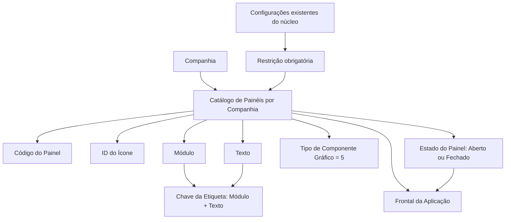

# Definição de Painéis de Informação por Companhia no Reef.core

## 1. Metadados do Documento
- **Arquivo de Origem:** `Não identificado`
- **Tipo de Documento:** Especificação Técnica / Procedimento Funcional
- **Domínio / Sistema:** Reef.core
- **Público-Alvo:** Desenvolvedores, Arquitetos, Analistas Funcionais
- **Data/Versão Identificada:** Não identificada

---

## 2. Resumo Executivo & Contexto de Negócio

O documento descreve a definição de painéis de informação por companhia no sistema Reef.core. Os painéis organizam visualmente informações relacionadas a objetos do domínio, incluindo apólices, sinistros, recibos e riscos.

A finalidade operacional dos painéis de informação é agrupar dados de natureza semelhante em blocos visuais. Essa organização busca facilitar e agilizar tanto a captura quanto a consulta das informações no frontal da aplicação.

Funcionalmente, o Reef.core permite codificar a relação entre painéis de informação do sistema em um repositório específico. A definição de cada painel contém propriedades que determinam companhia, código, ícone, módulo, texto, tipo de componente gráfico e estado de apresentação.

O documento estabelece restrições explícitas para o uso do catálogo: as configurações existentes dos painéis pertencentes ao núcleo da aplicação devem ser respeitadas obrigatoriamente.

---

## 3. Arquitetura, Componentes & Tecnologias Envolvidas

Os componentes e conceitos identificados são:

- **Reef.core:** sistema no qual os painéis de informação são definidos e utilizados.
- **Catálogo de Painéis por Companhia:** catálogo que registra a definição dos painéis para uma companhia.
- **Repositório de informação específico:** local funcionalmente destinado à codificação da relação de painéis do sistema.
- **Frontal da aplicação:** interface na qual o painel é exibido aberto ou fechado.
- **Núcleo da aplicação:** conjunto de painéis cuja configuração existente deve ser preservada.
- **Departamento de Arquitetura:** área que define diretrizes para o número de ícone representativo do programa.
- **Objetos de negócio citados:** Pólizas, Siniestros, Recibos e Riesgos.



> **Nota de Análise:** O documento não detalha tecnologia de implementação, modelo físico do repositório, APIs, métodos HTTP, contratos JSON, bancos de dados ou mecanismos de persistência.

---

## 4. Regras de Negócio, Especificações Funcionais & Processos

1. Os painéis de informação do Reef.core devem estruturar e organizar visualmente informações de objetos como apólices, sinistros, recibos e riscos.
2. Os painéis devem agrupar informações de natureza semelhante em blocos de informação.
3. A organização por painéis deve facilitar e agilizar a captura de informações.
4. A organização por painéis deve facilitar e agilizar a consulta de informações.
5. O Reef.core possui a capacidade funcional de codificar a relação entre painéis de informação do sistema em um repositório de informação específico.
6. A propriedade **Companhia** deve conter o código da companhia para a qual a definição do painel está sendo realizada.
7. A propriedade **Código do Painel** deve identificar o código do painel de informação no sistema.
8. A propriedade **ID Icono** deve identificar o número do ícone que representa o programa, conforme diretrizes do Departamento de Arquitetura.
9. A propriedade **Módulo** deve determinar o módulo da etiqueta do painel de informação.
10. A propriedade **Texto** deve determinar o identificador da etiqueta do painel de informação.
11. A combinação das propriedades **Módulo + Texto** forma a chave das etiquetas.
12. A propriedade **Tipo de componente gráfico** determina o tipo de componente associado que identifica o painel de informação.
13. No catálogo citado, a propriedade **Tipo de componente gráfico** deve possuir sempre o valor `5`.
14. A propriedade **Panel Colapsado** determina como o painel é apresentado no frontal da aplicação: **Abierto** ou **Cerrado**.
15. É obrigatório respeitar as configurações existentes dos painéis pertencentes ao núcleo da aplicação.
16. O documento recomenda a leitura do documento funcional relacionado **Definición Programas**, pois a interpretação isolada pode conduzir a erro.

---

## 5. Tabelas de Parâmetros, Ambientes e Estruturas de Dados

| Item / Parâmetro | Descrição / Função | Tipo / Valores / Formato | Ambiente / Observações |
| :--- | :--- | :--- | :--- |
| Companhia | Código da companhia sobre a qual a definição do painel de informação é realizada. | Código de companhia; formato não detalhado. | Catálogo de Painéis por Companhia. |
| Código do Painel | Identifica o código do painel de informação no sistema. | Código; formato não detalhado. | Reef.core. |
| ID Icono | Identifica o número do ícone que representa o programa. | Número de ícone; valores não detalhados. | Deve seguir diretrizes do Departamento de Arquitetura. |
| Módulo | Determina o módulo da etiqueta do painel de informação. | Identificador de módulo; formato não detalhado. | Compõe a chave da etiqueta com o campo Texto. |
| Texto | Determina o identificador da etiqueta do painel de informação. | Identificador de etiqueta; formato não detalhado. | Compõe a chave da etiqueta com o campo Módulo. |
| Módulo + Texto | Chave das etiquetas. | Dupla de valores. | Regra funcional explícita. |
| Tipo de componente gráfico | Determina o tipo de componente associado que identifica o painel. | Valor fixo `5`. | O valor deve ser sempre `5` neste catálogo. |
| Panel Colapsado | Define a forma de apresentação do painel no frontal da aplicação. | `Abierto` ou `Cerrado`. | Estado visual do painel. |
| Configurações de painéis do núcleo | Configurações preexistentes dos painéis do núcleo da aplicação. | Não detalhado. | Devem ser respeitadas obrigatoriamente. |
| Documento relacionado | Documento funcional recomendado para evitar interpretação isolada incorreta. | `Definición Programas`. | Vínculo documental. |

---

## 6. Bateria de Perguntas & Respostas para RAG (FAQ Sintético)

### P1: Qual é a finalidade dos painéis de informação no Reef.core?
**R:** Os painéis de informação no Reef.core têm a finalidade de estruturar e organizar visualmente as informações de objetos como apólices, sinistros, recibos e riscos em blocos de informação de natureza semelhante. Essa organização facilita e agiliza a captura e a consulta de informações.

### P2: Onde é codificada a relação entre os painéis de informação do sistema?
**R:** O Reef.core possui a possibilidade funcional de codificar a relação entre os painéis de informação do sistema em um repositório de informação específico. O documento não detalha a tecnologia, a localização ou a estrutura desse repositório.

### P3: O que representa o atributo Companhia na definição de um painel?
**R:** O atributo Companhia contém o código da companhia para a qual a definição do painel de informação está sendo realizada.

### P4: Qual é a função do Código do Painel?
**R:** O Código do Painel identifica o código do painel de informação no sistema Reef.core. O documento não especifica formato, tamanho ou convenção de nomenclatura para esse código.

### P5: Como é definida a chave das etiquetas de painel de informação?
**R:** A chave das etiquetas é formada pela dupla das propriedades Módulo e Texto. O Módulo determina o módulo da etiqueta, enquanto o Texto determina o identificador da etiqueta.

### P6: Qual valor deve ser utilizado para o Tipo de componente gráfico?
**R:** No catálogo de painéis por companhia descrito no documento, a propriedade Tipo de componente gráfico deve ter sempre o valor `5`.

### P7: O que determina a propriedade Panel Colapsado?
**R:** A propriedade Panel Colapsado define como o painel aparecerá no frontal da aplicação. Os valores informados são `Abierto`, para painel aberto, e `Cerrado`, para painel fechado.

### P8: Existem restrições para definir painéis por companhia no Reef.core?
**R:** Sim. É obrigatório respeitar as configurações existentes dos painéis do núcleo da aplicação ao utilizar e definir o Catálogo de Painéis por Companhia do Reef.core.

### P9: Qual é a função do ID Icono?
**R:** O ID Icono identifica o número do ícone que representa o programa. A escolha desse número deve estar de acordo com as diretrizes do Departamento de Arquitetura.

### P10: Qual documento relacionado deve ser consultado para evitar interpretações incorretas?
**R:** O documento recomenda a leitura de **Definición Programas**. A recomendação existe porque a interpretação isolada do documento de definição de painéis por companhia pode conduzir a erro.

---

## 7. Glossário de Termos, Siglas & Conceitos-Chave

- **Reef.core:** Sistema citado como responsável pela definição e utilização dos painéis de informação.
- **Painel de Informação:** Bloco visual que organiza informações de objetos de natureza semelhante.
- **Catálogo de Painéis por Companhia:** Catálogo utilizado para definir painéis de informação associados a uma companhia.
- **Companhia:** Entidade identificada por código e utilizada como contexto da definição do painel.
- **Código do Painel:** Identificador do painel de informação no sistema.
- **ID Icono:** Número do ícone que representa o programa conforme diretrizes arquiteturais.
- **Módulo:** Propriedade que determina o módulo da etiqueta do painel.
- **Texto:** Propriedade que determina o identificador da etiqueta do painel.
- **Módulo + Texto:** Dupla que forma a chave das etiquetas.
- **Tipo de componente gráfico:** Propriedade que identifica o tipo de componente associado ao painel; possui valor fixo `5` no catálogo descrito.
- **Panel Colapsado:** Propriedade que define se o painel será apresentado aberto ou fechado no frontal da aplicação.
- **Frontal da aplicação:** Interface em que o painel de informação é exibido.
- **Núcleo da aplicação:** Conjunto de painéis com configurações existentes que devem ser preservadas.
- **Pólizas:** Objeto de informação citado no contexto do Reef.core.
- **Siniestros:** Objeto de informação citado no contexto do Reef.core.
- **Recibos:** Objeto de informação citado no contexto do Reef.core.
- **Riesgos:** Objeto de informação citado no contexto do Reef.core.

---

## 8. Notas Críticas, Riscos & Limitações

- As configurações dos painéis existentes no núcleo da aplicação devem ser respeitadas obrigatoriamente.
- A interpretação isolada deste documento pode conduzir a erro; o documento **Definición Programas** é indicado como leitura relacionada.
- Não são detalhados contratos de integração, APIs, persistência, modelo de dados, autenticação, autorização ou procedimentos de implantação.
- Não são especificados formatos para código de companhia, código de painel, módulo, texto ou ID de ícone.
- Não são fornecidos critérios adicionais para decidir entre os estados `Abierto` e `Cerrado`.
- Não são apresentados valores alternativos para o tipo de componente gráfico, pois o documento determina exclusivamente o valor `5`.

---

## 9. Conteúdo Bruto Estruturado (Referência Fiel)

```text
--- [PÁGINA 1 DE 2] ---

DEFINICIÓN de los PANELES de información
por Compañía

Contexto
La finalidad básica del uso de paneles de información en el ámbito de Reef.core es estructurar y
organizar visualmente la información de los objetos (Pólizas, Siniestros, Recibos, Riesgos, ...) en
bloques de información de similar naturaleza facilitando y agilizando de esta manera su captura y
su consulta.

Objetivo
Funcionalmente, Reef.core cuenta con la posibilidad de codificar la relación de paneles de
información del Sistema en un repositorio de información específico.

Propiedades Operativas
Propiedades Operativas

Compañía
Este atributo del catálogo contiene el código de la compañía sobre la que se está realizando la
definición del panel de Información.

Código del Panel
Esta propiedad de la definición identifica el código del panel de información en el sistema.

 /
CF
Home Solutions APIs Documentation Zeus
EN


--- [PÁGINA 2 DE 2] ---

ID Icono
Este atributo identifica el número del icono que representa el programa de acuerdo con las directrices
del Departamento de Arquitectura.

Módulo
Esta propiedad determina el módulo de la etiqueta del panel de información.

Texto
Esta propiedad determina el identificador de la etiqueta del panel de información.
La dupla Módulo + Texto conforman la clave de las etiquetas.

Tipo de componente gráfico
Esta propiedad determina el tipo de componente asociado que identifica el panel de información.
En este catálogo, el valor de esta propiedad siempre tendrá el valor 5.

Panel Colapsado
Esta propiedad en la configuración del panel de información determina la manera en la que
aparecerá el mismo en el frontal de la aplicación: Abierto o Cerrado.

Vínculos
Relación de Directrices y Documentos funcionales cuya lectura recomendada para evitar que la
interpretación aislada del presente documento pueda conducir a error.

Definición Programas

Preguntas frecuentes
(1) ¿Existe alguna restricción que tenga que ser tomada en cuenta en el uso y definición del Catálogo
de Paneles por compañía de Reef.core?

Se han de respetar obligatoriamente las configuraciones existentes de los paneles del núcleo de la
aplicación.
```
