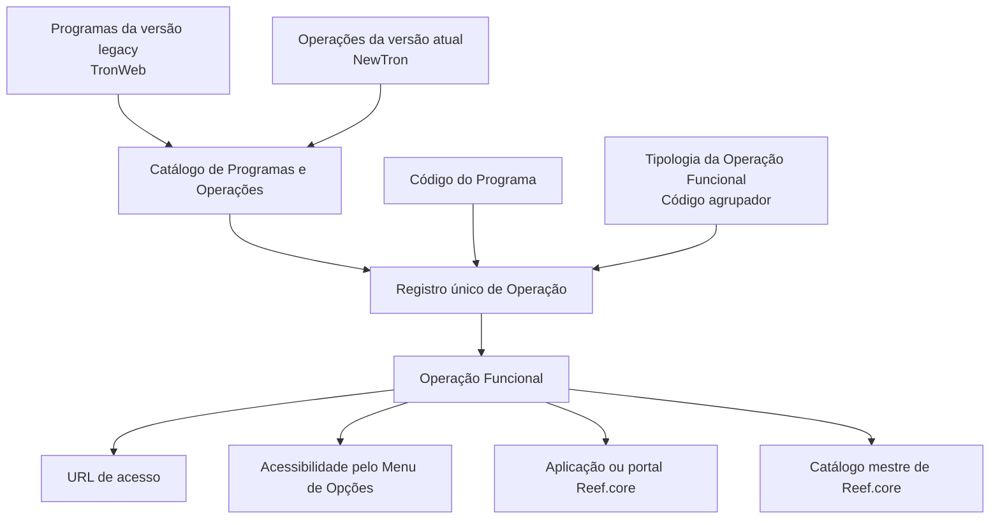

# Definição de Programas TronWeb e Operações NewTron no Reef.core

## 1. Metadados do Documento
- **Arquivo de Origem:** Não identificado no conteúdo fornecido
- **Tipo de Documento:** Especificação Técnica / Funcional
- **Domínio / Sistema:** Reef.core, TronWeb, NewTron
- **Público-Alvo:** Desenvolvedores, Arquitetos, Operação e Negócio
- **Data/Versão Identificada:** Não identificada

---

## 2. Resumo Executivo & Contexto de Negócio

O documento descreve o catálogo de informações utilizado pelo núcleo do sistema Reef.core para identificar a relação entre os Programas da versão legada, denominada TronWeb, e as Operações da versão atual, denominada NewTron.

O catálogo é entregue inicialmente às instalações com conteúdo que não pode ser apagado nem alterado. O texto não especifica o processo de distribuição, manutenção ou governança desse catálogo após a entrega inicial.

Cada registro de operação é determinado de forma única pela combinação entre o código do programa e a tipologia da operação funcional, também denominada código agrupador. O código do programa também concentra permissões de acesso a operações ou opções de menu do Reef.core.

As propriedades operativas descritas abrangem URL de acesso, identificador da operação funcional, acessibilidade pelo menu de opções e aplicação ou portal do Reef.core a partir do qual a operação é executada.

---

## 3. Arquitetura, Componentes & Tecnologias Envolvidas

| Componente / Termo | Papel descrito |
| :--- | :--- |
| **Reef.core** | Sistema cujo núcleo permite relacionar programas legados e operações atuais. |
| **TronWeb** | Versão legacy de Reef.core; fornece programas que podem ter permissões herdadas. |
| **NewTron** | Versão atual de Reef.core; contém operações relacionadas aos programas TronWeb. |
| **Catálogo de Programas e Operações** | Catálogo específico que identifica a relação entre Programas TronWeb e Operações NewTron. |
| **Programa** | Elemento cujo código pode conter permissões de acesso a uma operação ou opção de menu. |
| **Operação Funcional** | Operação identificada por código agrupador, URL, identificador, acessibilidade pelo menu e aplicação de execução. |
| **Menu de Opções de Reef.core** | Menu a partir do qual uma operação pode ou não ser acessível diretamente. |
| **Aplicação / Portal Reef.core** | Código da aplicação ou portal a partir do qual a operação funcional é executada. |
| **Catálogo mestre de Reef.core** | Fonte da relação de possíveis valores do identificador da operação funcional. |



> **Nota de Análise:** O documento não detalha tecnologias de implementação, protocolos, métodos HTTP, contratos JSON, bases de dados, ambientes, servidores, logs ou mecanismos de integração entre TronWeb e NewTron.

---

## 4. Regras de Negócio, Especificações Funcionais & Processos

### 4.1 Relação entre Programas TronWeb e Operações NewTron

1. O núcleo do sistema Reef.core possui a capacidade funcional de identificar a relação entre:
   - Programas da versão legacy de Reef.core, denominada **TronWeb**.
   - Operações da versão atual de Reef.core, denominada **NewTron**.
2. A identificação é realizada por meio de um catálogo de informações específico.
3. O catálogo é entregue inicialmente às instalações com conteúdo que:
   - Não pode ser apagado.
   - Não pode ser alterado.

### 4.2 Código do Programa

1. O código do programa contém as permissões para acessar:
   - Uma operação do Reef.core.
   - Opções de menu do Reef.core.
2. Quando houver herança de permissões de um programa existente no legado Reef.core / TronWeb:
   - O código utilizado deve ser o código do programa existente no legado.
3. Quando a operação possuir permissões próprias para Reef.core:
   - O código do programa deve coincidir com o valor do atributo que determina a operação.

### 4.3 Tipologia da Operação Funcional

1. A tipologia da operação funcional é o tipo de operação funcional ou código agrupador.
2. A tipologia, em conjunto com o código do programa, identifica um único registro para determinar a operação.

### 4.4 URL de Acesso

1. A propriedade URL de acesso contém a URL utilizada para acessar a operação funcional.
2. O documento não informa formato de URL, domínios, protocolos, parâmetros ou ambientes associados.

### 4.5 Operação

1. A propriedade Operação contém o identificador da operação funcional.
2. O identificador deve estar de acordo com a relação de possíveis valores existente no catálogo mestre de Reef.core.

### 4.6 Acessibilidade pelo Menu de Opções

1. A marca “Operação acessível desde o Menu de Opções” indica se a operação pode ser acessada diretamente pelo menu do Reef.core.
2. O documento não define os valores técnicos dessa marca, como `true/false`, `sim/não` ou códigos equivalentes.

### 4.7 Aplicação

1. A propriedade Aplicação contém o código da aplicação ou portal de Reef.core.
2. O código identifica a aplicação ou portal a partir do qual a operação funcional é executada.

### 4.8 Vínculos Documentais

1. O documento cita vínculos com diretrizes e documentos funcionais.
2. A leitura desses vínculos é recomendada para evitar interpretações incorretas resultantes da análise isolada deste documento.
3. O conteúdo fornecido menciona “Definición de Programas” e “Preguntas frecuentes”, mas não apresenta o conteúdo integral desses materiais.

### 4.9 Recomendação Corporativa

O documento responde à pergunta sobre recomendações para uso e configuração do Catálogo de Programas e Operações existentes no Reef.core informando que não foi considerada nenhuma recomendação pelo Centro Corporativo.

---

## 5. Tabelas de Parâmetros, Ambientes e Estruturas de Dados

| Item / Parâmetro | Descrição / Função | Tipo / Valores / Formato | Ambiente / Observações |
| :--- | :--- | :--- | :--- |
| Catálogo de Programas e Operações | Identifica a relação entre Programas TronWeb e Operações NewTron. | Catálogo específico de informação. | Entregue inicialmente às instalações; conteúdo não pode ser apagado ou alterado. |
| Código do Programa | Contém permissões de acesso a operação ou opções de menu do Reef.core. | Código de programa. | Se houver herança de permissões do legado, deve usar o código do programa TronWeb. Para permissões próprias, deve coincidir com o valor do atributo que determina a operação. |
| Tipologia da Operação Funcional | Identifica o tipo de operação funcional ou código agrupador. | Tipo de operação funcional / código agrupador. | Em conjunto com o código do programa, identifica um único registro. |
| URL de acesso | Contém a URL de acesso à operação funcional. | URL. | Sem formato, domínio, protocolo ou ambiente especificados. |
| Operação | Contém o identificador da operação funcional. | Identificador de operação. | Deve respeitar a relação de valores possíveis do catálogo mestre de Reef.core. |
| Operação acessível desde o Menu de Opções | Indica se a operação pode ser acessada diretamente pelo menu do Reef.core. | Marca não detalhada. | O documento não apresenta valores permitidos. |
| Aplicação | Contém o código da aplicação ou portal Reef.core que executa a operação. | Código de aplicação ou portal. | Não são listados códigos de aplicações ou portais. |
| Vínculos | Relaciona diretrizes e documentos funcionais de leitura recomendada. | Referência documental. | Não há URLs, identificadores ou conteúdo detalhado dos vínculos. |
| Recomendação do Centro Corporativo | Recomendação para uso e configuração do catálogo. | Não aplicável. | Nenhuma recomendação foi considerada pelo Centro Corporativo. |

---

## 6. Bateria de Perguntas & Respostas para RAG (FAQ Sintético)

### P1: Qual é o objetivo do Catálogo de Programas e Operações no Reef.core?
**R:** O catálogo específico de informações identifica a relação entre os Programas da versão legacy de Reef.core, denominada TronWeb, e as Operações da versão atual de Reef.core, denominada NewTron.

### P2: O conteúdo inicial do Catálogo de Programas e Operações pode ser alterado ou apagado?
**R:** Não. O documento informa que o catálogo é entregue inicialmente às instalações com conteúdo que não pode ser apagado nem alterado.

### P3: Qual é a função do Código do Programa no Reef.core?
**R:** O Código do Programa contém os permissões para acessar uma operação ou opções de menu do Reef.core.

### P4: Qual código deve ser usado quando uma operação herda permissões de um programa TronWeb?
**R:** Quando houver herança de permissões de um programa existente no legado Reef.core, denominado TronWeb, deve ser utilizado o código desse programa legado.

### P5: Qual código deve ser usado quando uma operação possui permissões próprias no Reef.core?
**R:** Quando a operação tiver permissões próprias para Reef.core, o código do programa deve coincidir com o valor do atributo que determina a operação.

### P6: Como um registro de operação é identificado de forma única?
**R:** Um registro é identificado de forma única pela combinação entre o Código do Programa e a Tipologia da Operação Funcional, também descrita como tipo de operação funcional ou código agrupador.

### P7: De onde vêm os valores válidos para o identificador da operação funcional?
**R:** O identificador da operação funcional deve estar de acordo com a relação de possíveis valores existente no catálogo mestre de Reef.core.

### P8: O que indica a propriedade “Operação acessível desde o Menu de Opções”?
**R:** Essa marca indica se a operação funcional é acessível diretamente pelo Menu de Opções do Reef.core. O documento não especifica os valores técnicos possíveis para a marca.

### P9: O que representa a propriedade Aplicação?
**R:** A propriedade Aplicação contém o código da aplicação ou portal de Reef.core a partir do qual a operação funcional é executada.

### P10: O documento define URLs concretas, ambientes ou protocolos de acesso?
**R:** Não. O documento apenas afirma que a propriedade URL de acesso contém a URL da operação funcional; não apresenta URLs concretas, domínios, protocolos, portas ou ambientes.

### P11: Existem recomendações do Centro Corporativo para configurar o Catálogo de Programas e Operações?
**R:** Não. A seção de perguntas frequentes declara que não foi considerada nenhuma recomendação pelo Centro Corporativo.

### P12: Por que devem ser consultadas diretrizes e documentos funcionais vinculados?
**R:** A leitura é recomendada para evitar que a interpretação isolada do documento conduza a erro. O conteúdo fornecido não detalha os documentos vinculados.

---

## 7. Glossário de Termos, Siglas & Conceitos-Chave

- **Reef.core:** Sistema referido como contendo o núcleo capaz de identificar a relação entre programas legados e operações atuais.
- **TronWeb:** Versão legacy de Reef.core.
- **NewTron:** Versão atual de Reef.core.
- **Programa:** Elemento identificado por código e associado a permissões de acesso a operações ou opções de menu.
- **Operação Funcional:** Operação determinada por um registro identificado por Código do Programa e Tipologia da Operação Funcional.
- **Tipologia da Operação Funcional:** Tipo de operação funcional ou código agrupador.
- **Código Agrupador:** Código que, junto do Código do Programa, identifica um único registro de operação.
- **Catálogo Mestre de Reef.core:** Catálogo que contém a relação de valores possíveis para o identificador da operação funcional.
- **Menu de Opções:** Menu do Reef.core a partir do qual uma operação pode ser acessível diretamente.
- **Aplicação / Portal:** Aplicação ou portal Reef.core a partir do qual a operação funcional é executada.
- **Centro Corporativo:** Entidade mencionada como não tendo considerado recomendações para uso e configuração do catálogo.

---

## 8. Notas Críticas, Riscos & Limitações

- O catálogo entregue inicialmente contém informação que não pode ser apagada ou alterada; o documento não esclarece o procedimento para correção de dados, atualização de conteúdo ou tratamento de inconsistências.
- Não são especificados métodos HTTP, contratos de integração, formatos de payload, autenticação, autorização técnica, tecnologias de implementação ou persistência de dados.
- Não são fornecidos exemplos concretos de códigos de programas, tipologias, identificadores de operações, aplicações, portais ou URLs.
- Não há ambientes identificados, como desenvolvimento, homologação ou produção.
- A marca de acessibilidade pelo Menu de Opções é descrita funcionalmente, porém seus valores aceitos não são definidos.
- O documento recomenda a leitura de diretrizes e documentos funcionais relacionados, mas não fornece os respectivos conteúdos, identificadores ou endereços.
- O Centro Corporativo não estabeleceu recomendações para o uso e configuração do Catálogo de Programas e Operações.

---

## 9. Conteúdo Bruto Estruturado (Referência Fiel)

```text
--- [PÁGINA 1 DE 2] ---

DEFINICIÓN de PROGRAMAS TronWeb /
OPERACIONES NewTron
Objetivo
Funcionalmente, el núcleo del Sistema cuenta con la posibilidad de identificar la relación de los
Programas de la versión legacy de Reef.core (TronWeb) con las Operaciones de la Versión actual
de Reef.core (NewTron) en un catálogo de información específico que se entrega inicialmente a las
instalaciones con contenido que no se puede borrar o alterar.
Propiedades Operativas
Propiedades Operativas
Código del programa
Código del programa que contendrá los permisos para acceder a la operación o a las opciones de
menú de Reef.core.
En caso de heredar los permisos de algún programa ya existente en el Legacy de Reef.core
(TronWeb) deberá ser el código de dicho programa mientras que el el caso de tener permisos propios
para Reef.core deberá coincidir con el valor del atributo que determina la operación.
Tipología de la Operación Funcional
Este atributo contiene el tipo de operación funcional ó código agrupador que identifica, junto con el
atributo código del programa un único registro para determinar la Operación.
 / 
 CF
Home Solutions APIs Documentation Zeus
EN

--- [PÁGINA 2 DE 2] ---

URL de acceso
Esta propiedad contiene la url de acceso a la Operación Funcional.
Operación
Esta propiedad contiene el identificador de la operación funcional de acuerdo con la relación de
posibles valores existente en el catálogo maestro de Reef.core.
Operación accesible desde el Menú de Opciones
Esta marca indica si la operación es accesible directamente o no desde el Menú de Reef.core.
Aplicación
Esta Propiedad contiene el código de la aplicación o portal de Reef.core desde donde se ejecuta la
operación funcional.
Vínculos
Relación de Directrices y Documentos funcionales cuya lectura recomendada para evitar que la
interpretación aislada del presente documento pueda conducir a error.
Definición de Programas
Preguntas frecuentes
(1) ¿Existe alguna recomendación que pueda ser tomada en consideración en el uso y configuración
del Catálogo de Programas y Operaciones existentes en Reef.core?
No se ha considerado ninguna desde el Centro Corporativo.
Ejemplo:
```
