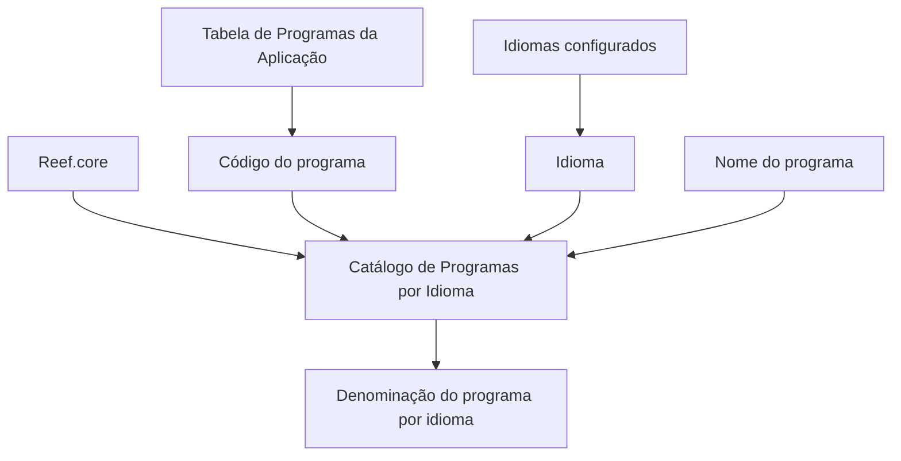

# Definição do Catálogo de Programas da Aplicação por Idioma no Reef.core

## 1. Metadados do Documento
- **Arquivo de Origem:** `Não identificado no conteúdo fornecido`
- **Tipo de Documento:** `Especificação Funcional`
- **Domínio / Sistema:** `Reef.core`
- **Público-Alvo:** `Não identificado explicitamente; conteúdo direcionado à configuração funcional da aplicação`
- **Data/Versão Identificada:** `Não identificada`

---

## 2. Resumo Executivo & Contexto de Negócio

O documento define a funcionalidade de denominação de programas do Reef.core conforme os idiomas configurados na aplicação. A funcionalidade utiliza um repositório de informação criado especificamente para manter a relação entre programas e suas denominações por idioma.

A definição do catálogo é composta por três propriedades operativas: código do programa, idioma e nome do programa. O código deve estar alinhado à configuração existente na tabela de Programas da Aplicação, enquanto o idioma identifica a língua usada para denominar o programa.

A principal restrição operacional declarada é o respeito obrigatório às configurações existentes no Catálogo de Programas por Idioma. O documento afirma que essa aderência é necessária para o correto funcionamento do núcleo da aplicação.

O conteúdo recomenda a leitura do documento relacionado “Definición de Programas”, pois a interpretação isolada da presente definição pode conduzir a erro. Não há detalhamento de contratos técnicos, métodos HTTP, estruturas JSON, infraestrutura, ambientes ou procedimentos de manutenção.

---

## 3. Arquitetura, Componentes & Tecnologias Envolvidas

Os elementos identificados no documento são:

| Componente / Conceito | Papel descrito |
| :--- | :--- |
| `Reef.core` | Aplicação cujo núcleo utiliza o Catálogo de Programas por Idioma. |
| Repositório de informação | Repositório criado especificamente para armazenar denominações de programas conforme idiomas configurados. |
| Tabela de Programas da Aplicação | Fonte de configuração existente à qual o código do programa deve corresponder. |
| Catálogo de Programas por Idioma | Catálogo cujas configurações devem ser obrigatoriamente respeitadas. |
| Idiomas configurados | Idiomas utilizados para definir a denominação dos programas, como espanhol, inglês e turco. |
| Definición de Programas | Documento funcional relacionado e recomendado para leitura. |



> **Nota de Análise:** O documento não descreve integrações, APIs, microsserviços, bases de dados específicas, protocolos ou tecnologias de implementação.

---

## 4. Regras de Negócio, Especificações Funcionais & Processos

1. O Reef.core possui a capacidade de denominar a relação de programas em função dos idiomas configurados na aplicação.
2. A relação de denominações por idioma é mantida em um repositório de informação criado especificamente para essa finalidade.
3. O **código do programa** identifica o código do programa do Reef.core conforme a configuração existente na tabela de Programas da Aplicação.
4. O **idioma** identifica a língua na qual o programa está sendo denominado.
5. Os exemplos de idiomas apresentados são espanhol, inglês e turco.
6. O **nome do programa** determina a denominação atribuída ao programa.
7. As configurações existentes no Catálogo de Programas por Idioma devem ser respeitadas obrigatoriamente.
8. O respeito às configurações do catálogo é necessário para o correto funcionamento do núcleo da aplicação.
9. A leitura do documento “Definición de Programas” é recomendada para evitar interpretações incorretas decorrentes da leitura isolada desta definição.

---

## 5. Tabelas de Parâmetros, Ambientes e Estruturas de Dados

| Item / Parâmetro | Descrição / Função | Tipo / Valores / Formato | Ambiente / Observações |
| :--- | :--- | :--- | :--- |
| Código do programa | Identifica o código do programa do Reef.core. | Código configurado na tabela de Programas da Aplicação. | Deve estar de acordo com a configuração existente. |
| Idioma | Identifica a língua usada para denominar o programa. | Códigos de idioma; exemplos: espanhol, inglês e turco. | Refere-se aos idiomas configurados na aplicação. |
| Nome do programa | Determina a denominação do programa. | Nome ou denominação do programa. | Associado ao código do programa e ao idioma. |
| Catálogo de Programas por Idioma | Mantém as configurações de denominação de programas por idioma. | Configurações existentes no catálogo. | Deve ser respeitado obrigatoriamente para o correto funcionamento do núcleo da aplicação. |
| Repositório de informação | Armazena a relação de programas conforme os idiomas configurados. | Não especificado. | Criado especificamente para esta funcionalidade. |
| Tabela de Programas da Aplicação | Mantém a configuração de referência dos códigos dos programas. | Não especificado. | Usada como referência para o código do programa. |

---

## 6. Bateria de Perguntas & Respostas para RAG (FAQ Sintético)

### P1: Qual é o objetivo do Catálogo de Programas por Idioma no Reef.core?
**R:** O Catálogo de Programas por Idioma permite denominar a relação de programas do Reef.core conforme os idiomas configurados na aplicação. As denominações são tratadas em um repositório de informação criado especificamente para essa finalidade.

### P2: Quais propriedades operativas compõem a definição de programas por idioma?
**R:** A definição contém três propriedades operativas: código do programa, idioma e nome do programa.

### P3: Como deve ser definido o código do programa no catálogo?
**R:** O código do programa deve identificar o código do programa do Reef.core de acordo com a configuração existente na tabela de Programas da Aplicação.

### P4: Qual é a finalidade da propriedade Idioma?
**R:** A propriedade Idioma identifica a língua na qual o programa está sendo denominado. O documento cita como exemplos códigos que identificam os idiomas espanhol, inglês e turco.

### P5: O que determina a propriedade Nome do programa?
**R:** A propriedade Nome do programa determina a denominação atribuída ao programa.

### P6: Existe alguma restrição para o uso e a definição do Catálogo de Programas por Idioma?
**R:** Sim. As configurações existentes no catálogo devem ser respeitadas obrigatoriamente, pois são necessárias para o correto funcionamento do núcleo da aplicação.

### P7: Qual documento relacionado deve ser consultado junto desta definição?
**R:** O documento recomenda a leitura de “Definición de Programas”, pois a interpretação isolada do documento atual pode conduzir a erro.

### P8: O documento especifica APIs, métodos HTTP ou contratos JSON do Reef.core?
**R:** Não. O conteúdo fornecido não detalha APIs, métodos HTTP, contratos JSON, integrações ou tecnologias de implementação.

### P9: O documento informa quais ambientes utilizam o Catálogo de Programas por Idioma?
**R:** Não. O conteúdo fornecido não apresenta ambientes, URLs, servidores, portas ou mapeamentos de implantação.

---

## 7. Glossário de Termos, Siglas & Conceitos-Chave

- **Reef.core:** Aplicação mencionada no documento, cujo núcleo depende do respeito às configurações existentes no Catálogo de Programas por Idioma.
- **Catálogo de Programas por Idioma:** Catálogo que reúne configurações para denominar programas conforme idiomas configurados na aplicação.
- **Código do programa:** Propriedade que identifica o código de um programa do Reef.core conforme a tabela de Programas da Aplicação.
- **Idioma:** Propriedade que identifica a língua utilizada para denominar um programa.
- **Nome do programa:** Propriedade que determina a denominação de um programa.
- **Tabela de Programas da Aplicação:** Configuração de referência para os códigos de programas.
- **Repositório de informação:** Repositório criado especificamente para manter a relação de denominações de programas conforme idiomas configurados.

---

## 8. Notas Críticas, Riscos & Limitações

- O documento estabelece que as configurações existentes no Catálogo de Programas por Idioma devem ser respeitadas obrigatoriamente.
- Configurações incompatíveis com o catálogo podem comprometer o correto funcionamento do núcleo da aplicação.
- A leitura isolada deste documento pode conduzir a interpretações incorretas; a leitura de “Definición de Programas” é recomendada.
- Não foram identificados detalhes sobre implementação técnica, persistência, interfaces, APIs, segurança, auditoria, responsáveis operacionais ou gestão de alterações.
- O trecho fornecido termina após a palavra “Ejemplo:” e não apresenta o conteúdo do exemplo citado.

---

## 9. Conteúdo Bruto Estruturado (Referência Fiel)

```text
--- [PÁGINA 1 DE 2] ---

DEFINICIÓN de los PROGRAMAS de la
Aplicación por Idioma
Objetivo
Funcionalmente, Reef.core cuenta con la facultad de denominar la relación de programas en función
de los idiomas configurados en la aplicación en un repositorio de información creado
específicamente.
Propiedades Operativas
Propiedades Operativas
Código del programa
Esta propiedad de la definición identifica el código del programa de Reef.core de acuerdo con la
configuración existente en la tabla de Programas de la Aplicación.
Idioma
Esta propiedad identifica el idioma en el que está denominando el programa, como por ejemplo con
los códigos que identifican los idiomas español, inglés, turco,...
Nombre del programa
Esta propiedad determina la denominación del programa.
 / 
 CF
Home Solutions APIs Documentation Zeus
EN


--- [PÁGINA 2 DE 2] ---

Vínculos
Relación de Directrices y Documentos funcionales cuya lectura recomendada para evitar que la
interpretación aislada del presente documento pueda conducir a error.
Definición de Programas
Preguntas frecuentes
(1) ¿Existe alguna restricción que tenga que ser tomada en cuenta en el uso y definición del Catálogo
de Programas por Idioma de Reef.core?
Se tienen que respetar obligatoriamente las configuraciones existentes en este catálogo para el
correcto funcionamiento del núcleo de la aplicación.
Ejemplo:
```
