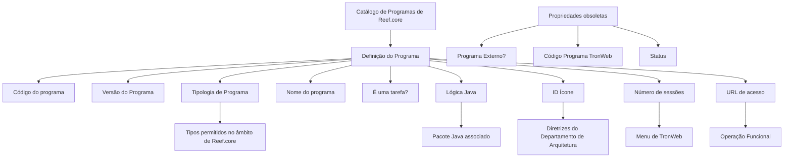
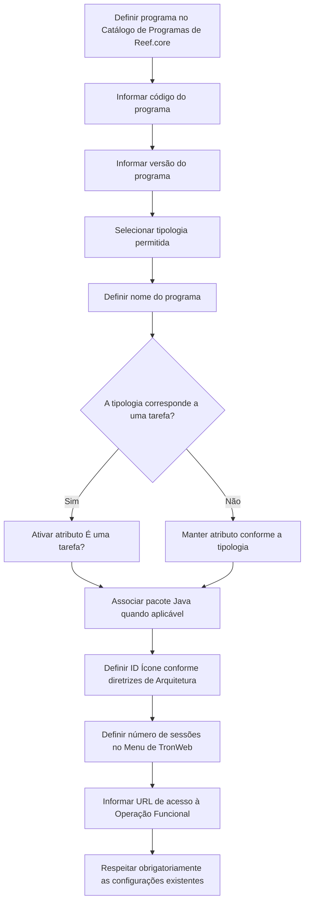

# Catálogo Mestre de Programas da Aplicação Reef.core — Definição, Propriedades Operativas e Restrições

## 1. Metadados do Documento
- **Arquivo de Origem:** Não identificado no conteúdo fornecido
- **Tipo de Documento:** Especificação Técnica / Manual Funcional
- **Domínio / Sistema:** Reef.core; TronWeb
- **Público-Alvo:** Desenvolvedores, Arquitetos, Equipes de Configuração e Operação
- **Data/Versão Identificada:** Não identificada

---

## 2. Resumo Executivo & Contexto de Negócio

O documento descreve a definição e a configuração dos programas da aplicação **Reef.core** por meio de um catálogo mestre de informações criado especificamente para essa finalidade. O catálogo centraliza propriedades que identificam, classificam e operacionalizam programas no núcleo da aplicação.

As propriedades documentadas incluem identificação do programa, versão, tipologia, nome, indicação de tarefa, pacote Java associado, ícone, número de sessões simultâneas no menu de TronWeb e URL de acesso à operação funcional. A tipologia de programa possui uma lista fechada de valores contemplados e permitidos no âmbito do Reef.core.

O documento também identifica propriedades descontinuadas e obsoletas: **Programa Externo?**, **Código Programa TronWeb** e **Status**. Essas propriedades não podem ser utilizadas nem reutilizadas para finalidades locais, embora sejam preservadas no catálogo por razões históricas.

A principal restrição operacional explicitada é a obrigatoriedade de respeitar as configurações já existentes no Catálogo de Programas de Reef.core. Alterações incompatíveis ou desrespeito às configurações existentes podem comprometer o correto funcionamento do núcleo da aplicação.

---

## 3. Arquitetura, Componentes & Tecnologias Envolvidas

### Componentes e conceitos identificados

| Componente / Tecnologia | Papel descrito no documento |
| :--- | :--- |
| **Reef.core** | Núcleo da aplicação que possui um catálogo mestre para configuração de programas. |
| **Catálogo de Programas de Reef.core** | Catálogo mestre que armazena a definição e as propriedades operativas dos programas. |
| **Programa** | Elemento configurado no catálogo, identificado por código, versão, tipologia, nome e demais atributos. |
| **TronWeb** | Ambiente mencionado para o menu de programas e para uma propriedade histórica obsoleta de código de programa. |
| **Java** | Tecnologia associada ao atributo “Lógica Java”, que determina o pacote Java associado ao programa. |
| **Departamento de Arquitetura** | Área cujas diretrizes determinam a representação de ícones dos programas. |
| **Operação Funcional** | Destino acessado pela URL configurada na propriedade “URL de acesso”. |

### Fluxo de configuração e acesso identificado



> **Nota de Análise:** O documento não detalha a implementação técnica do Catálogo de Programas de Reef.core, tais como persistência, interfaces, métodos HTTP, contratos JSON, permissões de alteração ou mecanismos de publicação de configurações.

---

## 4. Regras de Negócio, Especificações Funcionais & Processos

### 4.1 Finalidade do catálogo

1. Reef.core possui a capacidade de configurar programas por meio de um catálogo mestre de informações.
2. O catálogo foi criado especificamente para a definição dos programas de Reef.core.
3. As configurações existentes nesse catálogo devem ser obrigatoriamente respeitadas para garantir o correto funcionamento do núcleo da aplicação.

### 4.2 Identificação e classificação do programa

1. **Código do programa**
   - Identifica o código do programa em Reef.core.

2. **Versão do Programa**
   - Identifica a versão do programa.

3. **Tipologia de Programa**
   - Determina o tipo de programa fonte.
   - A tipologia deve corresponder a um dos tipos contemplados e permitidos no âmbito de Reef.core.

4. **Nome do programa**
   - Determina a denominação do programa.

### 4.3 Comportamento operacional

1. **É uma tarefa?**
   - Quando a tipologia do programa for uma tarefa, o atributo correspondente do catálogo de configuração deve estar ativado.

2. **Lógica Java**
   - Determina o pacote Java associado ao programa.

3. **ID Ícone**
   - Identifica o número do ícone que representa o programa.
   - A identificação do ícone deve seguir as diretrizes do Departamento de Arquitetura.

4. **Número de sessões**
   - Determina quantas sessões do programa podem permanecer abertas simultaneamente no Menu de TronWeb.

5. **URL de acesso**
   - Contém a URL de acesso à Operação Funcional.

### 4.4 Propriedades descontinuadas e obsoletas

| Propriedade | Situação | Regra atual | Comportamento histórico documentado |
| :--- | :--- | :--- | :--- |
| **Programa Externo?** | Descontinuada e obsoleta | Não pode ser usada ou reutilizada para qualquer propósito de âmbito local. | Indicava originalmente que o programa poderia ser executado externamente. |
| **Código Programa TronWeb** | Descontinuada e obsoleta | Não pode ser usada ou reutilizada para qualquer propósito de âmbito local. | Indicava originalmente o nome do programa em TronWeb. |
| **Status** | Descontinuada e obsoleta | Não pode ser usada ou reutilizada para qualquer propósito de âmbito local. | Determinava originalmente o estado do programa, como Ativo ou Inativo. |

### 4.5 Processo conceitual de definição de programa



> **Nota de Análise:** O documento não detalha quais atributos são obrigatórios, os formatos dos códigos, a sintaxe da URL, as regras de unicidade, os valores permitidos para número de sessões ou o procedimento de aprovação de alterações no catálogo.

---

## 5. Tabelas de Parâmetros, Ambientes e Estruturas de Dados

### 5.1 Propriedades do Catálogo de Programas

| Item / Parâmetro | Descrição / Função | Tipo / Valores / Formato | Ambiente / Observações |
| :--- | :--- | :--- | :--- |
| Código do programa | Identifica o código do programa em Reef.core. | Não detalhado. | Reef.core. |
| Versão do Programa | Identifica a versão do programa. | Não detalhado. | Reef.core. |
| Tipologia de Programa | Determina o tipo de programa fonte, segundo os tipos permitidos. | Valores definidos no catálogo de tipologias. | Reef.core. |
| Nome do programa | Determina a denominação do programa. | Não detalhado. | Reef.core. |
| É uma tarefa? | Deve estar ativado quando a tipologia do programa for uma tarefa. | Atributo de ativação; formato não detalhado. | Catálogo de configuração. |
| Lógica Java | Determina o pacote Java associado ao programa. | Pacote Java; formato não detalhado. | Reef.core / Java. |
| Programa Externo? | Propriedade historicamente usada para indicar execução externa. | Descontinuada e obsoleta. | Não usar nem reutilizar localmente. |
| Código Programa TronWeb | Propriedade historicamente usada para indicar o nome do programa em TronWeb. | Descontinuada e obsoleta. | Não usar nem reutilizar localmente. |
| ID Ícone | Identifica o número do ícone que representa o programa. | Número do ícone. | Deve seguir diretrizes do Departamento de Arquitetura. |
| Número de sessões | Define quantas sessões do programa podem permanecer abertas ao mesmo tempo. | Número; intervalo não detalhado. | Menu de TronWeb. |
| Status | Propriedade historicamente usada para indicar o estado do programa. | Descontinuada e obsoleta. | Não usar nem reutilizar localmente. |
| URL de acesso | Contém a URL de acesso à Operação Funcional. | URL; sintaxe não detalhada. | Operação Funcional. |

### 5.2 Tipologias de Programa permitidas

| Código | Tipologia conforme o documento | Observações |
| :--- | :--- | :--- |
| DLG | Dialogo | Valor possível para o atributo Tipologia de Programa. |
| DLM | Dialogo modal | Valor possível para o atributo Tipologia de Programa. |
| FRM | Frame | Valor possível para o atributo Tipologia de Programa. |
| HTM | Html | Valor possível para o atributo Tipologia de Programa. |
| INP | Forms | Valor possível para o atributo Tipologia de Programa. |
| JAV | Java | Valor possível para o atributo Tipologia de Programa. |
| MEN | Menu | Valor possível para o atributo Tipologia de Programa. |
| PCO | Cobol | Valor possível para o atributo Tipologia de Programa. |
| PL | Pl/sql | Valor possível para o atributo Tipologia de Programa. |
| PNL | Panel | Valor possível para o atributo Tipologia de Programa. |
| SH | Shell | Valor possível para o atributo Tipologia de Programa. |
| TAR | Tarea | Valor possível para o atributo Tipologia de Programa. Quando aplicável, o atributo “É uma tarefa?” deve ser ativado. |
| VEP | Visual café | Valor possível para o atributo Tipologia de Programa. |
| WIN | Windows | Valor possível para o atributo Tipologia de Programa. |
| WTW | WebTronweb | Valor possível para o atributo Tipologia de Programa. |
| GP | Generador producto | Valor possível para o atributo Tipologia de Programa. |

### 5.3 Referências documentais relacionadas

| Referência | Descrição |
| :--- | :--- |
| Definición de Programas | Documento relacionado listado na seção de vínculos. |
| Preguntas frecuentes | Documento relacionado listado na seção de vínculos. |

---

## 6. Bateria de Perguntas & Respostas para RAG (FAQ Sintético)

### P1: Qual é a finalidade do Catálogo de Programas de Reef.core?
**R:** O Catálogo de Programas de Reef.core é um catálogo mestre de informações criado especificamente para configurar e definir os programas do núcleo da aplicação Reef.core.

### P2: Quais propriedades identificam um programa no Catálogo de Programas de Reef.core?
**R:** O documento identifica o programa por meio do Código do programa, Versão do Programa, Tipologia de Programa e Nome do programa. Também existem propriedades operativas, como Lógica Java, ID Ícone, Número de sessões e URL de acesso.

### P3: Quais valores são permitidos para a Tipologia de Programa em Reef.core?
**R:** Os valores listados são DLG (Dialogo), DLM (Dialogo modal), FRM (Frame), HTM (Html), INP (Forms), JAV (Java), MEN (Menu), PCO (Cobol), PL (Pl/sql), PNL (Panel), SH (Shell), TAR (Tarea), VEP (Visual café), WIN (Windows), WTW (WebTronweb) e GP (Generador producto).

### P4: O que deve ocorrer quando um programa possuir tipologia de tarefa?
**R:** Quando a tipologia do programa for uma tarefa, o atributo “É uma tarefa?” no catálogo de configuração deve estar ativado em conformidade.

### P5: Qual é a função do atributo Lógica Java?
**R:** O atributo Lógica Java determina o pacote Java associado ao programa configurado no Catálogo de Programas de Reef.core.

### P6: A propriedade “Programa Externo?” pode ser utilizada em uma nova configuração local?
**R:** Não. A funcionalidade da propriedade “Programa Externo?” está descontinuada e obsoleta no catálogo de programas do núcleo de Reef.core. O documento determina que ela não pode ser usada ou reutilizada para nenhum propósito de âmbito local.

### P7: Para que servia historicamente a propriedade “Código Programa TronWeb”?
**R:** Originalmente, a propriedade “Código Programa TronWeb” indicava o nome do programa em TronWeb. Entretanto, essa propriedade está descontinuada e obsoleta e não pode ser usada nem reutilizada localmente.

### P8: Como o ícone de um programa deve ser definido?
**R:** O atributo ID Ícone identifica o número do ícone que representa o programa. A definição deve obedecer às diretrizes do Departamento de Arquitetura.

### P9: O que controla o atributo Número de sessões?
**R:** O atributo Número de sessões determina quantas sessões de um programa podem permanecer abertas ao mesmo tempo no Menu de TronWeb.

### P10: Qual é a finalidade da URL de acesso configurada no catálogo?
**R:** A propriedade URL de acesso contém a URL usada para acessar a Operação Funcional do programa.

### P11: O atributo Status pode ser usado para controlar se um programa está ativo ou inativo?
**R:** Não. Embora o atributo Status originalmente determinasse estados como Ativo ou Inativo, sua funcionalidade está descontinuada e obsoleta. Ele não pode ser usado ou reutilizado para propósitos locais.

### P12: Existe alguma restrição obrigatória para uso e definição do Catálogo de Programas de Reef.core?
**R:** Sim. As configurações existentes no Catálogo de Programas de Reef.core devem ser obrigatoriamente respeitadas para garantir o correto funcionamento do núcleo da aplicação.

---

## 7. Glossário de Termos, Siglas & Conceitos-Chave

- **Reef.core:** Núcleo da aplicação mencionado no documento, que dispõe de um catálogo para configuração de programas.
- **Catálogo de Programas:** Catálogo mestre de informações destinado à definição e configuração dos programas de Reef.core.
- **Programa:** Elemento configurável no catálogo, com código, versão, tipologia, nome e propriedades operativas.
- **Tipologia de Programa:** Classificação do tipo de programa fonte, determinada pelos valores permitidos no âmbito de Reef.core.
- **TronWeb:** Ambiente referido no contexto do Menu de TronWeb e da propriedade histórica Código Programa TronWeb.
- **Operação Funcional:** Operação acessada pela URL configurada na propriedade URL de acesso.
- **Lógica Java:** Atributo que determina o pacote Java associado ao programa.
- **ID Ícone:** Atributo que identifica o número do ícone representativo do programa.
- **DLG:** Dialogo.
- **DLM:** Dialogo modal.
- **FRM:** Frame.
- **HTM:** Html.
- **INP:** Forms.
- **JAV:** Java.
- **MEN:** Menu.
- **PCO:** Cobol.
- **PL:** Pl/sql.
- **PNL:** Panel.
- **SH:** Shell.
- **TAR:** Tarea.
- **VEP:** Visual café.
- **WIN:** Windows.
- **WTW:** WebTronweb.
- **GP:** Generador producto.

---

## 8. Notas Críticas, Riscos & Limitações

1. As configurações existentes no Catálogo de Programas de Reef.core devem ser respeitadas obrigatoriamente. O documento associa essa obrigatoriedade ao correto funcionamento do núcleo da aplicação.
2. As propriedades **Programa Externo?**, **Código Programa TronWeb** e **Status** estão descontinuadas e obsoletas. Seu uso ou reutilização para objetivos locais é explicitamente proibido.
3. O documento não fornece formatos, tamanhos, obrigatoriedade, valores padrão ou regras de unicidade para Código do programa, Versão do Programa, Nome do programa, Lógica Java, ID Ícone, Número de sessões e URL de acesso.
4. O documento não descreve processos de criação, alteração, validação, aprovação, auditoria ou publicação das configurações do catálogo.
5. O documento não detalha contratos técnicos, APIs, mecanismos de integração, repositórios de código, bancos de dados, permissões de usuários ou dependências entre programas.
6. O documento menciona vínculos para “Definición de Programas” e “Preguntas frecuentes”, mas não apresenta o conteúdo desses materiais relacionados.

---

## 9. Conteúdo Bruto Estruturado (Referência Fiel)

```text
--- [PÁGINA 1 DE 4] ---

DEFINICIÓN de los PROGRAMAS de la
Aplicación
Objetivo
Funcionalmente, Reef.core cuenta con la facultad de configurar los programas de Reef.core en un
catálogo maestro de información creado específicamente para ello.
Propiedades Operativas
Propiedades Operativas
Código del programa
Esta propiedad de la definición identifica el código del programa en Reef.core.
Versión del Programa
Esta propiedad de la definición identifica la versión del Programa.
Tipología de Programa
Esta propiedad en la configuración del catálogo determina el tipo de programa fuente de acuerdo
con los tipos contemplados y permitidos en el ámbito de Reef.core.
 / 
 CF
Home Solutions APIs Documentation Zeus
EN


--- [PÁGINA 2 DE 4] ---

Los posibles valores del atributo son:
(DLG) Dialogo
(DLM) Dialogo modal
(FRM) Frame
(HTM) Html
(INP) Forms
(JAV) Java
(MEN) Menu
(PCO) Cobol
(PL) Pl/sql
(PNL) Panel
(SH) Shell
(TAR) Tarea
(VEP) Visual café
(WIN) Windows
(WTW) WebTronweb
(GP) Generador producto
Nombre del programa
Esta propiedad determina la denominación del programa.
Es una tarea?
En el supuesto que la tipología del programa fuera una tarea, este atributo del catálogo de
configuración debería estar activado en consecuencia.
Lógica Java
Este atributo determina el paquete Java asociado.
Programa Externo?
La funcionalidad de esta propiedad está descontinuada y obsoleta en la configuración del catálogo de
programas del núcleo de Reef.core por lo que no se puede usar o reutilizar para ningún propósito de
ámbito local.
Ejemplo:


--- [PÁGINA 3 DE 4] ---

NOTA: Originalmente la definición de esta propiedad en el catálogo le indicaba al sistema que el
programa podía ser ejecutado externamente.
Código Programa TronWeb
La funcionalidad de esta propiedad está descontinuada y obsoleta en la configuración del catálogo de
programas del núcleo de Reef.core por lo que no se puede usar o reutilizar para ningún propósito de
ámbito local.
NOTA: Originalmente el valor de esta propiedad en el catálogo indicaba el nombre del programa en
TronWeb.
ID Icono
Este atributo identifica el número del icono que representa el programa de acuerdo con las directrices
del Departamento de Arquitectura.
Número de sesiones
Esta propiedad determina el número de sesiones del Programa que pueden estar abiertas al mismo
tiempo en el Menú de TronWeb.
Status
La funcionalidad de esta propiedad está descontinuada y obsoleta en la configuración del catálogo de
programas del núcleo de Reef.core por lo que no se puede usar o reutilizar para ningún propósito de
ámbito local.
NOTA: Originalmente el valor de esta propiedad en el catálogo determinaba el estado en el que se
encontraba el programa: Activo, Inactivo, ...
URL de acceso
Esta propiedad contiene la url de acceso a la Operación Funcional.
Vínculos
Relación de Directrices y Documentos funcionales cuya lectura recomendada para evitar que la
interpretación aislada del presente documento pueda conducir a error.
Definición de Programas
Preguntas frecuentes


--- [PÁGINA 4 DE 4] ---

(1) ¿Existe alguna restricción que tenga que ser tomada en cuenta en el uso y definición del Catálogo
de Programas de Reef.core?
Se tienen que respetar obligatoriamente las configuraciones existentes en este catálogo para el
correcto funcionamiento del núcleo de la aplicación.
```
