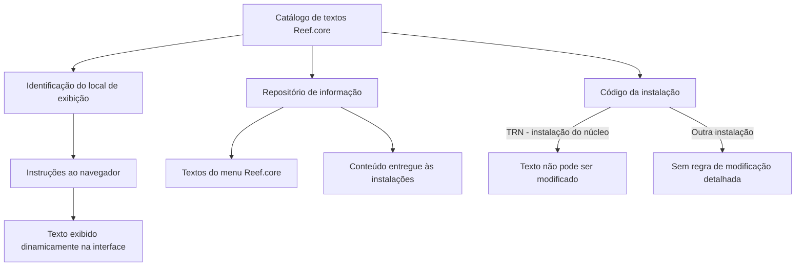

# Catálogo de Textos da Interface Reef.core — Definição, Propriedades e Restrições por Instalação

## 1. Metadados do Documento
- **Arquivo de Origem:** Não identificado
- **Tipo de Documento:** Especificação Técnica
- **Domínio / Sistema:** Reef.core
- **Público-Alvo:** Desenvolvedores, Arquitetos, Negócio e Operação
- **Data/Versão Identificada:** Não identificada

---

## 2. Resumo Executivo & Contexto de Negócio

O documento define o catálogo de textos apresentado na interface do sistema Reef.core. O objetivo do catálogo é permitir a visualização dinâmica de textos na interface, identificando previamente o local em que cada texto deve ser exibido e permitindo que o navegador receba instruções sobre sua apresentação.

O catálogo de textos do Reef.core possui a finalidade de agrupar, organizar e identificar os textos exibidos na interface. Essa organização facilita a recuperação dos textos para representação gráfica e também melhora sua descrição e compreensão funcional.

Funcionalmente, o Reef.core permite identificar e codificar os textos exibidos no menu em um repositório de informação. Esse repositório é entregue às instalações com o conteúdo necessário para o funcionamento do sistema.

O documento estabelece uma restrição central para textos vinculados à instalação do núcleo: quando o código da instalação configurado para um texto for `TRN`, o texto não poderá ser modificado. A documentação também especifica regras de idioma, identificação, redação e capitalização dos textos de etiquetas.

---

## 3. Arquitetura, Componentes & Tecnologias Envolvidas

Os componentes e conceitos explicitamente citados são:

- **Reef.core:** sistema cuja interface, menu e catálogo de textos são definidos.
- **Catálogo de textos:** estrutura responsável por agrupar, organizar, identificar e recuperar textos da interface.
- **Repositório de informação:** repositório que armazena a relação codificada de textos exibidos no menu do Reef.core.
- **Instalações:** destinos que recebem o conteúdo necessário ao funcionamento do sistema.
- **Instalação do núcleo (`TRN`):** instalação cujos textos configurados não podem ser modificados.
- **Navegador:** elemento que recebe instruções sobre como apresentar textos dinamicamente na interface.
- **Idioma:** propriedade utilizada para identificar o idioma em que um texto é definido.



> **Nota de Análise:** O documento não especifica a tecnologia do repositório, o formato de transporte do conteúdo para as instalações, contratos de API, métodos HTTP, persistência de dados ou mecanismos concretos de renderização no navegador.

---

## 4. Regras de Negócio, Especificações Funcionais & Processos

### 4.1 Finalidade do catálogo de textos

1. Os textos exibidos dinamicamente na interface do Reef.core devem ter o local de apresentação identificado.
2. A identificação do local permite fornecer instruções ao navegador sobre como realizar a apresentação do texto.
3. O catálogo deve agrupar, organizar e identificar os textos apresentados na interface.
4. A estrutura do catálogo deve facilitar:
   - A recuperação de textos para representação gráfica.
   - A descrição dos textos.
   - A compreensão funcional dos textos.

### 4.2 Textos do menu e repositório de informação

1. O Reef.core pode identificar e codificar a relação de textos exibidos no menu.
2. A relação codificada é armazenada em um repositório de informação.
3. O repositório é entregue às instalações com o conteúdo necessário ao funcionamento do sistema.

### 4.3 Restrição para a instalação do núcleo

1. A propriedade de código da instalação identifica a instalação associada à etiqueta.
2. As etiquetas da instalação do núcleo do Reef.core são identificadas pela constante `TRN`.
3. Quando o valor da instalação na configuração do texto corresponder à instalação do núcleo `TRN`, o texto não poderá ser modificado.
4. A configuração dos textos associados à instalação `TRN` deve ser respeitada obrigatoriamente.

### 4.4 Regras para o texto da etiqueta

1. O texto da etiqueta corresponde à descrição exibida na interface da aplicação.
2. A exibição deve considerar:
   - O idioma do usuário que utiliza o sistema.
   - O idioma definido para o texto.
3. O texto deve ser escrito com:
   - Primeira letra em maiúscula.
   - Demais letras em minúscula.
4. Quando o texto representar uma operação funcional, o nome deve refletir a ação executada.
5. Exemplos de ações funcionais mencionadas:
   - Consultar.
   - Emitir.
   - Criar.
6. A redação deve:
   - Respeitar a ortografia.
   - Incluir acentos.
   - Não conter abreviaturas.
7. Exemplos fornecidos pelo documento:
   - `Criar IQRF expediente`.
   - `Consultar histórico marcas`.

> **Nota de Análise:** A sigla `IQRF` é utilizada em um exemplo, mas não é expandida ou definida pelo documento.

---

## 5. Tabelas de Parâmetros, Ambientes e Estruturas de Dados

| Item / Parâmetro | Descrição / Função | Tipo / Valores / Formato | Ambiente / Observações |
| :--- | :--- | :--- | :--- |
| Código identificador | Determina o código identificador do texto na interface do Reef.core. | Código identificador; formato não detalhado. | Aplicável ao catálogo de textos. |
| Idioma | Identifica o idioma em que o texto foi definido. | Códigos de idioma; exemplos: espanhol, inglês e turco. | Utilizado em conjunto com o idioma do usuário para apresentação do texto. |
| Código da instalação | Identifica o código da instalação associada à etiqueta. | Código de instalação. | A constante `TRN` identifica instalações do núcleo do Reef.core. |
| `TRN` | Constante que identifica a instalação do núcleo do Reef.core. | Constante. | Textos configurados para `TRN` não podem ser modificados. |
| Texto da etiqueta | Descrição exibida na interface da aplicação. | Texto com primeira letra maiúscula e demais minúsculas. | Deve corresponder ao idioma do usuário e ao idioma da definição do texto. |
| Nome de operação funcional | Texto que representa uma ação executável ou funcional. | Verbo ou ação funcional, sem abreviaturas e com ortografia e acentuação corretas. | Exemplos: `Criar IQRF expediente` e `Consultar histórico marcas`. |
| Repositório de informação | Armazena a relação identificada e codificada de textos do menu. | Repositório; tecnologia não detalhada. | Entregue às instalações com conteúdo necessário ao funcionamento do sistema. |
| Navegador | Recebe instruções para apresentar textos dinamicamente. | Não detalhado. | Associado à visualização de textos na interface do Reef.core. |

---

## 6. Bateria de Perguntas & Respostas para RAG (FAQ Sintético)

### P1: Qual é a finalidade do catálogo de textos do Reef.core?
**R:** O catálogo de textos do Reef.core serve para agrupar, organizar e identificar os textos apresentados na interface. Essa organização facilita a recuperação dos textos para sua representação gráfica, além de apoiar a descrição e a compreensão funcional dos conteúdos exibidos.

### P2: Como o Reef.core permite a exibição dinâmica de textos na interface?
**R:** Para visualizar textos dinamicamente na interface do Reef.core, deve-se identificar o local em que cada texto será exibido. Essa identificação permite fornecer instruções ao navegador sobre como realizar a apresentação do texto.

### P3: O que representa o código identificador no catálogo de textos?
**R:** O código identificador é a propriedade do catálogo que determina o código pelo qual um texto é identificado na interface do Reef.core.

### P4: Como o idioma é tratado na definição de um texto?
**R:** A propriedade de idioma identifica o idioma em que o texto foi definido. O documento menciona como exemplos códigos que representam espanhol, inglês e turco. A descrição da etiqueta é exibida considerando o idioma do usuário e o idioma definido para o texto.

### P5: O que significa a constante TRN no contexto do Reef.core?
**R:** A constante `TRN` identifica a instalação do núcleo do Reef.core. Quando um texto possui `TRN` como valor de instalação em sua configuração, esse texto não pode ser modificado.

### P6: É permitido alterar textos vinculados à instalação TRN?
**R:** Não. O documento determina que a configuração realizada nos textos correspondentes à instalação do núcleo, identificada por `TRN`, deve ser respeitada obrigatoriamente. Esses textos não podem ser modificados.

### P7: Quais regras de escrita devem ser seguidas no texto de uma etiqueta?
**R:** O texto da etiqueta deve começar com letra maiúscula e manter as demais letras em minúsculas. Quando representar uma operação funcional, deve refletir a ação executada, respeitar a ortografia, incluir acentos e não conter abreviaturas.

### P8: Como devem ser nomeadas etiquetas de operações funcionais?
**R:** Etiquetas de operações funcionais devem expressar claramente a ação executada, usando termos como consultar, emitir ou criar. O documento apresenta como exemplos `Criar IQRF expediente` e `Consultar histórico marcas`.

### P9: Onde são armazenados os textos exibidos no menu do Reef.core?
**R:** Os textos exibidos no menu do Reef.core são identificados e codificados em um repositório de informação. Esse repositório é entregue às instalações com o conteúdo necessário ao funcionamento do sistema.

### P10: O documento especifica APIs, métodos HTTP ou contratos JSON para o catálogo de textos?
**R:** Não. O documento descreve o objetivo funcional do catálogo, suas propriedades e as restrições associadas à instalação `TRN`, mas não detalha APIs, métodos HTTP, contratos JSON, tecnologia de persistência ou formatos de integração.

---

## 7. Glossário de Termos, Siglas & Conceitos-Chave

- **Reef.core:** Sistema cuja interface e catálogo de textos são descritos no documento.
- **Catálogo de textos:** Estrutura para agrupar, organizar e identificar textos exibidos na interface do Reef.core.
- **Código identificador:** Propriedade que determina o código de identificação de um texto na interface.
- **Código da instalação:** Propriedade que identifica a instalação associada a uma etiqueta.
- **Etiqueta:** Texto ou descrição apresentada na interface da aplicação.
- **Instalação do núcleo:** Instalação do Reef.core identificada pela constante `TRN`.
- **TRN:** Constante que identifica a instalação do núcleo do Reef.core.
- **Repositório de informação:** Local em que a relação codificada dos textos do menu é mantida para entrega às instalações.
- **IQRF:** Sigla presente no exemplo `Criar IQRF expediente`; significado não definido no documento.

---

## 8. Notas Críticas, Riscos & Limitações

- Textos associados à instalação do núcleo `TRN` não podem ser modificados; alterações indevidas violariam uma restrição explícita do documento.
- O catálogo depende da correta identificação do local de exibição para que o navegador apresente os textos dinamicamente.
- A apresentação de uma etiqueta depende do idioma do usuário e do idioma definido para o texto.
- O documento não detalha os formatos dos códigos identificadores, códigos de idioma ou códigos de instalação além da constante `TRN`.
- O documento não informa mecanismos de autenticação, autorização, auditoria, versionamento, publicação, rollback ou governança de mudanças do catálogo.
- O documento não especifica tecnologias de banco de dados, APIs, contratos de integração, formatos de arquivo ou protocolos usados para entregar o repositório às instalações.
- A seção final contém o marcador `Consejo:` sem conteúdo adicional visível na extração fornecida.

---

## 9. Conteúdo Bruto Estruturado (Referência Fiel)

```text
--- [PÁGINA 1 DE 2] ---

DEFINICIÓN de los TEXTOS de la interfaz de
Reef.core
Contexto
Para visualizar dinámicamente los textos en la interfaz de Reef.core se debe identificar" el lugar en
el que estos se quieran mostrar pudiendo así dar instrucciones al navegador sobre cómo debe
realizarlo.
La finalidad básica del catálogo de textos de Reef.core es poder agrupar, organizar e identificar los
textos que se muestran en su interfaz facilitando de esta manera tanto su recuperación (para su
representación gráfica) como su descripción y comprensión funcional.
Objetivo
Funcionalmente, Reef.core cuenta con la posibilidad de identificar y codificar la relación de textos que
se muestran en el Menú de Reef.core en un repositorio de información que se entrega a las
instalaciones con el contenido necesario para el funcionamiento del Sistema.
Si el valor de la instalación en la configuración del texto es la correspondiente a la instalación del
núcleo, instalación (TRN) los textos no podrán modificarse.
Propiedades Operativas
Propiedades Operativas
 / 
 CF
Home Solutions APIs Documentation Zeus
EN


--- [PÁGINA 2 DE 2] ---

Código identificador
Esta propiedad del catálogo determina el código identificador del texto en la interfaz de Reef.core.
Idioma
Esta propiedad identifica el idioma en el que está definido el texto, como por ejemplo, los códigos que
identifiquen a los idiomas español, inglés, turco,...
Código de la Instalación
Esta propiedad de la definición identifica el código de la instalación de la etiqueta siendo las
correspondientes al núcleo de Reef.core aquellas identificadas con la constante TRN.
Texto de la etiqueta
Esta propiedad expresa la descripción que se mostrará en la interfaz de la aplicación de acuerdo con
el idioma que tenga al usuario que utiliza el sistema y el idioma de la definición del texto, debiendo
estar escrito con la primera letra en mayúscula y el resto en minúsculas.
Si se trata de una operación funcional el nombre debe reflejar la acción que se ejecuta
(consultar, emitir, crear...) respetando la ortografía, incluyendo acentos y sin contener
abreviaturas. Eg.: "Crear IQRF expediente", "Consultar histórico marcas",...
Vínculos
Relación de Directrices y Documentos funcionales cuya lectura recomendada para evitar que la
interpretación aislada del presente documento pueda conducir a error.
Definición Programas
Preguntas frecuentes
(1) ¿Existe alguna restricción que tenga que ser tomada en cuenta en el uso y definición del catálogo
de textos por instalación e idioma de Reef.core?
Se han de respetar obligatoriamente la configuración realizada en los textos que se corresponden
con la instalación del núcleo (TRN).
Consejo:
```
