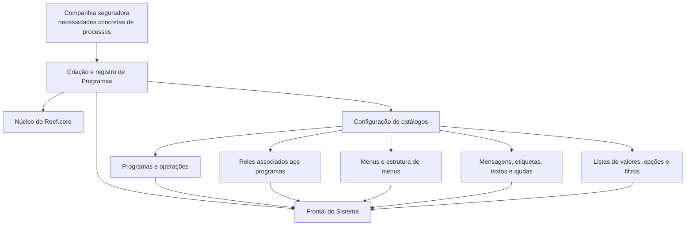

# Configuração de Programas, Menus, Mensagens, Etiquetas, Textos, Ajudas e Listas de Valores no Reef.core

## 1. Metadados do Documento
- **Arquivo de Origem:** Não identificado
- **Tipo de Documento:** Manual Operacional
- **Domínio / Sistema:** Reef.core
- **Público-Alvo:** Desenvolvedores, Arquitetos, Operação e Configuradores Funcionais
- **Data/Versão Identificada:** Não identificada

---

## 2. Resumo Executivo & Contexto de Negócio

O documento descreve a configuração de elementos funcionais e de interface no Reef.core, uma ferramenta corporativa utilizada no contexto de companhias seguradoras. O objetivo central é permitir a ampliação da funcionalidade do núcleo da plataforma por meio da criação e do registro de programas voltados a necessidades específicas dos processos corporativos.

Os programas criados no Reef.core são utilizados pelo Frontal do Sistema. Para que essa utilização seja possível, o documento indica que as informações necessárias devem ser configuradas em um conjunto de catálogos. A operacionalização da funcionalidade depende da relação entre esses catálogos e da execução de sua configuração em uma ordem apropriada.

O conteúdo apresenta os principais grupos de configuração envolvidos: instalações e módulos do Reef.core, painéis de informação por companhia, programas, operações, menus, mensagens, etiquetas, textos, ajudas, listas de valores, filtros e menus desdobráveis de programas.

O documento possui caráter predominantemente enumerativo. Ele identifica os catálogos e elementos que devem ser configurados, mas não detalha procedimentos de tela, campos obrigatórios, contratos técnicos, métodos HTTP, estruturas JSON, URLs operacionais, regras de autorização específicas ou critérios de validação.

---

## 3. Arquitetura, Componentes & Tecnologias Envolvidas

Os componentes e conceitos identificados no conteúdo são:

| Componente / Conceito | Papel identificado no documento |
| :--- | :--- |
| **Reef.core** | Ferramenta corporativa cujo núcleo pode ser ampliado por programas registrados. |
| **Núcleo do Reef.core** | Base funcional que recebe extensões por meio da criação e do registro de programas. |
| **Programas** | Elementos criados para abordar necessidades concretas da companhia seguradora. |
| **Frontal do Sistema** | Camada ou interface a partir da qual os programas serão utilizados. |
| **Catálogos** | Conjunto de configurações necessárias para tornar a funcionalidade plenamente operativa. |
| **Operações Reef.core** | Operações relacionadas aos programas e à estrutura de menus do Reef.core. |
| **Roles** | Elementos atribuídos aos programas da aplicação. |
| **Menus** | Estruturas que organizam programas e operações. |
| **Mensagens** | Elementos de comunicação configuráveis no sistema. |
| **Etiquetas, Textos e Ajudas** | Elementos textuais da interface do Reef.core. |
| **Listas de Valores** | Catálogos de valores e opções, incluindo listas para campos referenciados. |
| **Filtros de Listas de Valores** | Filtros aplicáveis às listas de valores de campos referenciados. |
| **Menus Desplegáveis de Programas** | Menus associados a programas e suas opções. |
| **Home Solutions APIs Documentation Zeus** | Texto presente na extração; o documento não esclarece sua função, relação arquitetural ou significado. |



> **Nota de Análise:** o diagrama representa exclusivamente as relações declaradas ou diretamente implicadas pelo texto: programas ampliam o núcleo do Reef.core, são configurados por catálogos e são utilizados a partir do Frontal do Sistema. O documento não especifica protocolos, bancos de dados, integrações, endpoints ou infraestrutura.

---

## 4. Regras de Negócio, Especificações Funcionais & Processos

### 4.1 Finalidade da configuração

1. O Reef.core permite ampliar a funcionalidade de seu núcleo.
2. A ampliação ocorre mediante a criação e o registro de programas.
3. Os programas devem atender necessidades concretas da companhia seguradora em seus processos.
4. Os programas serão utilizados a partir do Frontal do Sistema.
5. A utilização dos programas requer a configuração das informações necessárias em um conjunto de catálogos.
6. Para que a funcionalidade esteja plenamente operativa, deve-se conhecer a relação entre os catálogos e a ordem de configuração.

### 4.2 Catálogos e elementos listados

O documento relaciona os seguintes elementos de configuração:

1. Instalações do Reef.core.
2. Módulos do Reef.core.
3. Painéis de informação por companhia.
4. Operações Reef.core.
5. Programas da aplicação.
6. Programas da aplicação por idioma.
7. Atribuição de roles aos programas da aplicação.
8. Relação entre programas Reef.core e operações Reef.core.
9. Organização de programas e operações.
10. Menus e programas.
11. Estrutura de menus e operações Reef.core.
12. Operações favoritas no Reef.core.
13. Mensagens.
14. Etiquetas e textos.
15. Etiquetas e ajudas.
16. Textos na interface do Reef.core.
17. Listas de valores.
18. Opções das listas de valores.
19. Listas de valores e filtros das listas de campos referenciados.
20. Listas de valores de campos referenciados.
21. Filtros das listas de valores de campos referenciados.
22. Menus desdobráveis de programas.
23. Opções dos menus desdobráveis.

### 4.3 Restrições e ausência de detalhamento

- O documento afirma que existe uma ordem de configuração dos catálogos, mas não informa a sequência concreta.
- O documento menciona atribuição de roles aos programas, mas não detalha roles disponíveis, regras de autorização ou matriz de permissões.
- O documento lista programas por idioma, porém não informa idiomas suportados, regras de fallback ou mecanismo de tradução.
- O documento relaciona listas de valores, campos referenciados e filtros, mas não especifica formatos, fontes dos dados ou operadores de filtragem.
- O documento cita operações favoritas no Reef.core, mas não descreve critérios de seleção, persistência ou comportamento funcional.
- O documento não apresenta métodos HTTP, contratos de integração, esquemas de dados, versões de componentes ou procedimentos de implantação.

---

## 5. Tabelas de Parâmetros, Ambientes e Estruturas de Dados

| Item / Parâmetro | Descrição / Função | Tipo / Valores / Formato | Ambiente / Observações |
| :--- | :--- | :--- | :--- |
| Instalações de Reef.core | Catálogo listado para configuração. | Não detalhado. | Ordem de configuração não informada. |
| Módulos de Reef.core | Catálogo listado para configuração. | Não detalhado. | Não há módulos nomeados no texto. |
| Painéis de Informação por Companhia | Painéis organizados por companhia. | Não detalhado. | Não há companhias identificadas. |
| Operações Reef.core | Operações do Reef.core relacionadas aos programas e menus. | Não detalhado. | O documento não informa ações, códigos ou permissões. |
| Programas da Aplicação | Programas criados e registrados para atender necessidades corporativas. | Não detalhado. | Utilizados pelo Frontal do Sistema. |
| Programas da Aplicação por Idioma | Configuração de programas por idioma. | Idiomas não informados. | Sem regras de tradução ou localização. |
| Atribuição de Roles aos Programas | Associação de roles aos programas da aplicação. | Roles não detalhados. | Sem matriz de permissões. |
| Programas Reef.core / Operações Reef.core | Relação entre programas e operações. | Não detalhado. | Sem cardinalidade ou regras de vínculo. |
| Organização de Programas e Operações | Organização dos programas e operações. | Não detalhado. | Sem estrutura hierárquica descrita. |
| Menus e Programas | Relação entre menus e programas. | Não detalhado. | Sem definição de navegação. |
| Estrutura de Menus e Operações | Estrutura relacionada a menus e operações do Reef.core. | Não detalhado. | Sem árvore de menus apresentada. |
| Operações Favoritas | Operações marcadas como favoritas no Reef.core. | Não detalhado. | Sem critérios de favoritismo. |
| Mensagens | Mensagens configuráveis no sistema. | Não detalhado. | Sem catálogo de códigos ou textos. |
| Etiquetas e Textos | Elementos textuais da interface. | Não detalhado. | Sem idiomas, chaves ou formatos. |
| Etiquetas e Ajudas | Etiquetas e conteúdos de ajuda. | Não detalhado. | Sem mecanismo de associação informado. |
| Textos na Interface do Reef.core | Textos exibidos na interface. | Não detalhado. | Sem telas ou componentes identificados. |
| Listas de Valores | Catálogos de valores. | Não detalhado. | Possuem opções associadas. |
| Opções das Listas de Valores | Valores ou opções pertencentes às listas de valores. | Não detalhado. | Sem estrutura de chave, descrição ou ordenação. |
| Listas de Valores de Campos Referenciados | Listas de valores associadas a campos referenciados. | Não detalhado. | Sem campos identificados. |
| Filtros das Listas de Valores de Campos Referenciados | Filtros aplicados às listas de valores de campos referenciados. | Não detalhado. | Sem critérios ou operadores descritos. |
| Menus Desplegáveis de Programas | Menus desdobráveis associados aos programas. | Não detalhado. | Sem comportamento de interface detalhado. |
| Opções dos Menus Desplegáveis | Opções disponíveis nos menus desdobráveis. | Não detalhado. | Sem opções concretas listadas. |

---

## 6. Bateria de Perguntas & Respostas para RAG (FAQ Sintético)

### P1: Qual é o objetivo da criação e do registro de programas no Reef.core?
**R:** A criação e o registro de programas no Reef.core têm como objetivo ampliar a funcionalidade do núcleo da ferramenta corporativa. Os programas devem atender necessidades concretas da companhia seguradora em seus processos e serão utilizados a partir do Frontal do Sistema.

### P2: Onde os programas configurados no Reef.core serão utilizados?
**R:** Os programas configurados no Reef.core serão utilizados a partir do Frontal do Sistema. O documento não detalha quais telas, canais ou interfaces compõem esse Frontal do Sistema.

### P3: O que precisa ser configurado para que a funcionalidade de programas esteja plenamente operativa?
**R:** É necessário configurar toda a informação requerida em um conjunto de catálogos. O documento informa que é preciso conhecer os catálogos envolvidos e sua ordem de configuração, porém não apresenta essa sequência de forma explícita.

### P4: Quais catálogos relacionados a programas são mencionados no documento?
**R:** O documento menciona programas da aplicação, programas da aplicação por idioma, atribuição de roles aos programas da aplicação, relação entre programas Reef.core e operações Reef.core, organização de programas e operações, menus e programas e menus desdobráveis de programas.

### P5: Como o documento trata permissões de acesso aos programas?
**R:** O conteúdo menciona a atribuição de roles aos programas da aplicação. Entretanto, não especifica quais roles existem, quais permissões cada role possui, como a autorização é avaliada ou quais programas podem ser associados a cada role.

### P6: Quais elementos de interface podem ser configurados no Reef.core?
**R:** O documento lista menus, mensagens, etiquetas, textos, ajudas, textos na interface do Reef.core, listas de valores, opções de listas de valores, menus desdobráveis de programas e opções dos menus desdobráveis.

### P7: O que são listas de valores no escopo do documento?
**R:** As listas de valores são elementos de configuração citados juntamente com suas opções. O documento também menciona listas de valores de campos referenciados e filtros dessas listas, mas não informa a estrutura dos valores, as fontes de dados ou os critérios de filtragem.

### P8: O documento descreve como organizar programas e operações no Reef.core?
**R:** O documento identifica “Organização de Programas e Operações” e “Estrutura de Menus e Operações de Reef.core” como tópicos de configuração. Contudo, não apresenta uma hierarquia, sequência operacional, modelo de dados ou procedimento detalhado para realizar essa organização.

### P9: Há suporte a múltiplos idiomas para programas da aplicação?
**R:** Sim. O documento menciona “Programas de la Aplicación por Idioma”, indicando que existe uma configuração de programas por idioma. No entanto, o conteúdo não identifica os idiomas suportados nem descreve regras de tradução, seleção de idioma ou fallback.

### P10: O que são operações favoritas no Reef.core segundo o documento?
**R:** “Operações Favoritas em Reef.core” é um tópico listado entre os elementos de configuração. O documento não fornece detalhamento adicional sobre critérios, usuários envolvidos, persistência ou comportamento dessas operações favoritas.

---

## 7. Glossário de Termos, Siglas & Conceitos-Chave

- **Reef.core:** Ferramenta corporativa cujo núcleo pode ser ampliado pela criação e pelo registro de programas.
- **Programa:** Elemento criado e registrado para atender necessidades concretas da companhia seguradora e utilizado a partir do Frontal do Sistema.
- **Frontal do Sistema:** Camada ou interface a partir da qual os programas serão utilizados; o documento não fornece detalhamento adicional.
- **Catálogo:** Conjunto de informações de configuração necessário para tornar a funcionalidade plenamente operativa.
- **Operação Reef.core:** Operação citada em associação com programas, menus e estrutura de menus do Reef.core.
- **Role:** Elemento atribuído aos programas da aplicação; o documento não define seu significado expandido nem suas permissões.
- **Menu:** Estrutura relacionada à organização e ao acesso a programas e operações.
- **Menu Desplegável:** Menu associado a programas que possui opções; o comportamento não é detalhado.
- **Etiqueta:** Elemento textual configurável da interface do Reef.core.
- **Ajuda:** Conteúdo de apoio associado a etiquetas; sem detalhamento de formato ou exibição.
- **Lista de Valores:** Catálogo de valores com opções associadas.
- **Campo Referenciado:** Campo para o qual são mencionadas listas de valores e filtros; o documento não identifica campos específicos.

---

## 8. Notas Críticas, Riscos & Limitações

- O documento declara que existe uma ordem para configuração dos catálogos, mas não apresenta a sequência necessária para implantação ou operação.
- Não há detalhamento de telas, procedimentos, campos, valores permitidos, obrigatoriedades ou critérios de validação.
- A atribuição de roles é mencionada, mas não existe uma matriz de permissões, uma lista de roles ou uma regra de acesso documentada.
- A configuração por idioma é citada sem identificação dos idiomas, padrões de localização ou regras de fallback.
- Não são documentados endpoints, APIs, protocolos, bancos de dados, URLs, servidores, ambientes, logs, versões ou pipelines de implantação.
- O trecho “Home Solutions APIs Documentation Zeus” aparece na extração, mas sua finalidade e relação com o Reef.core não são explicadas.
- **Nota de Análise:** o documento é uma visão de tópicos e catálogos. Ele não contém detalhamento suficiente para implementar, integrar ou operar tecnicamente os componentes sem documentação complementar.

---

## 9. Conteúdo Bruto Estruturado (Referência Fiel)

```text
--- [PÁGINA 1 DE 3] ---

DEFINICIÓN de PROGRAMAS, MENÚS,
MENSAJES, ETIQUETAS, TEXTOS, AYUDAS, ...
Contexto
Reef.core permite ampliar la funcionalidad del núcleo, mediante la creación y registro de los
Programas que permitan abordar necesidades concretas de la compañía aseguradora en sus
procesos y que van a ser utilizados desde el Frontal del Sistema, configurando toda la información
necesaria en un conjunto de catálogos.
Objetivo
Conocer la relación de Catálogos que se deben configurar y el orden en su configuración para definir
y tener plenamente operativa esta funcionalidad de la herramienta Corporativa.
Catálogos
Instalaciones de Reef.core
Módulos de Reef.core
Paneles de Información por Compañía
Operaciones Reef.core
 / 
 CF
Home Solutions APIs Documentation Zeus
EN


--- [PÁGINA 2 DE 3] ---

Programas / Operaciones
Programas de la Aplicación
Programas de la Aplicación por Idioma
Asignación de Roles a los Programas de la Aplicación
Programas Reef.core / Operaciones Reef.core
Organización de Programas y Operaciones
Menús y Programas
Estructura de Menús y Operaciones de Reef.core
Operaciones Favoritas en Reef.core
Mensajes
Mensajes
Etiquetas y Textos
Etiquetas y Ayudas
Textos en la Interfaz de Reef.core
Listas de Valores y Opciones de las Listas
Listas de Valores
Opciones de las Listas de Valores


--- [PÁGINA 3 DE 3] ---

Listas de Valores y Filtros de las Listas de Campos
Referenciados
Listas de Valores de Campos Referenciados
Filtros de las Listas de Valores de Campos Referenciados
Menús Desplegables de Programas
Menús Desplegables de Programas
Opciones de los Menús Desplegables
```
