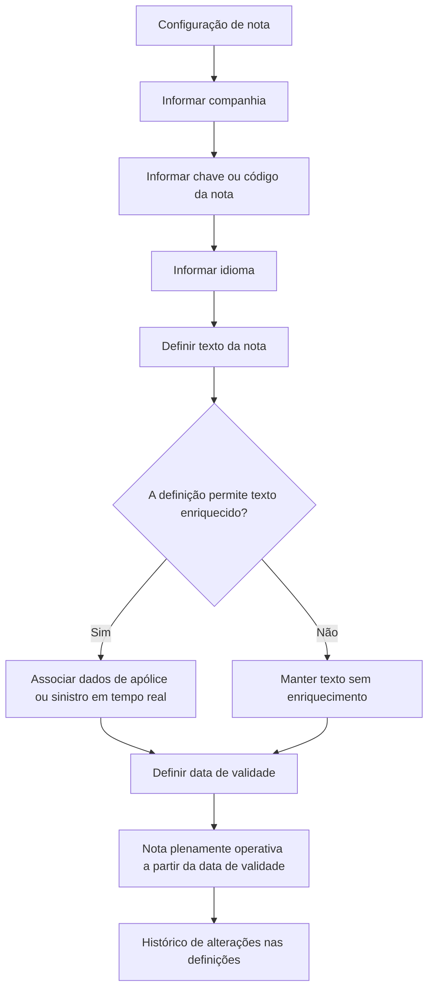

# Definição do Texto das Notas — Catálogo de Anotações

## 1. Metadados do Documento
- **Arquivo de Origem:** Não identificado no conteúdo fornecido
- **Tipo de Documento:** Especificação Funcional
- **Domínio / Sistema:** Anotações, Notificações e documentação Home Solutions APIs Documentation Zeus
- **Público-Alvo:** Desenvolvedores, analistas funcionais, equipes de configuração e operação
- **Data/Versão Identificada:** Não identificada

---

## 2. Resumo Executivo & Contexto de Negócio

O documento define o texto associado a cada nota configurada no catálogo de Anotações. O objetivo declarado é permitir que o texto de uma nota seja enriquecido conforme o parâmetro definido para a própria nota.

A configuração identifica a companhia para a qual a nota é criada, a chave ou código da nota e o idioma do conteúdo. O texto pode ser simples ou enriquecido, desde que a definição específica da nota permita essa modalidade de configuração.

O conteúdo enriquecido suporta a associação, em tempo real, de informações relacionadas a apólices ou sinistros. O exemplo apresentado inclui dados de terceiro, número de sinistro, número de expediente, data de sinistro e informações sobre veículo disponibilizado.

A data de validade determina a partir de quando a nota fica plenamente operacional no sistema. O uso correto dessa data possibilita manter um histórico das alterações realizadas nas definições das notas.

O documento referencia Anotações, Notificações e Perguntas Frequentes como vínculos recomendados para evitar interpretações isoladas incorretas. Não há recomendação operacional local para codificação, uso ou definição da tabela de textos das Anotações; a resposta registrada é `N/A`.

---

## 3. Arquitetura, Componentes & Tecnologias Envolvidas

### Componentes e conceitos identificados

| Componente / Conceito | Descrição baseada no documento |
| :--- | :--- |
| Catálogo de Anotações | Catálogo que contém atributos de identificação e configuração dos textos das notas. |
| Nota | Entidade identificada por uma chave ou código. |
| Companhia | Código da companhia sobre a qual a configuração é realizada. |
| Idioma | Propriedade que identifica o idioma do texto da nota, com exemplos de espanhol, inglês e turco. |
| Texto Enriquecido | Texto da nota que pode incorporar informações de apólice ou sinistro em tempo real, quando permitido pela definição da nota. |
| Data de Validade | Data a partir da qual uma nota está ou estará plenamente operativa no sistema. |
| Anotações | Vínculo ou documento funcional recomendado. |
| Notificações | Vínculo ou documento funcional recomendado. |
| Perguntas Frequentes | Vínculo ou documento funcional recomendado. |
| Home Solutions APIs Documentation Zeus | Referência textual presente nos dados identificativos. |

### Fluxo funcional de configuração e operação



> **Nota de Análise:** O documento não especifica métodos HTTP, contratos JSON, banco de dados, interfaces de usuário, serviços, URLs de ambiente, autenticação ou mecanismos técnicos de substituição dos campos enriquecidos.

---

## 4. Regras de Negócio, Especificações Funcionais & Processos

1. O objetivo do documento é definir o texto de cada uma das notas existentes.
2. O texto de uma nota pode ser enriquecido conforme o parâmetro indicado na definição da respectiva nota.
3. A configuração deve identificar a companhia à qual a nota pertence por meio do código da companhia.
4. Cada nota deve possuir uma chave ou código identificador.
5. Cada texto de nota deve identificar o idioma no qual foi escrito.
6. O documento exemplifica idiomas por códigos correspondentes a espanhol, inglês e turco, sem definir os códigos concretos.
7. Um texto enriquecido somente pode ser configurado quando o atributo específico da definição da nota indicar que esse enriquecimento é permitido.
8. O texto enriquecido permite associar, em tempo real, informações de apólice ou sinistro.
9. O exemplo de texto enriquecido contém os campos `[nom_tercero]`, `[NUM_SINI]`, `[NUM_EXP]`, `[FEC_SINI]`, `[9999999999.DTTIP_COCHE]`, `[9999999999.DTFEC_INI_ALQUILER]` e `[9999999999.DTFEC_FIN_ALQUILER]`.
10. A data de validade indica o momento a partir do qual a nota está ou estará plenamente operativa no sistema.
11. O uso correto da data de validade permite manter histórico dos cambios efetuados nas definições das notas.
12. A leitura dos documentos relacionados a Anotações, Notificações e Perguntas Frequentes é recomendada para evitar erros de interpretação decorrentes da leitura isolada desta entrada.
13. A pergunta sobre recomendação operacional local para codificação, uso e definição da tabela de textos das Anotações possui resposta `N/A`.

---

## 5. Tabelas de Parâmetros, Ambientes e Estruturas de Dados

| Item / Parâmetro | Descrição / Função | Tipo / Valores / Formato | Ambiente / Observações |
| :--- | :--- | :--- | :--- |
| Companhia | Código da companhia sobre a qual a configuração é realizada. | Código de companhia; formato não especificado. | Aplicável ao catálogo de Anotações. |
| Nota | Chave ou código da nota. | Chave ou código; formato não especificado. | Identifica a nota configurada. |
| Idioma | Identifica o idioma do texto da nota. | Códigos de idioma; exemplos: espanhol, inglês e turco. | Os códigos concretos não são fornecidos. |
| Texto Enriquecido | Texto da nota que pode incorporar dados de apólice ou sinistro. | Texto; exemplo em HTML. | Permitido somente quando a definição específica da nota o indicar. |
| Data de Validade | Define quando a nota fica plenamente operativa. | Data; formato não especificado. | Permite histórico de mudanças nas definições. |
| `[nom_tercero]` | Campo usado na saudação ao destinatário do exemplo. | Marcador de substituição. | Sem detalhamento técnico de origem ou resolução. |
| `[NUM_SINI]` | Número do sinistro no exemplo de texto enriquecido. | Marcador de substituição. | Associado a informações de sinistro. |
| `[NUM_EXP]` | Número do expediente no exemplo de texto enriquecido. | Marcador de substituição. | Associado a informações de sinistro. |
| `[FEC_SINI]` | Data do sinistro no exemplo de texto enriquecido. | Marcador de substituição. | Associado a informações de sinistro. |
| `[9999999999.DTTIP_COCHE]` | Tipo de veículo disponibilizado no exemplo. | Marcador de substituição. | Prefixo e semântica técnica não detalhados. |
| `[9999999999.DTFEC_INI_ALQUILER]` | Data inicial de disponibilização ou aluguel do veículo no exemplo. | Marcador de substituição. | Formato da data não especificado. |
| `[9999999999.DTFEC_FIN_ALQUILER]` | Data final de disponibilização ou aluguel do veículo no exemplo. | Marcador de substituição. | Formato da data não especificado. |
| HTML | Formato usado no exemplo de texto enriquecido. | Tags como `<html>`, `<body>`, `<br>`, `<u>` e `<font>`. | O documento apresenta um exemplo, mas não estabelece HTML como requisito universal. |
| Anotações | Documento ou diretriz vinculada recomendada. | Referência documental. | Sem conteúdo adicional apresentado. |
| Notificações | Documento ou diretriz vinculada recomendada. | Referência documental. | Sem conteúdo adicional apresentado. |
| Perguntas Frequentes | Documento ou diretriz vinculada recomendada. | Referência documental. | Inclui uma pergunta cuja resposta é `N/A`. |

---

## 6. Bateria de Perguntas & Respostas para RAG (FAQ Sintético)

### P1: Qual é o objetivo da definição do texto das notas?
**R:** O objetivo é definir o texto de cada nota configurada. Esse texto pode ser enriquecido de acordo com o parâmetro indicado na definição da respectiva nota.

### P2: Quais dados identificam uma configuração no catálogo de Anotações?
**R:** O documento identifica os atributos Companhia, Nota e Idioma. Companhia contém o código da companhia; Nota contém a chave ou código da nota; e Idioma identifica o idioma no qual o texto foi escrito.

### P3: Quando o texto de uma nota pode ser enriquecido?
**R:** O texto pode ser enriquecido somente quando, por coerência com a definição da nota, o atributo específico da nota indicar que esse tipo de configuração é permitido.

### P4: Que informações podem ser associadas ao texto enriquecido?
**R:** O documento informa que o texto enriquecido pode associar, em tempo real, informações de apólice ou sinistro. Como exemplos, são citados número do sinistro e data de ocorrência.

### P5: Quais marcadores de dados aparecem no exemplo de mensagem enriquecida?
**R:** O exemplo contém `[nom_tercero]`, `[NUM_SINI]`, `[NUM_EXP]`, `[FEC_SINI]`, `[9999999999.DTTIP_COCHE]`, `[9999999999.DTFEC_INI_ALQUILER]` e `[9999999999.DTFEC_FIN_ALQUILER]`.

### P6: Qual é a função da data de validade de uma nota?
**R:** A data de validade informa ao sistema a partir de quando a nota está ou estará plenamente operativa. Seu uso correto permite manter histórico das alterações realizadas nas definições das notas.

### P7: Quais idiomas são mencionados como exemplos no atributo Idioma?
**R:** São mencionados espanhol, inglês e turco. O documento não apresenta os códigos concretos que representam esses idiomas.

### P8: O documento estabelece uma recomendação operacional local para codificação e uso da tabela de textos das Anotações?
**R:** Não. A pergunta frequente sobre recomendações operacionais locais para codificação, uso e definição da tabela de textos possui a resposta `N/A`.

### P9: Quais documentos ou diretrizes devem ser consultados para evitar interpretação isolada incorreta?
**R:** O documento recomenda a leitura dos vínculos relacionados a Anotações, Notificações e Perguntas Frequentes.

### P10: O documento descreve como os campos enriquecidos são tecnicamente resolvidos?
**R:** Não. O documento mostra marcadores de substituição em um exemplo HTML, mas não descreve APIs, contratos, fontes de dados, regras de resolução, validações ou comportamento em caso de ausência de valores.

---

## 7. Glossário de Termos, Siglas & Conceitos-Chave

- **Anotações:** Catálogo ou domínio funcional no qual são configuradas notas e seus textos.
- **Nota:** Entidade identificada por uma chave ou código e associada a um texto em determinado idioma.
- **Companhia:** Código que representa a companhia sobre a qual a configuração da nota está sendo realizada.
- **Idioma:** Propriedade que identifica o idioma de redação do texto de uma nota.
- **Texto Enriquecido:** Texto capaz de incorporar informações de apólice ou sinistro em tempo real, quando a definição da nota permitir.
- **Data de Validade:** Data a partir da qual uma nota se torna plenamente operativa no sistema.
- **Sinistro:** Ocorrência referenciada pelo documento e usada como possível fonte de informações para textos enriquecidos.
- **Apólice:** Informação de negócio que pode ser associada, em tempo real, ao texto enriquecido.
- **`NUM_SINI`:** Marcador apresentado como número do sinistro.
- **`NUM_EXP`:** Marcador apresentado como número do expediente.
- **`FEC_SINI`:** Marcador apresentado como data do sinistro.
- **`DTTIP_COCHE`:** Segmento de marcador associado ao tipo de veículo no exemplo; a expansão da sigla não é definida.
- **`DTFEC_INI_ALQUILER`:** Segmento de marcador associado à data inicial de aluguel ou disponibilização do veículo; a expansão formal não é definida.
- **`DTFEC_FIN_ALQUILER`:** Segmento de marcador associado à data final de aluguel ou disponibilização do veículo; a expansão formal não é definida.
- **HTML:** Linguagem de marcação utilizada no exemplo apresentado para estruturar e formatar uma mensagem.

---

## 8. Notas Críticas, Riscos & Limitações

- O arquivo de origem, a data e a versão do documento não foram identificados no conteúdo fornecido.
- Não são detalhados os códigos reais de companhia, nota ou idioma.
- O documento não define a estrutura técnica, a origem dos dados, a sintaxe completa ou o processo de resolução dos marcadores de texto enriquecido.
- Não há especificação de comportamento para campos sem valor, dados indisponíveis, falhas de substituição ou validação de conteúdo HTML.
- O exemplo utiliza HTML, mas o documento não determina se HTML é obrigatório, opcional ou permitido para todas as notas.
- Não foram apresentados ambientes, URLs, servidores, credenciais, logs, interfaces, APIs, métodos HTTP ou contratos JSON.
- A interpretação isolada do conteúdo pode conduzir a erro; o próprio documento recomenda consultar Anotações, Notificações e Perguntas Frequentes.
- A recomendação operacional local referente à codificação, uso e definição da tabela de textos está registrada como `N/A`.

---

## 9. Conteúdo Bruto Estruturado (Referência Fiel)

```text
--- [PÁGINA 1 DE 3] ---

DEFINICIÓN El Texto de las Notas
Objetivo
El objetivo del documento es definir el texto de cada una de las notas definidas, texto que podrá
estar enriquecido de acuerdo con el parámetro que lo indica en su definición.
Datos Identificativos
 / 
 CF
Home Solutions APIs Documentation Zeus
EN


--- [PÁGINA 2 DE 3] ---

Datos Identificativos
Compañía
Este Atributo del catálogo de Anotaciones contiene el código de la compañía sobre la cual se está
realizando la configuración.
Nota
Este atributo contendrá la clave o código de la nota.
Idioma
Esta propiedad identifica el Idioma en el que está escrito el texto de la nota, como por ejemplo con
los códigos que identifiquen a los idiomas español, inglés, turco,...
Texto Enriquecido
Esta propiedad del catálogo de contiene el texto de la nota, texto que podrá estar enriquecido
siempre y cuando y por coherencia con su definición, el atributo de específico de la nota indique que
se puede configurarse de esa manera.
A modo de ejemplo:


--- [PÁGINA 3 DE 3] ---

NOTA: Como se puede observar el texto enriquecido de la anotación permite asociar, en tiempo real,
información de la póliza o siniestro como por ejemplo el número del siniestro, la fecha de
ocurrencia,...
Fecha de Validez
Esta propiedad le indica al Sistema la fecha a partir de la cual la nota está o estará plenamente
operativa en el sistema por lo que su correcto uso permite tener un histórico de los cambios
efectuados en sus definiciones.
Vínculos
Relación de Directrices y Documentos funcionales cuya lectura recomendada para evitar que la
interpretación aislada de la presente entrada pueda conducir a error.
Anotaciones
Notificaciones
Preguntas frecuentes
(1) ¿Existe alguna recomendación operativa que deba ser tomada en consideración localmente en la
codificación, uso y definición de la tabla de textos de las Anotaciones del Sistema?
N/A
 1
 2
 3
 4
 5
 6
 7
 8
 9
10
11
12
<html>
<body>
Estimado/a [nom_tercero],
<br>
Nos volvemos a poner en contacto con usted para <u>solicitarle los documentos 
faltantes</u> referentes al siniestro [NUM_SINI]/[NUM_EXP] solicitados el pasado 
d&iacute;a [FEC_SINI].
Aprovechamos para comunicarle que dispone de un veh&iacute;culo de tipo 
[9999999999.DTTIP_COCHE] a su disposici&oacute;n entre los d&iacute;as 
[9999999999.DTFEC_INI_ALQUILER] y [9999999999.DTFEC_FIN_ALQUILER].
<br><br>
Un cordial saludo,
<br><br>
<font color='green'>Cuidamos del medio ambiente</font> - <font 
color='red'>MAPFRE</font>
</body>
</html>
```
