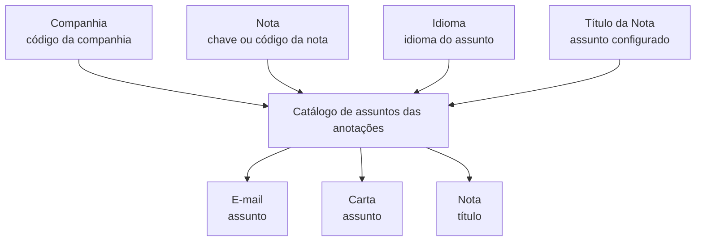

# Catálogo do Sistema — Definição do Título de Notas para Carta e E-mail

## 1. Metadados do Documento
- **Arquivo de Origem:** Não identificado; conteúdo bruto fornecido com 3 páginas.
- **Tipo de Documento:** Especificação Funcional.
- **Domínio / Sistema:** Catálogo do Sistema; catálogo de assuntos das anotações.
- **Público-Alvo:** Negócio, analistas funcionais e equipes responsáveis pela configuração do catálogo.
- **Data/Versão Identificada:** Não identificada.

---

## 2. Resumo Executivo & Contexto de Negócio

O documento define um catálogo do sistema destinado a configurar o título das notas. O título configurado é utilizado como assunto de uma carta ou de uma mensagem de e-mail.

A configuração é identificada pela combinação de companhia, nota e idioma. A companhia representa a organização para a qual a configuração é realizada; a nota representa a chave ou código da anotação; e o idioma identifica a língua na qual o assunto da nota foi escrito.

O atributo principal do catálogo é o **Título da Nota**, que contém o assunto aplicável ao e-mail, à carta ou ao próprio título da anotação. O documento apresenta exemplos para comunicações relacionadas a requerimentos, testemunhas, solicitação de documentação para aceitação de sinistro e improcedência de sinistro.

O conteúdo também referencia diretrizes e documentos funcionais relacionados, denominados **Anotações** e **Textos da Nota**, cuja leitura é recomendada para evitar interpretações isoladas ou incorretas da entrada de catálogo.

---

## 3. Arquitetura, Componentes & Tecnologias Envolvidas

Os elementos funcionais explicitamente citados são:

- **Catálogo do Sistema:** mecanismo de configuração do título/assunto das notas.
- **Catálogo de assuntos das anotações:** estrutura que armazena atributos de identificação e título.
- **Companhia:** código da companhia para a qual a configuração é realizada.
- **Nota:** chave ou código da nota.
- **Idioma:** identificador do idioma do assunto configurado.
- **Título da Nota:** assunto utilizado em carta, e-mail ou título da nota.
- **Carta:** canal de comunicação que pode utilizar o título configurado.
- **E-mail:** canal de comunicação que pode utilizar o título configurado.
- **Anotações / Textos da Nota:** documentos funcionais vinculados e recomendados para consulta.



**Nota de Análise:** O documento não descreve tecnologias, APIs, métodos HTTP, contratos JSON, banco de dados, servidores, ambientes ou fluxos de integração técnica. A expressão “Home Solutions APIs Documentation Zeus EN” aparece no conteúdo extraído, sem detalhamento que permita classificá-la como componente técnico do processo.

---

## 4. Regras de Negócio, Especificações Funcionais & Processos

1. O objetivo do catálogo é configurar o título das notas para utilização como assunto de carta ou e-mail.
2. A configuração é realizada para uma companhia específica, identificada pelo código da companhia.
3. Cada entrada possui uma nota, representada pela chave ou código da nota.
4. Cada entrada possui um idioma, que identifica a língua em que o assunto da nota está escrito.
5. O atributo **Título da Nota** armazena o assunto aplicável ao e-mail, à carta ou ao título da nota.
6. O documento cita como exemplos de idiomas os códigos que identifiquem espanhol, inglês e turco, sem fornecer os códigos concretos.
7. O documento apresenta exemplos de combinação entre tipo de comunicação, descrição e assunto/título:
   - **EMAIL / Correo Electrónico / Requerimiento / Testigos**
   - **CARTA / Requested Documents / Claim documentation request**
   - **CARTA / Carta Improcedencia Siniestro / Comunicación Improcedencia Siniestro: [NUM_SINI]**
8. O marcador `[NUM_SINI]` aparece como parte do exemplo de assunto para “Comunicación Improcedencia Siniestro”; o documento não define seu formato, origem ou regra de substituição.
9. A interpretação da entrada de catálogo não deve ser feita isoladamente. A leitura dos documentos relacionados em **Vínculos** é recomendada para evitar erro de interpretação.
10. Os documentos relacionados explicitamente citados são **Anotaciones** e **Textos de la Nota**.

---

## 5. Tabelas de Parâmetros, Ambientes e Estruturas de Dados

| Item / Parâmetro | Descrição / Função | Tipo / Valores / Formato | Ambiente / Observações |
| :--- | :--- | :--- | :--- |
| Companhia | Código da companhia sobre a qual a configuração é realizada. | Código de companhia; formato não informado. | Aplicável à configuração do catálogo de assuntos das anotações. |
| Nota | Chave ou código da nota. | Chave ou código; formato não informado. | Identifica a anotação associada ao assunto. |
| Idioma | Identifica o idioma em que o assunto da nota foi escrito. | Códigos de idioma; são citados espanhol, inglês e turco como exemplos. | Os códigos específicos não são fornecidos. |
| Título da Nota | Contém o assunto do e-mail, da carta ou o título da nota. | Texto; tamanho e regras de formatação não informados. | Atributo funcional central do catálogo. |
| EMAIL | Tipo de comunicação apresentado no exemplo. | Valor textual: `EMAIL`. | Associado a “Correo Electrónico”, “Requerimiento” e “Testigos”. |
| CARTA | Tipo de comunicação apresentado nos exemplos. | Valor textual: `CARTA`. | Associado a “Requested Documents” e “Carta Improcedencia Siniestro”. |
| `[NUM_SINI]` | Marcador presente no assunto de comunicação de improcedência de sinistro. | Placeholder; formato não informado. | O documento não informa a regra de preenchimento. |
| Anotaciones | Documento funcional vinculado. | Referência documental. | Leitura recomendada. |
| Textos de la Nota | Documento funcional vinculado. | Referência documental. | Leitura recomendada. |
| Home Solutions APIs Documentation Zeus EN | Texto presente na extração. | Não especificado. | Não há contexto suficiente para classificá-lo como sistema, URL, ambiente ou ferramenta. |

---

## 6. Bateria de Perguntas & Respostas para RAG (FAQ Sintético)

### P1: Qual é o objetivo do Catálogo do Sistema definido no documento?
**R:** O Catálogo do Sistema tem como objetivo configurar o título das notas para que esse título seja utilizado como assunto de uma carta ou de uma mensagem de e-mail.

### P2: Quais atributos identificam uma configuração no catálogo de assuntos das anotações?
**R:** O documento identifica os atributos Companhia, Nota, Idioma e Título da Nota. Companhia informa a organização configurada; Nota contém a chave ou código da nota; Idioma identifica a língua do assunto; e Título da Nota armazena o assunto aplicável.

### P3: O que representa o atributo Companhia?
**R:** Companhia contém o código da companhia sobre a qual está sendo realizada a configuração do catálogo de assuntos das anotações. O documento não especifica o formato técnico desse código.

### P4: Para que serve o atributo Nota?
**R:** O atributo Nota contém a chave ou o código da nota. O documento não fornece uma lista de códigos, estrutura de chave ou regra de validação para esse atributo.

### P5: Qual é a função do atributo Idioma no catálogo?
**R:** Idioma identifica a língua em que está escrito o assunto da nota. O documento cita, como exemplos, códigos que identifiquem os idiomas espanhol, inglês e turco, mas não informa quais são esses códigos.

### P6: O que deve ser armazenado em Título da Nota?
**R:** Título da Nota deve conter o assunto do e-mail, o assunto da carta ou o título da própria nota. O documento não especifica limites de tamanho, caracteres permitidos ou regras de obrigatoriedade.

### P7: Quais exemplos de assuntos ou títulos são apresentados para comunicações?
**R:** O documento apresenta “Testigos” para uma entrada `EMAIL` descrita como “Correo Electrónico” e “Requerimiento”; “Claim documentation request” para uma entrada `CARTA` descrita como “Requested Documents”; e “Comunicación Improcedencia Siniestro: [NUM_SINI]” para uma entrada `CARTA` descrita como “Carta Improcedencia Siniestro”.

### P8: O que significa o marcador `[NUM_SINI]` no exemplo de assunto?
**R:** `[NUM_SINI]` é um marcador apresentado no exemplo “Comunicación Improcedencia Siniestro: [NUM_SINI]”. O documento não define o significado formal, a origem do valor, o formato ou o mecanismo de substituição desse marcador.

### P9: Quais documentos devem ser consultados para interpretar corretamente a entrada de catálogo?
**R:** O documento recomenda a leitura das diretrizes e documentos funcionais vinculados para evitar que uma interpretação isolada da entrada leve a erro. Os vínculos citados são “Anotaciones” e “Textos de la Nota”.

### P10: O documento especifica APIs, métodos HTTP ou contratos de integração?
**R:** Não. Apesar de a extração conter a expressão “Home Solutions APIs Documentation Zeus EN”, o documento não detalha APIs, endpoints, métodos HTTP, contratos JSON, autenticação, ambientes ou integrações técnicas.

---

## 7. Glossário de Termos, Siglas & Conceitos-Chave

- **Catálogo do Sistema:** catálogo utilizado para configurar o título das notas como assunto de carta ou e-mail.
- **Catálogo de assuntos das anotações:** catálogo que contém atributos associados ao assunto de uma anotação.
- **Companhia:** código da companhia para a qual a configuração é realizada.
- **Nota:** chave ou código da nota.
- **Idioma:** propriedade que identifica a língua do assunto da nota.
- **Título da Nota:** atributo que contém o assunto do e-mail, da carta ou o título da nota.
- **EMAIL:** valor apresentado para indicar comunicação por correio eletrônico.
- **CARTA:** valor apresentado para indicar comunicação por carta.
- **Siniestro:** termo presente em exemplos de “aceptación del siniestro” e “improcedencia siniestro”; o documento não apresenta uma definição própria.
- **`[NUM_SINI]`:** marcador utilizado no exemplo de assunto de improcedência de sinistro; sem definição adicional no documento.
- **Vínculos:** relação de diretrizes e documentos funcionais cuja leitura é recomendada.
- **Anotaciones:** documento funcional relacionado citado no conteúdo.
- **Textos de la Nota:** documento funcional relacionado citado no conteúdo.

---

## 8. Notas Críticas, Riscos & Limitações

- O conteúdo não informa nome do arquivo original, autoria, data, versão ou responsável pela manutenção do catálogo.
- Não são fornecidos códigos reais de companhia, notas ou idiomas.
- Não há definição de chave primária, unicidade ou precedência entre Companhia, Nota e Idioma.
- Não há especificação de obrigatoriedade, validações, tamanho máximo ou formato do atributo Título da Nota.
- O marcador `[NUM_SINI]` não possui definição de origem, formato ou regra de interpolação.
- Não há detalhamento sobre APIs, integrações, persistência, permissões, auditoria, logs, ambientes ou processo de publicação da configuração.
- O documento recomenda explicitamente a consulta de **Anotaciones** e **Textos de la Nota**, pois a interpretação isolada da entrada pode conduzir a erro.
- **Nota de Análise:** O documento lista exemplos de assuntos e estruturas de catálogo, mas não detalha o fluxo operacional de criação, aprovação ou consumo da configuração.

---

## 9. Conteúdo Bruto Estruturado (Referência Fiel)

```text
--- [PÁGINA 1 DE 3] ---

DEFINICIÓN del TÍTULO de la Nota
Objetivo
El objetivo de este Catálogo del Sistema es configurar el el título de las notas como asunto de la
carta o del email.
Datos Identificativos
 / 
 CF
Home Solutions APIs Documentation Zeus
EN


--- [PÁGINA 2 DE 3] ---

Datos Identificativos
Compañía
Este Atributo del catálogo de asuntos de las anotaciones contiene el código de la compañía sobre la
cual se está realizando la configuración.
Nota
Este atributo contendrá la clave o código de la nota.
Idioma
Esta propiedad identifica el Idioma en el que está escrito el asunto de la nota, como por ejemplo con
los códigos que identifiquen a los idiomas español, inglés, turco,...
Título de la Nota
Este atributo contiene el asunto del email o de la carta el título de la nota. A modo de ejemplo...


--- [PÁGINA 3 DE 3] ---

NOTA DESCRIPCIÓN ASUNTO / TÍTULO
EMAIL Correo Electrónico Requerimiento
Testigos
Solicitud necesaria para aceptación del
siniestro
CARTA Requested Documents Claim documentation request
CARTA Carta Improcedencia Siniestro Comunicación Improcedencia Siniestro:
[NUM_SINI]
... ... ...
Vínculos
Relación de Directrices y Documentos funcionales cuya lectura recomendada para evitar que la
interpretación aislada de la presente entrada pueda conducir a error.
Anotaciones
Textos de la Nota
```
