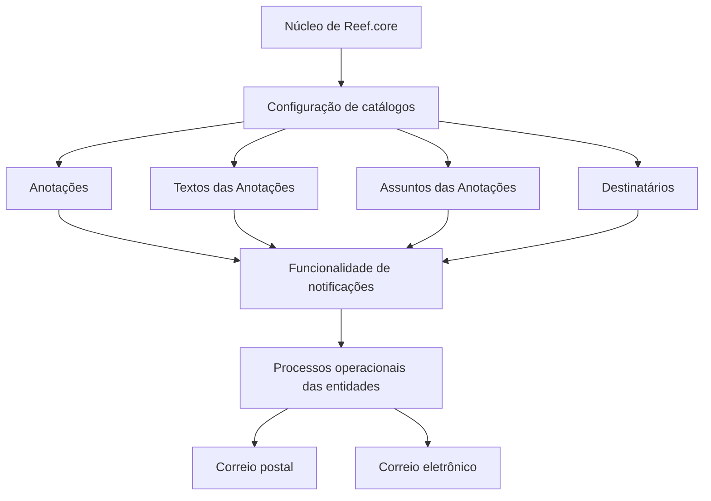

# Definição das Anotações do Sistema Reef.core

## 1. Metadados do Documento
- **Arquivo de Origem:** `Não informado`
- **Tipo de Documento:** `Especificação Técnica`
- **Domínio / Sistema:** `Reef.core`
- **Público-Alvo:** `Desenvolvedores, Arquitetos, Operação`
- **Data/Versão Identificada:** `Não identificada`

---

## 2. Resumo Executivo & Contexto de Negócio

O documento descreve a funcionalidade de configuração e envio de notificações do núcleo do sistema Reef.core. Essa funcionalidade suporta comunicações nos processos operacionais das entidades, utilizando correio postal ou correio eletrônico.

O objetivo declarado é apresentar a relação de catálogos que precisam ser configurados para que a funcionalidade de anotações esteja plenamente operativa na ferramenta corporativa. O documento também informa que existe uma ordem de execução para esses catálogos, embora não apresente essa ordem.

Os catálogos citados são Anotações, Textos das Anotações, Assuntos das Anotações e Destinatários. Esses elementos representam a estrutura de configuração explicitamente identificada para a funcionalidade de notificações.

O conteúdo disponível é resumido e não detalha métodos HTTP, contratos de integração, modelos de dados, URLs, ambientes, permissões, critérios de seleção de destinatários ou regras de composição das mensagens.

---

## 3. Arquitetura, Componentes & Tecnologias Envolvidas

O único componente arquitetural explicitamente identificado é o **Núcleo de Reef.core**. O núcleo permite configurar e enviar notificações por dois canais: correio postal e correio eletrônico. A configuração depende dos catálogos de Anotações, Textos das Anotações, Assuntos das Anotações e Destinatários.



**Nota de Análise:** O documento não detalha a arquitetura interna do Núcleo de Reef.core, as interfaces entre componentes, tecnologias de implementação, mecanismos de persistência, filas, serviços externos ou protocolos de envio.

---

## 4. Regras de Negócio, Especificações Funcionais & Processos

1. O Núcleo de Reef.core permite a configuração e o envio de notificações.
2. As notificações estão associadas aos processos operacionais das entidades.
3. Os canais de notificação mencionados são:
   - Correio postal.
   - Correio eletrônico.
4. Para tornar a funcionalidade de notificações plenamente operativa na ferramenta corporativa, devem ser configurados os seguintes catálogos:
   - Anotações.
   - Textos das Anotações.
   - Assuntos das Anotações.
   - Destinatários.
5. O documento afirma que existe uma ordem de execução dos catálogos.
6. A ordem efetiva de execução ou dependência entre os catálogos não é especificada no conteúdo fornecido.

**Nota de Análise:** O documento não informa regras de validação, obrigatoriedade de campos, condições de disparo, templates, formatos de mensagem, lógica de roteamento, tratamento de falhas ou regras de negócio adicionais.

---

## 5. Tabelas de Parâmetros, Ambientes e Estruturas de Dados

| Item / Parâmetro | Descrição / Função | Tipo / Valores / Formato | Ambiente / Observações |
| :--- | :--- | :--- | :--- |
| Núcleo de Reef.core | Permite a configuração e o envio de notificações. | Componente do sistema Reef.core. | Atua nos processos operacionais das entidades. |
| Notificações | Comunicações enviadas a partir da funcionalidade configurada. | Correio postal ou correio eletrônico. | Não há detalhamento de formatos, protocolos ou provedores. |
| Anotações | Catálogo citado como necessário para a configuração da funcionalidade. | Catálogo. | Estrutura interna não detalhada. |
| Textos das Anotações | Catálogo citado como necessário para a configuração da funcionalidade. | Catálogo. | Conteúdo, campos e regras não detalhados. |
| Assuntos das Anotações | Catálogo citado como necessário para a configuração da funcionalidade. | Catálogo. | Não há definição de assunto, template ou associação. |
| Destinatários | Catálogo citado como necessário para a configuração da funcionalidade. | Catálogo. | Não há critérios de seleção ou dados de contato especificados. |
| Ordem de execução | Sequência indicada como necessária para configurar os catálogos. | Ordem não informada. | O documento menciona a existência da ordem, mas não a apresenta. |

---

## 6. Bateria de Perguntas & Respostas para RAG (FAQ Sintético)

### P1: Qual é a finalidade da funcionalidade de notificações do Núcleo de Reef.core?
**R:** A funcionalidade do Núcleo de Reef.core permite configurar e enviar notificações nos processos operacionais das entidades. Os canais de envio mencionados são correio postal e correio eletrônico.

### P2: Quais canais de notificação são suportados pelo documento?
**R:** O documento menciona dois canais para as notificações configuradas no Núcleo de Reef.core: correio postal e correio eletrônico.

### P3: Quais catálogos precisam ser configurados para operar as notificações no Reef.core?
**R:** O documento lista quatro catálogos: Anotações, Textos das Anotações, Assuntos das Anotações e Destinatários.

### P4: O documento informa a ordem de configuração dos catálogos de notificações?
**R:** Não. O documento declara que existe uma ordem de execução para os catálogos, mas não apresenta a sequência entre Anotações, Textos das Anotações, Assuntos das Anotações e Destinatários.

### P5: Em qual contexto as notificações do Reef.core são utilizadas?
**R:** As notificações configuradas pelo Núcleo de Reef.core são utilizadas nos processos operacionais das entidades.

### P6: O documento especifica os métodos HTTP ou contratos de API da funcionalidade de anotações?
**R:** Não. O conteúdo não descreve métodos HTTP, endpoints, contratos JSON, APIs, integrações ou interfaces técnicas para a funcionalidade de anotações.

### P7: O documento define como os destinatários são selecionados?
**R:** Não. O catálogo de Destinatários é listado como necessário para a configuração da funcionalidade, mas o documento não informa critérios de seleção, campos, dados de contato ou regras de roteamento.

### P8: O documento detalha o conteúdo das mensagens enviadas?
**R:** Não. O documento cita os catálogos Textos das Anotações e Assuntos das Anotações, mas não define templates, campos, formatos, regras de composição ou conteúdo das mensagens.

### P9: Há informações sobre ambientes, servidores, URLs ou configurações de infraestrutura?
**R:** Não. O conteúdo fornecido não identifica ambientes, servidores, URLs, portas, credenciais, ferramentas de infraestrutura ou parâmetros de implantação.

### P10: Qual é o objetivo declarado do documento?
**R:** O objetivo é conhecer a relação de catálogos que devem ser configurados e a ordem de sua execução para definir e ter plenamente operativa a funcionalidade de notificações da ferramenta corporativa.

---

## 7. Glossário de Termos, Siglas & Conceitos-Chave

- **Reef.core:** Sistema ou núcleo citado como responsável por permitir a configuração e o envio de notificações.
- **Núcleo de Reef.core:** Componente mencionado como suporte à configuração e ao envio de notificações.
- **Anotações:** Catálogo listado como necessário para a configuração da funcionalidade.
- **Textos das Anotações:** Catálogo listado como necessário para a configuração da funcionalidade.
- **Assuntos das Anotações:** Catálogo listado como necessário para a configuração da funcionalidade.
- **Destinatários:** Catálogo listado como necessário para a configuração da funcionalidade.
- **Correio postal:** Canal de notificação explicitamente mencionado no documento.
- **Correio eletrônico:** Canal de notificação explicitamente mencionado no documento.
- **CF:** Termo presente no conteúdo bruto, sem definição contextual no documento.
- **Zeus:** Termo presente no conteúdo bruto, sem definição contextual no documento.

---

## 8. Notas Críticas, Riscos & Limitações

- O documento afirma que existe uma ordem de execução dos catálogos, porém essa sequência não foi fornecida.
- Não há detalhamento dos campos, estruturas de dados ou relacionamentos entre Anotações, Textos das Anotações, Assuntos das Anotações e Destinatários.
- Não há especificação de regras para disparo, priorização, reenvio, falha de entrega, auditoria ou rastreabilidade de notificações.
- Não são informadas integrações, APIs, protocolos, serviços de e-mail, operadores postais, ambientes ou dependências técnicas.
- Os termos `CF`, `Home Solutions`, `APIs Documentation` e `Zeus` aparecem no conteúdo bruto sem explicação de sua relação com a funcionalidade de anotações.

---

## 9. Conteúdo Bruto Estruturado (Referência Fiel)

```text
--- [PÁGINA 1 DE 1] ---

DEFINICIÓN de las ANOTACIONES del Sistema
Contexto
El Núcleo de Reef.core permite la configuración y envío de notificaciones vía correo postal o
electrónico en los procesos operativos de las entidades.
Objetivo
Conocer la relación de Catálogos que se deben configurar y el orden en su ejecución para definir y
tener plenamente operativa esta funcionalidad de las herramienta Corporativa.
Catálogos
Anotaciones
Textos de las Anotaciones
Asuntos de las Anotaciones
Destinatarios
 / 
 CF
Home Solutions APIs Documentation Zeus
EN
```
