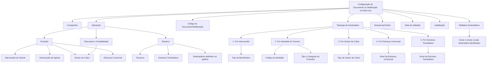

# Configuração de Destinatários de Documentos e Notificações no Reef.core

## 1. Metadados do Documento
- **Arquivo de Origem:** Não identificado no conteúdo fornecido
- **Tipo de Documento:** Especificação Técnica / Manual Funcional
- **Domínio / Sistema:** Módulo de Notificações — Reef.core
- **Público-Alvo:** Desenvolvedores, Arquitetos, Operação e Analistas Funcionais
- **Data/Versão Identificada:** Não identificada

---

## 2. Resumo Executivo & Contexto de Negócio

O documento descreve a configuração dos destinatários de documentos e notificações no contexto do sistema Reef.core. Um destinatário é uma pessoa física ou jurídica para a qual documentos e/ou notificações devem ser enviados. Para que o envio seja possível, os meios de contato dessas pessoas, como telefone celular e endereço de correio eletrônico, precisam estar corretamente identificados.

A configuração é aplicável às operações de Emissão, Sinistros, Tesouraria e Contabilidade. Cada operação possui figuras de destinatários próprias, tais como intervenientes de cliente, agentes, gestores de cobrança, estruturas comerciais, terceiros, estruturas de tramitação de sinistros e pessoas já definidas como destinatárias em apólices ou sinistros.

Para cada Documento ou Notificação é possível configurar não apenas uma, mas várias figuras de destinatários. A definição utiliza propriedades que identificam companhia, operação, código do documento/notificação, tipologia do destinatário, sequência e critérios complementares condicionais, como atividade de terceiro, tipo de beneficiário, tipo de gestor de cobrança, níveis de estrutura e atributos de fornecedor.

O catálogo permite manter histórico por meio da propriedade de data de validade e controlar a disponibilidade de uma associação por meio da propriedade de inabilitação. O comportamento operacional final depende do uso específico que cada operação do sistema faz desse catálogo.

---

## 3. Arquitetura, Componentes & Tecnologias Envolvidas

Os componentes e domínios explicitamente mencionados são:

| Componente / Domínio | Papel identificado no documento |
| :--- | :--- |
| Reef.core | Sistema no qual é configurado o catálogo de destinatários de documentos e notificações. |
| Módulo de Notificações | Módulo relacionado à geração e ao envio de documentos e notificações. |
| Operações Reef.core | Referência documental vinculada ao processo de configuração. |
| Emissão | Operação que utiliza intervenientes de cliente, agentes, gestores de cobrança e estrutura comercial como possíveis destinatários. |
| Sinistros | Operação que utiliza terceiros, estrutura tramitadora e destinatários definidos na apólice. |
| Tesouraria e Contabilidade | Operações que contemplam o gestor de cobrança como figura de destinatário. |
| Provedores | Domínio relacionado a atributos condicionais de tipo e categoria de fornecedor. |
| Home Solutions APIs Documentation Zeus | Texto de navegação ou referência presente no conteúdo bruto; não há detalhamento funcional adicional. |



**Nota de Análise:** O documento não detalha interfaces técnicas, métodos HTTP, contratos JSON, bancos de dados, URLs, tecnologias de implementação ou mecanismos concretos de obtenção dos meios de contato.

---

## 4. Regras de Negócio, Especificações Funcionais & Processos

### 4.1 Definição de destinatário

- Destinatários são pessoas físicas ou jurídicas para as quais Documentos e/ou Notificações serão enviados.
- Os meios de contato dos destinatários devem estar corretamente identificados para serem utilizados, incluindo telefone móvel e endereço de correio eletrônico.
- Uma configuração de Documento ou Notificação pode conter uma ou várias figuras de destinatários.

### 4.2 Figuras de destinatários por operação

#### Operações de Emissão

As figuras contempladas em Emissão são:

1. **Intervenção de Cliente**, incluindo exemplos como tomador, segurado e cessão de direitos.
2. **Intervenção de Agente**, incluindo agente principal, agente secundário e assessor.
3. **Gestor de cobrança**, incluindo domiciliamento bancário e cobrador.
4. **Estrutura comercial**, nos níveis primeiro, segundo e terceiro.

#### Operações de Sinistros

As figuras contempladas em Sinistros são:

1. **Terceiros**, incluindo tramitador, supervisor, hospital e fornecedor de vidros.
2. **Estrutura tramitadora**, nos níveis primeiro, segundo e terceiro.
3. **Qualquer pessoa definida na apólice como destinatária.**
4. **Qualquer pessoa definida em sinistros como destinatária.**

#### Operações de Tesouraria e Contabilidade

A figura contemplada é:

1. **Gestor de cobrança.**

### 4.3 Tipologias de destinatário

A propriedade **Tipologia de Destinatário** determina como o sistema deve obter corretamente as informações do destinatário. Os valores possíveis são:

1. Por Intervenção.
2. Por Atividade do Terceiro.
3. Por Gestor de Cobro.
4. Por Estrutura Comercial.
5. Por Estrutura Tramitadora.

### 4.4 Regras condicionais por tipologia

| Condição | Regra aplicável |
| :--- | :--- |
| Tipologia de Destinatário = `2` | O **Código de Atividade** informa qual atividade do terceiro deve ser considerada. |
| Tipologia de Destinatário = `1` | O **Tipo de Beneficiário** determina qual intervenção deve ser considerada, como Tomador, Segurado, Beneficiário, Condutor ou Credor Hipotecário. |
| Tipologia = atividade do terceiro e atividade = Agente | A **Forma de Atuação** determina a figura do intermediário na apólice, como agente principal, organizador ou assessor. |
| Tipologia de Destinatário = `3` | O **Tipo de Gestor de Cobro** determina o tipo de gestor de cobrança a considerar. |
| Tipologia de Destinatário = `4` | O **Nível da Estrutura Comercial/Tramitadora** indica se deve ser considerado o primeiro, segundo ou terceiro nível da estrutura comercial configurada para a companhia. |
| Tipologia de Destinatário = `5` | O **Nível da Estrutura Comercial/Tramitadora** indica se deve ser considerado o primeiro, segundo ou terceiro nível da estrutura tramitadora de sinistros configurada para a companhia. |
| Tipologia de Destinatário = `2` e atividade do terceiro = fornecedor | O **Tipo de Provedor** determina o tipo de fornecedor a considerar, como agência ou multimarca. |
| Tipologia de Destinatário = `2` e atividade do terceiro = fornecedor | A **Categoria do Provedor** determina a categoria do fornecedor para obtenção correta das informações da notificação. |
| Múltiplos Destinatários ativado | Havendo múltiplos destinatários para a mesma tipologia, o documento ou notificação deve ser gerado e enviado para cada destinatário encontrado. |
| Inabilitação ativada | O destinatário fica inabilitado para ser utilizado na geração e no envio de documentos ou notificações. |
| Data de Validade definida | A associação entre figura de destinatário e Documento fica disponível a partir da data definida. |

### 4.5 Rastreabilidade e histórico

A propriedade **Data de Validade** controla o momento a partir do qual a associação da figura de destinatário ao Documento fica disponível para uso. Uma configuração adequada dessa propriedade permite manter histórico das alterações efetuadas nas definições, além de permitir rastrear e explorar posteriormente essas informações.

### 4.6 Restrição de uso por operação

Cada operação do sistema pode fazer um uso muito específico do catálogo de destinatários. Portanto, a existência de uma configuração no catálogo não implica, por si só, que todas as operações utilizarão a mesma figura, critério ou comportamento de envio.

---

## 5. Tabelas de Parâmetros, Ambientes e Estruturas de Dados

| Item / Parâmetro | Descrição / Função | Tipo / Valores / Formato | Ambiente / Observações |
| :--- | :--- | :--- | :--- |
| Companhia | Informa o código da companhia sobre a qual é realizada a configuração do Documento ou Notificação. | Código de companhia; formato não detalhado. | Aplicável à configuração no sistema. |
| Operação | Determina a operação à qual os documentos serão associados. | Emissão, Sinistros, Tesouraria e Contabilidade. | Cada operação pode usar o catálogo de modo específico. |
| Código do Documento/Notificação | Identifica a chave do Documento ou Notificação no sistema. | Código; formato não detalhado. | Utilizado para identificar o Documento ou Notificação. |
| Tipologia de Destinatário | Determina a tipologia para obtenção correta da informação do destinatário. | `1` Por Intervenção; `2` Por Atividade do Terceiro; `3` Por Gestor de Cobro; `4` Por Estrutura Comercial; `5` Por Estrutura Tramitadora. | Determina os atributos condicionais aplicáveis. |
| Sequência/Ordem | Contém o número de sequência. | Número de sequência; formato não detalhado. | Não há regra de ordenação adicional detalhada. |
| Código de Atividade | Indica o código da atividade do terceiro a considerar. | Código de atividade; formato não detalhado. | Aplicável quando Tipologia de Destinatário = `2`. |
| Tipo de Beneficiário | Determina o tipo de intervenção utilizado para obter corretamente a informação. | Exemplos: Tomador, Segurado, Beneficiário, Condutor, Credor Hipotecário. | Aplicável quando Tipologia de Destinatário = `1`. |
| Forma de Atuação | Determina a forma de atuação do intermediário entre as possíveis figuras da apólice. | Exemplos: agente principal, organizador, assessor. | Aplicável quando a tipologia é atividade do terceiro e a atividade é Agente. |
| Tipo de Gestor de Cobro | Determina o tipo de gestor de cobrança a considerar. | Tipo não detalhado. | Aplicável quando Tipologia de Destinatário = `3`. |
| Nível da Estrutura Comercial/Tramitadora | Determina qual nível da estrutura deve ser considerado. | Primeiro, segundo ou terceiro nível. | Para estrutura comercial quando tipologia = `4`; para estrutura tramitadora de sinistros quando tipologia = `5`. |
| Tipo de Provedor | Determina o tipo de fornecedor a considerar para completar a informação da notificação. | Exemplos: agência, multimarca. | Aplicável quando Tipologia = `2` e a atividade do terceiro é fornecedor. |
| Categoria do Provedor | Determina a categoria do fornecedor para obtenção correta da informação da notificação. | Categoria; valores não detalhados. | Aplicável quando Tipologia = `2` e a atividade do terceiro é fornecedor. |
| Múltiplos Destinatários | Define se múltiplos destinatários da mesma tipologia podem ser encontrados e processados. | Propriedade de ativação; valores não detalhados. | Quando ativada, gera e envia documento/notificação a cada destinatário encontrado. |
| Inabilitação | Define se o destinatário pode ser utilizado na geração e no envio. | Propriedade de ativação; valores não detalhados. | Quando estabelecida, o destinatário não pode ser utilizado. |
| Data de Validade | Define a data a partir da qual a associação da figura do destinatário ao Documento está disponível. | Data; formato não detalhado. | Permite histórico, rastreabilidade e exploração posterior de alterações. |
| Meios de contato | Informações necessárias para emprego no envio ao destinatário. | Exemplos: telefone móvel e endereço de correio eletrônico. | Devem estar corretamente identificados. |

---

## 6. Bateria de Perguntas & Respostas para RAG (FAQ Sintético)

### P1: O que é considerado um destinatário no módulo de notificações do Reef.core?
**R:** Um destinatário é uma pessoa física ou jurídica para a qual Documentos e/ou Notificações serão enviados. Para que o envio possa ocorrer, os meios de contato do destinatário, como telefone móvel e endereço de correio eletrônico, devem estar corretamente identificados.

### P2: É possível configurar mais de uma figura de destinatário para o mesmo Documento ou Notificação?
**R:** Sim. O documento informa que podem ser definidas várias figuras de destinatários para cada Documento ou Notificação configurada, e não apenas uma única figura.

### P3: Quais figuras de destinatários podem ser usadas em operações de Emissão?
**R:** Em Emissão podem ser utilizadas Intervenção de Cliente, como tomador, segurado e cessão de direitos; Intervenção de Agente, como agente principal, secundário e assessor; Gestor de Cobro, como domiciliamento bancário e cobrador; e Estrutura Comercial nos níveis primeiro, segundo e terceiro.

### P4: Quais destinatários são contemplados nas operações de Sinistros?
**R:** Em Sinistros são contemplados terceiros, como tramitador, supervisor, hospital e fornecedor de vidros; a estrutura tramitadora nos níveis primeiro, segundo e terceiro; qualquer pessoa definida na apólice como destinatária; e qualquer pessoa definida em sinistros como destinatária.

### P5: Quais são os valores possíveis da Tipologia de Destinatário?
**R:** A Tipologia de Destinatário admite cinco valores: `1` Por Intervenção, `2` Por Atividade do Terceiro, `3` Por Gestor de Cobro, `4` Por Estrutura Comercial e `5` Por Estrutura Tramitadora.

### P6: Quando o Código de Atividade deve ser informado?
**R:** O Código de Atividade deve ser considerado quando a Tipologia de Destinatário possui o valor `2`, correspondente a destinatário obtido por Atividade do Terceiro. Esse código indica a atividade do terceiro que deve ser contemplada pelo sistema.

### P7: Quando o Tipo de Beneficiário é aplicável?
**R:** O Tipo de Beneficiário é aplicável quando a Tipologia de Destinatário possui o valor `1`, correspondente a Por Intervenção. Esse atributo determina qual tipo de intervenção deve ser considerado, com exemplos como Tomador, Segurado, Beneficiário, Condutor e Credor Hipotecário.

### P8: Como funciona a Forma de Atuação para destinatários relacionados a agentes?
**R:** A Forma de Atuação é aplicável quando a tipologia é por atividade do terceiro e a atividade do terceiro indica um Agente. Nessa condição, o atributo determina a forma de atuação do intermediário nas figuras possíveis da apólice, como agente principal, organizador ou assessor.

### P9: O que ocorre quando a propriedade Múltiplos Destinatários está ativada?
**R:** Quando Múltiplos Destinatários está ativada, podem ser encontrados vários destinatários para a mesma tipologia. O Documento ou Notificação deve então ser gerado e enviado para cada destinatário identificado.

### P10: Qual é o efeito da propriedade Inabilitação?
**R:** A propriedade Inabilitação estabelece que o Destinatário está inabilitado para ser utilizado na geração e no envio de documentos ou notificações.

### P11: Para que serve a Data de Validade na associação de destinatários?
**R:** A Data de Validade estabelece a data a partir da qual a associação entre a figura do Destinatário e o Documento fica disponível no sistema. A correta configuração permite manter histórico das alterações nas definições e rastrear ou explorar posteriormente essas informações.

### P12: Quais atributos adicionais devem ser usados quando o terceiro é um fornecedor?
**R:** Quando a Tipologia de Destinatário possui o valor `2` e a atividade do terceiro indica que se trata de um fornecedor, devem ser considerados o Tipo de Provedor, que pode incluir exemplos como agência ou multimarca, e a Categoria do Provedor.

---

## 7. Glossário de Termos, Siglas & Conceitos-Chave

- **Reef.core:** Sistema mencionado como contexto do catálogo de destinatários e das operações associadas.
- **Documento/Notificação:** Entidade configurada no sistema e associada a uma ou mais figuras de destinatários.
- **Destinatário:** Pessoa física ou jurídica para a qual um Documento e/ou Notificação é enviado.
- **Emissão:** Operação que contempla intervenções de cliente, agentes, gestores de cobrança e estrutura comercial.
- **Sinistros:** Operação que contempla terceiros, estrutura tramitadora e destinatários definidos em apólices ou sinistros.
- **Tesouraria e Contabilidade:** Operações que contemplam o gestor de cobrança como figura de destinatário.
- **Intervenção de Cliente:** Figura de destinatário relacionada a participantes como tomador, segurado, beneficiário, condutor ou credor hipotecário.
- **Intervenção de Agente:** Figura de destinatário relacionada a agentes, como principal, secundário ou assessor.
- **Gestor de Cobro:** Figura associada à gestão de cobrança, incluindo domiciliamento bancário e cobrador.
- **Estrutura Comercial:** Estrutura configurada para a companhia com primeiro, segundo e terceiro níveis.
- **Estrutura Tramitadora:** Estrutura de tramitação de sinistros com primeiro, segundo e terceiro níveis.
- **Atividade do Terceiro:** Critério de obtenção de destinatário baseado na atividade atribuída a um terceiro.
- **Forma de Atuação:** Atributo que define a atuação do intermediário em figuras da apólice, como agente principal, organizador ou assessor.
- **Provedor:** Terceiro cuja atividade é fornecedor e que pode exigir Tipo de Provedor e Categoria do Provedor.
- **Data de Validade:** Data a partir da qual a associação entre figura de destinatário e Documento pode ser usada.
- **Inabilitação:** Propriedade que impede o uso de um destinatário na geração e no envio.
- **Múltiplos Destinatários:** Propriedade que permite gerar e enviar o Documento ou Notificação para todos os destinatários encontrados da mesma tipologia.

---

## 8. Notas Críticas, Riscos & Limitações

- O documento não fornece formatos, tamanhos, obrigatoriedade técnica ou catálogos de valores para códigos de companhia, documentos, atividades, gestores de cobrança, tipos de provedores ou categorias de provedores.
- O documento não especifica endpoints, APIs, contratos JSON, mecanismos de persistência, mecanismos de envio, integração com e-mail, SMS ou outros canais de notificação.
- A correta identificação dos meios de contato é uma dependência explícita para o envio de Documentos e/ou Notificações.
- A configuração incorreta da tipologia pode impedir a obtenção correta das informações do destinatário, pois diversos atributos possuem aplicabilidade condicional.
- A ativação de Múltiplos Destinatários pode resultar na geração e no envio para cada destinatário identificado na mesma tipologia.
- A propriedade Inabilitação impede o uso do destinatário na geração e no envio.
- Cada operação do sistema pode usar o catálogo de destinatários de maneira muito específica; a configuração deve considerar o contexto operacional em que será utilizada.
- **Nota de Análise:** O documento menciona referências a Módulo de Notificações, Operações Reef.core, Provedores e Perguntas frequentes, mas não apresenta o conteúdo dessas diretrizes ou documentos vinculados.

---

## 9. Conteúdo Bruto Estruturado (Referência Fiel)

```text
--- [PÁGINA 1 DE 4] ---

Configuración de los DESTINATARIOS de los
Documentos/Notificaciones
Objetivo
Los destinatarios son aquellas personas Físicas/Jurídicas a quienes se van a enviar los
Documentos y/o Notificaciones.
Para ello, la información de los medios de contacto de dichas personas (teléfono móvil, dirección de
correo electrónico, ...) tiene que estar correctamente identificada para poder ser empleada.
Las figuras que se contemplan son para las operaciones de Emisión:
Intervención de Cliente (tomador, asegurado, cesión de derechos, etc.)
Intervención de Agente (principal, secundario, asesor, etc.)
Gestor de cobro (domiciliación bancaria, cobrador, etc.)
Estructura comercial (1er. nivel, 2do. nivel y 3er. nivel)
Las figuras que se contemplan son para las operaciones de Siniestros:
Terceros (tramitador, supervisor, hospital, cristalero)
Estructura tramitadora (1er. nivel, 2do. nivel y 3er. nivel)
Cualquiera de los definidos en la póliza como destinatario
Las figuras que se contemplan son para las operaciones de Tesorería y Contabilidad
Gestor de cobro.
 /
 CF
Home Solutions APIs Documentation Zeus
EN


--- [PÁGINA 2 DE 4] ---

Cualquiera de los definidos en la póliza como destinatario.
Cualquiera de los definidos en siniestros como destinatario.
Em importante tener en cuenta que se pueden definir no solamente una sino varias figuras de
destinatarios por cada documento o Notificación configurada.
Propiedades
Otras Propiedades
Propiedades
Compañía.
Esta propiedad le indica al sistema el código de la compañía sobre la que se está realizando la
configuración del Documento o Notificación.
Operación
Este campo determina la Operación a la que se van a asociar los documentos.
Código del Documento/Notificación
Este atributo identifica la clave que identificará al Documento o Notificación en el Sistema.
Tipología de Destinatario
Este atributo determina la tipología de destinatario de la notificación para poder obtener la
información correctamente, siendo sus posibles valores:
1. Por Intervención.
2. Por la Actividad del Tercero.
3. Por el Gestor de Cobro.
4. Por la Estructura Comercial.
5. Por la Estructura Tramitadora.
Secuencia/Orden
Este dato contiene el Número de Secuencia.
Código de Actividad
Siempre y cuando la tipología del destinatario tenga un valor '2', esta propiedad indica en el sistema
el código de la Actividad del Tercero que se ha de contemplar.


--- [PÁGINA 3 DE 4] ---

Tipo de Beneficiario
Siempre y cuando la tipología del destinatario tenga un valor '1', esta propiedad determinará el tipo
de intervención que se ha de contemplar para obtener la información adecuadamente: Tomador,
Asegurado, Beneficiario, Conductor, Acreedor Hipotecario,...
Forma de Actuación
Siempre y cuando la tipología del destinatario sea por la actividad del tercero y la actividad del
tercero sea de un Agente, este atributo determina la forma de actuación del intermediario dentro de
las posibles figuras de la póliza (si es el agente principal, el organizador, el asesor,...).
Tipo de Gestor de Cobro
Siempre y cuando la tipología del destinatario tenga un valor '3' este campo determinará el Tipo de
Gestor de cobro que se ha de contemplar.
Nivel de la Estructura Comercial/Tramitadora
Siempre y cuando la tipología del destinatario tenga un valor '4' este atributo determina cual de los
posibles niveles de la estructura comercial configurada para la compañía es el que se ha de
contemplar: si el primer, el segundo o el tercer nivel.
En caso que la tipología del destinatario tenga un valor '5' este atributo determina cual de los posibles
niveles de la estructura tramitadora de siniestros configurada para la compañía es el que se ha de
contemplar para obtener la información.
Tipo de Proveedor
Siempre y cuando la tipología del destinatario tenga un valor '2' y la actividad del tercero indique que
es un proveedor, este campo determinará el tipo de proveedor que se ha de contemplar para
completar la información de la notificación: si son de agencia, multi marca,...
Categoría del Proveedor
Siempre y cuando la tipología del destinatario tenga un valor '2' y la actividad del tercero indique que
es un proveedor, este atributo determinará su categoría para obtener la información de la notificación
correctamente.
¿Múltiples Destinatarios?
La activación de esta propiedad establece que se pueden encontrar múltiples Destinatarios para la
misma tipología de Destinatario y por tanto el documento o notificación se tiene que generar y enviar
a cada uno de ellos.


--- [PÁGINA 4 DE 4] ---

Otras Propiedades
Inhabilitación
Esta propiedad establece que el Destinatario está inhabilitado para poder ser utilizado en la
generación y envío de los documentos o notificaciones.
Fecha de Validez
Esta propiedad establece la fecha a partir de la cual la asociación de la figura del Destinatario al
Documento está disponible en el sistema para ser utilizada, por lo que una correcta configuración
habilita tener un histórico de los cambios efectuados en las definiciones y poder así trazar y explotar
posteriormente esta información.
Vínculos
Relación de Directrices y Documentos funcionales cuya lectura recomendada para evitar que la
interpretación aislada del presente documento pueda conducir a error.
Módulo de Notificaciones
Operaciones Reef.core
Proveedores
Preguntas frecuentes
(1) ¿Existe alguna restricción que deba ser tomada en cuenta en la configuración y posterior uso del
catálogo de destinatarios de Reef.core?
Cada operación del sistema podrá realizar un uso muy específico de este catálogo.
```
