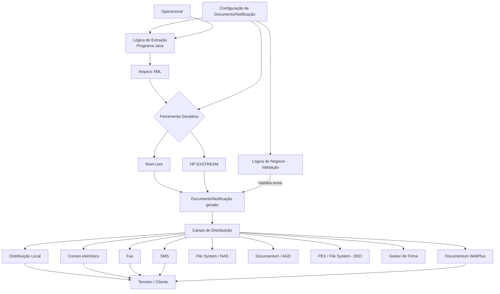

# Definição dos Atributos de Documentos e Notificações no Reef.core

## 1. Metadados do Documento
- **Arquivo de Origem:** Não identificado
- **Tipo de Documento:** Especificação Técnica
- **Domínio / Sistema:** Reef.core; documentos e notificações corporativas
- **Público-Alvo:** Desenvolvedores, Arquitetos, Operação, Tecnologia e Processos
- **Data/Versão Identificada:** Não identificada

---

## 2. Resumo Executivo & Contexto de Negócio

O documento descreve os atributos necessários para configurar documentos e notificações que podem ser gerados e enviados a terceiros. Os documentos ou notificações podem pertencer a classificações contratuais, comerciais, informativas, Voz del Cliente ou operativas.

A configuração contempla propriedades de identificação, validade, versão, companhia, escopo de entrada ou saída, canais de distribuição e propriedades operativas. Esses atributos determinam como um documento ou notificação é gerado, validado, distribuído, armazenado e disponibilizado ao destinatário.

O Reef.core pode atuar diretamente como ferramenta geradora e distribuidora de documentos ou integrar-se a ferramentas corporativas, incluindo HP EXSTREAM. A geração pode exigir uma lógica de extração Java para obter dados operacionais, gerar um arquivo XML e integrá-lo à ferramenta de composição e envio.

O modelo também prevê controles de negócio para decidir se um documento ou notificação está habilitado para envio. A lógica de validação permite aplicar exceções operacionais, como impedir a impressão direta de CC.PP. para flotilhas de automóveis no MAPFRE México e direcionar o processamento para modo batch.

A responsabilidade pela implementação e configuração adequadas das lógicas de extração e validação é atribuída ao departamento de Tecnologia e Processos.

---

## 3. Arquitetura, Componentes & Tecnologias Envolvidas

Os componentes e conceitos identificados são:

| Componente / Tecnologia | Papel identificado no documento |
| :--- | :--- |
| **Reef.core** | Pode gerar e distribuir documentos ou notificações; também hospeda o submódulo de notificações. |
| **HP EXSTREAM** | Ferramenta corporativa de geração de documentos; fornece a plantilla de desenho do documento. |
| **Programa Java / Lógica de Extração** | Extrai dados do operacional e gera arquivo XML para integração com a ferramenta de composição e envio. |
| **XML** | Arquivo gerado pela lógica de extração para transportar as informações requeridas pelo documento ou notificação. |
| **Operacional** | Fonte de dados utilizada pela lógica de extração. |
| **Documentum / AGD** | Gestor documental corporativo usado para arquivamento de documentos. |
| **Documentum WebPlus** | Mecanismo para disponibilizar, por vínculo na Internet, documentos residentes no gestor documental corporativo. |
| **NAS** | Destino de documentos distribuídos por File System. |
| **PEX / File System – DED** | Local de depósito para posterior incorporação ao processo de Distribuição Externalizada de Documentação. |
| **Gestor de Firma** | Serviço externo responsável por executar o tipo de assinatura solicitado. |
| **SMS** | Canal para envio de mensagens ao telefone móvel e, em cenários de URL privada, possível entrega da chave de acesso. |
| **Correio eletrônico** | Canal para envio de documentos anexados e links de acesso a documentos. |
| **Fax** | Canal de distribuição para o telefone indicado. |
| **Distribuição Local** | Retorno síncrono do documento na resposta do serviço web para apresentação ou impressão pelo transacional. |



> **Nota de Análise:** O documento não especifica contratos HTTP, endpoints, portas, formatos detalhados do XML, modelos de dados, interfaces de integração ou mecanismos técnicos de comunicação entre Reef.core, HP EXSTREAM, Documentum e o Gestor de Firma.

---

## 4. Regras de Negócio, Especificações Funcionais & Processos

### 4.1 Configuração e identificação

1. A propriedade **Companhia** informa ao sistema o código da companhia para a qual está sendo configurado o documento ou notificação.
2. O **Código do Documento/Notificação** identifica a chave do documento ou notificação no sistema.
3. A **Data de Validade** determina a data a partir da qual a definição do documento fica disponível para uso no sistema.
4. A configuração correta da data de validade permite manter histórico das alterações efetuadas nas definições, rastrear alterações e explorar posteriormente essas informações.
5. A propriedade **Entrada ou Saída** identifica o âmbito de uso do documento ou notificação conforme os valores permitidos no catálogo do núcleo.
6. A propriedade **Versão** estabelece a versão do documento ou notificação.
7. A propriedade **Inhabilitación** define que o atributo de documento ou notificação está desabilitado para utilização.
8. O campo **Aplica Retenção** determina se o documento ou notificação pode ficar retido.

### 4.2 Canais de distribuição

1. **Distribuição Local:** o documento é devolvido de forma síncrona na resposta do serviço web ao transacional. O transacional é responsável por apresentar o documento em tela ou enviá-lo a uma impressora.
2. **Distribuição por Correio Eletrônico:** o documento é enviado como anexo em um e-mail para os endereços indicados.
3. **Distribuição por Fax:** o documento é enviado por fax ao telefone indicado.
4. **Distribuição por SMS:** uma mensagem é enviada ao telefone móvel indicado.
5. **Distribuição por File System:** o documento é depositado em uma NAS.
6. **Distribuição por URL Privada:** o documento fica acessível pela Internet por meio de um link enviado ao cliente por correio eletrônico. O acesso depende de uma chave, que pode ser encaminhada por SMS ou informada no próprio e-mail sem ser explicitamente incluída, usando, por exemplo, Documento Nacional de Identidade ou número da apólice.
7. **Distribuição por Gestor Documental:** o documento é arquivado no gestor documental corporativo, identificado como AGD/Documentum.
8. **Distribuição por Provedor Externo:** o documento é depositado em um File System para posterior incorporação ao processo de Distribuição Externalizada de Documentação, identificado como DED.
9. **Distribuição por Assinatura Eletrônica:** o documento é enviado ao serviço externo do Gestor de Firma, que realiza as ações necessárias para produzir o tipo de assinatura solicitado, incluindo assinatura por terceiros de confiança ou assinatura biométrica.
10. **Distribuição por Gestor Documental via Vínculo:** documentos residentes no gestor documental corporativo são disponibilizados na Internet por um link enviado por correio eletrônico. O acesso usa uma chave que pode ser enviada por SMS ou derivada de informação comunicada no e-mail, como Documento Nacional de Identidade ou número da apólice.

### 4.3 Geração e extração de dados

1. A propriedade **Plantilla Diseño Documento** contém o código da plantilla EXSTREAM utilizada como base para a codificação da lógica de extração Java.
2. A lógica de extração deve considerar os canais de distribuição e as etiquetas necessárias para gerar e distribuir o documento.
3. A propriedade **Herramienta Generadora** determina explicitamente qual ferramenta gera e distribui o documento ou notificação.
4. O catálogo identifica duas ferramentas:
   - Tipo `1`: Reef.core.
   - Tipo `2`: HP EXSTREAM.
5. A **Lógica de Extracción** é um programa Java que gera um arquivo XML.
6. O programa Java extrai do operacional todas as informações requeridas pelo documento ou notificação para integração com a ferramenta responsável pela composição e envio.
7. Os atributos necessários para completar a operação variam conforme o meio de envio definido e utilizado.
8. Para envio de uma carta de finiquito de sinistro por e-mail ao beneficiário como arquivo anexo, são necessárias duas ações:
   - Uma ação para enviar o correio eletrônico.
   - Uma ação para gerar e anexar o arquivo físico ao e-mail.
9. A ação de envio de e-mail exige conhecer o endereço de correio eletrônico, definir o remetente, redigir o assunto e redigir o corpo do e-mail.
10. A ação de geração do anexo exige conhecer a plantilla definida na ferramenta corporativa e os dados exigidos pelo desenho da plantilla.
11. Entre os dados exemplificados para integração estão logo, firma, dados registrais da entidade MAPFRE, nome e sobrenomes do beneficiário e valor final da indenização.

### 4.4 Indexação documental e obtenção

1. Se o documento precisar ser distribuído e armazenado no Gestor Documental, deve ser indicado o método de indexação dentro da relação local de Modelos e Tipos Documentais existentes.
2. A propriedade **Método de Obtención del Documento** identifica o método de obtenção do documento ou notificação conforme os valores permitidos no catálogo do núcleo.

### 4.5 Validação de negócio

1. A **Lógica de Negócio - Validação** é um procedimento que verifica se um documento ou notificação deve ser considerado habilitado e enviado à ferramenta corporativa responsável pela distribuição.
2. A lógica de validação pode restringir um canal de distribuição mesmo que esse canal esteja configurado como habilitado de forma geral.
3. No exemplo do MAPFRE México, flotilhas de automóveis não devem imprimir suas CC.PP. diretamente, mas em modo batch.
4. Nesse exemplo, mesmo que o canal de Distribuição Local esteja habilitado para todas as operações de emissão de apólices, a lógica de validação deve impedir a impressão direta para flotilhas de automóveis.
5. O departamento de Tecnologia e Processos é responsável por configurar e implementar corretamente as lógicas de Extração e Validação.

---

## 5. Tabelas de Parâmetros, Ambientes e Estruturas de Dados

| Item / Parâmetro | Descrição / Função | Tipo / Valores / Formato | Ambiente / Observações |
| :--- | :--- | :--- | :--- |
| Companhia | Informa o código da companhia sobre a qual ocorre a configuração. | Código de companhia | Aplicável à configuração de documento ou notificação. |
| Código do Documento/Notificação | Identifica a chave do documento ou notificação no sistema. | Chave identificadora | Não há formato detalhado. |
| Data de Validade | Define quando a definição do documento fica disponível para uso. | Data | Permite histórico, rastreabilidade e exploração de alterações. |
| Entrada ou Saída | Identifica o âmbito de uso do documento ou notificação. | Valores permitidos no catálogo do núcleo | Valores não detalhados. |
| Versão | Estabelece a versão do documento ou notificação. | Versão | Formato não informado. |
| Plantilla Diseño Documento | Contém o código da plantilla EXSTREAM base para a lógica de extração Java. | Código de plantilla EXSTREAM | Deve considerar canais de distribuição e etiquetas necessárias. |
| Herramienta Generadora | Define a ferramenta que gera e distribui o documento ou notificação. | `1` = Reef.core; `2` = HP EXSTREAM | O sistema também admite integração com ferramentas corporativas. |
| Lógica de Extracción | Programa Java que gera XML e extrai os dados necessários do operacional. | Programa Java; arquivo XML | Integra dados à ferramenta de composição e envio. |
| Indexação Gestor Documental | Define o método de indexação do documento no gestor documental. | Método de indexação | Usado quando há distribuição e armazenamento no gestor documental. |
| Método de Obtención del Documento | Identifica o método de obtenção do documento ou notificação. | Valores permitidos no catálogo do núcleo | Valores não detalhados. |
| Lógica de Negócio - Validación | Decide se o documento ou notificação deve ser habilitado e enviado à ferramenta corporativa. | Procedimento de validação | Pode aplicar exceções por cenário de negócio. |
| Aplica Retenção | Determina se o documento ou notificação pode ficar retido. | Campo booleano inferível pelo comportamento; valores não explicitados | O documento não detalha o tratamento posterior de retenção. |
| Inhabilitación | Estabelece que o atributo está desabilitado para uso. | Propriedade de habilitação | Valores ou mecanismo não detalhados. |

| Canal / Destino | Descrição / Função | Tipo / Valores / Formato | Ambiente / Observações |
| :--- | :--- | :--- | :--- |
| Distribuição Local | Retorna o documento síncronamente na resposta do serviço web ao transacional. | Resposta síncrona | O transacional apresenta em tela ou envia para impressora. |
| Correio Eletrônico | Envia o documento anexado a um e-mail. | Endereços indicados | Exige endereço, remetente, assunto e corpo do e-mail. |
| Fax | Envia o documento por fax. | Telefone indicado | Não há requisitos adicionais detalhados. |
| SMS | Envia uma mensagem ao telefone móvel indicado. | Telefone móvel | Também pode entregar chave de acesso a URL privada. |
| File System | Deposita o documento em uma NAS. | NAS | Caminho não informado. |
| URL Privada | Disponibiliza documento na Internet por link enviado por e-mail. | Link e chave de acesso | A chave pode ser enviada por SMS ou baseada em informação como DNI ou número da apólice. |
| Gestor Documental | Arquiva o documento no gestor documental corporativo. | Documentum / AGD | Requer método de indexação quando houver armazenamento. |
| Provedor Externo | Deposita o documento para distribuição externalizada posterior. | PEX / File System – DED | Destinado ao processo DED. |
| Assinatura Eletrônica | Envia o documento ao serviço externo de assinatura. | Gestor de Firma | Exemplos: terceiros de confiança e assinatura biométrica. |
| Gestor Documental via Vínculo | Disponibiliza por Internet documentos residentes no gestor documental. | Documentum WebPlus | Link enviado por e-mail; acesso protegido por chave. |

| Informação requerida no exemplo de e-mail com anexo | Finalidade |
| :--- | :--- |
| Endereço de correio eletrônico | Identificar o destinatário do e-mail. |
| Remetente | Definir quem envia o e-mail. |
| Assunto | Definir o assunto da comunicação. |
| Corpo do e-mail | Definir o conteúdo textual da comunicação. |
| Plantilla corporativa | Gerar o arquivo físico anexado. |
| Logo | Preencher o desenho da plantilla, quando necessário. |
| Firma | Preencher o desenho da plantilla, quando necessário. |
| Dados registrais da entidade MAPFRE | Preencher o desenho da plantilla, quando necessário. |
| Nome e sobrenomes do beneficiário | Personalizar o documento. |
| Valor final da indenização | Informar o valor associado à carta de finiquito do sinistro. |

---

## 6. Bateria de Perguntas & Respostas para RAG (FAQ Sintético)

### P1: Qual é o objetivo da configuração de atributos de documentos e notificações?
**R:** A configuração define as propriedades dos documentos e notificações que podem ser gerados e enviados a terceiros, independentemente de sua classificação ser contratual, comercial, informativa, Voz del Cliente ou operativa. Os atributos abrangem identificação, validade, canais de distribuição, geração, extração de dados, indexação e validação de negócio.

### P2: O que a Data de Validade controla em um documento ou notificação?
**R:** A Data de Validade estabelece a data a partir da qual a definição do documento ou notificação fica disponível para uso no sistema. Uma configuração correta permite manter histórico das modificações nas definições, rastrear alterações e explorar essas informações posteriormente.

### P3: Como funciona a Distribuição Local?
**R:** Na Distribuição Local, o documento é devolvido de forma síncrona na resposta do serviço web ao transacional. O sistema transacional recebe o documento e fica responsável por apresentá-lo em tela ou enviá-lo a uma impressora.

### P4: Quais ferramentas podem gerar e distribuir documentos ou notificações?
**R:** O catálogo de Tipo de Ferramenta define `1` para Reef.core e `2` para HP EXSTREAM. O documento afirma que o submódulo de notificações é orientado à integração com ferramentas corporativas, mas também permite que o próprio Reef.core realize a geração e a distribuição.

### P5: Qual é a responsabilidade da Lógica de Extração?
**R:** A Lógica de Extração é um programa Java que gera um arquivo XML e extrai do operacional as informações necessárias para integrar o documento ou notificação à ferramenta responsável pela composição e envio. Os dados extraídos dependem do canal de envio e do desenho da plantilla utilizada.

### P6: O que é necessário para enviar por e-mail uma carta de finiquito de sinistro como anexo?
**R:** São necessárias duas ações: uma para enviar o e-mail e outra para gerar e anexar o arquivo físico. Para o e-mail, devem ser conhecidos o endereço do destinatário, o remetente, o assunto e o corpo. Para o anexo, devem ser identificadas a plantilla da ferramenta corporativa e as informações requeridas pelo seu desenho, como logo, firma, dados registrais MAPFRE, nome e sobrenomes do beneficiário e valor final da indenização.

### P7: Como funciona a distribuição por URL Privada?
**R:** O documento é disponibilizado pela Internet por meio de um link enviado ao cliente por correio eletrônico. O acesso exige uma chave, que pode ser enviada por SMS ou ser obtida a partir de informação comunicada no e-mail sem incluir a chave explicitamente, como Documento Nacional de Identidade ou número da apólice.

### P8: Em que situação é necessário informar a indexação no Gestor Documental?
**R:** Quando o documento deve ser distribuído e, consequentemente, armazenado no Gestor Documental, deve ser indicado o método de indexação dentro da relação de Modelos e Tipos Documentais existentes localmente.

### P9: Qual é a finalidade da Lógica de Negócio - Validação?
**R:** A Lógica de Negócio - Validação verifica se um documento ou notificação deve ser considerado habilitado e enviado à ferramenta corporativa que realizará a distribuição. Ela pode restringir a aplicação de um canal de distribuição que esteja habilitado genericamente.

### P10: Como a validação trata flotilhas de automóveis no exemplo de MAPFRE México?
**R:** O documento indica que as flotilhas de automóveis no MAPFRE México não devem imprimir CC.PP. diretamente, devendo fazê-lo em modo batch. Mesmo que a Distribuição Local esteja habilitada para operações de emissão de apólices, uma lógica de validação corretamente implementada impede a impressão direta nesse cenário.

### P11: O que ocorre na Distribuição por Provedor Externo?
**R:** O documento é depositado em um File System para posterior incorporação ao processo de Distribuição Externalizada de Documentação, identificado como DED. O documento associa esse canal a PEX / File System – DED.

### P12: Quem é responsável pela implementação das lógicas de extração e validação?
**R:** O departamento de Tecnologia e Processos é responsável por configurar e implementar corretamente as lógicas de Extração e Validação.

---

## 7. Glossário de Termos, Siglas & Conceitos-Chave

- **AGD:** Gestor documental corporativo mencionado em associação ao Documentum.
- **Batch:** Modo de processamento citado para impressão de CC.PP. de flotilhas de automóveis no MAPFRE México.
- **CC.PP.:** Sigla mencionada no exemplo de MAPFRE México; o documento não apresenta sua expansão.
- **DED:** Distribuição Externalizada de Documentação.
- **DNI / Documento Nacional de Identidade:** Exemplo de informação que pode ser usada para acesso a documentos disponibilizados por URL privada ou Documentum WebPlus.
- **Documentum:** Gestor documental corporativo no qual documentos podem ser arquivados.
- **Documentum WebPlus:** Mecanismo para acessar, por link de Internet, documentos residentes no gestor documental corporativo.
- **File System:** Sistema de arquivos utilizado para depósito de documentos, inclusive em NAS ou para DED.
- **Gestor de Firma:** Serviço externo que toma as ações necessárias para produzir a assinatura requerida.
- **HP EXSTREAM:** Ferramenta corporativa de geração de documentos e origem da plantilla de desenho de documento.
- **Lógica de Extração:** Programa Java que extrai dados do operacional e gera XML para integração com a ferramenta de composição e envio.
- **Lógica de Negócio - Validação:** Procedimento que verifica se um documento ou notificação deve ser habilitado e enviado para distribuição.
- **NAS:** Destino de armazenamento para documentos distribuídos por File System.
- **Operacional:** Fonte de informações que a lógica de extração consulta para gerar o XML.
- **PEX:** Termo associado a File System – DED para distribuição em provedor externo; o documento não apresenta sua expansão.
- **Plantilla EXSTREAM:** Modelo de desenho de documento utilizado como base para a lógica de extração Java.
- **Reef.core:** Sistema que pode gerar e distribuir documentos ou notificações.
- **SMS:** Serviço de mensageria para envio de mensagem ao telefone móvel indicado.
- **URL Privada:** Link de Internet protegido por chave para acesso a documentos.

---

## 8. Notas Críticas, Riscos & Limitações

- O documento não informa o nome do arquivo de origem, data, versão documental, autoria ou responsáveis pelo conteúdo.
- O documento não detalha os valores permitidos pelo catálogo do núcleo para **Entrada ou Saída** e **Método de Obtención del Documento**.
- O documento não informa formatos, esquemas, campos obrigatórios ou contratos do arquivo XML gerado pela Lógica de Extração.
- O documento não especifica interfaces, protocolos, contratos, endpoints ou mecanismos técnicos de integração com HP EXSTREAM, Documentum, Documentum WebPlus, NAS, PEX/DED ou Gestor de Firma.
- A segurança da URL Privada depende de uma chave de acesso, mas o documento não especifica geração, armazenamento, validade, expiração, tentativa de acesso, auditoria ou revogação dessa chave.
- A distribuição por e-mail requer endereço, remetente, assunto e corpo, mas não define validações, tratamento de falhas, reenvio ou requisitos de segurança.
- A distribuição por File System cita NAS e DED, mas não informa caminhos, permissões, convenções de nomes, retenção ou confirmação de processamento.
- O texto afirma que Tecnologia e Processos é responsável pelas lógicas de Extração e Validação; portanto, erros de configuração ou implementação dessas lógicas podem afetar a geração, habilitação e distribuição dos documentos.
- A sigla **CC.PP.** é utilizada no exemplo de MAPFRE México sem expansão ou definição.
- O documento menciona vínculos entre **Documentos / Notificações** e **Documentos / Variables o Etiquetas**, mas não detalha regras, cardinalidades ou estruturas desses vínculos.

---

## 9. Conteúdo Bruto Estruturado (Referência Fiel)

```text
--- [PÁGINA 1 DE 5] ---

DEFINICIÓN de los Atributos de los
Documentos/Notificaciones
Objetivo
Detallar las Propiedades de todos aquellos Documentos o posibles Notificaciones que se pueden
generar y enviar a Terceras Personas cualesquiera que sea su clasificación: Contractuales,
Comerciales, Informativas, Voz del Cliente, Operativas,...
Propiedades
Canales de Distribución
Propiedades Operativas
Propiedades
Compañía.
Esta propiedad le indica al sistema el código de la compañía sobre la que se está realizando la
configuración del Documento o Notificación.
Código del Documento/Notificación
Este atributo identifica la clave que identificará al Documento o Notificación en el Sistema.
Fecha de Validez
 / 
 CF
Home Solutions APIs Documentation Zeus
EN


--- [PÁGINA 2 DE 5] ---

Esta propiedad establece la fecha a partir de la cual la definición del Documento está disponible en el
sistema para ser utilizada, por lo que una correcta configuración habilita tener un histórico de los
cambios efectuados en las definiciones y poder así trazar y explotar posteriormente esta información.
Entrada o Salida
Esta propiedad identifica el ámbito de uso del documento o notificación de acuerdo con los valores
permitidos en el catálogo del núcleo.
Versión
Esta propiedad establece la versión del Documento o Notificación.
Canales de Distribución
Distribución Local
Esta propiedad establece si el documento se devuelve de forma síncrona en la respuesta del servicio
web entregándolo al transaccional, siendo éste quien se encargará de presentarlo por pantalla o
enviarlo a una impresora.
Distribución Correo Electrónico
El documento se enviará como documento adjunto en un correo electrónico a las direcciones
indicadas.
Distribución por Fax
Fax El Documento se enviará por Fax al Teléfono indicado.
Distribución por SMS (Mensajería)
SMS Se enviará un mensaje al Teléfono móvil indicado.
Distribución File System
Sistema de archivos – File System El Documento se depositará en una NAS.
Distribución URL Privada
Url privada El documento será accesible a través de Internet, mediante un link que se enviará al
cliente por correo electrónico. El acceso a la documentación se obtiene a través de una clave que se
podrá enviar al usuario por SMS o informándola en el propio correo electrónico sin incluirla
explícitamente (por ejemplo, utilizando el "Documento Nacional de Identidad", el "número de la
póliza", …)


--- [PÁGINA 3 DE 5] ---

Distribución Gestor Documental
Documentum el documento se archivará en el gestor documental corporativo (AGD).
Distribución Proveedor Externo
PEX / File System – DED (Distribución en proveedor externo) El Documento será depositado en
un file System para su posterior incorporación al proceso de Distribución Externalizada de
Documentación (DED).
Distribución Firma Electrónica
Firma Electrónica El documento se envía al servicio externo del Gestor de Firma que tomará las
acciones oportunas para que se produzca el tipo de firmado requerido en la petición, por ejemplo,
firmado por terceros de confianza, firma biométrica, ...
Distribución Gestor Documental vía Vínculo
Documentum WebPlus El documento o los documentos residentes en el gestor documental
corporativo, serán accesibles a través de Internet mediante un link que se enviará al cliente por
correo electrónico. El acceso a la documentación se obtiene a través de una clave que se podrá
enviar al usuario por SMS o informándola en el propio correo electrónico sin incluirla explícitamente
(por ejemplo, utilizando el "Documento Nacional de Identidad", el "número de la póliza", …)
Propiedades Operativas
Plantilla Diseño Documento
Esta propiedad contiene el código de la Plantilla EXSTREAM que servirá como base para la
codificación de la lógica de extracción JAVA (de acuerdo con los canales de distribución y las
etiquetas que sean necesarias rellenar para poder generar y distribuir nuestro documento).
Herramienta Generadora
Aunque en principio el sub módulo de notificaciones está orientado a la integración con las
herramientas corporativas de generación y envío de los Documentos, el sistema también permite que
sea el propio Reef.core el encargado de realizar ambas tareas y este atributo del catálogo establece
expresamente cual va a ser la herramienta generadora (y distribuidora) del Documento o Notificación.
TIPO HERRAMIENTA
1 Reef.core
2 HP EXSTREAM


--- [PÁGINA 4 DE 5] ---

Lógica de Extracción
Programa JAVA que permite generar ur archivo xml y que se encarga de extraer del Operacional toda
aquella información que necesita el Documento o Notificación para su integración con la herramienta
encargada de su composición y envío.
Dependiendo del medio de envío definido y empleado con el documento se habrán de indicar los
atributos específicos para poder completar la operación ya que los mismos varían dependiendo del
medio utilizado.
Por ejemplo, si queremos comunicarnos con el beneficiario de un siniestro para enviarle por correo
electrónico y como archivo anexo la carta finiquito del Siniestro, tendremos que completar dos
acciones diferentes:
Una primera que englobará todos las acciones que permitan enviar el correo electrónico, y
Una segunda que permita generar y anexar el archivo ‘físico’ al correo electrónico.
Por tanto y para la primera acción es necesario conocer la dirección de correo electrónico, definir
quien va a ser el remitente, redactar el asunto y el cuerpo del correo…,
En cambio para la segunda acción tendremos que conocer qué plantilla de las definidas en la
Herramienta Corporativa vamos a utilizar para su generación y dependiendo del diseño de la misma,
qué datos se han de transmitir desde el Operacional en la pieza de integración: Logo, Firma y datos
registrales de la entidad MAPFRE, Nombre y Apellidos del Beneficiario, importe de la indemnización
final, …
Indexación Gestor Documental
En el supuesto que el Documento deba ser distribuido y por tanto almacenado en el Gestor
Documental se debe indicar el método de indexación del documento dentro de la relación de
Modelos y Tipos Documentales existentes localmente.
Método de Obtención del Documento
Esta propiedad del catálogo identifica el método de obtención del documento o notificación de
acuerdo con los valores permitidos en el catálogo del núcleo.
Lógica de Negocio - Validación
Procedimiento que se encarga de verificar si para un Documento o Notificación se debe o no
considerar su habilitación y envío a la herramienta Corporativa encargada de su distribución.
Por Ejemplo, en MAPFRE México las Flotillas de Automóviles no deben imprimir sus CC.PP
directamente sino en forma Batch. Como consecuencia de ello y aunque por definición el CANAL de
Distribución Local estuviera habilitado para todas las operaciones de emisión de pólizas, con una
lógica de validación implementada correctamente se podría controlar que no fuera factible imprimirlas
en modo directo.


--- [PÁGINA 5 DE 5] ---

Es responsabilidad del departamento de Tecnología y Procesos configurar e implementar
correctamente las lógicas de Extracción y Validación.
Aplica Retención
Este campo determina si el documento/notificación puede quedar retenido.
Inhabilitación
Esta propiedad establece que el Atributo del Documento o Notificación está inhabilitado para poder
ser utilizado.
Vínculos
Documentos / Notificaciones
Documentos / Variables o Etiquetas
Preguntas frecuentes
```
