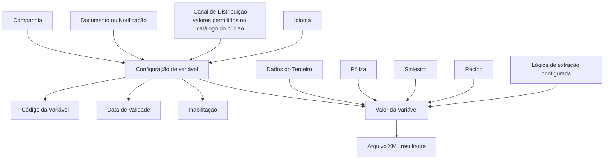

# Definição das Variáveis de Informação de Documentos e Notificações

## 1. Metadados do Documento
- **Arquivo de Origem:** Não identificado no conteúdo fornecido
- **Tipo de Documento:** Especificação Técnica
- **Domínio / Sistema:** Documentos / Notificações; configuração de arquivos XML
- **Público-Alvo:** Desenvolvedores, analistas funcionais e equipes de configuração
- **Data/Versão Identificada:** Não identificada

---

## 2. Resumo Executivo & Contexto de Negócio

O documento descreve as variáveis ou etiquetas de informação utilizadas na configuração de Documentos e Notificações. O objetivo declarado é detalhar essas variáveis conforme seus canais de distribuição, permitindo a correta composição dos arquivos XML resultantes.

A configuração está associada a uma companhia, a um código de Documento ou Notificação, a um canal de distribuição e a um idioma. Esses elementos identificam o contexto em que uma variável de informação será empregada pelo sistema.

Cada variável possui código, data de validade, valor e condição de inabilitação. A data de validade permite controlar quando uma definição se torna disponível e preservar histórico das alterações realizadas, viabilizando rastreabilidade e exploração posterior das informações.

O valor de uma variável pode ser constante, obtido de dados de entidades como Terceiro, Póliza, Siniestro ou Recibo, ou atribuído por padrão. O exemplo fornecido aborda uma notificação por correio eletrônico sobre a improcedência de um siniestro, com valores específicos para assunto e remetente, enquanto o destinatário é obtido dos dados do tomador da póliza por meio de lógica de extração configurada.

---

## 3. Arquitetura, Componentes & Tecnologias Envolvidas

Os elementos explicitamente citados são:

- **Documentos / Notificações:** entidades cuja configuração recebe variáveis de informação.
- **Variáveis / Etiquetas de informação:** valores utilizados na composição do XML resultante.
- **Canal de Distribuição:** contexto de distribuição em que uma variável associada ao Documento ou Notificação é usada.
- **Catálogo do núcleo:** origem dos valores permitidos para o Canal de Distribuição.
- **Arquivo XML resultante:** artefato conformado a partir da configuração das variáveis.
- **Lógica de extração:** configuração responsável por obter valores de dados como os do tomador da póliza.
- **Dados de Terceiro, Póliza, Siniestro e Recibo:** possíveis fontes para valores de variáveis.



**Nota de Análise:** o documento não detalha a estrutura XML, os métodos de extração, contratos de integração, tecnologias de implementação ou valores concretos do catálogo do núcleo.

---

## 4. Regras de Negócio, Especificações Funcionais & Processos

### Objetivo de configuração
1. Identificar a companhia sobre a qual a configuração das variáveis de Documento ou Notificação está sendo realizada.
2. Identificar o Documento ou a Notificação por meio de seu código.
3. Associar a variável de informação a um Canal de Distribuição válido no catálogo do núcleo.
4. Definir o idioma utilizado na definição de Documentos ou Notificações.
5. Definir o código da variável ou etiqueta a ser substituída por um valor na composição do XML resultante.
6. Definir a data a partir da qual a variável estará disponível para uso no sistema.
7. Definir se o valor da variável será constante, derivado de dados ou atribuído por padrão.
8. Definir se a variável está inabilitada para utilização.

### Identificação da configuração
- A propriedade **Companhia** indica ao sistema o código da companhia para a qual está sendo configurada uma variável de Documento ou Notificação.
- O atributo **Código do Documento/Notificação** identifica a chave que identificará o Documento ou a Notificação no sistema.
- A propriedade **Canal de Distribuição** identifica o canal em que a variável associada será empregada.
- O Canal de Distribuição deve utilizar valores permitidos no catálogo do núcleo.
- A propriedade **Idioma** é a chave do idioma empregado na definição de Documentos ou Notificações. O documento cita como exemplos espanhol, inglês e turco.

### Definição de variável e valor
- O atributo **Código da Variável** contém o código da variável ou etiqueta de informação que será substituída por um valor determinado durante a conformação do XML resultante.
- O atributo **Valor da Variável** contém o valor da variável de informação.
- O valor pode ser obtido dos dados de:
  - Terceiro;
  - Póliza;
  - Siniestro;
  - Recibo.
- O valor também pode possuir atribuição padrão.

### Vigência, histórico e rastreabilidade
- A propriedade **Fecha de Validez** estabelece a data a partir da qual a definição de uma variável em um Documento estará disponível no sistema.
- Uma configuração correta da data de validade permite manter histórico das mudanças efetuadas nas definições.
- O histórico permite rastrear e explorar posteriormente as informações relativas às definições de variáveis.

### Inabilitação
- A propriedade **Inhabilitación** determina que uma variável de Documento ou Notificação está inabilitada para utilização.

### Exemplo de notificação de improcedência de siniestro
Para enviar por correio eletrônico ao tomador da póliza uma notificação sobre a improcedência de um siniestro:

1. A etiqueta `EMAIL_ASUNTO` recebe o valor constante `Improcedencia de Siniestro`.
2. A etiqueta `EMAIL_FROM` recebe o valor constante `mapfre@mapfre.com`.
3. A etiqueta `EMAIL_TO` não recebe valor configurado.
4. O valor de `EMAIL_TO` é obtido dos dados do tomador da póliza no momento da execução da lógica de extração configurada para o Documento ou Notificação.

---

## 5. Tabelas de Parâmetros, Ambientes e Estruturas de Dados

| Item / Parâmetro | Descrição / Função | Tipo / Valores / Formato | Ambiente / Observações |
| :--- | :--- | :--- | :--- |
| Companhia | Indica o código da companhia sobre a qual é realizada a configuração das variáveis de Documento ou Notificação. | Código de companhia; formato não detalhado. | Aplicável à configuração de variáveis. |
| Código do Documento/Notificação | Identifica a chave do Documento ou Notificação no sistema. | Código/chave; formato não detalhado. | Associado à definição configurada. |
| Canal de Distribuição | Identifica o canal no qual a variável de informação será empregada. | Valores permitidos no catálogo do núcleo. | Aplicável a Documento ou Notificação. |
| Idioma | Chave do idioma empregado na definição de Documentos ou Notificações. | Exemplos: espanhol, inglês, turco. | Formato ou catálogo não detalhado. |
| Código da Variável | Código da variável ou etiqueta de informação substituída por um valor ao conformar o XML. | Código; formato não detalhado. | Participa da geração do XML resultante. |
| Fecha de Validez | Define a data a partir da qual a definição da variável estará disponível para utilização no sistema. | Data; formato não detalhado. | Permite histórico, rastreabilidade e exploração posterior de mudanças. |
| Valor da Variável | Contém o valor da variável de informação. | Valor constante, derivado de dados ou valor atribuído por padrão. | Pode ser obtido de Terceiro, Póliza, Siniestro ou Recibo. |
| Inhabilitación | Define que a variável do Documento ou Notificação está inabilitada para uso. | Propriedade de inabilitação; valores não detalhados. | Impede a utilização da variável. |
| `EMAIL_ASUNTO` | Etiqueta de assunto de e-mail para o exemplo de improcedência de siniestro. | Valor constante: `Improcedencia de Siniestro`. | Exemplo de Documento ou Notificação. |
| `EMAIL_FROM` | Etiqueta de remetente de e-mail para o exemplo de improcedência de siniestro. | Valor constante: `mapfre@mapfre.com`. | Exemplo de Documento ou Notificação. |
| `EMAIL_TO` | Etiqueta de destinatário de e-mail para o exemplo de improcedência de siniestro. | Sem valor configurado; obtido dos dados do tomador da póliza. | Obtido ao executar a lógica de extração configurada. |

---

## 6. Bateria de Perguntas & Respostas para RAG (FAQ Sintético)

### P1: Qual é o objetivo da definição de variáveis de informação para Documentos e Notificações?
**R:** O objetivo é detalhar as variáveis ou etiquetas utilizadas em Documentos e Notificações, considerando seus canais de distribuição, para conformar corretamente os arquivos XML resultantes.

### P2: Para que serve a propriedade Companhia na configuração de uma variável?
**R:** A propriedade Companhia informa ao sistema o código da companhia sobre a qual está sendo realizada a configuração da variável de um Documento ou Notificação.

### P3: Como o Código do Documento/Notificação é usado no sistema?
**R:** O Código do Documento/Notificação é o atributo que identifica a chave pela qual o Documento ou a Notificação será identificado no sistema.

### P4: Qual regra deve ser seguida ao preencher o Canal de Distribuição?
**R:** O Canal de Distribuição identifica o contexto de distribuição em que a variável será empregada e deve utilizar valores permitidos pelo catálogo do núcleo.

### P5: O que representa o Código da Variável na conformação de XML?
**R:** O Código da Variável identifica a variável ou etiqueta de informação que será substituída por um valor determinado durante a conformação do arquivo XML resultante.

### P6: Quais fontes podem fornecer o Valor da Variável?
**R:** O Valor da Variável pode ser obtido de dados de Terceiro, Póliza, Siniestro ou Recibo. O documento também informa que a variável pode receber um valor atribuído por padrão.

### P7: Qual é a finalidade da Fecha de Validez?
**R:** A Fecha de Validez estabelece a data a partir da qual a definição de uma variável no Documento estará disponível para uso no sistema. A configuração adequada dessa data permite manter histórico das alterações, rastrear definições e explorar posteriormente essas informações.

### P8: O que ocorre quando a propriedade Inhabilitación está configurada?
**R:** A propriedade Inhabilitación estabelece que a variável associada ao Documento ou à Notificação está inabilitada e não pode ser utilizada.

### P9: Como deve ser preenchida a variável `EMAIL_ASUNTO` no exemplo de improcedência de siniestro?
**R:** No exemplo fornecido, a etiqueta `EMAIL_ASUNTO` recebe o valor constante `Improcedencia de Siniestro`.

### P10: Qual valor deve ser configurado para `EMAIL_FROM` no exemplo apresentado?
**R:** A etiqueta `EMAIL_FROM` recebe o valor constante `mapfre@mapfre.com`.

### P11: Por que `EMAIL_TO` não possui valor configurado no exemplo?
**R:** A variável `EMAIL_TO` não recebe valor configurado porque seu valor é obtido dos dados do tomador da póliza durante a execução da lógica de extração configurada para o Documento ou Notificação.

### P12: Quais idiomas são citados como exemplos para a propriedade Idioma?
**R:** O documento cita espanhol, inglês e turco como exemplos de idiomas empregados na definição de Documentos ou Notificações.

---

## 7. Glossário de Termos, Siglas & Conceitos-Chave

- **Canal de Distribuição:** canal no qual uma variável de informação associada a um Documento ou Notificação será empregada.
- **Catálogo do núcleo:** catálogo que contém os valores permitidos para o Canal de Distribuição.
- **Código da Variável:** código da variável ou etiqueta de informação substituída por um valor na conformação do XML.
- **Documento / Notificação:** entidade configurável que utiliza variáveis de informação e canais de distribuição.
- **Etiqueta de informação:** denominação alternativa para uma variável de informação.
- **Fecha de Validez:** propriedade que define a data de disponibilização da definição de uma variável no sistema.
- **Inhabilitación:** propriedade que estabelece que uma variável está inabilitada para utilização.
- **Póliza:** entidade citada como possível fonte de dados para o valor de uma variável.
- **Recibo:** entidade citada como possível fonte de dados para o valor de uma variável.
- **Siniestro:** entidade citada como possível fonte de dados para o valor de uma variável; aparece no exemplo de notificação de improcedência.
- **Terceiro:** entidade citada como possível fonte de dados para o valor de uma variável.
- **Tomador da póliza:** pessoa cujos dados são utilizados para obter o destinatário `EMAIL_TO` no exemplo.
- **XML:** arquivo resultante conformado por meio da substituição de etiquetas ou variáveis de informação.

---

## 8. Notas Críticas, Riscos & Limitações

- O documento não identifica o nome do arquivo de origem, data, versão, autor ou organização responsável.
- Não são detalhados os valores concretos permitidos pelo catálogo do núcleo para o Canal de Distribuição.
- Não são informados formato, obrigatoriedade, tamanho ou regras de validação para códigos, idioma, data de validade e valores de variável.
- O documento não descreve a estrutura do arquivo XML resultante, incluindo elementos, atributos, namespaces ou exemplos completos de XML.
- A lógica de extração mencionada para obtenção de `EMAIL_TO` não possui detalhamento técnico, regras de prioridade, tratamento de ausência de dados ou contrato de integração.
- Não são definidos os efeitos operacionais, técnicos ou de auditoria decorrentes da inabilitação de uma variável.
- A terceira página não possui conteúdo textual recuperável além da indicação de página em branco ou elementos visuais/imagem.

---

## 9. Conteúdo Bruto Estruturado (Referência Fiel)

```text
--- [PÁGINA 1 DE 3] ---

DEFINICIÓN de las Variables de Información de
los Documentos/Notificaciones
Objetivo
Detallar las Variables/Etiquetas utilizadas en los Documentos y de acuerdo con sus canales de
distribución para conformar correctamente los archivos xml.
Propiedades
Propiedades
Compañía.
Esta propiedad le indica al sistema el código de la compañía sobre la que se está realizando la
configuración de las variables del Documento o Notificación.
Código del Documento/Notificación
Este atributo identifica la clave que identificará al Documento o Notificación en el Sistema.
Canal de Distribución
Esta propiedad identifica el canal de distribución en el que la variable de información asociada al
documento o notificación va a ser empleada y de acuerdo con los valores permitidos en el catálogo
del núcleo.
 /
 CF
Home Solutions APIs Documentation Zeus
EN


--- [PÁGINA 2 DE 3] ---

Idioma.
Esta propiedad es la clave del Idioma empleado en la definición de los Documentos o Notificaciones,
como por ejemplo: español, inglés, turco, ...
Código de la Variable
Este Atributo contiene el código de la variable o etiqueta de información que se sustituirá con un valor
determinado al conformar el xml resultante.
Fecha de Validez
Esta propiedad establece la fecha a partir de la cual la definición de la Variable en el Documento está
disponible en el sistema para ser utilizada, por lo que una correcta configuración habilita tener un
histórico de los cambios efectuados en las definiciones y poder así trazar y explotar posteriormente
esta información.
Valor de la Variable
Este Atributo contiene el valor de la variable de información, valor que podrá obtenerse de los datos
del Tercero, Póliza, Siniestro, Recibo,... o tener un valor asignado por defecto.
Como ejemplo, si se pretende enviar por correo electrónico al tomador de la póliza y desde la
dirección @mapfre.com una notificación indicando la improcedencia de un siniestro, podríamos tener
...
En la variable de información o etiqueta 'EMAIL_ASUNTO' el valor constante 'Improcedencia de
Siniestro'.
En la variable de información 'EMAIL_FROM' el valor constante 'mapfre@mapfre.com', y
En la variable de información 'EMAIL_TO' ningún valor puesto que el mismo se obtendrá de los
datos del tomador de la póliza al ejecutar la lógica de extracción configurada para el Documento
o Notificación.
Inhabilitación
Esta propiedad establece que la Variable del Documento o Notificación está inhabilitada para poder
ser utilizada.
Vínculos
Documentos / Notificaciones
Documentos / Atributos
Preguntas frecuentes


--- [PÁGINA 3 DE 3] ---

[Página em branco ou apenas elementos visuais/imagem]
```
