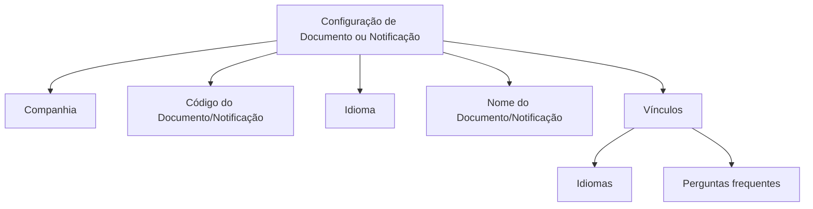

# Definição de Documentos ou Notificações — Home Solutions APIs Documentation Zeus

## 1. Metadados do Documento
- **Arquivo de Origem:** `Não identificado`
- **Tipo de Documento:** `Especificação Técnica`
- **Domínio / Sistema:** `Home Solutions APIs Documentation Zeus`
- **Público-Alvo:** `Não identificado`
- **Data/Versão Identificada:** `Não identificada`

---

## 2. Resumo Executivo & Contexto de Negócio

O documento descreve a definição e a configuração de **Documentos ou Notificações** que podem ser gerados e enviados a terceiras pessoas. O objetivo declarado é identificar e configurar todos os documentos ou notificações possíveis, independentemente de sua classificação.

As classificações explicitamente citadas incluem documentos ou notificações **Contratuais, Comerciais, Informativas, Voz del Cliente e Operativas**. O texto não detalha critérios específicos, fluxos de aprovação, canais de envio, responsáveis ou regras de disparo para cada classificação.

A configuração de cada Documento ou Notificação depende de propriedades de identificação, companhia, idioma e denominação. Essas propriedades permitem associar a definição a uma companhia, atribuir uma chave única ao documento ou notificação, indicar o idioma empregado e registrar a descrição correspondente nesse idioma.

O documento também referencia vínculos relacionados a **Idiomas** e **Perguntas frequentes**, sem fornecer conteúdo adicional para esses vínculos.

---

## 3. Arquitetura, Componentes & Tecnologias Envolvidas

Os elementos identificados no documento são:

- **Home Solutions APIs Documentation Zeus**
- **Documentos ou Notificações**
- **Companhia**
- **Código do Documento/Notificação**
- **Idioma**
- **Nome do Documento/Notificação**
- **Vínculos**
  - Idiomas
  - Perguntas frequentes

O documento não descreve microsserviços, APIs, métodos HTTP, contratos JSON, bases de dados, servidores, ferramentas de deploy ou ambientes técnicos.



> **Nota de Análise:** O documento descreve propriedades de configuração, mas não detalha a persistência dessas propriedades, integrações técnicas, autenticação, métodos de envio ou contratos de interface.

---

## 4. Regras de Negócio, Especificações Funcionais & Processos

### Objetivo da configuração

A configuração deve permitir identificar e configurar todos os Documentos ou possíveis Notificações que possam ser gerados e enviados a terceiras pessoas.

A classificação do Documento ou Notificação pode ser:

- Contratual
- Comercial
- Informativa
- Voz del Cliente
- Operativa
- Outras classificações não especificadas, pois o documento utiliza uma enumeração aberta representada por reticências.

### Propriedades da definição

1. **Companhia**
   - Indica ao sistema o código da companhia sobre a qual está sendo realizada a configuração do Documento ou Notificação.

2. **Código do Documento/Notificação**
   - Identifica a chave que identificará o Documento ou Notificação no sistema.

3. **Idioma**
   - Representa a chave do idioma empregado na definição dos Documentos ou Notificações.
   - Exemplos citados no documento: espanhol, inglês e turco.

4. **Nome do Documento/Notificação**
   - Contém a denominação ou descrição do Documento ou Notificação de acordo com o idioma utilizado em sua definição.

### Processo funcional identificável

1. Definir a companhia à qual a configuração de Documento ou Notificação se aplica.
2. Informar o código que identificará o Documento ou Notificação no sistema.
3. Selecionar ou definir a chave do idioma da definição.
4. Registrar o nome, denominação ou descrição correspondente ao idioma utilizado.
5. Associar a definição aos vínculos disponíveis para Idiomas e Perguntas frequentes, quando aplicável.

> **Nota de Análise:** O documento não especifica obrigatoriedade de campos, regras de unicidade, formato do código, validações de idioma, ciclo de vida, aprovação, geração, envio ou tratamento de falhas de Documentos ou Notificações.

---

## 5. Tabelas de Parâmetros, Ambientes e Estruturas de Dados

| Item / Parâmetro | Descrição / Função | Tipo / Valores / Formato | Ambiente / Observações |
| :--- | :--- | :--- | :--- |
| Companhia | Indica o código da companhia sobre a qual está sendo realizada a configuração do Documento ou Notificação. | Código da companhia; formato não informado. | Não informado. |
| Código do Documento/Notificação | Identifica a chave que identificará o Documento ou Notificação no sistema. | Chave; formato e regra de unicidade não informados. | Não informado. |
| Idioma | Representa a chave do idioma empregado na definição de Documentos ou Notificações. | Exemplos: espanhol, inglês, turco. | Não é informado catálogo, código ou formato de idioma. |
| Nome do Documento/Notificação | Contém a denominação ou descrição do Documento ou Notificação conforme o idioma utilizado na definição. | Texto descritivo; formato não informado. | Associado ao idioma utilizado. |
| Classificação do Documento/Notificação | Categoria funcional dos documentos ou notificações configuráveis. | Contratuais, Comerciais, Informativas, Voz del Cliente, Operativas e outras não detalhadas. | Não são fornecidas regras específicas por classificação. |
| Vínculo: Idiomas | Referência relacionada à definição de Documentos ou Notificações. | Vínculo referenciado sem detalhamento. | Conteúdo não apresentado. |
| Vínculo: Perguntas frequentes | Referência relacionada à definição de Documentos ou Notificações. | Vínculo referenciado sem detalhamento. | Conteúdo não apresentado. |

---

## 6. Bateria de Perguntas & Respostas para RAG (FAQ Sintético)

### P1: Qual é o objetivo da definição de Documentos ou Notificações?
**R:** O objetivo é identificar e configurar todos os Documentos ou possíveis Notificações que podem ser gerados e enviados a terceiras pessoas, independentemente da classificação desses documentos ou notificações.

### P2: Quais classificações de Documentos ou Notificações são mencionadas?
**R:** O documento cita classificações Contratuais, Comerciais, Informativas, Voz del Cliente e Operativas. A enumeração termina com reticências, indicando que podem existir outras classificações não detalhadas.

### P3: Qual é a função da propriedade Companhia?
**R:** A propriedade Companhia informa ao sistema o código da companhia sobre a qual está sendo realizada a configuração do Documento ou Notificação.

### P4: O que identifica o Código do Documento/Notificação?
**R:** O Código do Documento/Notificação identifica a chave que identificará o Documento ou Notificação no sistema. O documento não informa o formato dessa chave nem regras de unicidade.

### P5: Qual é a finalidade da propriedade Idioma?
**R:** A propriedade Idioma corresponde à chave do idioma empregado na definição dos Documentos ou Notificações. O documento apresenta espanhol, inglês e turco como exemplos de idiomas.

### P6: Como o Nome do Documento/Notificação deve ser definido?
**R:** O Nome do Documento/Notificação deve conter a denominação ou descrição do documento ou notificação de acordo com o idioma utilizado em sua definição.

### P7: O documento descreve como os Documentos ou Notificações são enviados?
**R:** Não. O documento declara que Documentos ou Notificações podem ser gerados e enviados a terceiras pessoas, mas não detalha canais, protocolos, responsáveis, gatilhos, integrações ou tratamento de falhas de envio.

### P8: Existem informações sobre APIs, métodos HTTP ou contratos JSON?
**R:** Não. Embora o texto contenha a identificação “Home Solutions APIs Documentation Zeus”, ele não apresenta endpoints, métodos HTTP, payloads JSON, autenticação ou contratos técnicos de API.

### P9: Quais vínculos são citados na definição de Documentos ou Notificações?
**R:** Os vínculos citados são Idiomas e Perguntas frequentes. O documento não fornece conteúdo adicional, comportamento ou regras de navegação para esses vínculos.

### P10: O documento define validações obrigatórias para Companhia, Código, Idioma e Nome?
**R:** Não. O documento explica a finalidade de Companhia, Código do Documento/Notificação, Idioma e Nome do Documento/Notificação, mas não determina obrigatoriedade, validações, valores permitidos ou mensagens de erro.

---

## 7. Glossário de Termos, Siglas & Conceitos-Chave

- **Documento ou Notificação:** Elemento configurável que pode ser gerado e enviado a terceiras pessoas.
- **Companhia:** Propriedade que indica o código da companhia para a qual a configuração está sendo realizada.
- **Código do Documento/Notificação:** Chave que identifica o Documento ou Notificação no sistema.
- **Idioma:** Chave do idioma utilizado na definição de Documentos ou Notificações.
- **Nome do Documento/Notificação:** Denominação ou descrição associada ao Documento ou Notificação conforme o idioma utilizado.
- **Voz del Cliente:** Classificação de Documento ou Notificação citada no texto; não há definição adicional.
- **Home Solutions APIs Documentation Zeus:** Identificação apresentada no conteúdo extraído; o documento não explica seu significado ou escopo técnico.

---

## 8. Notas Críticas, Riscos & Limitações

- O documento não identifica o arquivo de origem, versão, data, autoria ou público-alvo.
- Não são descritos métodos técnicos de geração ou envio de Documentos ou Notificações.
- Não há definição de APIs, endpoints, contratos, tecnologias, componentes de infraestrutura ou ambientes.
- Não são apresentados formatos, tamanhos, exemplos ou critérios de unicidade para o Código do Documento/Notificação.
- Não são informadas regras de validação, obrigatoriedade, permissões, auditoria ou tratamento de erros.
- Os vínculos para Idiomas e Perguntas frequentes são apenas mencionados, sem conteúdo adicional.
- A lista de classificações é exemplificativa e não define um catálogo fechado de categorias.

---

## 9. Conteúdo Bruto Estruturado (Referência Fiel)

```text
--- [PÁGINA 1 DE 2] ---

DEFINICIÓN de los Documentos o
Notificaciones
Objetivo
Identificar y configurar todos aquellos Documentos o posibles Notificaciones que se pueden generar
y enviar a Terceras Personas cualesquiera que sea su clasificación: Contractuales, Comerciales,
Informativas, Voz del Cliente, Operativas,...
Propiedades
Compañía.
Esta propiedad le indica al sistema el código de la compañía sobre la que se está realizando la
configuración del Documento o Notificación.
Código del Documento/Notificación
Este atributo identifica la clave que identificará al Documento o Notificación en el Sistema.
Idioma.
Esta propiedad es la clave del Idioma empleado en la definición de los Documentos o Notificaciones,
como por ejemplo: español, inglés, turco, ...
Nombre del Documento/Notificación
 / 
 CF
Home Solutions APIs Documentation Zeus
EN


--- [PÁGINA 2 DE 2] ---

Esta propiedad contiene la denominación o descripción del documento o notificación de acuerdo con
el idioma utilizado en su definición.
Vínculos
Idiomas
Preguntas frecuentes
```
