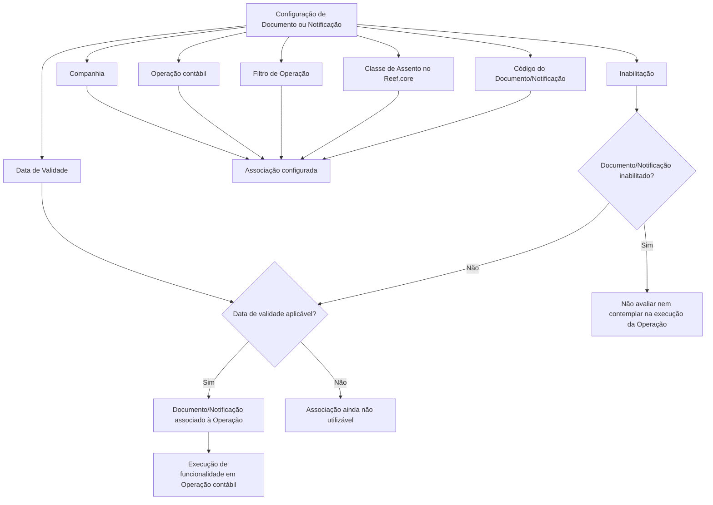

# Atribuição de Documentos ou Notificações às Operações de Contabilidade no Reef.core

## 1. Metadados do Documento
- **Arquivo de Origem:** Não identificado no conteúdo fornecido
- **Tipo de Documento:** Procedimento / Especificação funcional
- **Domínio / Sistema:** Contabilidade, Reef.core e Módulo de Notificações
- **Público-Alvo:** Configuradores funcionais, analistas de negócio, desenvolvedores e equipes de operação
- **Data/Versão Identificada:** Não identificada

---

## 2. Resumo Executivo & Contexto de Negócio

O documento descreve os atributos utilizados para configurar o envio de documentos, notificações e alertas nas operações da matriz operativa de Contabilidade. O objetivo declarado é permitir o conhecimento dos atributos que viabilizam esse envio dentro das operações contábeis.

A configuração associa um Documento ou Notificação a uma companhia e a uma operação contábil específica. A associação pode considerar filtros de operação, uma classe de lançamento contábil do Reef.core e um código que identifica o Documento ou Notificação no sistema.

O documento também define controles de ciclo de vida da configuração. A propriedade de inabilitação impede que o Documento ou Notificação seja avaliado ou considerado na execução de uma operação. A data de validade define a partir de quando o Documento fica associado à Operação, permitindo manter histórico de alterações e rastrear ou explorar posteriormente as definições configuradas.

Há uma ressalva funcional relevante: nem todas as operações contábeis permitem a execução dessa funcionalidade. O conteúdo recomenda a leitura conjunta de “Operaciones Reef.core” e “Módulo de Notificaciones”, pois a interpretação isolada deste documento pode levar a erros.

---

## 3. Arquitetura, Componentes & Tecnologias Envolvidas

Os componentes e conceitos citados no documento são:

| Componente / Conceito | Papel identificado no documento |
| :--- | :--- |
| Matriz Operativa de Contabilidade | Contexto no qual documentos, notificações ou alertas são associados a operações. |
| Reef.core | Sistema referido para a definição de classes de lançamento contábil. |
| Módulo de Notificações | Documento funcional relacionado cuja leitura é recomendada. |
| Documento / Notificação | Entidade configurável e associável a uma operação contábil. |
| Companhia | Propriedade que informa o código da companhia em que a configuração é realizada. |
| Operação | Operação contábil à qual documentos ou notificações são associados. |
| Classe de Assento | Tipo de lançamento contábil no Reef.core, como Emisión, Siniestros, Cobros ou Comisiones. |

O documento não descreve protocolos de integração, métodos HTTP, contratos de dados, persistência, APIs, infraestrutura, ambientes ou tecnologias adicionais.



> **Nota de Análise:** O diagrama representa exclusivamente as relações funcionais inferíveis do texto. O documento não detalha a implementação técnica, a sequência exata de avaliação dos atributos nem o comportamento quando um filtro de operação não é atendido.

---

## 4. Regras de Negócio, Especificações Funcionais & Processos

### 4.1 Objetivo funcional

A configuração de Documento ou Notificação tem como finalidade possibilitar o envio de notificações, alertas ou documentos nas operações da matriz operativa de Contabilidade.

### 4.2 Associação à companhia

A propriedade **Compañía** informa ao sistema o código da companhia sobre a qual a configuração do Documento ou Notificação está sendo realizada.

### 4.3 Associação à operação contábil

O campo **Operación** determina a operação contábil à qual os documentos serão associados. A associação é, portanto, configurada no escopo de uma operação específica.

### 4.4 Filtro de operação

A propriedade **Filtro Operación** determina se a notificação ou documento deve ser considerado conforme o atendimento, ou não, da Operação.

O texto extraído não detalha:
- os valores possíveis para o filtro;
- a lógica precisa de comparação;
- os critérios pelos quais uma Operação é considerada atendida;
- a consequência detalhada para cada resultado do filtro.

### 4.5 Marca de geração de documentos

A geração de Documentos é normalmente realizada com uma marca ativada. Em casos concretos, os documentos a gerar e enviar são aqueles cuja marca está inativa.

O documento não identifica o nome da marca, seus valores técnicos, nem os critérios que caracterizam os “casos concretos”.

### 4.6 Classe de lançamento contábil

O atributo **Clase de Asiento** determina o tipo de lançamento contábil no Reef.core. Os exemplos citados são:

- Emisión;
- Siniestros;
- Cobros;
- Comisiones.

O uso de reticências no documento indica que podem existir outras classes de lançamento, porém nenhuma outra é explicitamente identificada.

### 4.7 Identificação do Documento ou Notificação

O atributo **Código del Documento/Notificación** identifica a chave que identificará o Documento ou Notificação no Sistema.

### 4.8 Inabilitação

A propriedade **Inhabilitación** estabelece que o Documento ou Notificação está desativado. Quando inabilitado:

1. o Documento ou Notificação não será avaliado;
2. o Documento ou Notificação não será considerado durante a execução da Operação.

### 4.9 Data de validade e histórico

A propriedade **Fecha de Validez** estabelece a data a partir da qual o Documento está associado à Operação para utilização.

O uso correto e a configuração dessa data permitem:

1. manter um histórico das alterações realizadas nas definições;
2. rastrear posteriormente essas alterações;
3. explorar posteriormente as informações históricas.

### 4.10 Restrição de aplicabilidade

Nem todas as operações contábeis permitem a execução dessa funcionalidade. O documento não enumera quais operações permitem ou bloqueiam a funcionalidade.

### 4.11 Documentos relacionados

Para reduzir o risco de interpretação isolada e incorreta, o documento recomenda consultar:

1. **Operaciones Reef.core**;
2. **Módulo de Notificaciones**.

---

## 5. Tabelas de Parâmetros, Ambientes e Estruturas de Dados

| Item / Parâmetro | Descrição / Função | Tipo / Valores / Formato | Ambiente / Observações |
| :--- | :--- | :--- | :--- |
| Compañía | Informa o código da companhia sobre a qual a configuração do Documento ou Notificação é realizada. | Código de companhia; formato não detalhado. | Aplicável à configuração do Documento ou Notificação. |
| Operación | Determina a operação contábil à qual os documentos serão associados. | Operação contábil; valores não detalhados. | Nem todas as operações contábeis permitem a funcionalidade. |
| Filtro Operación | Determina se a notificação ou documento deve ser considerado conforme o atendimento, ou não, da Operação. | Regra ou indicador; valores não detalhados. | A lógica detalhada do filtro não é apresentada. |
| Marca de geração de documentos | Controla a seleção normal ou excepcional de documentos a gerar e enviar. | Marca ativa ou inativa; nome técnico não detalhado. | Normalmente a geração ocorre com a marca ativada; em casos concretos, ocorre para itens com a marca inativa. |
| Clase de Asiento | Determina o tipo de lançamento contábil de Reef.core. | Exemplos: Emisión, Siniestros, Cobros, Comisiones. | A lista completa de classes não é apresentada. |
| Código del Documento/Notificación | Identifica a chave do Documento ou Notificação no Sistema. | Código ou chave; formato não detalhado. | Não são descritas regras de unicidade ou nomenclatura. |
| Inhabilitación | Desativa o Documento ou Notificação. | Estado de inabilitação; valores não detalhados. | Quando inabilitado, não é avaliado nem contemplado na execução da Operação. |
| Fecha de Validez | Define a data a partir da qual o Documento fica associado à Operação para uso. | Data; formato não detalhado. | Permite manter histórico, rastrear e explorar mudanças nas definições. |
| Reef.core | Sistema referido para classificação do tipo de lançamento contábil. | Sistema corporativo. | Não há versão, URL, ambiente ou detalhes técnicos fornecidos. |
| Módulo de Notificações | Documento ou módulo relacionado à funcionalidade. | Módulo funcional. | Leitura recomendada juntamente com “Operaciones Reef.core”. |

---

## 6. Bateria de Perguntas & Respostas para RAG (FAQ Sintético)

### P1: Qual é o objetivo da configuração de Documentos ou Notificações nas operações de Contabilidade?
**R:** O objetivo é conhecer e utilizar os atributos que possibilitam o envio de notificações, alertas ou documentos nas operações da matriz operativa de Contabilidade.

### P2: Para que serve a propriedade Compañía na configuração de um Documento ou Notificação?
**R:** A propriedade Compañía informa ao sistema o código da companhia sobre a qual a configuração do Documento ou Notificação está sendo realizada.

### P3: Como um Documento é associado a uma operação contábil?
**R:** O campo Operación determina a operação contábil à qual os documentos serão associados. O documento não detalha os valores possíveis de Operación nem o procedimento técnico de cadastro.

### P4: Qual é a finalidade do Filtro Operación?
**R:** O Filtro Operación determina se a notificação ou documento deve ser considerado conforme o atendimento, ou não, da Operação. O texto não especifica os valores do filtro nem a lógica exata usada para avaliar a Operação.

### P5: O que representa a Clase de Asiento no Reef.core?
**R:** A Clase de Asiento determina o tipo de lançamento contábil de Reef.core. O documento cita como exemplos Emisión, Siniestros, Cobros e Comisiones.

### P6: Como o Documento ou Notificação é identificado no Sistema?
**R:** O atributo Código del Documento/Notificación identifica a chave que identificará o Documento ou Notificação no Sistema. O formato e as regras de composição dessa chave não são detalhados.

### P7: O que ocorre quando um Documento ou Notificação está inabilitado?
**R:** Quando a propriedade Inhabilitación está estabelecida, o Documento ou Notificação fica desativado. Nessa condição, ele não será avaliado nem contemplado durante a execução da Operação.

### P8: Para que serve a Fecha de Validez?
**R:** A Fecha de Validez define a data a partir da qual o Documento está associado à Operação para utilização. A configuração correta dessa data permite manter histórico das mudanças nas definições, rastreá-las e explorá-las posteriormente.

### P9: A funcionalidade está disponível para todas as operações contábeis?
**R:** Não. O documento afirma explicitamente que nem todas as operações contábeis permitem a execução dessa funcionalidade, mas não informa quais operações são elegíveis.

### P10: Como funciona a marca usada na geração de Documentos?
**R:** Normalmente, a geração de Documentos é realizada com a marca ativada. Porém, em casos concretos, os documentos que devem ser gerados e enviados são aqueles cuja marca está inativa. O documento não identifica o nome da marca nem os critérios desses casos concretos.

### P11: Quais materiais devem ser consultados para complementar o entendimento da configuração?
**R:** O documento recomenda a leitura de “Operaciones Reef.core” e “Módulo de Notificaciones”, pois uma interpretação isolada do conteúdo pode conduzir a erro.

---

## 7. Glossário de Termos, Siglas & Conceitos-Chave

- **Clase de Asiento:** Atributo que determina o tipo de lançamento contábil no Reef.core.
- **Cobros:** Exemplo de tipo de lançamento contábil citado no documento.
- **Comisiones:** Exemplo de tipo de lançamento contábil citado no documento.
- **Compañía:** Propriedade que informa o código da companhia sobre a qual se realiza uma configuração.
- **Documento / Notificação:** Entidade configurável para envio em operações da matriz operativa de Contabilidade.
- **Emisión:** Exemplo de tipo de lançamento contábil citado no documento.
- **Fecha de Validez:** Data a partir da qual o Documento fica associado à Operação para utilização.
- **Filtro Operación:** Propriedade que determina se um documento ou notificação deve ser considerado conforme o atendimento da Operação.
- **Inhabilitación:** Propriedade que desativa o Documento ou Notificação.
- **Matriz Operativa de Contabilidade:** Contexto de operações no qual documentos, notificações e alertas são configurados.
- **Operación:** Campo que determina a operação contábil à qual os documentos são associados.
- **Reef.core:** Sistema mencionado como referência para tipos de lançamento contábil.
- **Siniestros:** Exemplo de tipo de lançamento contábil citado no documento.

---

## 8. Notas Críticas, Riscos & Limitações

- O documento não fornece nome de arquivo, data, versão, autoria ou ambiente de referência.
- Não há detalhamento de APIs, URLs, métodos HTTP, formatos de mensagens, estruturas JSON, bases de dados, logs ou procedimentos operacionais.
- O comportamento técnico exato do **Filtro Operación** não é especificado.
- A marca relacionada à geração de Documentos não é nomeada nem possui critérios de ativação e inativação descritos.
- Não há lista de operações contábeis que suportam a funcionalidade, apesar de o documento afirmar que a funcionalidade não se aplica a todas elas.
- Não são apresentadas regras de validação para código de companhia, operação, código de documento/notificação, classe de lançamento ou data de validade.
- A ausência de consulta aos documentos “Operaciones Reef.core” e “Módulo de Notificaciones” pode levar a interpretação incorreta do conteúdo.
- **Nota de Análise:** O documento cita o Reef.core e o Módulo de Notificações, mas não detalha métodos, contratos, integrações ou responsabilidades técnicas desses componentes.

---

## 9. Conteúdo Bruto Estruturado (Referência Fiel)

```text
--- [PÁGINA 1 DE 2] ---

Asignación de los DOCUMENTOS o
NOTIFICACIONES a las Operaciones de la
CONTABILIDAD
Objetivo
Conocer los atributos que posibilitan el envío de notificaciones, alertas o documentos en las
operaciones de la matriz operativa de Contabilidad.
Propiedades
Otras Propiedades
Propiedades
Compañía.
Esta propiedad le indica al sistema el código de la compañía sobre la que se está realizando la
configuración del Documento o Notificación.
Operación
Este campo determina la Operación contable a la que se van a asociar los documentos.
Filtro Operación
Esta propiedad determina si la notificación o documento se ha de considerar si se cumple o no la
Operación.
 / 
 CF
Home Solutions APIs Documentation Zeus
EN


--- [PÁGINA 2 DE 2] ---

La generación de Documentos se realizará normalmente con esta marca activada sin embargo, en
casos concretos, los documentos a generar y enviar serán aquellos que la tengan inactiva.
Clase de Asiento
Este atributo determina el tipo de asiento contable de Reef.core: Emisión, Siniestros, Cobros,
Comisiones, ...
Código del Documento/Notificación
Este atributo identifica la clave que identificará al Documento o Notificación en el Sistema.
Otras Propiedades
Inhabilitación
Esta propiedad establece que el Documento o Notificación está desactivado y por tanto ni va a ser
evaluado ni va a ser contemplado en la ejecución de la Operación.
Fecha de Validez
Esta propiedad establece la fecha a partir de la cual el Documento está asociado a la Operación para
ser utilizado, por lo que un correcto uso y configuración habilita tener un histórico de los cambios
efectuados en las definiciones y poder así trazar y explotar posteriormente esta información.
Vínculos
Relación de Directrices y Documentos funcionales cuya lectura recomendada para evitar que la
interpretación aislada del presente documento pueda conducir a error.
Operaciones Reef.core
Módulo de Notificaciones
Preguntas frecuentes
(1) ¿Existe alguna recomendación que pueda ser tomada en cuenta en el uso y definición de la
Matriz Operativa de Terceros en Reef.core?
No todas las operaciones contables permiten la ejecución de esta funcionalidad.
```
