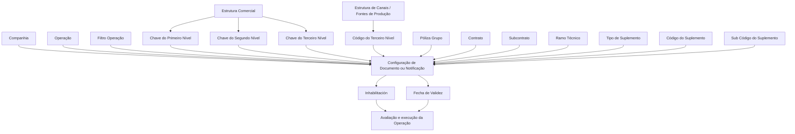

# Atribuição de Documentos ou Notificações às Operações do Processo de Emissão no Reef.core

## 1. Metadados do Documento
- **Arquivo de Origem:** Não identificado no conteúdo fornecido
- **Tipo de Documento:** Especificação Funcional
- **Domínio / Sistema:** Reef.core — Matriz Operativa de Emissão
- **Público-Alvo:** Analistas funcionais, equipes de configuração, operação e desenvolvedores
- **Data/Versão Identificada:** Não identificada

---

## 2. Resumo Executivo & Contexto de Negócio

O documento descreve os atributos utilizados para configurar a atribuição de **Documentos** ou **Notificações** às operações da Matriz Operativa de Emissão do sistema **Reef.core**. O objetivo declarado é conhecer os atributos que viabilizam o envio de notificações, alertas ou documentos nas operações do processo de emissão.

A configuração é contextualizada principalmente por companhia, operação e condição de conclusão da operação. A propriedade **Filtro Operação** define se um documento ou notificação deve ser considerado quando a operação é cumprida ou quando a operação não é completada, conforme a marca de configuração aplicada.

O documento permite especializar a associação de documentos e notificações pela estrutura comercial e pela estrutura de canais ou fontes de produção. Para isso, são apresentados atributos para Primeiro, Segundo e Terceiro Níveis, incluindo valores genéricos que aplicam uma configuração a todos os níveis correspondentes de uma companhia.

A atribuição também pode ser condicionada por elementos de produtos e contratos, incluindo Póliza Grupo, Contrato, Subcontrato, Ramo Técnico e dados de suplemento. Por fim, as propriedades de **Inhabilitación** e **Fecha de Validez** permitem desativar configurações e controlar sua vigência histórica.

---

## 3. Arquitetura, Componentes & Tecnologias Envolvidas

O conteúdo identifica o **Reef.core** como sistema relacionado às operações de emissão. Não são detalhados microsserviços, métodos HTTP, contratos JSON, bancos de dados, protocolos, ambientes técnicos ou integrações externas.

Os principais elementos funcionais identificados são:

- Matriz Operativa de Emissão.
- Operação.
- Documento ou Notificação.
- Companhia.
- Estrutura Comercial.
- Estrutura de Canais ou Fontes de Produção.
- Póliza Grupo.
- Contrato ou Acordo.
- Subcontrato ou Acordo.
- Ramo Técnico.
- Tipo, código e subcódigo de suplemento.
- Estado de inabilitação.
- Data de validade.



> **Nota de Análise:** O documento descreve atributos funcionais de configuração, mas não detalha a implementação técnica do Reef.core, mecanismos de persistência, interfaces de usuário, APIs ou contratos de integração.

---

## 4. Regras de Negócio, Especificações Funcionais & Processos

### 4.1 Associação à companhia e à operação

1. A propriedade **Compañía** informa ao sistema o código da companhia sobre a qual é realizada a configuração do Documento ou Notificação.
2. O campo **Operación** determina a operação à qual os documentos são associados.
3. A propriedade **Filtro Operación** determina se o documento ou notificação deve ser considerado conforme o cumprimento ou não cumprimento da operação.
4. Normalmente, a geração de documentos ocorre com a marca de Filtro Operação ativada.
5. Em casos concretos, os documentos a gerar e enviar são aqueles cuja marca está inativa, isto é, quando a operação não é completada.

### 4.2 Especialização por Estrutura Comercial

1. A **Clave del Primer Nivel** contém o código que identifica o Primeiro Nível da Estrutura Comercial no sistema.
2. O código genérico **99** no Primeiro Nível permite especializar a definição para todos os primeiros níveis da estrutura comercial configurada na companhia.
3. O uso de um código específico de Primeiro Nível restringe a especialização exclusivamente ao nível selecionado.
4. A **Clave del Segundo Nivel** contém o código que identifica o Segundo Nível da Estrutura Comercial no sistema.
5. O código genérico **999** no Segundo Nível permite especializar a definição para todos os segundos níveis da estrutura comercial configurada na companhia.
6. O uso de um código específico de Segundo Nível restringe a especialização exclusivamente ao nível selecionado.
7. A **Clave del Tercer Nivel** contém o código que identifica o Terceiro Nível da Estrutura Comercial no sistema.
8. O código genérico **9999** no Terceiro Nível permite especializar a definição para todas as oficinas da estrutura comercial configurada na companhia.
9. O uso de um código de escritório específico no Terceiro Nível restringe a especialização exclusivamente à oficina selecionada.

### 4.3 Especialização por canais ou fontes de produção

1. O atributo **Código del Tercer Nivel** identifica a chave do Terceiro Nível da estrutura de canais ou fontes de produção no sistema.
2. O código genérico **ZZZZ** permite especializar a definição para todas as fontes de produção da estrutura de canais configurada na companhia.
3. O uso de um código de escritório específico especializa a configuração exclusivamente para a oficina correspondente.

### 4.4 Condicionantes de produtos, contratos e suplementos

1. **Póliza Grupo** contém o conjunto de apólices independentes — individuais, coletivas ou multirriscos — sujeitas a algum tipo de exceção.
2. A exceção de Póliza Grupo é estabelecida mediante o uso de contrato e/ou subcontrato sobre a definição padrão do Ramo Técnico.
3. **Contrato** determina as condições que alteram a definição de um Ramo Técnico.
4. **Subcontrato** determina condições que alteram as condições de um contrato e, consequentemente, alteram indiretamente a definição de um Ramo Técnico.
5. **Ramo Técnico** contém o código de um dos Ramos Técnicos configurados na Estrutura de Produtos da companhia.
6. **Tipo de Suplemento** determina o tipo de suplemento ao qual as notificações são atribuídas.
7. **Código do Suplemento** determina o código específico de suplemento para o qual as notificações são atribuídas.
8. **Sub Código do Suplemento** determina o subcódigo específico de suplemento para o qual as notificações são atribuídas.
9. **Código do Documento/Notificação** identifica a chave que identificará o Documento ou Notificação da Operação.
10. O uso de valores genéricos também está habilitado para Ramo Técnico, Tipo de Suplemento, Código do Suplemento, Sub Código do Suplemento, Póliza Grupo, Contrato e Subcontrato.

### 4.5 Vigência e desativação

1. A propriedade **Inhabilitación** estabelece que o Documento ou Notificação está desativado.
2. Um Documento ou Notificação desativado não é avaliado nem contemplado na execução da Operação.
3. A propriedade **Fecha de Validez** estabelece a data a partir da qual o Documento está associado à Operação para uso.
4. A configuração correta de Fecha de Validez permite manter histórico das alterações realizadas nas definições.
5. O histórico habilitado pela Fecha de Validez pode ser rastreado e explorado posteriormente.

---

## 5. Tabelas de Parâmetros, Ambientes e Estruturas de Dados

| Item / Parâmetro | Descrição / Função | Tipo / Valores / Formato | Ambiente / Observações |
| :--- | :--- | :--- | :--- |
| Compañía | Indica o código da companhia sobre a qual é configurado o Documento ou Notificação. | Código de companhia | Aplicável à configuração. |
| Operación | Determina a operação à qual os documentos serão associados. | Operação | Relacionada à Matriz Operativa de Emissão. |
| Filtro Operación | Define se o documento ou notificação deve ser considerado conforme o cumprimento da operação. | Marca ativada ou inativa | Normalmente ativada; inativa em casos em que a operação não é completada. |
| Clave del Primer Nivel | Identifica o Primeiro Nível da Estrutura Comercial. | Código; genérico `99` | `99` abrange todos os primeiros níveis; código específico restringe ao nível escolhido. |
| Clave del Segundo Nivel | Identifica o Segundo Nível da Estrutura Comercial. | Código; genérico `999` | `999` abrange todos os segundos níveis; código específico restringe ao nível escolhido. |
| Clave del Tercer Nivel | Identifica o Terceiro Nível da Estrutura Comercial. | Código; genérico `9999` | `9999` abrange todas as oficinas; código específico restringe à oficina escolhida. |
| Código del Tercer Nivel | Identifica a chave do Terceiro Nível da estrutura de canais ou fontes de produção. | Código; genérico `ZZZZ` | `ZZZZ` abrange todas as fontes de produção; código específico especializa a configuração. |
| Póliza Grupo | Contém apólices independentes sujeitas a exceção em relação à definição padrão do Ramo Técnico. | Apólices individuais, coletivas ou multirriscos | A exceção ocorre mediante contrato e/ou subcontrato. |
| Contrato | Determina condições que alteram a definição de um Ramo Técnico. | Contrato ou acordo | Pode participar da exceção de Póliza Grupo. |
| Subcontrato | Determina condições que alteram um contrato e indiretamente a definição de Ramo Técnico. | Subcontrato ou acordo | Pode participar da exceção de Póliza Grupo. |
| Ramo Técnico | Contém o código de um Ramo Técnico configurado na Estrutura de Produtos da companhia. | Código de Ramo Técnico | Aceita valores genéricos, sem códigos especificados no documento. |
| Tipo de Suplemento | Determina o tipo de suplemento ao qual notificações são atribuídas. | Tipo de suplemento | Aceita valores genéricos. |
| Código do Suplemento | Determina o suplemento específico ao qual notificações são atribuídas. | Código de suplemento | Aceita valores genéricos. |
| Sub Código do Suplemento | Determina o subcódigo específico de suplemento ao qual notificações são atribuídas. | Subcódigo de suplemento | Aceita valores genéricos. |
| Código do Documento/Notificação | Identifica a chave do Documento ou Notificação da Operação. | Código / chave | O documento não especifica o formato do código. |
| Inhabilitación | Desativa Documento ou Notificação. | Estado de desativação | Quando aplicado, o item não é avaliado nem considerado na execução da Operação. |
| Fecha de Validez | Define a data a partir da qual o Documento está associado à Operação. | Data | Suporta histórico, rastreabilidade e exploração posterior das alterações. |

---

## 6. Bateria de Perguntas & Respostas para RAG (FAQ Sintético)

### P1: Qual é o objetivo da configuração de Documentos ou Notificações na Matriz Operativa de Emissão do Reef.core?
**R:** O objetivo é conhecer e utilizar os atributos que permitem o envio de notificações, alertas ou documentos nas operações da Matriz Operativa de Emissão do Reef.core.

### P2: Qual atributo identifica a companhia sobre a qual um Documento ou Notificação é configurado?
**R:** A propriedade **Compañía** indica ao sistema o código da companhia sobre a qual está sendo realizada a configuração do Documento ou Notificação.

### P3: Como a operação é vinculada a um Documento ou Notificação?
**R:** O campo **Operación** determina a Operação à qual os documentos são associados. O **Código do Documento/Notificação** identifica a chave do Documento ou Notificação associado à Operação.

### P4: Como funciona o Filtro Operação para geração de documentos?
**R:** O **Filtro Operación** determina se o Documento ou Notificação deve ser considerado conforme o cumprimento ou não da Operação. Normalmente a geração ocorre com a marca ativada; em casos concretos, devem ser gerados e enviados os documentos cuja marca está inativa, ou seja, quando a Operação não é completada.

### P5: Qual valor genérico deve ser usado para aplicar uma configuração a todos os Primeiros Níveis da Estrutura Comercial?
**R:** Deve ser utilizado o código genérico **99** no atributo **Clave del Primer Nivel**. Esse valor permite especializar a definição para todos os primeiros níveis da estrutura comercial configurada na companhia.

### P6: Quais são os valores genéricos definidos para os níveis da Estrutura Comercial?
**R:** O documento define `99` para o Primeiro Nível, `999` para o Segundo Nível e `9999` para o Terceiro Nível. Os valores genéricos permitem aplicar a definição a todos os níveis correspondentes configurados na companhia.

### P7: Como configurar uma atribuição para todas as fontes de produção de uma companhia?
**R:** No atributo **Código del Tercer Nivel**, deve ser utilizado o valor genérico **ZZZZ**. Esse código permite especializar a definição para todas as fontes de produção da estrutura de canais configurada na companhia.

### P8: O que é Póliza Grupo no contexto da configuração de documentos e notificações?
**R:** **Póliza Grupo** contém o conjunto de apólices independentes, individuais, coletivas ou multirriscos, sujeitas a algum tipo de exceção sobre a definição padrão do Ramo Técnico. A exceção é tratada por meio de contrato e/ou subcontrato.

### P9: Qual é a diferença entre Contrato e Subcontrato?
**R:** O **Contrato** determina condições que alteram a definição de um Ramo Técnico. O **Subcontrato** altera as condições de um contrato e, por consequência, altera indiretamente a definição de um Ramo Técnico.

### P10: Quais atributos relacionados a suplementos podem condicionar a atribuição de notificações?
**R:** Os atributos são **Tipo de Suplemento**, **Código do Suplemento** e **Sub Código do Suplemento**. Eles determinam, respectivamente, o tipo, o código específico e o subcódigo específico do suplemento ao qual as notificações são atribuídas.

### P11: O que acontece quando a propriedade Inhabilitación é aplicada?
**R:** A propriedade **Inhabilitación** estabelece que o Documento ou Notificação está desativado. Nesse estado, o item não será avaliado nem contemplado durante a execução da Operação.

### P12: Qual é a finalidade da Fecha de Validez?
**R:** A **Fecha de Validez** define a data a partir da qual o Documento fica associado à Operação para utilização. Sua correta configuração permite manter o histórico das mudanças nas definições, rastrear essas alterações e explorá-las posteriormente.

---

## 7. Glossário de Termos, Siglas & Conceitos-Chave

- **Reef.core:** Sistema citado como referência para as operações e a Matriz Operativa de Emissão.
- **Matriz Operativa de Emissão:** Contexto funcional no qual Documentos ou Notificações são atribuídos às operações.
- **Documento/Notificação:** Entidade configurada para envio, avaliação ou consideração em uma Operação.
- **Compañía:** Propriedade que identifica a companhia por código.
- **Operación:** Entidade à qual Documentos ou Notificações podem ser associados.
- **Filtro Operación:** Propriedade que define se o item deve ser considerado de acordo com o cumprimento ou não da Operação.
- **Estrutura Comercial:** Estrutura organizada em Primeiro, Segundo e Terceiro Níveis.
- **Estrutura de Canais / Fontes de Produção:** Estrutura em que o Código do Terceiro Nível identifica fontes de produção.
- **Póliza Grupo:** Conjunto de apólices independentes sujeito a exceções sobre a definição padrão do Ramo Técnico.
- **Ramo Técnico:** Ramo configurado na Estrutura de Produtos da companhia.
- **Suplemento:** Elemento identificado por tipo, código e subcódigo para atribuição de notificações.
- **Inhabilitación:** Propriedade de desativação de Documento ou Notificação.
- **Fecha de Validez:** Data a partir da qual a associação entre Documento e Operação pode ser utilizada.

---

## 8. Notas Críticas, Riscos & Limitações

- O documento não identifica o nome do arquivo original, autor, data, versão ou histórico de revisões.
- O documento não especifica tecnologias de implementação, APIs, métodos HTTP, contratos de dados, bancos de dados ou mecanismos de integração.
- O formato, tamanho, obrigatoriedade e domínio de valores dos códigos de companhia, operação, documentos, contratos, ramos técnicos e suplementos não são detalhados.
- Os valores genéricos explicitamente documentados são `99`, `999`, `9999` e `ZZZZ`; para os demais atributos é informado apenas que o uso de valores genéricos está habilitado, sem indicação dos códigos correspondentes.
- A semântica exata da “marca ativada” ou “marca inativa” do **Filtro Operación** não é formalizada além da relação descrita com a conclusão ou não conclusão da operação.
- O documento cita diretrizes e documentos funcionais relacionados — Operaciones Reef.core, Estructura Productos, Estructura Canales, Póliza grupo, Contrato/Acuerdo e Sub Contrato/Acuerdo —, mas seus conteúdos não foram fornecidos.
- **Nota de Análise:** O conteúdo não informa precedência entre configurações genéricas e específicas quando múltiplas configurações puderem corresponder à mesma operação.

---

## 9. Conteúdo Bruto Estruturado (Referência Fiel)

```text
--- [PÁGINA 1 DE 4] ---

Asignación de los DOCUMENTOS o
NOTIFICACIONES a las Operaciones del
Proceso de EMISIÓN
Objetivo
Conocer los atributos que posibilitan el envío de notificaciones, alertas o documentos en las
operaciones de la matriz operativa de emisión.
Propiedades
Otras Propiedades
Propiedades
Compañía.
Esta propiedad le indica al sistema el código de la compañía sobre la que se está realizando la
configuración del Documento o Notificación.
Operación
Este campo determina la Operación a la que se van a asociar los documentos.
Filtro Operación
Esta propiedad determina si la notificación o documento se ha de considerar si se cumple o no la
Operación.
 / 
 CF
Home Solutions APIs Documentation Zeus
EN


--- [PÁGINA 2 DE 4] ---

La generación de Documentos se realizará normalmente con esta marca activada sin embargo, en
casos concretos, los documentos a generar y enviar serán aquellos que la tengan inactiva, es
decir, cuando la Operación no se completa.
Clave del Primer Nivel
Este atributo contiene el código por el que se identifica el Primer Nivel de la Estructura Comercial en
el Sistema.
Utilizando el valor genérico en este atributo (código 99) el sistema permite especializar la
definición para todos los primeros niveles de la estructura comercial configurada en la compañía o
bien, al utilizar el código de un nivel en concreto de los n existentes especializar la configuración
exclusivamente para este.
Clave del Segundo Nivel
Este atributo contiene el código por el que se identifica el Segundo Nivel de la Estructura Comercial
en el Sistema.
Utilizando el valor genérico en este atributo (código 999) el sistema permite especializar la
definición para todos los segundos niveles de la estructura comercial configurada en la compañía
o bien, al utilizar el código de un nivel en concreto de los n existentes especializar la configuración
exclusivamente para este.
Clave del Tercer Nivel
Este atributo contiene el código por el que se identifica el Tercer Nivel de la Estructura Comercial en
el Sistema.
Utilizando el valor genérico en este atributo (código 9999) el sistema permite especializar la
definición para todas las Oficinas de la estructura comercial configurada en la compañía o bien, al
utilizar el código de una oficina en particular especializar la configuración exclusivamente para
esta.
Código del Tercer Nivel
Consejo:
Consejo:
Consejo:


--- [PÁGINA 3 DE 4] ---

Este atributo identificará la clave del Tercer Nivel de la estructura de canales o Fuentes de
Producción en el Sistema.
Utilizando el valor genérico en este atributo (código ZZZZ) el sistema permite especializar la
definición para todas las fuentes de producción de la estructura de canales configurada en la
compañía o bien, al utilizar el código de una oficina en particular especializar la configuración
exclusivamente para esta.
Póliza Grupo
Este campo contiene el conjunto de pólizas independientes (individuales, colectivas o multi-riesgo),
siempre que estén sujetas a algún tipo de excepción (mediante el empleo de un contrato y/ó sub
contrato) sobre la definición del ramo Técnico estándar.
Contrato
Este atributo determina las condiciones que alteran la definición de un Ramo Técnico.
Subcontrato
Este campo determina las condiciones que alteran las condiciones de un contrato y por consiguiente
alteran indirectamente la definición de un ramo Técnico.
Ramo Técnico
Este atributo contiene el código de uno de los Ramos Técnicos configurados en la Estructura de
Productos de la compañía.
Tipo de Suplemento
Este atributo determina el tipo de suplemento al que se asignan las notificaciones.
Código del Suplemento
Este atributo determina el Código de suplemento específico para el que se asignan las notificaciones.
Sub Código del Suplemento
Este atributo determina el Sub Código de suplemento específico para el que se asignan las notificaciones.
Código del Documento/Notificación
Este atributo identifica la clave que identificará al Documento o Notificación de la Operación.
Consejo:


--- [PÁGINA 4 DE 4] ---

Otras Propiedades
Inhabilitación
Esta propiedad establece que el Documento o Notificación está desactivado y por tanto ni va a ser
evaluado ni va a ser contemplado en la ejecución de la Operación.
Fecha de Validez
Esta propiedad establece la fecha a partir de la cual el Documento está asociado a la Operación para
ser utilizado, por lo que un correcto uso y configuración habilita tener un histórico de los cambios
efectuados en las definiciones y poder así trazar y explotar posteriormente esta información.
Vínculos
Relación de Directrices y Documentos funcionales cuya lectura recomendada para evitar que la
interpretación aislada del presente documento pueda conducir a error.
Operaciones Reef.core
Estructura Productos
Estructura Canales
Póliza grupo
Contrato/Acuerdo
Sub Contrato/Acuerdo
Preguntas frecuentes
(1) ¿Existe alguna recomendación que pueda ser tomada en cuenta en el uso y definición de la
Matriz Operativa de Emisión de Reef.core?
El uso de los valores genéricos también está habilitado en los atributos que definen el ramo técnico,
el tipo de suplemento, el código y el sub código del suplemento, la póliza grupo, el contrato y el sub
contrato.
```
