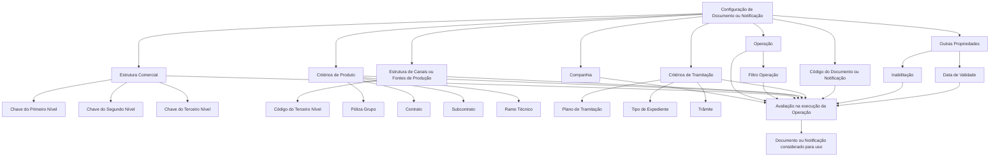

# Atribuição de Documentos ou Notificações às Operações do Processo de Sinistros

## 1. Metadados do Documento
- **Arquivo de Origem:** Não identificado no conteúdo fornecido
- **Tipo de Documento:** Especificação Funcional
- **Domínio / Sistema:** Processo de sinistros; matriz operativa de sinistros; Reef.core
- **Público-Alvo:** Desenvolvedores, analistas funcionais, equipes de configuração e operação
- **Data/Versão Identificada:** Não identificada

---

## 2. Resumo Executivo & Contexto de Negócio

O documento descreve os atributos utilizados para configurar a atribuição de **Documentos** ou **Notificações** às operações da matriz operativa do processo de sinistros. O objetivo declarado é permitir o conhecimento dos critérios que tornam possível o envio de notificações, alertas ou documentos durante a execução de operações.

A configuração associa um Documento ou Notificação a uma operação específica e pode restringir essa associação conforme companhia, estrutura comercial, estrutura de canais ou fontes de produção, póliza grupo, contrato, subcontrato, ramo técnico, plano de tramitação, tipo de expediente e trâmite. Dessa forma, a matriz operativa pode especializar o comportamento de geração e envio conforme características de negócio e de produto.

O documento estabelece valores genéricos para determinados atributos de segmentação. Esses valores permitem aplicar uma definição a todos os elementos configurados em determinado nível, enquanto valores específicos permitem restringir a configuração a um nível, escritório, fonte de produção, plano, tipo de expediente ou trâmite particular.

Também são definidos controles operacionais relevantes: a propriedade de inabilitação impede que um Documento ou Notificação seja avaliado ou considerado na execução da operação; a data de validade determina a partir de quando um Documento está associado a uma operação e viabiliza histórico, rastreabilidade e exploração posterior de alterações de configuração.

O conteúdo aponta dependências documentais para interpretação completa: **Módulo de Notificações**, **Operaciones Reef.core** e **Proveedores**. O próprio documento alerta que a leitura isolada pode levar a interpretações incorretas. Não há detalhamento de métodos HTTP, contratos JSON, persistência, interfaces de usuário ou mecanismos técnicos de entrega das notificações.

---

## 3. Arquitetura, Componentes & Tecnologias Envolvidas

### Componentes e conceitos identificados

| Componente / Conceito | Papel descrito no documento |
| :--- | :--- |
| Processo de sinistros | Contexto de negócio no qual ocorre a atribuição de Documentos ou Notificações. |
| Matriz operativa de sinistros | Estrutura em que operações recebem associações de Documentos ou Notificações. |
| Operação | Elemento ao qual Documentos ou Notificações são associados. |
| Documento | Item que pode ser gerado, associado a uma operação, inabilitado e controlado por data de validade. |
| Notificação | Item associado a operações e condicionado por atributos de configuração. |
| Alerta | Elemento citado como possível envio, sem detalhamento adicional. |
| Reef.core | Sistema mencionado no contexto da matriz operativa, catálogo de destinatários e documentos vinculados. |
| Estrutura Comercial | Estrutura composta por primeiro, segundo e terceiro nível. |
| Estrutura de canais / Fontes de Produção | Estrutura cuja chave de terceiro nível pode restringir a configuração. |
| Estrutura de Produtos | Estrutura da companhia que contém Ramos Técnicos configurados. |
| Plano de Tramitação | Plano no qual é executada a operação configurada. |
| Expediente | Elemento que possui tipo e trâmites dentro de um plano de tramitação. |
| Catálogo de destinatários de Reef.core | Catálogo cujo uso pode variar por operação, pois nem todas as informações estão disponíveis em todas as operações. |

### Fluxo funcional reconstruído



> **Nota de Análise:** O diagrama representa exclusivamente as relações funcionais descritas no conteúdo fornecido. O documento não detalha componentes técnicos, APIs, bancos de dados, filas, protocolos de entrega, formatos de mensagem ou infraestrutura.

---

## 4. Regras de Negócio, Especificações Funcionais & Processos

### 4.1 Associação à operação

1. A propriedade **Compañía** informa ao sistema o código da companhia sobre a qual está sendo realizada a configuração do Documento ou Notificação.
2. O campo **Operación** determina a operação à qual os documentos serão associados.
3. A propriedade **Filtro Operación** determina se a notificação ou o documento deve ser considerado quando a Operação é cumprida ou não é cumprida.
4. A geração de Documentos normalmente é realizada com determinada marca ativada.
5. Em casos concretos, os documentos que devem ser gerados e enviados são aqueles cuja marca está inativa.
6. O texto fornecido não identifica o nome da marca mencionada na regra anterior.

### 4.2 Especialização por estrutura comercial

1. A **Clave del Primer Nivel** contém o código identificador do Primeiro Nível da Estrutura Comercial no sistema.
2. O código genérico **99** permite especializar a definição para todos os primeiros níveis da estrutura comercial configurada na companhia.
3. Um código específico de primeiro nível permite especializar a configuração exclusivamente para aquele nível.
4. A **Clave del Segundo Nivel** contém o código identificador do Segundo Nível da Estrutura Comercial no sistema.
5. O código genérico **999** permite especializar a definição para todos os segundos níveis da estrutura comercial configurada na companhia.
6. Um código específico de segundo nível permite especializar a configuração exclusivamente para aquele nível.
7. A **Clave del Tercer Nivel** contém o código identificador do Terceiro Nível da Estrutura Comercial no sistema.
8. O código genérico **9999** permite especializar a definição para todas as oficinas da estrutura comercial configurada na companhia.
9. Um código de escritório específico permite especializar a configuração exclusivamente para aquele escritório.

### 4.3 Especialização por canais ou fontes de produção

1. O **Código del Tercer Nivel** identifica a chave do Terceiro Nível da estrutura de canais ou Fontes de Produção no sistema.
2. O código genérico **ZZZZ** permite especializar a definição para todas as fontes de produção da estrutura de canais configurada na companhia.
3. Um código de escritório particular permite especializar a configuração exclusivamente para esse escritório.

### 4.4 Critérios de produto e exceções ao ramo técnico

1. **Póliza Grupo** contém o conjunto de apólices independentes — individuais, coletivas ou multirriscos — sujeitas a algum tipo de exceção.
2. A exceção de Póliza Grupo pode ocorrer mediante contrato e/ou subcontrato sobre a definição do ramo técnico padrão.
3. **Contrato** determina condições que alteram a definição de um Ramo Técnico.
4. **Subcontrato** determina condições que alteram as condições de um contrato e, consequentemente, alteram indiretamente a definição de um Ramo Técnico.
5. **Ramo Técnico** contém o código de um dos Ramos Técnicos configurados na Estrutura de Produtos da companhia.
6. O uso de valores genéricos também está habilitado nos atributos que definem ramo técnico, póliza grupo, contrato e subcontrato.
7. O documento não informa quais códigos representam valores genéricos para ramo técnico, póliza grupo, contrato ou subcontrato.

### 4.5 Critérios de tramitação e expediente

1. **Plan de Tramitación** determina o código do plano de tramitação no qual é executada a operação para a qual as notificações estão sendo configuradas.
2. O código genérico **ZZZZ** permite especializar a definição para todos os planos de tramitação configurados na companhia.
3. Um código de plano específico permite especializar a configuração exclusivamente para esse plano.
4. **Tipo de Expediente** contém o tipo de expediente que deve ser contemplado.
5. O código genérico **ZZZ** permite especializar a definição para todos os expedientes definidos na companhia.
6. Um código de tipo de expediente específico permite especializar a configuração exclusivamente para esse tipo.
7. **Trámite** contém o código do trâmite, dentro do plano de tramitação do expediente, no qual se enquadra a operação para a qual as notificações são configuradas.
8. O código genérico **ZZZZ** permite especializar a definição para todos os trâmites configurados na companhia.
9. Um código de trâmite específico permite especializar a configuração exclusivamente para esse trâmite.

### 4.6 Identificação e ciclo de vida do Documento ou Notificação

1. **Código del Documento/Notificación** identifica a chave que identificará o Documento ou a Notificação no sistema.
2. A propriedade **Inhabilitación** estabelece que o Documento ou a Notificação está desativado.
3. Um Documento ou Notificação inabilitado não será avaliado nem considerado durante a execução da Operação.
4. A propriedade **Fecha de Validez** estabelece a data a partir da qual o Documento está associado à Operação para ser utilizado.
5. O uso correto da data de validade permite manter histórico das alterações efetuadas nas definições.
6. O histórico decorrente da data de validade pode ser rastreado e explorado posteriormente.

### 4.7 Catálogo de destinatários

1. Cada operação do sistema pode configurar um uso específico do catálogo de destinatários de Reef.core.
2. Nem todas as informações estão disponíveis em todas as operações.
3. Portanto, a configuração do catálogo de destinatários deve considerar a operação específica em que será utilizada.

---

## 5. Tabelas de Parâmetros, Ambientes e Estruturas de Dados

| Item / Parâmetro | Descrição / Função | Tipo / Valores / Formato | Ambiente / Observações |
| :--- | :--- | :--- | :--- |
| Compañía | Indica o código da companhia sobre a qual é realizada a configuração do Documento ou Notificação. | Código de companhia; formato não detalhado. | Aplicável à configuração de Documento ou Notificação. |
| Operación | Determina a operação à qual os documentos serão associados. | Código ou identificação de operação; formato não detalhado. | Matriz operativa de sinistros. |
| Filtro Operación | Determina se a notificação ou documento será considerado caso a Operação seja cumprida ou não. | Condição de consideração; valores não detalhados. | O documento não explicita o comportamento técnico do filtro. |
| Marca de geração de documentos | Normalmente deve estar ativada para geração de Documentos; em casos concretos, documentos gerados e enviados são os que a possuem inativa. | Marca; nome e valores não identificados. | Regra mencionada sem identificação do atributo. |
| Clave del Primer Nivel | Código identificador do Primeiro Nível da Estrutura Comercial. | Código específico ou genérico `99`. | `99` aplica a definição a todos os primeiros níveis configurados na companhia. |
| Clave del Segundo Nivel | Código identificador do Segundo Nível da Estrutura Comercial. | Código específico ou genérico `999`. | `999` aplica a definição a todos os segundos níveis configurados na companhia. |
| Clave del Tercer Nivel | Código identificador do Terceiro Nível da Estrutura Comercial. | Código específico ou genérico `9999`. | `9999` aplica a definição a todas as oficinas da estrutura comercial da companhia. |
| Código del Tercer Nivel | Identifica a chave do Terceiro Nível da estrutura de canais ou Fontes de Produção. | Código específico ou genérico `ZZZZ`. | `ZZZZ` aplica a definição a todas as fontes de produção da estrutura de canais da companhia. |
| Póliza Grupo | Conjunto de apólices independentes, individuais, coletivas ou multirriscos, sujeitas a exceção sobre o ramo técnico padrão. | Valor não detalhado. | A exceção ocorre mediante contrato e/ou subcontrato. |
| Contrato | Determina condições que alteram a definição de um Ramo Técnico. | Valor não detalhado. | Valores genéricos também são habilitados, sem código genérico informado. |
| Subcontrato | Determina condições que alteram um contrato e, indiretamente, um Ramo Técnico. | Valor não detalhado. | Valores genéricos também são habilitados, sem código genérico informado. |
| Ramo Técnico | Código de um Ramo Técnico configurado na Estrutura de Produtos da companhia. | Código; formato não detalhado. | Valores genéricos também são habilitados, sem código genérico informado. |
| Plan de Tramitación | Determina o código do plano em que é executada a operação configurada. | Código específico ou genérico `ZZZZ`. | `ZZZZ` aplica a definição a todos os planos de tramitação da companhia. |
| Tipo de Expediente | Contém o tipo de expediente que deve ser contemplado. | Código específico ou genérico `ZZZ`. | `ZZZ` aplica a definição a todos os expedientes definidos na companhia. |
| Trámite | Código do trâmite dentro do plano de tramitação do expediente. | Código específico ou genérico `ZZZZ`. | `ZZZZ` aplica a definição a todos os trâmites configurados na companhia. |
| Código del Documento/Notificación | Identifica a chave do Documento ou Notificação no sistema. | Código; formato não detalhado. | Aplicável à associação configurada. |
| Inhabilitación | Desativa o Documento ou Notificação. | Propriedade de estado; valores não detalhados. | O item não é avaliado nem contemplado na execução da Operação. |
| Fecha de Validez | Define a data a partir da qual o Documento está associado à Operação para uso. | Data; formato não detalhado. | Permite histórico, rastreabilidade e exploração posterior de alterações. |
| Catálogo de destinatarios de Reef.core | Catálogo de destinatários utilizado de forma específica por operação. | Não detalhado. | Nem todas as informações estão disponíveis em todas as operações. |

### Ambientes, URLs, servidores e logs

| Item / Parâmetro | Descrição / Função | Tipo / Valores / Formato | Ambiente / Observações |
| :--- | :--- | :--- | :--- |
| Ambientes | Não identificados. | Não aplicável. | O conteúdo não apresenta ambientes. |
| URLs | Não identificadas. | Não aplicável. | O conteúdo não apresenta URLs. |
| Servidores | Não identificados. | Não aplicável. | O conteúdo não apresenta servidores. |
| Rotas ou variáveis de log | Não identificadas. | Não aplicável. | O conteúdo não apresenta configuração de logs. |

---

## 6. Bateria de Perguntas & Respostas para RAG (FAQ Sintético)

### P1: Qual é o objetivo da configuração de Documentos ou Notificações na matriz operativa de sinistros?
**R:** O objetivo é conhecer e configurar os atributos que possibilitam o envio de notificações, alertas ou documentos nas operações da matriz operativa do processo de sinistros. A associação pode ser segmentada por companhia, operação, estrutura comercial, canais, produto, expediente e tramitação.

### P2: O que a propriedade Compañía representa na configuração?
**R:** A propriedade **Compañía** informa ao sistema o código da companhia sobre a qual está sendo realizada a configuração do Documento ou Notificação.

### P3: Como o atributo Filtro Operación influencia a avaliação de um Documento ou Notificação?
**R:** O atributo **Filtro Operación** determina se uma notificação ou documento deve ser considerado quando a Operação é cumprida ou quando a Operação não é cumprida. O documento não detalha os valores possíveis, a sintaxe de configuração ou a lógica técnica usada para avaliar essa condição.

### P4: Qual valor genérico deve ser usado para todos os primeiros níveis da Estrutura Comercial?
**R:** O valor genérico para todos os primeiros níveis da Estrutura Comercial é o código **99**. Um código específico pode ser utilizado quando a configuração deve ser especializada exclusivamente para um primeiro nível determinado.

### P5: Quais são os valores genéricos para os níveis da Estrutura Comercial?
**R:** O Primeiro Nível utiliza o código genérico **99**, o Segundo Nível utiliza o código genérico **999** e o Terceiro Nível utiliza o código genérico **9999**. O valor `9999` permite especializar a definição para todas as oficinas da estrutura comercial configurada na companhia.

### P6: Para que serve o Código del Tercer Nivel relacionado a canais ou Fontes de Produção?
**R:** O **Código del Tercer Nivel** identifica a chave do Terceiro Nível da estrutura de canais ou Fontes de Produção no sistema. O valor genérico **ZZZZ** permite aplicar a definição a todas as fontes de produção configuradas na companhia; um código específico restringe a configuração ao elemento correspondente.

### P7: Como Póliza Grupo, Contrato e Subcontrato afetam o Ramo Técnico?
**R:** A **Póliza Grupo** abrange apólices independentes sujeitas a exceções sobre a definição do ramo técnico padrão, mediante contrato e/ou subcontrato. O **Contrato** altera a definição de um Ramo Técnico, enquanto o **Subcontrato** altera as condições de um contrato e, por consequência, altera indiretamente a definição do Ramo Técnico.

### P8: Qual é o código genérico para todos os planos de tramitação?
**R:** O código genérico é **ZZZZ**. No atributo **Plan de Tramitación**, esse código permite especializar a definição para todos os planos de tramitação configurados na companhia. Um código de plano específico limita a configuração ao plano correspondente.

### P9: Como configurar uma regra para todos os tipos de expediente?
**R:** No atributo **Tipo de Expediente**, deve ser utilizado o código genérico **ZZZ** para especializar a definição para todos os expedientes definidos na companhia. Um código específico permite que a regra seja aplicada somente a um tipo de expediente particular.

### P10: O que acontece quando um Documento ou Notificação está inabilitado?
**R:** A propriedade **Inhabilitación** estabelece que o Documento ou Notificação está desativado. Nesse estado, o item não será avaliado nem contemplado durante a execução da Operação.

### P11: Qual é a função da Fecha de Validez?
**R:** A **Fecha de Validez** estabelece a data a partir da qual o Documento está associado à Operação para uso. A configuração correta dessa data permite manter o histórico de alterações feitas nas definições e viabiliza rastrear e explorar essas informações posteriormente.

### P12: Existe alguma restrição para utilizar o catálogo de destinatários de Reef.core?
**R:** Sim. Cada operação do sistema pode ter um uso específico do catálogo de destinatários de Reef.core, pois nem todas as informações estão disponíveis em todas as operações. A configuração deve, portanto, considerar o contexto da operação em que o catálogo será utilizado.

### P13: Os atributos de Ramo Técnico, Póliza Grupo, Contrato e Subcontrato aceitam valores genéricos?
**R:** Sim. O documento informa que o uso de valores genéricos está habilitado para os atributos que definem Ramo Técnico, Póliza Grupo, Contrato e Subcontrato. Contudo, o conteúdo não especifica quais códigos representam esses valores genéricos.

---

## 7. Glossário de Termos, Siglas & Conceitos-Chave

- **Documento:** Item identificável no sistema que pode ser associado a uma operação, considerado ou não na execução e controlado por inabilitação e data de validade.
- **Notificação:** Item identificável no sistema associado às operações e avaliado conforme critérios de configuração.
- **Alerta:** Elemento citado como possível objeto de envio; não possui detalhamento adicional no conteúdo.
- **Compañía:** Companhia sobre a qual é realizada a configuração do Documento ou Notificação.
- **Operación:** Operação da matriz operativa de sinistros à qual documentos ou notificações são associados.
- **Filtro Operación:** Propriedade que define se um Documento ou Notificação é considerado conforme o cumprimento ou não cumprimento da Operação.
- **Estrutura Comercial:** Estrutura organizacional configurada na companhia, composta por Primeiro, Segundo e Terceiro Nível.
- **Primer Nivel:** Primeiro nível da Estrutura Comercial; possui valor genérico `99`.
- **Segundo Nivel:** Segundo nível da Estrutura Comercial; possui valor genérico `999`.
- **Tercer Nivel:** Terceiro nível da Estrutura Comercial; possui valor genérico `9999` no contexto de estrutura comercial.
- **Oficina:** Escritório associado ao Terceiro Nível da Estrutura Comercial ou mencionado como código particular na estrutura de canais.
- **Fuentes de Producción:** Fontes de produção pertencentes à estrutura de canais configurada na companhia.
- **Póliza Grupo:** Conjunto de apólices independentes — individuais, coletivas ou multirriscos — sujeito a exceções sobre a definição do ramo técnico padrão.
- **Contrato:** Atributo que determina condições que alteram a definição de um Ramo Técnico.
- **Subcontrato:** Atributo que altera condições de um contrato e, indiretamente, a definição de um Ramo Técnico.
- **Ramo Técnico:** Ramo configurado na Estrutura de Produtos da companhia.
- **Plan de Tramitación:** Plano no qual é executada uma operação para a qual notificações são configuradas.
- **Expediente:** Entidade que possui tipo e trâmites no contexto de um plano de tramitação.
- **Tipo de Expediente:** Tipo de expediente que deve ser contemplado pela configuração.
- **Trámite:** Trâmite pertencente ao plano de tramitação do expediente, no qual se enquadra a operação configurada.
- **Reef.core:** Sistema citado no contexto da matriz operativa, catálogo de destinatários e documentos relacionados.
- **Catálogo de destinatarios:** Catálogo de destinatários de Reef.core, cujo uso pode ser diferente para cada operação.
- **Módulo de Notificaciones:** Documento ou módulo relacionado cuja leitura é recomendada; sem detalhamento adicional.
- **Operaciones Reef.core:** Documento ou referência relacionada cuja leitura é recomendada; sem detalhamento adicional.
- **Proveedores:** Documento ou referência relacionada cuja leitura é recomendada; sem detalhamento adicional.

---

## 8. Notas Críticas, Riscos & Limitações

- O documento recomenda a leitura de **Módulo de Notificaciones**, **Operaciones Reef.core** e **Proveedores**, pois a interpretação isolada do conteúdo pode conduzir a erros.
- A marca associada à regra de geração de documentos é mencionada, mas não é identificada. Não é possível determinar qual atributo deve estar ativo ou inativo sem documentação complementar.
- O **Filtro Operación** é descrito conceitualmente, mas não possui valores, formato, precedência ou lógica de avaliação detalhados.
- O documento não especifica códigos genéricos para **Ramo Técnico**, **Póliza Grupo**, **Contrato** e **Subcontrato**, embora confirme que esses atributos aceitam valores genéricos.
- Não há informação sobre APIs, métodos HTTP, contratos de integração, estrutura de dados persistente, filas, serviços de envio, autenticação, URLs, servidores, portas, ambientes ou observabilidade.
- A disponibilidade de dados do catálogo de destinatários depende da operação: nem todas as informações estão disponíveis em todas as operações.
- A configuração de **Inhabilitación** exclui o Documento ou Notificação tanto da avaliação quanto da consideração durante a execução da Operação.
- A **Fecha de Validez** é necessária para manter histórico e rastreabilidade; configurações sem uso adequado desse atributo podem comprometer a capacidade de analisar mudanças históricas.

---

## 9. Conteúdo Bruto Estruturado (Referência Fiel)

```text
--- [PÁGINA 1 DE 5] ---

Asignación de los DOCUMENTOS o
NOTIFICACIONES a las Operaciones del
Proceso de SINIESTROS
Objetivo
Conocer los atributos que posibilitan el envío de notificaciones, alertas o documentos en las
operaciones de la matriz operativa de siniestros.
Propiedades
Otras Propiedades
Propiedades
Compañía.
Esta propiedad le indica al sistema el código de la compañía sobre la que se está realizando la
configuración del Documento o Notificación.
Operación
Este campo determina la Operación a la que se van a asociar los documentos.
Filtro Operación
Esta propiedad determina si la notificación o documento se ha de considerar si se cumple o no la
Operación.
 / 
 CF
Home Solutions APIs Documentation Zeus
EN


--- [PÁGINA 2 DE 5] ---

La generación de Documentos se realizará normalmente con esta marca activada sin embargo, en
casos concretos, los documentos a generar y enviar serán aquellos que la tengan inactiva.
Clave del Primer Nivel
Este atributo contiene el código por el que se identifica el Primer Nivel de la Estructura Comercial en
el Sistema.
Utilizando el valor genérico en este atributo (código 99) el sistema permite especializar la
definición para todos los primeros niveles de la estructura comercial configurada en la compañía o
bien, al utilizar el código de un nivel en concreto de los n existentes especializar la configuración
exclusivamente para este.
Clave del Segundo Nivel
Este atributo contiene el código por el que se identifica el Segundo Nivel de la Estructura Comercial
en el Sistema.
Utilizando el valor genérico en este atributo (código 999) el sistema permite especializar la
definición para todos los segundos niveles de la estructura comercial configurada en la compañía
o bien, al utilizar el código de un nivel en concreto de los n existentes especializar la configuración
exclusivamente para este.
Clave del Tercer Nivel
Este atributo contiene el código por el que se identifica el Tercer Nivel de la Estructura Comercial en
el Sistema.
Utilizando el valor genérico en este atributo (código 9999) el sistema permite especializar la
definición para todas las Oficinas de la estructura comercial configurada en la compañía o bien, al
utilizar el código de una oficina en particular especializar la configuración exclusivamente para
esta.
Código del Tercer Nivel
Consejo:
Consejo:
Consejo:


--- [PÁGINA 3 DE 5] ---

Este atributo identificará la clave del Tercer Nivel de la estructura de canales o Fuentes de
Producción en el Sistema.
Utilizando el valor genérico en este atributo (código ZZZZ) el sistema permite especializar la
definición para todas las fuentes de producción de la estructura de canales configurada en la
compañía o bien, al utilizar el código de una oficina en particular especializar la configuración
exclusivamente para esta.
Póliza Grupo
Este campo contiene el conjunto de pólizas independientes (individuales, colectivas o multi-riesgo),
siempre que estén sujetas a algún tipo de excepción (mediante el empleo de un contrato y/ó sub
contrato) sobre la definición del ramo Técnico estándar.
Contrato
Este atributo determina las condiciones que alteran la definición de un Ramo Técnico.
Subcontrato
Este campo determina las condiciones que alteran las condiciones de un contrato y por consiguiente
alteran indirectamente la definición de un ramo Técnico.
Ramo Técnico
Este atributo contiene el código de uno de los Ramos Técnicos configurados en la Estructura de
Productos de la compañía.
Plan de Tramitación
Este atributo determina el código del plan de tramitación en el que se ejecuta la operación para la
cual se están configurando las notificaciones.
Utilizando el valor genérico en este atributo (código ZZZZ) el sistema permite especializar la
definición para todos los planes de tramitación que se hayan configurado en la compañía o bien,
al utilizar el código de un plan en particular especializar la configuración exclusivamente para este.
Tipo de Expediente
Este atributo contiene el tipo de expediente que se ha de contemplar.
Consejo:
Consejo:


--- [PÁGINA 4 DE 5] ---

Utilizando el valor genérico en este atributo (código ZZZ) el sistema permite especializar la
definición para todos los expedientes definidos en la compañía o bien, al utilizar el código de un
tipo de expediente en particular especializar la configuración exclusivamente para este.
Trámite
Este campo contiene el código del trámite, dentro del plan de tramitación del expediente, en el que se
inscribe la operación para la que se están configurando las notificaciones.
Utilizando el valor genérico en este atributo (código ZZZZ) el sistema permite especializar la
definición para todos los trámites configurados en la compañía o bien, al utilizar el código de un
trámite en concreto especializar la configuración exclusivamente para este.
Código del Documento/Notificación
Este atributo identifica la clave que identificará al Documento o Notificación en el Sistema.
Otras Propiedades
Inhabilitación
Esta propiedad establece que el Documento o Notificación está desactivado y por tanto ni va a ser
evaluado ni va a ser contemplado en la ejecución de la Operación.
Fecha de Validez
Esta propiedad establece la fecha a partir de la cual el Documento está asociado a la Operación para
ser utilizado, por lo que un correcto uso y configuración habilita tener un histórico de los cambios
efectuados en las definiciones y poder así trazar y explotar posteriormente esta información.
Vínculos
Relación de Directrices y Documentos funcionales cuya lectura recomendada para evitar que la
interpretación aislada del presente documento pueda conducir a error.
Módulo de Notificaciones
Operaciones Reef.core
Proveedores
Consejo:
Consejo:


--- [PÁGINA 5 DE 5] ---

Preguntas frecuentes
(1) ¿Existe alguna restricción que deba ser tomada en cuenta en la configuración y posterior uso del
catálogo de destinatarios de Reef.core?
Cada operación del sistema puede tener y por tanto configurar un uso muy específico de este
catálogo puesto que no toda la información está disponible en todas las operaciones.
(2) ¿Existe alguna recomendación que pueda ser tomada en cuenta en el uso y configuración de la
matriz operativa de siniestros de Reef.core?
El uso de los valores genéricos también está habilitado en los atributos que definen el ramo técnico,
la póliza grupo, el contrato y el sub contrato.
```
