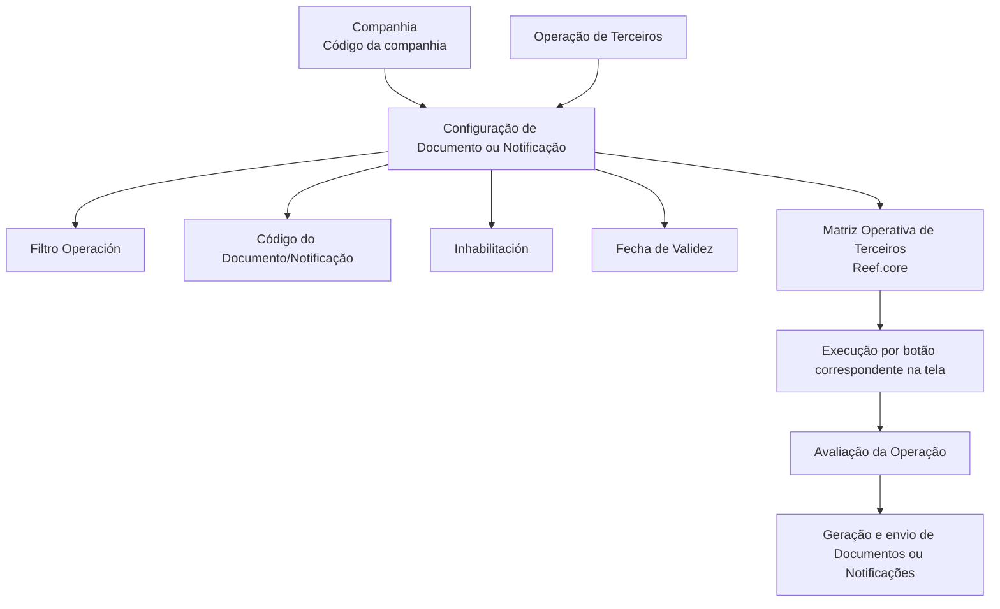

# Atribuição de Documentos ou Notificações às Operações do Processo de Terceiros

## 1. Metadados do Documento
- **Arquivo de Origem:** `Não identificado no conteúdo fornecido`
- **Tipo de Documento:** `Procedimento`
- **Domínio / Sistema:** `Reef.core — Processo de Terceiros / Módulo de Notificações`
- **Público-Alvo:** `Operação, Negócio, Configuração Funcional`
- **Data/Versão Identificada:** `Não identificada`

---

## 2. Resumo Executivo & Contexto de Negócio

O documento descreve a configuração que associa **Documentos** ou **Notificações** às operações da **Matriz Operativa de Terceiros** no sistema Reef.core. O objetivo declarado é conhecer os atributos que permitem enviar notificações, alertas ou documentos nas operações desse processo.

A configuração é contextualizada por companhia e por operação. A propriedade **Compañía** informa o código da companhia para a qual a configuração do documento ou notificação está sendo realizada, enquanto o campo **Operación** determina a operação de Terceiros que receberá a associação.

O documento também define propriedades que controlam a aplicabilidade e o ciclo de vida da associação: **Filtro Operación**, **Código del Documento/Notificación**, **Inhabilitación** e **Fecha de Validez**. Essas propriedades permitem identificar o item, habilitá-lo ou desabilitá-lo e estabelecer a data a partir da qual ele pode ser utilizado pela operação.

A data de validade é apresentada como um recurso para manutenção de histórico das alterações nas definições. Segundo o conteúdo, a configuração correta dessa data permite rastrear e explorar posteriormente as mudanças efetuadas.

A execução da configuração na Matriz Operativa de Terceiros é realizada pela ativação do botão correspondente na tela. O documento recomenda a leitura complementar de **Operaciones Reef.core** e do **Módulo de Notificaciones** para evitar interpretações isoladas ou incorretas.

---

## 3. Arquitetura, Componentes & Tecnologias Envolvidas

Os componentes e conceitos explicitamente citados são:

- **Reef.core:** sistema no qual está localizada a Matriz Operativa de Terceiros.
- **Processo de Terceiros:** domínio funcional das operações às quais documentos e notificações são associados.
- **Matriz Operativa de Terceiros:** estrutura de configuração das operações.
- **Módulo de Notificações:** módulo relacionado à geração e ao envio de notificações, alertas ou documentos.
- **Documentos / Notificações:** itens configuráveis e associados às operações.
- **Companhia:** contexto organizacional identificado por código.
- **Operação:** operação de Terceiros na qual o documento ou a notificação é associado.
- **Home Solutions APIs Documentation Zeus:** expressão exibida no conteúdo bruto, sem detalhamento de papel funcional, técnico ou de integração.



> **Nota de Análise:** O documento não detalha interfaces, métodos HTTP, contratos de integração, tecnologias de implementação, bancos de dados, URLs, ambientes ou mecanismos internos de envio.

---

## 4. Regras de Negócio, Especificações Funcionais & Processos

### Objetivo funcional

A configuração deve permitir o envio de **notificações**, **alertas** ou **documentos** nas operações presentes na Matriz Operativa de Terceiros.

### Regras das propriedades

1. A propriedade **Compañía** deve indicar o código da companhia sobre a qual a configuração do Documento ou da Notificação está sendo realizada.
2. O campo **Operación** deve determinar a operação de Terceiros na qual os documentos serão associados.
3. A propriedade **Filtro Operación** deve determinar se a notificação ou o documento deve ser considerado quando a operação é atendida ou não.
4. A geração de documentos normalmente ocorre com a marca associada ativada.
5. Em casos concretos, os documentos a gerar e enviar são aqueles cuja marca está inativa.
6. O **Código del Documento/Notificación** deve identificar a chave que identificará o Documento ou a Notificação no sistema.
7. Quando a propriedade **Inhabilitación** estiver estabelecida, o Documento ou a Notificação estará desativado.
8. Um Documento ou Notificação desativado não deve ser avaliado nem considerado durante a execução da Operação.
9. A **Fecha de Validez** estabelece a data a partir da qual o Documento está associado à Operação e pode ser utilizado.
10. O uso e a configuração corretos da **Fecha de Validez** permitem manter histórico das mudanças realizadas nas definições.
11. O histórico resultante pode ser rastreado e explorado posteriormente.
12. A execução é realizada mediante a ativação do botão correspondente na tela.

### Processo operacional descrito

1. Identificar a companhia por meio do respectivo código.
2. Selecionar a operação de Terceiros.
3. Associar o Documento ou a Notificação à operação selecionada.
4. Definir se o item será considerado conforme o **Filtro Operación**.
5. Informar o código identificador do Documento ou da Notificação.
6. Definir a condição de inabilitação, quando aplicável.
7. Informar a data de validade a partir da qual a associação poderá ser utilizada.
8. Acionar o botão correspondente na tela para executar a configuração.

> **Nota de Análise:** O documento menciona uma “marca” relacionada à geração de documentos, mas o conteúdo extraído não identifica o nome técnico dessa marca, sua interface, seus valores possíveis ou a condição precisa que caracteriza os “casos concretos”.

---

## 5. Tabelas de Parâmetros, Ambientes e Estruturas de Dados

| Item / Parâmetro | Descrição / Função | Tipo / Valores / Formato | Ambiente / Observações |
| :--- | :--- | :--- | :--- |
| Compañía | Indica o código da companhia sobre a qual é realizada a configuração do Documento ou da Notificação. | Código da companhia; formato não detalhado. | Aplicável à configuração de Documentos e Notificações. |
| Operación | Determina a Operação de Terceiros na qual os documentos serão associados. | Operação de Terceiros; valores não detalhados. | Contexto da Matriz Operativa de Terceiros. |
| Filtro Operación | Determina se a notificação ou o documento deve ser considerado caso a Operação seja cumprida ou não. | Condição de consideração; valores e interface não detalhados. | Regra de avaliação da operação. |
| Marca de geração | Normalmente deve estar ativada para geração de documentos; em casos concretos, devem ser gerados e enviados os documentos com a marca inativa. | Ativa / inativa, conforme texto. | Nome técnico e critérios dos casos concretos não detalhados. |
| Código del Documento/Notificación | Identifica a chave que identificará o Documento ou a Notificação no sistema. | Chave/código; formato não detalhado. | Identificador sistêmico. |
| Inhabilitación | Estabelece que o Documento ou a Notificação está desativado. | Estado de desativação; valores não detalhados. | Item desativado não é avaliado nem contemplado na execução da Operação. |
| Fecha de Validez | Estabelece a data a partir da qual o Documento fica associado à Operação para uso. | Data; formato não detalhado. | Permite histórico, rastreabilidade e exploração posterior de mudanças. |
| Botão correspondente | Aciona a execução na tela. | Controle de interface; nome não detalhado. | Mencionado na pergunta frequente sobre Matriz Operativa de Terceiros. |
| Operaciones Reef.core | Material relacionado recomendado para leitura. | Referência documental. | Recomendada para evitar interpretação isolada. |
| Módulo de Notificaciones | Material relacionado recomendado para leitura. | Referência documental ou módulo funcional. | Recomendada para evitar interpretação isolada. |
| Home Solutions APIs Documentation Zeus | Texto exibido no conteúdo original. | Não detalhado. | Papel no processo não identificado. |

---

## 6. Bateria de Perguntas & Respostas para RAG (FAQ Sintético)

### P1: Qual é o objetivo da configuração de Documentos ou Notificações no Processo de Terceiros?
**R:** O objetivo é conhecer e utilizar os atributos que possibilitam o envio de notificações, alertas ou documentos nas operações da Matriz Operativa de Terceiros.

### P2: Para que serve a propriedade Compañía na configuração de Documento ou Notificação?
**R:** A propriedade **Compañía** informa ao sistema o código da companhia sobre a qual está sendo realizada a configuração do Documento ou da Notificação.

### P3: O que o campo Operación define no contexto de Terceiros?
**R:** O campo **Operación** determina a Operação de Terceiros na qual os documentos serão associados.

### P4: Qual é a finalidade da propriedade Filtro Operación?
**R:** A propriedade **Filtro Operación** determina se a notificação ou o documento deve ser considerado quando a Operação é cumprida ou quando a Operação não é cumprida. O documento não detalha os valores concretos nem o mecanismo de configuração dessa condição.

### P5: Como o Documento ou a Notificação é identificado no sistema?
**R:** O atributo **Código del Documento/Notificación** identifica a chave que identificará o Documento ou a Notificação no sistema.

### P6: O que acontece quando a propriedade Inhabilitación é aplicada?
**R:** A propriedade **Inhabilitación** estabelece que o Documento ou a Notificação está desativado. Nessa condição, o item não será avaliado nem contemplado na execução da Operação.

### P7: Qual é o efeito da Fecha de Validez na associação entre Documento e Operação?
**R:** A **Fecha de Validez** define a data a partir da qual o Documento está associado à Operação e pode ser utilizado. A configuração correta dessa data permite manter histórico das mudanças efetuadas nas definições e possibilita rastrear e explorar essas informações posteriormente.

### P8: Como a geração de documentos se relaciona com a marca ativada ou inativa?
**R:** O documento informa que a geração de Documentos normalmente é realizada com a marca ativada. Contudo, em casos concretos, os documentos a gerar e enviar são aqueles que possuem a marca inativa. O conteúdo não identifica a marca pelo nome nem explica os critérios desses casos concretos.

### P9: Como a execução da Matriz Operativa de Terceiros é realizada?
**R:** A execução é realizada por meio da ativação do botão correspondente na tela.

### P10: Quais materiais devem ser consultados para evitar interpretação isolada do procedimento?
**R:** O documento recomenda a leitura de **Operaciones Reef.core** e do **Módulo de Notificaciones**, pois a interpretação isolada do procedimento pode conduzir a erro.

### P11: O documento especifica APIs, URLs ou contratos de integração para o envio de notificações?
**R:** Não. Embora o conteúdo apresente a expressão “Home Solutions APIs Documentation Zeus”, ele não descreve APIs, URLs, métodos HTTP, contratos JSON, credenciais, ambientes ou fluxos técnicos de integração.

---

## 7. Glossário de Termos, Siglas & Conceitos-Chave

- **Reef.core:** Sistema citado como contexto das Operações e da Matriz Operativa de Terceiros. O documento não expande ou define tecnicamente o nome.
- **Matriz Operativa de Terceiros:** Estrutura funcional na qual documentos, notificações e operações de Terceiros são configurados ou executados.
- **Terceiros:** Domínio de processo referido pelas operações associadas a Documentos ou Notificações. O documento não fornece definição adicional.
- **Compañía:** Propriedade que indica o código da companhia da configuração.
- **Operación:** Campo que determina a operação de Terceiros na qual documentos são associados.
- **Filtro Operación:** Propriedade que determina se um documento ou notificação será considerado de acordo com o atendimento, ou não, da Operação.
- **Código del Documento/Notificación:** Chave identificadora do Documento ou da Notificação no sistema.
- **Inhabilitación:** Propriedade que desativa um Documento ou uma Notificação.
- **Fecha de Validez:** Data a partir da qual o Documento fica associado à Operação e pode ser utilizado.
- **Módulo de Notificaciones:** Módulo citado como referência complementar para interpretação do procedimento.
- **Home Solutions APIs Documentation Zeus:** Expressão presente no conteúdo bruto; não possui definição ou contexto técnico adicional no material fornecido.

---

## 8. Notas Críticas, Riscos & Limitações

- O material não identifica o arquivo de origem, data, versão, autor, responsável ou escopo formal de aprovação.
- O documento não fornece detalhes técnicos sobre APIs, integrações, autenticação, serviços, bancos de dados, URLs, ambientes ou logs.
- A “marca” usada na geração de Documentos é mencionada, mas não possui nome, localização de interface, regra de preenchimento ou critérios documentados para os casos concretos.
- Os valores possíveis do **Filtro Operación**, da **Inhabilitación** e demais propriedades não são apresentados.
- Não há detalhamento sobre validações, mensagens de erro, permissões de usuário ou comportamento em caso de configuração inconsistente.
- A interpretação isolada do procedimento pode levar a erro; o próprio documento recomenda consultar **Operaciones Reef.core** e o **Módulo de Notificaciones**.
- A execução depende da ativação de um botão na tela, mas o nome do botão, a tela específica e os efeitos de sucesso ou falha não são detalhados.

---

## 9. Conteúdo Bruto Estruturado (Referência Fiel)

```text
--- [PÁGINA 1 DE 2] ---

Asignación de los DOCUMENTOS o
NOTIFICACIONES a las Operaciones del
Proceso de TERCEROS
Objetivo
Conocer los atributos que posibilitan el envío de notificaciones, alertas o documentos en las
operaciones de la matriz operativa de terceros.
Propiedades
Otras Propiedades
Propiedades
Compañía.
Esta propiedad le indica al sistema el código de la compañía sobre la que se está realizando la
configuración del Documento o Notificación.
Operación
Este campo determina la Operación de los Terceros en la que se van a asociar los documentos.
Filtro Operación
Esta propiedad determina si la notificación o documento se ha de considerar si se cumple o no la
Operación.
 / 
 CF
Home Solutions APIs Documentation Zeus
EN


--- [PÁGINA 2 DE 2] ---

La generación de Documentos se realizará normalmente con esta marca activada sin embargo, en
casos concretos, los documentos a generar y enviar serán aquellos que la tengan inactiva.
Código del Documento/Notificación
Este atributo identifica la clave que identificará al Documento o Notificación en el Sistema.
Otras Propiedades
Inhabilitación
Esta propiedad establece que el Documento o Notificación está desactivado y por tanto ni va a ser
evaluado ni va a ser contemplado en la ejecución de la Operación.
Fecha de Validez
Esta propiedad establece la fecha a partir de la cual el Documento está asociado a la Operación para
ser utilizado, por lo que un correcto uso y configuración habilita tener un histórico de los cambios
efectuados en las definiciones y poder así trazar y explotar posteriormente esta información.
Vínculos
Relación de Directrices y Documentos funcionales cuya lectura recomendada para evitar que la
interpretación aislada del presente documento pueda conducir a error.
Operaciones Reef.core
Módulo de Notificaciones
Preguntas frecuentes
(1) ¿Existe alguna recomendación que pueda ser tomada en cuenta en el uso y definición de la
Matriz Operativa de Terceros en Reef.core?
La ejecución se realiza mediante la activación del botón correspondiente en la pantalla.
```
