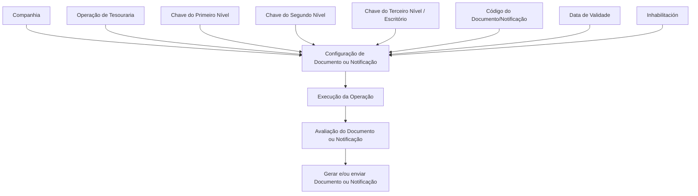

# Atribuição de Documentos ou Notificações às Operações do Processo de Tesouraria

## 1. Metadados do Documento
- **Arquivo de Origem:** Não identificado no conteúdo fornecido
- **Tipo de Documento:** Manual Operacional
- **Domínio / Sistema:** Processo de Tesouraria; matriz operativa de tesouraria; Reef.core; módulo de notificações
- **Público-Alvo:** Desenvolvedores, analistas funcionais, operação e administradores de configuração
- **Data/Versão Identificada:** Não identificada

---

## 2. Resumo Executivo & Contexto de Negócio

O documento descreve os atributos utilizados para configurar o envio de notificações, alertas ou documentos nas operações da matriz operativa de tesouraria. O foco é a associação de um Documento ou Notificação a uma Operação do processo de Tesouraria.

A configuração é contextualizada pela companhia e pode ser especializada conforme os três níveis da estrutura comercial. Os níveis permitem aplicar uma definição genérica para toda a estrutura ou uma definição específica para um nível ou escritório determinado.

O documento apresenta mecanismos de controle de vigência e ativação. A propriedade **Inhabilitación** impede que um Documento ou Notificação seja avaliado ou considerado durante a execução da Operação. A **Fecha de Validez** estabelece a partir de quando o Documento passa a estar associado à Operação, permitindo manter histórico de alterações de configuração.

A geração de documentos normalmente ocorre com uma marca ativada; contudo, existem casos específicos nos quais devem ser gerados e enviados documentos cuja marca esteja inativa. O trecho fornecido não identifica o nome técnico dessa marca, pois o conteúdo aparenta estar incompleto entre as páginas 1 e 2.

O próprio documento ressalta uma limitação funcional relevante: nem todas as Operações de Tesouraria possuem habilitada a funcionalidade de envio de notificações ou documentos.

---

## 3. Arquitetura, Componentes & Tecnologias Envolvidas

### Componentes e conceitos identificados

| Componente / Conceito | Papel identificado no documento |
| :--- | :--- |
| Processo de Tesouraria | Domínio de negócio no qual são configuradas Operações, Documentos e Notificações. |
| Matriz Operativa de Tesorería | Estrutura de configuração na qual documentos ou notificações são associados às Operações de Tesouraria. |
| Operação | Entidade à qual documentos ou notificações são associados. |
| Documento / Notificação | Artefato identificado por código e associado a uma Operação. Pode ser avaliado, utilizado, gerado, enviado ou desativado conforme a configuração. |
| Companhia | Contexto organizacional da configuração do Documento ou Notificação. |
| Estrutura Comercial | Estrutura composta por Primeiro, Segundo e Terceiro Níveis, usada para especializar a configuração. |
| Reef.core | Sistema citado nas referências de vínculo: “Operaciones Reef.core”. |
| Módulo de Notificações | Módulo citado como material relacionado. |
| Home Solutions APIs Documentation Zeus | Texto exibido no conteúdo bruto; o documento não explica sua função nem relação técnica com a configuração. |



**Nota de Análise:** O documento não detalha interfaces, APIs, métodos HTTP, contratos JSON, bancos de dados, tecnologias de implementação, URLs operacionais ou protocolos de integração. O diagrama representa exclusivamente as relações funcionais explicitadas no conteúdo fornecido.

---

## 4. Regras de Negócio, Especificações Funcionais & Processos

### 4.1 Associação à companhia

1. A propriedade **Compañía** informa ao sistema o código da companhia para a qual está sendo realizada a configuração do Documento ou Notificação.
2. A configuração de Documento ou Notificação ocorre no contexto de uma companhia específica.

### 4.2 Associação à Operação de Tesouraria

1. O campo **Operación** determina a Operação à qual os documentos serão associados.
2. A associação é realizada no contexto da matriz operativa de tesouraria.
3. Nem todas as Operações de Tesouraria têm a funcionalidade de envio de notificações ou documentos habilitada.

### 4.3 Filtro de Operação

1. A propriedade **Filtro Operación** determina se a notificação ou o documento deve ser considerado conforme o cumprimento ou não da Operação.
2. O texto não especifica a lógica detalhada, os valores possíveis, a forma de avaliação nem as condições técnicas de “cumprimento” da Operação.

### 4.4 Especialização pela estrutura comercial

1. A **Chave do Primeiro Nível** contém o código identificador do Primeiro Nível da Estrutura Comercial no sistema.
2. O código genérico **99** permite especializar a definição para todos os primeiros níveis da estrutura comercial configurada na companhia.
3. A utilização do código de um nível específico, entre os níveis existentes, especializa a configuração exclusivamente para aquele nível.

4. A **Chave do Segundo Nível** contém o código identificador do Segundo Nível da Estrutura Comercial no sistema.
5. O código genérico **999** permite especializar a definição para todos os segundos níveis da estrutura comercial configurada na companhia.
6. A utilização de um código específico especializa a configuração exclusivamente para aquele segundo nível.

7. A **Chave do Terceiro Nível** contém o código identificador do Terceiro Nível da Estrutura Comercial no sistema.
8. O código genérico **9999** permite especializar a definição para todas as oficinas da estrutura comercial configurada na companhia.
9. A utilização do código de uma oficina específica especializa a configuração exclusivamente para essa oficina.

### 4.5 Identificação do Documento ou Notificação

1. O atributo **Código do Documento/Notificação** identifica a chave que identificará o Documento ou Notificação no sistema.
2. O documento não apresenta o formato, tamanho, catálogo de códigos ou regra de unicidade desse atributo.

### 4.6 Geração e envio

1. A geração de Documentos habitualmente é realizada com uma marca ativada.
2. Em casos concretos, os documentos a gerar e enviar são aqueles cuja marca está inativa.
3. O trecho fornecido não identifica o nome da marca, seus valores, os critérios dos casos concretos nem a regra de precedência aplicável.

### 4.7 Inabilitação

1. A propriedade **Inhabilitación** estabelece que o Documento ou Notificação está desativado.
2. Um Documento ou Notificação inabilitado não será avaliado.
3. Um Documento ou Notificação inabilitado não será considerado durante a execução da Operação.

### 4.8 Data de validade e rastreabilidade

1. A propriedade **Fecha de Validez** define a data a partir da qual o Documento está associado à Operação para utilização.
2. O uso correto da data de validade permite manter histórico das alterações efetuadas nas definições.
3. Esse histórico possibilita rastrear e explorar posteriormente as informações relativas às alterações de configuração.

### 4.9 Documentação relacionada

O documento recomenda a leitura conjunta das seguintes referências, pois a interpretação isolada pode induzir a erro:

- Operações Reef.core.
- Módulo de Notificações.

---

## 5. Tabelas de Parâmetros, Ambientes e Estruturas de Dados

| Item / Parâmetro | Descrição / Função | Tipo / Valores / Formato | Ambiente / Observações |
| :--- | :--- | :--- | :--- |
| Compañía | Indica o código da companhia sobre a qual é configurado o Documento ou Notificação. | Código de companhia; formato não informado. | Contexto da configuração. |
| Operación | Determina a Operação à qual os documentos serão associados. | Operação; formato não informado. | Processo de Tesouraria. |
| Filtro Operación | Determina se a notificação ou documento deve ser considerado conforme o cumprimento ou não da Operação. | Valores e lógica não informados. | O documento não detalha o critério de cumprimento. |
| Marca de geração/envio | Marca normalmente ativada na geração de documentos; em casos específicos, documentos com a marca inativa devem ser gerados e enviados. | Nome e valores não informados. | Trecho incompleto no conteúdo fornecido. |
| Clave del Primer Nivel | Código identificador do Primeiro Nível da Estrutura Comercial. | Código genérico: `99`; ou código de nível específico. | `99` aplica a definição a todos os primeiros níveis configurados na companhia. |
| Clave del Segundo Nivel | Código identificador do Segundo Nível da Estrutura Comercial. | Código genérico: `999`; ou código de nível específico. | `999` aplica a definição a todos os segundos níveis configurados na companhia. |
| Clave del Tercer Nivel | Código identificador do Terceiro Nível da Estrutura Comercial. | Código genérico: `9999`; ou código de oficina específico. | `9999` aplica a definição a todas as oficinas configuradas na companhia. |
| Código del Documento/Notificación | Chave que identifica o Documento ou Notificação no sistema. | Código; formato não informado. | Não há catálogo ou regra de unicidade descrita. |
| Inhabilitación | Desativa o Documento ou Notificação. | Estado de habilitação; valores não informados. | Quando inabilitado, não é avaliado nem contemplado na execução da Operação. |
| Fecha de Validez | Define a data a partir da qual o Documento fica associado à Operação para uso. | Data; formato não informado. | Permite histórico, rastreabilidade e exploração das alterações nas definições. |
| Operaciones Reef.core | Referência documental relacionada. | Não aplicável. | Leitura recomendada. |
| Módulo de Notificações | Referência documental relacionada. | Não aplicável. | Leitura recomendada. |

---

## 6. Bateria de Perguntas & Respostas para RAG (FAQ Sintético)

### P1: Qual é o objetivo da configuração de Documentos ou Notificações no processo de Tesouraria?
**R:** O objetivo é conhecer e utilizar os atributos que possibilitam o envio de notificações, alertas ou documentos nas Operações da matriz operativa de tesouraria.

### P2: Qual atributo define a companhia para a configuração de um Documento ou Notificação?
**R:** A propriedade **Compañía** indica ao sistema o código da companhia sobre a qual está sendo realizada a configuração do Documento ou Notificação.

### P3: Como um Documento é associado a uma Operação de Tesouraria?
**R:** O campo **Operación** determina a Operação à qual os documentos serão associados. A configuração ocorre no contexto da matriz operativa de tesouraria e da companhia selecionada.

### P4: O que faz a propriedade Filtro Operación?
**R:** A propriedade **Filtro Operación** determina se uma notificação ou documento deve ser considerado conforme o cumprimento ou não da Operação. O documento não detalha os valores possíveis nem a lógica técnica utilizada para avaliar o cumprimento da Operação.

### P5: Quando deve ser utilizado o código 99 na Chave do Primeiro Nível?
**R:** O código genérico `99` deve ser utilizado quando a definição precisar ser especializada para todos os primeiros níveis da estrutura comercial configurada na companhia. Um código de nível específico limita a especialização àquele nível.

### P6: Qual é a diferença entre os códigos genéricos 999 e 9999?
**R:** O código `999` é o valor genérico da **Chave do Segundo Nível** e permite aplicar a definição a todos os segundos níveis da estrutura comercial da companhia. O código `9999` é o valor genérico da **Chave do Terceiro Nível** e permite aplicar a definição a todas as oficinas da estrutura comercial configurada na companhia.

### P7: O que ocorre quando um Documento ou Notificação está inabilitado?
**R:** A propriedade **Inhabilitación** estabelece que o Documento ou Notificação está desativado. Nessa condição, o item não será avaliado e não será contemplado durante a execução da Operação.

### P8: Para que serve a Fecha de Validez na associação entre Documento e Operação?
**R:** A **Fecha de Validez** define a data a partir da qual o Documento fica associado à Operação para ser utilizado. A configuração correta dessa data permite manter histórico das mudanças nas definições, rastrear essas mudanças e explorar posteriormente as informações históricas.

### P9: Todas as Operações de Tesouraria podem enviar documentos ou notificações?
**R:** Não. O documento declara expressamente que nem todas as Operações de Tesouraria possuem habilitada a funcionalidade de envio de notificações ou documentos.

### P10: Como o Documento ou Notificação é identificado no sistema?
**R:** O atributo **Código del Documento/Notificación** contém a chave que identificará o Documento ou Notificação no sistema. O conteúdo fornecido não informa o formato do código, o catálogo permitido ou regras de unicidade.

### P11: Como funciona a marca relacionada à geração de documentos?
**R:** A geração de Documentos habitualmente é realizada com a marca ativada. Contudo, em casos concretos, os documentos a gerar e enviar serão aqueles com a marca inativa. O documento não informa o nome dessa marca nem os critérios que definem os casos concretos.

### P12: Quais documentos complementares devem ser consultados para evitar interpretação incorreta?
**R:** O documento recomenda consultar **Operaciones Reef.core** e o **Módulo de Notificações**, pois a interpretação isolada do material pode conduzir a erro.

---

## 7. Glossário de Termos, Siglas & Conceitos-Chave

- **Compañía:** Propriedade que identifica, por código, a companhia na qual a configuração do Documento ou Notificação é realizada.
- **Operación:** Entidade da matriz operativa de tesouraria à qual documentos ou notificações são associados.
- **Filtro Operación:** Propriedade que condiciona a consideração de um Documento ou Notificação ao cumprimento ou não da Operação.
- **Documento / Notificación:** Artefato configurável e identificado por código, associado a uma Operação.
- **Estructura Comercial:** Estrutura organizacional composta por Primeiro, Segundo e Terceiro Níveis.
- **Primer Nivel:** Primeiro nível da Estrutura Comercial; possui o valor genérico `99`.
- **Segundo Nivel:** Segundo nível da Estrutura Comercial; possui o valor genérico `999`.
- **Tercer Nivel:** Terceiro nível da Estrutura Comercial; relacionado às oficinas e possui o valor genérico `9999`.
- **Oficina:** Unidade associada ao Terceiro Nível da Estrutura Comercial.
- **Inhabilitación:** Propriedade que desativa o Documento ou Notificação, impedindo sua avaliação e consideração na execução da Operação.
- **Fecha de Validez:** Data a partir da qual o Documento fica associado à Operação para utilização.
- **Reef.core:** Sistema mencionado como referência documental relacionada às Operações.
- **Módulo de Notificações:** Módulo citado como documentação complementar recomendada.
- **Matriz Operativa de Tesorería:** Matriz na qual são configuradas associações entre Operações de Tesouraria e Documentos ou Notificações.

---

## 8. Notas Críticas, Riscos & Limitações

- **Limitação funcional:** Nem todas as Operações de Tesouraria possuem a funcionalidade de envio de notificações ou documentos habilitada.
- **Risco de interpretação isolada:** O documento recomenda a leitura de “Operaciones Reef.core” e “Módulo de Notificações” para evitar interpretações incorretas.
- **Detalhamento insuficiente do Filtro Operación:** O conteúdo não define valores, condições, algoritmo ou comportamento técnico de avaliação da Operação.
- **Detalhamento insuficiente da marca de geração:** O conteúdo informa a existência de uma marca que normalmente deve estar ativada, mas não apresenta seu nome, valores, critérios ou regra de processamento.
- **Detalhamento insuficiente do código do Documento/Notificação:** Não há formato, tamanho, catálogo, regra de unicidade ou validação informada.
- **Ausência de dados técnicos:** O material não apresenta APIs, contratos de integração, bancos de dados, caminhos de logs, ambientes, servidores, URLs, tecnologias de implementação ou permissões.
- **Nota de Análise:** O conteúdo fornecido contém indicadores visuais de continuação e trechos aparentemente incompletos; nenhuma informação ausente foi inferida ou inventada.

---

## 9. Conteúdo Bruto Estruturado (Referência Fiel)

```text
--- [PÁGINA 1 DE 3] ---

Asignación de los DOCUMENTOS o
NOTIFICACIONES a las Operaciones del
Proceso de TESORERÍA
Objetivo
Conocer los atributos que posibilitan el envío de notificaciones, alertas o documentos en las
operaciones de la matriz operativa de tesorería.
Propiedades
Otras Propiedades
Propiedades
Compañía.
Esta propiedad le indica al sistema el código de la compañía sobre la que se está realizando la
configuración del Documento o Notificación.
Operación
Este campo determina la Operación a la que se van a asociar los documentos.
Filtro Operación
Esta propiedad determina si la notificación o documento se ha de considerar si se cumple o no la
Operación.
 /
 CF
Home Solutions APIs Documentation Zeus
EN


--- [PÁGINA 2 DE 3] ---

La generación de Documentos se realizará habitualmente con esta marca activada sin embargo,
en casos concretos, los documentos a generar y enviar serán aquellos que la tengan inactiva.
Clave del Primer Nivel
Este atributo contiene el código por el que se identifica el Primer Nivel de la Estructura Comercial en
el Sistema.
Utilizando el valor genérico en este atributo (código 99) el sistema permite especializar la
definición para todos los primeros niveles de la estructura comercial configurada en la compañía o
bien, al utilizar el código de un nivel en concreto de los n existentes especializar la configuración
exclusivamente para este.
Clave del Segundo Nivel
Este atributo contiene el código por el que se identifica el Segundo Nivel de la Estructura Comercial
en el Sistema.
Utilizando el valor genérico en este atributo (código 999) el sistema permite especializar la
definición para todos los segundos niveles de la estructura comercial configurada en la compañía
o bien, al utilizar el código de un nivel en concreto de los n existentes especializar la configuración
exclusivamente para este.
Clave del Tercer Nivel
Este atributo contiene el código por el que se identifica el Tercer Nivel de la Estructura Comercial en
el Sistema.
Utilizando el valor genérico en este atributo (código 9999) el sistema permite especializar la
definición para todas las Oficinas de la estructura comercial configurada en la compañía o bien, al
utilizar el código de una oficina en particular especializar la configuración exclusivamente para
esta.
Código del Documento/Notificación
Este atributo identifica la clave que identificará al Documento o Notificación en el Sistema.
Consejo:
Consejo:
Consejo:


--- [PÁGINA 3 DE 3] ---

Otras Propiedades
Inhabilitación
Esta propiedad establece que el Documento o Notificación está desactivado y por tanto ni va a ser
evaluado ni va a ser contemplado en la ejecución de la Operación.
Fecha de Validez
Esta propiedad establece la fecha a partir de la cual el Documento está asociado a la Operación para
ser utilizado, por lo que un correcto uso y configuración habilita tener un histórico de los cambios
efectuados en las definiciones y poder así trazar y explotar posteriormente esta información.
Vínculos
Relación de Directrices y Documentos funcionales cuya lectura recomendada para evitar que la
interpretación aislada del presente documento pueda conducir a error.
Operaciones Reef.core
Módulo de Notificaciones
Preguntas frecuentes
(1) ¿Existe alguna recomendación que pueda ser tomada en cuenta en el uso y definición de la
Matriz Operativa de Tesorería de Reef.core?
No todas las Operaciones de Tesorería tienen habilitada la funcionalidad para el envío de
notificaciones o documentos.
```
