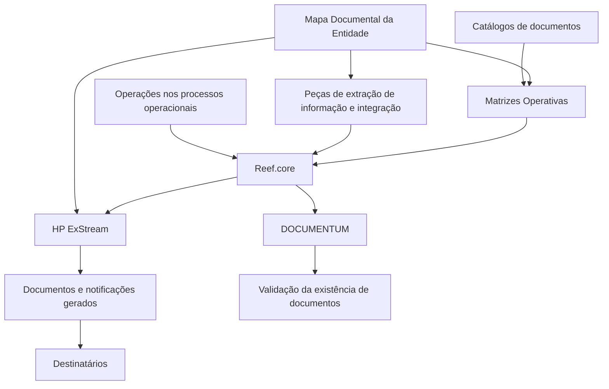

# Integração de Documentos e Notificações no Reef.core — Catálogos e Matrizes Operativas

## 1. Metadados do Documento
- **Arquivo de Origem:** Não identificado no conteúdo fornecido
- **Tipo de Documento:** Especificação Funcional / Arquitetura de Integração
- **Domínio / Sistema:** Reef.core; gestão documental e notificações corporativas
- **Público-Alvo:** Arquitetos, Desenvolvedores, Analistas Funcionais e Operação
- **Data/Versão Identificada:** Dezembro de 2023

---

## 2. Resumo Executivo & Contexto de Negócio

O documento descreve a ampliação das funcionalidades do núcleo do **Reef.core** para permitir integração com ferramentas corporativas responsáveis pela geração, pelo envio, pelo armazenamento e pela gestão de documentos e notificações. A integração suporta operações executadas em processos operacionais como Gestão de Clientes, Gestão de Pólizas e Contratos, Gestão de Sinistros e Prestações.

A necessidade de documentação e notificação é associada a eventos de negócio. Entre os exemplos apresentados estão a emissão de uma apólice de Automóveis, o cadastro de um Intermediário, a autorização de um Controle Técnico, a finalização de um Sinistro por improcedência e o encerramento do caixa principal na Tesouraria. Esses eventos podem gerar SMS, correios eletrônicos, cartas e documentos anexos.

Além da emissão e distribuição, o Reef.core deve avaliar a existência ou inexistência de informações na Plataforma de Gestão Documental. Essa validação pode envolver documentos digitalizados e armazenados, como Carteira de Motorista, Cédula Profissional, Questionário Médico e declaração de danos ou pedido de indenização.

Em dezembro de 2023, as ferramentas corporativas identificadas para o cenário são **HP ExStream**, para geração e envio de documentos, e **DOCUMENTUM**, para armazenamento e gestão documental. O documento estabelece que a integração depende de uma configuração ordenada de catálogos e matrizes operativas.

A configuração é organizada por agrupamentos funcionais. As matrizes operativas disponíveis abrangem os processos de Emissão, Sinistros, Terceiros, Tesouraria e Contabilidade. Para Emissão e Sinistros, as matrizes podem utilizar valores genéricos numéricos e/ou alfanuméricos para facilitar definição e manutenção.

---

## 3. Arquitetura, Componentes & Tecnologias Envolvidas

| Componente / Sistema | Papel identificado no documento | Relação com a integração |
| :--- | :--- | :--- |
| Reef.core | Núcleo funcional ampliado | Integra-se às ferramentas corporativas de documentos e notificações. |
| HP ExStream | Ferramenta corporativa de geração e envio de documentos | Mantém definições de templates de documentos e meios de envio. |
| DOCUMENTUM | Plataforma corporativa de armazenamento e gestão documental | Armazena e gerencia documentos necessários para validações de operações. |
| Mapa Documental da Entidade | Definições documentais prévias | Possui correlação e dependência com as matrizes, templates e integrações do Reef.core. |
| Catálogos | Configuração de documentos, atributos, variáveis e destinatários | Precedem a configuração das matrizes operativas. |
| Matrizes Operativas | Catálogos de decisão por agrupamento funcional | Identificam quais documentos devem ser gerados e para quais destinatários devem ser enviados. |
| Peças de extração de informação e integração | Componentes de integração do Reef.core | Relacionam-se às definições do Mapa Documental e do HP ExStream. |



**Nota de Análise:** O documento identifica a relação entre Reef.core, HP ExStream e DOCUMENTUM, mas não detalha métodos HTTP, contratos JSON, filas, protocolos de integração, endpoints, portas, autenticação ou mecanismos de tratamento de erro.

---

## 4. Regras de Negócio, Especificações Funcionais & Processos

### 4.1 Finalidade da integração documental

A funcionalidade do núcleo do Reef.core foi ampliada para integração com ferramentas corporativas responsáveis por:

1. Geração de documentos.
2. Envio de documentos.
3. Geração de notificações.
4. Envio de notificações.
5. Armazenamento de documentos.
6. Gestão documental.
7. Consulta ou validação da existência de documentos na Plataforma de Gestão Documental.

### 4.2 Processos operacionais citados

O documento associa a integração documental aos seguintes processos operacionais:

- Gestão de Clientes.
- Gestão de Pólizas e Contratos.
- Gestão de Sinistros e Prestações.
- Emissão.
- Sinistros.
- Terceiros.
- Tesouraria.
- Contabilidade.

### 4.3 Exemplos de operações que geram documentos ou notificações

| Evento de negócio | Documento / notificação esperada | Destinatário identificado |
| :--- | :--- | :--- |
| Finalização da emissão de uma apólice de Automóveis | SMS de confirmação; geração e envio por correio eletrônico das CC.PP como documento anexo | Tomador da apólice |
| Cadastro de um Intermediário | Envio ao Regulador do contrato laboral com a entidade MAPFRE | Regulador |
| Autorização de um Controle Técnico em uma cotação | Geração e envio de correio eletrônico informando a autorização | Intermediário |
| Finalização de um Sinistro por improcedência | Envio de carta notificando formalmente a improcedência | Segurado |
| Fechamento do caixa principal na Tesouraria | Envio de correio eletrônico | Diretor de Administração e Finanças da entidade MAPFRE Local |

### 4.4 Exemplos de validações documentais

| Evento de negócio | Validação documental requerida | Documento ou evidência citada |
| :--- | :--- | :--- |
| Finalização da emissão de apólice de Automóveis | Validar a existência de Condutor novel e, se existir, verificar se o documento está escaneado e armazenado | Carteira de Motorista |
| Cadastro de um Intermediário | Verificar que a Cédula Profissional esteja ativa | Cédula Profissional |
| Tentativa de autorização de Controle Técnico em proposta de Saúde | Revisar se o documento está disponível | Questionário médico do Segurado |
| Abertura de Sinistro associado a evento catastrófico | Verificar declaração prévia de danos e solicitação de indenização perante o Consórcio de Compensação de Seguros | Declaração de Danos e solicitação de Indenização |

### 4.5 Ordem de configuração dos catálogos

A relação de catálogos apresentada deve ser configurada antes das matrizes operativas:

1. Definir Documentos de Entrada/Saída.
2. Definir Atributos dos Documentos.
3. Configurar Variáveis de Informação.
4. Configurar Destinatários por Documento.
5. Configurar Matrizes Operativas.

### 4.6 Matrizes operativas por agrupamento funcional

As matrizes operativas detalham e identificam, de acordo com seus atributos:

- Quais documentos devem ser gerados.
- Para quais destinatários os documentos ou notificações devem ser enviados.

As matrizes operativas listadas são:

1. Matriz Operativa de Emissão.
2. Matriz Operativa de Sinistros.
3. Matriz Operativa de Terceiros.
4. Matriz Operativa de Tesouraria.
5. Matriz Operativa de Contabilidade.

### 4.7 Dependências de configuração

Existe correlação e dependência total entre:

1. Definições prévias realizadas no Mapa Documental da Entidade.
2. Definição de templates de documentos e meios de envio no HP ExStream.
3. Peças de extração de informação e integração do Reef.core.
4. Matrizes operativas de Emissão e Sinistros.

### 4.8 Valores genéricos nas matrizes

Para facilitar a definição e a manutenção das matrizes operativas de Emissão e Sinistros, a configuração pode utilizar:

- Valores genéricos numéricos.
- Valores genéricos alfanuméricos.

**Nota de Análise:** O documento não define o formato, a lista de valores permitidos, a semântica nem os critérios de precedência dos valores genéricos numéricos ou alfanuméricos.

---

## 5. Tabelas de Parâmetros, Ambientes e Estruturas de Dados

| Item / Parâmetro | Descrição / Função | Tipo / Valores / Formato | Ambiente / Observações |
| :--- | :--- | :--- | :--- |
| Ferramenta de geração e envio | Geração e distribuição corporativa de documentos e notificações | HP ExStream | Identificada como ferramenta corporativa em dezembro de 2023 |
| Ferramenta de armazenamento e gestão | Armazenamento e gestão documental | DOCUMENTUM | Identificada como ferramenta corporativa em dezembro de 2023 |
| Documento de Entrada/Saída | Documento definido para consumo, geração, envio ou validação em processos | Não detalhado | Deve ser definido nos catálogos |
| Atributos de documentos | Características usadas para identificar ou configurar documentos | Não detalhado | Devem ser definidos nos catálogos |
| Variáveis de informação | Informações configuradas para documentos e integração | Não detalhado | Devem ser configuradas nos catálogos |
| Destinatários por documento | Receptores de documentos e notificações | Não detalhado | Devem ser configurados por documento |
| Matriz Operativa de Emissão | Configuração documental para processos de Emissão | Pode utilizar valores numéricos e/ou alfanuméricos genéricos | Inclui documentos de Entrada/Saída |
| Matriz Operativa de Sinistros | Configuração documental para processos de Sinistros | Pode utilizar valores numéricos e/ou alfanuméricos genéricos | Inclui documentos de Entrada/Saída |
| Matriz Operativa de Terceiros | Configuração documental para processos de Terceiros | Não detalhado | Inclui documentos de Entrada/Saída |
| Matriz Operativa de Tesouraria | Configuração documental para processos de Tesouraria | Não detalhado | Inclui documentos de Entrada/Saída |
| Matriz Operativa de Contabilidade | Configuração documental para processos de Contabilidade | Não detalhado | Inclui documentos de Entrada/Saída |
| CC.PP | Documento anexo enviado após emissão de apólice de Automóveis | Sigla não expandida no documento | Enviado por correio eletrônico ao tomador |
| Carteira de Motorista | Documento a verificar para Condutor novel | Documento escaneado e armazenado | Associado à emissão de apólice de Automóveis |
| Cédula Profissional | Documento que deve estar ativo para Intermediário | Documento de comprovação | Ampara a entidade seguradora perante o Regulador local |
| Questionário médico | Documento cuja disponibilidade deve ser revisada | Documento do Segurado | Associado a proposta de Saúde e Controle Técnico |
| Declaração de Danos | Evidência requerida em Sinistro catastrófico | Declaração prévia | Relacionada ao Consórcio de Compensação de Seguros |
| Solicitação de Indenização | Evidência requerida em Sinistro catastrófico | Solicitação prévia | Relacionada ao Consórcio de Compensação de Seguros |

---

## 6. Bateria de Perguntas & Respostas para RAG (FAQ Sintético)

### P1: Qual é o objetivo da ampliação funcional do Reef.core?
**R:** O objetivo é permitir que o núcleo do Reef.core se integre às ferramentas corporativas encarregadas da geração, envio, armazenamento e gestão de documentos e notificações associados às operações dos processos operacionais.

### P2: Quais ferramentas corporativas são usadas para geração, envio, armazenamento e gestão de documentos?
**R:** Em dezembro de 2023, o documento identifica o HP ExStream como ferramenta corporativa de geração e envio de documentos e o DOCUMENTUM como ferramenta corporativa de armazenamento e gestão documental.

### P3: Quais matrizes operativas devem ser configuradas para a integração documental?
**R:** O documento lista cinco matrizes operativas: Matriz Operativa de Emissão, Matriz Operativa de Sinistros, Matriz Operativa de Terceiros, Matriz Operativa de Tesouraria e Matriz Operativa de Contabilidade.

### P4: Qual é a ordem dos catálogos para configurar a integração de documentos e notificações?
**R:** A ordem apresentada é: definir Documentos de Entrada/Saída; definir Atributos dos Documentos; configurar Variáveis de Informação; configurar Destinatários por Documento; e configurar Matrizes Operativas.

### P5: O que ocorre após a finalização da emissão de uma apólice de Automóveis?
**R:** O documento apresenta como exemplo o envio de um SMS de confirmação e a geração e envio, por correio eletrônico, das CC.PP como documento anexo ao tomador da apólice.

### P6: Como o sistema deve tratar a documentação de um Condutor novel em uma apólice de Automóveis?
**R:** Ao finalizar a emissão de uma apólice de Automóveis, o sistema deve validar a existência de algum Condutor novel. Caso exista, deve verificar se a Carteira de Motorista desse condutor está escaneada e armazenada na Plataforma de Gestão Documental.

### P7: Qual validação documental é requerida ao cadastrar um Intermediário?
**R:** Deve ser verificado se o Intermediário possui Cédula Profissional ativa. O documento informa que essa cédula ampara a entidade seguradora perante o Regulador local para que o Intermediário possa contratar seguros de VIDA Riesgo.

### P8: Como é tratado um Controle Técnico em uma proposta de Saúde?
**R:** Ao tentar autorizar um Controle Técnico em uma proposta de Saúde, deve-se revisar se o Questionário médico do Segurado está disponível. Em outro exemplo, quando um Controle Técnico em uma cotação é autorizado, deve-se informar o Intermediário por meio de geração e envio de correio eletrônico.

### P9: Quais dependências existem entre as matrizes operativas e outros elementos documentais?
**R:** O documento afirma que há total correlação e dependência entre as definições previamente realizadas no Mapa Documental da Entidade, as definições de templates de documentos e meios de envio no HP ExStream e as peças de extração de informação e integração do Reef.core.

### P10: Quais matrizes podem usar valores genéricos numéricos e alfanuméricos?
**R:** As matrizes operativas de Emissão e de Sinistros podem utilizar valores genéricos numéricos e/ou alfanuméricos para facilitar sua definição e manutenção.

### P11: O que deve ser verificado ao abrir um Sinistro associado a um evento catastrófico?
**R:** Deve ser verificado se o Segurado realizou previamente a declaração de Danos e a solicitação de Indenização perante o Consórcio de Compensação de Seguros.

### P12: O documento define APIs, URLs, protocolos ou contratos de integração entre Reef.core, HP ExStream e DOCUMENTUM?
**R:** Não. O documento identifica a integração e suas dependências funcionais, mas não detalha APIs, URLs, métodos HTTP, contratos de mensagens, protocolos, portas, autenticação ou formatos de payload.

---

## 7. Glossário de Termos, Siglas & Conceitos-Chave

- **CC.PP:** Sigla citada como documento anexo enviado por correio eletrônico ao tomador após a emissão de apólice de Automóveis. O significado expandido não é informado.
- **Condutor novel:** Condutor cuja existência na apólice de Automóveis deve levar à validação da Carteira de Motorista escaneada e armazenada.
- **Controle Técnico:** Evento citado em cotações e propostas de Saúde; sua autorização pode exigir revisão do Questionário médico do Segurado.
- **DOCUMENTUM:** Ferramenta corporativa de armazenamento e gestão documental identificada no documento.
- **HP ExStream:** Ferramenta corporativa de geração e envio de documentos identificada no documento.
- **Intermediário:** Entidade cadastrada no sistema cuja Cédula Profissional deve ser verificada e que pode receber notificações sobre Controle Técnico.
- **Mapa Documental da Entidade:** Conjunto de definições documentais previamente realizadas e dependentes das configurações de HP ExStream, Reef.core e matrizes operativas.
- **Matriz Operativa:** Catálogo que, conforme atributos e agrupamento funcional, identifica documentos a gerar e destinatários de envio.
- **Plataforma de Gestão Documental:** Plataforma em que é avaliada a existência ou inexistência de documentos e informações.
- **Reef.core:** Núcleo funcional integrado a ferramentas corporativas para processos de documentação e notificação.
- **Sinistro:** Processo operacional que pode demandar envio de cartas, validação documental e configuração por matriz operativa.
- **VIDA Riesgo:** Modalidade de seguros citada no contexto da Cédula Profissional ativa de um Intermediário.

---

## 8. Notas Críticas, Riscos & Limitações

- O documento não informa o nome do arquivo de origem, autor, versão formal, data de emissão completa ou responsáveis pela manutenção.
- Não são especificados contratos técnicos de integração entre Reef.core, HP ExStream e DOCUMENTUM.
- Não há detalhamento de APIs, URLs, métodos HTTP, esquemas de dados, autenticação, autorização, criptografia, filas, reprocessamento ou observabilidade.
- Não há definição dos atributos documentais, variáveis de informação, formatos de templates ou critérios de seleção de destinatários.
- O significado da sigla **CC.PP** não é expandido.
- O documento indica total dependência entre Mapa Documental, templates e meios de envio no HP ExStream e peças de integração do Reef.core; alterações não coordenadas nesses elementos podem comprometer a configuração das matrizes operativas.
- Os valores genéricos numéricos e alfanuméricos permitidos nas matrizes de Emissão e Sinistros não são especificados.
- Não são apresentadas regras de exceção quando um documento obrigatório não está disponível na Plataforma de Gestão Documental.

---

## 9. Conteúdo Bruto Estruturado (Referência Fiel)

```text
--- [PÁGINA 1 DE 3] ---

DEFINICIÓN del Módulo de Notificaciones /
Documentos de Entrada y Salida
Contexto
La Funcionalidad del Núcleo de Reef.core ha sido ampliada para que el Sistema pueda integrarse
con las herramientas Corporativas encargadas de la generación, el envío y el almacenamiento de
documentos y/o notificaciones de acuerdo con la relación de Operaciones existentes en los distintos
procesos que soporta el Operacional: Gestión de Clientes, Gestión de Pólizas y Contratos, Gestión
de Siniestros y Prestaciones, …
Como posibles ejemplos de operaciones que determinan la generación y envío de documentos o
mensajes se podrían considerar las siguientes:
Al finalizar la emisión de una póliza de Automóviles el envío de un SMS de confirmación así
como la generación y envío por correo electrónico de las CC.PP como documento anexo al
tomador de la póliza.
Al dar de alta un Intermediario en el sistema el envío al Regulador del Contrato laboral con la
entidad MAPFRE.
Al autorizar un Control Técnico en una cotización, informar al Intermediario de este hecho
mediante la generación y envío de un correo electrónico
Al terminar un Siniestro por improcedencia el envío de una carta al Asegurado notificando
formalmente este hecho.
Al cerrar en la Tesorería el cajero principal, el envío de un correo electrónico al Director de
Administración y Finanzas de la entidad MAPFRE Local.
 /
 CF
Home Solutions APIs Documentation Zeus
EN

--- [PÁGINA 2 DE 3] ---

Como posibles ejemplos de operaciones que necesitan evaluar la existencia o inexistencia de
información en la Plataforma de Gestión Documental se podrían considerar las siguientes:
Al finalizar la emisión de una póliza de Automóviles validar la existencia de algún Conductor
novel en ella y en caso de ser afirmativo, verificar que contemos con su Carnet de Conducir
escaneado y almacenado.
Al dar de alta un Intermediario en el sistema verificar que se tenga su Cédula Profesional
activa, cédula que ampara a la entidad aseguradora ante el Regulador local para que el
Intermediario pueda contratar de seguros de VIDA Riesgo.
Al intentar autorizar un Control Técnico en una propuesta de Salud, revisar si se dispone o no
del Cuestionario médico del Asegurado.
Al aperturar un Siniestro asociado a un evento catastrófico, verificar que el Asegurado haya
realizado previamente la declaración de Daños y solicitud de Indemnización ante del Consorcio
de Compensación de Seguros.
A Diciembre 2023 las Herramientas Corporativas para la "Generación y Envío de Documentos" y
"Almacenamiento y Gestión Documental" son HP ExStream y DOCUMENTUM respectivamente.
Objetivo
Conocer la relación de catálogos y el orden de su configuración para conseguir la integración con las
herramientas Corporativas de Generación y Distribución de documentos y notificaciones.
Dependiendo de la Agrupación Funcional a la que estén asociadas las Operaciones, contaremos
con diferentes catálogos que detallan e identifican específicamente y de acuerdo a sus atributos, qué
documentos se han de generar y a qué destinatarios se han de enviar. Estos catálogos son:
Matriz Operativa de Emisión.
Matriz Operativa de Siniestros.
Matriz Operativa de Terceros.
Matriz Operativa de Tesorería.
Matriz Operativa de Contabilidad.
Ejemplo:

--- [PÁGINA 3 DE 3] ---

Para facilitar la definición y el posterior mantenimiento de las matrices operativas de Emisión y
Siniestros se podrán utilizar en su configuración, valores genéricos numéricos y/o alfanuméricos.
Además, existe una total correlación y dependencia entre las definiciones previamente realizadas
en el Mapa Documental de la Entidad, la definición de las plantillas de los documentos y medios
de envío realizada en HP Exstream y las piezas de extracción de información e integración de
Reef.core.
Catálogos
Definir Documentos Entrada/Salida
Definir Atributos de los Documentos
Configurar Variables de Información
Configurar Destinatarios por Documento
Matrices Operativas
Definir Matriz Operativa de documentos de Entrada/Salida en Procesos de
Emisión
Definir Matriz Operativa de documentos de Entrada/Salida en Procesos de
Siniestros
Definir Matriz Operativa de documentos de Entrada/Salida en Procesos de
Terceros
Definir Matriz Operativa de documentos de Entrada/Salida en Procesos de
Tesorería
Definir Matriz Operativa de documentos de Entrada/Salida en Procesos de
Contabilidad
```
