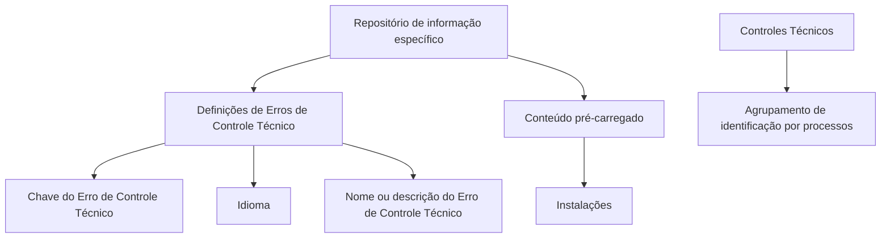

# Catálogo de Errores de Control Técnico — Definición y Propiedades

## 1. Metadados do Documento
- **Arquivo de Origem:** Não identificado no conteúdo fornecido
- **Tipo de Documento:** Especificação Técnica
- **Domínio / Sistema:** Controles Técnicos / Catálogo de Erros de Controle Técnico
- **Público-Alvo:** Desenvolvedores, Arquitetos, Operação e Analistas Funcionais
- **Data/Versão Identificada:** Não identificada

---

## 2. Resumo Executivo & Contexto de Negócio

O documento define a codificação de **Erros de Controle Técnico** em um repositório de informação específico. O conteúdo desse repositório é entregue inicialmente às instalações já com informações pré-carregadas.

Cada definição de Erro de Controle Técnico possui uma chave identificadora, um idioma e um nome ou descrição. O idioma é utilizado para definir as descrições dos erros em diferentes línguas, com exemplos explícitos de espanhol, inglês e turco.

O documento apresenta exemplos de erros relacionados a expedientes, beneficiários, coberturas e soma segurada permitida. Esses exemplos evidenciam que o catálogo suporta mensagens de validação técnica associadas a regras funcionais ou operacionais.

Também há uma recomendação de leitura de documentos funcionais e diretrizes relacionados. A finalidade dessa recomendação é evitar interpretações incorretas decorrentes da análise isolada deste documento.

Por fim, o documento indica como boa prática agrupar a identificação dos Controles Técnicos no catálogo de acordo com os processos nos quais esses controles serão executados. Não são detalhados os critérios concretos de agrupamento, a estrutura física do repositório, interfaces de consulta ou contratos de integração.

---

## 3. Arquitetura, Componentes & Tecnologias Envolvidas

O documento menciona um **repositório de informação específico** destinado à codificação dos Erros de Controle Técnico. Esse repositório é entregue inicialmente às instalações com conteúdo pré-carregado.

Não há detalhamento sobre tecnologia de banco de dados, serviços, APIs, protocolos, ambientes, URLs operacionais, métodos HTTP, contratos JSON, autenticação ou mecanismos de atualização do repositório.

Os componentes conceituais identificados são:

| Componente | Função descrita no documento | Detalhamento disponível |
| :--- | :--- | :--- |
| Repositório de informação específico | Armazenar a codificação dos Erros de Controle Técnico | Não são informados tecnologia, localização ou mecanismo de acesso |
| Erro de Controle Técnico | Entidade definida no catálogo | Possui chave, idioma e nome/descrição |
| Instalações | Destinatárias iniciais do conteúdo pré-carregado | Não são identificados ambientes ou tipos de instalação |
| Controles Técnicos | Controles cuja identificação pode ser agrupada por processo de execução | Não são detalhados os processos nem as regras de execução |
| Documentos funcionais e diretrizes relacionados | Material recomendado para interpretação correta do catálogo | Apenas um documento relacionado é nomeado: “Definición Controles Técnicos” |



> **Nota de Análise:** O diagrama representa somente as relações conceituais explicitamente sustentadas pelo texto. O documento não descreve arquitetura de software, topologia de ambientes, integrações ou fluxo técnico de execução.

---

## 4. Regras de Negócio, Especificações Funcionais & Processos

### 4.1 Definição do catálogo

1. Os Erros de Controle Técnico devem ser codificados em um repositório de informação específico.
2. O repositório é entregue inicialmente às instalações com conteúdo pré-carregado.
3. Cada Erro de Controle Técnico definido possui propriedades gerais.
4. As propriedades explicitamente descritas são:
   - Chave do Erro de Controle Técnico;
   - Idioma;
   - Nome ou descrição do Erro de Controle Técnico.

### 4.2 Chave do Erro de Controle Técnico

A propriedade **Clave de Error de Control Técnico** determina a chave do Erro de Controle Técnico definido.

O documento não especifica:
- formato da chave;
- tipo de dado;
- unicidade;
- intervalo numérico;
- convenção de nomenclatura;
- responsável pela criação ou manutenção das chaves.

### 4.3 Idioma da descrição

A propriedade **Idioma** corresponde à chave do idioma empregado na definição das descrições dos erros de controle técnico.

Os idiomas citados explicitamente como exemplos são:
- espanhol;
- inglês;
- turco.

O documento não informa códigos padronizados de idioma, tais como ISO, nem define como ocorre a seleção da mensagem conforme idioma ou localidade.

### 4.4 Nome ou descrição do Erro de Controle Técnico

A propriedade **Nombre del Error de Control Técnico** indica a descrição do Erro de Controle Técnico.

Os exemplos fornecidos são:

- **Erro 344:** “El Expediente ya tiene una liquidación para este beneficiario.”
- **Erro 455:** “La Cobertura supera la Suma Asegurada permitida”

### 4.5 Boa prática de organização dos Controles Técnicos

O documento estabelece que pode ser considerada uma boa prática agrupar a identificação dos Controles Técnicos no catálogo conforme os processos sobre os quais esses controles serão executados.

Não são fornecidos:
- nomes dos processos;
- grupos de controles;
- critério obrigatório de classificação;
- algoritmo de numeração;
- regras de dependência entre controles;
- fluxo de tratamento após a ocorrência de um erro.

### 4.6 Documentação recomendada

O documento recomenda a leitura de diretrizes e documentos funcionais relacionados para evitar que a interpretação isolada do conteúdo conduza a erro.

O documento relacionado explicitamente citado é:

- **Definición Controles Técnicos**

Também é mencionada uma seção ou referência intitulada:

- **Preguntas frecuentes**

---

## 5. Tabelas de Parâmetros, Ambientes e Estruturas de Dados

### 5.1 Propriedades do Erro de Controle Técnico

| Item / Parâmetro | Descrição / Função | Tipo / Valores / Formato | Ambiente / Observações |
| :--- | :--- | :--- | :--- |
| Chave do Erro de Controle Técnico | Determina a chave do Erro de Controle Técnico definido | Não especificado | Não são definidos formato, tipo ou regra de unicidade |
| Idioma | Determina a chave do idioma utilizada nas descrições dos erros | Exemplos: espanhol, inglês, turco | Não são informados códigos de idioma ou padrão de internacionalização |
| Nome do Erro de Controle Técnico | Indica a descrição do Erro de Controle Técnico | Texto descritivo | É a mensagem ou descrição associada ao erro |

### 5.2 Exemplos de Erros de Controle Técnico

| Item / Parâmetro | Descrição / Função | Tipo / Valores / Formato | Ambiente / Observações |
| :--- | :--- | :--- | :--- |
| Erro 344 | Indica que o expediente já possui uma liquidação para o beneficiário | “El Expediente ya tiene una liquidación para este beneficiario.” | O documento não detalha o processo de liquidação ou a condição técnica de detecção |
| Erro 455 | Indica que a cobertura supera a Soma Assegurada permitida | “La Cobertura supera la Suma Asegurada permitida” | O documento não informa fórmula, limite ou origem da Soma Assegurada |

### 5.3 Referências e vínculos citados

| Item / Parâmetro | Descrição / Função | Tipo / Valores / Formato | Ambiente / Observações |
| :--- | :--- | :--- | :--- |
| Definición Controles Técnicos | Documento funcional recomendado para leitura relacionada | Documento funcional | Citado como referência para evitar interpretação isolada |
| Preguntas frecuentes | Referência a perguntas frequentes | Seção ou documento não detalhado | O conteúdo fornecido inclui uma pergunta sobre circunstâncias do catálogo |
| CF Home Solutions APIs Documentation Zeus EN | Texto apresentado em “Vínculos” | Vínculo ou referência textual | Não há URL, descrição, contexto ou relação técnica detalhada |

---

## 6. Bateria de Perguntas & Respostas para RAG (FAQ Sintético)

### P1: Qual é o objetivo do catálogo de Erros de Controle Técnico?
**R:** O objetivo é codificar os Erros de Controle Técnico em um repositório de informação específico. Esse repositório é entregue inicialmente às instalações com conteúdo pré-carregado.

### P2: Quais propriedades são definidas para um Erro de Controle Técnico?
**R:** O documento descreve três propriedades: a Chave do Erro de Controle Técnico, o Idioma e o Nome do Erro de Controle Técnico.

### P3: O que representa a Chave do Erro de Controle Técnico?
**R:** A Chave do Erro de Controle Técnico determina a chave do erro definido. O documento não informa o formato, tipo de dado, regra de geração ou condição de unicidade dessa chave.

### P4: Para que serve a propriedade Idioma no catálogo?
**R:** A propriedade Idioma é a chave do idioma empregado na definição das descrições dos erros de controle técnico. O documento cita espanhol, inglês e turco como exemplos de idiomas.

### P5: Qual é a descrição do Erro 344?
**R:** O Erro 344 possui a descrição: “El Expediente ya tiene una liquidación para este beneficiario.” A mensagem indica que o expediente já tem uma liquidação para o beneficiário.

### P6: Qual é a descrição do Erro 455?
**R:** O Erro 455 possui a descrição: “La Cobertura supera la Suma Asegurada permitida”. A mensagem indica que a cobertura supera a Soma Assegurada permitida.

### P7: Qual boa prática é recomendada para a codificação de Controles Técnicos?
**R:** O documento recomenda considerar como boa prática o agrupamento da identificação dos Controles Técnicos no catálogo de acordo com os processos nos quais os controles serão executados.

### P8: Por que é recomendada a leitura de documentos funcionais relacionados?
**R:** A leitura é recomendada para evitar que a interpretação isolada do presente documento conduza a erro.

### P9: O documento especifica APIs, métodos HTTP ou contratos de integração para o catálogo?
**R:** Não. O conteúdo fornecido não especifica APIs, métodos HTTP, contratos JSON, tecnologias de persistência, mecanismos de consulta ou integrações técnicas.

### P10: O documento informa como o conteúdo do catálogo chega às instalações?
**R:** O documento informa que o repositório é entregue inicialmente às instalações com conteúdo pré-carregado. Não detalha o meio de distribuição, o processo de instalação, os ambientes ou o mecanismo de atualização.

---

## 7. Glossário de Termos, Siglas & Conceitos-Chave

- **Erro de Controle Técnico:** Erro codificado em um repositório de informação específico, associado a uma chave, idioma e nome ou descrição.
- **Chave do Erro de Controle Técnico:** Propriedade que determina a chave do erro definido.
- **Idioma:** Chave do idioma empregada na definição das descrições dos erros de controle técnico.
- **Nome do Erro de Controle Técnico:** Propriedade que indica a descrição do Erro de Controle Técnico.
- **Controles Técnicos:** Controles cuja identificação pode ser agrupada conforme os processos nos quais serão executados.
- **Expediente:** Termo presente na descrição do Erro 344; o documento não fornece definição adicional.
- **Liquidação:** Termo presente na descrição do Erro 344; o documento não fornece definição adicional.
- **Beneficiário:** Termo presente na descrição do Erro 344; o documento não fornece definição adicional.
- **Cobertura:** Termo presente na descrição do Erro 455; o documento não fornece definição adicional.
- **Soma Assegurada:** Termo presente na descrição do Erro 455; o documento não fornece definição adicional.
- **CF Home Solutions APIs Documentation Zeus EN:** Referência textual apresentada na seção “Vínculos”; o documento não explica o significado, o conteúdo ou a relação dessa referência com o catálogo.

---

## 8. Notas Críticas, Riscos & Limitações

- O documento não identifica o nome do arquivo, autor, versão, data de publicação ou data de revisão.
- O repositório de informação específico é mencionado, mas não possui tecnologia, localização, modelo de dados, mecanismo de acesso ou processo de manutenção descritos.
- Não são informados ambientes, servidores, URLs, portas, credenciais, permissões ou mecanismos de autenticação.
- Não são detalhados os fluxos de execução dos Controles Técnicos, a origem dos eventos de erro ou o comportamento do sistema após a identificação de um erro.
- As chaves dos erros são mencionadas, mas o documento não define estrutura, padronização, regra de geração ou obrigatoriedade de unicidade.
- Os exemplos de idiomas não estabelecem padrão de códigos, prioridade de idioma, fallback de tradução ou estratégia de internacionalização.
- Os Erros 344 e 455 são apresentados somente como exemplos de descrição; o documento não detalha condições técnicas, dados de entrada, cálculos ou ações corretivas.
- A referência “CF Home Solutions APIs Documentation Zeus EN” aparece como vínculo, porém sem URL, sem explicação e sem evidência de integração técnica.
- A recomendação de leitura de documentos relacionados evidencia dependência de contexto externo para interpretação completa do catálogo.

---

## 9. Conteúdo Bruto Estruturado (Referência Fiel)

```text
--- [PÁGINA 1 DE 2] ---

DEFINICIÓN de Errores de CONTROL TÉCNICO
El objetivo es codificar los Errores de Control Técnico en un repositorio de información específico que
se entrega inicialmente a las instalaciones con contenido pre-cargado y cuyas propiedades son:
Propiedades Generales
Propiedades Generales
Clave de Error de Control Técnico
Esta propiedad determina la clave del Error de Control Técnico definido.
Idioma
Esta propiedad es la clave del Idioma empleado en la definición de las descripciones de los errores
de control técnico, como por ejemplo: español, inglés, turco, ...
Nombre del Error de Control Técnico
Esta propiedad indica la descripción del Error de control técnico.
Error 344 - El Expediente ya tiene una liquidación para este beneficiario.
Error 455 - La Cobertura supera la Suma Asegurada permitida
Vínculos
 / 
 CF
Home Solutions APIs Documentation Zeus
EN


--- [PÁGINA 2 DE 2] ---

Relación de Directrices y Documentos funcionales cuya lectura recomendada para evitar que la
interpretación aislada del presente documento pueda conducir a error.
Definición Controles Técnicos
Preguntas frecuentes
(1) ¿Existe alguna circunstancia que tenga que ser tomada en consideración sobre este catálogo?
Puede considerarse como una buena práctica en la codificación de los Controles Técnicos en este
catálogo el agrupar su identificación de acuerdo con los procesos sobre los que se van a ejecutar.
```
