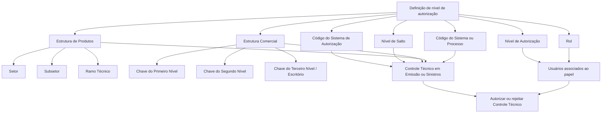

# Especialização dos Níveis de Autorização de Controles Técnicos por Papel de Usuário no Reef.core

## 1. Metadados do Documento
- **Arquivo de Origem:** Não informado; conteúdo bruto extraído de documento de quatro páginas.
- **Tipo de Documento:** Especificação Técnica / Documento Funcional.
- **Domínio / Sistema:** Reef.core; Controles Técnicos; autorização por papel de usuário.
- **Público-Alvo:** Analistas funcionais, arquitetos, desenvolvedores, administradores de usuários e operação.
- **Data/Versão Identificada:** Não identificada.

---

## 2. Resumo Executivo & Contexto de Negócio

O documento descreve a especialização dos níveis de autorização concedidos a papéis vinculados a Controles Técnicos no núcleo do sistema Reef.core. A especialização determina quais papéis e, por consequência, quais usuários associados a esses papéis podem autorizar ou rejeitar Controles Técnicos.

A configuração de autorização é contextualizada por elementos da estrutura de produtos — setor, subsetor e ramo técnico — e pela estrutura comercial — primeiro, segundo e terceiro nível. O documento também considera o sistema ou processo corporativo, como Emissão ou Sinistros, e o nível de salto no qual uma regra de negócio ou Controle Técnico é executado.

Cada atributo de especialização pode receber um código específico ou, em alguns casos, um código genérico. Os códigos genéricos permitem que uma definição seja aplicada a todos os elementos configurados naquele nível hierárquico; códigos específicos restringem a definição a um setor, subsetor, ramo, nível comercial ou escritório concreto.

O Sistema de Autorização é entendido como o departamento da companhia que poderá autorizar o Controle Técnico. Assim, quando a configuração de um Controle Técnico define, por exemplo, Reaseguro como sistema ou departamento de autorização, somente um papel e um usuário cujo nível de autorização permita essa ação podem autorizar ou rejeitar o controle.

O documento referencia outros documentos e catálogos funcionais cuja leitura é recomendada para evitar interpretações isoladas incorretas: Sistemas da Aplicação, Estrutura de Produtos, Estrutura Comercial, Definição de Controles Técnicos e Usuários da Companhia.

---

## 3. Arquitetura, Componentes & Tecnologias Envolvidas

### Componentes e conceitos identificados

| Componente / Conceito | Papel no contexto descrito |
| :--- | :--- |
| **Reef.core** | Núcleo do sistema que permite especializar o nível de autorização atribuído a papéis de Controle Técnico. |
| **Controles Técnicos** | Controles cuja autorização ou rejeição depende da configuração de autorização, do papel e do usuário. |
| **Papel de Controle Técnico** | Papel ao qual é concedido um nível de autorização e ao qual usuários podem estar associados. |
| **Usuários da Companhia** | Usuários associados a papéis; recebem a capacidade operacional decorrente do nível de autorização do papel. |
| **Sistema ou Processo** | Contexto funcional da definição de autorização; exemplos citados: Emissão e Sinistros. |
| **Estrutura de Produtos** | Estrutura formada por setor, subsetor e ramo técnico. |
| **Estrutura Comercial** | Estrutura formada por primeiro, segundo e terceiro nível; o terceiro nível é associado a escritórios. |
| **Nível de Salto** | Local concreto do processo de Emissão ou Sinistros em que uma regra de negócio ou Controle Técnico é executado. |
| **Sistema de Autorização** | Sistema entendido como departamento da companhia que poderá autorizar o Controle Técnico. |
| **Reaseguro** | Exemplo de sistema ou departamento de autorização citado no documento. |

### Fluxo funcional de especialização e autorização



> **Nota de Análise:** O documento não descreve tecnologias de implementação, protocolos, APIs, métodos HTTP, contratos JSON, bancos de dados, URLs, servidores, ambientes ou mecanismos técnicos de persistência.

---

## 4. Regras de Negócio, Especificações Funcionais & Processos

### 4.1 Princípio de especialização

1. O núcleo do Reef.core permite especializar o nível de autorização concedido ao papel de Controle Técnico.
2. A especialização do nível de autorização afeta os usuários associados ao papel de Controle Técnico.
3. A especialização ocorre de acordo com:
   - Sistema ou processo;
   - Nível de salto;
   - Estrutura de produtos;
   - Estrutura comercial.
4. A definição contém um Sistema de Autorização, entendido como departamento da companhia apto a autorizar o Controle Técnico.
5. O nível de autorização específico é associado ao papel e aos usuários da companhia que possuam esse papel atribuído.

### 4.2 Regras para estrutura de produtos

#### Setor

- O atributo **Setor** determina a chave do setor para o qual o nível de autorização do papel está sendo particularizado.
- O código genérico **9999** permite especializar o nível de autorização para todos os setores configurados no sistema.
- O código de um setor específico restringe a especialização exclusivamente ao setor selecionado.

#### Subsetor

- O atributo **Subsetor** determina o código do subsetor para o qual o nível de autorização do papel está sendo especializado.
- O código genérico **9999** permite especializar o nível de autorização para todos os subsetores configurados no sistema.
- O código de um subsetor concreto restringe a especialização exclusivamente ao subsetor selecionado.
- A definição de subsetor deve sempre considerar o valor do atributo Setor presente na estrutura de produtos da própria definição.

#### Ramo técnico

- O atributo **Ramo** determina a chave do ramo técnico para o qual o nível de autorização está sendo especializado.
- O código genérico **999** permite especializar o nível de autorização para todos os ramos técnicos configurados no sistema.
- O código de um ramo técnico específico restringe a especialização exclusivamente ao ramo selecionado.
- A definição de ramo deve sempre considerar os valores de Setor e Subsetor presentes na estrutura de produtos da própria definição.

### 4.3 Regras para nível de salto e sistema/processo

- O **Código do Sistema** indica o sistema ou processo — como Emissão ou Sinistros — no qual a definição do nível de autorização está inserida.
- O **Nível de Salto** determina o local concreto do processo de Emissão ou Sinistros em que a regra de negócio ou Controle Técnico é executado.

> **Nota de Análise:** O documento cita Emissão e Sinistros como exemplos, mas não define códigos, etapas, eventos ou valores possíveis para Sistema e Nível de Salto.

### 4.4 Regras para estrutura comercial

#### Chave do primeiro nível

- A **Chave do Primeiro Nível** contém o código do primeiro nível da estrutura comercial para o qual o nível de autorização do papel está sendo especificado.
- O código genérico **99** permite especializar o nível de autorização para todos os primeiros níveis da estrutura comercial configurada na companhia.
- O código de um nível específico restringe a especialização exclusivamente ao primeiro nível selecionado.

#### Chave do segundo nível

- A **Chave do Segundo Nível** contém o código do segundo nível da estrutura comercial para o qual o nível de autorização do papel está sendo especificado.
- O código genérico **999** permite especializar o nível de autorização para todos os segundos níveis da estrutura comercial configurada na companhia.
- O código de um segundo nível específico restringe a especialização exclusivamente ao segundo nível selecionado.
- A definição do segundo nível deve sempre considerar o valor do Primeiro Nível presente na estrutura comercial da definição.

#### Chave do terceiro nível

- A **Chave do Terceiro Nível** contém o código do terceiro nível da estrutura comercial para o qual o nível de autorização do papel é especializado.
- O código genérico **9999** permite especializar o nível de autorização para todos os escritórios da estrutura comercial da companhia.
- O código de um escritório específico restringe a especialização exclusivamente ao escritório selecionado.
- A definição do terceiro nível deve sempre considerar os valores de Primeiro Nível e Segundo Nível presentes na estrutura comercial da definição.

### 4.5 Regras para papel, sistema de autorização e autorização operacional

- O atributo **Rol** determina a chave do papel no catálogo.
- O **Código do Sistema de Autorização** indica o código do sistema, entendido como departamento da companhia, que poderá autorizar o Controle Técnico.
- Quando um Controle Técnico é configurado para que o sistema ou departamento de autorização seja **Reaseguro**, somente um papel e um usuário cujo nível de autorização permita essa ação podem autorizar ou rejeitar esse Controle Técnico.
- O **Nível de Autorização** determina o nível específico associado ao papel e aos usuários da companhia que possuam o papel atribuído.

### 4.6 Faixa de níveis citada

- Tradicionalmente, as entidades MAPFRE definiram a faixa de níveis de **NIVEL0** até **NIVEL09**.

> **Nota de Análise:** O trecho fornecido é interrompido após a menção à faixa NIVEL0 a NIVEL09. O documento não descreve a semântica individual, a precedência ou as permissões específicas de cada nível.

---

## 5. Tabelas de Parâmetros, Ambientes e Estruturas de Dados

| Item / Parâmetro | Descrição / Função | Tipo / Valores / Formato | Ambiente / Observações |
| :--- | :--- | :--- | :--- |
| Código do Sistema | Indica o código do sistema ou processo no qual a definição do nível de autorização está inserida. | Exemplos citados: Emissão, Sinistros. | O documento não informa códigos concretos. |
| Setor | Determina a chave do setor da estrutura de produtos para especialização da autorização. | Código específico ou genérico `9999`. | `9999` aplica-se a todos os setores configurados no sistema. |
| Subsetor | Determina o código do subsetor da estrutura de produtos para especialização da autorização. | Código específico ou genérico `9999`. | Deve considerar o valor de Setor da definição. |
| Ramo | Determina a chave do ramo técnico para especialização da autorização. | Código específico ou genérico `999`. | Deve considerar os valores de Setor e Subsetor da definição. |
| Nível de Salto | Determina o local concreto do processo em que a regra de negócio ou Controle Técnico é executado. | Não detalhado. | Aplicável ao processo de Emissão ou Sinistros. |
| Chave do Primeiro Nível | Código do primeiro nível da estrutura comercial para especialização da autorização. | Código específico ou genérico `99`. | `99` aplica-se a todos os primeiros níveis configurados na companhia. |
| Chave do Segundo Nível | Código do segundo nível da estrutura comercial para especialização da autorização. | Código específico ou genérico `999`. | Deve considerar o valor de Primeiro Nível da definição. |
| Chave do Terceiro Nível | Código do terceiro nível da estrutura comercial para especialização da autorização. | Código de escritório específico ou genérico `9999`. | `9999` aplica-se a todos os escritórios da estrutura comercial; deve considerar Primeiro e Segundo Nível. |
| Rol | Determina a chave do papel no catálogo. | Não detalhado. | O papel possui um nível de autorização e pode ter usuários associados. |
| Código do Sistema de Autorização | Indica o sistema, entendido como departamento da companhia, que pode autorizar o Controle Técnico. | Exemplo citado: Reaseguro. | Restringe quem pode autorizar ou rejeitar o Controle Técnico. |
| Nível de Autorização | Determina o nível específico associado ao papel e aos usuários associados ao papel. | Faixa tradicional citada: `NIVEL0` a `NIVEL09`. | A semântica de cada nível não é detalhada. |

### Códigos genéricos identificados

| Estrutura | Atributo | Código genérico | Efeito declarado |
| :--- | :--- | :--- | :--- |
| Estrutura de Produtos | Setor | `9999` | Especializa para todos os setores configurados no sistema. |
| Estrutura de Produtos | Subsetor | `9999` | Especializa para todos os subsetores configurados no sistema. |
| Estrutura de Produtos | Ramo técnico | `999` | Especializa para todos os ramos técnicos configurados no sistema. |
| Estrutura Comercial | Primeiro Nível | `99` | Especializa para todos os primeiros níveis configurados na companhia. |
| Estrutura Comercial | Segundo Nível | `999` | Especializa para todos os segundos níveis configurados na companhia. |
| Estrutura Comercial | Terceiro Nível / Escritórios | `9999` | Especializa para todos os escritórios da estrutura comercial da companhia. |

---

## 6. Bateria de Perguntas & Respostas para RAG (FAQ Sintético)

### P1: Qual é a finalidade da especialização de níveis de autorização no Reef.core?
**R:** A especialização permite definir o nível de autorização concedido a um papel de Controle Técnico e, consequentemente, aos usuários associados a esse papel. A definição pode ser contextualizada por sistema ou processo, nível de salto, estrutura de produtos e estrutura comercial.

### P2: Como o código genérico `9999` é usado no atributo Setor?
**R:** No atributo Setor, o código genérico `9999` permite especializar o nível de autorização do papel para todos os setores configurados no sistema. Quando é usado um código de setor específico, a especialização é limitada exclusivamente ao setor selecionado.

### P3: Qual é a dependência entre Subsetor e Setor na configuração de autorização?
**R:** A especialização por Subsetor deve considerar o valor de Setor definido na estrutura de produtos da própria definição. O código genérico `9999` no Subsetor cobre todos os subsetores configurados no sistema, enquanto um código concreto limita a regra ao subsetor selecionado dentro do contexto do Setor definido.

### P4: Qual código genérico deve ser usado para todos os ramos técnicos?
**R:** Para todos os ramos técnicos configurados no sistema, o atributo Ramo utiliza o código genérico `999`. Um código de ramo técnico específico limita a especialização àquele ramo, considerando também os valores de Setor e Subsetor da definição.

### P5: O que representa o Nível de Salto no processo de autorização?
**R:** O Nível de Salto determina o local concreto do processo de Emissão ou Sinistros no qual a regra de negócio ou o Controle Técnico é executado. O documento não apresenta os valores possíveis nem o detalhamento das etapas associadas a cada nível de salto.

### P6: Qual é o código genérico do Primeiro Nível da estrutura comercial?
**R:** O código genérico do atributo Chave do Primeiro Nível é `99`. Esse valor permite especializar o nível de autorização para todos os primeiros níveis da estrutura comercial configurada na companhia.

### P7: Como funciona a especialização do Segundo Nível comercial?
**R:** A Chave do Segundo Nível utiliza o código genérico `999` para abranger todos os segundos níveis da estrutura comercial configurada na companhia. Caso seja usado um código concreto, a especialização vale somente para esse segundo nível e deve considerar o valor do Primeiro Nível definido.

### P8: O que representa o Terceiro Nível da estrutura comercial?
**R:** A Chave do Terceiro Nível contém o código do terceiro nível da estrutura comercial, associado no documento às oficinas ou escritórios da companhia. O código genérico `9999` permite aplicar a especialização a todos os escritórios; um código concreto restringe a regra a um escritório específico, considerando Primeiro e Segundo Nível.

### P9: Quem pode autorizar ou rejeitar um Controle Técnico cujo departamento de autorização é Reaseguro?
**R:** Somente um papel e um usuário cujo nível de autorização permita essa ação podem autorizar ou rejeitar o Controle Técnico. O documento usa Reaseguro como exemplo de sistema ou departamento de autorização configurado para o controle.

### P10: Qual é o papel do Código do Sistema de Autorização?
**R:** O Código do Sistema de Autorização indica o código do sistema entendido como departamento da companhia que poderá autorizar o Controle Técnico. Esse atributo participa da restrição operacional que determina quais papéis e usuários estão aptos a autorizar ou rejeitar o controle.

### P11: Qual faixa de níveis de autorização é mencionada para entidades MAPFRE?
**R:** O documento informa que, tradicionalmente, as entidades MAPFRE definiram a faixa de níveis de `NIVEL0` até `NIVEL09`. O conteúdo fornecido não explica o significado ou as permissões associadas a cada nível.

### P12: Quais documentos funcionais relacionados devem ser consultados para interpretar corretamente esta configuração?
**R:** O documento recomenda a leitura de Sistemas da Aplicação, Estrutura de Produtos, Estrutura Comercial, Definição Controles Técnicos e Usuários da Companhia. A recomendação existe para evitar que a interpretação isolada do documento leve a erros.

---

## 7. Glossário de Termos, Siglas & Conceitos-Chave

- **Reef.core:** Núcleo do sistema no qual é configurada a especialização de níveis de autorização para papéis de Controle Técnico.
- **Controle Técnico:** Controle cuja execução e autorização ou rejeição são abordadas pela configuração descrita.
- **Rol / Papel:** Atributo de catálogo que determina a chave do papel associado ao nível de autorização.
- **Nível de Autorização:** Nível específico associado a um papel e aos usuários da companhia atribuídos a esse papel.
- **Sistema ou Processo:** Contexto funcional da definição de autorização; o documento cita Emissão e Sinistros como exemplos.
- **Sistema de Autorização:** Sistema entendido como departamento da companhia que poderá autorizar o Controle Técnico.
- **Reaseguro:** Exemplo citado de sistema ou departamento de autorização.
- **Setor:** Elemento da estrutura de produtos usado para particularizar a autorização.
- **Subsetor:** Elemento da estrutura de produtos subordinado ao contexto de Setor na definição.
- **Ramo Técnico:** Elemento da estrutura de produtos subordinado aos contextos de Setor e Subsetor na definição.
- **Estrutura Comercial:** Estrutura composta por Primeiro Nível, Segundo Nível e Terceiro Nível.
- **Terceiro Nível:** Nível da estrutura comercial relacionado às oficinas ou escritórios da companhia.
- **Nível de Salto:** Local concreto do processo de Emissão ou Sinistros em que é executada uma regra de negócio ou Controle Técnico.
- **NIVEL0 a NIVEL09:** Faixa de níveis tradicionalmente definida em entidades MAPFRE, sem semântica individual detalhada no conteúdo fornecido.
- **MAPFRE:** Entidades mencionadas no documento como referência para a faixa tradicional de níveis de autorização.

---

## 8. Notas Críticas, Riscos & Limitações

- O documento não informa o nome original do arquivo, autor, versão, data de publicação ou data de vigência.
- Não há detalhamento sobre precedência entre definições genéricas e definições específicas.
- O conteúdo não explica como o sistema resolve conflitos entre múltiplas especializações potencialmente aplicáveis.
- O documento não define valores concretos para Código do Sistema, Nível de Salto, Rol, Código do Sistema de Autorização ou códigos específicos das estruturas.
- Não há descrição de interfaces, APIs, serviços, bancos de dados, regras de persistência, URLs, servidores, ambientes ou mecanismos de auditoria.
- A semântica e os critérios operacionais de cada nível entre `NIVEL0` e `NIVEL09` não são apresentados.
- A seção “Perguntas frequentes” fornecida contém somente o início da primeira pergunta e sua resposta parcial.
- A interpretação correta depende da consulta aos documentos relacionados: Sistemas da Aplicação, Estrutura de Produtos, Estrutura Comercial, Definição Controles Técnicos e Usuários da Companhia.
- O texto extraído contém elementos aparentes de navegação ou interface — `CF`, `Home`, `Solutions`, `APIs`, `Documentation`, `Zeus`, `EN` — sem explicação funcional no documento; eles foram preservados no conteúdo bruto para fidelidade, mas não foram tratados como requisitos técnicos.

---

## 9. Conteúdo Bruto Estruturado (Referência Fiel)

```text
--- [PÁGINA 1 DE 4] ---

ESPECIALIZACIÓN de los NIVELES de
AUTORIZACIÓN de los Controles Técnicos por
ROL de Usuario
En el ámbito funcional de los Controles Técnicos en Reef.core el núcleo del Sistema cuenta con la
posibilidad de especializar el nivel de Autorización otorgado al Rol de control técnico (y por ende a
los usuarios que este tenga asociados) de acuerdo con el sistema, el nivel de salto y las estructuras
de productos y comercial.
Propiedades Generales
Propiedades Generales
Código del Sistema
Esta propiedad indica el código del Sistema o Proceso (Emisión, Siniestros,...) en el que se inscribe
la definición del nivel de autorización.
Sector
Esta propiedad determina la clave del sector en el que se está particularizando el nivel de
autorización del rol.
 / 
 CF
Home Solutions APIs Documentation Zeus
EN


--- [PÁGINA 2 DE 4] ---

Utilizando el valor genérico en este atributo (código 9999) el sistema permite especializar el nivel
de autorización del rol para todos los sectores configurados en el sistema o bien, al utilizar el
código de un sector en particular de los n existentes, especializar el nivel de autorización del rol
exclusivamente para este.
Sub-Sector
Este atributo determina a su vez el código del sub-sector para el que se está especializando el nivel
de autorización del rol.
Utilizando el valor genérico en este atributo (código 9999) el sistema permite especializar el nivel
de autorización del rol para todos los subsectores configurados en el sistema o bien, al utilizar el
código de un subsector en concreto de los existentes, especializar el nivel de autorización del rol
exclusivamente para este (teniendo siempre en consideración el valor del atributo del sector de
la estructura de productos que tenga la definición)
Ramo
Esta propiedad determina la clave del Ramo Técnico para el que se está especializando el nivel de
autorización.
Utilizando el valor genérico en este atributo (código 999) el sistema permite especializar el nivel de
autorización del rol para todos los ramos técnicos configurados en el sistema o bien, al utilizar
el código de un ramo técnico en particular de los existentes, especializar el nivel de autorización
del rol exclusivamente para este (teniendo siempre en consideración el valor de los atributos del
sector y subsector de la estructura de productos que tenga la definición)
Nivel de Salto
Este atributo determina el lugar concreto del proceso de emisión o siniestros en donde se ejecuta la
regla de negocio o control técnico.
Clave del Primer Nivel
Este atributo contiene el código del primer nivel de la estructura comercial para el que se está
especificando el nivel de Autorización del rol.
Consejo:
Consejo:
Consejo:


--- [PÁGINA 3 DE 4] ---

Utilizando el valor genérico en este atributo (código 99) el sistema permite especializar el nivel de
autorización del rol para todos los primeros niveles de la estructura comercial configurada en la
compañía o bien, al utilizar el código de un nivel en concreto de los n existentes especializar el
nivel de autorización del rol exclusivamente para este.
Clave del Segundo Nivel
Este atributo contiene el código del segundo nivel de la estructura comercial para el que se está
especificando el nivel de Autorización del rol.
Utilizando el valor genérico en este atributo (código 999) el sistema permite especializar el nivel
de autorización del rol para todos los segundos niveles de la estructura comercial configurada en
la compañía o bien, al utilizar el código de un segundo nivel en concreto de los n existentes
especializar el nivel de autorización del rol exclusivamente para este (teniendo siempre en
consideración el valor del atributo del primer nivel de la estructura comercial de la definición)
Clave del Tercer Nivel
Este atributo contiene el código del tercer nivel de la estructura comercial para el que se está
especializando el nivel de Autorización otorgado al rol.
Utilizando el valor genérico en este atributo (código 9999) el sistema permite especializar el nivel
de autorización del rol para todas las oficinas de la estructura comercial de la compañía o bien, al
utilizar el código de una oficina en particular (de las n existentes) especializar el nivel de
autorización del rol exclusivamente para ella (teniendo siempre en consideración el valor de los
atributos del primer y segundo nivel de la estructura comercial que tenga la definición)
Rol
Este Atributo del catálogo determina la clave del Rol
Código del Sistema de Autorización
Esta propiedad indica el código del Sistema (entendido como Departamento de la compañía) que
podrá autorizar el control técnico.
Consejo:
Consejo:
Consejo:


--- [PÁGINA 4 DE 4] ---

De esta manera un control técnico cuya configuración determine que el sistema o departamento de
autorización sea de Reaseguro, únicamente podrá ser autorizado o rechazado por un rol y usuario
cuyo nivel de autorización así lo posibilite.
Nivel de Autorización
Este atributo finalmente determina el nivel de autorización específico que va a tener asociado el rol y
los usuarios de la compañía que este tenga asignados.
Vínculos
Relación de Directrices y Documentos funcionales cuya lectura recomendada para evitar que la
interpretación aislada del presente documento pueda conducir a error.
Sistemas de la Aplicación
Estructura de Productos
Estructura Comercial
Definición Controles Técnicos
Usuarios de la Compañía
Preguntas frecuentes
(1) ¿Existe alguna circunstancia operativa que deba ser tomada en consideración sobre este
catálogo?
Tradicionalmente se han definido en las Entidades MAPFRE el rango de niveles: NIVEL0 al NIVEL09
```
